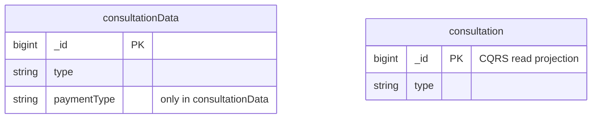

# MongoDB Documentation Skill

Conventions and workflow for documenting the `videoclinic` MongoDB schema in `specs/mongodb-mapping/`.

---

## 1. File Layout

Every domain file in `specs/mongodb-mapping/` follows this structure:

```
# <Domain Name>

[← Back to Index](./README.md)

Short description of what this domain covers.

---

## ER Diagram

<one-line description>

```mermaid
erDiagram
    ...
```

---

## Entities in This Category

| Table Name (DBML) | Business Entity | Description Summary |
...

---

## Entity: <German Name> (<English Name>)
<German business description in one sentence.>

### Table: <collectionName>
| Column | Type | Field Type | Description |
...

The `<collectionName>` entity is referenced by:
- ...

### Sub-entities for <collectionName>

#### Sub-entity: <SubEntityName>
<German description.>

| Column | Type | Field Type | Description |
...

The `<SubEntityName>` sub-entity is used within:
- ...
```

### Naming conventions

| Concept | Convention | Example |
|---|---|---|
| MongoDB collection | `camelCase` | `appointmentPlan`, `consultationData` |
| Embedded sub-document type | `PascalCase` | `ConsultationDoctor`, `PlanLocation` |
| Field names | `camelCase` as stored in MongoDB | `dateCreated`, `bookNumber` |
| Section anchors | Auto-generated by heading text; use **German heading** in `##/###` level for consistency | `## Entity: Konsultationen (CQRS Read Projection)` |

### No Java implementation references

`_class` fields are documented as **Laufzeitklassen-Marker** — they describe the runtime value stored in MongoDB, not the Java class. Remove any mention of `Java Klassenname:`, DAO method names, Spring annotations, or class paths from narrative text. Narrative blocks must describe **only observable database facts**.

Correct:
```
| `_class` | `String` | schema | Laufzeitklassen-Marker: `de.videoclinic.model.Consultation` |
```

Incorrect:
```
| `_class` | `String` | schema | Java Klassenname: `de.videoclinic.model.Consultation` (Used) |
```

### No `Model` column in entity index tables

Remove the `Model (de.videoclinic.model.*)` column from every entity index table in both domain files and `README.md`. It is Java-specific and has no database-observable meaning. The `_class` field row inside the table already captures the runtime class value.

---

## 2. Field Type Classification

Every field in a collection or sub-entity document falls into exactly one of three categories:

| Field Type | Meaning | How to identify |
|---|---|---|
| `schema` | Field is part of the declared data model; value is always present or null by design | Confirmed in model code or always present in MongoDB samples |
| `snapshot` | Denormalized embedded copy of selected fields from another collection, written at save time | The embedded `_id` matches a document in a separate collection |
| `inferred` | Field observed in live MongoDB samples but not confirmed in the schema | Only seen via MCP queries; absent in model code |

Use the **Field Type** column in every table. Never leave it blank.

---

## 3. Denormalized Snapshot Documentation

A **denormalized snapshot** stores a frozen copy of selected fields from a source collection at write time. It is the primary cross-collection linking mechanism in this document database — not foreign keys.

### 3.1 Inline field row format

Every snapshot field in a table must carry both the source collection reference and the sub-entity link:

```markdown
| `doctor` | `Document` | snapshot | Durchführender Experte (denormalized snapshot of [`user`](./user-management.md#entity-experte-expert)) ([ConsultationDoctor](./user-management.md#sub-entity-consultationdoctor)) |
```

Pattern:
```
(denormalized snapshot of [`<source-collection>`](<link-to-entity>)) ([<SubEntityName>](<link-to-sub-entity>))
```

For slim variants (missing one or more fields compared to the canonical sub-entity), append:
```
(fields: `_id`, `name`, `email`)
```

### 3.2 Sub-entity section format

Every distinct snapshot shape must have a `#### Sub-entity: <Name>` section in the domain file where it is **first defined**. Sub-entities shared across domains are defined in `user-management.md` and cross-referenced elsewhere.

```markdown
#### Sub-entity: ConsultationDoctor

Denormalisierter Snapshot eines Experten ([user](./user-management.md#entity-experte-expert)).

| Column | Type | Field Type | Description |
| :--- | :--- | :--- | :--- |
| `_id` | `Long` | snapshot | Referenz-ID auf [user](./user-management.md#entity-experte-expert) |
| `name` | `String` | snapshot | Name des Experten |
| `email` | `String` | snapshot | E-Mail-Adresse |
| `formalDisplayName` | `String` | snapshot | Vollständiger Name mit Titel |

The `ConsultationDoctor` sub-entity is used within:
- [`consultationData`](./treatment.md#entity-konsultationsdaten-consultation-data) (as `doctor`)
- [`consultation`](./treatment.md#entity-konsultationen-cqrs-read-projection) (as `doctor` — read-only projection)
```

### 3.3 Slim snapshot variants

When a snapshot in a specific context carries **fewer fields** than the canonical sub-entity, document it as a variant within the same sub-entity section:

```markdown
> **Slim variant** — `changedBy`, `createdBy`, `reportingExpert` use only `_id`, `name`, `email` (no `formalDisplayName`).
```

### 3.4 Snapshot integrity rule

Snapshots are **written once and never updated**. Document this as a consequence in the sub-entity section when relevant:

> Historical values in snapshots may differ from the current state of the source document (e.g., if `user.name` was changed after the snapshot was written).

### 3.5 Full embedded snapshot vs DBRef

| Pattern | Field Type | Example |
|---|---|---|
| `Document` containing a copy of fields | `snapshot` | `doctor: { _id: 62, name: "..." }` |
| `DBRef` pointer with `$ref` + `$id` | `schema` (reference) | `signedOffBy: { "$ref": "user", "$id": 62 }` |
| Numeric foreign key | `schema` (inferred from naming) | `appointmentId: 4718` |

Never document a full embedded document as `DBRef`. Verify in MongoDB MCP before classifying.

---

## 4. CQRS-Lite Dual Collection Pattern

### Detection

When two collections share the **same `_class` value**, this is a strong signal for the **CQRS-lite Vertical Partitioning** pattern:

1. Query both collections for `_class`:
   ```js
   db.collection1.findOne({}, { _class: 1 })
   db.collection2.findOne({}, { _class: 1 })
   ```
2. If both return the same value → confirm 1:1 relationship by checking if `_id` values match.
3. Check indexes: the read projection should have a compound index for list queries; the source of truth should have only `_id`.
4. Check storage sizes: the source of truth is larger (contains more sub-documents).

### Documentation pattern

**Source of truth** entity note:
```markdown
> **CQRS-lite Pattern — Source of Truth**: `<collection>` is the **source of truth** for all writes. Every field written here is also reflected in [`<projection>`](#...), except `<field>` which exists only in this collection. Only a `_id` index exists; records are always retrieved individually by primary key.
```

**Read projection** entity note:
```markdown
> **CQRS-lite Pattern — Dual Collection**
>
> `<projection>` and [`<source>`](#...) form a **synchronized pair** with a strict 1:1 relationship (matching `_id` values).
> - [`<source>`](#...) is the **source of truth** for all writes.
> - `<projection>` is a **read-only projection** — all fields originate from [`<source>`](#...) and must not be written to directly.
> - `<projection>` carries a **compound index on `{ <fields> }`** for efficient list queries.
>
> Storage: `<projection>` ≈ X MB · [`<source>`](#...) ≈ Y MB.
```

**Read projection table**: add an `Origin (source-collection)` column listing the source field name for every row. Mark fields that are part of the compound index inline.

**Entities index table**: label the read projection row with `(CQRS Read Projection)` in the Business Entity column and note the missing field in the Description.

---

## 5. ER Diagram Conventions

Use the `mermaid-diagrams` skill for all ER diagram creation and editing.

### Key rules

- `camelCase` entity names = MongoDB collections
- `PascalCase` entity names = embedded sub-documents (not collections)
- Relationship label `"snapshot X"` for denormalized snapshot fields; `"embeds X"` for structural embedded sub-documents; `"references"` for numeric FK; `"DBRef"` for `$ref/$id` pointer
- Show only key fields in the ER diagram (skip `_class`, `version`, audit fields like `dateCreated`)
- Annotate snapshot `_id PK` with `"snapshot: <source-collection-name>"`
- Use `||--||` for 1:1 embeds/snapshots; `||--o{` for arrays; `}o--||` for many-to-one references

### CQRS pair representation



Show both collections in the same ER diagram. Use the `"CQRS read projection"` annotation on `_id PK`. Add `"only in <source>"` annotation on fields that exist exclusively in the source of truth.

---

## 6. Enum Deep-Analysis Workflow

When performing a deep analysis of a collection's enum fields, use the MongoDB MCP server.

### Step 1 — Discover string fields

```js
// Sample documents to find string fields with bounded value sets
db.<collection>.findOne()
```

### Step 2 — Count distinct values per field

For each candidate string field, run:

```js
db.<collection>.aggregate([
  { $group: { _id: "$<fieldName>", count: { $sum: 1 } } },
  { $sort: { count: -1 } }
])
```

### Step 3 — Document in the field table

In the field description, list all observed values with their counts:

```markdown
| `state` | `String` | schema | Status:<br>• `CLOSED` (Used — 45,234)<br>• `OPEN` (Used — 12,089)<br>• `VERIFIED` (Used — 3,200)<br>• `LEGACY_VALUE` (Legacy/Orphan — 12 records) |
```

Label values:
- `(Used — N)` — active, N > threshold (e.g. > 50)
- `(Legacy/Orphan — N)` — present in data but expected to be inactive; N is small
- `(HTML-only)` — value exists only in UI/HTML, never observed in DB

### Step 4 — Update README.md Enumeration Overlaps section

After analysing all collections in a domain, update the centralized `README.md#enumeration-overlaps-and-redundancies` section:

- **Identical Overlaps**: collections sharing exactly the same set of enum values
- **Subset Overlaps**: one collection's enum is a subset of another's
- **Single-Value Redundancies**: fields that only ever hold one value in practice

---

## 7. Cross-Reference Validation

After editing any domain file, validate all internal anchor links with the GitHub-accurate algorithm:

```python
import re

def github_anchor(text):
    result = []
    for ch in text.lower():
        if ch.isalnum() or ch in ('-', '_') or (ord(ch) > 127):
            result.append(ch)
        elif ch == ' ':
            result.append('-')
    return ''.join(result)
```

Key pitfalls:
- Headings with German umlauts (ä/ö/ü/ß) generate anchors that preserve the umlaut character — do **not** strip them
- ` / ` (space-slash-space) generates a double-hyphen `--` in the anchor
- Punctuation (`:`, `(`, `)`, `.`) is stripped entirely

For every `[text](#anchor)` link, verify the anchor matches an actual heading in the file.

Also validate **cross-file links** (`[text](./other.md#anchor)`) by confirming the target heading exists in the referenced file.

---

## 8. README.md Centralized Reference

`specs/mongodb-mapping/README.md` is the **index and pattern registry** for the entire schema. Keep it updated with:

### 8.1 Domain tables

One table per domain section. Columns: **Table Name (DBML)** | **Business Entity** | **Description Summary**. No `Model` column.

### 8.2 Enumeration Overlaps

Populated by the enum deep-analysis workflow (Section 6). Must reference the involved collections by link.

### 8.3 Shared Sub-Entities Reference

A table listing every PascalCase sub-entity that is reused across multiple domains, with its source collection and embedded fields:

| Sub-entity | Source collection | Embedded fields | Domains |
|---|---|---|---|
| `ConsultationDoctor` | `user` | `_id`, `name`, `email`, `formalDisplayName` | treatment, news, external-data |
| `ConsultationJob` | `jobId` | `_id`, `code`, `color`, `expertTitle`, `remoteCode`, `title`, `type` | treatment, planning, accounting |

Update this table whenever a new snapshot sub-entity is discovered or an existing one gains a new consumer.

### 8.4 CQRS Pair Registry

A section listing all known CQRS dual-collection pairs:

| Source of Truth | Read Projection | Shared `_class` | Fields only in source | Index on projection |
|---|---|---|---|---|
| `consultationData` | `consultation` | `de.videoclinic.model.Consultation` | `paymentType` | `{ period: 1, "location._id": 1 }` |

---

## 9. Walk-Through Plan

Process all mapping files in **domain dependency order** — upstream collections (referenced by many others) before downstream consumers.

### Phase 1 — Shared snapshot sources (highest reuse)

These collections are the **source** of the most widely used snapshots. Documenting them first anchors cross-references in all later files.

- [ ] `user-management.md` — `user`, `group`, `accessRight`; defines `ConsultationDoctor`, `PlanUser` snapshot sub-entities
- [ ] `customer.md` — `customer`, `location`; defines `ConsultationCustomer`, `ConsultationLocation`, `PlanCustomer`, `PlanLocation`

### Phase 2 — Planning backbone

- [ ] `planning.md` — `appointmentPlan`, `shiftPlan`, `appointment`, `expertWeek`, `expertDays`, `holiday`, `room`

### Phase 3 — Core medical domain

- [ ] `treatment.md` — `consultationData`/`consultation` (CQRS pair), `treatment`, `patient`, `patientAlerts`, `questionaire` ✅ **partially done**
- [ ] `capabilities.md` — `skill`

### Phase 4 — Accounting and services

- [ ] `accounting.md` — `invoice`, `invoiceComponent`, `jobId`, `expertWorkMonthly`, `product`

### Phase 5 — External / reference data

- [ ] `external-data.md` — `icd10`, `medication`, `cDRCall`, `cDRCallAssignment`
- [ ] `interfaces.md` — `basisWebData`, `basisWebAppointment`

### Phase 6 — Communication and system

- [ ] `news.md` — `notification`, `notificationTemplate`, `messageOfTheDay`
- [ ] `system.md` — `log`, `asyncJobQueue`, `exportTemplate`, `sequenceEntity`
- [ ] `academy.md` — `video`, `userVideoHistory`

### Phase 7 — Deprecated

- [ ] `deprecated.md` — `tag`, `project`, `department`

### Phase 8 — README.md centralized update

- [ ] Remove `Model` column from all domain tables in `README.md`
- [ ] Update `Shared Sub-Entities Reference` table
- [ ] Add `CQRS Pair Registry` section
- [ ] Verify and expand `Enumeration Overlaps` section with counts from MongoDB MCP

---

## 10. Per-File Checklist

For each file in the walk-through, apply this checklist:

- [ ] **ER diagram** — present, uses `mermaid` (not `mermaidddd`), correct `camelCase`/`PascalCase` naming, relationship labels match the conventions in Section 5
- [ ] **Entities index table** — no `Model` column; CQRS projections labelled; description column populated
- [ ] **Collection tables** — every field has a `Field Type` column value; no blank Field Type
- [ ] **`_class` rows** — use `Laufzeitklassen-Marker:` prefix; no `Java Klassenname:` text
- [ ] **Same `_class` check** — if two collections share `_class`, detect CQRS-lite pattern and document per Section 4
- [ ] **Snapshot fields** — inline description follows the format in Section 3.1; linked sub-entity section exists per Section 3.2
- [ ] **Sub-entity `used within` lists** — every consumer collection is listed (including CQRS projection if applicable)
- [ ] **Enum fields** — all distinct values listed with occurrence counts from MongoDB MCP
- [ ] **Broken anchor links** — validated with the GitHub anchor algorithm (Section 7)
- [ ] **Cross-file links** — verified target headings exist
- [ ] **Implementation references** — no DAO names, Java method names, or Spring annotations in narrative text
