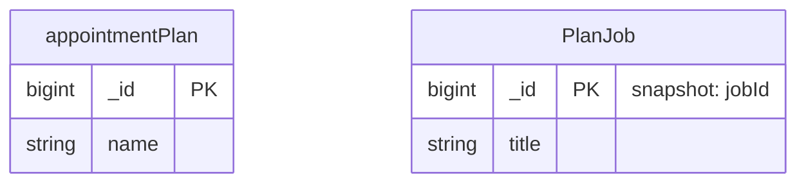
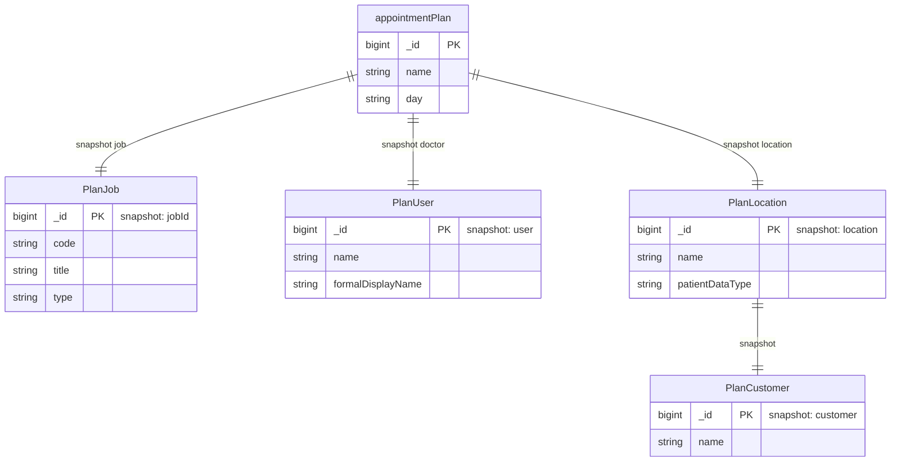

# MongoDB Mermaid Modeling

Guidelines for representing MongoDB document schemas as Mermaid ER diagrams, derived from the Videoclinic DBML schema and `specs/mongodb-mapping/` domain mapping files.

---

## Core Concepts

### 1. Collections vs Sub-entities

MongoDB stores data in **collections** (analogous to SQL tables) but documents within a collection can embed **sub-documents** (nested objects or arrays) instead of using foreign keys.

In the DBML schema:
- **camelCase `Table` names** = actual MongoDB collections (`user`, `appointmentPlan`, `treatment`)
- **PascalCase `Table` names** = embedded sub-document types (`UserProfile`, `ConsultationDoctor`, `PlanLocation`)

PascalCase sub-entities are **not collections** — they have no independent existence in the database. They live inside parent documents.

### 2. Field Type Classifications

Every field in a MongoDB collection document falls into one of three categories:

| Type | Meaning | Example |
|---|---|---|
| `schema` | Regular typed field stored directly in the document | `name String`, `state String`, `dateCreated Date` |
| `snapshot` | Denormalized embedded copy of selected fields from another collection | `doctor Document` (copy of `user` fields) |
| `inferred` | Field observed in real data samples but not confirmed in the schema definition | Fields only seen via MongoDB queries, not model code |

When reading a field table in a `specs/mongodb-mapping/<domain>.md` file, always check the **Field Type** column to understand whether a `Document` field is a structural embed or a snapshot.

### 3. The `__ref_snapshot_*_id` Naming Convention

In the DBML file, when a field stores a **denormalized snapshot** of another collection, it is named using the pattern:

```
__ref_snapshot_<role>_id
```

Examples:
- `__ref_snapshot_doctor_id` → snapshot of `user`, playing the role of "doctor"
- `__ref_snapshot_job_id` → snapshot of `jobId`, playing the role of "job"
- `__ref_snapshot_location_id` → snapshot of `location`
- `__ref_snapshot_customer_id` → snapshot of `customer`
- `__ref_snapshot_created_by_id` → snapshot of `user`, playing the role of "creator"

The actual stored value is a **`Document`** (embedded object), not a plain numeric ID. The `_id` suffix is part of the naming convention only — it does not mean the field stores only an ID.

In `specs/mongodb-mapping/<domain>.md`, the same field may appear without the `__ref_snapshot_` prefix (using the business name like `doctor`, `job`, `location`) because the mapping document uses the Java model name, not the DBML convention.

### 4. Denormalized Snapshot Pattern

When a document "references" data from another collection, it may store a **partial copy** of that data instead of (or in addition to) a numeric foreign key.

**Why snapshots exist:**
- **Historical consistency**: the snapshot is frozen at write time. If the source document changes later (e.g., a user's name changes), the snapshot retains the original value at the time of the record.
- **Read performance**: no join or lookup is needed; data is co-located with the owning document.

**Shape variation by context**: the same source entity can produce differently-shaped snapshots depending on the consuming context:

| Source | Snapshot A | Snapshot B | Difference |
|---|---|---|---|
| `user` | `ConsultationDoctor` | `PlanUser` | Same fields, different naming — two independent contexts |
| `jobId` | `ConsultationJob` | `PlanJob` | Identical fields, different naming — each context owns its copy |
| `location` | `ConsultationLocation` | `PlanLocation` | Each also embeds a customer snapshot |

### 5. Multi-Level Nesting

Snapshots can themselves contain embedded documents or further snapshots:

```
appointmentPlan
└── location (PlanLocation — snapshot of location)
    └── customer (PlanCustomer — snapshot of customer)
```

```
consultationData
└── standard (ConsultationStandard — structural embed)
    └── medicationAnamnesis (ConsultationMedicationAnamnesis — structural embed)
    └── diagnosis[] (ConsultationDiagnosis[] — structural array)
        └── icd10 (__ref_snapshot_icd10_id — snapshot of icd10)
```

Multi-level nesting means a snapshot field at one level may itself embed another snapshot at a deeper level. Always trace the full chain when reconstructing the original data lineage.

### 6. Two Kinds of Embedded Documents

Not all embedded documents are snapshots. There are two kinds:

**Structural embeds** — intrinsic sub-documents that only exist as part of the parent:
- `user.userProfile` → `UserProfile` (personal profile data, not a snapshot of another collection)
- `consultationData.base` → `ConsultationBase` (base medical data, not from another collection)
- `invoice.positions[]` → `InvoicePosition[]` (line items, not from a separate collection)

**Denormalized snapshot embeds** — copies of fields from another real collection:
- `appointmentPlan.doctor` → `PlanUser` (snapshot of `user`)
- `treatment.job` → `ConsultationJob` (snapshot of `jobId`)
- `consultationData.location` → `ConsultationLocation` (snapshot of `location`)

**Rule of thumb**: if the `_id` inside the embedded document matches a document in another collection, it is a snapshot. If the `_id` is a generated key with no external counterpart, it is a structural embed.

---

## Mermaid ER Representation

### Entity Naming



### Relationship Labels

Use relationship labels to communicate the MongoDB-specific semantics:

| Mermaid label | Semantics |
|---|---|
| `"references"` | Numeric ID foreign key stored in the document field |
| `"DBRef"` | MongoDB `DBRef` pointer object |
| `"embeds"` | Inline structural nested document (1:1, not a snapshot) |
| `"embeds[]"` | Array of structural nested documents (1:N) |
| `"snapshot"` | Denormalized copy of source entity fields (1:1) |
| `"snapshot[]"` | Array of denormalized copies |

### Cardinality Conventions

| Pattern | Use case |
|---|---|
| `\|\|--\|\|` | One-to-one embed or snapshot |
| `\|\|--o{` | One-to-many embed (array of sub-docs) |
| `}o--\|\|` | Many documents reference one collection |
| `}o--o\|` | Optional FK reference |
| `}o--o{` | Many-to-many DBRef arrays |

### Full Example



---

## Diagram Organization Strategy

For large schemas (50+ collections), organize diagrams by **domain group** rather than producing one monolithic diagram.

Recommended domain groups for the Videoclinic schema:
1. **Customer** — `customer`, `location`, `locationType`, `site`, `room`
2. **Planning** — `appointmentPlan`, `shiftPlan`, `appointment`, `appointmentAssignment`, `expertWeek`, `expertDays`, `holiday`
3. **Capabilities** — `skill`, `SkillRule`, `SkillAssignment`
4. **User Management** — `user`, `group`, `accessRight`, `userFile`, `persistentSession`, `onboardingHistory`, `onboardingStep`
5. **Treatment** — `treatment`, `consultationData`, `consultation`, `patient`, `patientAlerts`, `questionaire`
6. **Academy** — `video`, `videoCategory`, `userVideoHistory`
7. **News** — `notification`, `notificationTemplate`, `messageOfTheDay`, `loginNotification`
8. **Interfaces** — `basisWebData`, `basisWebAppointment`
9. **External Data** — `icd10`, `medication`, `zipCodeLookup`, `country`, `publicHoliday`, `cDRCall`, `cDRCallAssignment`
10. **Accounting** — `invoice`, `invoiceComponent`, `invoiceReceiver`, `expertWorkMonthly`, `jobId`, `jobPriceList`, `product`, `stornoGroup`
11. **System** — `log`, `asyncJobQueue`, `exportTemplate`, `cacheState`, `sequenceEntity`
12. **Deprecated** — `tag`, `project`, `department`

Each domain diagram should include:
- All collections in the domain (key fields only — skip audit fields `dateCreated`, `_class`, `version`)
- Domain-specific sub-entities with snapshot source annotated in the `_id` comment
- Cross-domain FK/DBRef references (entity can appear without a field block)
- A **Shared Sub-entities Reference** table at the end of the file documenting all reused snapshot types

---

## Common Pitfalls

1. **Confusing a snapshot with a FK**: `__ref_snapshot_doctor_id` stores a full embedded document, not just an ID. The `_id` suffix is a naming artifact from the DBML convention.

2. **Assuming snapshots stay current**: snapshots are written once and never updated. If `user.name` changes, existing snapshots in `appointmentPlan.doctor.name` retain the old value.

3. **Treating PascalCase tables as collections**: `ConsultationDoctor`, `PlanJob`, etc. are not queryable collections. They have no indexes and cannot be accessed independently.

4. **Missing nested snapshots**: `ConsultationLocation` embeds `ConsultationCustomer`. When reading a location snapshot, the customer name inside it is also a frozen copy.

5. **Duplicate relationship lines in Mermaid ER**: When the same entity plays two roles (e.g., `notification.from` and `notification.to` both reference `ConsultationDoctor`), combine into one relationship line with a combined label: `notification ||--o{ ConsultationDoctor : "embeds from/to"`.

6. **Entity name conflicts**: Each `erDiagram` block is independent — sub-entity names like `ConsultationJob` can be redefined in each domain diagram without conflict.
