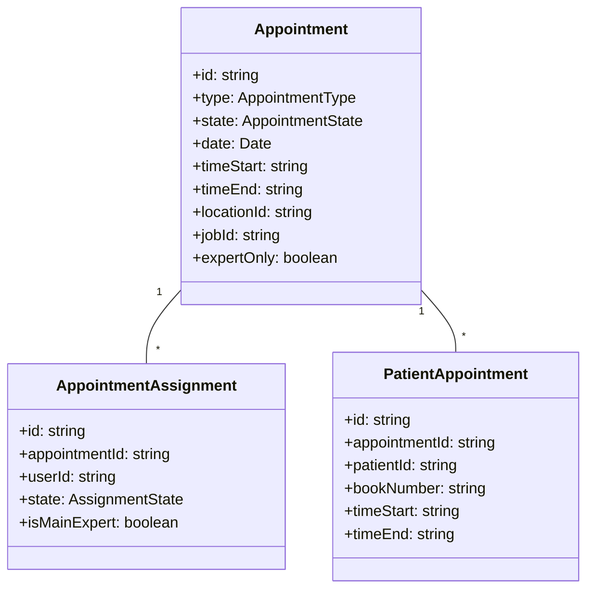
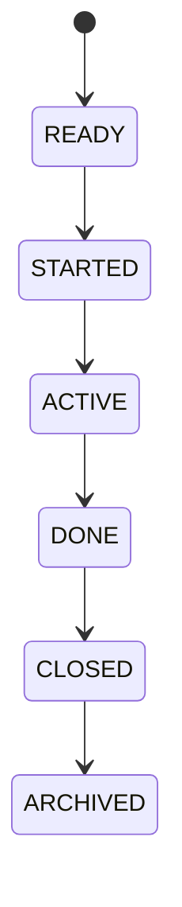
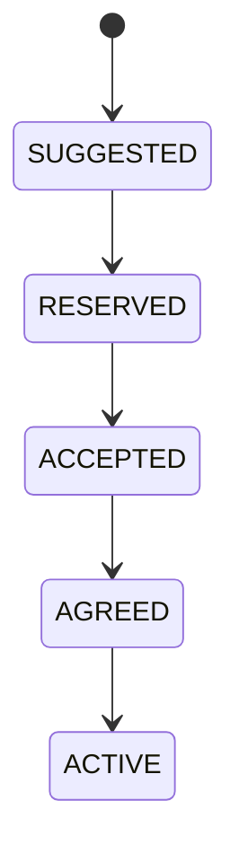

# Technical Documentation & Specification Improvements

> **Purpose**: Recommendations for structured, maintainable documentation  
> **Date**: 2026-03-31  
> **Context**: Brownfield application migration to React + TanStack Start

---

## 1. Unified Naming Convention ⭐ NEW

### Problem

Analysis documents and wireframes use **different naming conventions**, requiring mental mapping:

| Analysis | Wireframe | Issue |
|----------|-----------|-------|
| `appointments/list.md` | `appointment-list.png` | Redundant prefix |
| `consultations/standard-form.md` | `consultation-details-standard.png` | Completely different |
| `dashboard/standard.md` | `calendar.png` | No correlation |

### Solution: Unified Base Names

**Rule**: Wireframe files use the **exact same base name** as their analysis counterpart:

| Domain | Analysis File | Wireframe File | Cross-Reference |
|--------|---------------|----------------|-----------------|
| appointments | `list.md` | `list.png` | `./list.md` ↔ `./list.png` |
| appointments | `details.md` | `details.png` | Same base name |
| consultations | `standard-form.md` | `standard-form.png` | Same base name |
| consultations | `onboarding-form.md` | `onboarding-form.png` | Same base name |
| dashboard | `standard.md` | `standard.png` | Same base name |
| dashboard | `admin.md` | `admin.png` | Same base name |

**Implementation**:
```bash
# Updated migration script will rename:
mv appointment-list.png list.png
mv appointment-details.png details.png
mv consultation-details-standard.png standard-form.png
mv calendar.png standard.png  # Match dashboard/standard.md
```

**Benefits**:
- ✅ Instant visual correlation
- ✅ Simpler automation scripts
- ✅ Easier Cmd+P search
- ✅ Reduced cognitive load
- ✅ Self-documenting structure

---

## 2. Additional Documentation Types

### 2.1 Entity Relationship Diagrams

**Location**: `specs/domains/{domain}/entity-model.md`

```markdown
# Appointments Domain - Entity Model

## Core Entities



## State Machines

### Appointment State Machine (12 states)



### Assignment State Machine (12 states)



## Field Dictionary

| Field | Type | Required | Validation | i18n Key |
|-------|------|----------|------------|----------|
| `type` | enum | Yes | APPOINTMENT\|SHIFT\|COUNCIL\|TREATMENT | `appointment.type` |
| `state` | enum | Yes | 12 valid states | `appointment.state` |
| `expertOnly` | boolean | No | Default: false | `appointment.expertOnly` |
```

---

### 2.2 Permission/RBAC Matrix

**Location**: `specs/permissions/rbac-matrix.md`

```markdown
# Role-Based Access Control Matrix

## Roles

| Role | Description | Users |
|------|-------------|-------|
| STANDARD | Clinical staff | Doctors, therapists |
| LEITER_INTERN | Internal manager | Department heads |
| ADMIN_INTERN | Internal admin | IT, operations |
| ADMIN | System admin | System administrators |
| KUNDE | Customer | External clients |
| ADMIN_KUNDE | Customer admin | Client administrators |

## Module Permissions

| Module | STANDARD | LEITER_INTERN | ADMIN_INTERN | ADMIN | KUNDE | ADMIN_KUNDE |
|--------|----------|---------------|--------------|-------|-------|-------------|
| Dashboard | ✅ | ✅ | ✅ | ✅ | ✅ | ✅ |
| Appointments | ❌ | ✅ | ✅ | ✅ | ❌ | ❌ |
| Consultations | ✅ | ✅ | ❌ | ✅ | ❌ | ❌ |
| Customers | ❌ | ✅ | ✅ | ✅ | ❌ | ✅ |
| Administration | ❌ | ✅ | ✅ | ✅ | ❌ | ❌ |

## Permission Gates (Fine-Grained)

| Permission | Used By | UI Elements Affected |
|------------|---------|---------------------|
| `SELF_ASSIGNMENT` | STANDARD | Self-service dashboard, appointment requests |
| `APPOINTMENT_ADHOC` | LEITER_INTERN, ADMIN | Ad-hoc appointment button |
| `NOTIFICATION_READ` | All with notifications | Notifications menu item |
| `EXPERT_WEEK` | STANDARD | Week view tab in dashboard |
| `USERS_CREATE` | LEITER_INTERN, ADMIN | Role switch button, user management |
```

---

### 2.3 i18n Inventory

**Location**: `specs/i18n/translation-inventory.md`

```markdown
# Translation Inventory & Hardcoded Strings

## Translation File Structure

```
web/src/main/resources/
├── ApplicationResources.properties (English default)
├── ApplicationResources_de.properties (German)
├── BaseResources.properties (Framework English)
└── BaseResources_de.properties (Framework German)
```

## Hardcoded German Strings Found

**Priority: HIGH** - These need i18n keys created:

| Location | German String | Suggested Key | Context |
|----------|---------------|---------------|---------|
| `appointment/list.md` | "Termin hinzufügen" | `appointment.action.add` | Add button |
| `appointment/details.md` | "Expert nur" | `appointment.expertOnly` | Checkbox label |
| `consultations/standard-form.md` | "Vorerkrankungen" | `consultation.preexistingConditions` | Section header |
| `dashboard/standard.md` | "Neu Registriert" | `role.REGISTERED` | Role switch dialog |

## Missing Translation Keys

| Module | Missing Keys | Impact |
|--------|--------------|--------|
| Appointments | 15+ | State labels, action buttons |
| Consultations | 60+ | Form labels, section headers |
| Dashboard | 8+ | Role labels, quick actions |
| System Admin | 12+ | CDR status labels, menu items |

## Translation Best Practices

1. **Use nested keys**: `domain.entity.field` (e.g., `appointment.state.ready`)
2. **Avoid generic keys**: Use specific context (e.g., `appointment.action.add` not `action.add`)
3. **Include gender**: German requires gendered forms where applicable
4. **Test with long strings**: German translations are ~30% longer than English
```

---

### 2.4 Component Library Documentation

**Location**: `specs/components/shadcn-usage.md`

```markdown
# Shadcn/UI Component Usage Guide

## Component Inventory

| Component | Usage Count | Domains | Variants Used |
|-----------|-------------|---------|---------------|
| `DataTable` | 25 | All | Pagination, sorting, filters |
| `Drawer` | 18 | All | Side panel, 600px-1200px widths |
| `Dialog` | 15 | All | Modal dialogs, alerts |
| `Tabs` | 12 | Consultations, Appointments | Detail views |
| `Combobox` | 18 | All | Autocomplete fields |
| `Badge` | 20 | All | State indicators, custom colors |

## Custom Components to Build

### MonthTable Calendar Grid

**Purpose**: Custom day × job calendar (NOT standard DataTables)

```tsx
interface MonthTableProps {
  year: number;
  month: number; // 0-11
  jobs: Job[];
  appointments: Appointment[];
  onCellClick: (day: number, job: Job) => void;
  onAppointmentClick: (appointment: Appointment) => void;
}
```

**Features**:
- Days as rows, jobs as columns
- State-colored appointment cells
- Nested sub-rows for assigned staff
- Holiday/birthday overlays
- Export to Excel

### SectionedScrollLayout

**Purpose**: Multi-section detail views with sticky nav

```tsx
interface SectionedScrollLayoutProps {
  sections: SectionConfig[];
  activeSection: string;
  onSectionChange: (sectionId: string) => void;
}
```

**Features**:
- Continuous scroll (not tabs)
- Sticky sidebar navigation
- Scroll-spy for active section
- Responsive (sidebar → hamburger menu)

## Design Tokens

### Colors (Module-Based)

```css
:root {
  --color-appointment: #17a2b8;
  --color-shift: #fd7e14;
  --color-treatment: #20c997;
  --color-council: #6f42c1;
  --color-consultation: #28a745;
  --color-customer: #6c757d;
  --color-admin: #343a40;
}
```

### Appointment State Colors

```css
--state-ready: #fff2cc;
--state-started: #ffff00;
--state-active: #228dae;
--state-done: #228dae;
--state-closed: #ff0000;
--state-archived: #c0c0c0;
```
```

---

### 2.5 Architecture Decision Records (ADRs)

**Location**: `specs/decisions/ADR-{number}.md`

```markdown
# ADR 001: TanStack Router for Client-Side Routing

**Date**: 2026-03-31  
**Status**: Accepted  
**Deciders**: Development team

## Context

We need a client-side router for the React SPA that supports:
- Type-safe route definitions
- Route-based code splitting
- Search param validation
- Route hierarchy for breadcrumbs

## Decision

Use **TanStack Router** instead of React Router.

## Consequences

### Positive
- ✅ Type-safe route params and search params
- ✅ Built-in code splitting
- ✅ Route preloading
- ✅ Excellent DevTools
- ✅ First-class TypeScript support

### Negative
- ❌ Smaller community than React Router
- ❌ Less documentation/examples
- ❌ Newer, less battle-tested

### Neutral
- Different API than React Router (learning curve)

## Alternatives Considered

1. **React Router v6** - More popular, less type-safe
2. **Next.js App Router** - Requires Next.js, not TanStack Start
3. **Wouter** - Too minimal for our needs
```

---

### 2.6 Data Migration Guide

**Location**: `specs/migration/data-migration.md`

```markdown
# MongoDB → Prisma/PostgreSQL Migration Guide

## Schema Mapping

### Appointment Entity

| MongoDB Field | PostgreSQL Column | Transformation |
|---------------|-------------------|----------------|
| `_id` (ObjectId) | `id` (UUID) | Convert to UUID v4 |
| `type` (string) | `type` (enum) | Map to AppointmentType enum |
| `state` (string) | `state` (enum) | Map to AppointmentState enum |
| `date` (string) | `date` (date) | Parse ISO string to date |
| `assignedExperts` (array) | `appointments_assignments` (join table) | Normalize to separate table |

### Denormalized → Normalized

**MongoDB** (embedded):
```json
{
  "_id": "abc123",
  "type": "APPOINTMENT",
  "assignedExperts": [
    { "userId": "user1", "state": "ACCEPTED" },
    { "userId": "user2", "state": "RESERVED" }
  ]
}
```

**PostgreSQL** (normalized):
```sql
-- Main table
INSERT INTO appointments (id, type, state, date) VALUES ('abc123', 'APPOINTMENT', 'READY', '2026-04-01');

-- Join table
INSERT INTO appointment_assignments (appointment_id, user_id, state) 
VALUES ('abc123', 'user1', 'ACCEPTED'),
       ('abc123', 'user2', 'RESERVED');
```

## Migration Scripts

```bash
# Run in order
./scripts/migrate/create-temp-tables.sql
./scripts/migrate/copy-appointments.sql
./scripts/migrate/normalize-assignments.sql
./scripts/migrate/validate-data.sql
./scripts/migrate/swap-tables.sql
```

## Rollback Plan

```bash
# If migration fails
./scripts/migrate/rollback/restore-mongodb.sh
./scripts/migrate/rollback/drop-postgres-tables.sql
```
```

---

### 2.7 Testing Strategy

**Location**: `specs/testing/testing-strategy.md`

```markdown
# Testing Strategy

## Test Pyramid

```
        /\
       /  \    E2E (10%) - Critical user journeys
      /----\   
     /      \  Integration (30%) - API + component tests
    /--------\ 
   /          \ Unit (60%) - Functions, hooks, utils
  /------------\
```

## Coverage Goals

| Domain | Unit | Integration | E2E | Total |
|--------|------|-------------|-----|-------|
| Appointments | 80% | 70% | 50% | 75% |
| Consultations | 80% | 70% | 60% | 75% |
| Dashboard | 70% | 60% | 40% | 65% |
| Administration | 75% | 65% | 50% | 70% |

## E2E Test Scenarios

### Appointment Lifecycle (Critical Path)

```gherkin
Feature: Appointment Management

  Scenario: Create and assign appointment
    Given I am logged in as admin
    When I navigate to Appointments
    And I click "Add Appointment"
    And I fill in date, time, location, job
    And I assign Dr. Smith to the appointment
    And I save the appointment
    Then the appointment appears in the MonthTable
    And Dr. Smith receives a notification
```

## Component Test Patterns

```tsx
// Example: Appointment detail dialog test
describe('AppointmentDetailDialog', () => {
  it('shows all 5 tabs for APPOINTMENT type', () => {
    render(<AppointmentDetailDialog appointment={mockAppointment} />);
    
    expect(screen.getByText('Info')).toBeInTheDocument();
    expect(screen.getByText('Referenced')).toBeInTheDocument();
    expect(screen.getByText('Patients')).toBeInTheDocument();
    expect(screen.getByText('Assigned')).toBeInTheDocument();
    expect(screen.getByText('Suggestions')).toBeInTheDocument();
  });

  it('hides Referenced tab when expertOnly is false', () => {
    render(<AppointmentDetailDialog appointment={{...mockAppointment, expertOnly: false}} />);
    
    expect(screen.queryByText('Referenced')).not.toBeInTheDocument();
  });
});
```
```

---

## 3. Structural Improvements

### 3.1 New Directory Structure

```
specs/
├── README.md                    # Quick start + navigation
├── SITE-NAVIGATION.md           # Complete sitemap
├── MIGRATION-PLAN.md            # Directory restructuring plan
├── MIGRATION-SUMMARY.md         # Executive summary
├── RESTRUCTURING-PROGRESS.md    # Progress tracking
├── DOCUMENTATION-IMPROVEMENTS.md # This document
│
├── analysis/                    # Functional analysis (12 domains)
├── wireframes/                  # Wireframes (12 domains, mirrored)
├── domains/                     # NEW - Domain-driven design docs
│   ├── appointments/
│   │   ├── README.md
│   │   ├── entity-model.md
│   │   ├── state-machines.md
│   │   └── workflows.md
│   └── ... (other domains)
│
├── decisions/                   # NEW - Architecture Decision Records
│   ├── ADR-001-tanstack-router.md
│   ├── ADR-002-shadcn-ui.md
│   ├── ADR-003-mongodb-to-postgres.md
│   └── ...
│
├── permissions/                 # NEW - RBAC documentation
│   ├── rbac-matrix.md
│   ├── permission-gates.md
│   └── role-definitions.md
│
├── i18n/                        # NEW - Translation documentation
│   ├── translation-inventory.md
│   ├── hardcoded-strings.md
│   └── translation-guide.md
│
├── components/                  # NEW - Component library docs
│   ├── shadcn-usage.md
│   ├── custom-components.md
│   └── design-tokens.md
│
├── migration/                   # NEW - Data migration guides
│   ├── data-migration.md
│   ├── schema-mapping.md
│   └── rollback-procedures.md
│
├── testing/                     # NEW - Testing strategy
│   ├── testing-strategy.md
│   ├── e2e-scenarios.md
│   └── component-patterns.md
│
├── rules/                       # RETAIN - Implementation rules
│   ├── table-view.md
│   ├── detail-view.md
│   └── ...
│
└── glossary.md                  # NEW - Domain terminology
```

---

### 3.2 Glossary Example

**Location**: `specs/glossary.md`

```markdown
# Domain Glossary

## Appointment Types

| Term | Definition | Related |
|------|------------|---------|
| **APPOINTMENT** | Standard patient appointment | Consultation, Treatment |
| **SHIFT** | Work shift for experts | Shift Plan, Availability |
| **COUNCIL** | Multi-doctor consultation | Council Plan |
| **TREATMENT** | Ongoing treatment plan | Treatment Plan |

## Appointment States

| State | Description | Next Valid States |
|-------|-------------|-------------------|
| **READY** | Created, not started | STARTED, REQUESTED, LOCKEDIN, CANCELED |
| **STARTED** | In progress | LOCKEDIN, CANCELED, STORNO |
| **ACTIVE** | Currently running | DONE, LOCKEDIN, STORNO |
| **DONE** | Completed | CLOSED, REOPEN |
| **CLOSED** | Closed for billing | ARCHIVED, REOPEN |
| **ARCHIVED** | Terminal state | (none, but reversible) |
| **STORNO** | Cancelled with billing impact | READY |

## Roles

| Role | Description | Access Level |
|------|-------------|--------------|
| **STANDARD** | Clinical staff | Self-service + Consultations |
| **LEITER_INTERN** | Internal manager | Full access |
| **ADMIN_INTERN** | Internal admin | Full access except Consultations |
| **ADMIN** | System admin | Full access |
| **KUNDE** | Customer | Limited (customer-only views) |
| **ADMIN_KUNDE** | Customer admin | Customer management |

## Acronyms

| Acronym | Meaning | Context |
|---------|---------|---------|
| **CDR** | Call Detail Record | Telephone call tracking |
| **MOTD** | Message of the Day | System announcements |
| **QM** | Qualitätsmanagement | Quality management module |
| **RBAC** | Role-Based Access Control | Permission system |
| **HSP** | Human Sensory Perception | Color contrast calculation |
```

---

## 4. Process Improvements

### 4.1 Link Specs to GitHub Issues

Add issue references to all spec documents:

```markdown
---
githubIssues:
  - "#123"  # Main feature issue
  - "#124"  # Related bug fix
  - "#125"  # Enhancement request
---
```

### 4.2 Status Badges in READMEs

```markdown
| Status | Badge |
|--------|-------|
| Draft | 📝 `` |
| In Review | 👀 `` |
| Approved | ✅ `` |
| Implemented | 🚀 `` |
```

### 4.3 "Last Verified" Dates

```markdown
> **Last Verified**: 2026-03-31  
> **Verified By**: @username  
> **Next Review**: 2026-06-30 (quarterly)
```

### 4.4 Domain Owners

```markdown
## Domain Ownership

| Domain | Owner | Backup | Contact |
|--------|-------|--------|---------|
| Appointments | @dev1 | @dev2 | Slack: #appointments |
| Consultations | @dev3 | @dev4 | Slack: #consultations |
| Dashboard | @dev5 | @dev1 | Slack: #dashboard |
```

### 4.5 Complexity Scores

```markdown
## Complexity Assessment

| Factor | Score | Notes |
|--------|-------|-------|
| Business Logic | 🔴 High | 12-state machine, collision detection |
| UI Complexity | 🔴 High | MonthTable custom grid, 5-tab dialog |
| Data Volume | 🟡 Medium | ~1000 appointments/month |
| Integration Points | 🟡 Medium | Calendar, notifications, email |
| **Overall** | 🔴 **High** | Priority for testing |
```

---

## 5. Automation Opportunities

### 5.1 CI/CD Checks

```yaml
# .github/workflows/specs-validation.yml
name: Specs Validation

on: [push]

jobs:
  validate:
    runs-on: ubuntu-latest
    steps:
      - uses: actions/checkout@v4
      
      - name: Check broken markdown links
        run: |
          npm install -g markdown-link-check
          find specs -name "*.md" -exec markdown-link-check {} \;
      
      - name: Check orphaned files
        run: |
          ./scripts/check-orphans.sh
      
      - name: Verify analysis ↔ wireframes correlation
        run: |
          ./scripts/verify-correlation.sh
```

### 5.2 Generate Specs from Code

```typescript
// scripts/generate-entity-docs.ts
import { dmmf } from '@prisma/client/runtime/library';

// Generate entity documentation from Prisma schema
function generateEntityDocs() {
  const models = dmmf.datamodel.models;
  
  for (const model of models) {
    const doc = `
# ${model.name} Entity

## Fields

| Field | Type | Required | Description |
|-------|------|----------|-------------|
${model.fields.map(f => `| ${f.name} | ${f.type} | ${f.isRequired ? 'Yes' : 'No'} | ${f.documentation || '-'} |`).join('\n')}

## Relations

${model.relations.map(r => `- ${r.name}: ${r.type}`).join('\n')}
`;
    
    writeFileSync(`specs/domains/${model.name.toLowerCase()}/entity.md`, doc);
  }
}
```

### 5.3 Wireframe Inventory Generator

```bash
#!/bin/bash
# scripts/generate-wireframe-inventory.sh

echo "# Wireframe Inventory"
echo ""
echo "| Domain | Wireframes | PNGs | PENs |"
echo "|--------|------------|------|------|"

for domain in specs/wireframes/*/; do
  name=$(basename $domain)
  pngs=$(find $domain -name "*.png" | wc -l)
  pens=$(find $domain -name "*.pen" | wc -l)
  echo "| $name | $((pngs + pens)) | $pngs | $pens |"
done
```

### 5.4 Cross-Reference Validator

```bash
#!/bin/bash
# scripts/verify-analysis-wireframes.sh

echo "Verifying analysis ↔ wireframes correlation..."

errors=0

for analysis_file in specs/analysis/*/*.md; do
  domain=$(basename $(dirname $analysis_file))
  base=$(basename $analysis_file .md)
  
  wireframe_png="specs/wireframes/$domain/$base.png"
  
  if [ ! -f "$wireframe_png" ]; then
    echo "⚠️  Missing wireframe for $analysis_file"
    errors=$((errors + 1))
  fi
done

if [ $errors -gt 0 ]; then
  echo "❌ Found $errors missing wireframes"
  exit 1
else
  echo "✅ All analysis files have corresponding wireframes"
  exit 0
fi
```

---

## 6. Implementation Priority

### Phase 1: Foundation (Week 1-2)

- [ ] Execute directory migration (current plan)
- [ ] Implement unified naming convention
- [ ] Create glossary.md
- [ ] Set up CI validation scripts

### Phase 2: Domain Documentation (Week 3-4)

- [ ] Create entity-model.md for each domain
- [ ] Document state machines
- [ ] Create RBAC matrix
- [ ] Document i18n inventory

### Phase 3: Architecture Documentation (Week 5-6)

- [ ] Write ADRs for major decisions
- [ ] Document component library usage
- [ ] Create design tokens documentation
- [ ] Document data migration strategy

### Phase 4: Process & Automation (Week 7-8)

- [ ] Set up automated link checking
- [ ] Create orphan detection scripts
- [ ] Implement status badges
- [ ] Set up domain ownership
- [ ] Create testing strategy docs

---

## 7. Success Metrics

| Metric | Target | Current | Status |
|--------|--------|---------|--------|
| Broken links | 0 | TBD | 📊 Measure after migration |
| Orphaned files | 0 | 3 PNGs | 🎯 Will be deleted in migration |
| Analysis ↔ Wireframes correlation | 100% | ~80% | 📈 Improve with unified naming |
| Documentation coverage | 90%+ | ~60% | 📈 Phase 2-4 will improve |
| Last verified < 90 days | 100% | 0% | 📈 Process improvement |

---

**Next Steps**:
1. Review and approve unified naming convention
2. Update migration script with new naming
3. Prioritize which new documentation types to create first
4. Assign owners for each documentation area

---

**Related Documents**:
- [`MIGRATION-PLAN.md`](./MIGRATION-PLAN.md) - Directory restructuring
- [`MIGRATION-SUMMARY.md`](./MIGRATION-SUMMARY.md) - Executive summary
- [`RESTRUCTURING-PROGRESS.md`](./RESTRUCTURING-PROGRESS.md) - Progress tracking
