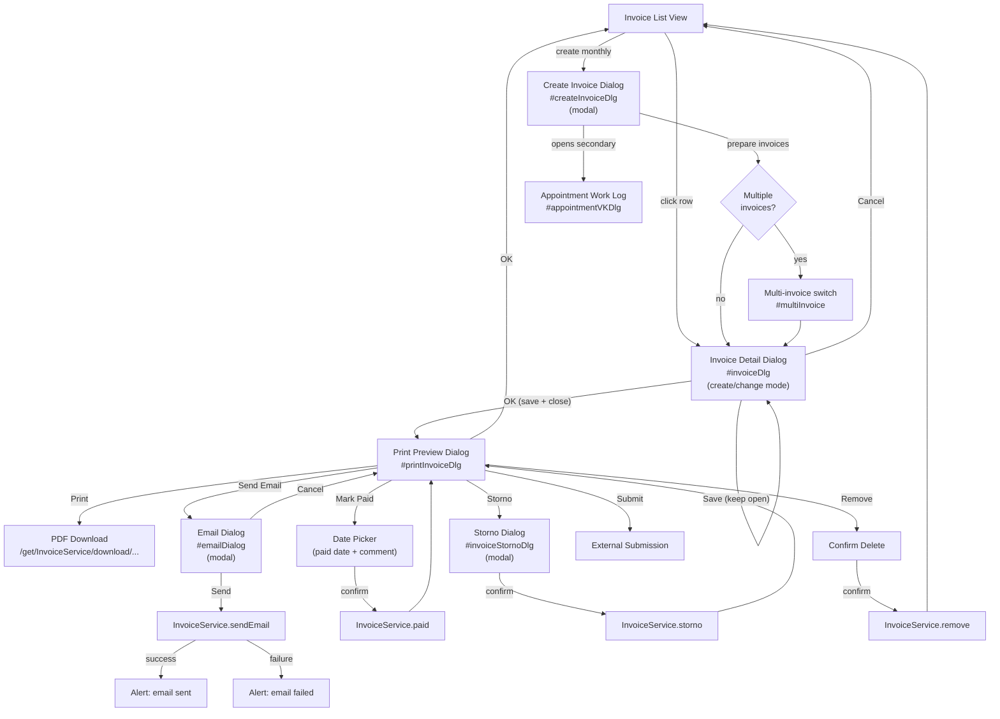

# Invoice Details Dialog, Email Dialog & Print Template

---

## Cross-References

### Source Files

| File | Purpose |
|------|---------|
| `web/src/main/webapp/invoice/invoiceDetails.html` | Invoice detail page template |
| `web/src/main/webapp/invoice/invoiceDetails.js` | Invoice detail page behavior |
| `web/src/main/webapp/invoice/invoiceDlg.js` | Invoice dialog logic |
| `web/src/main/webapp/invoice/emailDialog.js` | Email dialog logic |
| `web/src/main/webapp/invoice/tpl/print.mustache` | Print template |
| `web/src/main/webapp/invoice/messages.i18n.js` | Translations |

### Source Includes

| Type | Direction | Detail | Linked Document | Condition / Context |
|------|-----------|--------|-----------------|---------------------|
| include | **Included by** | `{{> invoiceDlg}}` | [Invoice List](./invoice-list.md) | Invoice list page embeds this dialog via Mustache partial for view/edit mode |

### Service Calls

| Service | Method | Parameters | Dialog / Context |
|---------|--------|------------|------------------|
| `InvoiceService` | `save` | `[data]` | `#invoiceDlg` — saves invoice and opens print dialog |
| `InvoiceService` | `get` | `[id]` | `#invoiceDlg` — loads invoice for view/edit |
| `InvoiceService` | `remove` | `[id]` | `#printInvoiceDlg` — delete invoice |
| `InvoiceService` | `paid` | `[id, date, comment]` | `#printInvoiceDlg` — mark invoice as paid |
| `InvoiceService` | `storno` | `[id, reason]` | `#printInvoiceDlg` — cancel invoice |
| `InvoiceService` | `prepareMail` | `[id]` | `#emailDialog` — pre-fill email data |
| `InvoiceService` | `sendEmail` | `[data]` | `#emailDialog` — send invoice email |
| `InvoiceService` | `prepare` | `[receiverId, month, year]` | `#createInvoiceDlg` — prepare monthly invoice |
| `InvoiceService` | `checkMonthClosed` | `[ids, month, year]` | `#createInvoiceDlg` — verify appointments closed |
| `InvoiceService` | `upload` | `file + [invoiceId]` | `#invoiceFiles` — upload attachment |
| `InvoiceService` | `removeFile` | `[invoiceId, attachmentId]` | `#invoiceFiles` — delete attachment |
| `InvoiceService` | `download` | `[id, true, filename]` | `#printInvoiceDlg` — download PDF |
| `ProductService` | `autocomplete` | `filter: "CUSTOMER"` | Position row product lookup |
| `InvoiceReceiverService` | `autocomplete` | `query` | `#createInvoiceDlg` receiver selection |

### Event Flows

| Type | Direction | Event | Linked Document | Condition |
|------|-----------|-------|-----------------|----------|
| event | **Incoming** | `InvoiceDetails.open(mode, entry)` | [Invoice List](./invoice-list.md) | Row double-click or toolbar button opens detail dialog |
| event | **Outgoing** | Opens `#printInvoiceDlg` | [Print Preview](#) | OK button after save |
| event | **Outgoing** | Opens `#emailDialog` | [Email Dialog](#) | Send email button |
| event | **Outgoing** | Opens `#createInvoiceDlg` | [Create Invoice Dialog](#) | Create monthly invoice flow |

> **Include context:** This file's source `invoiceDetails.html` is embedded as `{{> invoiceDlg}}` partial in [Invoice List](./invoice-list.md). The dialog is opened in view, change, or create mode via `InvoiceDetails.open()`.

> **Event chain:** [Invoice List](./invoice-list.md) -> `InvoiceDetails.open()` -> **this file** -> (save) -> [Print Preview](#) -> `InvoiceService.sendEmail` / `InvoiceService.download`

---

## 1. Dialog: Invoice Detail (`#invoiceDlg`)

| Attribute | Value |
|---|---|
| **ID** | `invoiceDlg` |
| **Type** | Detail dialog (offcanvas / drawer) |
| **Icon** | `fas fa-receipt` |
| **Color** | `bg-color-invoice` |
| **Width** | `1100` |
| **CRUD Buttons** | `false` (custom button set) |
| **Title** | `{{i18n.invoice}}` |
| **Visibility classes** | `.changeOnly`, `.createOnly`, `.viewOnly` control element visibility by mode |
| **Service** | `InvoiceService` |
| **Note** | An invoice can only be **created** or **viewed**, never "edited" directly (per source comment) |

### 1.1 Button Set

| Button | CSS Class | Event / Handler | Position | Icon | Condition |
|---|---|---|---|---|---|
| OK | `btn btn-primary data` | `saveInvoice` — saves then closes dialog, opens print | 10 | `fa-check` | Shown when data present |
| Save | `btn btn-primary changeOnly` | `invoiceSave` — saves without closing | 20 | `fa-store-slash` | Hidden by default; shown in change mode |
| Cancel | `btn btn-secondary` | `cancel` | 40 | `fa-times` | Always shown |

---

### 1.2 Header Section (Left Column — `col-md-4`)

| Element | Field / Binding | Type | Format | Required | Read-only | Notes |
|---|---|---|---|---|---|---|
| Multi-invoice switch | `#multiInvoice` | `select` | — | No | No | Hidden by default; shown when multiple invoices prepared for same period |
| Invoice number | `data.no` | `input` | text | No | No | Placeholder: `Rechnungsnr.` (HARDCODED German) |
| Date created | `data.dateCreated` | `span.field` | date | — | Yes | Display-only, bold |
| Client name | `data.client.name` | `span.field` | text | — | Yes | Display-only, bold |
| Client extra title | `data.client.extraTitle` | `span.field` | text | — | Yes | Display-only |
| Client address | `data.client.address` | `span.field` | text | — | Yes | Display-only |
| Client ZIP | `data.client.zip` | `span.field` | text | — | Yes | Display-only |
| Client city | `data.client.city` | `span.field` | text | — | Yes | Display-only |
| Client state | `data.client.state` | `span.field` | text | — | Yes | Display-only |
| Delivery method label | — | static text | — | — | — | `Versand:` (HARDCODED German = "Delivery:") |
| Email delivery icon | conditional on `data.client.mailInvoice` | `i.fa-at` | icon | — | Yes | Shown when client prefers email |
| Post delivery icon | conditional on `data.client.postInvoice` | `i.fa-envelope` | icon | — | Yes | Shown when client prefers postal |
| Client invoice email | `data.client.mailInvoice` | `span.field` | text | — | Yes | Display-only |

### 1.3 Middle Column (`col-md-4`)

| Element | Field / Binding | Type | Format | Required | Read-only | Notes |
|---|---|---|---|---|---|---|
| Title | `data.title` | `input` | text | No | No | Placeholder: `{{i18n.label.title}}` |
| Description | `data.description` | `textarea` | text | No | No | Placeholder: `{{i18n.label.description}}` |
| Paid at | `data.paidAt` | `input` | date | No | Yes | `.viewOnly` — only shown in view mode |
| Comment (internal) | `data.comment` | `textarea` | text | No | No | Placeholder: `interner {{i18n.label.comment}}` (HARDCODED `interner`); `bg-dark-subtle` styling |

### 1.4 Invoice Date Column (`col-md-2`)

| Element | Field / Binding | Type | Format | Required | Read-only | Notes |
|---|---|---|---|---|---|---|
| Invoice date label | — | static text | — | — | — | `{{i18n.invoice.dateInvoice}}` |
| Invoice date | `data.dateInvoice` | `input` | date | No | No | — |
| Skonto date label | — | static text | — | — | — | `{{i18n.invoice.dateSkonto}}:` (bold) |
| Skonto date | `data.dateSkonto` | `span.field` | date | — | Yes | Display-only |
| Skonto percentage | `data.client.skontoPaymentPercentage` | `span.field` | percentage | — | Yes | Display-only |

### 1.5 Submit & Period Column (`col-md-2`)

| Element | Field / Binding | Type | Format | Required | Read-only | Notes |
|---|---|---|---|---|---|---|
| Submit date label | — | static text | — | — | — | `{{i18n.invoice.dateSubmit}}` |
| Submit date | `data.dateSubmit` | `input` | date | No | No | — |
| Month/Quarter selector | `data.month` | `select` | number | No | No | See period options below |
| Year | `data.year` | `input` | number | No | No | — |

#### Period Select Options (`data.month`)

| Value | Label | Meaning |
|---|---|---|
| 1–12 | `Month.JAN` – `Month.DEC` | Monthly periods |
| 21 | Q1 (HARDCODED) | Quarter 1 |
| 22 | Q2 (HARDCODED) | Quarter 2 |
| 23 | Q3 (HARDCODED) | Quarter 3 |
| 24 | Q4 (HARDCODED) | Quarter 4 |
| 31 | Q1/Q2 (HARDCODED) | Half-year 1 |
| 32 | Q3/Q4 (HARDCODED) | Half-year 2 |
| 41 | `{{i18n.year}}` | Full year |

---

## 2. Invoice Positions Collection

| Attribute | Value |
|---|---|
| **Collection ID** | `invoicePosList` |
| **Data field** | `data.positions` |
| **Add button** | `#positionListAdd` (`fa-plus` icon in table header) |
| **Default new row** | `{ amount: 1, taxType: "SATZ_NULL" }` (or `client.taxType` if available) |

### 2.1 Position Row Fields

| Column Header | Field / Binding | Type | CSS Class | Required | Notes |
|---|---|---|---|---|---|
| Amount | `positions.amount` | `input` | `number mandatory` | Yes | Width: 60px |
| Service title | `positions.title` | `input` | — | No | Free-text service name |
| Product (autocomplete) | `positions.product` | `input` (object autocomplete) | `object` | No | `ProductService.autocomplete` with filter `CUSTOMER`; selecting product auto-fills title, description, konto, netPricePerUnit |
| Description | `positions.description` | `textarea` | — | No | rows=2 |
| Internal comment | `positions.comment` | `textarea` | `bg-dark-subtle` | No | rows=2; column header: `interner {{i18n.label.comment}}` (HARDCODED `interner`) |
| Account (Konto) | `positions.konto` | `input` | — | No | Accounting reference code |
| Net price per unit | `positions.netPricePerUnit` | `input` | `number currency` | No | Triggers recalculation on change |
| Tax type | `positions.taxType` | `select` | — | No | See tax type options below |
| Taxes (calculated) | `positions.taxes` | `span.field` | `number currency` | — | Read-only, auto-calculated |
| Total price (calculated) | `positions.totalPrice` | `span.field` | `number currency` | — | Read-only, auto-calculated |

#### Tax Type Select Options (`positions.taxType`)

| Value | Label (HARDCODED German) | Tax Rate | English Equivalent |
|---|---|---|---|
| `SATZ_NORMAL` | Satz-Normal | 19% (0.19) | Standard rate |
| `SATZ_ERMAESSIGT_1` | Satz-Ermaessigt-1 | 10% (0.10) | Reduced rate 1 |
| `SATZ_ERMAESSIGT_2` | Satz-Ermaessigt-2 | 15% (0.15) | Reduced rate 2 |
| `SATZ_NULL` | Satz-Null | 0% (0.0) | Zero rate |
| `SATZ_BESONDERS` | Satz-Besonders | 20% (0.20) | Special rate |

#### Position Row Actions

| Icon | CSS Class | Action |
|---|---|---|
| `fa-chevron-up` | `sortUp action` | Move position row up |
| `fa-chevron-down` | `sortDown action` | Move position row down |
| `fa-trash` | `delete action` | Remove position row |

### 2.2 Price Calculation Logic

> Reference: `InvoiceDetails.recalculate()` and `calculatePriceAndTaxes()`

**Per position:**
- If `enterWithTax` mode: `netPricePerUnit = pricePerUnit / (1 + taxRate)`
- If `enterWithoutTax` mode (default for InvoiceService): `pricePerUnit = netPricePerUnit * (1 + taxRate)`
- `netPrice = netPricePerUnit * amount`
- `taxes = taxRate * netPrice`
- `totalPrice = taxes + netPrice`

**Invoice totals:**
- `totalNetPrice = SUM(position.netPrice)`
- `totalTaxes = SUM(position.taxes)`
- `totalPrice = SUM(position.totalPrice)`

Tax lookup is read from the `<option data-tax="...">` attributes on the taxType select.

---

## 3. Totals Section

| Label (i18n key) | Field / Binding | Format | Notes |
|---|---|---|---|
| `invoice.totalNetPrice` | `data.totalNetPrice` | currency, bold | Net subtotal |
| `invoice.totalTaxes` | `data.totalTaxes` | currency, bold | Tax subtotal |
| `invoice.totalPrice` | `data.totalPrice` | currency, bold | Grand total |

---

## 4. Attachments Section (`#invoiceFiles`)

| Attribute | Value |
|---|---|
| **Collection field** | `data.attachments` |
| **Header** | `Datei` (HARDCODED German = "File") |
| **Upload** | `#addInvoiceFile` — `fa-file-plus` icon; `InvoiceService.upload` |

### 4.1 Attachment Row

| Element | Binding | Action |
|---|---|---|
| File name (link) | `attachments.name` | Link to `/get/InvoiceService/attachment/[[data.id]]/[[cur.id]]/[[cur.name]]` |
| Delete | `fa-trash remove` | Calls `InvoiceService.removeFile(invoiceId, attachmentId)` with confirm |

---

## 5. Print Preview Dialog (`#printInvoiceDlg`)

| Attribute | Value |
|---|---|
| **ID** | `printInvoiceDlg` |
| **Type** | Full-width dialog (offcanvas) |
| **Icon** | `fa fa-barcode` |
| **Width** | `1324` |
| **CRUD Buttons** | `false` |
| **Title** | `{{i18n.invoice.title}}` |
| **Content** | Rendered from `print.mustache` template |

### 5.1 Print Dialog Buttons

| Button ID | Label (i18n) | Icon | Condition | Handler |
|---|---|---|---|---|
| — | `dialog.print` | `fal fa-print` | Config has `print` function | Downloads PDF: `/get/InvoiceService/download/{id}/true/{filename}` |
| `invoiceSubmit` | `Ubermitteln` (HARDCODED German = "Submit") | `fal fa-hospital` | Config has `submit` function | Calls `config.submit(data)` |
| `invoiceSendEmail` | `email.send` | `fal fa-envelope-open-text` | Always | Opens email dialog (see section 6) |
| `invoicePaid` | `invoice.paid` | `fal fa-badge-check` | `paymentType === "INVOICE"` or `paymentType === "INVOICE_STORNO"` | Opens date picker, calls `InvoiceService.paid(id, date, comment)` |
| `invoiceStorno` | `invoice.storno` | `fal fa-trash-alt` | `(paid OR paymentType==="INVOICE") AND NOT isStorno AND NOT hasStorno` | Opens storno dialog, calls `InvoiceService.storno(id, reason)` |
| `invoiceRemove` | `action.remove` | — | `canRemove === "INVOICE"` | Calls `InvoiceService.remove(id)` with confirm |
| — | `button.ok` | — | Always | Closes dialog |

### 5.2 Print Template Layout (`print.mustache`)

The template renders a printable invoice with these sections:

#### Client Block (`data.client`)
| Field | Binding | Notes |
|---|---|---|
| Name | `{{name}}` | Bold |
| Tax number | `{{taxNr}}` | Italic |
| Address | `{{address}}` | Supports HTML |
| Address line 2 | `{{address2}}` | Conditional |
| ZIP + City | `{{zipCode}} {{city}}` | — |
| Email | `{{email}}` | — |
| Creditor / SEPA | `{{creditorId}} {{sepaId}}` | — |

#### Invoice Metadata Block
| Label (i18n) | Binding | Format | Condition |
|---|---|---|---|
| `invoice.no` | `data.no` | text | Always |
| `invoice.date` | `data.dateCreated` | dateTime helper | Always |
| `invoice.dateSubmit` | `data.dateCreated` | dateTime helper | Always |
| `invoice.paidat` | `data.paidAt` | date helper | Only if `paidAt` exists |
| Storno label | `data.stornoInfo` | text, red | Only if `data.isStorno` |
| Has storno label | `data.stornoInfo` | text, red | Only if `data.hasStorno` |
| Storno reason | `data.stornoReason` | text, red | Only if `stornoReason` exists |
| Description | `data.description` | text | Always |
| Comment | `data.comment` | text, italic | Only if exists |

#### Positions Table
| Column | Binding | Format |
|---|---|---|
| Service | `{{amount}}x {{title}}` | Amount + bold title |
| Description | `{{description}}` + `{{comment}}` (italic) | Multi-line |
| Net price | `{{currency netPrice}}` | Currency helper |
| Tax type | `{{taxTypeName}}` | Resolved from `i18n['tax_' + taxType]` |
| Taxes | `{{currency taxes}}` | Currency helper, italic |
| Total | `{{currency totalPrice}}` | Currency helper |

#### Totals Block
| Label (i18n) | Binding | Format |
|---|---|---|
| `invoice.totalNetPrice` | `data.totalNetPrice` | currency, bold |
| Per-tax-type rows | `data.taxes[].taxType` / `data.taxes[].sum` | currency, italic |
| `invoice.totalTaxes` | `data.totalTaxes` | currency, bold |
| `invoice.totalPrice` | `data.totalPrice` | currency, bold, top-border |
| `invoice.paymentType` | `data.paymentTypeName` | text |
| `invoice.unpaid` | — | Red, bold; shown when `!data.paid` |

#### Attachments Sidebar
| Element | Binding | Notes |
|---|---|---|
| File link | `/get/InvoiceService/attachment/{{data.id}}/{{id}}/{{name}}` | Clickable link |
| Delete icon | `fa-trash delete-attachment` | `data-invoice` and `data-id` attributes; calls `InvoiceService.removeFile` |

---

## 6. Email Dialog (`#emailDialog`)

| Attribute | Value |
|---|---|
| **ID** | `emailDialog` |
| **Type** | Modal dialog |
| **Icon** | `far fa-envelope-open` |
| **Color** | `bg-color-invoice` |
| **CRUD** | `false` |
| **Title** | `{{i18n.email.sendTitle}}` |
| **Width** | `660` (set in JS) |
| **Close guard** | Confirms if form has unsaved changes |

### 6.1 Email Form Fields

| Label | Field / Binding | Type | Placeholder | Required | Notes |
|---|---|---|---|---|---|
| `label.email` | `data.recipient` | `input[type=email]` | `{{i18n.label.email}}` | Yes | col-md-6 |
| `Kopie senden` (HARDCODED German = "Send copy") | `data.copy` | `checkbox` | — | No | col-md-4 |
| — | `data.subject` | `input` | `{{i18n.email.subject}}` | No | Full width |
| — | `data.body` | `textarea` | — | No | Height: 350px |
| Info display | `data.info` | `span.field` | — | — | Read-only info text |

### 6.2 Email Dialog Buttons

| Button | CSS Class | Handler |
|---|---|---|
| Send | `btn btn-primary` | Calls `sendCallback(data)`, resets changed state, closes dialog |
| Cancel | `btn btn-secondary` | Triggers `cancel` event on dialog |

### 6.3 Email Flow

1. User clicks "Send email" in print dialog
2. Backend call: `InvoiceService.prepareMail(invoiceId)` — returns pre-filled email data (recipient, subject, body)
3. Email dialog opens with pre-filled data
4. User edits and clicks Send
5. Backend call: `InvoiceService.sendEmail(data)`
6. Success/failure alert shown (`email.sent.success` / `email.sent.failure`)

---

## 7. Create Invoice Dialog (`#createInvoiceDlg`)

| Attribute | Value |
|---|---|
| **ID** | `createInvoiceDlg` |
| **Type** | Modal dialog |
| **Icon** | `far fa-receipt` |
| **Color** | `bg-color-invoice` |
| **Title** | `{{i18n.invoice}}` |

### 7.1 Form Fields

| Element | Field / Binding | Type | Notes |
|---|---|---|---|
| Receiver (autocomplete) | `data.receiver` | `input` (object autocomplete) | `InvoiceReceiverService.autocomplete`; placeholder: `{{i18n.InvoiceReceiver}}` |
| Month/Quarter | `data.month` | `select` | Same period options as invoice detail (values 1–12, 21–24, 31–32, 41) |
| Year | `data.year` | `input` | number |

### 7.2 Create Flow

1. User selects receiver, month, year
2. Backend: `InvoiceService.checkMonthClosed([receiverId], month, year)` — checks for unclosed appointments
3. If unclosed appointments exist, shows confirm with list (HARDCODED German: `Folgende Termine sind nicht abgeschlossen:`)
4. Backend: `InvoiceService.prepare(receiverId, month, year)` — returns prepared invoice(s)
5. If multiple invoices returned, `#multiInvoice` select is shown to switch between them
6. Invoice detail dialog opens in create mode
7. Secondary dialog `#appointmentVKDlg` shows related appointment work items

---

## 8. Storno (Cancellation) Dialog (`#invoiceStornoDlg`)

| Attribute | Value |
|---|---|
| **ID** | `invoiceStornoDlg` |
| **Type** | Modal dialog |
| **Icon** | `fa fa-ban` |
| **Color** | `bg-invoice` |
| **Title** | `{{i18n.invoice.confirmStorno}}` |

### 8.1 Form Fields

| Element | Field / Binding | Type | Placeholder | Notes |
|---|---|---|---|---|
| Storno reason | `data.stornoReason` | `input` | `{{i18n.invoice.stornoReason}}` | Optional; empty/`-` treated as null |

---

## 9. Appointment Work Log Dialog (`#appointmentVKDlg`)

| Attribute | Value |
|---|---|
| **ID** | `appointmentVKDlg` |
| **Type** | Secondary dialog (flush) |
| **Width** | `550` |
| **Icon** | `far fa-receipt` |
| **Color** | `bg-color-invoice` |
| **Title** | `{{i18n.invoice}} Liste` (HARDCODED `Liste`) |

### 9.1 Work Collection Fields (`data.work`)

| Column Header (HARDCODED German) | Field / Binding | Format |
|---|---|---|
| ID | `work.ap.id` | Link to `appointmentAdmin.html#<id>` |
| Datum | `work.ap.date` | text |
| Start | `work.ap.timeStart` | text |
| Ende | `work.ap.timeEnd` | text |
| Dienst | `work.job.code` | text |
| Pat. | `work.billablePatients` | number |
| Zeit | `work.billableTime` | humantimeday format |
| Status | `work.state` | text |
| Preis | `work.billValue` | currency |
| Total | `work.billValueTotal` | currency, bold |

---

## 10. Translation Table

| Text Reference | German | English | Notes |
|---|---|---|---|
| `invoice` | Rechnung | Invoice | Dialog title |
| `invoice.no` | Rechnungsnr. | Invoice No. | — |
| `invoice.date` | Datum | Date | — |
| `invoice.client` | Kunde | Client | — |
| `invoice.type` | Typ | Type | — |
| `invoice.dateCreated` | Erstellt am | Date created | — |
| `invoice.dateInvoice` | Rechnungsdatum | Invoice date | — |
| `invoice.dateSkonto` | Skonto Datum | Skonto date | Discount deadline |
| `invoice.datePaidUntil` | Bezahlt bis | Paid until | — |
| `invoice.dateSubmit` | Versanddatum | Submit date | — |
| `invoice.paidat` | Bezahlt am | Paid at | — |
| `invoice.positions.amount` | Menge | Amount | — |
| `invoice.positions.service` | Leistung | Service | — |
| `invoice.positions.product` | Produkt | Product | — |
| `invoice.positions.serviceDate` | Leistungsdatum | Service date | — |
| `invoice.positions.price` | Preis | Price | — |
| `invoice.taxRate` | MwSt-Satz | Tax rate | — |
| `invoice.tax` | MwSt | Tax | — |
| `invoice.totalNetPrice` | Nettosumme | Net total | — |
| `invoice.totalTaxes` | MwSt gesamt | Total taxes | — |
| `invoice.totalPrice` | Gesamtsumme | Total price | — |
| `invoice.paid` | Bezahlt | Paid | — |
| `invoice.unpaid` | Unbezahlt | Unpaid | Shown in red on print |
| `invoice.paymentType` | Zahlungsart | Payment type | — |
| `invoice.storno` | Stornieren | Cancel (storno) | — |
| `invoice.confirmStorno` | Storno bestätigen | Confirm cancellation | — |
| `invoice.stornoReason` | Stornogrund | Cancellation reason | — |
| `invoice.isStorno` | Storno Rechnung | Storno invoice | — |
| `invoice.hasStorno` | Hat Storno | Has cancellation | — |
| `invoice.saveNull` | Rechnung mit 0€ speichern? | Save invoice with 0 amount? | Confirm dialog |
| `invoice.title` | Rechnung | Invoice | Print dialog title |
| `email.send` | E-Mail senden | Send email | — |
| `email.sendTitle` | E-Mail senden | Send email | Email dialog title |
| `email.subject` | Betreff | Subject | — |
| `label.email` | E-Mail | Email | — |
| `label.title` | Titel | Title | — |
| `label.description` | Beschreibung | Description | — |
| `label.comment` | Kommentar | Comment | — |
| `label.total` | Gesamt | Total | — |
| `billing.konto` | Konto | Account | — |
| `dialog.ok` | OK | OK | — |
| `dialog.save` | Speichern | Save | — |
| `dialog.cancel` | Abbrechen | Cancel | — |
| `dialog.print` | Drucken | Print | — |
| `action.remove` | Entfernen | Remove | — |
| `InvoiceReceiver` | Rechnungsempfänger | Invoice receiver | Create dialog |
| `year` | Jahr | Year | Period selector |
| `Month.JAN`–`Month.DEC` | Jan–Dez | Jan–Dec | Month selector |
| `tax.SATZ_NORMAL` | Normalsatz | Standard rate | 19% |
| `tax.SATZ_ERMAESSIGT_1` | Ermäßigter Satz 1 | Reduced rate 1 | 10% |
| `tax.SATZ_ERMAESSIGT_2` | Ermäßigter Satz 2 | Reduced rate 2 | 15% |
| `tax.SATZ_NULL` | Nullsatz | Zero rate | 0% |
| `tax.SATZ_BESONDERS` | Besonderer Satz | Special rate | 20% |
| `invoice.CASH.name` | Barzahlung | Cash | Payment type |
| `invoice.CREDIT_CARD.name` | Kreditkarte | Credit card | Payment type |
| `invoice.ATM_CARD.name` | EC-Karte | ATM/Debit card | Payment type |
| `invoice.INVOICE.name` | Rechnung | Invoice | Payment type |
| `invoice.STORNO.name` | Storno | Cancellation | Payment type |
| `invoice.INVOICE_STORNO.name` | Rechnungsstorno | Invoice cancellation | Payment type |
| `receipt.START_INVOICE` | Startrechnung | Start invoice | Receipt type |
| `receipt.YEAR_INVOICE` | Jahresrechnung | Year invoice | Receipt type |
| `receipt.MONTH_INVOICE` | Monatsrechnung | Month invoice | Receipt type |
| `receipt.DAY_INVOICE` | Tagesrechnung | Day invoice | Receipt type |
| `receipt.COLLECTIVE_INVOICE` | Sammelrechnung | Collective invoice | Receipt type |
| `receipt.INVOICE` | Rechnung | Invoice | Receipt type |

### HARDCODED Strings (no i18n key)

| Location | German Text | English Equivalent | Action Needed |
|---|---|---|---|
| `invoiceDetails.html:21` | `Rechnungsnr.` | Invoice No. | Add i18n key |
| `invoiceDetails.html:28` | `Versand:` | Delivery: | Add i18n key |
| `invoiceDetails.html:39` | `interner` (prefix) | internal | Add i18n key |
| `invoiceDetails.html:86` | `interner` (prefix) | internal | Add i18n key |
| `invoiceDetails.html:111` | `Satz-Normal`, `Satz-Ermaessigt-1`, etc. | Tax rate labels | Add i18n keys |
| `invoiceDetails.html:135` | `Datei` | File | Add i18n key |
| `invoiceDetails.html:136` | `Datei hochladen` | Upload file | Add i18n key |
| `invoiceDetails.html:245–276` | `ID`, `Datum`, `Start`, `Ende`, `Dienst`, `Pat.`, `Zeit`, `Status`, `Preis`, `Total` | Appointment work log headers | Add i18n keys |
| `invoiceDetails.html:230` | `Kopie senden` | Send copy | Add i18n key |
| `invoiceDetails.js:147` | `Ubermitteln` | Submit | Add i18n key |
| `print.mustache:25` | `Storno Rechnung` | Storno Invoice | Use i18n key `invoice.isStorno` |
| `invoiceDlg.js:158` | `Folgende Termine sind nicht abgeschlossen:` | The following appointments are not closed: | Add i18n key |
| `invoiceDlg.js:163` | `Keine Rechnung notwendig (0€)` | No invoice necessary (0 EUR) | Add i18n key |

---

## 11. Data Model Summary

### Invoice Object

| Field | Type | Notes |
|---|---|---|
| `id` | string | Primary key |
| `no` | string | Invoice number |
| `title` | string | Invoice title |
| `description` | string | Description text |
| `comment` | string | Internal comment |
| `dateCreated` | date | Creation timestamp |
| `dateInvoice` | date | Invoice date |
| `dateSubmit` | date | Submission date |
| `dateSkonto` | date | Discount payment deadline (read-only, calculated) |
| `paidAt` | date | Payment date |
| `month` | number | Billing period month (1–12) or quarter (21–24) or half-year (31–32) or year (41) |
| `year` | number | Billing period year |
| `client` | object | Client/receiver details (see below) |
| `positions` | array | Invoice line items (see below) |
| `groups` | array | Grouped positions for print (optional) |
| `attachments` | array | File attachments |
| `totalNetPrice` | number | Net subtotal (calculated) |
| `totalTaxes` | number | Tax subtotal (calculated) |
| `totalPrice` | number | Grand total (calculated) |
| `paymentType` | enum | `CASH`, `CREDIT_CARD`, `ATM_CARD`, `INVOICE`, `STORNO`, `INVOICE_STORNO` |
| `paid` | boolean | Whether invoice is paid |
| `isStorno` | boolean | Derived: `paymentType` is `STORNO` or `INVOICE_STORNO` |
| `hasStorno` | boolean | Derived: has a linked `stornoInvoice` |
| `stornoInvoice` | object | Linked storno invoice (if cancelled) |
| `stornoInfo` | string | Storno display text |
| `stornoReason` | string | Reason for cancellation |
| `canRemove` | string | Permission flag for deletion |
| `version` | number | Optimistic locking version |
| `taxes` | array | Tax breakdown by type `[{ taxType, sum }]` (for print) |

### Client Object (`data.client`)

| Field | Type | Notes |
|---|---|---|
| `name` | string | Client name |
| `extraTitle` | string | Additional title |
| `address` | string | Street address |
| `address2` | string | Address line 2 (print only) |
| `zip` / `zipCode` | string | Postal code (`zip` in detail, `zipCode` in print) |
| `city` | string | City |
| `state` | string | State/province |
| `email` | string | Email address (print only) |
| `taxNr` | string | Tax number (print only) |
| `creditorId` | string | Creditor ID (print only) |
| `sepaId` | string | SEPA mandate ID (print only) |
| `mailInvoice` | boolean/string | Prefers email delivery |
| `postInvoice` | boolean | Prefers postal delivery |
| `skontoPaymentPercentage` | number | Skonto discount percentage |
| `taxType` | string | Default tax type for new positions |

### Position Object (`positions`)

| Field | Type | Notes |
|---|---|---|
| `amount` | number | Quantity (default: 1) |
| `title` | string | Service/item name |
| `product` | object | Product reference (autocomplete) |
| `description` | string | Line description |
| `comment` | string | Internal comment |
| `konto` | string | Accounting code |
| `netPricePerUnit` | number | Net unit price |
| `pricePerUnit` | number | Gross unit price (calculated or input depending on mode) |
| `taxType` | enum | `SATZ_NORMAL`, `SATZ_ERMAESSIGT_1`, `SATZ_ERMAESSIGT_2`, `SATZ_NULL`, `SATZ_BESONDERS` |
| `netPrice` | number | Calculated: `netPricePerUnit * amount` |
| `taxes` | number | Calculated: `taxRate * netPrice` |
| `totalPrice` | number | Calculated: `netPrice + taxes` |

### Attachment Object (`attachments`)

| Field | Type | Notes |
|---|---|---|
| `id` | string | Attachment ID |
| `name` | string | File name |
| `version` | number | Optimistic locking version |

---

## 12. API Calls (Service Methods)

| Service | Method | Parameters | Returns | Used By |
|---|---|---|---|---|
| `InvoiceService` | `save` | `[data]` | Invoice object | Detail dialog save |
| `InvoiceService` | `get` | `[id]` | Invoice object | Open for edit/print |
| `InvoiceService` | `remove` | `[id]` | — | Delete invoice |
| `InvoiceService` | `paid` | `[id, date, comment]` | Invoice object | Mark as paid |
| `InvoiceService` | `storno` | `[id, reason]` | Invoice object | Cancel invoice |
| `InvoiceService` | `prepareMail` | `[id]` | Email data (recipient, subject, body) | Prepare email |
| `InvoiceService` | `sendEmail` | `[data]` | boolean | Send email |
| `InvoiceService` | `prepare` | `[receiverId, month, year]` | `[{ invoice, work }]` | Create monthly invoice |
| `InvoiceService` | `prepareAll` | `[ids, month, year]` | Job ID | Bulk create invoices |
| `InvoiceService` | `checkMonthClosed` | `[ids, month, year]` | `[Appointment]` | Verify appointments closed |
| `InvoiceService` | `upload` | file + `[invoiceId]` | Attachment | Upload file |
| `InvoiceService` | `removeFile` | `[invoiceId, attachmentId]` | — | Delete attachment |
| `InvoiceService` | `download` | `[id, true, filename]` | PDF file | Print/download |
| `ProductService` | `autocomplete` | filter: `CUSTOMER` | `[Product]` | Position product lookup |
| `InvoiceReceiverService` | `autocomplete` | query | `[Receiver]` | Create dialog receiver lookup |

---

## 13. Navigation Flow



---

## 14. Key Behavioral Notes

1. **View vs. Create vs. Change modes**: The dialog uses CSS classes `.viewOnly`, `.createOnly`, `.changeOnly` to toggle field visibility. The mode is stored in `$detail.data().mode`.

2. **Tax entry mode**: Configured via `config.enterWithTax`. The invoice module defaults to `enterWithTax = false` (net prices entered). CSS classes `.withTax` / `.withoutTax` toggle column visibility.

3. **Auto-recalculation**: Any change to a `number` input or `select` in a position row triggers full recalculation of all prices and totals. The `skipCalculate` flag prevents recalculation during initial data fill.

4. **Product autocomplete fill**: Selecting a product from autocomplete auto-fills `title`, `description`, `konto`, and `netPricePerUnit` on the position row.

5. **Multi-invoice support**: When `InvoiceService.prepare()` returns multiple invoices (e.g., for different job types), a `<select>` dropdown appears allowing the user to switch between them. Changes are preserved when switching.

6. **Print filename**: Generated as `{YYYYMMDD}_{invoiceNo}_{clientName}.pdf` (with `/` in invoice number replaced by `_`).

7. **Storno workflow**: Cancellation is only available when the invoice is paid OR has paymentType "INVOICE", and does not already have a storno. The storno reason input is cleared when the dialog closes.

8. **File upload**: Requires the invoice to be saved first (has an `id`). If the invoice is new, it is auto-saved before upload.

9. **Grouped positions**: For print, positions can be organized into groups. If the invoice has `positions` but no `groups`, a single group is created wrapping all positions. Each group has its own totals.

10. **Optimistic locking**: The `version` field is maintained for concurrency control. After file upload, the version is updated from the response to prevent stale-data errors.

---

## Wireframe Reference (ASCII)

> Full wireframe: [`specs/wireframes/accounting/workflows.md#w2-invoice-details-drawer`](../../../wireframes/accounting/workflows.md#w2-invoice-details-drawer)

```
┌─────────────────────────────── Invoice Details ─ INV-2025-42 ───────────────┐
│                                                                             │
│ Client:          Title / Type:       Invoice Date:    Period / Submission:   │
│ JVA Berlin       Shift - Morning     15.11.2025       Nov 2025              │
│ Dr. Mueller      Regular billing     Skonto: 14d      Not submitted         │
│                                                                             │
│ Positions [repeats] [calc: netPrice × amount + tax]           [+ Add Pos]   │
│ ┌───┬──────────────┬────────┬──────────┬──────┬──────────┬───┐              │
│ │ # │ Description  │ Amount │ Net Price│ Tax %│ Total[RO]│ ✕ │              │
│ ├───┼──────────────┼────────┼──────────┼──────┼──────────┼───┤              │
│ │ 1 │ Morning shft │ 11     │ € 200.00 │ 5%  │€4,186.80 │ ✕ │              │
│ │ 2 │ On-call surg │ 4      │ € 50.00  │ 5%  │€ 218.00  │ ✕ │              │
│ └───┴──────────────┴────────┴──────────┴──────┴──────────┴───┘              │
│                                               Subtotal:      € 3,270.00    │
│                                               Tax (VAT):       € 726.50    │
│                                               Total (Gross): € 4,426.80    │
│                                                                             │
│ [Print] [Email] [Mark Paid] [Storno]                             [Save]     │
└─────────────────────────────────────────────────────────────────────────────┘
  [multi-entity: invoice switch] Prev/Next navigation
  Dialogs: Print Preview, Email, Create Invoice, Storno, Appt Work Log
```
