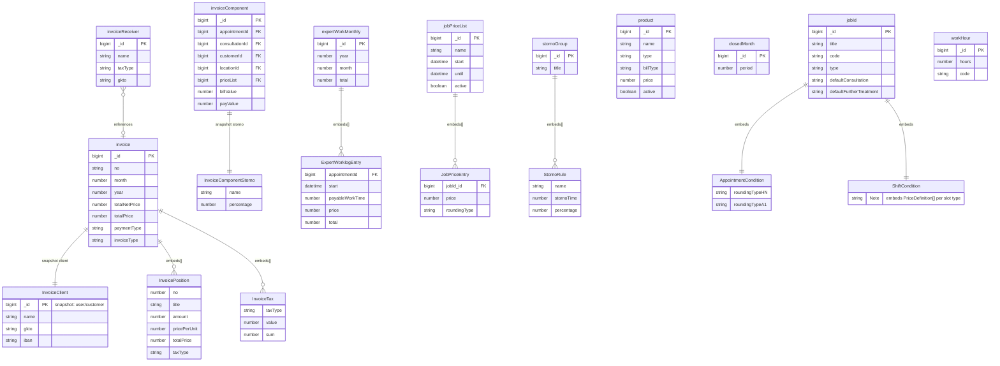

# Accounting

[← Back to Index](./readme.md)

This file covers the Accounting category: entities related to billing, customers, pricing, and financial tracking.

---

## ER Diagram {#er-diagram}

Invoices, billing components, price lists, expert work logs, and financial tracking.

---

## Entities in This Category

| Table Name (DBML) | Business Entity | Description Summary |
| :--- | :--- | :--- |
| [`invoice`](#entity-invoices) | Rechnungen (Invoices) | Billing documents for experts, customers, or patients. |
| [`invoiceComponent`](#entity-invoice-components) | Rechnungskomponenten (Invoice Components) | Individual items and rules contributing to a final invoice. |
| [`invoiceReceiver`](#entity-invoice-receivers) | Rechnungsempfänger (Invoice Receivers) | Details of entities receiving invoices, including tax settings. |
| [`expertWorkMonthly`](#entity-expert-work-monthly) | Monatliche Expertenarbeit (Expert Work Monthly) | Aggregated monthly work logs and billing summaries for experts. |
| [`jobId`](#entity-service) | Dienstleistung (Service) | Definition of a service (Dienstleistung), including title, color, billing modality, specialty, and consultation types. |
| [`jobPriceList`](#entity-job-price-lists) | Preislisten (Job Price Lists) | Master price lists for different services and specialties. |
| [`product`](#entity-products) | Waren (Products) | Goods or services subscribed by the expert, including quantity, price, and dates. |
| [`cashRegister`](#entity-cash-register) | Kassenregistrierung (Cash Register) | Records of cash transactions and POS register states. |
| [`closedMonth`](#entity-closed-months) | Abgeschlossene Zeiträume (Closed Months) | Tracking of billing periods that have been finalized and locked. |
| [`stornoGroup`](#entity-storno-groups) | Storno-Regelgruppen (Storno Groups) | Rules and groups defining cancellation conditions and fees. |
| [`workHour`](#entity-work-hours) | Arbeitszeit-Kategorien (Work Hours) | Definitions of different work hour types for billing and reporting. |

---

## Entity: Rechnungen (Invoices) {#entity-invoices}
Zentrale Abrechnungsdokumente für Kunden und Experten.

### Table: invoice
| Column | Type | Field Type | Description |
| :--- | :--- | :--- | :--- |
| `_id` | `Long` | schema | Interner Bezeichner |
| `version` | `Long` | schema | Versionsnummer |
| `no` | `String` | schema | Rechnungsnummer |
| `title` | `String` | schema | Titel |
| `description` | `String` | schema | Beschreibung |
| `cashRegister` | `DBRef` | schema | Reference to [cashRegister](#entity-cash-register) |
| `client` | `Document` | schema | Rechnungsempfänger-Details (Snapshot: [InvoiceClient](#sub-entity-invoiceclient)) |
| `month` | `Number` | schema | Monat |
| `year` | `Number` | schema | Jahr |
| `positions` | `Array` | schema | Rechnungspositionen ([InvoicePosition](#sub-entity-invoiceposition)) |
| `totalNetPrice` | `Number` | schema | Gesamt-Nettopreis |
| `totalPrice` | `Number` | schema | Gesamt-Bruttopreis |
| `taxType` | `String` | schema | Steuerart: • `SATZ_NORMAL` (Used) • `SATZ_NULL` (Used) |
| `taxes` | `Array` | schema | Steuersätze ([InvoiceTax](#sub-entity-invoicetax)) |
| `dateInvoice` | `Date` | schema | Rechnungsdatum |
| `dateSkonto` | `Date` | inferred | Skonto-Datum |
| `dateSubmit` | `Date` | schema | Einreichungsdatum |
| `dateWorklog` | `Date` | inferred | Arbeitsnachweis-Datum |
| `dateCreated` | `Date` | inferred | Erstellungsdatum |
| `createdBy` | `DBRef` | inferred | Erstellt von (Reference to [user](./user-management.md#entity-expert)) |
| `dateChanged` | `Date` | inferred | Änderungsdatum |
| `changedBy` | `DBRef` | inferred | Geändert von (Reference to [user](./user-management.md#entity-expert)) |
| `totalTaxes` | `Number` | inferred | Gesamtsteuer |
| `paidAt` | `Date` | inferred | Bezahlungsdatum |
| `storno` | `DBRef` | inferred | Storno-Referenz (Reference to [invoice](#entity-invoices)) |
| `attachments` | `Array` | inferred | Anhänge ([UserFileMetadata](./user-management.md#sub-entity-filemetadata)) |
| `paymentType` | `String` | schema | Zahlungsart: • `CASH` (Used) • `INVOICE` (Used) • `INVOICE_STORNO` (Used) |
| `invoiceType` | `String` | schema | Rechnungstyp: • `EXPERT_INVOICE` (Used) • `INVOICE` (Used) • `START_INVOICE` (Used) |
| `mail` | `String` | schema | E-Mail-Adresse für den Versand |
| `mailSendDate` | `Date` | schema | Versanddatum |
| `_class` | `String` | schema | Laufzeitklassen-Marker: `de.videoclinic.model.Invoice` |

The `invoice` entity is referenced by:
- [`invoiceReceiver`](#entity-invoice-receivers) (implicit link via billing data)
- [`expertWorkMonthly`](#entity-expert-work-monthly) (for billing calculations)
- [`stornoGroup`](#entity-storno-groups) (via cancellation logic)

### Sub-entities for invoice

#### Sub-entity: InvoiceClient {#sub-entity-invoiceclient}
Snapshot der Client-Daten zum Zeitpunkt der Rechnungserstellung.

| Column | Type | Field Type | Description |
| :--- | :--- | :--- | :--- |
| `_id` | `Long` | schema | Interner Bezeichner |
| `name` | `String` | schema | Name |
| `gkto` | `String` | schema | Debitorennummer |
| `firstName` | `String` | schema | Vorname |
| `lastName` | `String` | schema | Nachname |
| `address` | `String` | schema | Adresse |
| `zip` | `String` | schema | PLZ |
| `city` | `String` | schema | Ort |
| `bank` | `String` | schema | Bank |
| `iban` | `String` | schema | IBAN |
| `bic` | `String` | schema | BIC |
| `taxid` | `String` | schema | Steuer-ID |
| `uid` | `String` | schema | Umsatzsteuer-ID |

The `InvoiceClient` sub-entity is used within:
- [`invoice`](#entity-invoices) (as `client` field)

#### Sub-entity: InvoicePosition {#sub-entity-invoiceposition}
Einzelne Position auf einer Rechnung.

| Column | Type | Field Type | Description |
| :--- | :--- | :--- | :--- |
| `_id` | `String` | inferred | Internal identifier |
| `no` | `Number` | schema | Positionsnummer |
| `title` | `String` | schema | Titel |
| `description` | `String` | schema | Beschreibung |
| `amount` | `Number` | schema | Menge |
| `pricePerUnit` | `Number` | schema | Preis pro Einheit |
| `totalPrice` | `Number` | schema | Gesamtpreis der Position |
| `taxType` | `String` | schema | Steuerart: • `SATZ_NORMAL` (Used) • `SATZ_NULL` (Used) |
| `job` | `DBRef` | schema | Reference to [jobId](#entity-service) |
| `comment` | `String` | schema | Kommentar |

The `InvoicePosition` sub-entity is used within:
- [`invoice`](#entity-invoices) (as `positions` array)

#### Sub-entity: InvoiceTax {#sub-entity-invoicetax}
Zusammenfassung einer Steuerart auf der Rechnung.

| Column | Type | Field Type | Description |
| :--- | :--- | :--- | :--- |
| `_id` | `String` | inferred | Internal identifier |
| `taxType` | `String` | schema | Steuerart: • `SATZ_NORMAL` (Used) • `SATZ_NULL` (Used) |
| `value` | `Number` | schema | Steuersatz |
| `sum` | `Number` | schema | Steuersumme |
| `net` | `Number` | schema | Nettosumme |
| `total` | `Number` | schema | Bruttosumme |
| `description` | `String` | schema | Beschreibung |

The `InvoiceTax` sub-entity is used within:
- [`invoice`](#entity-invoices) (as `taxes` array)

## Entity: Rechnungskomponenten (Invoice Components) {#entity-invoice-components}
Einzelne Bestandteile einer Rechnung, basierend auf Terminen und Konsultationen.

### Table: invoiceComponent
| Column | Type | Field Type | Description |
| :--- | :--- | :--- | :--- |
| `_id` | `Long` | schema | Interner Bezeichner |
| `version` | `Long` | schema | Versionsnummer |
| `start` | `Date` | schema | Startzeitpunkt |
| `priceList` | `Long` | schema | Reference to [jobPriceList](#entity-job-price-lists) |
| `customerId` | `Long` | schema | Reference to [customer](./customer.md#entity-customers) |
| `locationId` | `Long` | schema | Reference to [location](./customer.md#entity-locations) |
| `appointmentId` | `Long` | schema | Reference to [appointment](./planning.md#entity-appointments) |
| `consultationId` | `Long` | schema | Reference to [consultationData](./treatment.md#entity-consultation-data) |
| `actualPatients` | `Number` | schema | Tatsächliche Anzahl Patienten |
| `billablePatients` | `Number` | schema | Abrechenbare Patienten |
| `payablePatients` | `Number` | schema | Auszahlbare Patienten |
| `billableWorkTime` | `Number` | schema | Abrechenbare Arbeitszeit |
| `payableWorkTime` | `Number` | schema | Auszahlbare Arbeitszeit |
| `billValue` | `Number` | schema | Rechnungsbetrag |
| `payValue` | `Number` | schema | Auszahlungsbetrag |
| `employeeType` | `String` | inferred | Mitarbeitertyp: • `A1` (Used) • `HN2` (Used) • `HONORAR` (Used) |
| `appointmentType` | `String` | inferred | Termintyp: • `APPOINTMENT` (Used) • `SHIFT` (Used) • `TREATMENT` (Used) • `TREATMENT_REPORT` (Used) |
| `stornoType` | `Document` | schema | Stornierungsdetails ([InvoiceComponentStorno](#sub-entity-invoicecomponentstorno)) |
| `_class` | `String` | schema | Laufzeitklassen-Marker: `de.videoclinic.model.InvoiceComponent` |

The `invoiceComponent` entity is a derived entity used for accounting and is referenced by:
- [`invoice`](#entity-invoices) (implicitly during invoice generation)

### Sub-entities for invoiceComponent

#### Sub-entity: InvoiceComponentStorno {#sub-entity-invoicecomponentstorno}
Details zur Stornierung einer Rechnungskomponente.

| Column | Type | Field Type | Description |
| :--- | :--- | :--- | :--- |
| `_id` | `String` | inferred | Internal identifier |
| `name` | `String` | schema | Name des Stornos |
| `percentage` | `Number` | schema | Prozentsatz |
| `stornoTime` | `Long` | schema | Zeitpunkt der Stornierung |
| `comment` | `String` | schema | Kommentar |
| `type` | `String` | schema | Storno-Typ |

The `InvoiceComponentStorno` sub-entity is used within:
- [`invoiceComponent`](#entity-invoice-components) (as `stornoType` field)

## Entity: Rechnungsempfänger (Invoice Receivers) {#entity-invoice-receivers}
Konfiguration von Empfängern für Rechnungen, inklusive steuerlicher Details und Kontaktinformationen.

### Table: invoiceReceiver
| Column | Type | Field Type | Description |
| :--- | :--- | :--- | :--- |
| `_id` | `Long` | schema | Interner Bezeichner |
| `version` | `Long` | schema | Versionsnummer |
| `customer` | `DBRef` | schema | Reference to [customer](./customer.md#entity-customers) |
| `location` | `DBRef` | schema | Reference to [location](./customer.md#entity-locations) |
| `name` | `String` | schema | Name des Empfängers |
| `address` | `String` | schema | Straße und Hausnummer |
| `zip` | `String` | schema | PLZ |
| `city` | `String` | schema | Ort |
| `taxType` | `String` | schema | Steuerliche Einordnung: • `SATZ_NORMAL` (Used) • `SATZ_NULL` (Used) |
| `paymentGoal` | `Number` | schema | Zahlungsziel in Tagen |
| `gkto` | `String` | schema | Debitorennummer |
| `mailInvoice` | `Boolean` | inferred | Rechnungsversand per E-Mail |
| `postInvoice` | `Boolean` | inferred | Rechnungsversand per Post |
| `email` | `String` | schema | Primäre E-Mail-Adresse |
| `_class` | `String` | schema | Laufzeitklassen-Marker: `de.videoclinic.model.InvoiceReceiver` |

The `invoiceReceiver` entity is used by:
- (Internal invoice generation processes)

## Entity: Monatliche Expertenarbeit (Expert Work Monthly) {#entity-expert-work-monthly}
Zusammenfassung der erbrachten Leistungen eines Experten pro Monat zur Abrechnungsvorbereitung.

### Table: expertWorkMonthly
| Column | Type | Field Type | Description |
| :--- | :--- | :--- | :--- |
| `_id` | `Long` | schema | Interner Bezeichner |
| `version` | `Long` | schema | Versionsnummer |
| `year` | `Number` | schema | Jahr |
| `month` | `Number` | schema | Monat |
| `user` | `DBRef` | schema | Reference to [user](./user-management.md#entity-expert) |
| `doctorName` | `String` | schema | Name des Experten |
| `total` | `Number` | schema | Gesamtbetrag |
| `payableWorkTimeTotal` | `Number` | schema | Auszahlbare Arbeitszeit gesamt |
| `payablePatientsTotal` | `Number` | schema | Auszahlbare Patienten gesamt |
| `worklog` | `Array` | schema | Detaillierte Liste der Tätigkeiten ([ExpertWorklogEntry](#sub-entity-expertworklogentry)) |
| `dateCreated` | `Date` | inferred | Erstellungsdatum |
| `dateSent` | `Date` | schema | Sendedatum |
| `_class` | `String` | schema | Laufzeitklassen-Marker: `de.videoclinic.model.ExpertWorkMonthly` |

The `expertWorkMonthly` entity is a summary for experts and is referenced by:
- (Internal billing and payment processes)

### Sub-entities for expertWorkMonthly

#### Sub-entity: ExpertWorklogEntry {#sub-entity-expertworklogentry}
Einzelner Eintrag im monatlichen Arbeitsprotokoll eines Experten.

| Column | Type | Field Type | Description |
| :--- | :--- | :--- | :--- |
| `_id` | `String` | inferred | Internal identifier |
| `appointmentId` | `Long` | schema | Reference to [appointment](./planning.md#entity-appointments) |
| `job` | `DBRef` | schema | Reference to [jobId](#entity-service) |
| `start` | `Date` | schema | Startzeitpunkt |
| `actualWorkTime` | `Long` | schema | Tatsächliche Arbeitszeit |
| `payableWorkTime` | `Number` | schema | Auszahlbare Arbeitszeit |
| `price` | `Number` | schema | Einzelpreis |
| `total` | `Number` | schema | Gesamtpreis |
| `location` | `String` | schema | Ort |
| `expert` | `Document` | inferred | Snapshot des Experten ([ConsultationDoctor](./user-management.md#sub-entity-consultationdoctor)) |
| `invoice` | `Document` | inferred | Rechnungs-Snapshot |

The `ExpertWorklogEntry` sub-entity is used within:
- [`expertWorkMonthly`](#entity-expert-work-monthly) (as `worklog` array)

## Entity: Dienstleistung (Service) {#entity-service}
Defines the types of medical services provided, their billing modalities, and required skills.

### Table: jobId
| Column | Type | Field Type | Description (from all-together.md and DB) |
| :--- | :--- | :--- | :--- |
| `_id` | `Long` | schema | Interner Bezeichner |
| `version` | `Long` | schema | Versionsnummer (Zeitstempel) |
| `title` | `String` | schema | Einen Titel (intern, Experte, Rechnung) |
| `code` | `String` | schema | Eine Kurzbezeichnung |
| `shortcode` | `String` | schema | Ein Buchstabe als Kurzbezeichnung |
| `expertTitle` | `String` | schema | Titel für Experten |
| `remoteCode` | `String` | schema | Externer Code (z.B. Fachrichtung) |
| `color` | `String` | schema | Eine Farbe |
| `type` | `String` | schema | Die Abrechnungsmodalität: • `APPOINTMENT` (Used) • `SHIFT` (Used) |
| `prio` | `Number` | schema | Priorität der Dienstleistung |
| `skillRules` | `Array` | schema | Regeln für benötigte Fähigkeiten ([SkillRule](#sub-entity-skillrule)) |
| `appointmentCondition` | `Document` | schema | Konditionen für Termine ([AppointmentCondition](#sub-entity-appointmentcondition)) |
| `shiftCondition` | `Document` | schema | Konditionen für Bereitschaften ([ShiftCondition](#sub-entity-shiftcondition)) |
| `consultationStandard` | `Boolean` | schema | Normale Konsultation |
| `consultationOnboarding` | `Boolean` | schema | Komplette Zugangsuntersuchung |
| `consultationOnboardingShort` | `Boolean` | schema | Kurze Zugangsuntersuchung |
| `consultationDocument` | `Boolean` | schema | Konsiliarbericht |
| `consultationIncarceration` | `Boolean` | schema | Gewahrsamstauglichkeit |
| `defaultConsultation` | `String` | schema | Vorauswahl für eine Dienstleistung: • `STANDARD` (Used) • `DOCUMENT` (Used) • `EXTERNAL` (Used) • `INCARCERATION` (Used) |
| `defaultFurtherTreatment` | `String` | schema | Voreinstellung für die weitere Behandlung: • `FOLLOW_UP` (Used) • `IF_REQUIRED` (Used) |
| `onCallNumbers` | `Array` | inferred | Rufnummern für Bereitschaften |
| `_class` | `String` | schema | Java Klassenname |

The `jobId` entity is referenced by:
- [`appointment`](./planning.md#entity-appointments) (as `job` sub-entity)
- [`appointmentPlan`](./planning.md#entity-appointment-plan) (as `job` sub-entity)
- [`consultationData`](./treatment.md#entity-consultation-data)
- [`expertWorkMonthly`](#entity-expert-work-monthly)
- [`invoice`](#entity-invoices) (in positions)
- [`jobPriceList`](#entity-job-price-lists) (as `jobPriceEntries` sub-entities)
- [`treatment`](./treatment.md#entity-treatment)
- [`customer`](./customer.md#entity-customers) (as `discounts` sub-entities)

### Functionality Details
- **Billing Modalities:** "Patienten (Bereitschaft)", "Zeit (Sprechstunde, Therapie)", "Experten+Zeit (Konsil)".
- **Consultation Types:** selectable types include `consultationStandard`, `consultationDocument`, etc.
- **Further Treatment:** Handles "Einweisung", "Wiedervorstellung", "Folgetermin", "Überweisung".

### Sub-entities for jobId

The following structures are used as nested documents within the `jobId` collection.

#### Sub-entity: SkillRule {#sub-entity-skillrule}
Defines requirements for expert skills.

| Column | Type | Field Type | Description |
| :--- | :--- | :--- | :--- |
| `_id` | `String` | schema | Internal identifier |
| `skills` | `Array` | schema | List of DBRefs to the [skill](./capabilities.md#entity-skills) collection |
| `rule` | `String` | schema | Logical rule for the skills: `ANY_MUST`, `ALL_MUST`, `ANY_WEIGHT`, `ALL_WEIGHT` |

The `SkillRule` sub-entity is used within:
- [`jobId`](#entity-service) (as `skillRules` array)

#### Sub-entity: PriceDefinition {#sub-entity-pricedefinition}
A reusable structure for defining time-based or condition-based prices. Used in both `AppointmentCondition` and `ShiftCondition`.

| Column | Type | Field Type | Description |
| :--- | :--- | :--- | :--- |
| `_id` | `String` | schema | Internal identifier |
| `prices` | `Array` | schema | List of price points ([PricePoint](#sub-entity-pricepoint)) |

The `PriceDefinition` sub-entity is used within:
- [`AppointmentCondition`](#sub-entity-appointmentcondition) (via `hourlyPrice` document)
- [`ShiftCondition`](#sub-entity-shiftcondition) (via `priceWeekDay`, `priceWeekNight`, etc.)

#### Sub-entity: PricePoint {#sub-entity-pricepoint}
An individual price entry with an optional start date.

| Column | Type | Field Type | Description |
| :--- | :--- | :--- | :--- |
| `_id` | `String` | schema | Internal identifier |
| `comment` | `String` | schema | Description or reason for the price (e.g., "Basis", "Preisanpassung") |
| `price` | `Number` | schema | The price value |
| `dateStart` | `Date` | schema | Optional start date for when this price becomes active |

The `PricePoint` sub-entity is used within:
- [`PriceDefinition`](#sub-entity-pricedefinition) (as `prices` array)

#### Sub-entity: AppointmentCondition {#sub-entity-appointmentcondition}
Defines pricing and rounding rules for appointments.

| Column | Type | Field Type | Description |
| :--- | :--- | :--- | :--- |
| `_id` | `String` | schema | Internal identifier |
| `storno` | `DBRef` | schema | Reference to [stornoGroup](#entity-storno-groups) |
| `hourlyPrice` | `Document` | schema | Contains multiple [PriceDefinitions](#sub-entity-pricedefinition) (e.g., `priceHN`, `priceHN2`, `priceA1`, `priceA2`) |
| `roundingTypeHN` | `String` | schema | Rounding rule for HN: • `FULL_HOUR` (Used) • `HALF_HOUR` (Used) |
| `roundingTypeHN2` | `String` | schema | Rounding rule for HN2: • `FULL_HOUR` (Used) • `HALF_HOUR` (Used) |
| `roundingTypeHN3` | `String` | schema | Rounding rule for HN3: • `FULL_HOUR` (Used) • `HALF_HOUR` (Used) |
| `roundingTypeA1` | `String` | schema | Rounding rule for A1: • `FULL_HOUR` (Used) • `HALF_HOUR` (Used) |
| `roundingTypeA2` | `String` | schema | Rounding rule for A2: • `FULL_HOUR` (Used) • `HALF_HOUR` (Used) |
| `roundingTypeA3` | `String` | schema | Rounding rule for A3: • `FULL_HOUR` (Used) • `HALF_HOUR` (Used) |

The `AppointmentCondition` sub-entity is used within:
- [`jobId`](#entity-service) (as `appointmentCondition` field)

#### Sub-entity: ShiftCondition {#sub-entity-shiftcondition}
Defines pricing for shift-based services, categorized by time and day.

| Column | Type | Field Type | Description |
| :--- | :--- | :--- | :--- |
| `_id` | `String` | schema | Internal identifier |
| `priceWeekDay` | `Document` | schema | [PriceDefinitions](#sub-entity-pricedefinition) for weekdays |
| `priceWeekNight` | `Document` | schema | [PriceDefinitions](#sub-entity-pricedefinition) for week nights |
| `priceWeekendDay` | `Document` | schema | [PriceDefinitions](#sub-entity-pricedefinition) for weekend days |
| `priceWeekendNight` | `Document` | schema | [PriceDefinitions](#sub-entity-pricedefinition) for weekend nights |

The `ShiftCondition` sub-entity is used within:
- [`jobId`](#entity-service) (as `shiftCondition` field)

## Entity: Preislisten (Job Price Lists) {#entity-job-price-lists}
Versionierte Preislisten für Dienstleistungen mit zeitlicher Gültigkeit.

### Table: jobPriceList
| Column | Type | Field Type | Description |
| :--- | :--- | :--- | :--- |
| `_id` | `Long` | schema | Interner Bezeichner |
| `version` | `Long` | schema | Versionsnummer |
| `name` | `String` | schema | Name der Preisliste |
| `start` | `Date` | schema | Gültig ab |
| `until` | `Date` | schema | Gültig bis |
| `active` | `Boolean` | schema | Ob die Preisliste aktiv ist |
| `prices` | `Array` | schema | Liste der Einzelpreise ([JobPriceEntry](#sub-entity-jobpriceentry)) |
| `_class` | `String` | schema | Laufzeitklassen-Marker: `de.videoclinic.model.JobPriceList` |

The `jobPriceList` entity is referenced by:
- [`customer`](./customer.md#entity-customers) (in `priceLists`)
- [`invoiceComponent`](#entity-invoice-components)
- [`invoiceReceiver`](#entity-invoice-receivers)

### Sub-entities for jobPriceList

#### Sub-entity: JobPriceEntry {#sub-entity-jobpriceentry}
Konkreter Preis für eine bestimmte Dienstleistung innerhalb einer Preisliste.

| Column | Type | Field Type | Description |
| :--- | :--- | :--- | :--- |
| `_id` | `String` | inferred | Internal identifier |
| `jobId` | `Long` | schema | Reference to [jobId](#entity-service) |
| `price` | `Number` | schema | Preiswert |
| `roundingType` | `String` | schema | Rundungsregel: • `FULL_HOUR` (Used) • `HALF_HOUR` (Used) |
| `consultationType` | `String` | schema | Art der Konsultation |
| `currency` | `String` | schema | Währung |

The `JobPriceEntry` sub-entity is used within:
- [`jobPriceList`](#entity-job-price-lists) (as `prices` array)

## Entity: Waren (Products) {#entity-products}
Items experts can subscribe to.

### Table: product
| Column | Type | Field Type | Description |
| :--- | :--- | :--- | :--- |
| `_id` | `Long` | schema | Interner Bezeichner |
| `version` | `Long` | schema | Versionsnummer (Zeitstempel) |
| `name` | `String` | schema | Name der Ware |
| `description` | `String` | schema | Beschreibung |
| `konto` | `String` | schema | Buchungskonto |
| `bookingCode` | `String` | schema | Buchungsschlüssel |
| `type` | `String` | schema | Typ der Ware |
| `billType` | `String` | schema | Abrechnungsart |
| `price` | `Number` | schema | Preis |
| `active` | `Boolean` | schema | Status (Aktiv/Inaktiv) |
| `dateCreated` | `Date` | schema | Erstellungsdatum |
| `createdBy` | `DBRef` | schema | Erstellt von (Reference to [user](./user-management.md#entity-expert)) |
| `dateChanged` | `Date` | schema | Änderungsdatum |
| `changedBy` | `DBRef` | schema | Geändert von (Reference to [user](./user-management.md#entity-expert)) |
| `_class` | `String` | schema | Laufzeitklassen-Marker: `de.videoclinic.model.Product` |

The `product` entity is referenced by:
- [`user`](./user-management.md#entity-expert) (in `employerProfile.products`)
- [`invoice`](#entity-invoices) (in `positions`)

## Entity: Kassenregistrierung (Cash Register) {#entity-cash-register}
Definition von Abrechnungseinheiten mit spezifischen Steuersätzen und ID-Formaten.

### Table: cashRegister
| Column | Type | Field Type | Description |
| :--- | :--- | :--- | :--- |
| `_id` | `Long` | schema | Interner Bezeichner |
| `version` | `Long` | schema | Versionsnummer |
| `cashRegisterId` | `String` | schema | ID der Kasse |
| `count` | `Long` | schema | Aktueller Zähler für Rechnungsnummern |
| `idFormat` | `String` | inferred | Format der Rechnungs-ID |
| `taxValues` | `Array` | inferred | Verfügbare Steuersätze ([TaxValue](#sub-entity-taxvalue)) |
| `enabled` | `Boolean` | schema | Status |
| `_class` | `String` | schema | Laufzeitklassen-Marker: `de.videoclinic.model.CashRegister` |

The `cashRegister` entity is referenced by:
- [`invoice`](#entity-invoices)

### Sub-entities for cashRegister

#### Sub-entity: TaxValue {#sub-entity-taxvalue}
Definition eines Steuersatzes.

| Column | Type | Field Type | Description |
| :--- | :--- | :--- | :--- |
| `_id` | `String` | inferred | Internal identifier |
| `name` | `String` | schema | Bezeichnung |
| `value` | `Number` | schema | Prozentsatz |
| `enabled` | `Boolean` | schema | Status |
| `start` | `Date` | schema | Gültig ab |
| `until` | `Date` | schema | Gültig bis |
| `description` | `String` | schema | Beschreibung |

The `TaxValue` sub-entity is used within:
- [`cashRegister`](#entity-cash-register) (as `taxes` array)

## Entity: Abgeschlossene Zeiträume (Closed Months) {#entity-closed-months}
Protokollierung von Abrechnungszeiträumen, die für Änderungen gesperrt wurden.

### Table: closedMonth
| Column | Type | Field Type | Description |
| :--- | :--- | :--- | :--- |
| `_id` | `Long` | schema | Interner Bezeichner |
| `version` | `Long` | schema | Versionsnummer |
| `period` | `Number` | schema | Abgeschlossener Zeitraum (Format: YYYYMM) |
| `comment` | `String` | schema | Kommentar zum Abschluss |
| `_class` | `String` | schema | Laufzeitklassen-Marker: `de.videoclinic.model.ClosedMonth` |

The `closedMonth` entity is used by:
- (System-wide billing and locking processes)

## Entity: Storno-Regelgruppen (Storno Groups) {#entity-storno-groups}
Zusammenfassungen von Stornierungsregeln für verschiedene Dienstleistungen oder Kunden.

### Table: stornoGroup
| Column | Type | Field Type | Description |
| :--- | :--- | :--- | :--- |
| `_id` | `Long` | schema | Interner Bezeichner |
| `version` | `Long` | schema | Versionsnummer |
| `title` | `String` | inferred | Titel der Gruppe |
| `comment` | `String` | schema | Kommentar |
| `storno` | `Array` | schema | Einzelne Stornierungsregeln ([StornoRule](#sub-entity-stornorule)) |
| `_class` | `String` | schema | Laufzeitklassen-Marker: `de.videoclinic.model.StornoGroup` |

The `stornoGroup` entity is referenced by:
- [`jobId`](#entity-service) (via `appointmentCondition.storno`)

### Sub-entities for stornoGroup

#### Sub-entity: StornoRule {#sub-entity-stornorule}
Definiert eine spezifische Stornierungsbedingung (Zeitpunkt und Kosten).

| Column | Type | Field Type | Description |
| :--- | :--- | :--- | :--- |
| `_id` | `String` | inferred | Internal identifier |
| `name` | `String` | schema | Bezeichnung der Regel |
| `stornoTime` | `Long` | schema | Zeitpunkt (in Sekunden/Millisekunden vor Termin) |
| `percentage` | `Number` | schema | Prozentsatz der Kosten |
| `type` | `String` | inferred | Art der Regel |
| `comment` | `String` | schema | Kommentar |

The `StornoRule` sub-entity is used within:
- [`stornoGroup`](#entity-storno-groups) (as `storno` array)

## Entity: Arbeitszeit-Kategorien (Work Hours) {#entity-work-hours}
Definition von standardisierten Arbeitszeit-Modellen oder Stundenkontingenten.

### Table: workHour
| Column | Type | Field Type | Description |
| :--- | :--- | :--- | :--- |
| `_id` | `Long` | schema | Interner Bezeichner |
| `version` | `Long` | schema | Versionsnummer |
| `hours` | `Number` | schema | Anzahl der Stunden |
| `code` | `String` | schema | Kurzcode |
| `description` | `String` | schema | Beschreibung |
| `_class` | `String` | schema | Laufzeitklassen-Marker: `de.videoclinic.model.WorkHour` |

The `workHour` entity is used for:
- (Internal calculation of expert working hours)
