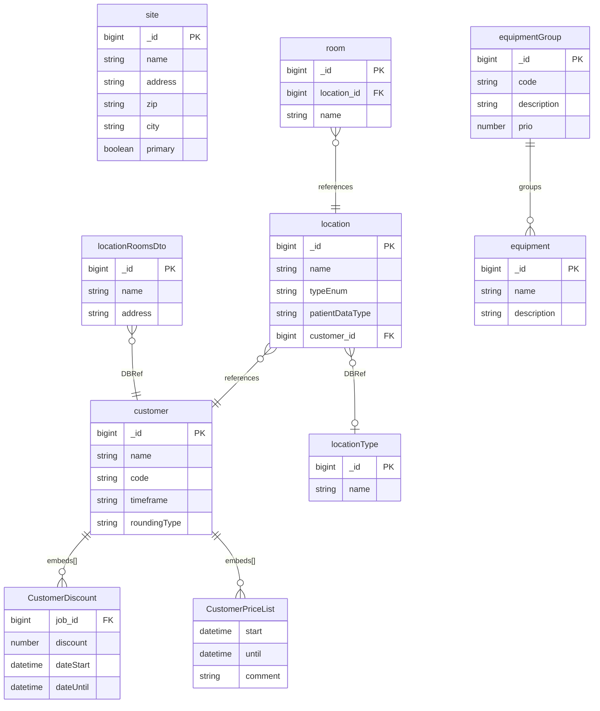

# Customer

[← Back to Index](./readme.md)

This file covers the Customer category: entities related to customers, locations, sites, rooms, equipment, and location snapshots.

---

## ER Diagram {#er-diagram}

Customer accounts, consultation sites, room inventory, equipment, and location snapshots.

---

## Entities in This Category

| Table Name (DBML) | Business Entity | Description Summary |
| :--- | :--- | :--- |
| [`customer`](#entity-customers) | Kunden (Customers) | Organizational entities (customers) that are assigned to locations and appointment plans. |
| [`location`](#entity-locations) | Standorte (Locations) | Definition of consultation sites, including room configurations and contact details. |
| [`locationType`](#entity-location-types) | Standorttypen (Location Types) | Classification for different types of consultation locations. |
| [`site`](#entity-sites) | Seiten/Standorte (Sites) | Physical locations or digital sites associated with the system. |
| [`room`](#entity-rooms) | Räume (Rooms) | Individual consultation or treatment rooms within a location. |
| [`locationRoomsDto`](#entity-location-rooms-dto) | Standort-Snapshots (Location Rooms DTO) | Snapshots of location and room configurations at a specific point in time. |
| [`equipmentGroup`](#entity-equipment-groups) | Ausrüstungsgruppen (Equipment Groups) | Grouping of equipment for easier management and assignment. |
| [`equipment`](#entity-equipment) | Ausrüstung (Equipment) | Inventory of medical or technical equipment used in consultations. |

---

## Entity: Kunden (Customers) {#entity-customers}
Organizational entities (customers) that are assigned to locations and appointment plans.

### Table: customer
| Column | Type | Field Type | Description |
| :--- | :--- | :--- | :--- |
| `_id` | `Long` | schema | Interner Bezeichner |
| `version` | `Long` | schema | Versionsnummer (Zeitstempel) |
| `name` | `String` | schema | Name des Kunden |
| `code` | `String` | schema | Kunden-Code |
| `representative` | `String` | schema | Ansprechpartner |
| `email` | `String` | schema | E-Mail-Adresse |
| `uid` | `String` | schema | Umsatzsteuer-ID |
| `bank` | `String` | schema | Kreditinstitut |
| `bic` | `String` | schema | BIC |
| `iban` | `String` | schema | IBAN |
| `address` | `String` | schema | Straße und Hausnummer |
| `address2` | `String` | schema | Adresszusatz |
| `zip` | `String` | schema | Postleitzahl |
| `city` | `String` | schema | Ort |
| `state` | `String` | schema | Bundesland |
| `country` | `String` | schema | Land |
| `webpage` | `String` | schema | Webseite |
| `phone` | `String` | schema | Telefonnummer |
| `phone2` | `String` | schema | Zweite Telefonnummer |
| `faxNumber` | `String` | schema | Faxnummer |
| `timeframe` | `String` | schema | Abrechnungszeitraum: • `MONTHLY` (Used) |
| `roundingType` | `String` | schema | Rundungsregel: • `FULL_HOUR` (Used) • `HALF_HOUR` (Used) |
| `roundingTypeExceptions` | `Array` | schema | Ausnahmen von der Rundungsregel |
| `discounts` | `Array` | schema | Liste von Rabatten ([CustomerDiscount](#sub-entity-customerdiscount)) |
| `priceLists` | `Array` | schema | Zugeordnete Preislisten ([CustomerPriceList](#sub-entity-customerpricelist)) |
| `priceListsValid` | `String` | schema | Validierungshinweis für Preislisten (Freitext) |
| `dateCustomer` | `Date` | schema | Kundendatum |
| `dateCreated` | `Date` | schema | Erstellungsdatum |
| `createdById` | `Long` | schema | Ersteller (Reference to [user](./user-management.md#entity-expert)) |
| `dateChanged` | `Date` | schema | Änderungsdatum |
| `changedById` | `Long` | schema | Geändert von (Reference to [user](./user-management.md#entity-expert)) |
| `_class` | `String` | schema | Laufzeitklassen-Marker: `de.videoclinic.model.Customer` |

The `customer` entity is referenced by:
- [`appointment`](./planning.md#entity-appointments)
- [`appointmentPlan`](./planning.md#entity-appointment-plan)
- [`consultationData`](./treatment.md#entity-consultation-data) (as `customer` sub-entity)
- [`invoiceComponent`](./accounting.md#entity-invoice-components)
- [`invoiceReceiver`](./accounting.md#entity-invoice-receivers)
- [`location`](#entity-locations)
- [`project`](./deprecated.md#entity-projects)
- [`treatment`](./treatment.md#entity-treatment)
- [`locationRoomsDto`](#entity-location-rooms-dto)

### Sub-entities for customer

#### Sub-entity: CustomerDiscount {#sub-entity-customerdiscount}
Definition eines kundenindividuellen Rabatts für eine bestimmte Dienstleistung.

| Column | Type | Field Type | Description |
| :--- | :--- | :--- | :--- |
| `job` | `Long` | schema | Reference ID to [jobId](./accounting.md#entity-service) |
| `discount` | `Number` | schema | Rabattsatz |
| `comment` | `String` | schema | Kommentar |
| `dateStart` | `Date` | schema | Startdatum |
| `dateUntil` | `Date` | schema | Enddatum |

The `CustomerDiscount` sub-entity is used within:
- [`customer`](#entity-customers) (as `discounts` array)

#### Sub-entity: CustomerPriceList {#sub-entity-customerpricelist}
Zuweisung einer Preisliste zu einem Kunden mit zeitlicher Gültigkeit.

| Column | Type | Field Type | Description |
| :--- | :--- | :--- | :--- |
| `priceList` | `Document` | snapshot | Snapshot der Preisliste (enthält `_id` und `name`) |
| `start` | `Date` | schema | Startdatum |
| `until` | `Date` | schema | Enddatum |
| `comment` | `String` | schema | Kommentar |

The `CustomerPriceList` sub-entity is used within:
- [`customer`](#entity-customers) (as `priceLists` array)

## Entity: Standorte (Locations) {#entity-locations}
Medizinische Einrichtungen oder Standorte, an denen Konsultationen durchgeführt werden.

### Table: location
| Column | Type | Field Type | Description |
| :--- | :--- | :--- | :--- |
| `_id` | `Long` | schema | Interner Bezeichner |
| `foreignId` | `String` | schema | Externe ID (JVA) |
| `externalId` | `String` | schema | Externe ID (ZMS) |
| `version` | `Long` | schema | Versionsnummer |
| `uid` | `String` | schema | Umsatzsteuer-ID |
| `type` | `DBRef` | schema | Reference to [locationType](#entity-location-types) |
| `typeEnum` | `String` | schema | Typ als Enum-String |
| `name` | `String` | schema | Name der Einrichtung |
| `building` | `String` | schema | Gebäude |
| `address` | `String` | schema | Adresse |
| `address2` | `String` | schema | Adresszusatz |
| `zip` | `String` | schema | PLZ |
| `city` | `String` | schema | Ort |
| `state` | `String` | schema | Bundesland |
| `country` | `String` | schema | Land |
| `bank` | `String` | schema | Kreditinstitut |
| `bic` | `String` | schema | BIC |
| `iban` | `String` | schema | IBAN |
| `sipAccounts` | `Array` | schema | Liste von SIP-Accounts ([SipAccount](./user-management.md#sub-entity-sipaccount)) |
| `representative` | `String` | schema | Ansprechpartner |
| `phone` | `String` | schema | Telefonnummer |
| `phoneMedical` | `String` | schema | Medizinische Telefonnummer |
| `contactMedical` | `String` | schema | Medizinischer Ansprechpartner |
| `emailMedical` | `String` | schema | Medizinische E-Mail |
| `sip1` | `String` | schema | SIP 1 |
| `sip2` | `String` | schema | SIP 2 |
| `sipMobile` | `String` | schema | SIP Mobil |
| `fax` | `String` | schema | Faxnummer |
| `medicationType` | `String` | schema | Art der Medikation |
| `patientDataType` | `String` | schema | Art der Patientendatenübermittlung: • `EXTERNAL` (Used) • `EXTERNAL_BASISWEB` (Used) • `INTERNAL` (Used) • `INTERNAL_DAV` (Used) • `INTERNAL_SECUREBOX` (Used) • `INTERNAL_VCCLOUD` (Used) |
| `patientDataAccess` | `Document` | schema | Konfiguration für Datenzugriff ([LocationPatientDataAccess](#sub-entity-locationpatientdataaccess)) |
| `booknumberMask` | `String` | schema | Maske für Buchnummern |
| `externalDescription` | `String` | schema | Externe Beschreibung |
| `customer` | `DBRef` | schema | Reference to [customer](#entity-customers) |
| `longitude` | `Number` | schema | Längengrad |
| `latitude` | `Number` | schema | Breitengrad |
| `_class` | `String` | schema | Laufzeitklassen-Marker: `de.videoclinic.model.Location` |

The `location` entity is referenced by:
- [`appointment`](./planning.md#entity-appointments)
- [`appointmentPlan`](./planning.md#entity-appointment-plan)
- [`consultationData`](./treatment.md#entity-consultation-data) (as `location` sub-entity)
- [`invoiceComponent`](./accounting.md#entity-invoice-components)
- [`invoiceReceiver`](./accounting.md#entity-invoice-receivers)
- [`project`](./deprecated.md#entity-projects)
- [`treatment`](./treatment.md#entity-treatment)
- [`basisWebAppointment`](./interfaces.md#entity-basis-web-appointment)
- [`onboardingHistory`](./user-management.md#entity-onboarding-history)
- [`cDRCallAssignment`](./external-data.md#entity-cdr-call-assignment)
- [`room`](#entity-rooms)
- [`patientData`](./treatment.md#entity-patient-data)

### Sub-entities for location

#### Sub-entity: LocationPatientDataAccess {#sub-entity-locationpatientdataaccess}
Konfiguration für den Zugriff auf externe Patientendaten (z.B. SecureBox).

| Column | Type | Field Type | Description |
| :--- | :--- | :--- | :--- |
| `_id` | `String` | inferred | Internal identifier |
| `user` | `String` | schema | Benutzername |
| `password` | `String` | schema | Passwort |
| `url` | `String` | schema | Zugriff-URL |
| `backupUrl` | `String` | schema | Backup-URL |
| `host` | `String` | schema | Host |
| `email` | `String` | schema | E-mail |
| `subject` | `String` | schema | Betreff |
| `active` | `Boolean` | schema | Status des Zugangs |
| `type` | `String` | schema | Art des Datenzugriffs: • `INTERNAL_SECUREBOX` (Used) • `EXTERNAL` (Used) |
| `address` | `String` | schema | URL oder IP-Adresse der SecureBox |
| `port` | `Number` | schema | Portnummer |
| `secure` | `Boolean` | schema | Ob SSL verwendet wird |
| `comment` | `String` | schema | Kommentar zur Konfiguration |

The `LocationPatientDataAccess` sub-entity is used within:
- [`location`](#entity-locations) (as `patientDataAccess` field)

## Entity: Standorttypen (Location Types) {#entity-location-types}
Kategorisierung von Standorten: `JVA`, `CLINIC`, `POLICE`, etc.

### Table: locationType
| Column | Type | Field Type | Description |
| :--- | :--- | :--- | :--- |
| `_id` | `Long` | schema | Interner Bezeichner |
| `name` | `String` | schema | Name des Typs: • `JVA` (Used) • `MRV` (Used) • `SHIP` (Used) • `CLINIC` (Used) • `POLICE` (Used) • `OTHER` (Used) • `MUKI` (Used) • `INTERN` (Used) • `KUR` (Used) |
| `description` | `String` | inferred | Beschreibung |
| `prio` | `Number` | schema | Sortierpriorität |
| `_class` | `String` | schema | Laufzeitklassen-Marker: `de.videoclinic.model.LocationType` |

The `locationType` entity is referenced by:
- [`location`](#entity-locations) (conceptually, though not explicitly shown in schema samples)

## Entity: Seiten/Standorte (Sites) {#entity-sites}
Allgemeine Informationen zu physischen Standorten oder Web-Präsenzen.

### Table: site
| Column | Type | Field Type | Description |
| :--- | :--- | :--- | :--- |
| `_id` | `Long` | schema | Interner Bezeichner |
| `version` | `Long` | schema | Versionsnummer |
| `name` | `String` | schema | Name der Seite |
| `address` | `String` | schema | Adresse |
| `zip` | `String` | schema | PLZ |
| `city` | `String` | schema | Ort |
| `primary` | `Boolean` | schema | Hauptstandort Kennzeichnung |
| `dateCreated` | `Date` | inferred | Erstellungsdatum |
| `createdBy` | `DBRef` | inferred | Erstellt von |
| `dateChanged` | `Date` | inferred | Änderungsdatum |
| `changedBy` | `DBRef` | inferred | Geändert von |
| `_class` | `String` | schema | Laufzeitklassen-Marker: `de.videoclinic.model.Site` |

The `site` entity is used for:
- (Organizational structure and location grouping)

## Entity: Räume (Rooms) {#entity-rooms}
Definition von physischen Räumen an den Standorten.

### Table: room
| Column | Type | Field Type | Description |
| :--- | :--- | :--- | :--- |
| `_id` | `Long` | schema | Interner Bezeichner |
| `version` | `Long` | schema | Versionsnummer |
| `location` | `DBRef` | schema | Reference to [location](#entity-locations) |
| `name` | `String` | inferred | Raumname |
| `number` | `String` | inferred | Raumnummer |
| `available` | `Boolean` | schema | Verfügbarkeit |
| `_class` | `String` | schema | Laufzeitklassen-Marker: `de.videoclinic.model.Room` |

The `room` entity references:
- [`location`](#entity-locations)

## Entity: Standort-Snapshots (Location Rooms DTO) {#entity-location-rooms-dto}
Snapshots von Standortdaten inklusive Raum-Informationen für die Web-Oberfläche.

### Table: locationRoomsDto
| Column | Type | Field Type | Description |
| :--- | :--- | :--- | :--- |
| `_id` | `Long` | schema | Interner Bezeichner |
| `version` | `Long` | schema | Versionsnummer |
| `name` | `String` | schema | Name des Standorts |
| `address` | `String` | inferred | Adresse |
| `customer` | `DBRef` | schema | Reference to [customer](#entity-customers) |
| `_class` | `String` | schema | Laufzeitklassen-Marker: `de.videoclinic.model.LocationRoomsDto` (Used) |

The `locationRoomsDto` entity is used for:
- (UI snapshots of location data)

## Entity: Ausrüstungsgruppen (Equipment Groups) {#entity-equipment-groups}
Kategorisierung von medizinischer Ausrüstung.

### Table: equipmentGroup
| Column | Type | Field Type | Description |
| :--- | :--- | :--- | :--- |
| `_id` | `Long` | schema | Interner Bezeichner |
| `version` | `Long` | schema | Versionsnummer |
| `code` | `String` | schema | Gruppen-Code |
| `description` | `String` | schema | Beschreibung |
| `prio` | `Number` | schema | Priorität |
| `_class` | `String` | schema | Laufzeitklassen-Marker: `de.videoclinic.model.EquipmentGroup` (Used) |

The `equipmentGroup` entity is referenced by:
- [`equipment`](#entity-equipment) (conceptually, to group inventory items)

## Entity: Ausrüstung (Equipment) {#entity-equipment}
Verzeichnis von medizinischem Equipment, das an Standorten vorhanden sein kann.

### Table: equipment
| Column | Type | Field Type | Description |
| :--- | :--- | :--- | :--- |
| `_id` | `Long` | schema | Interner Bezeichner |
| `name` | `String` | inferred | Name des Equipments |
| `description` | `String` | schema | Beschreibung |
| `_class` | `String` | schema | Laufzeitklassen-Marker: `de.videoclinic.model.Equipment` (Used) |

The `equipment` entity is referenced by:
- [`questionaire`](./treatment.md#entity-questionaires) (implicitly via quality ratings)
