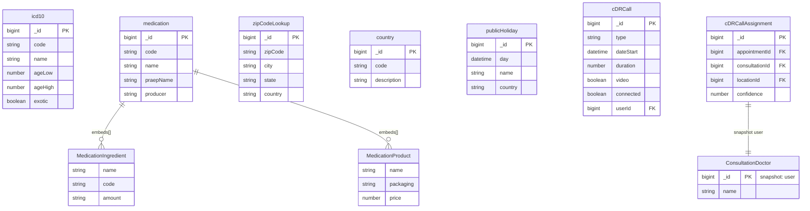

# External Data

[← Back to Index](./readme.md)

This file covers the External Data category: reference data including medical classifications, medications, and telephony logs.

---

## ER Diagram {#er-diagram} {#er-diagram}

Reference data: ICD-10 codes, medications, geography, and telephony.

---

## Entities in This Category

| Table Name (DBML) | Business Entity | Description Summary |
| :--- | :--- | :--- |
| [`icd10`](#entity-icd-10) | ICD-10 Klassifikation (ICD-10) | International Classification of Diseases (ICD-10) codes and descriptions. |
| [`medication`](#entity-medication) | Medikamente (Medication) | Comprehensive database of medications, ingredients, and dosages. |
| [`zipCodeLookup`](#entity-zip-code-lookup) | PLZ-Verzeichnis (Zip Code Lookup) | Geographic reference data for postal codes and cities. |
| [`country`](#entity-countries) | Länder (Countries) | Reference data for countries, including codes and names. |
| [`publicHoliday`](#entity-public-holidays) | Feiertage (Public Holidays) | Definition of public holidays for specific regions and years. |
| [`cDRCall`](#entity-cdr-calls) | Anrufliste (CDR Calls) | Call Detail Records for tracking telephonic interactions. |
| [`cDRCallAssignment`](#entity-cdr-call-assignment) | CDR Call Zuweisungen (CDR Call Assignment) | Mapping of call records to specific patients or consultations. |

---

## Entity: ICD-10 Klassifikation (ICD-10) {#entity-icd-10} {#entity-icd-10}
Systematische Verzeichnis der Krankheiten und verwandter Gesundheitsprobleme.

### Table: icd10
| Column | Type | Field Type | Description |
| :--- | :--- | :--- | :--- |
| `_id` | `Long` | schema | Interner Bezeichner |
| `version` | `Long` | schema | Versionsnummer (Zeitstempel) |
| `code` | `String` | schema | ICD-10 Code |
| `name` | `String` | schema | Bezeichnung der Diagnose |
| `text` | `String` | schema | Detaillierter Text zur Diagnose |
| `inclusion` | `String` | schema | Einschlüsse |
| `exclusion` | `String` | schema | Ausschlusskriterien |
| `ageLow` | `Number` | schema | Mindestalter |
| `ageHigh` | `Number` | schema | Höchstalter |
| `exotic` | `Boolean` | schema | Ob es sich um eine seltene/exotische Diagnose handelt |
| `_class` | `String` | schema | Laufzeitklassen-Marker: `de.videoclinic.model.Icd10` |

The `icd10` entity is referenced by:
- [`consultationData`](./treatment.md#entity-consultation-data) (in `standard.diagnosis`)

## Entity: Medikamente (Medication) {#entity-medication} {#entity-medication}
Zentrales Verzeichnis der verfügbaren Medikamente mit Inhaltsstoffen, Produkten und Anwendungshinweisen.

### Table: medication
| Column | Type | Field Type | Description |
| :--- | :--- | :--- | :--- |
| `_id` | `Long` | schema | Interner Bezeichner |
| `version` | `Long` | schema | Versionsnummer (Zeitstempel) |
| `code` | `String` | schema | Medikamenten-Code |
| `group` | `String` | schema | Medikamenten-Gruppe |
| `name` | `String` | schema | Bezeichnung des Medikaments |
| `praepName` | `String` | schema | Präparatename |
| `producer` | `String` | schema | Hersteller |
| `medical` | `Boolean` | schema | Ob es sich um ein medizinisches Produkt handelt |
| `monokomb` | `String` | schema | Monopräparat oder Kombinationspräparat (Used: `NO`) |
| `ingredientCode` | `String` | schema | Code der Wirkstoffe (Systematische Kodierung) |
| `ingredientInfo` | `String` | schema | Information zur Wirkstoffmenge |
| `ingredients` | `Array` | schema | Liste der Inhaltsstoffe ([MedicationIngredient](#sub-entity-medicationingredient)) |
| `products` | `Array` | schema | Liste der verfügbaren Produkte ([MedicationProduct](#sub-entity-medicationproduct)) |
| `contra` | `String` | schema | Kontraindikationen (Freitext/Strukturierter Text) |
| `area` | `String` | schema | Anwendungsgebiete (Freitext/Strukturierter Text) |
| `usage` | `String` | schema | Anwendungshinweise (Freitext/Strukturierter Text) |
| `infoFeeding` | `String` | schema | Informationen zu Schwangerschaft und Stillzeit (Freitext) |
| `infoSideEffects` | `String` | schema | Nebenwirkungen (Freitext) |
| `infoInteractions` | `String` | schema | Wechselwirkungen (Freitext) |
| `dosage` | `String` | schema | Dosierungshinweise (Freitext) |
| `_class` | `String` | schema | Laufzeitklassen-Marker: `de.videoclinic.model.Medication` |

The `medication` entity is referenced by:
- [`consultationData`](./treatment.md#entity-consultation-data) (in `standard.prescription`)

### Sub-entities for medication

#### Sub-entity: MedicationIngredient {#sub-entity-medicationingredient} {#sub-entity-medicationingredient}
Einzelner Wirkstoff oder Hilfsstoff eines Medikaments.

| Column | Type | Field Type | Description |
| :--- | :--- | :--- | :--- |
| `_id` | `String` | schema | Internal identifier |
| `name` | `String` | schema | Name des Inhaltsstoffs |
| `code` | `String` | schema | Code des Inhaltsstoffs (Systematische Kodierung) |
| `equivalent` | `String` | schema | Entsprechung |
| `amount` | `String` | schema | Menge (z.B. "50 mg") |
| `extra` | `Boolean` | schema | Ob es sich um einen Hilfsstoff handelt |

The `MedicationIngredient` sub-entity is used within:
- [`medication`](#entity-medication) (as `ingredients` array)
- [`MedicationProduct`](#sub-entity-medicationproduct) (as `ingredients` snapshot array)

#### Sub-entity: MedicationProduct {#sub-entity-medicationproduct} {#sub-entity-medicationproduct}
Konkrete Packungsform oder Variante eines Medikaments.

| Column | Type | Field Type | Description |
| :--- | :--- | :--- | :--- |
| `_id` | `String` | schema | Internal identifier |
| `name` | `String` | schema | Name der Packung |
| `packaging` | `String` | schema | Packungsgröße (z.B. "50 g (N2)") |
| `packageName` | `String` | schema | Ausgeschriebener Packungsname |
| `rl` | `Boolean` | schema | Relevanz-Indikator |
| `price` | `Number` | schema | Preis |
| `ingredients` | `Array` | snapshot | Liste der Inhaltsstoffe (Snapshot) |

The `MedicationProduct` sub-entity is used within:
- [`medication`](#entity-medication) (as `products` array)

## Entity: PLZ-Verzeichnis (Zip Code Lookup) {#entity-zip-code-lookup} {#entity-zip-code-lookup}
Verzeichnis von Postleitzahlen zur Zuordnung von Orten und Bundesländern.

### Table: zipCodeLookup
| Column | Type | Field Type | Description |
| :--- | :--- | :--- | :--- |
| `_id` | `Long` | schema | Interner Bezeichner |
| `zipCode` | `String` | schema | Postleitzahl |
| `city` | `String` | schema | Ort |
| `state` | `String` | schema | Bundesland |
| `country` | `String` | schema | Land |
| `_class` | `String` | schema | Laufzeitklassen-Marker: `de.videoclinic.model.ZipCodeLookup` |

The `zipCodeLookup` entity is used for:
- (Geographic data validation and lookups in the UI)

## Entity: Länder (Countries) {#entity-countries} {#entity-countries}
Verzeichnis von Ländern für Adressdaten und Feiertagsberechnungen.

### Table: country
| Column | Type | Field Type | Description |
| :--- | :--- | :--- | :--- |
| `_id` | `Long` | schema | Interner Bezeichner |
| `version` | `Long` | schema | Versionsnummer |
| `code` | `String` | schema | Ländercode (ISO) |
| `description` | `String` | schema | Name des Landes |
| `_class` | `String` | schema | Laufzeitklassen-Marker: `de.videoclinic.model.Country` |

The `country` entity is used by:
- (Geographic lookup and address validation)

## Entity: Feiertage (Public Holidays) {#entity-public-holidays} {#entity-public-holidays}
Definition von gesetzlichen Feiertagen zur Berücksichtigung in der Planung.

### Table: publicHoliday
| Column | Type | Field Type | Description |
| :--- | :--- | :--- | :--- |
| `_id` | `Long` | schema | Interner Bezeichner |
| `day` | `Date` | schema | Datum des Feiertags |
| `name` | `String` | schema | Name des Feiertags (Freitext) |
| `country` | `String` | schema | Land (e.g. `DE`) |
| `states` | `Array` | inferred | Liste der Bundesländer (Strings) |
| `_class` | `String` | schema | Laufzeitklassen-Marker: `de.videoclinic.model.PublicHoliday` |

The `publicHoliday` entity is used by:
- (Planning modules to identify non-working days)

## Entity: Anrufliste (CDR Calls) {#entity-cdr-calls} {#entity-cdr-calls}
Erfasst Details zu getätigten Video- und Audioanrufen (Call Detail Records).

### Table: cDRCall
| Column | Type | Field Type | Description |
| :--- | :--- | :--- | :--- |
| `_id` | `Long` | schema | Interner Bezeichner |
| `version` | `Long` | schema | Versionsnummer |
| `type` | `String` | schema | Art des Anrufs: • `DIRECT` (Used) • `CONFERENCE` (Used) • `FORWARDED` (Used) • `INVALID_MISSING_EXPERT` (Used) • `INVALID_SHORT` (Used) • `INVALID_UNKNOWN` (Used) |
| `dateStart` | `Date` | schema | Startzeitpunkt |
| `dateConnect` | `Date` | schema | Verbindungszeitpunkt |
| `dateDisconnect` | `Date` | schema | Trennungszeitpunkt |
| `duration` | `Long` | schema | Dauer in Sekunden |
| `video` | `Boolean` | inferred | Ob Video genutzt wurde |
| `callingNumber` | `String` | inferred | Anrufende Nummer |
| `connected` | `Boolean` | inferred | Ob eine Verbindung zustande kam |
| `location` | `String` | schema | Ort des Anrufs |
| `userId` | `Long` | inferred | Reference to [user](./user-management.md#entity-expert) |
| `assignmentId` | `Long` | inferred | Reference to [appointmentAssignment](./planning.md#entity-appointment-assignments) |
| `_class` | `String` | schema | Laufzeitklassen-Marker: `de.videoclinic.model.CDRCall` |

The `cDRCall` entity is referenced by:
- [`cDRCallAssignment`](#entity-cdr-call-assignment) (implicitly linked by time and location)

## Entity: CDR Call Zuweisungen (CDR Call Assignment) {#entity-cdr-call-assignment} {#entity-cdr-call-assignment}
Ordnet CDR-Anrufe bestimmten Terminen oder Konsultationen zu.

### Table: cDRCallAssignment
| Column | Type | Field Type | Description |
| :--- | :--- | :--- | :--- |
| `_id` | `Long` | schema | Interner Bezeichner |
| `version` | `Long` | schema | Versionsnummer |
| `start` | `Date` | schema | Startzeitpunkt |
| `until` | `Date` | schema | Endzeitpunkt |
| `duration` | `Long` | schema | Dauer in Sekunden |
| `locationId` | `Long` | schema | Reference to [location](./customer.md#entity-locations) |
| `location` | `String` | schema | Name des Ortes |
| `user` | `Document` | schema | Beteiligter Benutzer ([ConsultationDoctor](./user-management.md#sub-entity-consultationdoctor)) |
| `state` | `String` | schema | Status der Zuweisung |
| `appointmentId` | `Long` | inferred | Reference to [appointment](./planning.md#entity-appointments) |
| `consultationId` | `Long` | inferred | Reference to [consultationData](./treatment.md#entity-consultation-data) |
| `confidence` | `Number` | schema | Konfidenzlevel der Zuweisung |
| `_class` | `String` | schema | Laufzeitklassen-Marker: `de.videoclinic.model.CDRCallAssignment` |

The `cDRCallAssignment` entity links calls to:
- [`appointment`](./planning.md#entity-appointments)
- [`consultationData`](./treatment.md#entity-consultation-data)
