# Treatment

[← Back to Index](./readme.md)

This file covers the Treatment category: core medical data, consultations, treatments, and patient information.

---

## ER Diagram {#er-diagram}

Medical treatments, consultations, patient data, and clinical records.

```mermaid
erDiagram
    treatment {
        bigint _id PK
        string type
        string state
        number countTotal
        number countFinished
        number countPlanned
        number minutes
    }
    treatmentCategory {
        bigint _id PK
        string name
        number prio
    }
    consultationData {
        bigint _id PK
        string type
        string state
        boolean archived
        boolean requireReporting
        bigint basisWebDataId FK
        string paymentType "only in consultationData"
    }
    consultation {
        bigint _id PK "CQRS read projection"
        string type
        string state
        boolean archived
        boolean requireReporting
        bigint basisWebDataId FK
    }
    patientData {
        bigint _id PK
        bigint appointmentId FK
        string booknumber
    }
    patient {
        bigint _id PK
        string firstName
        string lastName
        string displayName
        datetime birthday
    }
    patientAlerts {
        bigint _id PK
        string name
        string type
        boolean entryRequirement
        number priority
    }
    questionaire {
        bigint _id PK
        bigint appointmentId FK
        bigint consultationId FK
    }
    expertConsultationTemplate {
        bigint _id PK
        string name
        string description
    }
    ConsultationDoctor {
        bigint _id PK "snapshot: user"
        string name
        string email
        string formalDisplayName
    }
    ConsultationDoctorSlim {
        bigint _id PK "snapshot: user (no formalDisplayName)"
        string name
        string email
    }
    ConsultationJob {
        bigint _id PK "snapshot: jobId"
        string code
        string color
        string expertTitle
        string remoteCode
        string title
        string type
    }
    ConsultationLocation {
        bigint _id PK "snapshot: location"
        string name
        string booknumberMask
        string patientDataType
    }
    ConsultationCustomer {
        bigint _id PK "snapshot: customer"
        string name
    }
    ConsultationBase {
        string communicationType
        number timeContact
        boolean medicalTrainedPersonel
        string furtherTreatment
        datetime dateFurtherTreatment
    }
    ConsultationBody {
        string gender
        number age
        datetime birthday
        number bodyHeight
        number bodyWeight
        string rr
        string pulse
    }
    ConsultationStandard {
        string procedureReport
        string furtherTreatment
        string referralTo
    }
    ConsultationOnboarding {
        boolean incarcerationSuitability
        boolean suicidal
        boolean dangerous
    }
    ConsultationWarning {
        boolean applies
        string comment
        datetime dateStart
    }
    PatientAlertsSnapshot {
        bigint _id PK "snapshot: patientAlerts"
        bigint version
        string name
        string type
        boolean entryRequirement
        boolean documentationRequirement
        number priority
    }
    ConsultationHistory {
        string Note "medication[] + history[] from BasisWEB/JVA"
    }
    ConsultationDocument {
        string documentation
    }
    ConsultationIncarceration {
        string type
        boolean incarcerationCapability
        string checkupRequirement
        string intoxication
        boolean requireVideo
        string documentation
    }
    ConsultationReferral {
        boolean referPsychotherapy
    }
    ConsultationPsychoTherapy {
        string comment
    }
    ConsultationTreatment {
        string anamnesisSocial
        string medication
        string reportPsychDiagnostic
    }
    ConsultationReporting {
        datetime dateReportStart
        string reportDocumentation
        datetime dateReportEnd
    }
    TreatmentAttachment {
        boolean attach
    }
    TreatmentPosition {
        bigint appointmentId FK
        string state
        boolean requireReport
    }
    TreatmentReport {
        bigint consultationId FK
        string type
    }

    treatment ||--|| ConsultationDoctor : "snapshot assigned"
    treatment ||--|| ConsultationJob : "snapshot job/jobReport/jobReportProbatorik"
    treatment ||--|| ConsultationCustomer : "snapshot customer"
    treatment ||--|| ConsultationLocation : "snapshot location"
    treatment ||--|| ConsultationDoctorSlim : "snapshot changedBy/createdBy"
    treatment ||--o{ TreatmentAttachment : "embeds[]"
    treatment ||--o{ TreatmentPosition : "embeds[]"
    consultationData ||--|| ConsultationBase : "embeds base"
    consultationData ||--|| ConsultationBody : "embeds body"
    consultationData ||--|| ConsultationStandard : "embeds standard"
    consultationData ||--|| ConsultationOnboarding : "embeds onboarding"
    consultationData ||--o{ ConsultationWarning : "embeds warnings[]"
    consultationData ||--|| ConsultationHistory : "embeds history"
    consultationData ||--|| ConsultationDocument : "embeds document"
    consultationData ||--|| ConsultationIncarceration : "embeds incarceration"
    consultationData ||--|| ConsultationReferral : "embeds referral"
    consultationData ||--|| ConsultationTreatment : "embeds treatment"
    consultationData ||--|| ConsultationReporting : "embeds reporting"
    consultationData ||--|| ConsultationDoctor : "snapshot doctor"
    consultationData ||--|| ConsultationDoctorSlim : "snapshot changedBy/createdBy/reportingExpert"
    consultationData ||--|| ConsultationJob : "snapshot job"
    consultationData ||--|| ConsultationLocation : "snapshot location"
    consultationData ||--|| ConsultationCustomer : "snapshot customer"
    consultation ||--|| ConsultationDoctor : "snapshot doctor"
    consultation ||--|| ConsultationDoctorSlim : "snapshot changedBy/createdBy/reportingExpert"
    consultation ||--|| ConsultationJob : "snapshot job"
    consultation ||--|| ConsultationLocation : "snapshot location"
    consultation ||--|| ConsultationCustomer : "snapshot customer"
    ConsultationWarning ||--|| PatientAlertsSnapshot : "embeds warning (full snapshot)"
    ConsultationReferral ||--|| ConsultationPsychoTherapy : "embeds psychoTherapy"
    ConsultationReporting ||--|| ConsultationDoctor : "snapshot expert"
    TreatmentPosition ||--|| TreatmentReport : "embeds report"
    questionaire }o--|| consultationData : "references"
    patientData }o--|| consultationData : "references appointmentId"
```

---

## Entities in This Category

| Table Name (DBML) | Business Entity | Description Summary |
| :--- | :--- | :--- |
| [`treatment`](#entity-treatment) | Behandlungsverlauf (Treatment) | Tracking of medical treatments, including states and positions. |
| [`treatmentCategory`](#entity-treatment-categories) | Behandlungskategorien (Treatment Categories) | Categories for organizing and classifying different treatments. |
| [`consultationData`](#entity-consultation-data) | Konsultationsdaten (Consultation Data) | Source of truth for consultation records, including all medical sub-documents, prescriptions, and results. |
| [`consultation`](#entity-consultation) | Konsultationen (CQRS Read Projection) | Read-only projection of `consultationData` (missing `paymentType`). Compound index on `{ period, location._id }` for list queries. |
| [`expertConsultationTemplate`](#entity-expert-consultation-templates) | Konsultationsvorlagen (Expert Consultation Templates) | Custom templates used by experts for various consultation types. |
| [`patientData`](#entity-patient-data) | Patientenergänzungsdaten (Patient Data) | Additional metadata and settings associated with a patient profile. |
| [`patient`](#entity-patients) | Patienten (Patients) | Core patient profiles, including demographic and contact information. |
| [`patientAlerts`](#entity-patient-alerts) | Patientenbezogene Risikofaktoren / Warnhinweise (Patient Alerts) | Exclusion criteria (warnings) consisting of name, description, weight, and status. |
| [`serviceQm`](#entity-service-qm) | Service-Qualitätsmanagement (Service QM) | Data related to quality assurance and management of medical services. |
| [`questionaire`](#entity-questionaires) | Qualitätsumfragen (Questionaires) | Quality management surveys and results. |

---

## Entity: Behandlungsverlauf (Treatment) {#entity-treatment}
Erfasst den Verlauf von Behandlungen, insbesondere im Bereich der Psychotherapie.

### Table: treatment
| Column | Type | Field Type | Description |
| :--- | :--- | :--- | :--- |
| `_id` | `Long` | schema | Interner Bezeichner |
| `version` | `Long` | schema | Versionsnummer |
| `assigned` | `Document` | snapshot | Zugewiesener Experte (denormalized snapshot, copy of fields from [`user`](./user-management.md#entity-expert)) ([ConsultationDoctor](./user-management.md#sub-entity-consultationdoctor)) |
| `hour` | `Number` | schema | Stundenindex |
| `day` | `String` | schema | Wochentag: • `MO` (Used) • `TU` (Used) • `WE` (Used) • `TH` (Used) • `FR` (Used) |
| `bookNumber` | `String` | schema | Buchnummer (JVA) |
| `jNumber` | `String` | schema | J-Nummer (JVA) |
| `type` | `String` | schema | Art der Behandlung: • `PSYCH` (Used) |
| `state` | `String` | schema | Status der Behandlung: • `ACTIVE` (Used) • `CANCELED` (Used) • `CANCELED_CLOSED` (Used) • `CLOSED` (Used) • `ENDING` (Used) • `PROBATORIK` (Used) • `RUNNING` (Used) • `STARTED` (Used) • `STORNO` (Used) • `STORNO_CLOSED` (Used) |
| `dateStorno` | `Date` | schema | Stornierungsdatum |
| `job` | `Document` | snapshot | Erbrachte Dienstleistung (denormalized snapshot, copy of fields from [`jobId`](./accounting.md#entity-service)) ([ConsultationJob](./user-management.md#sub-entity-consultationjob)) |
| `jobReport` | `Document` | snapshot | Dienstleistung für Berichte (denormalized snapshot, copy of fields from [`jobId`](./accounting.md#entity-service)) ([ConsultationJob](./user-management.md#sub-entity-consultationjob)) |
| `reportingPath` | `String` | schema | Pfad für das Reporting |
| `jobReportPobatorik` | `Document` | snapshot | Dienstleistung für Probatorik-Berichte (denormalized snapshot, copy of fields from [`jobId`](./accounting.md#entity-service)) ([ConsultationJob](./user-management.md#sub-entity-consultationjob)) |
| `archived` | `Boolean` | schema | Archivierungsstatus |
| `attachments` | `Array` | schema | Liste von Anhängen ([TreatmentAttachment](#sub-entity-treatmentattachment)) |
| `positions` | `Array` | schema | Einzelne Termine der Behandlung ([TreatmentPosition](#sub-entity-treatmentposition)) |
| `changedBy` | `Document` | snapshot | Zuletzt geändert von (denormalized snapshot, copy of fields from [`user`](./user-management.md#entity-expert)) ([ConsultationDoctor](./user-management.md#sub-entity-consultationdoctor)) |
| `dateChanged` | `Date` | schema | Zeitpunkt der letzten Änderung |
| `createdBy` | `Document` | snapshot | Erstellt von (denormalized snapshot, copy of fields from [`user`](./user-management.md#entity-expert)) ([ConsultationDoctor](./user-management.md#sub-entity-consultationdoctor)) |
| `dateCreated` | `Date` | inferred | Erstellungsdatum |
| `closed` | `Date` | schema | Abschlussdatum |
| `countTotal` | `Number` | schema | Gesamtanzahl |
| `countFinished` | `Number` | schema | Anzahl abgeschlossener Termine |
| `dateInitial` | `Date` | schema | Initiales Datum |
| `countPlanned` | `Number` | schema | Anzahl geplanter Termine |
| `comment` | `String` | schema | Kommentar |
| `dateAcceptedPTLeitung` | `Date` | schema | Akzeptiert von PT-Leitung am |
| `dateAcceptedPT` | `Date` | schema | Akzeptiert von PT am |
| `dateAcceptedLocation` | `Date` | schema | Akzeptiert von Standort am |
| `dateStarted` | `Date` | schema | Startdatum (tatsächlich) |
| `dateStart` | `Date` | schema | Startdatum (geplant) |
| `dateLastAppointment` | `Date` | schema | Datum des letzten Termins |
| `reportCountInitial` | `Number` | schema | Initiale Anzahl Berichte |
| `reportCountRhytm` | `Number` | schema | Rhythmus der Berichte |
| `customer` | `Document` | snapshot | Zugehöriger Kunde (denormalized snapshot, copy of fields from [`customer`](./customer.md#entity-customers)) ([ConsultationCustomer](./user-management.md#sub-entity-consultationcustomer)) |
| `location` | `Document` | snapshot | Ort der Behandlung (denormalized snapshot, copy of fields from [`location`](./customer.md#entity-locations)) ([ConsultationLocation](./user-management.md#sub-entity-consultationlocation)) |
| `minutes` | `Number` | schema | Dauer in Minuten |
| `_class` | `String` | schema | Laufzeitklassen-Marker: `de.videoclinic.model.Treatment` (Used) |

The `treatment` entity is referenced by:
- [`appointment`](./planning.md#entity-appointments) (via `treatmentId`)
- [`asyncJobQueue`](./system.md#entity-async-job-queue) (via `type`)

### Sub-entities for treatment

The following structures are used as nested documents within the `treatment` collection. Snapshot fields are denormalized copies of selected fields from their source-of-truth entities.

#### Sub-entity: TreatmentAttachment {#sub-entity-treatmentattachment}
Ein einzelner Anhangseintrag innerhalb von `attachments[]`.

| Column | Type | Field Type | Description |
| :--- | :--- | :--- | :--- |
| `file` | `Document` | schema | Dateimetadaten ([TreatmentAttachmentFile](#sub-entity-treatmentattachmentfile)) |
| `attach` | `Boolean` | inferred | Optionaler Anhang-Status (Schema-Feld, in Samples als Boolean beobachtet) |

The `TreatmentAttachment` sub-entity is used within:
- [`treatment`](#entity-treatment) (as `attachments` array)

#### Sub-entity: TreatmentAttachmentFile {#sub-entity-treatmentattachmentfile}
Datei-Metadaten für einen Behandlung-Anhang als denormalized snapshot (copy of fields from persisted file payload, not from [`userFile`](./user-management.md#entity-user-files)).

| Column | Type | Field Type | Description |
| :--- | :--- | :--- | :--- |
| `_id` | `String` | schema | Datei-ID (UUID-ähnlicher Schlüssel) |
| `name` | `String` | schema | Dateiname |
| `mime` | `String` | schema | MIME-Typ |
| `type` | `String` | schema | Dateidomäne im Treatment-Kontext (observed: `treatment`); unterscheidet sich fachlich von `userFile.type` |
| `checksum` | `String` | schema | Prüfsumme |
| `version` | `Number/Long` | inferred | Versionswert; in Samples sowohl `Number` als auch `Long` beobachtet |
| `deep` | `String` | inferred | Storage-/Pfad-Locator innerhalb des Dateispeichers |
| `dateCreated` | `Date` | schema | Erstellungsdatum der Datei |
| `createdBy` | `Long` | schema | Ersteller-ID (copy of field from source payload; source-of-truth reference to [`user`](./user-management.md#entity-expert)) |

The `TreatmentAttachmentFile` sub-entity is used within:
- [`TreatmentAttachment`](#sub-entity-treatmentattachment) (as `file` field)

#### Sub-entity: TreatmentPosition {#sub-entity-treatmentposition}
Ein einzelner Termin oder eine Position innerhalb eines Behandlungsverlaufs.

| Column | Type | Field Type | Description |
| :--- | :--- | :--- | :--- |
| `_id` | `String` | inferred | Internal identifier |
| `appointmentId` | `Long` | schema | Reference to [appointment](./planning.md#entity-appointments) |
| `start` | `Date` | schema | Startzeitpunkt |
| `until` | `Date` | schema | Endzeitpunkt |
| `state` | `String` | schema | Status des Termins: • `CANCELED` (Used) • `CLOSED` (Used) • `DONE` (Used) • `LOCKEDIN` (Used) • `READY` (Used) • `RESCHEDULED` (Used) • `STORNO` (Used) |
| `requireReport` | `Boolean` | schema | Bericht erforderlich |
| `forceReport` | `Boolean` | schema | Bericht erzwingen |
| `report` | `Document` | schema | Referenz auf den Bericht ([TreatmentReport](#sub-entity-treatmentreport)) |

The `TreatmentPosition` sub-entity is used within:
- [`treatment`](#entity-treatment) (as `positions` array)

#### Sub-entity: TreatmentReport {#sub-entity-treatmentreport}
Informationen zum Bericht einer Behandlungsposition.

| Column | Type | Field Type | Description |
| :--- | :--- | :--- | :--- |
| `_id` | `String` | inferred | Internal identifier |
| `type` | `String` | schema | Art des Berichts: • `STANDARD` (Used) |
| `consultationId` | `Long` | schema | Referenz auf [consultationData](#entity-consultation-data) |
| `date` | `Date` | schema | Datum des Berichts |
| `dateStart` | `Date` | schema | Startdatum des Berichts |
| `dateEnd` | `Date` | schema | Enddatum des Berichts |
| `job` | `Document` | snapshot | Zugehörige Dienstleistung (denormalized snapshot of [`jobId`](./accounting.md#entity-service)) ([ConsultationJob](./user-management.md#sub-entity-consultationjob)) |

The `TreatmentReport` sub-entity is used within:
- [`TreatmentPosition`](#sub-entity-treatmentposition) (as `report` field)

## Entity: Behandlungskategorien (Treatment Categories) {#entity-treatment-categories}
Kategorisierung von verschiedenen Behandlungsarten.

### Table: treatmentCategory
| Column | Type | Field Type | Description |
| :--- | :--- | :--- | :--- |
| `_id` | `Long` | schema | Interner Bezeichner |
| `version` | `Long` | schema | Versionsnummer |
| `name` | `String` | schema | Name der Kategorie (Used: `Allgemeinmedizin`, `Allgemeinmedizin_Telearzt`, `Andrologie`, `Anästhesie`, `Apotheke`, `Arbeitsmedizin`, `Audiologie`, `Augenheilkunde`, `Chirurgie`, `Diätassistent`, `Diätberatung`, `Durchgangsarzt`, `Gastroenterologie`, `Genetik`, `Gynäkologie`, `HNO-Heilkunde`, `Haut- und Geschlechtskrankheiten`, `Hämatologie`, `Hörgeräteakkustiker`, `Innere Medizin`, `Kardiologie`, `Kieferorthopädie`, `Labor`, `Logopädie`, `Mund-Kiefer-Gesichtschirurgie`, `Nephrologie`, `Neurologie`, `Nuklearmedizin`, `Onkologie`, `Optiker`, `Orthopädie`, `Orthopädieschuhmacher`, `Orthopädietechniker`, `Pathologie`, `Physiotherapie`, `Pneumologie`, `Psychiatrie`, `Psychiatrie_Telearzt`, `Pädiatrie`, `Radiologie`, `Rechtsmedizin`, `Sanitätshaus`, `Schmerztherapie`, `Traumatologie`, `Urologie`, `Zahnmedizin`, `Zahntechniker`, `sonstige`, `öffentliches Gesundheitswesen`) |
| `description` | `String` | schema | Beschreibung (Freitext) |
| `prio` | `Number` | schema | Priorität |
| `_class` | `String` | schema | Laufzeitklassen-Marker: `de.videoclinic.model.TreatmentCategory` (Used) |

The `treatmentCategory` entity is referenced by:
- [`treatment`](#entity-treatment) (via `category` DBRef)

## Entity: Konsultationsdaten (Consultation Data) {#entity-consultation-data}
Die Konsultationsdaten erfassen alle medizinischen Informationen, die während einer Konsultation dokumentiert werden, einschließlich Anamnese, Befund, Diagnose und Medikation.

> **CQRS-lite Pattern — Source of Truth**: `consultationData` is the **source of truth** for all consultation records. Every field written here is also reflected in [`consultation`](#entity-consultation), except `paymentType` which exists only in this collection. Only a `_id` index exists; records are always retrieved individually by primary key. See the [`consultation`](#entity-consultation) entity for the full dual-collection description.

### Table: consultationData
| Column | Type | Field Type | Description |
| :--- | :--- | :--- | :--- |
| `_id` | `Long` | schema | Interner Bezeichner |
| `version` | `Long` | schema | Versionsnummer (Zeitstempel) |
| `date` | `Date` | schema | Datum der Konsultation |
| `timeStart` | `Number` | schema | Startuhrzeit (Sekunden seit Mitternacht) |
| `timeEnd` | `Number` | schema | Enduhrzeit (Sekunden seit Mitternacht) |
| `dateSignedOff` | `Date` | schema | Datum der Abzeichnung |
| `archived` | `Boolean` | schema | Archivierungsstatus |
| `type` | `String` | schema | Typ der Konsultation: • `EXTERNAL` (Used — 57,130) • `STANDARD` (Used — 31,905) • `ONBOARDING` (Used — 7,610) • `DOCUMENT` (Used — 2,211) • `INCARCERATION` (Used — 529) • `TREATMENT` (Used — 351) • `ONBOARDING_SHORT` (Used — 104) |
| `state` | `String` | schema | Status: • `OPEN` (Used) • `CREATED` (Used) • `CLOSED` (Used) • `REPORTED` (Used) • `TRANSMITTED` (Used) • `VERIFIED` (Used) |
| `base` | `Document` | schema | Basiselemente ([ConsultationBase](#sub-entity-consultationbase)) |
| `body` | `Document` | schema | Körperliche Basisdaten ([ConsultationBody](#sub-entity-consultationbody)) |
| `warnings` | `Array` | schema | Warnhinweise ([ConsultationWarning](#sub-entity-consultationwarning)) |
| `noWarnings` | `Boolean` | schema | Keine Warnhinweise vorhanden |
| `onboarding` | `Document` | schema | Daten der Erstuntersuchung ([ConsultationOnboarding](#sub-entity-consultationonboarding)) |
| `standard` | `Document` | schema | Daten einer Standard-Konsultation ([ConsultationStandard](#sub-entity-consultationstandard)) |
| `incarceration` | `Document` | schema | Daten der Gewahrsamstauglichkeit ([ConsultationIncarceration](#sub-entity-consultationincarceration)) |
| `document` | `Document` | schema | Daten einer Dokumentations-Konsultation ([ConsultationDocument](#sub-entity-consultationdocument)) |
| `referral` | `Document` | schema | Überweisungsdaten ([ConsultationReferral](#sub-entity-consultationreferral)) |
| `treatment` | `Document` | schema | Daten einer Behandlungs-Konsultation ([ConsultationTreatment](#sub-entity-consultationtreatment)) |
| `history` | `Document` | schema | Patientenhistorie aus BasisWEB/JVA ([ConsultationHistory](#sub-entity-consultationhistory)) |
| `attachments` | `Array` | schema | Anhänge (Datei-Metadaten, leer wenn keine Anhänge) |
| `tags` | `Array` | schema | Freitext-Tags |
| `bookNumber` | `String` | inferred | Buchnummer (JVA) |
| `jNumber` | `String` | inferred | J-Nummer (JVA) |
| `basisWebDataId` | `Long` | schema | Reference to [basisWebData](./interfaces.md#entity-basis-web-data) |
| `requireReporting` | `Boolean` | schema | Meldepflicht |
| `externalDown` | `Boolean` | inferred | Externer Ausfall-Marker |
| `qmComplete` | `Boolean` | inferred | Qualitätsmanagement abgeschlossen |
| `comment` | `String` | schema | Kommentar |
| `period` | `Number` | schema | Abrechnungszeitraum (Format YYYYMM) |
| `appointmentType` | `String` | schema | Termintyp: • `APPOINTMENT` (Used) |
| `paymentType` | `String` | schema | Zahlungsart (only in `consultationData`, absent from `consultation`): • `FULL` (Used) |
| `signedOffBy` | `DBRef` | schema | Abgezeichnet von (Reference to [user](./user-management.md#entity-expert)) |
| `appointment` | `DBRef` | schema | Zugehöriger Termin (Reference to [appointment](./planning.md#entity-appointments)) |
| `doctor` | `Document` | snapshot | Durchführender Experte (denormalized snapshot of [`user`](./user-management.md#entity-expert)) ([ConsultationDoctor](./user-management.md#sub-entity-consultationdoctor)) |
| `job` | `Document` | snapshot | Erbrachte Dienstleistung (denormalized snapshot of [`jobId`](./accounting.md#entity-service)) ([ConsultationJob](./user-management.md#sub-entity-consultationjob)) |
| `location` | `Document` | snapshot | Ort der Konsultation (denormalized snapshot of [`location`](./customer.md#entity-locations)) ([ConsultationLocation](./user-management.md#sub-entity-consultationlocation)) |
| `customer` | `Document` | snapshot | Zugehöriger Kunde (denormalized snapshot of [`customer`](./customer.md#entity-customers)) ([ConsultationCustomer](./user-management.md#sub-entity-consultationcustomer)) |
| `changedBy` | `Document` | snapshot | Zuletzt geändert von (denormalized snapshot of [`user`](./user-management.md#entity-expert); fields: `_id`, `name`, `email`) |
| `createdBy` | `Document` | snapshot | Erstellt von (denormalized snapshot of [`user`](./user-management.md#entity-expert); fields: `_id`, `name`, `email`) |
| `reportingExpert` | `Document` | snapshot | Meldepflicht-Experte (denormalized snapshot of [`user`](./user-management.md#entity-expert); fields: `_id`, `name`, `email`) |
| `dateChanged` | `Date` | schema | Zeitpunkt der letzten Änderung |
| `dateCreated` | `Date` | schema | Erstellungszeitpunkt |
| `dateTransmitted` | `Date` | schema | Übermittlungszeitpunkt |
| `dateReported` | `Date` | inferred | Datum der Meldung |
| `transmitResult` | `String` | inferred | Ergebnis der Übermittlung (z.B. `OK INTERNAL_VCCLOUD`) |
| `update` | `String` | inferred | Migrations-/Sync-Marker (z.B. `2023-07`) |
| `_class` | `String` | schema | Laufzeitklassen-Marker: `de.videoclinic.model.Consultation` (same value as in `consultation`) |

The `consultationData` entity is referenced by:
- [`invoiceComponent`](./accounting.md#entity-invoice-components)
- [`log`](./system.md#entity-logs)
- [`questionaire`](#entity-questionaires)
- [`treatment`](#entity-treatment) (in `positions.report`)
- [`cDRCallAssignment`](./external-data.md#entity-cdr-call-assignment)

### Sub-entities for consultationData

#### Sub-entity: ConsultationBase {#sub-entity-consultationbase}
Basiselemente der Konsultation.

| Column | Type | Field Type | Description |
| :--- | :--- | :--- | :--- |
| `_id` | `String` | schema | Internal identifier |
| `medicalTrainedPersonel` | `Boolean` | schema | Medizinisch geschultes Personal anwesend |
| `timeContact` | `Number` | schema | Kontaktzeit |
| `communicationType` | `String` | schema | Art der Kommunikation: • `VIDEO` (Used — 95,077) • `PHONE` (Used — 2,465) • `VCGO` (Used — 1,740) • `EMAIL` (Used — 558) |
| `furtherTreatment` | `String` | schema | Voreinstellung für die weitere Behandlung: • `FOLLOW_UP` (Used) • `IF_REQUIRED` (Used) • `REFERRAL` (Used) • `REFERRAL_OTHER` (Used) |
| `dateFurtherTreatment` | `Date` | schema | Datum der weiteren Behandlung |

The `ConsultationBase` sub-entity is used within:
- [`consultationData`](#entity-consultation-data) (as `base` field)
- [`consultation`](#entity-consultation) (as `base` field — read-only projection)

#### Sub-entity: ConsultationBody {#sub-entity-consultationbody}
Körperliche Basisdaten des Patienten zum Zeitpunkt der Konsultation.

| Column | Type | Field Type | Description |
| :--- | :--- | :--- | :--- |
| `_id` | `String` | inferred | Internal identifier |
| `gender` | `String` | schema | Geschlecht: • `MALE` (Used) • `FEMALE` (Used) • `OTHER` (Used) |
| `age` | `Number` | inferred | Alter |
| `birthday` | `Date` | schema | Geburtsdatum |
| `bodyHeight` | `Number` | schema | Körpergröße |
| `bodyWeight` | `Number` | schema | Körpergewicht |
| `rr` | `String` | schema | Blutdruck (RR) |
| `pulse` | `String` | schema | Puls |

The `ConsultationBody` sub-entity is used within:
- [`consultationData`](#entity-consultation-data) (as `body` field)
- [`consultation`](#entity-consultation) (as `body` field — read-only projection)
- [`expertConsultationTemplate`](#entity-expert-consultation-templates) (as `body` field)

#### Sub-entity: ConsultationWarning {#sub-entity-consultationwarning}
Warnhinweise für den Patienten.

> **Note**: The `warning` field is a **full embedded snapshot** of the [`patientAlerts`](#entity-patient-alerts) document at write time — **not** a DBRef. It carries `_id`, `version`, `name`, `type`, `entryRequirement`, `documentationRequirement`, and `priority`.

| Column | Type | Field Type | Description |
| :--- | :--- | :--- | :--- |
| `_id` | `String` | schema | Internal identifier |
| `warning` | `Document` | snapshot | Vollständiger Snapshot des Warnhinweises (denormalized snapshot of [`patientAlerts`](#entity-patient-alerts); fields: `_id`, `version`, `name`, `type`, `entryRequirement`, `documentationRequirement`, `priority`) |
| `comment` | `String` | schema | Kommentar |
| `applies` | `Boolean` | schema | Trifft zu |
| `dateStart` | `Date` | schema | Startdatum |

The `ConsultationWarning` sub-entity is used within:
- [`consultationData`](#entity-consultation-data) (as `warnings` array)
- [`consultation`](#entity-consultation) (as `warnings` array)

#### Sub-entity: ConsultationOnboarding {#sub-entity-consultationonboarding}
Detaillierte medizinische Daten für die Erstuntersuchung (Zugangsuntersuchung).

| Column | Type | Field Type | Description |
| :--- | :--- | :--- | :--- |
| `_id` | `String` | inferred | Internal identifier |
| `previousPhysician` | `String` | schema | Vorheriger Arzt |
| `preexistingState` | `String` | schema | Vorzustand |
| `preexistingCondition` | `String` | schema | Vorerkrankungen |
| `currentState` | `String` | schema | Aktueller Zustand |
| `hepatitis` | `String` | schema | Hepatitis Status: • `UNKNOWN` (Used) • `SURE` (Used) • `EXCLUDED` (Used) |
| `std` | `String` | schema | STD Status |
| `hiv` | `String` | schema | HIV Status |
| `lungTuberculosis` | `String` | schema | Lungentuberkulose |
| `lungTuberculosis` | `String` | schema | Lungentuberkulose |
| `generalState` | `String` | schema | Allgemeinzustand: • `WELL` (Used) • `REDUCED` (Used) • `OVER` (Used) • `MEDIUM` (Legacy/Orphan — 266 records) |
| `weightState` | `String` | schema | Ernährungszustand: • `WELL` (Used) • `REDUCED` (Used) • `OBESE` (Used) • `CACHECTIC` (Used) • `MEDIUM` (Legacy/Orphan — 335 records) • `OVER` (Legacy/Orphan — 223 records) |
| `workSuitability` | `String` | schema | Arbeitsfähigkeit: • `UNKNOWN` (Used) • `YES` (Used) • `PARTLY` (Used) • `NO` (Used) |
| `outDoorWorkSuitability` | `Boolean` | schema | Außenarbeitseignung |
| `outDoorWorkSuitability` | `Boolean` | schema | Außenarbeitseignung |
| `sportSuitability` | `String` | schema | Sporttauglichkeit: • `UNKNOWN` (Used) • `YES` (Used) • `PARTLY` (Used) • `NO` (Used) |
| `skinCondition` | `String` | schema | Hautbefund |
| `alcoholUsage` | `String` | schema | Alkoholkonsum |
| `drugUsage` | `String` | schema | Drogenkonsum |
| `suicidal` | `Boolean` | schema | Suizidalität |
| `dangerous` | `Boolean` | schema | Fremdgefährdung |
| `incarcerationSuitability` | `Boolean` | schema | Gewahrsamstauglichkeit |
| `singleRoomSuitability` | `Boolean` | schema | Einzelraumunterbringung |
| `requireTreatment` | `Boolean` | schema | Behandlungsbedürftigkeit |
| `singleRoomSuitability` | `Boolean` | schema | Einzelraumunterbringung |
| `requireTreatment` | `Boolean` | schema | Behandlungsbedürftigkeit |

The `ConsultationOnboarding` sub-entity is used within:
- [`consultationData`](#entity-consultation-data) (as `onboarding` field)
- [`consultation`](#entity-consultation) (as `onboarding` field — read-only projection)
- [`expertConsultationTemplate`](#entity-expert-consultation-templates) (as `onboarding` field)

#### Sub-entity: ConsultationStandard {#sub-entity-consultationstandard}
Dokumentation einer Standard-Konsultation.

| Column | Type | Field Type | Description |
| :--- | :--- | :--- | :--- |
| `_id` | `String` | inferred | Internal identifier |
| `medicationAnamnesis` | `Document` | schema | Zusammenfassung der Medikation ([ConsultationMedicationAnamnesis](#sub-entity-consultationmedicationanamnesis)) |
| `anamnesis` | `Array` | schema | Anamnese Einträge ([ConsultationAnamnesis](#sub-entity-consultationanamnesis)) |
| `patientReport` | `Array` | schema | Befundberichte ([ConsultationPatientReport](#sub-entity-consultationpatientreport)) |
| `diagnosis` | `Array` | schema | Diagnosen ([ConsultationDiagnosis](#sub-entity-consultationdiagnosis)) |
| `procedureReport` | `String` | schema | Prozedurenbericht |
| `prescription` | `Array` | schema | Verschreibungen ([ConsultationPrescription](#sub-entity-consultationprescription)) |
| `workIncapacity` | `Array` | schema | Arbeitsunfähigkeit ([ConsultationWorkIncapacity](#sub-entity-consultationworkincapacity)) |
| `referralTo` | `String` | schema | Überweisung an |
| `furtherTreatment` | `String` | schema | Voreinstellung für die weitere Behandlung (mapped to [ConsultationBase.furtherTreatment](#sub-entity-consultationbase)) |

The `ConsultationStandard` sub-entity is used within:
- [`consultationData`](#entity-consultation-data) (as `standard` field)
- [`consultation`](#entity-consultation) (as `standard` field — read-only projection)
- [`expertConsultationTemplate`](#entity-expert-consultation-templates) (as `standard` field)

#### Sub-entity: ConsultationMedicationAnamnesis {#sub-entity-consultationmedicationanamnesis}
Zusammenfassung der Medikationsanamnese mit Kategorisierung.

| Column | Type | Field Type | Description |
| :--- | :--- | :--- | :--- |
| `_id` | `String` | inferred | Internal identifier |
| `documentation` | `String` | schema | Dokumentation der Medikation |
| `categoryA01` | `Boolean` | schema | Kategorie A01 |
| `categoryB01` | `Boolean` | schema | Kategorie B01 |
| `categoryJ05` | `Boolean` | schema | Kategorie J05 |
| `categoryN06` | `Boolean` | schema | Kategorie N06 |
| `categoryC09` | `Boolean` | schema | Kategorie C09 |
| `categoryC10` | `Boolean` | schema | Kategorie C10 |
| `categoryN02` | `Boolean` | schema | Kategorie N02 |
| `categoryN05` | `Boolean` | schema | Kategorie N05 |
| `categoryR03` | `Boolean` | schema | Kategorie R03 |
| `categoryA02` | `Boolean` | schema | Kategorie A02 |
| `categoryL02` | `Boolean` | schema | Kategorie L02 |
| `categoryL04` | `Boolean` | schema | Kategorie L04 |
| `categoryA12` | `Boolean` | schema | Kategorie A12 |

The `ConsultationMedicationAnamnesis` sub-entity is used within:
- [`ConsultationStandard`](#sub-entity-consultationstandard) (as `medicationAnamnesis` field)

#### Sub-entity: ConsultationAnamnesis {#sub-entity-consultationanamnesis}
Einzelner Anamneseeintrag innerhalb von `standard.anamnesis[]`.

| Column | Type | Field Type | Description |
| :--- | :--- | :--- | :--- |
| `type` | `String` | schema | Art der Anamnese (z.B. `MEDICATION`, `MEDICAL`) |
| `documentation` | `String` | schema | Freitext-Dokumentation |

The `ConsultationAnamnesis` sub-entity is used within:
- [`ConsultationStandard`](#sub-entity-consultationstandard) (as `anamnesis` array)

#### Sub-entity: ConsultationPatientReport {#sub-entity-consultationpatientreport}
Einzelner Befundbericht innerhalb von `standard.patientReport[]`.

| Column | Type | Field Type | Description |
| :--- | :--- | :--- | :--- |
| `type` | `String` | schema | Art des Berichts (z.B. `FINDINGS`) |
| `documentation` | `String` | schema | Freitext-Dokumentation |

The `ConsultationPatientReport` sub-entity is used within:
- [`ConsultationStandard`](#sub-entity-consultationstandard) (as `patientReport` array)

#### Sub-entity: ConsultationPrescription {#sub-entity-consultationprescription}
Einzelne Verschreibung innerhalb von `standard.prescription[]`.

| Column | Type | Field Type | Description |
| :--- | :--- | :--- | :--- |
| `medication` | `DBRef` | schema | Reference to [medication](./external-data.md#entity-medication) |
| `type` | `String` | schema | Verschreibungstyp (z.B. `LIMITED`, `PERMANENT`) |
| `packages` | `Number` | schema | Anzahl Packungen |
| `product` | `Document` | snapshot | Medikamenten-Produktdetails (snapshot; fields: `_id`, `name`, `ingredients`, `packaging`, `packageName`, `price`) |
| `morning` | `Number` | schema | Morgendosis |
| `lunch` | `Number` | schema | Mittagsdosis |
| `evening` | `Number` | schema | Abenddosis |
| `night` | `Number` | schema | Nachtdosis |
| `amountEveryXDays` | `Number` | schema | Menge alle X Tage |
| `everyXDays` | `Number` | schema | Intervall in Tagen |
| `start` | `Date` | inferred | Startdatum |
| `dosageRequirement` | `String` | inferred | Dosierungshinweis |
| `dosageAmount` | `String` | inferred | Dosierungsmenge |
| `initialDosageGiven` | `Boolean` | inferred | Erstdosis verabreicht |
| `comment` | `String` | schema | Kommentar |

The `ConsultationPrescription` sub-entity is used within:
- [`ConsultationStandard`](#sub-entity-consultationstandard) (as `prescription` array)

#### Sub-entity: ConsultationWorkIncapacity {#sub-entity-consultationworkincapacity}
Einzelner Arbeitsunfähigkeits-Eintrag innerhalb von `standard.workIncapacity[]`.

| Column | Type | Field Type | Description |
| :--- | :--- | :--- | :--- |
| `documentation` | `String` | schema | Freitext-Dokumentation |
| `start` | `Date` | schema | Beginn der Arbeitsunfähigkeit |
| `end` | `Date` | schema | Ende der Arbeitsunfähigkeit |

The `ConsultationWorkIncapacity` sub-entity is used within:
- [`ConsultationStandard`](#sub-entity-consultationstandard) (as `workIncapacity` array)

#### Sub-entity: ConsultationDiagnosis {#sub-entity-consultationdiagnosis}
Einzelne Diagnose mit ICD-10 Code.

| Column | Type | Field Type | Description |
| :--- | :--- | :--- | :--- |
| `_id` | `String` | inferred | Internal identifier |
| `icd10` | `Document` | schema | ICD-10 Reference ([Icd10](./external-data.md#entity-icd-10)) |
| `localization` | `String` | schema | Lokalisierung: • `LEFT` (Used) • `RIGHT` (Used) • `BOTH` (Used) • `UNKNOWN` (Used) |
| `level` | `String` | schema | Sicherheit der Diagnose: • `GENERAL` (Used) • `VERIFY` (Used) • `ZERO` (Used) • `STATIONARY` (Used) • `EXCLUDED` (Legacy/Orphan — 2 records) |
| `title` | `String` | schema | Titel |
| `comment` | `String` | schema | Kommentar |

The `ConsultationDiagnosis` sub-entity is used within:
- [`ConsultationStandard`](#sub-entity-consultationstandard) (as `diagnosis` array)

#### Sub-entity: ConsultationIncarceration {#sub-entity-consultationincarceration}
Daten der Gewahrsamstauglichkeit.

| Column | Type | Field Type | Description |
| :--- | :--- | :--- | :--- |
| `_id` | `String` | inferred | Internal identifier |
| `type` | `String` | schema | Art: • `INCARCERATION` (Used — 422) • `LIABILITY` (Used — 95) |
| `incarcerationCapability` | `Boolean` | schema | Gewahrsamstauglichkeit |
| `checkupRequirement` | `String` | schema | Kontrollintervall: • `HOURLY` (Used — 3,699) • `TWO_HOUR` (Used — 107) • `HALF_HOUR` (Used — 59) |
| `intoxication` | `String` | schema | Intoxikationsstufe: • `NONE` (Used — 199) • `STAGE_1` (Used — 49) • `STAGE_2` (Used — 36) • `STAGE_3` (Used — 12) • `STAGE_4` (Used — 3) • `STAGE_5` (HTML-only) |
| `requireVideo` | `Boolean` | schema | Videoüberwachung erforderlich |
| `consumedAlcohol` | `Boolean` | schema | Alkohol konsumiert |
| `consumedMedication` | `Boolean` | schema | Medikamente konsumiert |
| `skinColor` | `String` | schema | Hautfarbe: • `ROSY` (Used) • `PALE` (Used) |
| `respiratoryTract` | `String` | schema | Atemwege: • `FREE` (Used) • `OCCUPIED` (Used) |
| `respiratoryFrequency` | `String` | schema | Atemfrequenz: • `APNOE` (Used) • `BRADYPNOE` (Used) • `EUPNOE` (Used) • `TACHYPNOE` (Used) |
| `documentation` | `String` | schema | Freitextdokumentation |

The `ConsultationIncarceration` sub-entity is used within:
- [`consultationData`](#entity-consultation-data) (as `incarceration` field)
- [`consultation`](#entity-consultation) (as `incarceration` field — read-only projection)

#### Sub-entity: ConsultationDocument {#sub-entity-consultationdocument}
Daten einer Dokumentations-Konsultation.

| Column | Type | Field Type | Description |
| :--- | :--- | :--- | :--- |
| `_id` | `String` | inferred | Internal identifier |
| `documentation` | `String` | schema | Freitextdokumentation |

The `ConsultationDocument` sub-entity is used within:
- [`consultationData`](#entity-consultation-data) (as `document` field)
- [`consultation`](#entity-consultation) (as `document` field — read-only projection)

#### Sub-entity: ConsultationReferral {#sub-entity-consultationreferral}
Überweisungsdaten der Konsultation.

| Column | Type | Field Type | Description |
| :--- | :--- | :--- | :--- |
| `_id` | `String` | inferred | Internal identifier |
| `referPsychotherapy` | `Boolean` | schema | Psychotherapie empfohlen |
| `psychoTherapy` | `Document` | schema | Psychotherapie-Details (contains `comment` field) |

The `ConsultationReferral` sub-entity is used within:
- [`consultationData`](#entity-consultation-data) (as `referral` field)
- [`consultation`](#entity-consultation) (as `referral` field)

#### Sub-entity: ConsultationTreatment {#sub-entity-consultationtreatment}
Daten einer Behandlungs-Konsultation (Psychotherapie).

| Column | Type | Field Type | Description |
| :--- | :--- | :--- | :--- |
| `_id` | `String` | inferred | Internal identifier |
| `diagnosis` | `Document` | schema | Diagnose (contains `comment` field) |
| `anamnesisSocial` | `String` | schema | Sozialanamnese |
| `anamnesisEducationJob` | `String` | schema | Ausbildungs- und Berufsanamnese |
| `anamnesisFamily` | `String` | schema | Familienanamnese |
| `anamnesisSelf` | `String` | schema | Eigenanamnese |
| `specificDiseaseDevelopment` | `String` | schema | Spezifische Krankheitsentwicklung |
| `anamnesisVegetative` | `String` | schema | Vegetative Anamnese |
| `anamnesisSubstance` | `String` | schema | Substanzanamnese |
| `anamnesisDelinquency` | `String` | schema | Delinquenzanamnese |
| `medication` | `String` | schema | Aktuelle Medikation |
| `reportPsychDiagnostic` | `String` | schema | Psychodiagnostischer Befundbericht |
| `reportsPsychopathologicalAdmission` | `String` | schema | Psychopathologischer Aufnahmebefund |
| `medicalAdmissiontelepsychotherapy` | `String` | schema | Ärztliche Zulassung Telepsychotherapie |
| `history` | `Array` | schema | Behandlungsverlauf (entries with `date` and `content`) |
| `furtherTreatmentRecommendations` | `String` | schema | Empfehlungen zur Weiterbehandlung |
| `furtherGoals` | `String` | schema | Weitere Ziele |

The `ConsultationTreatment` sub-entity is used within:
- [`consultationData`](#entity-consultation-data) (as `treatment` field)
- [`consultation`](#entity-consultation) (as `treatment` field)

#### Sub-entity: ConsultationHistory {#sub-entity-consultationhistory}
Patientenhistorie, die aus dem BasisWEB-/JVA-System gespiegelt wird.

| Column | Type | Field Type | Description |
| :--- | :--- | :--- | :--- |
| `medication` | `Array` | schema | Medikamentenliste aus BasisWEB (entries: `date`, `type`, `content`, `entry`, `extra`, `note`) |
| `history` | `Array` | schema | Historische Einträge aus BasisWEB/JVA (entries: `date`, `active`, `type`, `content`, `entry`) |

The `ConsultationHistory` sub-entity is used within:
- [`consultationData`](#entity-consultation-data) (as `history` field)
- [`consultation`](#entity-consultation) (as `history` field)

## Entity: Konsultationen (CQRS Read Projection) {#entity-consultation}

> **CQRS-lite Pattern — Dual Collection**
>
> `consultation` and [`consultationData`](#entity-consultation-data) form a **synchronized pair** with a strict 1:1 relationship (matching `_id` values, ~101,900 documents each).
>
> - [`consultationData`](#entity-consultation-data) is the **source of truth** for all writes. It contains the complete record including `paymentType`, which is absent from `consultation`.
> - `consultation` is a **read-only projection** — a copy kept synchronized with every write to `consultationData`. All fields in this table originate from [`consultationData`](#entity-consultation-data) and **must not be written to directly**.
> - `consultation` carries a **compound index on `{ period, "location._id" }`** that enables efficient list queries and filtering. [`consultationData`](#entity-consultation-data) only has a `_id` index and is always accessed by primary key.
>
> Storage: `consultation` ≈ 130 MB · [`consultationData`](#entity-consultation-data) ≈ 212 MB.

### Table: consultation

All fields below are **read-only projections** of their counterpart in [`consultationData`](#entity-consultation-data). The `Origin` column names the source field in `consultationData` (identical name unless noted).

| Column | Type | Field Type | Origin (consultationData) | Description |
| :--- | :--- | :--- | :--- | :--- |
| `_id` | `Long` | schema | `_id` | Interner Bezeichner |
| `version` | `Long` | schema | `version` | Versionsnummer (Zeitstempel) |
| `date` | `Date` | schema | `date` | Datum der Konsultation |
| `timeStart` | `Number` | schema | `timeStart` | Startuhrzeit (Sekunden seit Mitternacht) |
| `timeEnd` | `Number` | schema | `timeEnd` | Enduhrzeit (Sekunden seit Mitternacht) |
| `dateSignedOff` | `Date` | schema | `dateSignedOff` | Datum der Abzeichnung |
| `archived` | `Boolean` | schema | `archived` | Archivierungsstatus |
| `type` | `String` | schema | `type` | Typ: • `DOCUMENT` (Used) • `EXTERNAL` (Used) • `INCARCERATION` (Used) • `ONBOARDING` (Used) • `ONBOARDING_SHORT` (Used) • `STANDARD` (Used) • `TREATMENT` (Used) |
| `state` | `String` | schema | `state` | Status: • `CLOSED` (Used) • `CREATED` (Used) • `OPEN` (Used) • `REPORTED` (Used) • `TRANSMITTED` (Used) • `VERIFIED` (Used) |
| `base` | `Document` | schema | `base` | Basiselemente ([ConsultationBase](#sub-entity-consultationbase)) |
| `body` | `Document` | schema | `body` | Körperliche Basisdaten ([ConsultationBody](#sub-entity-consultationbody)) |
| `warnings` | `Array` | schema | `warnings` | Warnhinweise ([ConsultationWarning](#sub-entity-consultationwarning)) |
| `noWarnings` | `Boolean` | schema | `noWarnings` | Keine Warnhinweise vorhanden |
| `onboarding` | `Document` | schema | `onboarding` | Daten der Erstuntersuchung ([ConsultationOnboarding](#sub-entity-consultationonboarding)) |
| `standard` | `Document` | schema | `standard` | Daten einer Standard-Konsultation ([ConsultationStandard](#sub-entity-consultationstandard)) |
| `incarceration` | `Document` | schema | `incarceration` | Daten der Gewahrsamstauglichkeit ([ConsultationIncarceration](#sub-entity-consultationincarceration)) |
| `document` | `Document` | schema | `document` | Daten einer Dokumentations-Konsultation ([ConsultationDocument](#sub-entity-consultationdocument)) |
| `referral` | `Document` | schema | `referral` | Überweisungsdaten ([ConsultationReferral](#sub-entity-consultationreferral)) |
| `treatment` | `Document` | schema | `treatment` | Daten einer Behandlungs-Konsultation ([ConsultationTreatment](#sub-entity-consultationtreatment)) |
| `history` | `Document` | schema | `history` | Patientenhistorie aus BasisWEB/JVA ([ConsultationHistory](#sub-entity-consultationhistory)) |
| `attachments` | `Array` | schema | `attachments` | Anhänge (Datei-Metadaten) |
| `tags` | `Array` | schema | `tags` | Freitext-Tags |
| `bookNumber` | `String` | inferred | `bookNumber` | Buchnummer (JVA) |
| `jNumber` | `String` | inferred | `jNumber` | J-Nummer (JVA) |
| `basisWebDataId` | `Long` | schema | `basisWebDataId` | Reference to [basisWebData](./interfaces.md#entity-basis-web-data) |
| `requireReporting` | `Boolean` | schema | `requireReporting` | Meldepflicht |
| `externalDown` | `Boolean` | inferred | `externalDown` | Externer Ausfall-Marker |
| `qmComplete` | `Boolean` | inferred | `qmComplete` | Qualitätsmanagement abgeschlossen |
| `comment` | `String` | schema | `comment` | Kommentar |
| `period` | `Number` | schema | `period` | Abrechnungszeitraum (Format YYYYMM) — **part of compound index** |
| `appointmentType` | `String` | schema | `appointmentType` | Termintyp: • `APPOINTMENT` (Used) |
| `signedOffBy` | `DBRef` | schema | `signedOffBy` | Abgezeichnet von (Reference to [user](./user-management.md#entity-expert)) |
| `appointment` | `DBRef` | schema | `appointment` | Zugehöriger Termin (Reference to [appointment](./planning.md#entity-appointments)) |
| `doctor` | `Document` | snapshot | `doctor` | Durchführender Experte (denormalized snapshot of [`user`](./user-management.md#entity-expert)) ([ConsultationDoctor](./user-management.md#sub-entity-consultationdoctor)) |
| `job` | `Document` | snapshot | `job` | Erbrachte Dienstleistung (denormalized snapshot of [`jobId`](./accounting.md#entity-service)) ([ConsultationJob](./user-management.md#sub-entity-consultationjob)) |
| `location` | `Document` | snapshot | `location` | Ort der Konsultation (denormalized snapshot of [`location`](./customer.md#entity-locations)) ([ConsultationLocation](./user-management.md#sub-entity-consultationlocation)) — **part of compound index** (`"location._id"`) |
| `customer` | `Document` | snapshot | `customer` | Zugehöriger Kunde (denormalized snapshot of [`customer`](./customer.md#entity-customers)) ([ConsultationCustomer](./user-management.md#sub-entity-consultationcustomer)) |
| `changedBy` | `Document` | snapshot | `changedBy` | Zuletzt geändert von (denormalized snapshot of [`user`](./user-management.md#entity-expert); fields: `_id`, `name`, `email`) |
| `createdBy` | `Document` | snapshot | `createdBy` | Erstellt von (denormalized snapshot of [`user`](./user-management.md#entity-expert); fields: `_id`, `name`, `email`) |
| `reportingExpert` | `Document` | snapshot | `reportingExpert` | Meldepflicht-Experte (denormalized snapshot of [`user`](./user-management.md#entity-expert); fields: `_id`, `name`, `email`) |
| `dateChanged` | `Date` | schema | `dateChanged` | Zeitpunkt der letzten Änderung |
| `dateCreated` | `Date` | schema | `dateCreated` | Erstellungszeitpunkt |
| `dateTransmitted` | `Date` | schema | `dateTransmitted` | Übermittlungszeitpunkt |
| `dateReported` | `Date` | inferred | `dateReported` | Datum der Meldung |
| `transmitResult` | `String` | inferred | `transmitResult` | Ergebnis der Übermittlung (z.B. `OK INTERNAL_VCCLOUD`) |
| `update` | `String` | inferred | `update` | Migrations-/Sync-Marker (z.B. `2023-07`) |
| `_class` | `String` | schema | `_class` | Laufzeitklassen-Marker: `de.videoclinic.model.Consultation` |

> **Indexes**: `_id` (default) · `{ period: 1, "location._id": 1 }` (compound, list queries). [`consultationData`](#entity-consultation-data) has only the `_id` index.

The `consultation` entity is referenced by:
- [`questionaire`](#entity-questionaires) (via `consultationId`)
- [`invoiceComponent`](./accounting.md#entity-invoice-components) (via `consultationId`)

## Entity: Konsultationsvorlagen (Expert Consultation Templates) {#entity-expert-consultation-templates} {#entity-expert-consultation-templates}
Vordefinierte Vorlagen für medizinische Konsultationen zur schnelleren Dokumentation.

### Table: expertConsultationTemplate
| Column | Type | Field Type | Description |
| :--- | :--- | :--- | :--- |
| `_id` | `Long` | schema | Interner Bezeichner |
| `name` | `String` | schema | Name der Vorlage |
| `description` | `String` | schema | Beschreibung |
| `body` | `Document` | schema | Vorlage für körperliche Basisdaten ([ConsultationBody](#sub-entity-consultationbody)) |
| `standard` | `Document` | schema | Vorlage für Standard-Konsultation ([ConsultationStandard](#sub-entity-consultationstandard)) |
| `onboarding` | `Document` | schema | Vorlage für Erstuntersuchung ([ConsultationOnboarding](#sub-entity-consultationonboarding)) |
| `job` | `Document` | schema | Vorlage für Dienstleistung ([ConsultationJob](./user-management.md#sub-entity-consultationjob)) |
| `_class` | `String` | schema | Laufzeitklassen-Marker: `de.videoclinic.model.ExpertConsultationTemplate` (Used) |

## Entity: Patientenergänzungsdaten (Patient Data) {#entity-patient-data} {#entity-patient-data}
Zusätzliche oder ergänzende Informationen zu Patienten, oft im Kontext spezifischer Termine.

### Table: patientData
| Column | Type | Field Type | Description |
| :--- | :--- | :--- | :--- |
| `_id` | `Long` | schema | Interner Bezeichner |
| `version` | `Long` | schema | Versionsnummer |
| `appointmentId` | `Long` | inferred | Reference to [appointment](./planning.md#entity-appointments) |
| `bookNumber` | `String` | inferred | Buchnummer (JVA) |
| `location` | `Document` | inferred | Ort der Erfassung ([ConsultationLocation](./user-management.md#sub-entity-consultationlocation)) |
| `onlyDocumentation` | `Boolean` | schema | Nur Dokumentation Kennzeichnung |
| `_class` | `String` | schema | Laufzeitklassen-Marker: `de.videoclinic.model.PatientData` (Used) |

The `patientData` entity references:
- [`appointment`](./planning.md#entity-appointments)
- [`location`](./customer.md#entity-locations)

## Entity: Patienten (Patients) {#entity-patients} {#entity-patients}
Zentrales Verzeichnis aller Patienten mit persönlichen Daten und Kontakthistorie.

### Table: patient
| Column | Type | Field Type | Description |
| :--- | :--- | :--- | :--- |
| `_id` | `Long` | schema | Interner Bezeichner |
| `version` | `Long` | schema | Versionsnummer |
| `title` | `String` | schema | Akademischer Titel |
| `firstName` | `String` | schema | Vorname |
| `lastName` | `String` | schema | Nachname |
| `displayName` | `String` | schema | Vollständiger Name für die Anzeige |
| `birthday` | `Date` | schema | Geburtsdatum |
| `primaryEmail` | `String` | inferred | Primäre E-Mail-Adresse |
| `homeZipCode` | `String` | inferred | Postleitzahl |
| `homeCity` | `String` | inferred | Stadt |
| `location` | `DBRef` | schema | Zugeordneter Standard-Standort |
| `_class` | `String` | schema | Laufzeitklassen-Marker: `de.videoclinic.model.Patient` (Used) |

The `patient` entity is referenced by:
- [`consultationData`](#entity-consultation-data) (implicitly via JVA identifiers or legacy links)
- [`treatment`](#entity-treatment) (implicitly via JVA identifiers)

## Entity: Patientenbezogene Risikofaktoren / Warnhinweise (Patient Alerts) {#entity-patient-alerts} {#entity-patient-alerts}
Patient-related risk factors or alerts that can be assigned to patients.

### Table: patientAlerts (former: warning)
| Column | Type | Field Type | Description (from all-together.md) |
| :--- | :--- | :--- | :--- |
| `_id` | `Long` | schema | Interner Bezeichner |
| `version` | `Long` | schema | Versionsnummer (Zeitstempel) |
| `name` | `String` | schema | Eine Bezeichnung des Ausschlusskriteriums (Warnhinweis) |
| `type` | `String` | schema | Art des Warnhinweises: • `ALLERGY` (Used) • `CONSPICIOUS` (Used) • `INFECTION` (Used) • `OTHER` (Used) |
| `entryRequirement` | `Boolean` | schema | Ob das Ausschlusskriterium aktiv oder deaktiviert ist |
| `documentationRequirement` | `Boolean` | schema | Ob eine Dokumentationspflicht besteht |
| `description` | `String` | schema | Eine Beschreibung |
| `priority` | `Number` | schema | Eine Gewichtung als Zahl |
| `_class` | `String` | schema | Laufzeitklassen-Marker: `de.videoclinic.model.Warning` (Used) |

The `patientAlerts` entity is referenced by:
- [`consultationData`](#entity-consultation-data) (in `warnings` — as embedded snapshot)
- [`consultation`](#entity-consultation) (in `warnings` — as embedded snapshot)

## Entity: Service-Qualitätsmanagement (Service QM) {#entity-service-qm} {#entity-service-qm}
Protokollierung von Qualitätsmetriken für erbrachte Dienstleistungen.

### Table: serviceQm
| Column | Type | Field Type | Description |
| :--- | :--- | :--- | :--- |
| `_id` | `Long` | schema | Interner Bezeichner |
| `version` | `Long` | schema | Versionsnummer |
| `dateCreated` | `Date` | schema | Erstellungsdatum |
| `ratingRisk` | `Number` | inferred | Risiko-Bewertung |
| `ratingCommunication` | `Number` | inferred | Kommunikations-Bewertung |
| `comment` | `String` | schema | Kommentar |
| `_class` | `String` | schema | Laufzeitklassen-Marker: `de.videoclinic.model.ServiceQm` (Used) |

The `serviceQm` entity is used for:
- (Quality assurance reports)

## Entity: Qualitätsumfragen (Questionaires) {#entity-questionaires} {#entity-questionaires}
Fragebögen zur Bewertung der Qualität von Konsultationen und Dienstleistungen.

### Table: questionaire
| Column | Type | Field Type | Description |
| :--- | :--- | :--- | :--- |
| `_id` | `Long` | schema | Interner Bezeichner |
| `version` | `Long` | schema | Versionsnummer |
| `appointmentId` | `Long` | schema | Reference to [appointment](./planning.md#entity-appointments) |
| `consultationId` | `Long` | schema | Reference to [consultationData](#entity-consultation-data) |
| `date` | `Date` | schema | Datum der Umfrage |
| `ratingRisk` | `Number` | schema | Bewertung Risiko (1-5) |
| `ratingTeleApplyable` | `Number` | schema | Bewertung Telemedizin-Eignung (1-5) |
| `ratingDocumentation` | `Number` | inferred | Bewertung Dokumentation (1-5) |
| `ratingEquipment` | `Number` | inferred | Bewertung Ausrüstung (1-5) |
| `ratingCommunication` | `Number` | inferred | Bewertung Kommunikation (1-5) |
| `comment` | `String` | schema | Kommentar |
| `_class` | `String` | schema | Laufzeitklassen-Marker: `de.videoclinic.model.Questionaire` (Used) |

The `questionaire` entity is referenced by:
- (Internal quality management reports)

