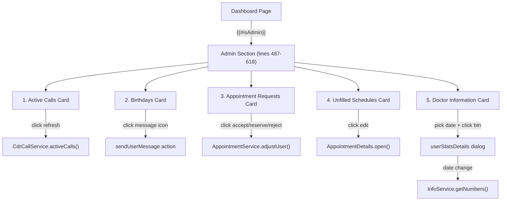
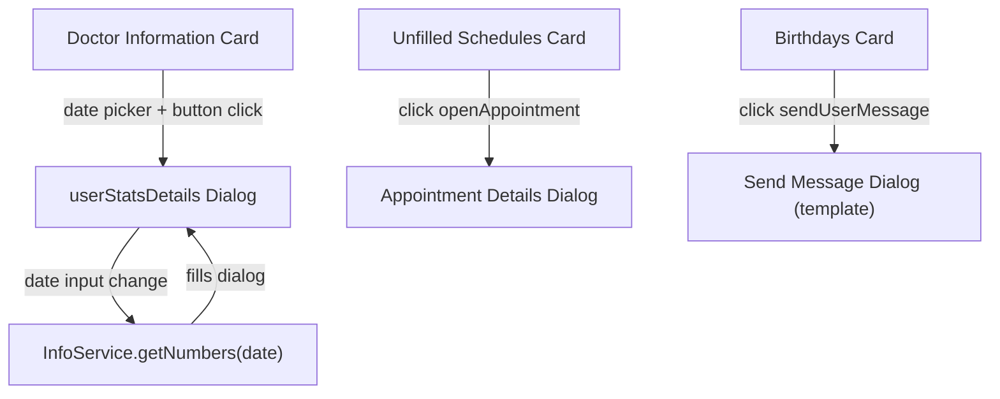
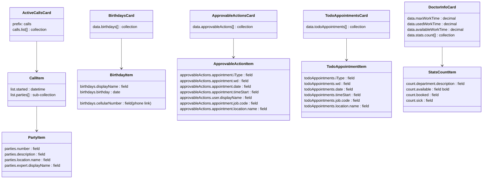

# Dashboard — Admin Sections (`{{#isAdmin}}`)

> **Source**: `videoclinic-prod/web/src/main/webapp/dash/index.htmlm` lines 487–618
> **JS handlers**: `videoclinic-prod/web/src/main/webapp/dash/dash.js`

The entire block at lines 487–618 is wrapped in `{{#isAdmin}}...{{/isAdmin}}`, meaning all five sections below are visible **only** to admin-role users.

---

## Permission Gating Diagram

## Dialog Navigation Diagram

## Datamodel Mapping Diagram

---

## Section 1: Active Calls

**Container**: `
` — Bootstrap card, `col-md-4`
**Visualization**: header `bg-color-staff text-white`, card with list group
**jsForm prefix**: `calls` (initialized separately: `$(this).jsForm({prefix:"calls"})`)

### Card Header

| Text-Reference / Name | Symbol | Type | Notes |
| :--- | :--- | :--- | :--- |
| **HARDCODED**: "Aktive Anrufe" | — | static label | English: "Active Calls" |
| Refresh button | `fa-sync` | button (`#activeCallsRefresh`) | Triggers `CdrCallService.activeCalls()` |

### Collection: Active Calls List (data-field: `calls.list`)

| Field | Type | Datamodel |
| :--- | :--- | :--- |
| Call start time | field-display datetime | `list.started` |

#### Sub-Collection: Call Parties (data-field: `list.parties`)

Nested inside each call item.

| Field | Type | Datamodel |
| :--- | :--- | :--- |
| Party number | field-display | `parties.number` |
| Party description | field-display | `parties.description` |
| Location name | field-display | `parties.location.name` |
| Expert display name | field-display | `parties.expert.displayName` |

### Click Actions

| Action ID | Symbol | Trigger | Service Call | Notes |
| :--- | :--- | :--- | :--- | :--- |
| `activeCallsRefresh` | `fa-sync` | Button click | `CdrCallService.activeCalls([])` | Response fills `{list: data}` into the `#activeCalls` jsForm |

---

## Section 2: Birthdays

**Container**: `
` — Bootstrap card
**Visualization**: header `bg-color-staff text-white`, header links to `/calendar.html`

### Card Header

| Text-Reference / Name | Symbol | Type | Notes |
| :--- | :--- | :--- | :--- |
| `{{i18n.contact.birthday}}` | `fas fa-birthday-cake` | link (`/calendar.html`) | English: "Birthday" |

### Collection: Birthdays (data-field: `data.birthdays`)

| Field | Type | Datamodel |
| :--- | :--- | :--- |
| Display name | field-display (bold) | `birthdays.displayName` |
| Birthday date | field-display date | `birthdays.birthday` |
| Cellular number | field-display (phone link) | `birthdays.cellularNumber` |

#### Row Actions

| Action Type | Action | Symbol | Title / Notes |
| :--- | :--- | :--- | :--- |
| click (class `action sendUserMessage`) | `sendUserMessage` | `fa-comment-dots` | Opens send-message dialog pre-filled with `data-subject` and `data-message` |
| link | Phone call | `fa-phone` | `<a>` with `data-prefix="tel:"` + `birthdays.cellularNumber` |

### SendUserMessage Pre-fill Data

| Attribute | i18n Key | German | English |
| :--- | :--- | :--- | :--- |
| `data-subject` | `{{i18n.birthday.subject}}` | "Alles Gute zum Geburtstag" | "Happy Birthday to you" |
| `data-message` | `{{i18n.birthday.message}}` | "Beste Wünsche und einen fröhlichen Geburtstag von deinem VideoClinic Team!" | "Best wishes and a happy birthday from your VideoClinic Team!" |

---

## Section 3: Appointment Requests

**Container**: `
`, `id="approvableActionList"` on the `<ul>`
**Visualization**: standard card header (no special color class)

### Card Header

| Text-Reference / Name | Symbol | Type | Notes |
| :--- | :--- | :--- | :--- |
| `{{i18n.appointment.requests}}` | `far fa-traffic-light` | static label | English: "Appointment Requests" |

### Collection: Approvable Actions (data-field: `data.approvableActions`, id: `approvableActionList`)

Each list item has class `actionItem`.

| Field | Type | Datamodel | Visual |
| :--- | :--- | :--- | :--- |
| Reserve indicator | icon | — | `<i class="reserve fa fa-chair">` with `title="{{i18n.action.assignment.reserve}}"` |
| Appointment type | field-display (bold) | `approvableActions.appointment.iType` | |
| Weekday | field-display (bold) | `approvableActions.appointment.wd` | |
| Date | field-display (bold) | `approvableActions.appointment.date` | |
| Time start | field-display (bold) | `approvableActions.appointment.timeStart` | |
| User name | field-display (bold) | `approvableActions.user.displayName` | |
| Job code | field-display | `approvableActions.appointment.job.code` | |
| Location name | field-display | `approvableActions.appointment.location.name` | |

#### Row Actions (Button Group)

| Action Type | CSS Class | Symbol | Label | Service Call | Confirmation |
| :--- | :--- | :--- | :--- | :--- | :--- |
| button click | `.accept` | `fa-check` | **HARDCODED**: "Annehmen" (EN: "Accept") | `AppointmentService.adjustUser(pojo.id, "ACCEPTED")` | **HARDCODED**: "Benutzer annehmen?" (EN: "Accept user?") |
| button click | `.reserve` | `fa-chair` | **HARDCODED**: "Auf Warteliste" (EN: "Add to Waitlist") | `AppointmentService.adjustUser(pojo.id, "RESERVED")` | **HARDCODED**: "Benutzer Reservieren?" (EN: "Reserve user?") |
| button click | `.reject` | `fa-thumbs-down` | **HARDCODED**: "Ablehnen" (EN: "Reject") | `AppointmentService.adjustUser(pojo.id, "REJECTED")` | **HARDCODED**: "Benutzer ablehnen?" (EN: "Reject user?") |

All three actions remove the row (`line.remove()`) on success.

---

## Section 4: Unfilled Schedules

**Container**: `
`, `id="todoAppointmentsList"` on the `<ul>`
**Visualization**: standard card header (no special color class)

### Card Header

| Text-Reference / Name | Symbol | Type | Notes |
| :--- | :--- | :--- | :--- |
| `{{{i18n.dash.scheduleNotFull}}}` | `far fa-traffic-light` | static label (triple-mustache: contains HTML) | English: "Unfilled schedules" |

### Collection: Todo Appointments (data-field: `data.todoAppointments`, id: `todoAppointmentsList`)

Each list item has class `actionItem`.

| Field | Type | Datamodel | Visual |
| :--- | :--- | :--- | :--- |
| Appointment type | field-display (bold) | `todoAppointments.iType` | |
| Weekday | field-display (bold) | `todoAppointments.wd` | |
| Date | field-display (bold) | `todoAppointments.date` | |
| Time start | field-display (bold) | `todoAppointments.timeStart` | |
| Job code | field-display | `todoAppointments.job.code` | |
| Location name | field-display | `todoAppointments.location.name` | |

#### Row Actions

| Action Type | CSS Class | Symbol | Service Call | Notes |
| :--- | :--- | :--- | :--- | :--- |
| button click | `.openAppointment` | `fa-pencil` | `AppointmentDetails.open(pojo.id)` | Opens appointment details dialog |

---

## Section 5: Doctor Information

**Container**: `
` — Bootstrap card
**Visualization**: header `bg-color-staff`, icon `far fa-user-tie`

### Card Header

| Text-Reference / Name | Symbol | Type | Notes |
| :--- | :--- | :--- | :--- |
| `{{{i18n.dash.doctorInfo}}}` | `far fa-user-tie` | static label (triple-mustache: contains HTML) | English: "Doctor-Information" |

### Form Elements (Work Time Stats)

| Text-Reference / Name | Symbol | Datamodel | Type of UI element | Notes |
| :--- | :--- | :--- | :--- | :--- |
| `{{i18n.doctor.data.workingHours}}` | `fa-briefcase` | `data.maxWorkTime` | field-display decimal | Suffixed with "h". EN: "Working time" |
| `{{i18n.doctor.data.currentMonth}}` | `fa-stopwatch` | `data.usedWorkTime` | field-display decimal | Suffixed with "h". EN: "Current Month" |
| `{{i18n.doctor.data.available}}` | `fa-business-time` | `data.availableWorkTime` | field-display decimal | Suffixed with "h". EN: "Availability" |

### Stats Table Header

| Text-Reference / Name | Symbol | Type | Notes |
| :--- | :--- | :--- | :--- |
| `{{i18n.doctor.data.numbers}}` | — | `<h5>` section title | English: "Current numbers" |
| Column: Available | `far fa-calendar` | table header icon | `title` **HARDCODED**: "Verfügbar" (EN: "Available") |
| Column: Booked | `far fa-briefcase` | table header icon | `title` **HARDCODED**: "Gebucht" (EN: "Booked") |
| Column: Sick | `far fa-procedures` | table header icon | `title` **HARDCODED**: "Krank" (EN: "Sick") |

### Collection: Stats Count (data-field: `data.stats.count`)

| Field | Type | Datamodel | Visual |
| :--- | :--- | :--- | :--- |
| Department description | field-display | `count.department.description` | Table row label (with `margin-right:10px`) |
| Available count | field-display | `count.available` | Bold, right-aligned |
| Booked count | field-display | `count.booked` | Normal weight |
| Sick count | field-display | `count.sick` | Normal weight |

### Date Picker + Employee Dialog Trigger

| Element | ID | Type | Notes |
| :--- | :--- | :--- | :--- |
| Date input | `employeeDateDialogDate` | date input (`class="date form-control"`) | `name="ts"` |
| Open dialog button | `employeeDateDialogBtn` | button (`btn-sm btn-secondary`) | Icon: `far fa-calendar` |

**Behavior** (from `dash.js` lines 696–717):
1. User selects a date in `#employeeDateDialogDate`
2. On change, opens the `#userStatsDetails` dialog with `{ts: ""}`
3. Sets `#employeeDateInput` value to the selected date, triggering its change event
4. `#employeeDateInput` change calls `InfoService.getNumbers(dateValue)`
5. Response fills the `#userStatsDetails` dialog via jsForm

---

## Section 5b: Employee Stats Dialog (`#userStatsDetails`)

**Container**: `
` — hidden dialog, initialized via `Dialog.init()`
**Visualization**: icon `far fa-user-tie`, color `bg-color-staff`, title `{{i18n.employee.dialogtitle}}` (EN: "Experts")

### Form Elements

| Text-Reference / Name | Datamodel | Type of UI element | Notes |
| :--- | :--- | :--- | :--- |
| Date input | `data.ts` | date input (`class="date form-control"`, `id="employeeDateInput"`) | Triggers `InfoService.getNumbers()` on change |

### Dialog Stats Table Header

| Column | Symbol | Title | Notes |
| :--- | :--- | :--- | :--- |
| (empty — department label) | — | — | — |
| Available | `far fa-calendar` | **HARDCODED**: "Verfügbar" (EN: "Available") | |
| Booked | `far fa-briefcase` | **HARDCODED**: "Gebucht" (EN: "Booked") | |
| Vacation | `far fa-island-tropical` | **HARDCODED**: "Urlaub" (EN: "Vacation") | Note: differs from card which uses `fa-procedures` / "Krank" (Sick) |

### Collection: Stats Count in Dialog (data-field: `data.count`)

| Field | Type | Datamodel |
| :--- | :--- | :--- |
| Department description | field-display | `count.department.description` |
| Available count | field-display (bold) | `count.available` |
| Booked count | field-display | `count.booked` |

> **Note**: The dialog collection at `data.count` only shows 2 numeric columns (available, booked) while the card collection at `data.stats.count` shows 3 (available, booked, sick). The dialog replaces the "Sick" column header with "Vacation" (`fa-island-tropical` / "Urlaub") but has no corresponding data field for it in the template row.

---

## Permissions Summary

| Permission / Condition | Scope | Description |
| :--- | :--- | :--- |
| `{{#isAdmin}}` | Entire admin block (lines 487–618) + dialog `#userStatsDetails` | All 5 sections visible only to admin-role users |

Note: `isAdmin` is not defined as an explicit `"method":"authority"` field in the page header — it is likely a server-side role check injected into the template context automatically (as opposed to the explicit `canAdHoc`, `selfService`, `canVerify` permission checks).

---

## Cross-References

### Service Calls

| Service | Method | Parameters | Dialog / Context |
|---------|--------|------------|------------------|
| `CdrCallService` | `activeCalls` | `[]` | Refresh button in Active Calls card; fills `#activeCalls` jsForm |
| `AppointmentService` | `adjustUser` | `[pojo.id, "ACCEPTED" / "RESERVED" / "REJECTED"]` | Accept/Reserve/Reject buttons in Appointment Requests card |
| `AppointmentDetails` | `open` | `pojo.id` | Edit button in Unfilled Schedules card |
| `InfoService` | `getNumbers` | `dateString` | Date input change in Employee Stats dialog |
| `sendUserMessage` | — | Pre-filled `data-subject` + `data-message` | Message icon on Birthday card row |

> **Service context:** Admin dashboard fires service calls for call monitoring (`CdrCallService`), appointment management (`AppointmentService`, `AppointmentDetails`), and employee statistics (`InfoService`). Birthday messaging uses the shared `sendUserMessage` action documented in [Notification Send Message](../../notification/notification.md#cross-references).

---

## Hardcoded German Strings (require i18n keys)

| Location | German (HARDCODED) | English Translation | Suggested i18n Key |
| :--- | :--- | :--- | :--- |
| Active Calls card header | "Aktive Anrufe" | "Active Calls" | `dash.activeCalls` |
| Accept button label | "Annehmen" | "Accept" | `action.accept` |
| Reserve button label | "Auf Warteliste" | "Add to Waitlist" | `action.reserve` |
| Reject button label | "Ablehnen" | "Reject" | `action.reject` |
| Accept confirm dialog | "Benutzer annehmen?" | "Accept user?" | `confirm.acceptUser` |
| Reserve confirm dialog | "Benutzer Reservieren?" | "Reserve user?" | `confirm.reserveUser` |
| Reject confirm dialog | "Benutzer ablehnen?" | "Reject user?" | `confirm.rejectUser` |
| Stats table: Available column title | "Verfügbar" | "Available" | `doctor.data.column.available` |
| Stats table: Booked column title | "Gebucht" | "Booked" | `doctor.data.column.booked` |
| Stats table: Sick column title | "Krank" | "Sick" | `doctor.data.column.sick` |
| Dialog stats: Vacation column title | "Urlaub" | "Vacation" | `doctor.data.column.vacation` |

---

## Naming and Translation (i18n references used)

| Text-Reference | German | English | Notes |
| :--- | :--- | :--- | :--- |
| `{{i18n.contact.birthday}}` | Geburtstag | Birthday | Card header |
| `{{i18n.birthday.subject}}` | Alles Gute zum Geburtstag | Happy Birthday to you | Pre-filled message subject |
| `{{i18n.birthday.message}}` | Beste Wünsche und einen fröhlichen Geburtstag von deinem VideoClinic Team! | Best wishes and a happy birthday from your VideoClinic Team! | Pre-filled message body |
| `{{i18n.appointment.requests}}` | Terminanfragen | Appointment Requests | Card header |
| `{{i18n.action.assignment.reserve}}` | Reservieren | Reserve | Reserve icon tooltip |
| `{{{i18n.dash.scheduleNotFull}}}` | Nicht volle Zeitpläne | Unfilled schedules | Card header; **contains HTML** (triple-mustache) |
| `{{{i18n.dash.doctorInfo}}}` | Arzt-Information | Doctor-Information | Card header; **contains HTML** (triple-mustache) |
| `{{i18n.doctor.data.workingHours}}` | Arbeitszeit | Working time | Label |
| `{{i18n.doctor.data.currentMonth}}` | Aktueller Monat | Current Month | Label |
| `{{i18n.doctor.data.available}}` | Verfügbarkeit | Availability | Label |
| `{{i18n.doctor.data.numbers}}` | Aktuelle Zahlen | Current numbers | Section title |
| `{{i18n.employee.dialogtitle}}` | Experten | Experts | Dialog title |

---

## Service Calls Summary

| Service | Method | Trigger | Parameters | Response Handling |
| :--- | :--- | :--- | :--- | :--- |
| `CdrCallService` | `activeCalls` | Refresh button click | `[]` | Fills `#activeCalls` jsForm with `{list: data}` |
| `AppointmentService` | `adjustUser` | Accept/Reserve/Reject buttons | `[pojo.id, "ACCEPTED"/"RESERVED"/"REJECTED"]` | Removes row from list |
| `AppointmentDetails` | `open` | Edit button on unfilled schedule | `pojo.id` | Opens appointment details dialog |
| `InfoService` | `getNumbers` | Date input change in dialog | `[dateString]` | Fills `#userStatsDetails` jsForm with response |
| (sendUserMessage) | (action handler) | Message icon on birthday row | Pre-filled subject + message from `data-*` attrs | Opens send-message dialog |
