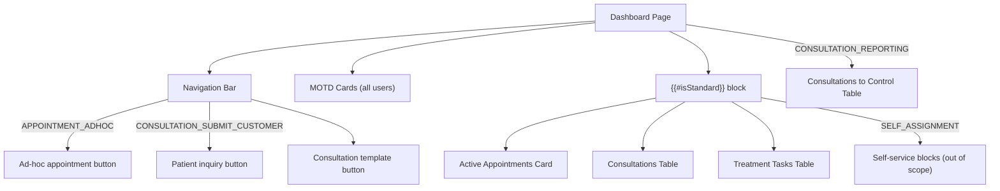
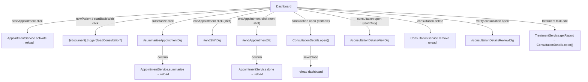
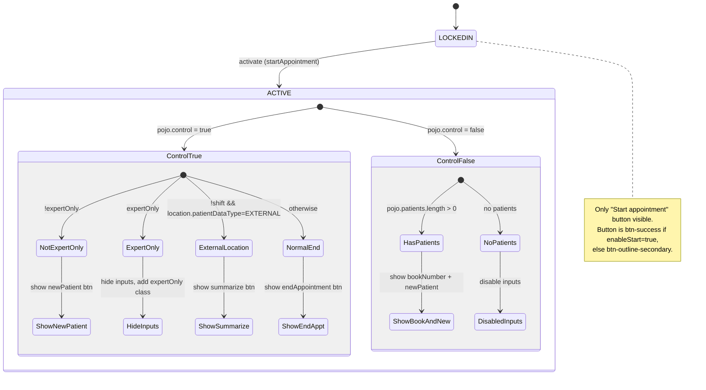

# Dashboard — Main Page (Standard User + Verify Sections)

---

## Cross-References

### Event Flows

| Type | Direction | Event | Linked Document | Condition |
|------|-----------|-------|-----------------|----------|
| event | **Outgoing** | `loadConsultation` | [Consultation Wizard](../../treatment/dashboard/consultation-wizard.md#2-dialog-navigation-diagram) | `newPatient` / `startBasisWeb` click on active appointment |
| event | **Outgoing** | `ConsultationDetails.open()` | [Consultation Details JS](../../treatment/consultation/consultation-details-js.md#2-dialog-lifecycle) | Consultation row click (editable) or treatment task edit |
| event | **Outgoing** | `consultationWithTemplateBtn` click | [Consultation Template](../../treatment/dashboard/consultation-template.md#click-actions) | NavBar "Consultation template" button (always visible) |

### Service Calls

| Service | Method | Parameters | Context |
|---------|--------|------------|---------|
| `AppointmentService` | `activate` | `[appointment.id]` | Start appointment (triggers `reload`) |
| `ConsultationService` | `remove` | `[pojo.id]` | Delete consultation (triggers `reload`) |
| `ConsultationService` | `getReporting` | `[pojo.id]` | Open review dialog (`#consultationDetailsReviewDlg`) |
| `TreatmentService` | `getReport` | `[pojo.treatment.id, pojo.consultationId]` | Edit treatment task (triggers `ConsultationDetails.open()`) |
| `AppointmentService` | `summarize` | `[id, timeStart, timeEnd, qm]` | End shift with external location (triggers `reload`) |
| `AppointmentService` | `done` | `[id, timeStart, timeEnd, qm]` | End appointment non-shift (triggers `reload`) |

> **Downstream chains:**
> - `loadConsultation` → [Consultation Wizard](../../treatment/dashboard/consultation-wizard.md) → (conditionally) `loadBasisweb` → [BasisWeb Wizard](../../interfaces/dashboard/basisweb-wizard.md)
> - `ConsultationDetails.open()` → [Consultation Details JS](../../treatment/consultation/consultation-details-js.md)
> - `consultationWithTemplateBtn` → [Consultation Template](../../treatment/dashboard/consultation-template.md) → `ConsultationDetails.open()` → [Consultation Details JS](../../treatment/consultation/consultation-details-js.md)

---

## Behavior Diagrams

### Permission Gating Diagram

### Dialog Navigation Diagram

### Appointment State-Based Button Visibility

---

## Block: MOTD Cards

**Container**: `
`
**Layout**: Each card occupies `col-md-4` by default (overridable via `pojo.width`).

### Visualization

- **Card style**: Bootstrap `.card` with priority-based background color
- **Image**: loaded from `/get/MOTDService/attachment/{motd.id}/motd.jpg`
- **Message**: Rendered as **Markdown** (via `marked` library) after HTML-escaping
- **Link**: If `pojo.link` is set, entire card becomes clickable (navigates to `pojo.link`)

### Priority-Based Styling

| Priority | CSS Classes | Visual |
| :--- | :--- | :--- |
| `LOW` | `bg-secondary text-white` | Gray background, white text |
| `NORMAL` | (none added) | Default card |
| `HIGH` | `bg-warning` | Yellow/amber background |
| `URGENT` | `text-white bg-danger` | Red background, white text |

### Image Position (`pojo.pos`)

| Position | Behavior |
| :--- | :--- |
| `null` / absent | Image removed entirely; text takes full width (`col-md-12`) |
| `LEFT` | Image in left column (`col-md-4`), text in right (`col-md-8`) — default layout |
| `TOP` | Image above card body (`card-img-top`) |
| `BOTTOM` | Image below card body |
| `BACK` | Image as background, text as `.card-img-overlay` |

### Collection: MOTD (data-field: `data.motd`)

| Field | Type | Datamodel |
| :--- | :--- | :--- |
| Subject | field-display | `motd.subject` |
| Message | field-display (markdown) | `motd.message` |
| Image | image (dynamic src) | `motd.id` (used to build URL) |

#### Row-level data properties (from JS `pojo`)

| Property | Purpose |
| :--- | :--- |
| `pojo.priority` | Card color styling (`LOW`, `NORMAL`, `HIGH`, `URGENT`) |
| `pojo.width` | Override card width (Bootstrap grid number, e.g. `6`, `12`) |
| `pojo.pos` | Image position (`LEFT`, `TOP`, `BOTTOM`, `BACK`, or absent) |
| `pojo.link` | Optional URL — makes card clickable |

### Special Components

| Component type | Context | Data bindings | Notes |
| :--- | :--- | :--- | :--- |
| markdown | MOTD message body | `motd.message` | `marked(escapeHtml(message))` — content is escaped then parsed as Markdown |

---

## Block: Active Appointments Card

**Container**: `
`
**Permission**: `{{#isStandard}}` — visible only to standard (non-admin) users
**Header**: Icon `fa-business-time`, label `{{{i18n.table.active}}}` ("Active"), bg-color: `bg-color-shift text-white`

### Collection: Active Appointments (data-field: `data.activeAppointments`)

| Field | Type | Datamodel |
| :--- | :--- | :--- |
| Type | field-display | `activeAppointments.appointment.iType` |
| Weekday | field-display | `activeAppointments.appointment.wd` |
| Date | field-display | `activeAppointments.appointment.date` |
| Time start | field-display | `activeAppointments.appointment.timeStart` |
| Time end | field-display | `activeAppointments.appointment.timeEnd` |
| Job title | field-display | `activeAppointments.appointment.job.expertTitle` |
| Location name | field-display | `activeAppointments.appointment.location.name` |

#### Row-level conditional elements

| Element | CSS class | Initial state | Show condition |
| :--- | :--- | :--- | :--- |
| "Report required" alert | `.requireReport` | `display:none` | `pojo.requireReport === true` |
| Location info (markdown) | `.locationInfo` | empty | Populated when location has `externalDescription` |

#### Row Actions

| Action | CSS class | Button style | Show condition | Service call | Translation key |
| :--- | :--- | :--- | :--- | :--- | :--- |
| Start appointment | `.startAppointment` | `btn-success` (or `btn-outline-secondary` if `!enableStart`) | `appointment.state === "LOCKEDIN"` | `AppointmentService.activate(appointment.id)` | `consultation.startConsultation` |
| New patient | `.newPatient` | `btn-primary` | `pojo.control && !expertOnly` OR `!control && patients.length > 0` | triggers `loadConsultation` event | `treatment.startTreatment` |
| Start basis web | `.startBasisWeb` | `btn-primary` | Initially hidden; shown on location change | triggers `loadConsultation` event | `treatment.startTreatment` |
| Summarize | `.summarize` | `btn-success` | `pojo.control && !shift && location.patientDataType === "EXTERNAL"` | Opens `#summarizeAppointmentDlg` | `consultation.endConsultation` |
| End appointment | `.endAppointment` | `btn-success` | `pojo.control && (shift \|\| !EXTERNAL)` OR `!pojo.control` | Opens `#endShiftDlg` (shift) or `#endAppointmentDlg` (non-shift) | `consultation.endConsultation` |

#### Row-level CSS markers

| Condition | CSS class added |
| :--- | :--- |
| `appointment.expertAppointmentId` exists | `.expertAppointment` on row |
| `appointment.expertOnly === true` | `.expertOnly` on row; locationSelect + bookNumber hidden |

### Permissions

| Permission / Condition | Scope | Description |
| :--- | :--- | :--- |
| `{{#isStandard}}` | Entire Active Appointments card | Only visible to standard users |

---

## Block: Consultations Table

**Container**: `<tbody class="collection" data-field="data.activeConsultations" id="activeConsulationList">`
**Permission**: `{{#isStandard}}` — visible only to standard users
**Header**: Icon `fa-books-medical`, label `{{{i18n.dash.consultations}}}` ("Consultations"), bg-color: `bg-color-shift text-white`

### Table Column Headers

| # | Icon | Title attribute (i18n key) | English | German |
| :--- | :--- | :--- | :--- | :--- |
| 1 | (open button) | — | — | — |
| 2 | — | `label.start` | start | Start |
| 3 | `fa-user-injured` | `consultation.booknumber` | Book number | Buchnummer |
| 4 | `fa-briefcase-medical` | `action.jobTitle` | Job | Dienstleistung |
| 5 | — | — (iType column) | — | — |
| 6 | — | — (iState column) | — | — |
| 7 | `fa-users-medical` | `consultation.base` | Base data | Basisdaten |
| 8 | `fa-notes-medical` | `consultation.medical` | Medical data | Behandlungsdaten |
| 9 | `fa-exclamation-triangle` | `consultation.warning` | Warning | Warnhinweise |
| 10 | `fa-calendar-check` | `consultation.qm` | Questionnaire | Fragebogen |
| 11 | `fa-external-link` | `consultation.submit` | Submitted | Ubermittelt |
| 12 | (delete action) | — | — | — |

### Collection: Active Consultations (data-field: `data.activeConsultations`)

| Field | Type | Datamodel |
| :--- | :--- | :--- |
| Start | field-display | `activeConsultations.start` |
| Book number | field-display (bold) | `activeConsultations.bookNumber` |
| Job | field-display | `activeConsultations.job` |
| Location | field-display | `activeConsultations.location.name` |
| Type | field-display | `activeConsultations.iType` |
| State | field-display (bold) | `activeConsultations.iState` |
| Base completed | status | `baseCompleted` |
| Data complete | status | `dataComplete` |
| Warning complete | status | `warningComplete` |
| QM complete | status | `qmComplete` |
| Transmit complete | status | `transmitComplete` |

### Status Visualization

Each status column (`class="status"`) is rendered via JavaScript (`postAddCollection`):

| Condition | Icon | Color | Meaning |
| :--- | :--- | :--- | :--- |
| `field === "qmComplete" && !pojo.shift` | `fa-minus` | `text-secondary` (gray) | Not applicable (non-shift consultations have no QM) |
| value `=== true` OR value is empty array | `fa-check` | `text-success` (green) | Section completed |
| otherwise | `fa-question` | `text-danger` (red) | Section incomplete / pending |

### Row Actions

| Action | CSS class | Condition | Service call | Opens |
| :--- | :--- | :--- | :--- | :--- |
| Open (edit) | `.open` (shows `.edit` icon `fa-file-edit`) | `!pojo.readOnly` | `ConsultationDetails.open(pojo.id, reloadCallback)` | Consultation details dialog (edit mode) |
| Open (view) | `.open` (shows `.read` icon `fa-file`) | `pojo.readOnly` | `ConsultationService.get(pojo.id)` | `#consultationDetailsViewDlg` (read-only) |
| Delete | `.doDelete` (`fa-trash`) | `!pojo.readOnly` | `ConsultationService.remove([pojo.id])` | Confirm dialog then reload |

**Note on read-only logic**: When `pojo.readOnly === true`:
- The edit icon (`.edit`) is hidden; only the read icon (`.read`) is shown
- The delete action (`.doDelete`) is hidden
- The open button opens view-only dialog instead of edit dialog

### Permissions

| Permission / Condition | Scope | Description |
| :--- | :--- | :--- |
| `{{#isStandard}}` | Entire Consultations card | Only visible to standard users |
| `pojo.readOnly` | Row-level | Determines edit vs view mode, and delete visibility |

---

## Block: Consultations to Control Table

**Container**: `<tbody class="collection" data-field="data.reportingConsultations" id="verifyConsultationList">`
**Permission**: `{{#canVerify}}` — requires `CONSULTATION_REPORTING` authority
**Header**: Icon `fa-books-medical`, label `{{{i18n.dash.consultationToControl}}}` ("Consultations to control"), bg-color: `bg-color-shift text-white`

### Table Column Headers

| # | Icon | Title attribute (i18n key) | English | German |
| :--- | :--- | :--- | :--- | :--- |
| 1 | (open button) | — | — | — |
| 2 | — | — (date column) | — | — |
| 3 | — | `label.start` | start | Start |
| 4 | `fa-user-injured` | `consultation.booknumber` | Book number | Buchnummer |
| 5 | `fa-briefcase-medical` | `action.jobTitle` | Job | Dienstleistung |
| 6 | `fa-user-md` | `expert` | Expert | Experten |
| 7 | — | — (iType column) | — | — |

### Collection: Reporting Consultations (data-field: `data.reportingConsultations`)

| Field | Type | Datamodel |
| :--- | :--- | :--- |
| Date | field-display date | `reportingConsultations.date` |
| Start | field-display | `reportingConsultations.start` |
| Book number | field-display (bold) | `reportingConsultations.bookNumber` |
| Job code | field-display | `reportingConsultations.job.code` |
| Location | field-display | `reportingConsultations.location.name` |
| Doctor name | field-display (bold) | `reportingConsultations.doctor.displayName` |
| Type | field-display | `reportingConsultations.iType` |

### Row Actions

| Action | CSS class | Service call | Opens |
| :--- | :--- | :--- | :--- |
| Open (review) | `.open` (icon `fa-file-edit`) | `ConsultationService.getReporting(pojo.id)` | `#consultationDetailsReviewDlg` |

### Permissions

| Permission / Condition | Scope | Description |
| :--- | :--- | :--- |
| `CONSULTATION_REPORTING` | Entire "Consultations to Control" card | Only users with reporting authority can see and access this section |

---

## Block: Treatment Tasks Table

**Container**: `<tbody class="collection" data-field="data.treatmentTasks" id="treatmentTasksList">`
**Permission**: `{{#isStandard}}` — visible only to standard users
**Header**: Icon `fa-books-medical`, label "Therapiedokumentationen" (**HARDCODED** German — "Treatment documentation"), bg-color: `bg-color-shift text-white`
**Visibility**: Card is hidden if `data.treatmentTasks` is empty or absent (`$("#treatmentTasksCard").hide()`)

### Table Column Headers

| # | Icon | Title attribute (i18n key) | English | German |
| :--- | :--- | :--- | :--- | :--- |
| 1 | (edit button) | — | — | — |
| 2 | — | `label.start` | start | Start |
| 3 | `fa-user-injured` | `consultation.booknumber` | Book number | Buchnummer |
| 4 | `fa-briefcase-medical` | `action.jobTitle` | Job | Dienstleistung |

### Collection: Treatment Tasks (data-field: `data.treatmentTasks`)

| Field | Type | Datamodel |
| :--- | :--- | :--- |
| Date | field-display date | `treatmentTasks.date` |
| Book number | field-display (bold) | `treatmentTasks.treatment.bookNumber` |
| Job code | field-display | `treatmentTasks.treatment.job.code` |
| Location | field-display | `treatmentTasks.treatment.location.name` |

### Row Actions

| Action | CSS class | Service call | Opens |
| :--- | :--- | :--- | :--- |
| Edit | `.edit` (icon `fa-file-edit`) | `TreatmentService.getReport(pojo.treatment.id, pojo.consultationId)` | `ConsultationDetails.open(data, reloadCallback)` |

### Permissions

| Permission / Condition | Scope | Description |
| :--- | :--- | :--- |
| `{{#isStandard}}` | Entire Treatment Tasks card | Only visible to standard users |
| Empty data | Card-level | Hidden when `data.treatmentTasks` is empty |

---

## Data Loading and Reload Mechanism

The dashboard uses a centralized reload pattern:

1. **Initial load**: After 800ms delay, triggers `$(document).trigger("reload")`
2. **Reload handler**: Calls `InfoService.getDashInfo(-1)`, processes MOTD markdown, fills all collections via `jsForm("fill", data)`
3. **Post-reload**: Hides empty cards (`treatmentTasksCard`, `treatmentCard`)
4. **Login notifications**: After first load, checks `data.loginNotifications` and shows modal if present
5. **Available actions**: Loaded separately via `InfoService.getAvailableActions(-1)` after initial data load

All action callbacks (start appointment, delete consultation, end appointment, etc.) trigger `$(document).trigger("reload")` to refresh the dashboard state.

---

## Naming and Translation

| Text-Reference | German | English | Notes |
| :--- | :--- | :--- | :--- |
| `i18n.table.active` | Aktiv | Active | Card header; triple-mustache (contains HTML potential) |
| `i18n.dash.consultations` | Behandlungen | Consultations | Card header; triple-mustache |
| `i18n.dash.consultationToControl` | Behandlungen zur Uberprufung | Consultations to control | Card header; triple-mustache |
| `i18n.consultation.booknumber` | Buchnummer | Book number | Column icon tooltip |
| `i18n.consultation.startConsultation` | Einsatz Starten | Start consultation | Button label |
| `i18n.consultation.endConsultation` | Einsatz Beenden | End consultation | Button label |
| `i18n.treatment.startTreatment` | Behandlung Starten | Start consultation | Button label (used for newPatient + startBasisWeb) |
| `i18n.consultation.base` | Basisdaten | Base data | Status column tooltip |
| `i18n.consultation.medical` | Behandlungsdaten | Medical data | Status column tooltip |
| `i18n.consultation.warning` | Warnhinweise | Warning | Status column tooltip |
| `i18n.consultation.qm` | Fragebogen | Questionnaire | Status column tooltip |
| `i18n.consultation.submit` | Ubermittelt | Submitted | Status column tooltip |
| `i18n.action.jobTitle` | Dienstleistung | Job | Column icon tooltip |
| `i18n.action.delete` | Loschen | Delete | Delete action tooltip |
| `i18n.appointment.reportRequired` | Dieser Termin erfordert einen Bericht | This appointment requires a report | Alert text |
| `i18n.label.start` | Start | start | Column header |
| `i18n.expert` | Experten | Expert | Column icon tooltip (verify table) |
| `i18n.dialog_delete_confirm` | (from JS i18n) | (from JS i18n) | Confirm dialog text for consultation delete |
| "Therapiedokumentationen" | Therapiedokumentationen | Treatment documentation | **HARDCODED** — card header for treatment tasks |

---

## NavBar Action Buttons

These buttons appear in the navigation bar and are gated by permissions:

| Button ID | Icon | Label (i18n) | English | Permission |
| :--- | :--- | :--- | :--- | :--- |
| `adHocAppointmentCreateMenuBtn` | `fa-calendar-plus` | `dash.adHocAppointment` | Ad-hoc appointment | `APPOINTMENT_ADHOC` |
| `retrieveConsultationMenuBtn` | `fa-user-hard-hat` | `dash.patientInquiry` | Patient query | `CONSULTATION_SUBMIT_CUSTOMER` |
| `consultationWithTemplateBtn` | `fa-books-medical` | `dash.consultationTemplate` | Consultation template | (none — always visible) |
