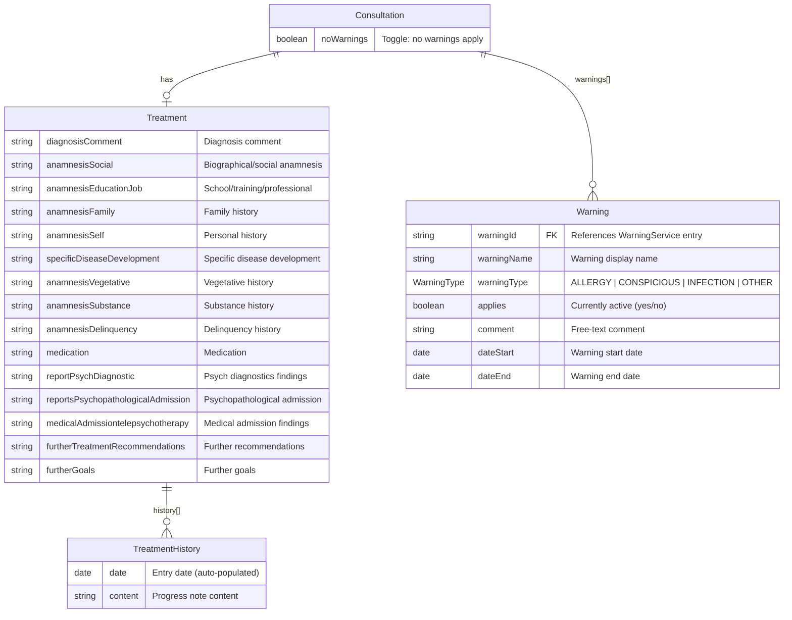
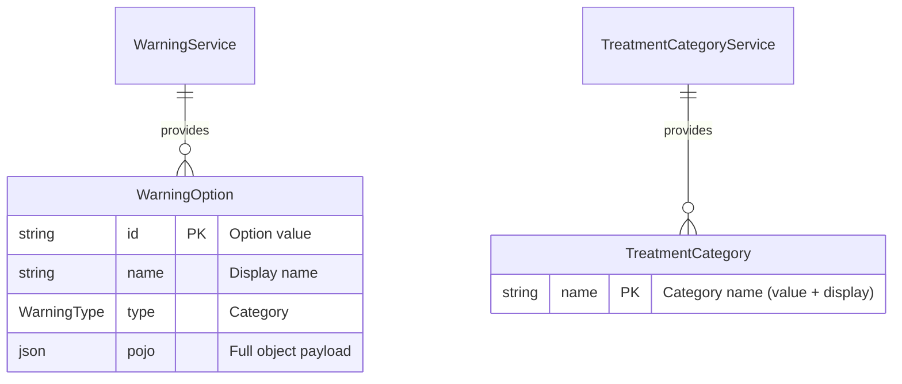

## Cross-References

### Source Files

| File | Purpose |
|------|---------|
| `web/src/main/webapp/consultation/detailDataTreatment.html` | Treatment / therapy data form |
| `web/src/main/webapp/consultation/detailDataWarning.html` | Warning / alert data form |
| `web/src/main/webapp/consultation/index.htmlm` | HTMLM header (option sources) |
| `web/src/main/webapp/consultation/details.html` | Parent shell (tab inclusion at lines 441-451) |

### Source Includes

| Type | Direction | Detail | Linked Document | Condition / Context |
|------|-----------|--------|-----------------|---------------------|
| include | **Included by** | `{{> detailDataTreatment}}` | [Consultation Details Header](consultation-details-header.md#tabTreatment) | Treatment form in consultation details |
| include | **Included by** | `{{> detailDataWarning}}` | [Consultation Details Header](consultation-details-header.md#tabWarning) | Warning form in consultation details |

> **Include context:** This file's sources `detailDataTreatment.html` (97 lines) and `detailDataWarning.html` (76 lines) are embedded as `{{> detailDataTreatment}}` and `{{> detailDataWarning}}` partials in [Consultation Details Header](consultation-details-header.md) under tabs `#tabTreatment` and `#tabWarning` respectively.

---

# 06 — Consultation Details: Treatment & Warning Sub-forms

---

## 1. Block: Treatment Form (`detailDataTreatment.html`)

The Treatment form is rendered inside `#tabTreatment` as a Mustache partial (`{{> detailDataTreatment}}`). It is a continuous vertical form composed entirely of `<textarea>` fields organised into labelled sections. There are **no required fields** (none carry `class="mandatory"`). One collection/repeater exists for therapy history entries.

### Layout

| Section (heading) | i18n key | Columns | Fields |
|-|-|-|-|
| Diagnoses at start of therapy | `consultation.treatment.diagnosis` | 1 (full-width) | `diagnosis.comment` |
| Anamnese | `consultation.treatment.anamnese` | 2 (6+6) | Left: `anamnesisSocial`, `anamnesisEducationJob`, `anamnesisFamily`, `anamnesisSelf`. Right: `specificDiseaseDevelopment`, `anamnesisVegetative`, `anamnesisSubstance`, `anamnesisDelinquency` |
| Medication | `Treatment.medication` | 1 (full-width) | `medication` |
| Findings & psych diagnostics | `Treatment.reportPsychDiagnostic` | 2 (6+6) | `reportPsychDiagnostic`, `reportsPsychopathologicalAdmission` |
| Medical admission findings | `consultation.treatment.medicalAdmissiontelepsychotherapy` | 1 (col-md-6) | `medicalAdmissiontelepsychotherapy` |
| History (repeater) | `consultation.treatment.history` | 1 (full-width collection) | Collection: `history.date`, `history.content` |
| ~~Medication taken~~ | `consultation.treatment.medicationTaken` | — | **Commented out in source** |
| Further treatment recommendations | `consultation.treatment.furtherTreatmentRecommendations` | 2 (6+6) | `furtherTreatmentRecommendations`, `furtherGoals` |

---

## 2. Block: Warning Form (`detailDataWarning.html`)

The Warning form is rendered inside `#tabWarning` as `{{> detailDataWarning}}`. It has two distinct areas:

1. **Insert row** — Four category-specific `<select>` dropdowns (Allergy, Conspicuous, Infection, Other), each with an add (+) button. Options are populated server-side from `WarningService`.
2. **Warning collection** — A repeater (`data-field="data.warnings"`) displaying each warning as a card row with: name, type (readonly), applies (yes/no), comment, dateStart, dateEnd, and a delete button.
3. **No-warnings checkbox** — `data.noWarnings` toggles the entire warning UI via `class="conditional" data-condition="! #noWarnings"`.

### Conditional visibility

The entire insert-row + collection block is wrapped in:
```html
<div class="conditional" data-condition="! #noWarnings">
```
When the `noWarnings` checkbox is checked, the warning entry UI is hidden.

---

## 3. Form Elements Table: Treatment

| # | Element | `name` attribute | Data path | Type | Required | Notes |
|---|---------|------------------|-----------|------|----------|-------|
| 1 | textarea | `data.treatment.diagnosis.comment` | `treatment.diagnosis.comment` | text (multi-line) | No | Diagnosis comment |
| 2 | textarea | `data.treatment.anamnesisSocial` | `treatment.anamnesisSocial` | text (multi-line) | No | Biographical/social anamnesis |
| 3 | textarea | `data.treatment.anamnesisEducationJob` | `treatment.anamnesisEducationJob` | text (multi-line) | No | School/training/professional history |
| 4 | textarea | `data.treatment.anamnesisFamily` | `treatment.anamnesisFamily` | text (multi-line) | No | Family history |
| 5 | textarea | `data.treatment.anamnesisSelf` | `treatment.anamnesisSelf` | text (multi-line) | No | Personal history |
| 6 | textarea | `data.treatment.specificDiseaseDevelopment` | `treatment.specificDiseaseDevelopment` | text (multi-line) | No | Specific disease development |
| 7 | textarea | `data.treatment.anamnesisVegetative` | `treatment.anamnesisVegetative` | text (multi-line) | No | Vegetative history |
| 8 | textarea | `data.treatment.anamnesisSubstance` | `treatment.anamnesisSubstance` | text (multi-line) | No | Substance history |
| 9 | textarea | `data.treatment.anamnesisDelinquency` | `treatment.anamnesisDelinquency` | text (multi-line) | No | Delinquency history |
| 10 | textarea | `data.treatment.medication` | `treatment.medication` | text (multi-line) | No | Medication |
| 11 | textarea | `data.treatment.reportPsychDiagnostic` | `treatment.reportPsychDiagnostic` | text (multi-line) | No | Psychological diagnostics |
| 12 | textarea | `data.treatment.reportsPsychopathologicalAdmission` | `treatment.reportsPsychopathologicalAdmission` | text (multi-line) | No | Psychopathological admission findings |
| 13 | textarea | `data.treatment.medicalAdmissiontelepsychotherapy` | `treatment.medicalAdmissiontelepsychotherapy` | text (multi-line) | No | Medical admission before telepsychotherapy |
| 14 | textarea | `data.treatment.furtherTreatmentRecommendations` | `treatment.furtherTreatmentRecommendations` | text (multi-line) | No | Further treatment recommendations |
| 15 | textarea | `data.treatment.furtherGoals` | `treatment.furtherGoals` | text (multi-line) | No | Further goals |

---

## 4. Form Elements Table: Warning

### 4a. Insert selects (add-warning row)

| # | Element | `data-field` | Type | Options source | Label i18n | Notes |
|---|---------|-------------|------|----------------|------------|-------|
| 1 | select | `data.warnings` | select (insert) | `WarningService.getAllergies` | `WarningType.ALLERGY` | Adds allergy warning |
| 2 | select | `data.warnings` | select (insert) | `WarningService.getConspicious` | `WarningType.CONSPICIOUS` | Adds conspicuous-behaviour warning |
| 3 | select | `data.warnings` | select (insert) | `WarningService.getInfections` | `WarningType.INFECTION` | Adds infection warning |
| 4 | select | `data.warnings` | select (insert) | `WarningService.getOther` | `WarningType.OTHER` | Adds other warning |

### 4b. Warning collection item fields

| # | Element | `name` attribute | Data path | Type | Required | Notes |
|---|---------|------------------|-----------|------|----------|-------|
| 1 | input | `warnings.warning.name` | `warnings[].warning.name` | text | No | Warning name (auto-filled from selected option) |
| 2 | select | `warnings.warning.type` | `warnings[].warning.type` | enum select | No | `ALLERGY` / `CONSPICIOUS` / `INFECTION` / `OTHER`. Read-only + disabled |
| 3 | select | `warnings.applies` | `warnings[].applies` | boolean select | Yes (`class="required"`) | `true` = Yes, `false` = No |
| 4 | textarea | `warnings.comment` | `warnings[].comment` | text (multi-line) | No | Free-text comment |
| 5 | input | `warnings.dateStart` | `warnings[].dateStart` | date | No | Warning start date |
| 6 | input | `warnings.dateEnd` | `warnings[].dateEnd` | date | No | Warning end date |

### 4c. Top-level toggle

| # | Element | `name` attribute | Data path | Type | Required | Notes |
|---|---------|------------------|-----------|------|----------|-------|
| 1 | checkbox | `data.noWarnings` | `noWarnings` | boolean | No | When checked, hides the entire warning UI |

---

## 5. Collections / Repeaters

### 5a. Treatment History (`data.treatment.history`)

```html
<div class="collection" data-field="data.treatment.history">
```

| Field in template | Resolved name | Type | Notes |
|---|---|---|---|
| `history.date` | `treatment.history[].date` | date (rendered via `class="field date"`) | Display-only date stamp |
| `history.content` | `treatment.history[].content` | textarea | Therapy progress content |

This is a **read+write repeater** where each entry represents a dated therapy progress note. New entries are appended by the framework. The `date` field is rendered as a display-only `<span class="field date">`, suggesting it is auto-populated (e.g., current date on creation).

### 5b. Warnings (`data.warnings`)

```html
<div class="collection" data-field="data.warnings" id="warningCollection">
```

Items are added via the four category-specific insert `<select>` elements (class `insert insertWarning`). Each item renders as a card row with name, type, applies, comment, dateStart, dateEnd, and a delete action (`<span class="fa fa-trash action delete">`).

**Insert mechanism**: Selecting an option from one of the four category selects and clicking the `+` button inserts a new warning into the collection. The `data-field="data.warnings"` on the select links it to the collection. The selected option's `value` (id), `content` (name), and `data` (pojo) are used to pre-populate the new collection item.

---

## 6. Dynamic Options

### 6a. WarningService

Defined in `index.htmlm` header. Each method returns a list of predefined warning entries for a specific category.

| Field variable | Service method | Style | Value attr | Content attr | Data attr |
|---|---|---|---|---|---|
| `warningAllergy` | `WarningService.getAllergies` | OPTION | `id` | `name` | `pojo` |
| `warningConspicous` | `WarningService.getConspicious` | OPTION | `id` | `name` | `pojo` |
| `warningInfection` | `WarningService.getInfections` | OPTION | `id` | `name` | `pojo` |
| `warningOther` | `WarningService.getOther` | OPTION | `id` | `name` | `pojo` |

Each produces `<option value="{id}" data-pojo="{json}">{name}</option>` elements. The `pojo` data attribute carries the full warning object so the insert mechanism can populate all fields of the new collection row (name, type, etc.) without an additional server call.

### 6b. TreatmentCategoryService

Also defined in `index.htmlm` but used in `details.html` for the `referralTo` select (line 544), not within the Treatment sub-form itself.

| Field variable | Service method | Style | Value attr | Content attr |
|---|---|---|---|---|
| `treatmentCategories` | `TreatmentCategoryService.getAll` | OPTION | `name` | `name` |

> **Note**: `treatmentCategories` is consumed in the consultation close/referral workflow, not in `detailDataTreatment.html`. Documented here for completeness since both services are declared in the same HTMLM header block.

---

## 7. Translation Table

### Treatment keys

| Key | DE | EN |
|-----|----|----|
| `consultation.treatment.diagnosis` | Diagnosen bei Therapiebeginn | Diagnoses at the start of therapy |
| `Treatment.diagnosisComment` | Diagnose Kommentar | Diagnosis Comment |
| `consultation.treatment.anamnese` | Anamnese | Anamnese |
| `Treatment.anamnesisSocial` | Biographische und sozialanamnestische Angaben | Biographical and social anamnestic information |
| `Treatment.anamnesisEducationJob` | Schul-, Ausbildungs- und Berufsanamnese | School, training and professional history |
| `Treatment.anamnesisFamily` | Familienanamnese | Family history |
| `Treatment.anamnesisSelf` | Eigenanamnese | Personal history |
| `Treatment.specificDiseaseDevelopment` | Spezifische Krankheitsentwicklung | Specific disease development |
| `Treatment.anamnesisVegetative` | Vegetative Anamnese | Vegetative history |
| `Treatment.anamnesisSubstance` | Substanzanamnese und absolvierte Entwöhnungsbehandlungen | Substance history and withdrawal treatment completed |
| `Treatment.anamnesisDelinquency` | Delinquenzanamnese | Delinquency history |
| `Treatment.medication` | Medikation | Medication |
| `Treatment.reportPsychDiagnostic` | Befunde und psychologische Diagnostik | Findings and psychological diagnostics |
| `Treatment.reportsPsychopathologicalAdmission` | Psychopathologischer Befund bei Aufnahme | Psychopathological findings on admission |
| `consultation.treatment.medicalAdmissiontelepsychotherapy` | Ärztliche Aufnahmebefunde vor Beginn der Telepsychotherapie | Medical admission findings before the start of telepsychotherapy |
| `Treatment.medicalAdmissiontelepsychotherapy` | Ärztliche Aufnahmebefunde vor Beginn der Telepsychotherapie | Medical admission findings before the start of telepsychotherapy |
| `consultation.treatment.history` | Verlauf | History |
| `Treatment.historyContent` | Therapie Verlauf | Treatment History Content |
| `consultation.treatment.medicationTaken` | ggf. Eingenommene Medikation | Any medication taken |
| `consultation.treatment.furtherTreatmentRecommendations` | Weitere Behandlungsempfehlungen | Further treatment recommendations |
| `Treatment.furtherTreatmentRecommendations` | Weitere Behandlungsempfehlungen | Further treatment recommendations |
| `Treatment.furtherGoals` | Weitere Ziele | More goals |

### Warning keys

| Key | DE | EN |
|-----|----|----|
| `consultation.warning` | Warnhinweise | Warning |
| `consultation.noWarnings` | Keine Warnhinweise | No warnings |
| `consultation.warning.applies` | Aktiv | applies |
| `consultation.warning.dateStart` | von | dateStart |
| `consultation.warning.dateEnd` | bis | dateEnd |
| `WarningType.ALLERGY` | Allergie | ALLERGY |
| `WarningType.CONSPICIOUS` | Auffälligkeit | CONSPICIOUS |
| `WarningType.INFECTION` | Infektiosität | INFECTION |
| `WarningType.OTHER` | Sonstige | .OTHER |
| `label.comment` | *(Kommentar)* | *(Comment)* |
| `label.yes` | *(Ja)* | *(Yes)* |
| `label.no` | *(Nein)* | *(No)* |

> Keys marked with *(italics)* are shared global labels; exact values inferred from context.

---

## 8. Data Model Diagram



### WarningType enum

```
ALLERGY | CONSPICIOUS | INFECTION | OTHER
```

### Service option entities (server-managed lookup tables)



---

## 9. Implementation Notes for React/Shadcn

1. **Treatment form** is straightforward: 15 `<Textarea>` fields grouped into labelled sections. No validation constraints. Use `SectionedScrollLayout` sections to map each heading group.

2. **Warning form** has more complex interaction:
   - Four category-filtered `<Select>` + add-button combos that insert items into a shared collection.
   - The collection renders as card rows with inline editing (name display, type badge, applies toggle, comment, date range, delete).
   - The `noWarnings` checkbox conditionally hides the entire warning editor.

3. **History repeater** should render as an append-only list of dated entries. The `date` field appears to be auto-set on creation (displayed via `<span class="field date">`), while `content` is an editable textarea.

4. **Warning options** must be fetched from an API at form load time, categorised by `WarningType`. In the React implementation, this maps to a single query (or four parallel queries) returning predefined warning entries grouped by type.

5. **The `medicationTaken` section is commented out** in the legacy source. Confirm with stakeholders whether to include or omit in the reimplementation.
