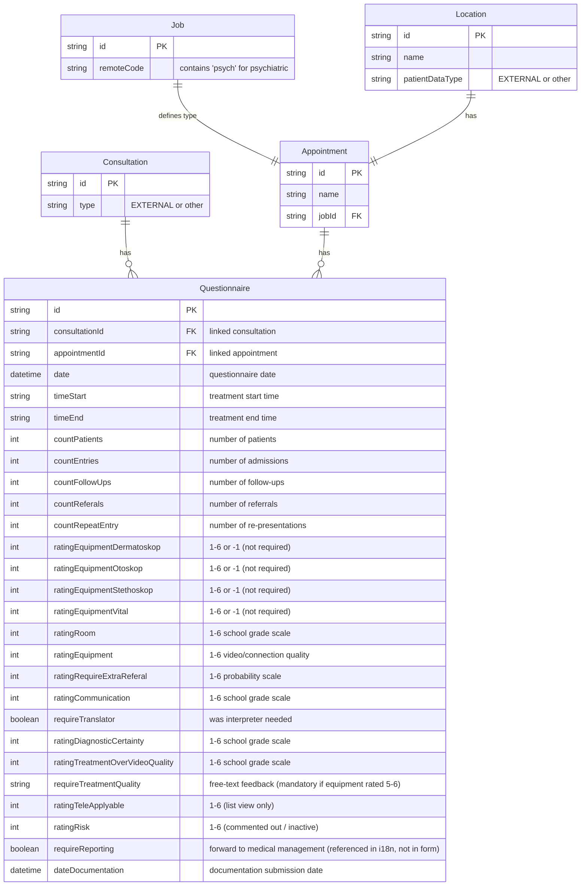
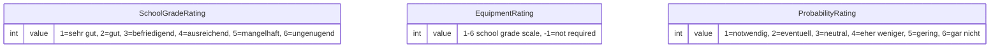

---
---

# Questionnaire Detail Dialog

---

## Cross-References

| Type | Direction | Detail | Linked Document | Condition / Context |
|------|-----------|--------|-----------------|---------------------|
| include | **Included by** | `{{> detailQuestionaire}}` | [Dialogs Treatment](../dashboard/dialogs-treatment.md) | QM partial in `#endAppointmentDlg` and `#summarizeAppointmentDlg` |
| include | **Included by** | `{{> detailQuestionaire}}` | [Consultation Details Header](../consultation/consultation-details-header.md#tab-structure) | QM tab (`#tabQM`) in consultation detail dialog |
| include | **Included by** | `{{> detailQuestionaire}}` | [Appointment Admin](../../planning/appointment-admin/appointment-admin.md) | QM questionnaire view in admin panel |
| event | **Incoming** | `filterQm()` | [Consultation Details JS](../consultation/consultation-details-js.md#2-dialog-lifecycle) | Called from `fillDialog()` to apply visibility rules |
| event | **Incoming** | `filterQm()` | [Dialogs Treatment](../dashboard/dialogs-treatment.md) | Called when opening end-appointment and summarize dialogs |

> **Include context:** This file's source `detailQM.html` is embedded as `{{> detailQuestionaire}}` partial in [Dialogs Treatment](../dashboard/dialogs-treatment.md), [Consultation Details Header](../consultation/consultation-details-header.md), and [Appointment Admin](../../planning/appointment-admin/appointment-admin.md). The `filterQm()` function defined here is called from [Consultation Details JS](../consultation/consultation-details-js.md) and [Dialogs Treatment](../dashboard/dialogs-treatment.md).

---

## 1. Block: Questionnaire Details Dialog

| Property        | Value                                  |
| --------------- | -------------------------------------- |
| **Element ID**  | `questionaireDetailsDlg`               |
| **Type**        | Off-canvas dialog (`.detail`)          |
| **Width**       | `800` (`data-width="800"`)             |
| **Icon**        | `fa fa-heartbeat`                      |
| **Color**       | `bg-color-consultation`                |
| **Title**       | `{{i18n.questionaire}}` = "Fragebogen" / "Questionaire" |
| **Scripts**     | `questionaire/messages.i18n.js`, `questionaire/details.js`, `jquery.conditionize2.min.js` |
| **Init**        | `Dialog.init("#questionaireDetailsDlg")` with `Core.hasLoaded` guard |
| **Reuse**       | Also embedded in dashboard `index.htmlm` as partial `{{> detailQuestionaire}}` |

---

## 2. Header Section (from `index.htmlm` list-detail, not in `detailQM.html`)

The header is shown in the **list view detail row**, not in the standalone detail dialog. It provides context about the linked consultation/appointment.

| Field                       | Binding                           | Notes                     |
| --------------------------- | --------------------------------- | ------------------------- |
| Appointment name            | `data.appointment.name`           | Read-only display         |
| Consultation reference      | `data.consultation`               | Read-only display         |
| Customer name               | `data.customer.name`              | Read-only display         |
| Location name               | `data.location.name`              | Read-only display         |
| Expert display name         | `data.expert.displayName`         | Read-only display         |
| Date                        | `data.qm.date` (class `date`)    | Calendar icon prefix      |
| Time range                  | `data.qm.timeStart` - `data.qm.timeEnd` | Inline display     |

---

## 3. Appointment Counts Section (from `index.htmlm` list-detail)

These counters are in the list-detail view under an "Appointment" heading, **not** in `detailQM.html`.

| Field             | Binding                        | i18n Key                          |
| ----------------- | ------------------------------ | --------------------------------- |
| Patients          | `data.qm.countPatients`       | `appointment.patients`            |
| Admissions        | `data.qm.countEntries`        | `Questionaire.countEntries`       |
| Follow-ups        | `data.qm.countFollowUps`      | `Questionaire.countFollowUps`     |
| Referrals         | `data.qm.countReferals`       | `Questionaire.countReferals`      |
| Re-presentations  | `data.qm.countRepeatEntry`    | `Questionaire.countRepeatEntry`   |

---

## 4. Questions / Ratings Section (from `detailQM.html`)

All ratings use a 1-6 radio scale styled as a `btn-group` (class `radioNext`). The radio `<input>` elements are hidden; their `<label>` wrappers act as toggle buttons. Rating 1 shows a smiley icon; rating 6 shows a frown icon.

### 4.1 Equipment Ratings Sub-Section

These rows have CSS class `qmphysical ratingEquipment` and are **hidden by default**. They are toggled via `.enableRatingEquipment` buttons (currently commented out in the HTML but functional in JS). Each equipment row has:
- A **hidden input** (`name="data.qm.ratingEquipment*"`, `value="-1"`) that stores the selected value
- A **radio group** (`name="ratingEquipment*"` -- note: no `data.qm.` prefix) that syncs to the hidden input via JS
- Values 5 and 6 carry class `requireDocumentation` (triggers mandatory comment)

| # | Field Name                      | i18n Key                                   | Scale    | Icon             | CSS Classes                             | Condition                    |
|---|---------------------------------|--------------------------------------------|----------|------------------|-----------------------------------------|------------------------------|
| 1 | `ratingEquipmentDermatoskop`    | `Questionaire.ratingEquipmentDermatoskop`  | 1-6, -1  | `far fa-wifi`    | `qmphysical ratingEquipment ratingEquipmentDermatoskop` | Hidden if job is "psych" type |
| 2 | `ratingEquipmentOtoskop`        | `Questionaire.ratingEquipmentOtoskop`      | 1-6, -1  | `far fa-wifi`    | `qmphysical ratingEquipment ratingEquipmentOtoskop`     | Hidden if job is "psych" type |
| 3 | `ratingEquipmentStethoskop`     | `Questionaire.ratingEquipmentStethoskop`   | 1-6, -1  | `far fa-wifi`    | `qmphysical ratingEquipment ratingEquipmentStethoskop`  | Hidden if job is "psych" type |
| 4 | `ratingEquipmentVital`          | `Questionaire.ratingEquipmentVital`        | 1-6, -1  | `far fa-wifi`    | `qmphysical ratingEquipment ratingEquipmentVital`       | Hidden if job is "psych" type |

**Equipment toggle buttons** (commented out in HTML, but JS handlers exist):
- Labels with class `enableRatingEquipment` and `data-for="ratingEquipment{Name}"`
- Click toggles visibility of the corresponding equipment row
- When hiding, resets radio selection and sets hidden input back to `-1`

### 4.2 General Rating Questions

| # | Field Name (binding)                   | i18n Key                                      | Scale Type  | Icon (1) | Icon (6) | CSS Classes                | Condition |
|---|----------------------------------------|-----------------------------------------------|-------------|----------|----------|----------------------------|-----------|
| 5 | `data.qm.ratingRoom`                  | `Questionaire.ratingRoom`                     | 1-6 school  | smile    | frown    | (none -- always visible)   | --        |
| 6 | `data.qm.ratingEquipment`             | `Questionaire.ratingEquipment`                | 1-6 school  | smile    | frown    | (none -- always visible)   | --        |
| 7 | `data.qm.ratingRequireExtraReferal`   | `Questionaire.ratingRequireExtraReferal`      | 1-6 wahrsch | thumbs-up | thumbs-down | `qmexternal qmphysical` | Hidden if psych; hidden if EXTERNAL type |
| 8 | `data.qm.ratingCommunication`         | `Questionaire.ratingCommunication`            | 1-6 school  | smile    | frown    | (none -- always visible)   | --        |
| 9 | `data.qm.requireTranslator`           | `Questionaire.requireTranslator`              | boolean     | --       | --       | (none -- always visible)   | --        |
| 10| `data.qm.ratingDiagnosticCertainty`   | `Questionaire.ratingDiagnosticCertainty`      | 1-6 school  | smile    | frown    | (none -- always visible)   | --        |
| 11| `data.qm.ratingTreatmentOverVideoQuality` | `Questionaire.ratingTreatmentOverVideoQuality` | 1-6 school | smile | frown | (none -- always visible) | --        |

### 4.3 Comment / Feedback

| # | Field Name (binding)                   | i18n Key                                  | Type     | Notes |
|---|----------------------------------------|-------------------------------------------|----------|-------|
| 12| `data.qm.requireTreatmentQuality`     | `Questionaire.requireTreatmentQuality`    | textarea | Becomes mandatory (class `mandatory`) when any `requireDocumentation` radio (value 5 or 6 on equipment ratings) is checked. Validated for min 3 chars. |

**Commented-out field**: `data.qm.comment` (textarea with `label.comment` placeholder) -- not active.

---

## 5. Commented-Out / Inactive Sections

| Item | Details |
|------|---------|
| **ratingRisk** (`data.qm.ratingRisk`) | Fully commented out. Would use `rating.risk.*` scale (1-6). CSS class `qmshift`. |
| **ratingTeleApplyable** (`data.qm.ratingTeleApplyable`) | Present only in `index.htmlm` list-detail as a read-only field, **not** in `detailQM.html` form. |
| **Equipment toggle button bar** | The `btn-group` with `.enableRatingEquipment` labels is commented out in HTML (lines 4-16), but the JS toggle handlers remain active. Equipment rows are shown/hidden programmatically by `filterQm()`. |
| **comment field** | `data.qm.comment` textarea is commented out (line 197). |

---

## 6. Form Elements Table

| # | Field Name                           | HTML Type         | Data Type | CSS Class(es)          | Binding Name                              | Default | Validation                | Scale Labels Used     |
|---|--------------------------------------|-------------------|-----------|------------------------|-------------------------------------------|---------|---------------------------|-----------------------|
| 1 | ratingEquipmentDermatoskop (hidden)  | `input[hidden]`   | number    | `number`               | `data.qm.ratingEquipmentDermatoskop`      | `-1`    | --                        | --                    |
| 2 | ratingEquipmentDermatoskop (radio)   | `radio` x7        | number    | `number`               | `ratingEquipmentDermatoskop`              | --      | --                        | `rating.1`..`rating.6`, `rating.notrequired` |
| 3 | ratingEquipmentOtoskop (hidden)      | `input[hidden]`   | number    | `number`               | `data.qm.ratingEquipmentOtoskop`          | `-1`    | --                        | --                    |
| 4 | ratingEquipmentOtoskop (radio)       | `radio` x7        | number    | `number`               | `ratingEquipmentOtoskop`                  | --      | --                        | `rating.1`..`rating.6`, `rating.notrequired` |
| 5 | ratingEquipmentStethoskop (hidden)   | `input[hidden]`   | number    | `number`               | `data.qm.ratingEquipmentStethoskop`       | `-1`    | --                        | --                    |
| 6 | ratingEquipmentStethoskop (radio)    | `radio` x7        | number    | `number`               | `ratingEquipmentStethoskop`               | --      | --                        | `rating.1`..`rating.6`, `rating.notrequired` |
| 7 | ratingEquipmentVital (hidden)        | `input[hidden]`   | number    | `number`               | `data.qm.ratingEquipmentVital`            | `-1`    | --                        | --                    |
| 8 | ratingEquipmentVital (radio)         | `radio` x7        | number    | `number`               | `ratingEquipmentVital`                    | --      | --                        | `rating.1`..`rating.6`, `rating.notrequired` |
| 9 | ratingRoom                           | `radio` x6        | number    | `number`               | `data.qm.ratingRoom`                     | --      | --                        | `rating.1`..`rating.6` |
| 10| ratingEquipment (video quality)      | `radio` x6        | number    | `number`               | `data.qm.ratingEquipment`                | --      | --                        | `rating.1`..`rating.6` |
| 11| ratingRequireExtraReferal            | `radio` x6        | number    | `number`               | `data.qm.ratingRequireExtraReferal`       | --      | --                        | `rating.wahrsch.1`..`rating.wahrsch.6` |
| 12| ratingCommunication                  | `radio` x6        | number    | `number`               | `data.qm.ratingCommunication`             | --      | --                        | `rating.1`..`rating.6` |
| 13| requireTranslator                    | `radio` x2        | boolean   | `bool`                 | `data.qm.requireTranslator`              | --      | --                        | `label.yes`, `label.no` |
| 14| ratingDiagnosticCertainty            | `radio` x6        | number    | `number`               | `data.qm.ratingDiagnosticCertainty`       | --      | --                        | `rating.1`..`rating.6` |
| 15| ratingTreatmentOverVideoQuality      | `radio` x6        | number    | `number`               | `data.qm.ratingTreatmentOverVideoQuality` | --      | --                        | `rating.1`..`rating.6` |
| 16| requireTreatmentQuality              | `textarea`        | string    | `form-control`         | `data.qm.requireTreatmentQuality`         | --      | min 3 chars when mandatory | --                    |

---

## 7. Conditional Visibility Rules

The `filterQm(dialog, pojo)` function controls visibility based on the consultation/appointment context.

| Rule | Trigger Condition | Elements Affected | Action |
|------|-------------------|-------------------|--------|
| **Psych job type** | `job.remoteCode` contains "psych" (case-insensitive) | All `.qmphysical` rows (equipment ratings #1-4, referral rating #7) | **Hide** all physical-exam rows |
| **EXTERNAL consultation type** | `pojo.type === "EXTERNAL"` OR `ap.location.patientDataType === "EXTERNAL"` | All `.qmexternal` rows (referral rating #7) | **Hide** external referral row |
| **Equipment auto-expand** | `qm[equipmentField] > 0` (equipment has a saved positive value) | Matching `.ratingEquipment` row | **Show** the equipment row (trigger change on enableRatingEquipment button) |
| **Require documentation** | Any radio with class `requireDocumentation` (values 5 or 6 on equipment ratings) is checked | `textarea[name="data.qm.requireTreatmentQuality"]` | Add class `mandatory`; validate min 3 chars; add class `invalid` if not met |

### Visibility class mapping

| CSS Class       | Applied to rows | Meaning |
|-----------------|----------------|---------|
| `qmphysical`   | Equipment ratings (#1-4), referral (#7) | Physical-examination-related; hidden for psych consultations |
| `qmexternal`   | Referral (#7)  | External referral question; hidden for EXTERNAL consultation type |
| `ratingEquipment` | Equipment rows (#1-4) | Equipment rating; hidden by default, toggled by enable buttons or `filterQm` |
| `ratingEquipmentDermatoskop` / `...Otoskop` / `...Stethoskop` / `...Vital` | Individual equipment rows | Targeted by the toggle button `data-for` attribute |

### pojo resolution logic in `filterQm`

The function extracts `job`, `ap` (appointment), and `qm` from the pojo using fallback chains:
1. `pojo.qm` -> `qm`
2. `pojo.jobId` -> `job = pojo.jobId, ap = pojo`
3. `pojo.job` -> `job = pojo.job, ap = pojo.appointment`
4. `pojo.appointment` -> `job = pojo.appointment.job, ap = pojo.appointment`
5. `pojo.ap` -> `job = pojo.ap.job, ap = pojo.ap`

---

## 8. Hidden Inputs / Defaults

| Hidden Input Binding                    | Default Value | Mechanism                        |
| --------------------------------------- | ------------- | -------------------------------- |
| `data.qm.ratingEquipmentDermatoskop`   | `-1`          | `style="display:none"`, `value="-1"` |
| `data.qm.ratingEquipmentOtoskop`       | `-1`          | `style="display:none"`, `value="-1"` |
| `data.qm.ratingEquipmentStethoskop`    | `-1`          | `style="display:none"`, `value="-1"` |
| `data.qm.ratingEquipmentVital`         | `-1`          | `style="visibility:hidden"`, `value="-1"` |

The hidden inputs store the actual persisted value. The radio groups (without `data.qm.` prefix) are UI-only; their selection syncs to the hidden input via jQuery click handler:
```js
$radios.on("click", function(){ $eqinput.val($(this).val()); });
```

On data fill, the reverse happens -- the hidden input's `fill` event selects the matching radio.

Value `-1` means "not rated" / "not required".

---

## 9. Translation Table

### Rating Scale Labels

| Key                  | DE (German)       | EN (English)      | Status |
|----------------------|-------------------|-------------------|--------|
| `rating.1`           | sehr gut          | very good         | OK     |
| `rating.2`           | gut               | good              | OK     |
| `rating.3`           | befriedigend      | satisfying        | OK     |
| `rating.4`           | ausreichend       | sufficient        | OK     |
| `rating.5`           | mangelhaft        | poor              | OK     |
| `rating.6`           | ungenugend        | inadequate        | OK     |
| `rating.notrequired` | nicht benotigt    | not required      | OK     |

### Probability Scale Labels (for `ratingRequireExtraReferal`)

| Key                  | DE (German)       | EN (English)      | Status       |
|----------------------|-------------------|-------------------|--------------|
| `rating.wahrsch.1`   | notwendig         | --                | MISSING (EN) |
| `rating.wahrsch.2`   | eventuell         | --                | MISSING (EN) |
| `rating.wahrsch.3`   | neutral           | --                | MISSING (EN) |
| `rating.wahrsch.4`   | eher weniger      | --                | MISSING (EN) |
| `rating.wahrsch.5`   | gering            | --                | MISSING (EN) |
| `rating.wahrsch.6`   | gar nicht         | --                | MISSING (EN) |

### Risk Scale Labels (commented out, not active)

| Key                  | DE (German)       | EN (English)      | Status       |
|----------------------|-------------------|-------------------|--------------|
| `rating.risk.1`      | Sehr              | --                | MISSING (EN) |
| `rating.risk.2`      | brisant           | --                | MISSING (EN) |
| `rating.risk.3`      | eher              | --                | MISSING (EN) |
| `rating.risk.4`      | weniger           | --                | MISSING (EN) |
| `rating.risk.5`      | gering            | --                | MISSING (EN) |
| `rating.risk.6`      | gar nicht         | --                | MISSING (EN) |

### Questionnaire Field Labels

| Key                                        | DE (German)                                                                                      | EN (English)                                                                                      |
|--------------------------------------------|--------------------------------------------------------------------------------------------------|---------------------------------------------------------------------------------------------------|
| `questionaire`                             | Fragebogen                                                                                       | Questionaire                                                                                      |
| `Questionaire.ratingEquipmentDermatoskop`  | Wie bewerten Sie den Einsatz des digitalen Dermatoskops?                                         | How do you rate the use of the digital dermatoscope?                                              |
| `Questionaire.ratingEquipmentOtoskop`      | Wie bewerten Sie den Einsatz des digitalen Otoskops?                                             | How do you rate the use of the digital otoscope?                                                  |
| `Questionaire.ratingEquipmentStethoskop`   | Wie bewerten Sie den Einsatz des digitalen Stethoskops?                                          | How do you rate the use of the digital stethoscope?                                               |
| `Questionaire.ratingEquipmentVital`        | Wie bewerten Sie den Einsatz des Vitalwerte-Messgerats?                                          | How do you rate the use of the vital signs monitor?                                               |
| `Questionaire.ratingEquipmentNone`         | kein Gerat benutzt                                                                               | no device used                                                                                    |
| `Questionaire.ratingRoom`                  | Bitte bewerten Sie die raumlichen Gegebenheiten wahrend der Behandlung!                          | Please assess the spatial conditions during the treatment!                                        |
| `Questionaire.ratingEquipment`             | Bitte bewerten Sie die Video-/Verbindungsqualitat Ihres Patienten!                               | Please rate the video/connection quality of your patient!                                         |
| `Questionaire.ratingRequireExtraReferal`   | Wie wahrscheinlich ware ohne Ihre Behandlung eine sofortige Ausfuhrung oder externe Uberweisung? | Without your treatment, how likely would an immediate evacuation or external referral have been?   |
| `Questionaire.ratingCommunication`         | Bitte bewerten Sie die Zusammenarbeit mit dem anwesendem Personal?                               | Please rate the cooperation with the staff present (e.g. AVD, nursing staff, ship's crew)?        |
| `Questionaire.requireTranslator`           | War fur die Behandlung ein Dolmetscher notwendig?                                                | Was an interpreter necessary for the treatment?                                                   |
| `Questionaire.ratingDiagnosticCertainty`   | Wie beurteilen Sie die Qualitat Ihrer heutigen Behandlung?                                       | How would you rate the quality of your treatment today?                                           |
| `Questionaire.ratingTreatmentOverVideoQuality` | Wie liess sich der Fall per Video losen?                                                     | How was the case solved by video?                                                                 |
| `Questionaire.requireTreatmentQuality`     | Feedback Behandlungsqualitat                                                                     | Feedback on treatment quality                                                                     |
| `Questionaire.requireReporting`            | Mochten Sie, dass Ihr Fall an die Arztliche Leitung weitergegeben wird?                          | Would you like your case to be forwarded to the medical management for review?                    |
| `Questionaire.ratingRisk`                  | Risiko                                                                                           | Risk                                                                                              |
| `Questionaire.ratingTeleApplyable`         | Wie gut war/en die Behandlung/en telemedizinisch behandelbar?                                    | How well was/are the treatment(s) treatable by telemedicine?                                      |
| `Questionaire.countEntries`                | Anzahl Einweisungen                                                                              | Number of admissions                                                                              |
| `Questionaire.countFollowUps`              | Anzahl Folgetermine                                                                              | Number of follow-up appointments                                                                  |
| `Questionaire.countReferals`               | Anzahl Uberweisungen                                                                             | Number of transfers                                                                               |
| `Questionaire.countRepeatEntry`            | Anzahl Wiedervorstellung bei Verschlechterung                                                    | Number of re-presentations in the event of deterioration                                          |
| `Questionaire.dateDocumentation`           | Dokumentationsubermittlung                                                                       | -- (MISSING in EN)                                                                                |
| `Questionaire.dateEnd`                     | Behandlungsende                                                                                  | -- (MISSING in EN)                                                                                |
| `Questionaire.dateStart`                   | Behandlungsbeginn                                                                                | -- (MISSING in EN)                                                                                |
| `label.yes`                                | Ja (assumed)                                                                                     | Yes (assumed)                                                                                     |
| `label.no`                                 | Nein (assumed)                                                                                   | No (assumed)                                                                                      |

> **HARDCODED strings**: The heading `"Appointment"` in `index.htmlm` line 78 is hardcoded in English, not using an i18n key.

---

## 10. Mermaid Data Model Diagram



### Rating Scale Enums



---

## Implementation Notes for React/Shadcn Reimplementation

1. **Rating component**: Create a reusable `RatingRadioGroup` component that renders a `ToggleGroup` (shadcn) with values 1-6 (or 1-6 + -1 for equipment). The component should accept a `scale` prop (`"school"` | `"probability"`) to determine label text.

2. **Equipment section**: Implement as a collapsible section. Use a state map `{ dermatoscope: boolean, otoscope: boolean, ... }` to control which equipment fields are shown. Default all to hidden; auto-expand when saved value > 0.

3. **Conditional visibility**: Replace jQuery class-based filtering with React conditional rendering based on:
   - `consultation.type !== "EXTERNAL"` for referral question
   - `job.remoteCode` not containing "psych" for physical exam questions

4. **Mandatory comment validation**: Use Zod schema with `.refine()` -- if any equipment rating is 5 or 6, `requireTreatmentQuality` must be at least 3 characters.

5. **Data binding**: The `data.qm.*` prefix maps to a `qm` sub-object on the consultation/appointment POJO. Equipment radio groups use unprefixed names (UI-only) and sync to the hidden `data.qm.*` inputs. In React, use a single form state -- no hidden input trick needed.

6. **Missing EN translations**: The `rating.wahrsch.*` (probability) and `rating.risk.*` scales have no English translations. These must be added in the reimplementation.
