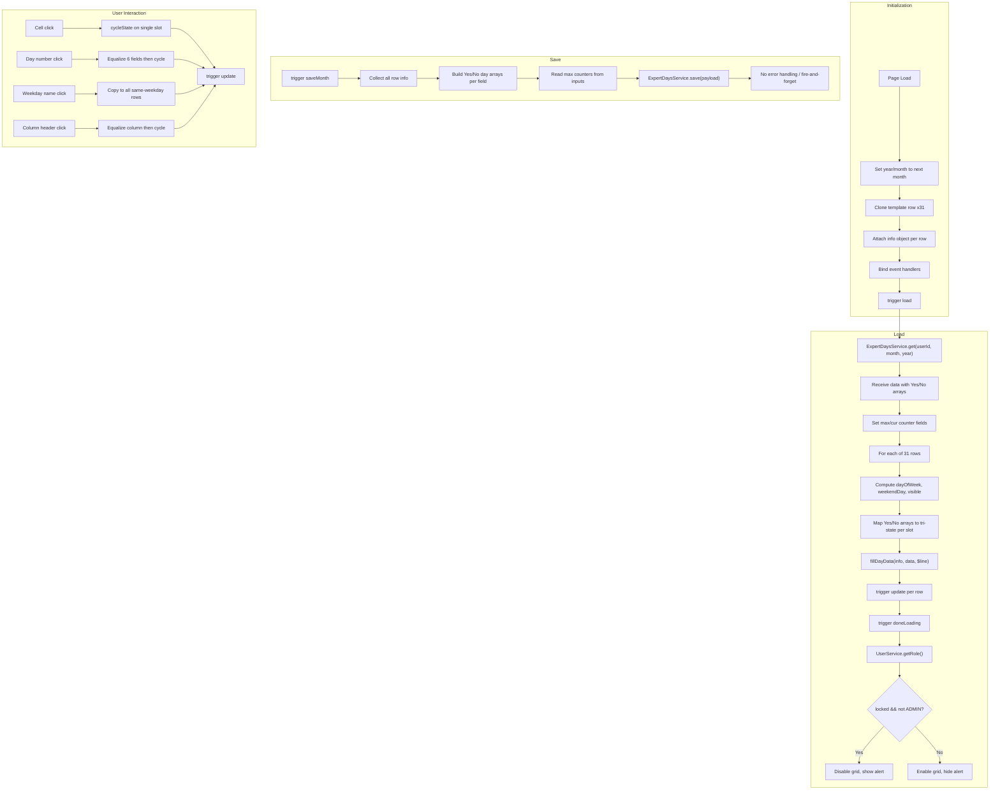
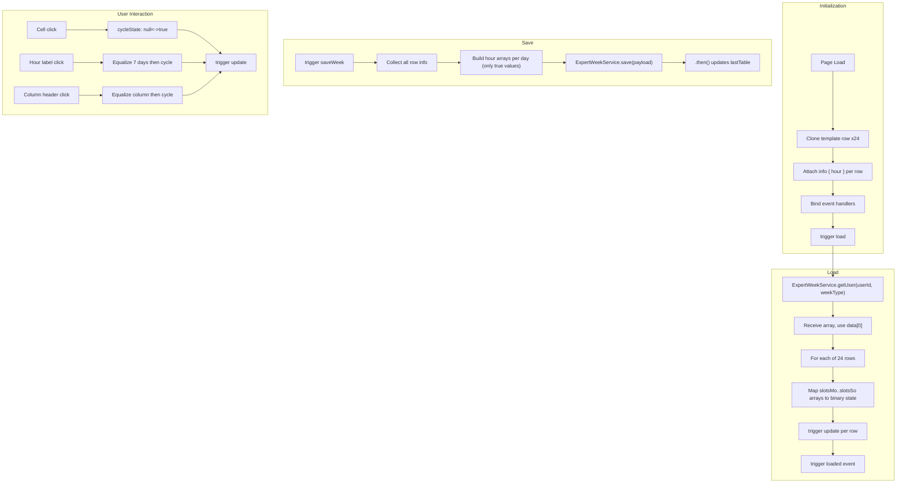

# Expert Availability Grid Logic

---

## Cross-References

### Source Includes

| Type | Direction | Detail | Linked Document | Condition / Context |
|------|-----------|--------|-----------------|---------------------|
| include | **Included by** | `<script src="/profile/expertDays.js">` | [Month View](../../planning/dashboard/month-view.md) | Month availability grid logic for `#expertdaysMonthTable` |
| include | **Included by** | `<script src="/profile/expertWeek.js">` | [Week View](../../planning/dashboard/week-view.md) | Week availability grid logic for `#expertWeekTable` |
| include | **Included by** | `<script src="/profile/expertWeek.js">` | [Treatment Plan](../../treatment/treatment-core/treatment-plan.md) | Week grid embedded in treatment plan create dialog |
| include | **Included by** | `<script src="/profile/expertDays.js">` | [Profile Form](../profile/profile-form.md) | Monthly availability grid in profile |
| include | **Included by** | `<script src="/profile/expertWeek.js">` | [Profile Form](../profile/profile-form.md) | Weekly availability grid in profile |

> **Include context:** `expertDays.js` is loaded by [Month View](../../planning/dashboard/month-view.md) and [Profile Form](../profile/profile-form.md); `expertWeek.js` is loaded by [Week View](../../planning/dashboard/week-view.md), [Treatment Plan](../../treatment/treatment-core/treatment-plan.md), and [Profile Form](../profile/profile-form.md). Both scripts operate on table elements defined in the host page's HTML.

---

---

## 1. Block: Expert Days (Month Grid) -- `expertDays.js`

### 1.1 Object Structure

`expertDays.js` is not a class or named object -- it is a jQuery `$(function(){ ... })` IIFE that operates on `#expertdaysMonthTable`. All state is stored on DOM element `.data()` objects.

### 1.2 Global Helper

```js
function cycleState(state) {
    if (state === null) return true;
    else if (state === true) return false;
    else return null;
}
```

Three-state cycle: `null -> true -> false -> null`.

### 1.3 Initialization

| Step | Action |
|------|--------|
| 1 | Sets year/month inputs to **next month** from today: `luxon.DateTime.now().set({day:1}).plus({months:1})` |
| 2 | Captures `#expertdaysMonthTable` and its `<tbody>` |
| 3 | Removes the single `<tr>` template from DOM, stores as `tpl` |
| 4 | Defines field list: `["morning", "afternoon", "night", "morningAppointment", "afternoonAppointment", "treatmentAppointment"]` |
| 5 | Creates 31 row clones (one per possible day) and appends to tbody |
| 6 | Attaches `.data().info` to each row with initial state |
| 7 | Binds `update`, click handlers per row |
| 8 | Binds column header click, `saveMonth`, `load`, `doneLoading` events |
| 9 | Binds year/month `change` listeners (unsaved-changes prompt + reload) |

### 1.4 Row Data Model (`info` object per row)

| Property | Type | Initial Value | Description |
|----------|------|---------------|-------------|
| `day` | `number` | 1-31 | Day of month |
| `dayOfWeek` | `string` | `"xx"` | Luxon `weekdayShort` (e.g. `"Mon"`) |
| `weekendDay` | `boolean` | `false` | `true` if Saturday or Sunday |
| `publicHoliday` | `boolean` | `false` | `true` if in `data.holidays` array |
| `visible` | `boolean` | (set on load) | `false` hides row (days beyond month length) |
| `morning` | `null\|boolean` | `null` | Shift morning availability |
| `afternoon` | `null\|boolean` | `null` | Shift afternoon availability |
| `night` | `null\|boolean` | `null` | Shift night availability |
| `morningAppointment` | `null\|boolean` | `null` | Appointment morning availability |
| `afternoonAppointment` | `null\|boolean` | `null` | Appointment afternoon availability |
| `treatmentAppointment` | `null\|boolean` | `null` | Treatment appointment availability |
| `appointments` | `array` | (set by `fillDayData`) | Filtered appointments for this day |

### 1.5 Update Handler (Row Repaint)

On `"update"` event per `<tr>`:

1. Sets `.day` cell text to `info.day`
2. Sets `.dayOfWeek` cell text to `info.dayOfWeek`
3. Toggles `.weekend` CSS class and hides `.weekday` elements on weekend rows
4. Toggles `.publicHoliday` CSS class
5. Hides entire row if `!info.visible` (days 29-31 for shorter months)
6. For each `.dayslot` cell, reads `data-slot`, hides all status icons, then shows appropriate one:
   - `info[slot] === null` -> show `.statusNull`, remove `green`/`red` classes
   - `info[slot] === true` -> show `.statusTrue`, add `green`, remove `red`
   - `info[slot] === false` -> show `.statusFalse`, add `red`, remove `green`

### 1.6 Methods Summary

| Method / Handler | Trigger | Description |
|-----------------|---------|-------------|
| `cycleState()` | (global function) | Tri-state cycle: `null->true->false->null` |
| Row `"update"` | Per-row custom event | Repaints row from `info` data |
| `.changeday` click | Cell click | Cycles single slot, marks table changed |
| `.day` click | Day number click | Equalizes all 6 fields to first field value, then cycles if already equal |
| `.dayOfWeek` click | Weekday name click | Copies current row's slot values to all rows sharing same weekday |
| `.slotchange` click | Column header click | Equalizes column, then cycles if already uniform |
| `"saveMonth"` | Table custom event | Serializes state, calls `ExpertDaysService.save` |
| `"load"` | Table custom event | Fetches data, populates 31 rows |
| `"doneLoading"` | After load completes | Applies month lock logic (role-dependent) |
| `fillDayData` | Stored on `table.data()` | Injects appointment indicator icons into row |
| Year/Month `change` | Input change | Prompts save if changed, then reloads |

---

## 2. Block: Expert Week (Week Grid) -- `expertWeek.js`

### 2.1 Object Structure

Same pattern as `expertDays.js` -- a jQuery IIFE operating on `#expertWeekTable`. No named class.

### 2.2 Global Helper

```js
function cycleState(state) {
    if (state === null) return true;
    else return null;
}
```

**Two-state cycle** (not three): `null -> true -> null`. This is different from `expertDays.js` which has a three-state cycle. The week grid has no explicit "unavailable/false" state.

### 2.3 Initialization

| Step | Action |
|------|--------|
| 1 | Captures `#expertWeekTable` and its `<tbody>` |
| 2 | Removes the single `<tr>` template from DOM |
| 3 | Creates 24 row clones (one per hour: 1-24) |
| 4 | Attaches `.data().info` to each row: `{ hour: hourCount }` |
| 5 | Binds `update`, click handlers per row |
| 6 | Binds column header click, `"saveWeek"`, `"load"` events |
| 7 | Binds `#weekTypeSelection` change listener |

### 2.4 Row Data Model (`info` object per row)

| Property | Type | Initial Value | Description |
|----------|------|---------------|-------------|
| `hour` | `number` | 1-24 | Hour of day |
| `slotsMo` | `null\|true` | `null` | Monday availability |
| `slotsTu` | `null\|true` | `null` | Tuesday availability |
| `slotsWe` | `null\|true` | `null` | Wednesday availability |
| `slotsTh` | `null\|true` | `null` | Thursday availability |
| `slotsFr` | `null\|true` | `null` | Friday availability |
| `slotsSa` | `null\|true` | `null` | Saturday availability |
| `slotsSu` | `null\|true` | `null` | Sunday availability |

### 2.5 Update Handler (Row Repaint)

On `"update"` event per `<tr>`:

1. Sets `.hour` cell text to zero-padded format: `"01:00"` through `"24:00"`
2. For each `.hourslot` cell, reads `data-slot`, hides all status icons, then:
   - `info[slot] === true` -> show `.statusTrue`, add `green`, remove `red`
   - Otherwise -> show `.statusFalse`, remove both `green` and `red`

Note: The week grid uses `.statusFalse` (X icon) as the default/unset visual, not `.statusNull` (circle). There is no visual distinction between "unset" and "unavailable" in the week grid.

### 2.6 Locked Slot Check

Every click handler in `expertWeek.js` checks `$(this).hasClass("locked")` before proceeding. This is **not present** in `expertDays.js`. The lock class is presumably set externally (by `weekView.js` or `doneLoading` logic).

### 2.7 Methods Summary

| Method / Handler | Trigger | Description |
|-----------------|---------|-------------|
| `cycleState()` | (global function) | Two-state cycle: `null->true->null` |
| Row `"update"` | Per-row custom event | Repaints row from `info` data |
| `.changehour` click | Cell click | Cycles single slot (with lock check) |
| `.hour` click | Hour label click | Equalizes all 7 day slots then cycles if uniform |
| `.slotchange` click | Column header click | Equalizes column then cycles if uniform |
| `"saveWeek"` | Table custom event | Serializes state, calls `ExpertWeekService.save` |
| `"load"` | Table custom event | Fetches data, populates 24 rows |
| `#weekTypeSelection` change | Select change | Prompts save if changed, then reloads |

---

## 3. Grid Slot States

### 3.1 Month Grid (expertDays.js) -- Tri-State

| State | Value | CSS Classes Added | Icon Shown | Visual |
|-------|-------|-------------------|------------|--------|
| Unset | `null` | (none) | `.statusNull` -- `fal fa-circle` | Gray outline circle |
| Available | `true` | `green` | `.statusTrue` -- `fa fa-check` | Green checkmark |
| Unavailable | `false` | `red` | `.statusFalse` -- `fa fa-times` | Red X mark |

Cycle: `null -> true -> false -> null`

### 3.2 Week Grid (expertWeek.js) -- Binary State

| State | Value | CSS Classes Added | Icon Shown | Visual |
|-------|-------|-------------------|------------|--------|
| Unset / Off | `null` | (none) | `.statusFalse` -- `fa fa-times` | Neutral X (no color) |
| Available | `true` | `green` | `.statusTrue` -- `fa fa-check` | Green checkmark |

Cycle: `null -> true -> null`

Note: The week grid reuses the `.statusFalse` span for the "off" state, meaning the X icon displays without any color class. This is semantically inconsistent with the month grid where `.statusFalse` means "explicitly unavailable" with red coloring.

### 3.3 Appointment Overlay Icons (Month Grid Only)

| `ap.type` | Icon | Description |
|-----------|------|-------------|
| `SHIFT` | `fa-user-injured` | Shift assignment |
| `COUNCIL` | `fa-user-friends` | Council/group session |
| (default) | `fa-user-md` | Standard appointment |

Each icon is colored by `i18n.assignedStateIcons(ap.state).color` and wrapped in a Bootstrap popover showing `@HH:MM-HH:MM title stateLabel`.

Appointment icons in the month grid are clickable and navigate to `shift.html#id`, `council.html#id`, or `appointment.html#id` via deep links.

---

## 4. Server API Calls

### 4.1 Expert Days (Month)

| Service | Method | Parameters | Direction | Description |
|---------|--------|------------|-----------|-------------|
| `ExpertDaysService` | `get` | `[userId, month, year]` | Load | Fetches month availability + appointments. Overridable via `table.data().service` / `table.data().method` |
| `ExpertDaysService` | `save` | `[dataSaved]` | Save | Persists month availability. Fire-and-forget (no `.then()`) |
| `ExpertDaysService` | `setHoliday` | `[-1, start, until]` | Save | Sets holiday range. Called from holiday dialog in `monthView.js` |
| `UserService` | `getRole` | `[]` | Load | Fetches user role for lock check (called in `doneLoading`) |

### 4.2 Expert Week

| Service | Method | Parameters | Direction | Description |
|---------|--------|------------|-----------|-------------|
| `ExpertWeekService` | `getUser` | `[userId, weekType]` | Load | Fetches week availability. Returns **array** (takes `data[0]`). Overridable via `table.data().service` / `table.data().method` |
| `ExpertWeekService` | `save` | `[dataSaved]` | Save | Persists week availability. Has `.then()` callback to update `lastTable` |

### 4.3 Load Response Shapes

**Month (`ExpertDaysService.get`) response:**

```
{
  id: string,
  userId: string,
  month: number,              // YYYYMM integer (e.g. 202403)
  locked: boolean,
  holidays: number[],         // array of day numbers that are public holidays
  morningYes: number[],       // days marked available for morning shift
  morningNo: number[],        // days marked unavailable for morning shift
  afternoonYes: number[],     // (same pattern for all 6 slot fields)
  afternoonNo: number[],
  nightYes: number[],
  nightNo: number[],
  morningAppointmentYes: number[],
  morningAppointmentNo: number[],
  afternoonAppointmentYes: number[],
  afternoonAppointmentNo: number[],
  treatmentAppointmentYes: number[],
  treatmentAppointmentNo: number[],
  maxWeekDayMorning: number,  // max shift caps (8 types)
  maxWeekDayAfternoon: number,
  maxWeekDayNight: number,
  maxWeekEndMorning: number,
  maxWeekEndAfternoon: number,
  maxWeekEndNight: number,
  maxWeekDayAppointmentMorning: number,
  maxWeekDayAppointmentAfternoon: number,
  curWeekDayMorning: number,  // current counts (read-only display)
  curWeekDayAfternoon: number,
  // ... (same pattern for all cur* fields)
  appointments: Array<{       // appointment overlays
    id: string,
    day: number,
    time: string,             // "MORNING", "AFTERNOON", "NIGHT", "TREATMENT"
    type: string,             // "SHIFT", "COUNCIL", or appointment type
    title: string,
    state: string,            // action state enum
    start: string,            // ISO datetime
    end: string,              // ISO datetime
  }>
}
```

**Week (`ExpertWeekService.getUser`) response:**

```
// Returns an ARRAY, first element is used
[{
  id: string,
  userId: string,
  type: string,             // "TREATMENT" or other week type
  slotsMo: number[],        // hours marked available (e.g. [8, 9, 10, 11])
  slotsTu: number[],
  slotsWe: number[],
  slotsTh: number[],
  slotsFr: number[],
  slotsSo: number[],        // NOTE: "So" (German Sonntag), not "Su"
}]
```

### 4.4 Save Payload Shapes

**Month save payload:**

```
{
  id: string,
  userId: string,
  month: number,                    // YYYYMM
  morningYes: number[],             // day numbers where available
  morningNo: number[],              // day numbers where unavailable
  // ... same for all 6 fields
  maxWeekDayMorning: number,        // from input fields
  maxWeekDayAfternoon: number,
  // ... (8 max fields)
}
```

**Week save payload:**

```
{
  id: string,
  userId: string,
  type: string,
  slotsMo: number[],    // hours where available (e.g. [8, 9, 10])
  slotsTu: number[],
  slotsWe: number[],
  slotsTh: number[],
  slotsFr: number[],
  slotsSa: number[],
  slotsSo: number[],    // NOTE: save uses "So", load data also uses "So"
}
```

---

## 5. Click / Interaction Handlers

### 5.1 Single Cell Click

**Month (`.changeday` click):**
1. Sets `monthTable.data().changed = true`
2. Reads `slot` from parent `data-slot`
3. Reads `info` from grandparent row `.data().info`
4. Cycles: `info[slot] = cycleState(info[slot])` (null->true->false->null)
5. Triggers `"update"` on row

**Week (`.changehour` click):**
1. Checks `.hasClass("locked")` -- returns if locked
2. Sets `weekTable.data().changed = true`
3. Same slot/info read pattern
4. Cycles: `info[slot] = cycleState(info[slot])` (null->true->null)
5. Triggers `"update"` on row

### 5.2 Row Click (Day Number / Hour Label)

**Month (`.day` click) -- "Equalize then cycle":**
1. Reads first field value: `target = info[fields[0]]` (i.e. `info.morning`)
2. Checks if ALL 6 fields are equal to `target`
3. If all equal: cycles `target` to next state
4. Sets all 6 fields to `target`
5. Triggers `"update"`

**Week (`.hour` click) -- same "equalize then cycle" pattern:**
1. Reads `target = info.slotsMo`
2. Checks if all 7 day slots equal `target`
3. If all equal: cycles
4. Sets all 7 slots to `target`

### 5.3 Weekday Name Click (Month Only)

**Month (`.dayOfWeek` click) -- "Copy to same weekday":**
1. Reads current row's `info` as `copyData`
2. Gets `cur = copyData.dayOfWeek` (e.g. `"Mon"`)
3. Iterates ALL rows; for rows where `info.dayOfWeek === cur`:
   - Copies all 6 field values from `copyData`
   - Triggers `"update"`

This means clicking "Mon" on day 7 copies day 7's availability to days 14, 21, 28.

### 5.4 Column Header Click

**Both grids -- "Equalize then cycle" (same algorithm):**
1. Reads `slot` from header `data-slot`
2. Gets first row's value for that slot as `state`
3. Computes `targetState = cycleState(state)`
4. Iterates all rows: if ANY row's value differs from `state`, sets `targetState = state` (equalize instead of cycle)
5. Sets all rows to `targetState`

This means: if column is uniform, cycle to next state. If mixed, equalize to the first row's current value.

---

## 6. Anti-Patterns and Bugs

### 6.1 Fire-and-Forget Save (Month)

```js
Core.conn.execute("ExpertDaysService", "save", [dataSaved]);
// No .then(), no error handling
monthTable.data().lastTable = dataSaved;  // optimistic update immediately
```

The month save has NO `.then()` callback and NO error handling. `lastTable` is updated synchronously after the async call fires, meaning the UI assumes success. The week save is slightly better -- it has `.then()` to update `lastTable`, but still no `.catch()`.

**Dashboard integration makes it worse:** `monthView.js` does:
```
trigger("saveMonth") -> setTimeout(() => trigger("load"), 500)
```
The 500ms delay is a race condition -- if the save takes longer, the reload fetches stale data.

### 6.2 `slotsSo` vs `slotsSu` Naming Inconsistency

The week grid template HTML uses `data-slot="slotsSu"` (English "Sunday") but the server data uses `slotsSo` (German "Sonntag"). In the save payload (line 153), the key is `slotsSo`. In the load handler (line 204), it reads `slotsSo` from server data. But the HTML template's `data-slot` is `slotsSu`.

The row click handler (line 95) sets `info.slotsSu = target`, matching the HTML slot name. This means **Sunday data from the server (`slotsSo`) is never mapped to the UI slot (`slotsSu`)**. The load loop (lines 204-212) iterates `["slotsMo", "slotsTu", "slotsWe", "slotsTh", "slotsFr", "slotsSa", "slotsSo"]` and sets `info["slotsSo"]`, but the update handler reads `info["slotsSu"]` from `data-slot` -- a **silent data mapping bug**. Sunday availability may never display correctly on load.

Similarly, the save handler (line 160) iterates `["slotsMo", ..., "slotsSo"]` but reads `info["slotsSo"]` which was never set by the UI (the UI writes `info["slotsSu"]`). So Sunday clicks are saved to the wrong key. This is a **data loss bug for Sunday**.

### 6.3 `cycleState` Function Redefined Globally

Both `expertDays.js` and `expertWeek.js` define a global `cycleState()` function. Whichever script loads last wins. On pages that load both (none currently, but fragile), behavior would depend on script order. The two implementations are DIFFERENT:
- `expertDays.js`: `null -> true -> false -> null` (tri-state)
- `expertWeek.js`: `null -> true -> null` (binary)

### 6.4 Equality Operator Inconsistency (Month Row Click)

In the `.day` click handler (lines 114-118), the first comparison uses `===` (strict) but subsequent ones use `==` (loose):

```js
let target = info[fields[0]];
if (target === info.afternoon       // strict
    && target === info.night        // strict
    && target == info.morningAppointment     // loose!
    && target == info.afternoonAppointment   // loose!
    && target == info.treatmentAppointment)  // loose!
```

Since values are `null`, `true`, or `false`, loose equality `null == false` is `false` and `null == true` is `false`, so it accidentally works. But `null == undefined` is `true`, which could cause bugs if any field is `undefined`.

### 6.5 Counter Default Value 30

When loading month data, if a max/cur counter field is undefined, it defaults to 30 (line 251):

```js
if (typeof data[type] === "undefined") {
    data[type] = 30;
}
```

This means missing counter data shows as "30" in both display and input fields -- a potentially misleading default.

### 6.6 No Debounce on Slot Clicks

Every click triggers a full row repaint via `trigger("update")`, which re-renders all slot icons in the row. For rapid clicks, this causes unnecessary DOM churn.

### 6.7 Duplicate `curWeekDayAppointmentMorning` in Counter List

Line 248 has `curWeekDayAppointmentMorning` listed twice:

```js
"curWeekDayAppointmentMorning", "curWeekDayAppointmentMorning", "curWeekDayAppointmentAfternoon"
```

This is a copy-paste bug with no functional impact (just processes the same field twice).

### 6.8 Month Lock Bypasses Role Check Ordering

The `doneLoading` handler makes an async `UserService.getRole` call to decide lock state. Between data load completion and role response, the grid is fully interactive even if the month is locked.

### 6.9 Week Grid Has No Lock-After-Load Mechanism

Unlike the month grid (which has `doneLoading` with lock logic), the week grid relies solely on the `.locked` CSS class being set externally. The `expertWeek.js` code itself never sets or manages lock state -- it only checks for the class on click.

---

## 7. Diagrams

### 7.1 Month Grid Data Flow



### 7.2 Week Grid Data Flow



### 7.3 Month Slot State Machine

```mermaid
stateDiagram-v2
    [*] --> Null: initial
    Null --> Available: click (cycleState)
    Available --> Unavailable: click (cycleState)
    Unavailable --> Null: click (cycleState)

    state Null {
        note: "icon: outline circle (fal fa-circle)<br>no color class"
    }
    state Available {
        note: "icon: checkmark (fa fa-check)<br>css: green"
    }
    state Unavailable {
        note: "icon: X mark (fa fa-times)<br>css: red"
    }
```

### 7.4 Week Slot State Machine

```mermaid
stateDiagram-v2
    [*] --> Off: initial
    Off --> On: click (cycleState)
    On --> Off: click (cycleState)

    state Off {
        note: "icon: X mark (fa fa-times)<br>no color class"
    }
    state On {
        note: "icon: checkmark (fa fa-check)<br>css: green"
    }
```

---

## 8. Integration Points

### 8.1 How Month View Loads expertDays.js

`dash/monthView.htmlm` includes `<script src="/profile/expertDays.js">`. On page load:
1. `expertDays.js` IIFE runs, sets up 31 rows and all handlers on `#expertdaysMonthTable`
2. `dash/monthView.js` runs, calls `initGenericLoader()`, binds navbar button handlers
3. Navbar Save button: `trigger("saveMonth")` then `setTimeout(() => trigger("load"), 500)`
4. Navbar Reload button: `trigger("load")`
5. `monthView.js` also overrides `fillDayData` and sets up `doneLoading` lock logic

Note: Both `expertDays.js` AND `monthView.js` set `monthTable.data().fillDayData`. The `expertDays.js` version (lines 293-301) is set during IIFE execution, and `monthView.js` may override it. The version in `expertDays.js` handles appointments with deep-link navigation.

### 8.2 How Week View Loads expertWeek.js

`dash/weekView.htmlm` includes `<script src="/profile/expertWeek.js">`. On page load:
1. `expertWeek.js` IIFE runs, sets up 24 rows and all handlers on `#expertWeekTable`
2. `dash/weekView.js` runs, calls `initGenericLoader()`, binds navbar button handlers
3. Navbar Save button: `trigger("saveWeek")` then `setTimeout(() => trigger("load"), 500)`
4. Navbar Reload button: `trigger("load")`
5. `weekView.js` sets `fillDayData` on the table for appointment overlays

### 8.3 Configurable Service/Method Override

Both grids support overriding the service and method via `table.data().service` and `table.data().method`. This allows the same grid logic to be reused for admin views that call different endpoints (e.g., viewing another user's availability).

### 8.4 External ID Injection

Both grids read `table.data().id` to pass as `userId` to the server. This is set externally, typically by the page controller or a parent admin view.

---

## 9. Translation Keys

| Key (EN) | English | German | Context |
|----------|---------|--------|---------|
| `ExpertDays` | Workplan | Arbeitsplan | Page/section title |
| `ExpertDays.morning` | Morning | Vormittag | Column header |
| `ExpertDays.afternoon` | Afternoon | Nachmittag | Column header |
| `ExpertDays.night` | Night | Nacht | Column header |
| `ExpertDays.weekday` | Weekday | Wochentag | Counter row label |
| `ExpertDays.weekend` | Weekend | Wochenende | Counter row label |
| `ExpertDays.current` | cur | ist | Counter prefix |
| `ExpertDays.max` | max | max | Counter prefix |
| `ExpertDays.maxNum` | Max. number of mornings/afternoons | Max. Anzahl Vorm./Nachm. | Counter section label |
| `WeekDay.MO` | Monday | Montag | Week grid column header |
| `WeekDay.TU` | Tuesday | Dienstag | Week grid column header |
| `WeekDay.WE` | Wednesday | Mittwoch | Week grid column header |
| `WeekDay.TH` | Thursday | Donnerstag | Week grid column header |
| `WeekDay.FR` | Friday | Freitag | Week grid column header |
| `WeekDay.SA` | Saturday | Samstag | Week grid column header |
| `WeekDay.SU` | Sunday | Sonntag | Week grid column header |
| `ShiftTime.MORNING` | Morning | Vormittag | Shift time enum |
| `ShiftTime.AFTERNOON` | Afternoon | Nachmittag | Shift time enum |
| `ShiftTime.NIGHT` | Night | Nacht | Shift time enum |
| `shift` | Shift | Bereitschaftsdienst | Category header |
| `appointment` | Appointment | -- | Category header |
| `Treatment` | Treatment | -- | Week type option |
| `monthView.numberOfServices` | Maximum number of services | -- | Counter label |
| `monthView.maxNumberBeforeAfter` | Max. Number before/after | -- | Counter label |
| `monthClose.alert` | This month is already in planning and blocked... | -- | Lock alert |
| `holiday.request` | Report absence | -- | Holiday dialog title |
| `ClosedMonth.closedForExpert` | closed for experts | Fur Experten Geschlossen | Lock status |
