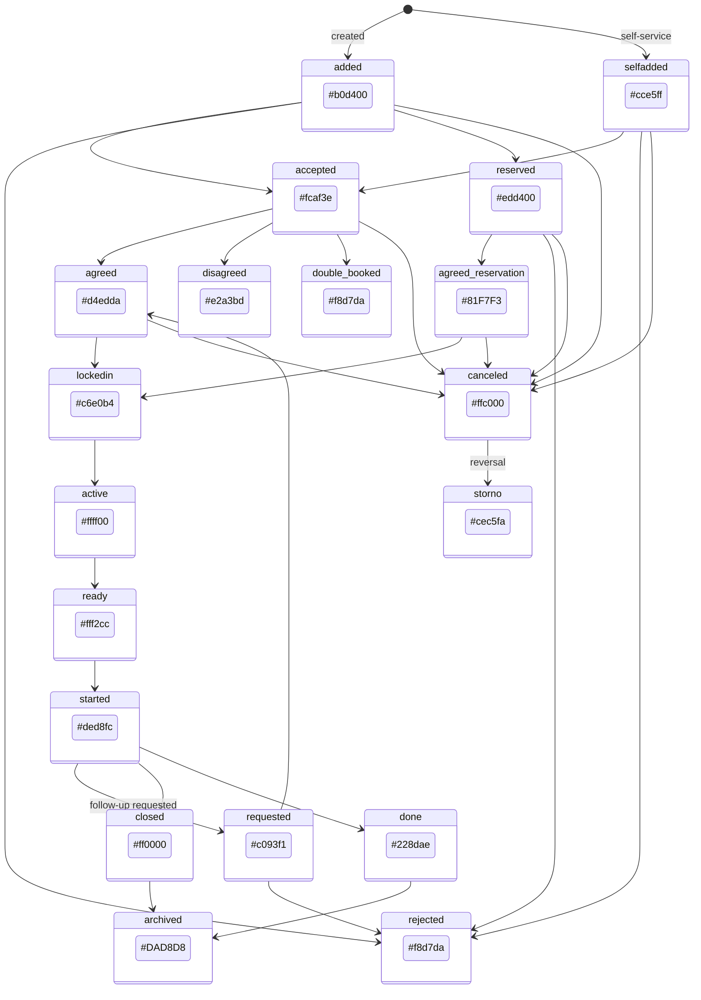
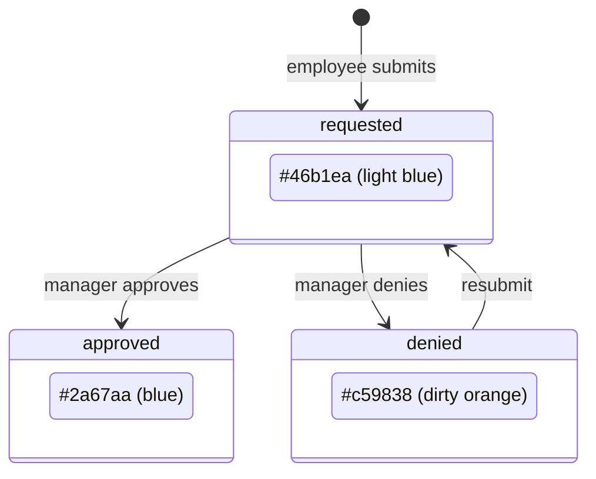

---
---

# Calendar View

---

## Cross-References

### Source Includes

| Type | Direction | Detail | Linked Document | Condition / Context |
|------|-----------|--------|-----------------|---------------------|
| include | **Includes** | `{{> sendMessage}}` | [Notification Send Message](08-notifications/notification.md#cross-references) | Birthday event click opens send-message dialog |
| include | **Includes** | `{{> appointmentDetails}}` | [Appointment Details Scheduling](_shared-components/appointment-details-scheduling.md) | Appointment detail dialog (included but not wired from calendar) |
| include | **Includes** | `{{> actionDetailsView}}` | [Shift Dialog](shift-dialog.md) | Action details partial (included but handler commented out) |

### Service Calls

| Service | Method | Parameters | Dialog / Context |
|---------|--------|------------|------------------|
| `InfoService` | `getCalendar` | `[startStr, endStr]` | FullCalendar event fetching |

### Event Flows

| Type | Direction | Event | Linked Document | Condition |
|------|-----------|-------|-----------------|----------|
| event | **Incoming** | `sendUserMessage({ to, subject, message })` | [Notification Send Message](08-notifications/notification.md) | Receives BIRTHDAY click event, opens sendMessage dialog |
| event | **Outgoing** | `sendUserMessage({ to, subject, message })` | [Notification Send Message](08-notifications/notification.md) | BIRTHDAY calendar event click |

> **Include context:** `calendar.htmlm` includes three Mustache partials: `sendMessage` (for birthday flow), `appointmentDetails` (appointment detail dialog, not wired from calendar), and `actionDetailsView` (action request dialog, handler commented out). Only `sendMessage` is actively triggered.
>
> **Event chain:** BIRTHDAY event click -> `sendUserMessage()` -> [Notification Send Message](08-notifications/notification.md#cross-references)

---

## 1. Page Structure

### HTMLM Template Header (Included Templates)

| Template Slot          | Source File                                | Purpose                              |
|------------------------|--------------------------------------------|--------------------------------------|
| `actionDetailsView`   | `../dash/actionDetailsView.html`           | Action details dialog (unused now)   |
| `appointmentDetails`  | `../appointment/details.html`              | Appointment details dialog           |
| `sendMessage`         | `../notification/sendMessage.mustache`     | Send message dialog (birthday flow)  |

### Layout

```
┌──────────────────────────────────────────────┐
│  .card #calBorder                            │
│  ┌──────────────────────────────────────────┐│
│  │  #actionCalendar  (FullCalendar mount)   ││
│  │                                          ││
│  │  [timeGridWeek view]                     ││
│  │                                          ││
│  └──────────────────────────────────────────┘│
└──────────────────────────────────────────────┘
{{>sendMessage}}        ← modal dialog (hidden)
{{>appointmentDetails}} ← modal dialog (hidden)
```

### CSS Styling (`#calBorder`)

```css
#calBorder {
  margin: 20px;
  padding: 20px;
  background-color: white;
  border-radius: 4px;
}

.fc-event {
  cursor: pointer;
}

/* Responsive: <= 1000px */
@media all and (max-width: 1000px) {
  #calBorder {
    margin: 5px;
    padding: 5px;
  }
}
```

---

## 2. FullCalendar Configuration

| Property        | Value                                                         |
|-----------------|---------------------------------------------------------------|
| **Plugins**     | `dayGrid`, `timeGrid`, `interaction`, `bootstrap`             |
| **Theme**       | `bootstrap`                                                   |
| **Locale**      | `de` (German)                                                 |
| **Default View**| `timeGridWeek`                                                |
| **Header Left** | `timeGridWeek` button                                         |
| **Header Center**| `title` (current date range)                                 |
| **Header Right**| *(none)*                                                      |
| **Week Numbers**| `true`                                                        |
| **Height**      | `window.height - 40px` (dynamic)                              |
| **Events**      | `CalendarUtils.fetchData` (async function)                    |
| **eventClick**  | Type-based handler (see section 5)                            |
| **eventRender** | Prepends icon `<i>` from `extendedProps.icon` to `.fc-title`  |

### Data Fetching

```
CalendarUtils.fetchData(fetchInfo, callback, _failure)
  → Core.conn.execute("InfoService", "getCalendar", [startStr, endStr])
  → For each event:
      1. Set icon from CalendarUtils.states[type].icon
      2. Set backgroundColor from CalendarUtils.states[type][state.toLowerCase()]
      3. Set textColor via CalendarUtils.lightOrDark(backgroundColor)
  → callback(events)
```

**API call**: `InfoService.getCalendar(startStr, endStr)` returns array of event objects with at minimum: `type`, `state`, `title`, `start`, `end`, and type-specific extended props (`userId`, `displayName` for BIRTHDAY).

### Contrast Utility: `lightOrDark(color)`

Accepts HEX or RGB color string. Uses HSP (Highly Sensitive Perceived brightness) formula:

```
HSP = sqrt(0.299 * R^2 + 0.587 * G^2 + 0.114 * B^2)
```

- HSP > 127.5 → returns `#000` (dark text on light background)
- HSP <= 127.5 → returns `#fff` (white text on dark background)

---

## 3. Entity Types and State-to-Color Mappings

### 3.1 HOLIDAY

| State       | Color     | Hex       | Text Color |
|-------------|-----------|-----------|------------|
| `approved`  | Blue      | `#2a67aa` | `#fff`     |
| `requested` | Light blue| `#46b1ea` | `#000`     |
| `denied`    | Dirty orange | `#c59838` | `#fff`  |

**Icon**: `fas fa-island-tropical`

### 3.2 PUBLICHOLIDAY

| State       | Color     | Hex       | Text Color |
|-------------|-----------|-----------|------------|
| `approved`  | Blue      | `#2a67aa` | `#fff`     |

**Icon**: `fas fa-calendar-times`

### 3.3 BIRTHDAY

| State    | Color      | Hex       | Text Color |
|----------|------------|-----------|------------|
| `active` | Light blue | `#cce5ff` | `#000`     |

**Icon**: `fas fa-birthday-cake`

### 3.4 APPOINTMENT (18 states)

| State                | Color         | Hex       | Text Color | Description       |
|----------------------|---------------|-----------|------------|-------------------|
| `added`              | Light green   | `#b0d400` | `#000`     | Newly added       |
| `selfadded`          | Blue          | `#cce5ff` | `#000`     | Self-added        |
| `accepted`           | Orange        | `#fcaf3e` | `#000`     | Accepted          |
| `reserved`           | Yellow-orange | `#edd400` | `#000`     | Reserved          |
| `rejected`           | Light red     | `#f8d7da` | `#000`     | Rejected          |
| `double_booked`      | Light red     | `#f8d7da` | `#000`     | Double booked     |
| `agreed`             | Green         | `#d4edda` | `#000`     | Agreed            |
| `agreed_reservation` | Cyan          | `#81F7F3` | `#000`     | Agreed reservation|
| `disagreed`          | Pinkish red   | `#e2a3bd` | `#000`     | Disagreed         |
| `lockedin`           | Pale green    | `#c6e0b4` | `#000`     | Locked in         |
| `active`             | Yellow        | `#ffff00` | `#000`     | Active            |
| `ready`              | Light yellow  | `#fff2cc` | `#000`     | Ready             |
| `started`            | Light purple  | `#ded8fc` | `#000`     | Started           |
| `requested`          | Purple        | `#c093f1` | `#000`     | Requested         |
| `closed`             | Red           | `#ff0000` | `#fff`     | Closed            |
| `canceled`           | Amber         | `#ffc000` | `#000`     | Canceled          |
| `storno`             | Light lavender| `#cec5fa` | `#000`     | Storno (reversal) |
| `done`               | Teal          | `#228dae` | `#fff`     | Done              |
| `archived`           | Light grey    | `#DAD8D8` | `#000`     | Archived          |

**Icon**: `fas fa-hourglass`

### 3.5 SHIFT (18 states - identical colors to APPOINTMENT)

Same 18 states and colors as APPOINTMENT above.

**Icon**: `fas fa-business-time`

---

## 4. State Machine Diagrams

### 4.1 APPOINTMENT State Diagram



### 4.2 HOLIDAY State Diagram



---

## 5. Event Click Handlers

| Event Type   | Action                                                                     | Status    |
|--------------|----------------------------------------------------------------------------|-----------|
| `BIRTHDAY`   | Opens `sendUserMessage` dialog with pre-filled subject and message         | **Active** |
| `ACTION`     | *(Commented out)* Was: `ActionService.getActionAssignment` → open dialog   | Disabled  |
| `SHIFT`      | *(Commented out)* Was: redirect to `/shift.html#<id>`                      | Disabled  |
| `HOLIDAY`    | No action (empty `case` block)                                             | No-op     |
| `APPOINTMENT`| No explicit handler (falls through to default — no action)                 | Missing   |

### BIRTHDAY Click Flow

```
calendar eventClick
  └─ type === "BIRTHDAY"
       └─ sendUserMessage({
            to: { id: props.userId, displayName: props.displayName },
            subject: i18n.birthday_subject,
            message: i18n.birthday_message
          })
          └─ Opens sendMessage modal dialog
               - Recipient pre-filled with user
               - Subject pre-filled with birthday greeting
               - Message body pre-filled with birthday message
```

---

## 6. Dialog Navigation

```mermaid
flowchart LR
    CAL[Calendar View]
    SM[sendMessage Dialog]
    AD[appointmentDetails Dialog]

    CAL -->|BIRTHDAY click| SM
    CAL -.->|APPOINTMENT click<br>(not wired)| AD
    CAL -.->|ACTION click<br>(commented out)| ActionDlg[actionDetailsView Dialog]
```

**Included but not wired from calendar**:
- `appointmentDetails` template is included in the page but no calendar event type triggers it
- `actionDetailsView` template is included but the ACTION handler is commented out

---

## 7. Translation Keys

| i18n Key                | Source File              | Usage                                       |
|-------------------------|--------------------------|---------------------------------------------|
| `birthday.subject`      | `messages.i18n.js`       | Pre-filled subject for birthday message      |
| `birthday.message`      | `messages.i18n.js`       | Pre-filled body for birthday message         |

**i18n loading mechanism**:
```javascript
// messages.i18n.js
i18n.birthday_subject = "$[birthday.subject]";
i18n.birthday_message = "$[birthday.message]";
```

The `$[key]` syntax is a server-side template replacement — the actual translated strings are injected at page load.

---

## 8. Modern Implementation Notes

### Recommended FullCalendar Replacement

For the modern React/Shadcn UI, consider:

| Aspect                | Legacy                              | Modern Recommendation                          |
|-----------------------|-------------------------------------|------------------------------------------------|
| Calendar library      | FullCalendar v4 (jQuery)            | `@fullcalendar/react` v6 + plugins             |
| Plugins needed        | dayGrid, timeGrid, interaction      | `@fullcalendar/daygrid`, `@fullcalendar/timegrid`, `@fullcalendar/interaction` |
| Theme                 | Bootstrap theme plugin              | Tailwind CSS custom styling (no theme plugin)   |
| Locale                | Hardcoded `de`                      | Dynamic from user locale / i18next              |
| Data fetching         | Custom `fetchData` + jQuery AJAX    | TanStack Query + oRPC `getCalendar` procedure   |
| Event rendering       | `eventRender` callback (v4)         | `eventContent` render prop (v6) with Lucide icons |
| Dialogs               | jQuery modal includes               | Shadcn `Dialog`/`Drawer` components             |
| Contrast calculation  | Custom `lightOrDark` function       | Keep utility, or use Tailwind `prose` classes   |

### State Color Mapping Strategy

The 18 appointment/shift states map to a fixed palette. In the modern UI:
1. Define a `STATUS_COLORS` constant mapping state names to Tailwind CSS custom properties or hex values
2. Use the same `lightOrDark` HSP algorithm for accessible text contrast
3. Apply via `style={{ backgroundColor, color }}` on calendar event elements
4. Consider mapping to Shadcn Badge variants for non-calendar contexts

### API Endpoint to Implement

```
oRPC: calendar.getEvents({ startDate: string, endDate: string })
  → Returns: Array<{
      id: string
      title: string
      start: string (ISO)
      end: string (ISO)
      type: "HOLIDAY" | "PUBLICHOLIDAY" | "BIRTHDAY" | "APPOINTMENT" | "SHIFT"
      state: string
      userId?: string       // for BIRTHDAY
      displayName?: string  // for BIRTHDAY
    }>
```
