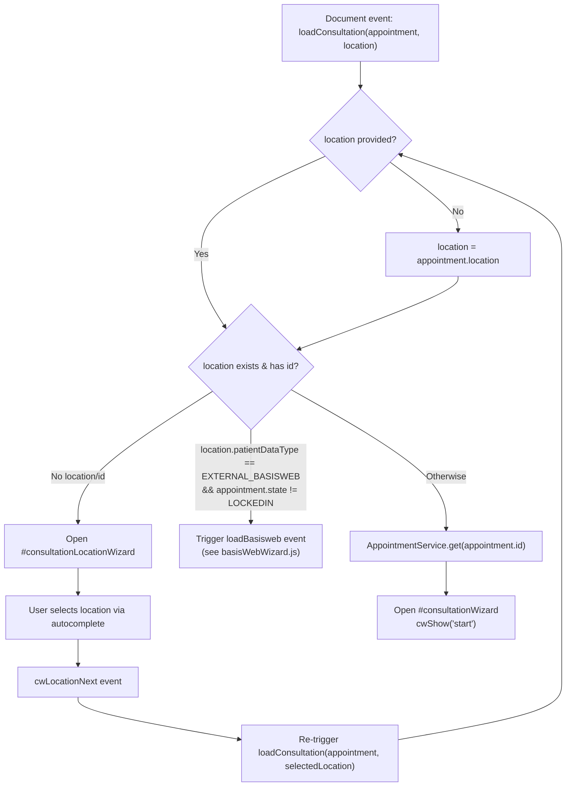
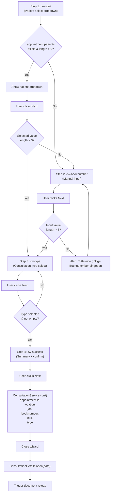

# Consultation Wizard — Legacy UI Analysis

---

## Cross-References

### Event Flows

| Type | Direction | Event | Linked Document | Condition |
|------|-----------|-------|-----------------|----------|
| event | **Incoming** | `loadConsultation` | [Dashboard Main](01-dashboard/dashboard-main.md#block-active-appointments-card) | Triggered by `newPatient` / `startBasisWeb` button |
| event | **Outgoing** | `loadBasisweb` | [BasisWeb Wizard](_interfaces/basisweb-wizard.md#invocation) | `location.patientDataType == "EXTERNAL_BASISWEB"` && `appointment.state != "LOCKEDIN"` |
| event | **Outgoing** | `ConsultationDetails.open()` | [Consultation Details JS](../consultation/consultation-details-js.md#2-dialog-lifecycle) | After `ConsultationService.start` succeeds (step 4 cw-success) |

> **Event chains:**
> - [Dashboard Main](01-dashboard/dashboard-main.md) → `loadConsultation` → **this file** → `loadBasisweb` → [BasisWeb Wizard](_interfaces/basisweb-wizard.md)
> - [Dashboard Main](01-dashboard/dashboard-main.md) → `loadConsultation` → **this file** → `ConsultationDetails.open()` → [Consultation Details JS](../consultation/consultation-details-js.md)

---

## 1. Dialog Inventory

| Dialog ID | Title (i18n) | Width | Icon | Color | CRUD Buttons | Target |
|---|---|---|---|---|---|---|
| `#consultationWizard` | `consultationWizard.start` | 600 | `fa fa-file-medical-alt` | `bg-color-basisWebData` | No | modal |
| `#consultationLocationWizard` | `consultationWizard.start` | 600 | `fa fa-file-medical-alt` | `bg-color-basisWebData` | No | modal |

---

## 2. Dialog Navigation Diagram

---

## 3. Consultation Wizard Step Flow

---

## 4. Wizard Steps Table

| # | Step ID | Heading (i18n key) | Purpose | Next Destination |
|---|---|---|---|---|
| 1 | `cw-start` | `consultationWizard.enterBookNumber` | Select patient from appointment's patient list | If selection valid (>3 chars) -> `cw-type`; else -> `cw-booknumber` |
| 2 | `cw-booknumber` | `consultationWizard.enterBookNumber` | Manual book number input with dynamic mask | If valid (>3 chars) -> `cw-type`; else alert error |
| 3 | `cw-type` | `consultationWizard.typeselect` | Choose consultation type (filtered by job capabilities) | If type selected -> `cw-success` |
| 4 | `cw-success` | `consultationWizard.success` | Summary review; confirm and submit | Calls `ConsultationService.start`, closes wizard |

---

## 5. Step Details

### 5.1 Step 1: `cw-start` — Patient Selection

**Initialization logic (cwShow "start"):**
- If `appointment.patients` exists and has entries, populate `<select>` with patient options using `bookNumber` or `jNumber` as value/label.
- If no patients, skip directly to `cw-booknumber`.
- Special handling for `appointment.type == "COUNCIL" && appointment.jobSupport`: links patient selection to location auto-fill (disables location input when patient selected).

| Element | Type | CSS Class | name | Required | Notes |
|---|---|---|---|---|---|
| Patient dropdown | `<select>` | `form-select startUser mandatory` | `data.bookNumberSelect` | Yes | Dynamically populated from `appointment.patients[]`. Each option value is `bookNumber ?? jNumber`. |
| Help text | `
` | `text-base` | — | — | German: "Wenn die Buchnummer nicht in der Liste..." (If book number not in list, use Next to enter manually) |

**Click actions:**

| Button | Event | Logic |
|---|--- |---|
| Cancel | `cancel` | Closes dialog |
| Next | `bwwNext` | If selected value length > 3: store as `booknumber`, go to `cw-type`. Otherwise: go to `cw-booknumber`. |

### 5.2 Step 2: `cw-booknumber` — Manual Book Number

**Initialization logic (cwShow "booknumber"):**
- Clears input value.
- If `location.booknumberMask` exists and is not the literal string `"book number mask"`, applies jQuery `.mask()` with that pattern.
- Otherwise, removes any existing mask (`.unmask()`).

| Element | Type | CSS Class | name | Required | Notes |
|---|---|---|---|---|---|
| Book number input | `<input>` | `form-control startUser mandatory` | `data.booknumber` | Yes | Placeholder: `consultation.booknumber`. Dynamic input mask from `location.booknumberMask`. |
| Info text | `
` | `text-base` | — | — | Rendered from `consultationWizard.infoBooknumber` (HTML content: "Patient-Id, JVA: Booknumber, etc.") |

**Click actions:**

| Button | Event | Logic |
|---|---|---|
| Cancel | `cancel` | Closes dialog |
| Next | `bwwNext` | If input length > 3: store as `booknumber`, go to `cw-type`. Otherwise: alert validation error. |

### 5.3 Step 3: `cw-type` — Consultation Type

**Initialization logic (cwShow "type"):**
- Fetches full job object via `JobService.get(appointment.job.id)`.
- Shows all options initially, then hides options based on filtering rules (see section 6).
- Sets default value from `job.defaultConsultation`.

| Element | Type | CSS Class | name | Required | Notes |
|---|---|---|---|---|---|
| Type select | `<select>` | `form-select` | `data.consultationtype` | Yes (implicitly — empty value blocks Next) | Options: EXTERNAL, DOCUMENT, STANDARD, INCARCERATION, ONBOARDING, ONBOARDING_SHORT, TREATMENT |

**Consultation Type Options:**

| Value | i18n Key |
|---|---|
| *(empty)* | `---ConsultationType---` (placeholder) |
| `EXTERNAL` | `ConsultationType.EXTERNAL` |
| `DOCUMENT` | `ConsultationType.DOCUMENT` |
| `STANDARD` | `ConsultationType.STANDARD` |
| `INCARCERATION` | `ConsultationType.INCARCERATION` |
| `ONBOARDING` | `ConsultationType.ONBOARDING` |
| `ONBOARDING_SHORT` | `ConsultationType.ONBOARDING_SHORT` |
| `TREATMENT` | `ConsultationType.TREATMENT` |

**Click actions:**

| Button | Event | Logic |
|---|---|---|
| Cancel | `cancel` | Closes dialog |
| Next | `bwwNext` | If type selected (non-empty): store as `type`, go to `cw-success`. |

### 5.4 Step 4: `cw-success` — Summary & Confirm

**Initialization logic (cwShow "success"):**
- Fills the form using `jsForm("fill", data)` from the wizard's accumulated data object.

| Element | Type | CSS Class | name | Read-only | Content |
|---|---|---|---|---|---|
| Appointment | `` | `field` | `data.appointment.job.expertTitle` | Display only | Expert/job title |
| Location | `` | `field` | `data.location.name` | Display only | Location name |
| Book number | `` | `field` | `data.booknumber` | Display only | Entered/selected book number |
| Consultation type | `<select>` | `field` | `data.type` | Display (pre-selected) | Same options as cw-type, value set from stored `data.type` |

**Click actions:**

| Button | Event | Logic |
|---|---|---|
| Cancel | `cancel` | Closes dialog |
| Next | `bwwNext` | Calls `ConsultationService.start(appointment.id, location, job, booknumber, null, type)`. On success: closes wizard, opens `ConsultationDetails`, triggers document reload. |

---

## 6. Dynamic Type Filtering Logic

When `cw-type` step initializes, types are filtered based on the **job capabilities** and **location/appointment properties**:

| Consultation Type | Hidden When | Condition Source |
|---|---|---|
| `EXTERNAL` | `location.patientDataType !== "EXTERNAL"` | Location property |
| `STANDARD` | `!job.consultationStandard` | Job capability flag |
| `ONBOARDING` | `!job.consultationOnboarding` | Job capability flag |
| `ONBOARDING_SHORT` | `!job.consultationOnboardingShort` | Job capability flag |
| `DOCUMENT` | `!job.consultationDocument` | Job capability flag |
| `INCARCERATION` | `!job.consultationIncarceration` | Job capability flag |
| `TREATMENT` | `!appointment.treatmentId` | Appointment property (no linked treatment) |

**Default selection:** `job.defaultConsultation` (set on the Job entity).

---

## 7. Consultation Location Wizard (`#consultationLocationWizard`)

**When shown:** The location wizard opens when `loadConsultation` is triggered and the resolved location is falsy or has no `id`.

### Form Elements

| Element | Type | CSS Class | name | Required | Notes |
|---|---|---|---|---|---|
| Location autocomplete | `<input>` | `form-control object mandatory autoselect` | `data.location` | Yes | `data-service="LocationService"`, `data-method="autocomplete"`, `data-display="name"`. Placeholder: `location`. Icon: `far fa-compass`. |

### Click Actions

| Button | Event | Logic |
|---|---|---|
| Cancel | `cancel` | Closes dialog |
| Next | `cwLocationNext` | Reads selected location pojo from `#location` input data. Closes location wizard. Re-triggers `loadConsultation(appointment, selectedLocation)` to restart the flow with the chosen location. |

---

## 8. Buttonset (Both Dialogs)

| Button | CSS | Event | Position | Label |
|---|---|---|---|---|
| Cancel | `btn btn-secondary data` | `cancel` | 5 | `button.cancel` ("Cancel") |
| Next | `btn btn-primary default data` | `bwwNext` (consultation) / `cwLocationNext` (location) | 6 | `button.next` ("Next") + right-arrow icon |

FAB (floating action button) HTML for Next: `<i class='fa fa-angle-right'></i>`

---

## 9. Data Model / State

The wizard accumulates state on the `#consultationWizard` element's jQuery `.data()`:

| Property | Set By | Used In |
|---|---|---|
| `data.appointment` | `loadConsultation` event handler | All steps (display), final submit |
| `data.location` | `loadConsultation` event / location wizard | Booknumber mask, type filtering, final submit |
| `data.job` | `loadConsultation` event (`appointment.job`) | Type filtering, final submit |
| `data.booknumber` | Step 1 (select) or Step 2 (input) | Summary display, final submit |
| `data.type` | Step 3 (select) | Summary display, final submit |

**Cleanup:** `booknumber` and `type` are explicitly deleted at the start of each `loadConsultation` call to prevent stale state.

---

## 10. Service Calls

| Service | Method | When | Parameters | Response |
|---|---|---|---|---|
| `AppointmentService` | `get` | Before opening wizard (when location is valid, non-EXTERNAL_BASISWEB) | `[appointment.id]` | Full appointment object |
| `JobService` | `get` | `cw-type` step init | `appointment.job.id` | Job with capability flags |
| `LocationService` | `autocomplete` | Location wizard autocomplete input | User-typed query | Location objects (displayed by `name`) |
| `ConsultationService` | `start` | `cw-success` Next click | `[appointment.id, location, job, booknumber, null, type]` | Created consultation object |

---

## 11. Permissions & Access Control

No explicit permission checks are present in the wizard JS/HTML. Access is controlled upstream:

- The `loadConsultation` event is dispatched by appointment-level UI (e.g., clicking "Start consultation" on an appointment row/card).
- The **job capability flags** (`consultationStandard`, `consultationOnboarding`, etc.) act as implicit RBAC by controlling which consultation types a user (via their assigned job) can create.
- `location.patientDataType` determines the routing to either the consultation wizard or the BasisWeb wizard.

---

## 12. Special Behaviors

1. **COUNCIL appointment type:** When `appointment.type == "COUNCIL" && appointment.jobSupport`, selecting a patient in `cw-start` auto-fills and locks the location field from the patient's location data.

2. **EXTERNAL_BASISWEB routing:** If the resolved location has `patientDataType == "EXTERNAL_BASISWEB"` and the appointment is not in `LOCKEDIN` state, the flow bypasses the consultation wizard entirely and triggers `loadBasisweb` (handled by `basisWebWizard.js`).
   - **Trigger location:** `consultationWizard.js:213` — `$(document).trigger("loadBasisweb", [appointment, location])`

3. **Input mask:** The book number input mask is dynamic per location. The literal string `"book number mask"` is treated as "no mask" (likely a placeholder/default value in the database).

4. **Loader:** A global `showLoader(10)` / `hideLoader` is used during the final `ConsultationService.start` call.

---

## 13. Translation Keys

| Key | English | Context |
|---|---|---|
| `consultationWizard.start` | "Start Consultation" | Dialog title, Step 4 heading |
| `consultationWizard.enterBookNumber` | "Please enter the book-number of the patient:" | Steps 1 & 2 heading |
| `consultationWizard.typeselect` | "Choose the consultation type:" | Step 3 heading |
| `consultationWizard.success` | "Start Consultation" | Step 4 heading |
| `consultationWizard.enterLocation` | "Please select the location of the consultation:" | Location wizard heading |
| `consultationWizard.infoBooknumber` | "(HTML) Patient-Id, JVA: Booknumber, etc." | Step 2 info text |
| `consultation.booknumber` | "Book number" | Input placeholder |
| `ConsultationType` | "Consultation type" | Select placeholder prefix |
| `ConsultationType.EXTERNAL` | *(Consultation type label)* | Option label |
| `ConsultationType.DOCUMENT` | *(Consultation type label)* | Option label |
| `ConsultationType.STANDARD` | *(Consultation type label)* | Option label |
| `ConsultationType.INCARCERATION` | *(Consultation type label)* | Option label |
| `ConsultationType.ONBOARDING` | *(Consultation type label)* | Option label |
| `ConsultationType.ONBOARDING_SHORT` | *(Consultation type label)* | Option label |
| `ConsultationType.TREATMENT` | *(Consultation type label)* | Option label |
| `location` | "Location" | Summary label, autocomplete placeholder |
| `appointment` | "Appointment" | Summary label |
| `label.type` | *(Type label)* | Select title attribute |
| `button.cancel` | "Cancel" | Cancel button |
| `button.next` | "Next" | Next button |
