---
---

# Planning Domain — User Workflows

This document describes the user experience and decision flows for the Planning domain: Appointment lifecycle (MonthTable grid, detail dialog, state machine), Self-service dashboard (available actions, confirmations), Calendar view, Expert availability management, and supporting dialogs (shift, ad-hoc appointment, end shift). All diagrams represent the journey from the user's perspective, not internal system architecture.

---

## Area 1: Appointment Lifecycle — From Creation to Archive

### Context

The appointment lifecycle is the core flow in the Planning domain. A manager or admin creates appointments in the MonthTable calendar grid, assigns experts, manages state transitions, and ultimately archives completed appointments. The flow involves a 12-state machine with role-dependent actions and collision detection.

**Who uses it:** Managers and admins (planning role) who schedule and coordinate appointments, shifts, councils, and treatments.

**Entry point:** User navigates to the Appointment List page (MonthTable calendar grid).

**Exit points:** Appointment reaches ARCHIVED state, or is cancelled/storno'd.

---

### 1.1 Appointment Management — User Journey Flowchart

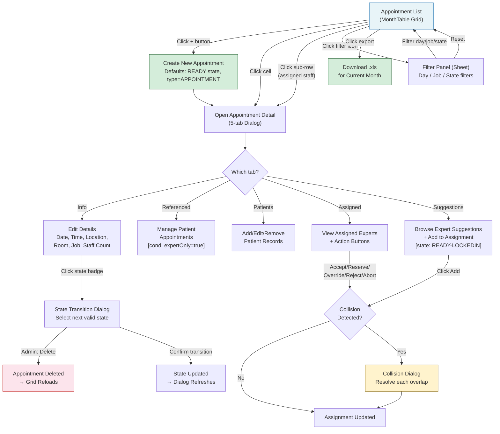
```mermaid
flowchart TD
    A["Appointment List<br>(MonthTable Grid)"] -->|"Click + button"| B["Create New Appointment<br>Defaults: READY state, type=APPOINTMENT"]
    A -->|"Click cell"| C["Open Appointment Detail<br>(5-tab Dialog)"]
    A -->|"Click sub-row<br>(assigned staff)"| C
    A -->|"Click filter icon"| D["Filter Panel (Sheet)<br>Day / Job / State filters"]
    A -->|"Click export"| E["Download .xls<br>for Current Month"]

    B --> C

    C --> F{"Which tab?"}
    F -->|"Info"| G["Edit Details<br>Date, Time, Location,<br>Room, Job, Staff Count"]
    F -->|"Referenced"| H["Manage Patient<br>Appointments<br>[cond: expertOnly=true]"]
    F -->|"Patients"| I["Add/Edit/Remove<br>Patient Records"]
    F -->|"Assigned"| J["View Assigned Experts<br>+ Action Buttons"]
    F -->|"Suggestions"| K["Browse Expert Suggestions<br>+ Add to Assignment<br>[state: READY-LOCKEDIN]"]

    J -->|"Accept/Reserve/<br>Override/Reject/Abort"| L{"Collision<br>Detected?"}
    L -->|"No"| M["Assignment Updated"]
    L -->|"Yes"| N["Collision Dialog<br>Resolve each overlap"]
    N --> M

    K -->|"Click Add"| L

    G -->|"Click state badge"| O["State Transition Dialog<br>Select next valid state"]
    O -->|"Admin: Delete"| P["Appointment Deleted<br>→ Grid Reloads"]
    O -->|"Confirm transition"| Q["State Updated<br>→ Dialog Refreshes"]

    D -->|"Filter day/job/state"| A
    D -->|"Reset"| A

    style A fill:#e8f4f8,stroke:#2c7bb6
    style B fill:#d4edda,stroke:#155724
    style N fill:#fff3cd,stroke:#856404
    style P fill:#fce4ec,stroke:#c62828
    style E fill:#d4edda,stroke:#155724
```

**Key observations:**

- The MonthTable is NOT a standard DataTables grid — it's a calendar with rows = days, columns = jobs, cells = colored appointments.
- Cell clicks, sub-row clicks, and the Add button all open the same 5-tab detail dialog.
- The Suggestions tab is only visible in early states (READY through LOCKEDIN).
- The Referenced tab is only visible when the "Expert Only" checkbox is checked.
- All assignment actions (accept, reserve, override, reject, abort) pass through collision detection.
- State transitions are constrained by `ShiftLogic.getValidState()` — the dialog only shows valid next states.

---

### 1.2 Appointment State Machine — State Diagram

This diagram shows all 12 appointment states and their valid transitions as experienced by the user through the state transition dialog.

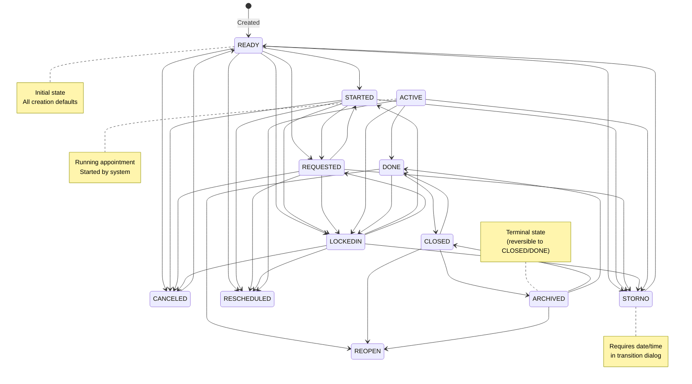
```mermaid
stateDiagram-v2
    [*] --> READY: Created

    READY --> STARTED
    READY --> REQUESTED
    READY --> LOCKEDIN
    READY --> CANCELED
    READY --> STORNO
    READY --> RESCHEDULED

    STARTED --> REQUESTED
    STARTED --> LOCKEDIN
    STARTED --> CANCELED
    STARTED --> STORNO
    STARTED --> RESCHEDULED

    REQUESTED --> STARTED
    REQUESTED --> LOCKEDIN
    REQUESTED --> CANCELED
    REQUESTED --> STORNO
    REQUESTED --> RESCHEDULED

    LOCKEDIN --> STARTED
    LOCKEDIN --> REQUESTED
    LOCKEDIN --> CANCELED
    LOCKEDIN --> STORNO
    LOCKEDIN --> RESCHEDULED

    ACTIVE --> DONE
    ACTIVE --> LOCKEDIN
    ACTIVE --> STORNO
    ACTIVE --> RESCHEDULED

    DONE --> CLOSED
    DONE --> LOCKEDIN
    DONE --> REOPEN

    CLOSED --> ARCHIVED
    CLOSED --> DONE
    CLOSED --> REOPEN

    ARCHIVED --> CLOSED
    ARCHIVED --> DONE
    ARCHIVED --> REOPEN

    CANCELED --> READY
    STORNO --> READY

    note right of READY: Initial state<br>All creation defaults
    note right of ACTIVE: Running appointment<br>Started by system
    note right of STORNO: Requires date/time<br>in transition dialog
    note left of ARCHIVED: Terminal state<br>(reversible to CLOSED/DONE)
```

**Key observations:**

- READY ↔ STARTED ↔ REQUESTED ↔ LOCKEDIN form a flexible pre-execution cluster.
- ACTIVE is the "running" state — forward-only to DONE/LOCKEDIN/STORNO/RESCHEDULED.
- DONE → CLOSED → ARCHIVED is the standard completion path.
- CANCELED and STORNO both allow returning to READY (re-activation).
- STORNO transition requires additional date/time fields in the dialog.
- Admin users see a Delete button in the state transition dialog (hidden for non-admins).

---

### 1.3 Appointment Detail — Sequence Diagram

This shows the user ↔ system interaction when opening and working with an appointment detail dialog.

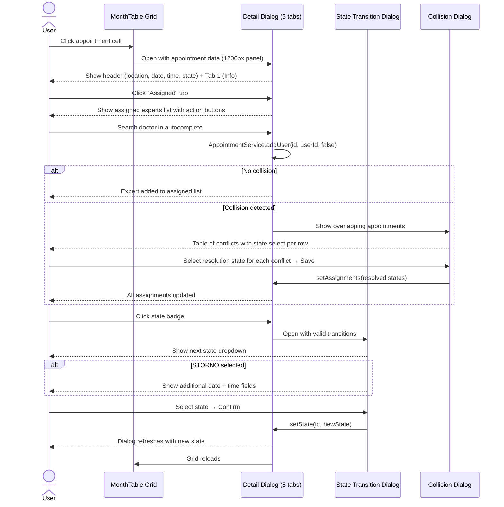
```mermaid
sequenceDiagram
    actor User
    participant Grid as MonthTable Grid
    participant Detail as Detail Dialog (5 tabs)
    participant StateDialog as State Transition Dialog
    participant CollisionDlg as Collision Dialog

    User->>Grid: Click appointment cell
    Grid->>Detail: Open with appointment data (1200px panel)
    Detail-->>User: Show header (location, date, time, state) + Tab 1 (Info)

    User->>Detail: Click "Assigned" tab
    Detail-->>User: Show assigned experts list with action buttons

    User->>Detail: Search doctor in autocomplete
    Detail->>Detail: AppointmentService.addUser(id, userId, false)

    alt No collision
        Detail-->>User: Expert added to assigned list
    else Collision detected
        Detail->>CollisionDlg: Show overlapping appointments
        CollisionDlg-->>User: Table of conflicts with state select per row
        User->>CollisionDlg: Select resolution state for each conflict → Save
        CollisionDlg->>Detail: setAssignments(resolved states)
        Detail-->>User: All assignments updated
    end

    User->>Detail: Click state badge
    Detail->>StateDialog: Open with valid transitions
    StateDialog-->>User: Show next state dropdown

    alt STORNO selected
        StateDialog-->>User: Show additional date + time fields
    end

    User->>StateDialog: Select state → Confirm
    StateDialog->>Detail: setState(id, newState)
    Detail-->>User: Dialog refreshes with new state
    Detail->>Grid: Grid reloads
```

---

### 1.4 Entity Type Decision — Type-Driven Visibility

This diagram shows how the appointment type affects what the user sees in the detail dialog.

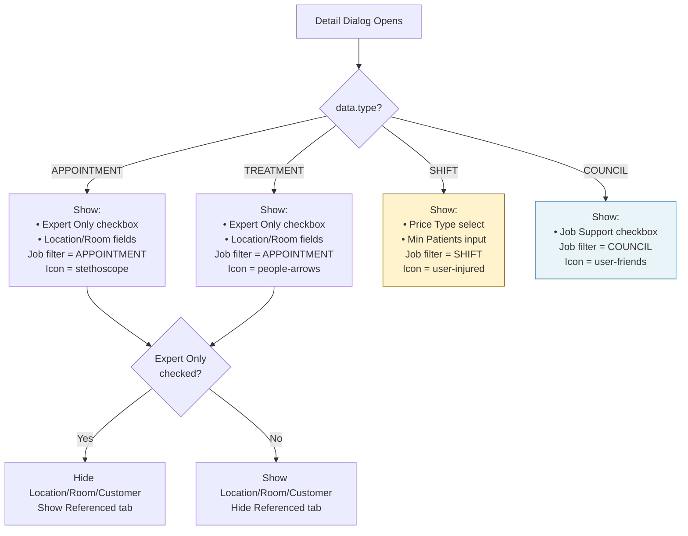
```mermaid
flowchart TD
    Open["Detail Dialog Opens"] --> TypeCheck{"data.type?"}

    TypeCheck -->|"APPOINTMENT"| AP["Show:<br>• Expert Only checkbox<br>• Location/Room fields<br>Job filter = APPOINTMENT<br>Icon = stethoscope"]
    TypeCheck -->|"TREATMENT"| TR["Show:<br>• Expert Only checkbox<br>• Location/Room fields<br>Job filter = APPOINTMENT<br>Icon = people-arrows"]
    TypeCheck -->|"SHIFT"| SH["Show:<br>• Price Type select<br>• Min Patients input<br>Job filter = SHIFT<br>Icon = user-injured"]
    TypeCheck -->|"COUNCIL"| CO["Show:<br>• Job Support checkbox<br>Job filter = COUNCIL<br>Icon = user-friends"]

    AP --> Expert{"Expert Only<br>checked?"}
    TR --> Expert

    Expert -->|"Yes"| HideLoc["Hide Location/Room/Customer<br>Show Referenced tab"]
    Expert -->|"No"| ShowLoc["Show Location/Room/Customer<br>Hide Referenced tab"]

    style SH fill:#fff3cd,stroke:#856404
    style CO fill:#e8f4f8,stroke:#2c7bb6
```

---

## Area 2: Self-Service Dashboard — Expert's View

### Context

Standard users (non-admin) with the `SELF_ASSIGNMENT` permission see a self-service dashboard. From here they can browse available actions, view their upcoming schedule, manage treatments, confirm/decline queued appointments, and cancel pending requests.

**Who uses it:** Clinical staff (doctors/therapists/experts) who self-manage their schedule.

**Entry point:** User logs in and views the main dashboard (standard role + SELF_ASSIGNMENT permission).

**Exit points:** Actions result in page reload with updated lists; treatment clicks open consultation detail views.

---

### 2.1 Self-Service Dashboard — User Journey Flowchart

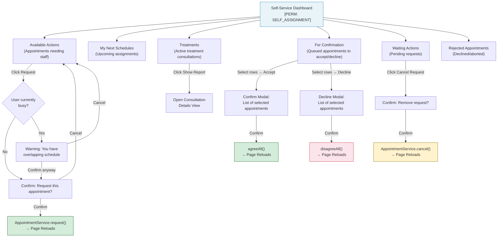
```mermaid
flowchart TD
    DASH["Self-Service Dashboard<br>[PERM: SELF_ASSIGNMENT]"]

    DASH --> A["Available Actions<br>(Appointments needing staff)"]
    DASH --> B["My Next Schedules<br>(Upcoming assignments)"]
    DASH --> C["Treatments<br>(Active treatment consultations)"]
    DASH --> D["For Confirmation<br>(Queued appointments to accept/decline)"]
    DASH --> E["Waiting Actions<br>(Pending requests)"]
    DASH --> F["Rejected Appointments<br>(Declined/aborted)"]

    A -->|"Click Request"| G{"User currently<br>busy?"}
    G -->|"No"| H["Confirm: Request this appointment?"]
    G -->|"Yes"| I["Warning: You have<br>overlapping schedule"]
    I -->|"Confirm anyway"| H
    I -->|"Cancel"| A
    H -->|"Confirm"| J["AppointmentService.request()<br>→ Page Reloads"]
    H -->|"Cancel"| A

    C -->|"Click Show Report"| K["Open Consultation<br>Details View"]

    D -->|"Select rows → Accept"| L["Confirm Modal:<br>List of selected appointments"]
    L -->|"Confirm"| M["agreeAll()<br>→ Page Reloads"]
    D -->|"Select rows → Decline"| N["Decline Modal:<br>List of selected appointments"]
    N -->|"Confirm"| O["disagreeAll()<br>→ Page Reloads"]

    E -->|"Click Cancel Request"| P["Confirm: Remove request?"]
    P -->|"Confirm"| Q["AppointmentService.cancel()<br>→ Page Reloads"]

    style DASH fill:#e8f4f8,stroke:#2c7bb6
    style J fill:#d4edda,stroke:#155724
    style M fill:#d4edda,stroke:#155724
    style O fill:#fce4ec,stroke:#c62828
    style Q fill:#fff3cd,stroke:#856404
```

**Key observations:**

- Available Actions check for scheduling conflicts before allowing requests (busy check).
- Confirmation and Decline modals support bulk operations on multiple selected appointments.
- The Treatments section links to the consultation detail view (crosses into Treatment domain).
- Rejected appointments are display-only (no user actions).
- All successful actions trigger a full page reload.

---

## Area 3: Calendar View — Weekly Event Overview

### Context

The calendar view provides a visual weekly overview of all scheduled events across entity types. It serves as a read-only navigation hub — users can see holidays, birthdays, appointments, and shifts at a glance, with click handlers for birthday greetings.

**Who uses it:** All authenticated users viewing their weekly schedule or team calendar.

**Entry point:** User navigates to the Calendar view from the dashboard or sidebar.

**Exit points:** Birthday click opens message compose; other event types have no click action in legacy.

---

### 3.1 Calendar View — User Journey Flowchart

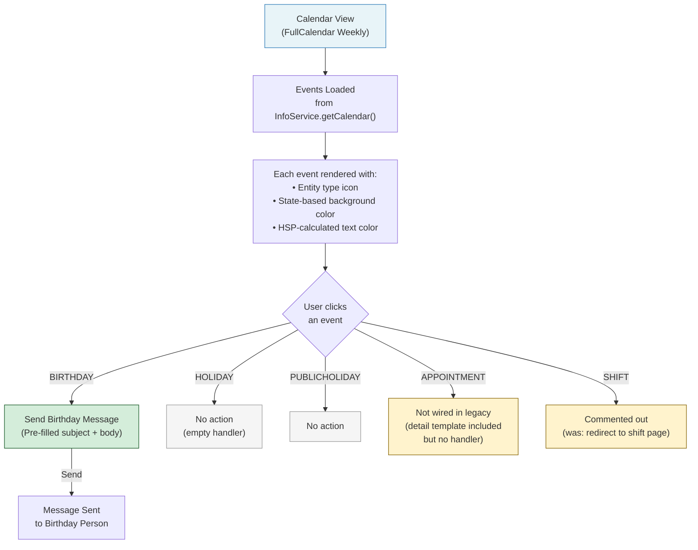
```mermaid
flowchart TD
    CAL["Calendar View<br>(FullCalendar Weekly)"]

    CAL --> EVENTS["Events Loaded<br>from InfoService.getCalendar()"]

    EVENTS --> RENDER["Each event rendered with:<br>• Entity type icon<br>• State-based background color<br>• HSP-calculated text color"]

    RENDER --> CLICK{"User clicks<br>an event"}

    CLICK -->|"BIRTHDAY"| MSG["Send Birthday Message<br>(Pre-filled subject + body)"]
    CLICK -->|"HOLIDAY"| NOOP1["No action<br>(empty handler)"]
    CLICK -->|"PUBLICHOLIDAY"| NOOP2["No action"]
    CLICK -->|"APPOINTMENT"| NOOP3["Not wired in legacy<br>(detail template included<br>but no handler)"]
    CLICK -->|"SHIFT"| NOOP4["Commented out<br>(was: redirect to shift page)"]

    MSG -->|"Send"| SENT["Message Sent<br>to Birthday Person"]

    style CAL fill:#e8f4f8,stroke:#2c7bb6
    style MSG fill:#d4edda,stroke:#155724
    style NOOP1 fill:#f5f5f5,stroke:#999
    style NOOP2 fill:#f5f5f5,stroke:#999
    style NOOP3 fill:#fff3cd,stroke:#856404
    style NOOP4 fill:#fff3cd,stroke:#856404
```

### 3.2 Calendar Event Color Reference

| Entity Type | Icon | State | Color | Text |
|:---|:---|:---|:---|:---|
| HOLIDAY | island-tropical | approved | #2a67aa | white |
| HOLIDAY | island-tropical | requested | #46b1ea | black |
| HOLIDAY | island-tropical | denied | #c59838 | white |
| PUBLICHOLIDAY | calendar-times | approved | #2a67aa | white |
| BIRTHDAY | birthday-cake | active | #cce5ff | black |
| APPOINTMENT | hourglass | ready | #fff2cc | black |
| APPOINTMENT | hourglass | active | #ffff00 | black |
| APPOINTMENT | hourglass | done | #228dae | white |
| APPOINTMENT | hourglass | closed | #ff0000 | white |
| SHIFT | business-time | (same 18 states as APPOINTMENT) | (same colors) | (HSP) |

---

## Area 4: Expert Availability Management — Week & Month Grids

### Context

Experts manage their availability through two complementary grids: a **week grid** (hours × days) for fine-grained hourly availability, and a **month grid** (days × slots) for shift/appointment slot preferences. Both use a tri-state toggle interaction (unset → available → unavailable) with bulk toggle shortcuts.

**Who uses it:** Experts (doctors, therapists) managing their own availability schedule.

**Entry point:** User navigates to Week View or Month View from the dashboard.

**Exit points:** Save persists availability; Holiday dialog submits absence request.

---

### 4.1 Expert Availability — State Diagram (Tri-State Cycle)

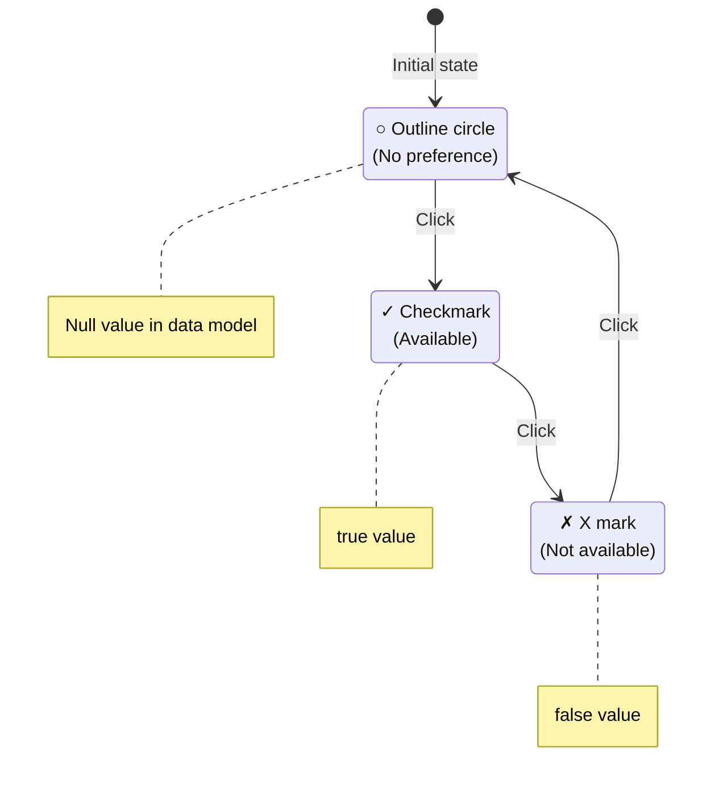
```mermaid
stateDiagram-v2
    [*] --> Unset: Initial state

    Unset: ○ Outline circle<br>(No preference)
    Available: ✓ Checkmark<br>(Available)
    Unavailable: ✗ X mark<br>(Not available)

    Unset --> Available: Click
    Available --> Unavailable: Click
    Unavailable --> Unset: Click

    note right of Unset: Null value in data model
    note right of Available: true value
    note right of Unavailable: false value
```

### 4.2 Week View — Sequence Diagram

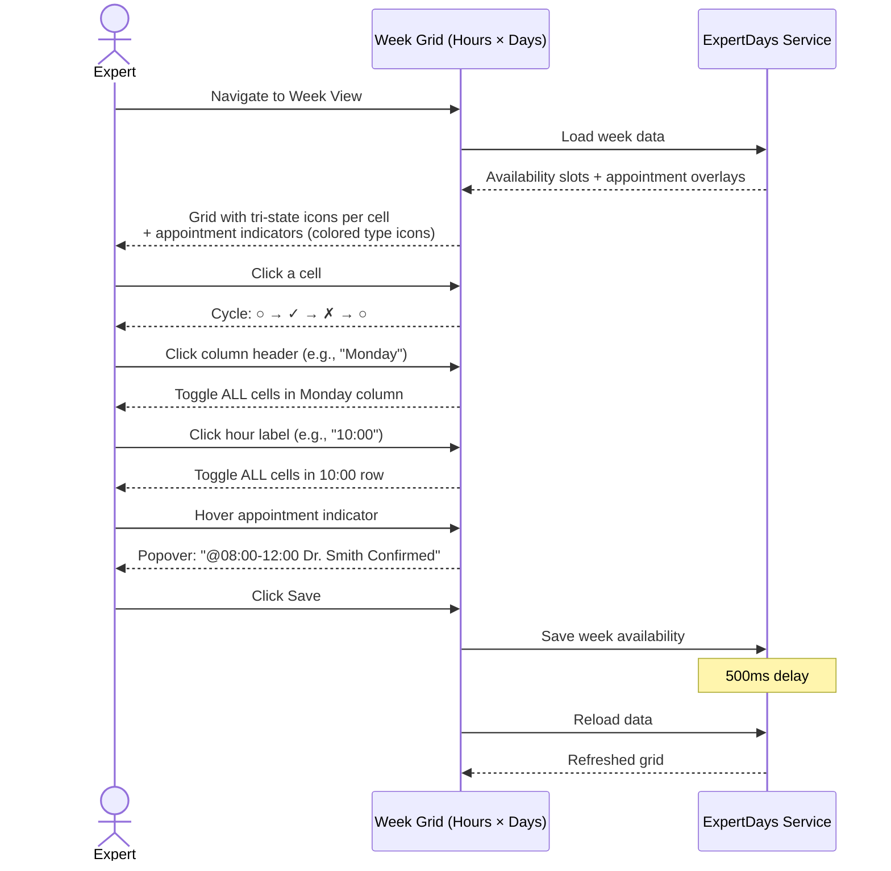
```mermaid
sequenceDiagram
    actor Expert
    participant WeekGrid as Week Grid (Hours × Days)
    participant Server as ExpertDays Service

    Expert->>WeekGrid: Navigate to Week View
    WeekGrid->>Server: Load week data
    Server-->>WeekGrid: Availability slots + appointment overlays

    WeekGrid-->>Expert: Grid with tri-state icons per cell<br>+ appointment indicators (colored type icons)

    Expert->>WeekGrid: Click a cell
    WeekGrid-->>Expert: Cycle: ○ → ✓ → ✗ → ○

    Expert->>WeekGrid: Click column header (e.g., "Monday")
    WeekGrid-->>Expert: Toggle ALL cells in Monday column

    Expert->>WeekGrid: Click hour label (e.g., "10:00")
    WeekGrid-->>Expert: Toggle ALL cells in 10:00 row

    Expert->>WeekGrid: Hover appointment indicator
    WeekGrid-->>Expert: Popover: "@08:00-12:00 Dr. Smith Confirmed"

    Expert->>WeekGrid: Click Save
    WeekGrid->>Server: Save week availability
    Note over Server: 500ms delay
    WeekGrid->>Server: Reload data
    Server-->>WeekGrid: Refreshed grid
```

### 4.3 Month View — Sequence Diagram

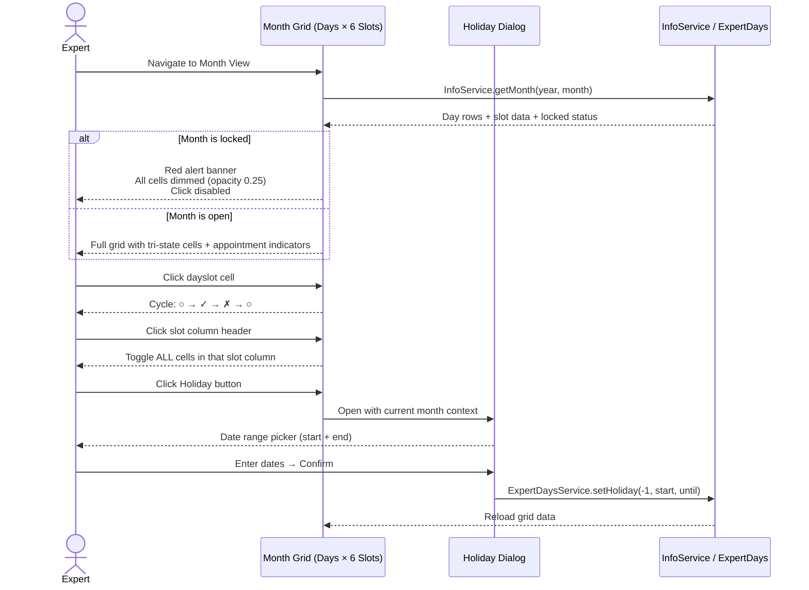
```mermaid
sequenceDiagram
    actor Expert
    participant MonthGrid as Month Grid (Days × 6 Slots)
    participant HolidayDlg as Holiday Dialog
    participant Server as InfoService / ExpertDays

    Expert->>MonthGrid: Navigate to Month View
    MonthGrid->>Server: InfoService.getMonth(year, month)
    Server-->>MonthGrid: Day rows + slot data + locked status

    alt Month is locked
        MonthGrid-->>Expert: Red alert banner<br>All cells dimmed (opacity 0.25)<br>Click disabled
    else Month is open
        MonthGrid-->>Expert: Full grid with tri-state cells + appointment indicators
    end

    Expert->>MonthGrid: Click dayslot cell
    MonthGrid-->>Expert: Cycle: ○ → ✓ → ✗ → ○

    Expert->>MonthGrid: Click slot column header
    MonthGrid-->>Expert: Toggle ALL cells in that slot column

    Expert->>MonthGrid: Click Holiday button
    MonthGrid->>HolidayDlg: Open with current month context
    HolidayDlg-->>Expert: Date range picker (start + end)

    Expert->>HolidayDlg: Enter dates → Confirm
    HolidayDlg->>Server: ExpertDaysService.setHoliday(-1, start, until)
    Server-->>MonthGrid: Reload grid data
```

---

### 4.4 Month Grid Header Structure

```
┌─────────────────┬─────────────┬──────────────────────┬──────────────────────────┐
│ [Year: 2022]    │             │      Shift           │      Appointment         │
│ [Month: March▼] │             │ Morning│Aftern│Night │ Morning│Aftern│Treatment │
├─────────────────┼─────────────┼────────┼──────┼──────┼────────┼──────┼──────────┤
│ Max services    │ Weekday     │ 3/10   │ 2/8  │ 1/5  │  4/12  │ 3/10 │          │
│ (rowspan)       │ Weekend     │ 1/4    │ 1/3  │ 0/2  │  Max before/after        │
├─────────────────┼─────────────┼────────┼──────┼──────┼────────┼──────┼──────────┤
│ 1               │ Monday      │ ○      │ ✓    │ ✗    │ ✓  👨‍⚕️  │ ○    │ ✓        │
│ 2               │ Tuesday     │ ✓      │ ✓    │ ○    │ ○      │ ✓    │ ○        │
│ ...             │ ...         │ ...    │ ...  │ ...  │ ...    │ ...  │ ...      │
└─────────────────┴─────────────┴────────┴──────┴──────┴────────┴──────┴──────────┘
```

---

## Area 5: Shift Detail & Request Action

### Context

When an expert views a shift from their schedule, they see a shift detail dialog with the shift's location on a map and a table of available actions (time slots they can request). Each action can be requested, which triggers a review workflow.

**Who uses it:** Experts viewing their shift assignments and requesting specific action slots.

**Entry point:** Click on a shift from My Next Schedules or other shift listings.

**Exit points:** Action request submitted → confirmation message; or dialog closed without action.

---

### 5.1 Shift & Request Action — Sequence Diagram

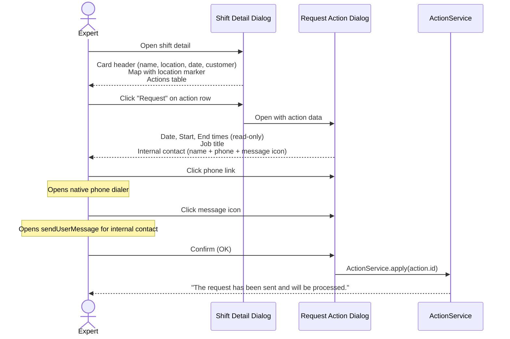
```mermaid
sequenceDiagram
    actor Expert
    participant ShiftDlg as Shift Detail Dialog
    participant RequestDlg as Request Action Dialog
    participant Server as ActionService

    Expert->>ShiftDlg: Open shift detail
    ShiftDlg-->>Expert: Card header (name, location, date, customer)<br>Map with location marker<br>Actions table

    Expert->>ShiftDlg: Click "Request" on action row
    ShiftDlg->>RequestDlg: Open with action data

    RequestDlg-->>Expert: Date, Start, End times (read-only)<br>Job title<br>Internal contact (name + phone + message icon)

    Expert->>RequestDlg: Click phone link
    Note over Expert: Opens native phone dialer

    Expert->>RequestDlg: Click message icon
    Note over Expert: Opens sendUserMessage for internal contact

    Expert->>RequestDlg: Confirm (OK)
    RequestDlg->>Server: ActionService.apply(action.id)
    Server-->>Expert: "The request has been sent and will be processed."
```

---

## Area 6: Ad-Hoc Appointment & End Shift

### Context

Two quick-action dialogs support ad-hoc workflow needs: creating unplanned appointments (permission-gated) and ending active shifts (adjusting times).

**Who uses it:**
- Ad-hoc appointment: Admin/managers with `APPOINTMENT_ADHOC` permission
- End shift: Any user with an active shift

---

### 6.1 Ad-Hoc Appointment — Flowchart

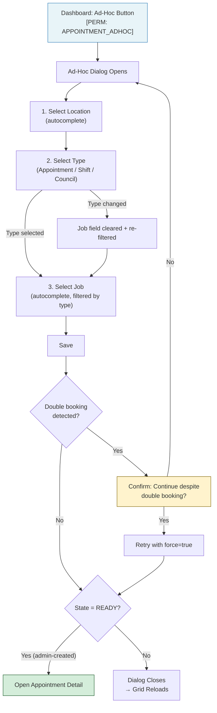
```mermaid
flowchart TD
    BTN["Dashboard: Ad-Hoc Button<br>[PERM: APPOINTMENT_ADHOC]"] --> DLG["Ad-Hoc Dialog Opens"]

    DLG --> LOC["1. Select Location<br>(autocomplete)"]
    LOC --> TYPE["2. Select Type<br>(Appointment / Shift / Council)"]
    TYPE -->|"Type selected"| JOB["3. Select Job<br>(autocomplete, filtered by type)"]
    TYPE -->|"Type changed"| RESET["Job field cleared + re-filtered"]
    RESET --> JOB

    JOB --> SAVE["Save"]
    SAVE --> CHECK{"Double booking<br>detected?"}

    CHECK -->|"No"| SUCCESS{"State = READY?"}
    CHECK -->|"Yes"| CONFIRM["Confirm: Continue despite<br>double booking?"]

    CONFIRM -->|"Yes"| FORCE["Retry with force=true"]
    CONFIRM -->|"No"| DLG

    FORCE --> SUCCESS

    SUCCESS -->|"Yes (admin-created)"| DETAIL["Open Appointment Detail"]
    SUCCESS -->|"No"| DONE["Dialog Closes<br>→ Grid Reloads"]

    style BTN fill:#e8f4f8,stroke:#2c7bb6
    style CONFIRM fill:#fff3cd,stroke:#856404
    style DETAIL fill:#d4edda,stroke:#155724
```

### 6.2 End Shift — Flowchart

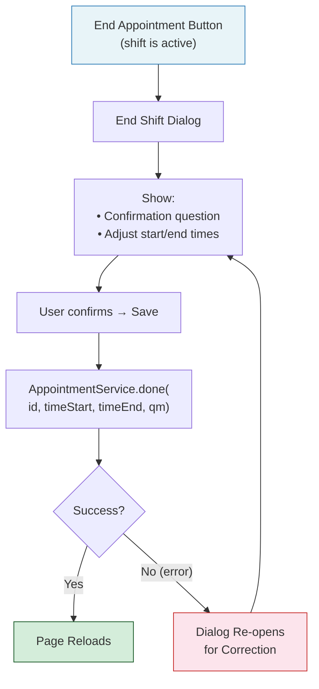
```mermaid
flowchart TD
    BTN["End Appointment Button<br>(shift is active)"] --> DLG["End Shift Dialog"]

    DLG --> SHOW["Show:<br>• Confirmation question<br>• Adjust start/end times"]

    SHOW --> SAVE["User confirms → Save"]
    SAVE --> API["AppointmentService.done(<br>id, timeStart, timeEnd, qm)"]

    API --> CHECK{"Success?"}
    CHECK -->|"Yes"| RELOAD["Page Reloads"]
    CHECK -->|"No (error)"| REOPEN["Dialog Re-opens<br>for Correction"]
    REOPEN --> SHOW

    style BTN fill:#e8f4f8,stroke:#2c7bb6
    style RELOAD fill:#d4edda,stroke:#155724
    style REOPEN fill:#fce4ec,stroke:#c62828
```

---

## Interdependencies Summary

This table lists the key factors that influence the user's experience across the Planning domain.

| Factor | Affects | How |
|:---|:---|:---|
| **User role** (admin vs standard) | Dashboard layout, state transition dialog (delete button), ad-hoc button visibility | Admin sees appointment management tools; standard sees self-service dashboard |
| **SELF_ASSIGNMENT permission** | Self-service dashboard visibility | Entire self-service section hidden without this permission |
| **APPOINTMENT_ADHOC permission** | Ad-hoc appointment button | Button hidden without permission |
| **Appointment type** (APPOINTMENT/SHIFT/COUNCIL/TREATMENT) | Detail dialog fields, icon, title, job filter | Each type shows different field sets and filters |
| **Appointment state** (12 states) | Valid transitions, tab visibility, action buttons, cell colors | State machine constrains what actions user can take |
| **Assignment state** (12 states) | Action buttons enabled/disabled per assignment row | Each state disables specific buttons |
| **expertOnly checkbox** | Referenced tab visibility, location/room field visibility | Toggles between location-bound and expert-only modes |
| **Month lock status** | Month grid editability | Locked months disable all tri-state toggles and show danger alert |
| **Entity type in calendar** | Event color, icon, click handler | BIRTHDAY → message; others → no action (legacy) |
| **Scheduling conflicts** (busy check / double booking) | Request and assignment flows | Busy/conflict → confirmation dialog → force retry option |
| **Price type** | Detail dialog (SHIFT only) | Auto-suggested from date + time (weekday/weekend × day/night) |

---

## Wireframe Screenshots

### Appointment Module

#### W1: Appointment List (MonthTable)

MonthTable calendar grid showing days × jobs with state-colored appointment cells, sub-rows for assigned staff, toolbar with month navigation and action buttons.


**Annotations:**
- **Grid Structure Note:** MonthTable: rows = days of month (1–31), columns = jobs/services. NOT standard DataTable.
- **Cell Rendering Note:** Each cell: state-colored + icon + name. Sub-rows: assigned staff. Missing staff shown as '--- (Missing)'.
- **Filter Panel Note:** @shadcn/sheet side='right': filterDay (number), filterJob (text), filterState (select), Reset button.
- **Actions Note:** Cell click → opens detail dialog. Add → creates READY appointment. Edit → disabled until selection. Export → .xls download. Reload → triggers reloadGrid.

#### W2: Appointment Details Dialog

5-tab detail dialog (Info, Referenced, Patients, Assigned, Suggestions) with type-driven field visibility, state badge, and form fields. SHIFT-only fields highlighted.


**Annotations:**
- **Tab Visibility Note:** Info=always, Referenced=[expertOnly=true], Patients=always, Assigned=always, Suggestions=[state: READY|STARTED|REOPENED|REQUESTED|LOCKEDIN].
- **Type Visibility Note:** APPOINTMENT/TREATMENT → expertOnly, location, room. SHIFT → priceType. COUNCIL → jobSupport. Job filter changes by type.
- **State Machine Note:** State transition dialog: valid next states from ShiftLogic. STORNO adds date+time. Admin sees Delete. 12 states total.
- **Assigned Tab Note:** Doctor autocomplete + delete. Per-row: Accept, Reserve, Override→AGREED, Reject, Abort, Send Reminder, History. Collision handling → W3 dialog.

#### W2a: Appointment Details — Tab 2: Referenced

Referenced (Patient Appointments) tab content panel. Visible only when Expert Only checkbox is checked (`expertOnly=true`). Toolbar with location autocomplete and delete button, table showing time range, location, book number, job code, and clickable state badge. Includes sub-dialog wireframe for editing referenced appointments.


**Annotations:**
- Tab visible only when expertOnly=true. State badge click → state transition. Edit → referenced appointment dialog.

#### W2b: Appointment Details — Tab 3: Patients

Patients tab content panel. Always visible. Add patient toolbar with book number input, patients table with title, documentation-only flag, closed date, location, edit/remove/sort actions. Treatments sub-table below. Includes Patient Data Dialog sub-dialog with attachments management.


**Annotations:**
- Always visible. Add patient: PatientDataService.save. Edit → patientDataDlg. Remove → confirm → delete.

#### W2c: Appointment Details — Tab 4: Assigned

Assigned (Expert Confirm) tab content panel. Always visible, toolbar only in READY–LOCKEDIN states. Doctor autocomplete + delete button toolbar. Table rows with avatar, role icon (support/main/doctor) + name + message icon, phone link, state badge, and 7 action buttons (Accept, Reserve, Override, Reject, Abort, Send Reminder, History) with state-dependent disable rules.


**Annotations:**
- Assignment state machine — button disable rules per state.
- Collision handling: addUser → if duplicate → confirm dialog.

#### W2d: Appointment Details — Tab 5: Suggestions

Suggestions (Add Expert) tab content panel. Visible only in states READY, STARTED, REOPENED, REQUESTED, LOCKEDIN. Text filter on firstName/lastName, table with avatar, role icon + name + preference icon (thumbs-up green if wantFlag=true), skills (comma-separated codes), phone link, and Add button that moves expert to Assigned tab.


**Annotations:**
- Tab visible in READY|STARTED|REOPENED|REQUESTED|LOCKEDIN states. getSuggestions(id, 20). Separate jsForm prefix.

#### W3: Assign User — Collision Dialog

Collision resolution modal shown when assigning a doctor with overlapping appointments. State select per row with Accept/Reserve/Override/Reject/Abort/Remove options.


**Annotations:**
- State select options: ACCEPTED, RESERVED, AGREED (Override), REJECTED, ABORTED, REMOVE. Shown when getDuplicateEvents > 1.

#### W4: State & Color Legend

Visual reference card showing all 13 appointment states and 12 assigned staff states with their icons, hex colors, and CSS class names.


### Planning Dashboard Dialogs

#### W3-dash: Calendar View

FullCalendar weekly view with sample events for HOLIDAY (blue), BIRTHDAY (light blue), APPOINTMENT (state-colored), and SHIFT (state-colored). Entity type legend at bottom.


**Annotations:**
- FullCalendar v6 timeGridWeek, 5 entity types, 18 state colors.

#### W4-dash: Expert Availability — Week Grid

Hours × 7 days grid with tri-state slots (circle=unset, check=available, X=unavailable). Toolbar with Save/Reload. Click column header toggles all in column.


**Annotations:**
- Week view (toggle columns/rows), Month view (4-row header, slot labels).

#### W4-dash: Expert Availability — Month Grid

Days × 6 slots grid with 4-row header (year/month, slot labels, weekday counters, weekend counters). Month lock alert banner. Holiday button for absence requests.


**Annotations:**
- Month lock: data.locked=true → red alert, cells dimmed.

#### W8: Shift Dialog — Detail

Shift detail with card header (name, location, date, customer), Leaflet map area (200px), and actions table with Request button per row.


#### W8: Shift Dialog — Request Action

Request action detail showing date/time (read-only), job title, and internal contact with message icon and phone link.


#### W10: Ad-Hoc Appointment

Permission-gated dialog (APPOINTMENT_ADHOC) with location autocomplete, type select (Appointment/Shift/Council), and job autocomplete filtered by type.


#### W13a: End Shift

Confirmation dialog for ending an active shift with adjustable start/end time inputs.


**Annotations:**
- Save callback: AppointmentService.done(). On error → re-opens.

---

## Area 7: Appointment Admin — Billing & Consultation Management

### Context

The Appointment Admin module is the most complex module in the planning domain, providing billing administration, inline consultation management, time verification, export workflows, QM questionnaire review, and CDR call assignment — all within a single grid view with a multi-section detail drawer.

**Who uses it:** Admin/billing staff responsible for verifying appointment times, managing consultations, generating invoices, and exporting billing data.

**Entry point:** User navigates to the Appointment Admin list (filtered grid with year/month/day toolbar).

**Exit points:** Exports downloaded, consultations transmitted, month closed/opened, billing calculations reviewed.

---

### 7.1 Appointment Admin — User Journey Flowchart

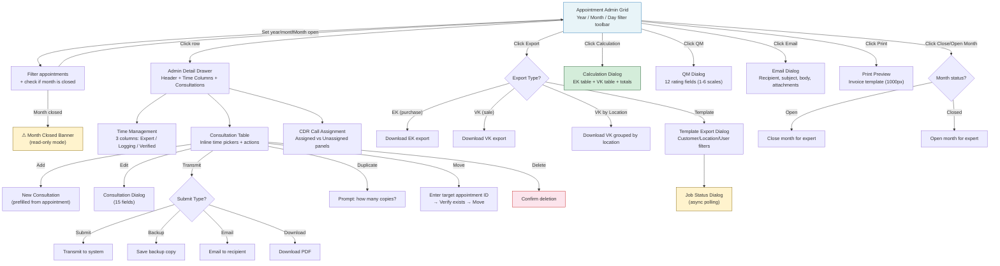
```mermaid
flowchart TD
    GRID["Appointment Admin Grid<br>Year / Month / Day filter toolbar"]

    GRID -->|"Set year/month/day"| FILTER["Filter appointments<br>+ check if month is closed"]
    FILTER -->|"Month closed"| BANNER["⚠ Month Closed Banner<br>(read-only mode)"]
    FILTER -->|"Month open"| GRID

    GRID -->|"Click row"| DETAIL["Admin Detail Drawer<br>Header + Time Columns + Consultations"]

    DETAIL --> TIMES["Time Management<br>3 columns: Expert / Logging / Verified"]
    DETAIL --> CONSULT["Consultation Table<br>Inline time pickers + actions"]
    DETAIL --> CDR["CDR Call Assignment<br>Assigned vs Unassigned panels"]

    CONSULT -->|"Add"| ADD_C["New Consultation<br>(prefilled from appointment)"]
    CONSULT -->|"Edit"| EDIT_C["Consultation Dialog<br>(15 fields)"]
    CONSULT -->|"Transmit"| SUBMIT{"Submit Type?"}
    SUBMIT -->|"Submit"| TX_SUBMIT["Transmit to system"]
    SUBMIT -->|"Backup"| TX_BACKUP["Save backup copy"]
    SUBMIT -->|"Email"| TX_EMAIL["Email to recipient"]
    SUBMIT -->|"Download"| TX_DL["Download PDF"]

    CONSULT -->|"Duplicate"| DUP["Prompt: how many copies?"]
    CONSULT -->|"Move"| MOVE["Enter target appointment ID<br>→ Verify exists → Move"]
    CONSULT -->|"Delete"| DEL_C["Confirm deletion"]

    GRID -->|"Click Export"| EXP{"Export Type?"}
    EXP -->|"EK (purchase)"| EK["Download EK export"]
    EXP -->|"VK (sale)"| VK["Download VK export"]
    EXP -->|"VK by Location"| VK_LOC["Download VK grouped by location"]
    EXP -->|"Template"| TPL["Template Export Dialog<br>Customer/Location/User filters"]
    TPL --> JOB["Job Status Dialog<br>(async polling)"]

    GRID -->|"Click Calculation"| CALC["Calculation Dialog<br>EK table + VK table + totals"]
    GRID -->|"Click QM"| QM["QM Dialog<br>12 rating fields (1-6 scales)"]
    GRID -->|"Click Email"| EMAIL["Email Dialog<br>Recipient, subject, body, attachments"]
    GRID -->|"Click Print"| PRINT["Print Preview<br>Invoice template (1000px)"]
    GRID -->|"Click Close/Open Month"| MONTH{"Month status?"}
    MONTH -->|"Open"| CLOSE["Close month for expert"]
    MONTH -->|"Closed"| OPEN["Open month for expert"]

    style GRID fill:#e8f4f8,stroke:#2c7bb6
    style BANNER fill:#fff3cd,stroke:#856404
    style CALC fill:#d4edda,stroke:#155724
    style JOB fill:#fff3cd,stroke:#856404
    style DEL_C fill:#fce4ec,stroke:#c62828
```

**Key observations:**

- The grid is NOT a MonthTable — it is a standard filterable table with year/month/day toolbar.
- Month closed status displays a read-only banner; editing is blocked for closed months.
- Consultation operations (add, edit, duplicate, move, transmit, delete) are the primary workflow.
- Template export is the only async export (uses Job Status polling dialog); EK/VK are synchronous downloads.
- CDR call assignment has a two-panel layout (assigned left, unassigned right).
- QM dialog is view-only (no editing — ratings come from the questionnaire module).

---

### 7.2 Appointment Admin Detail — Sequence Diagram

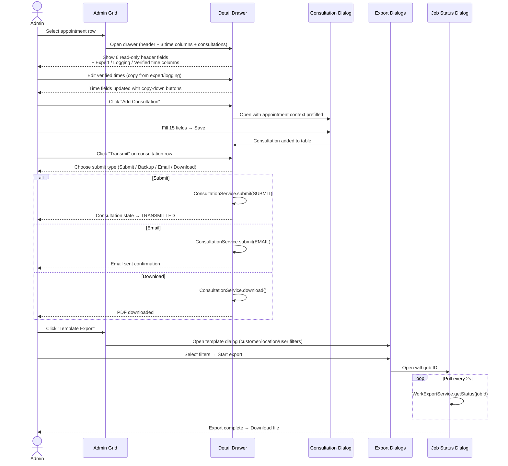
```mermaid
sequenceDiagram
    actor Admin
    participant Grid as Admin Grid
    participant Detail as Detail Drawer
    participant ConsultDlg as Consultation Dialog
    participant ExportDlg as Export Dialogs
    participant JobDlg as Job Status Dialog

    Admin->>Grid: Select appointment row
    Grid->>Detail: Open drawer (header + 3 time columns + consultations)
    Detail-->>Admin: Show 6 read-only header fields<br>+ Expert / Logging / Verified time columns

    Admin->>Detail: Edit verified times (copy from expert/logging)
    Detail-->>Admin: Time fields updated with copy-down buttons

    Admin->>Detail: Click "Add Consultation"
    Detail->>ConsultDlg: Open with appointment context prefilled
    Admin->>ConsultDlg: Fill 15 fields → Save
    ConsultDlg->>Detail: Consultation added to table

    Admin->>Detail: Click "Transmit" on consultation row
    Detail-->>Admin: Choose submit type (Submit / Backup / Email / Download)

    alt Submit
        Detail->>Detail: ConsultationService.submit(SUBMIT)
        Detail-->>Admin: Consultation state → TRANSMITTED
    else Email
        Detail->>Detail: ConsultationService.submit(EMAIL)
        Detail-->>Admin: Email sent confirmation
    else Download
        Detail->>Detail: ConsultationService.download()
        Detail-->>Admin: PDF downloaded
    end

    Admin->>Grid: Click "Template Export"
    Grid->>ExportDlg: Open template dialog (customer/location/user filters)
    Admin->>ExportDlg: Select filters → Start export
    ExportDlg->>JobDlg: Open with job ID
    loop Poll every 2s
        JobDlg->>JobDlg: WorkExportService.getStatus(jobId)
    end
    JobDlg-->>Admin: Export complete → Download file
```

---

### 7.3 CDR Call Assignment — Sequence Diagram

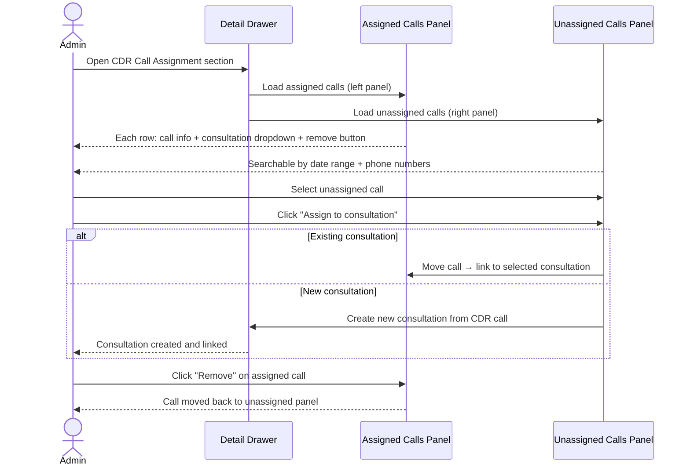
```mermaid
sequenceDiagram
    actor Admin
    participant Detail as Detail Drawer
    participant Assigned as Assigned Calls Panel
    participant Unassigned as Unassigned Calls Panel

    Admin->>Detail: Open CDR Call Assignment section
    Detail->>Assigned: Load assigned calls (left panel)
    Detail->>Unassigned: Load unassigned calls (right panel)

    Assigned-->>Admin: Each row: call info + consultation dropdown + remove button
    Unassigned-->>Admin: Searchable by date range + phone numbers

    Admin->>Unassigned: Select unassigned call
    Admin->>Unassigned: Click "Assign to consultation"

    alt Existing consultation
        Unassigned->>Assigned: Move call → link to selected consultation
    else New consultation
        Unassigned->>Detail: Create new consultation from CDR call
        Detail-->>Admin: Consultation created and linked
    end

    Admin->>Assigned: Click "Remove" on assigned call
    Assigned-->>Admin: Call moved back to unassigned panel
```

---

### 7.4 Appointment Admin — Interdependencies Summary

| Factor | Affects | How |
|:---|:---|:---|
| Month closed status | All editing | Displays read-only banner, blocks time edits and consultation changes |
| Appointment state (STORNO) | Time columns | Hides active times, shows storno time field instead |
| Payment type (FULL/VK/EK/IGNORE) | Row color coding | Green = FULL, Yellow = VK/EK, Red = IGNORE |
| Export type selection | Export workflow | EK/VK = sync download; Template = async Job Status dialog |
| Consultation submit type | Transmit action | SUBMIT/BACKUP update state; EMAIL sends; DOWNLOAD returns PDF |
| CDR unassigned count | Logged times section | Shows "X Open CDR" badge when unmatched calls exist |

---

## Area 8: CDR Call Tracking (Appointment Support)

### Context

The CDR (Call Detail Record) module tracks telephone calls related to appointments, allowing staff to view call history, manage call assignments, and close monthly billing periods. The CDR Call list is a 16-column responsive grid with year/month/day navigation and 7 color-coded status badges.

**Who uses it:** Support and admin staff tracking telephone consultations and call assignments.

**Entry point:** User navigates to CDR Call list via sidebar navigation.

**Exit points:** Call detail saved, assignment updated, month closed.

---

### 8.1 CDR Call Tracking — User Journey Flowchart

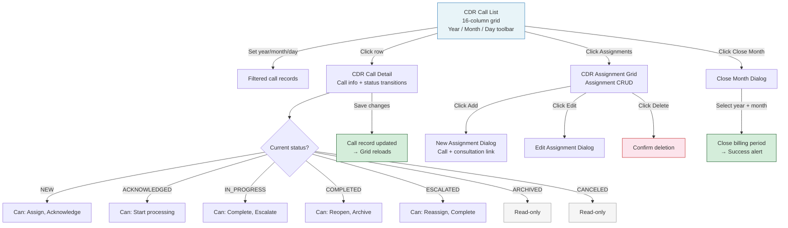
```mermaid
flowchart TD
    LIST["CDR Call List<br>16-column grid<br>Year / Month / Day toolbar"]

    LIST -->|"Set year/month/day"| FILTERED["Filtered call records"]
    LIST -->|"Click row"| DETAIL["CDR Call Detail<br>Call info + status transitions"]
    LIST -->|"Click Assignments"| ASSIGN["CDR Assignment Grid<br>Assignment CRUD"]
    LIST -->|"Click Close Month"| CLOSE_M["Close Month Dialog"]

    DETAIL --> STATUS{"Current status?"}
    STATUS -->|"NEW"| S_NEW["Can: Assign, Acknowledge"]
    STATUS -->|"ACKNOWLEDGED"| S_ACK["Can: Start processing"]
    STATUS -->|"IN_PROGRESS"| S_PROG["Can: Complete, Escalate"]
    STATUS -->|"COMPLETED"| S_DONE["Can: Reopen, Archive"]
    STATUS -->|"ESCALATED"| S_ESC["Can: Reassign, Complete"]
    STATUS -->|"ARCHIVED"| S_ARCH["Read-only"]
    STATUS -->|"CANCELED"| S_CAN["Read-only"]

    DETAIL -->|"Save changes"| SAVED["Call record updated<br>→ Grid reloads"]

    ASSIGN -->|"Click Add"| ADD_A["New Assignment Dialog<br>Call + consultation link"]
    ASSIGN -->|"Click Edit"| EDIT_A["Edit Assignment Dialog"]
    ASSIGN -->|"Click Delete"| DEL_A["Confirm deletion"]

    CLOSE_M -->|"Select year + month"| CLOSE_CONFIRM["Close billing period<br>→ Success alert"]

    style LIST fill:#e8f4f8,stroke:#2c7bb6
    style SAVED fill:#d4edda,stroke:#155724
    style CLOSE_CONFIRM fill:#d4edda,stroke:#155724
    style DEL_A fill:#fce4ec,stroke:#c62828
    style S_ARCH fill:#f5f5f5,stroke:#999
    style S_CAN fill:#f5f5f5,stroke:#999
```

**Key observations:**

- The CDR Call list is a standard data table (not a MonthTable calendar grid).
- 16 columns include: ID, date, time, duration, caller, callee, direction, status, assignment, location, job, expert, customer, phone numbers, notes, actions.
- 7 statuses with color-coded badges: NEW (blue), ACKNOWLEDGED (cyan), IN_PROGRESS (yellow), COMPLETED (green), ESCALATED (orange), ARCHIVED (gray), CANCELED (red).
- Close Month is a shared dialog also used by Appointment Plan and Shift Plan.
- Assignment CRUD is a simple grid + modal pattern.

---

### 8.2 CDR Call Status — State Diagram

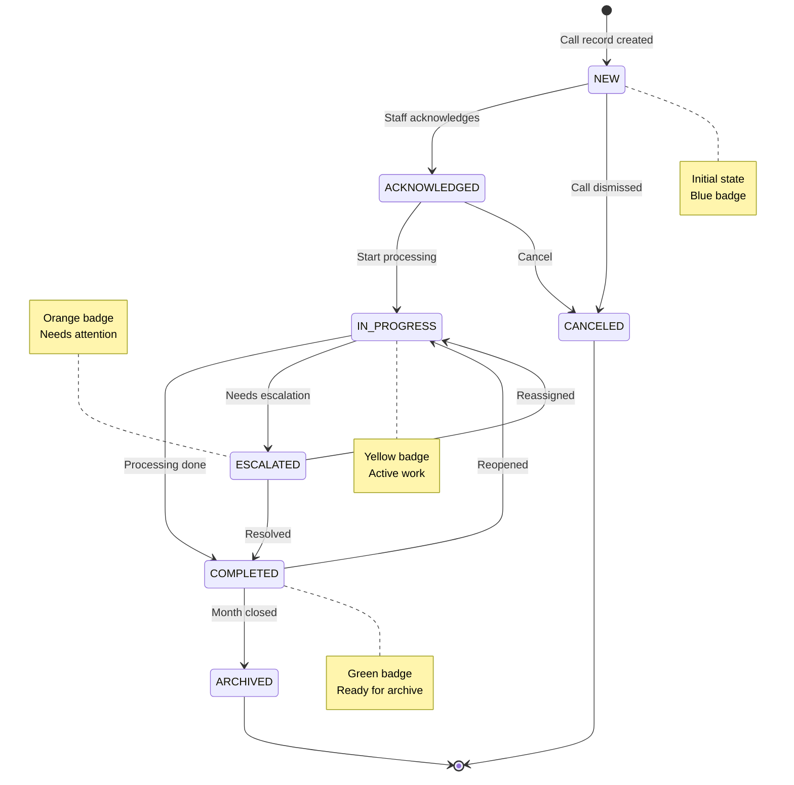
```mermaid
stateDiagram-v2
    [*] --> NEW: Call record created

    NEW --> ACKNOWLEDGED: Staff acknowledges
    NEW --> CANCELED: Call dismissed

    ACKNOWLEDGED --> IN_PROGRESS: Start processing
    ACKNOWLEDGED --> CANCELED: Cancel

    IN_PROGRESS --> COMPLETED: Processing done
    IN_PROGRESS --> ESCALATED: Needs escalation

    ESCALATED --> IN_PROGRESS: Reassigned
    ESCALATED --> COMPLETED: Resolved

    COMPLETED --> ARCHIVED: Month closed
    COMPLETED --> IN_PROGRESS: Reopened

    ARCHIVED --> [*]
    CANCELED --> [*]

    note right of NEW: Initial state<br>Blue badge
    note right of IN_PROGRESS: Yellow badge<br>Active work
    note right of COMPLETED: Green badge<br>Ready for archive
    note left of ESCALATED: Orange badge<br>Needs attention
```

---

### 8.3 CDR Call Detail — Sequence Diagram

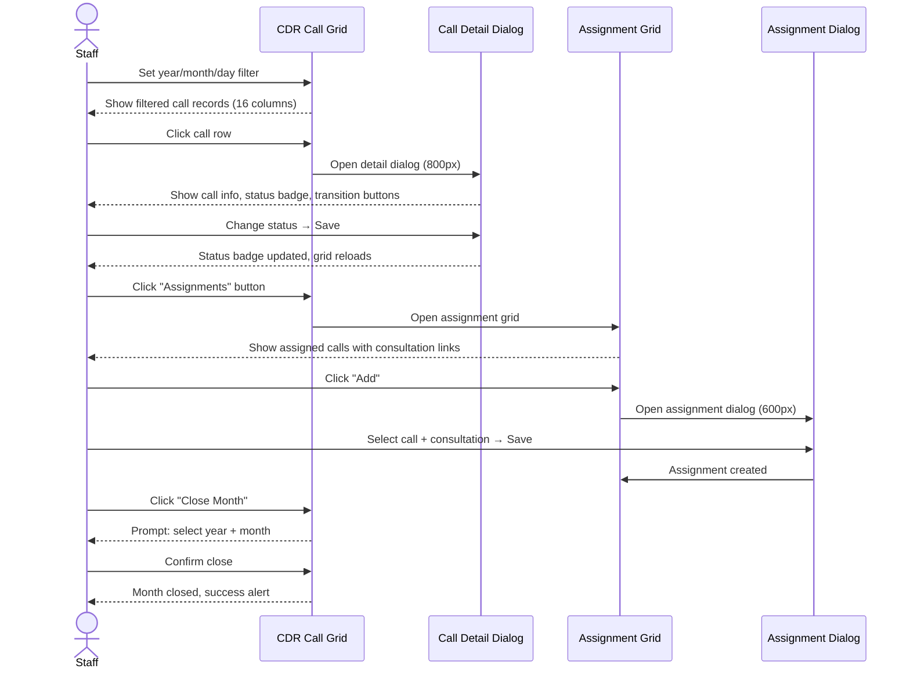
```mermaid
sequenceDiagram
    actor Staff
    participant Grid as CDR Call Grid
    participant Detail as Call Detail Dialog
    participant AssignGrid as Assignment Grid
    participant AssignDlg as Assignment Dialog

    Staff->>Grid: Set year/month/day filter
    Grid-->>Staff: Show filtered call records (16 columns)

    Staff->>Grid: Click call row
    Grid->>Detail: Open detail dialog (800px)
    Detail-->>Staff: Show call info, status badge, transition buttons

    Staff->>Detail: Change status → Save
    Detail-->>Staff: Status badge updated, grid reloads

    Staff->>Grid: Click "Assignments" button
    Grid->>AssignGrid: Open assignment grid
    AssignGrid-->>Staff: Show assigned calls with consultation links

    Staff->>AssignGrid: Click "Add"
    AssignGrid->>AssignDlg: Open assignment dialog (600px)
    Staff->>AssignDlg: Select call + consultation → Save
    AssignDlg->>AssignGrid: Assignment created

    Staff->>Grid: Click "Close Month"
    Grid-->>Staff: Prompt: select year + month
    Staff->>Grid: Confirm close
    Grid-->>Staff: Month closed, success alert
```

---

### 8.4 CDR Call — Interdependencies Summary

| Factor | Affects | How |
|:---|:---|:---|
| Call status | Available transitions | Each status has defined valid next states |
| Month closed | Call editing | Archived calls are read-only |
| Assignment link | CDR ↔ Consultation | Calls can be linked to consultations for billing |
| Date filter (year/month/day) | Grid content | Filters call records by date range |
| Export prefix | Close month | Custom filename prefix for monthly export |

---

## Area 9: Shift Plan Management

### Context

The Shift Plan module manages recurring shift templates that auto-generate concrete shift appointments. Plans define weekly or monthly schedules with preferred experts, price type auto-suggestion (weekday/night/weekend), and collision detection. The "Apply Plan" action generates appointments asynchronously with a progress dialog.

**Who uses it:** Managers and scheduling staff who create and maintain shift schedule templates.

**Entry point:** User navigates to Shift Plan list from sidebar (separate from the Shift List MonthTable).

**Exit points:** Plan saved, appointments generated via Apply Plan, month closed.

---

### 9.1 Shift Plan — User Journey Flowchart

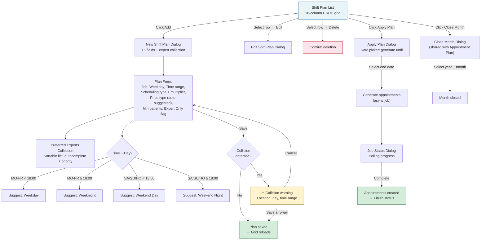
```mermaid
flowchart TD
    LIST["Shift Plan List<br>10-column CRUD grid"]

    LIST -->|"Click Add"| NEW["New Shift Plan Dialog<br>15 fields + expert collection"]
    LIST -->|"Select row → Edit"| EDIT["Edit Shift Plan Dialog"]
    LIST -->|"Select row → Delete"| DEL["Confirm deletion"]
    LIST -->|"Click Apply Plan"| APPLY["Apply Plan Dialog<br>Date picker: generate until"]
    LIST -->|"Click Close Month"| CLOSE["Close Month Dialog<br>(shared with Appointment Plan)"]

    NEW --> PLAN_FORM["Plan Form:<br>Job, Weekday, Time range,<br>Scheduling type + multiplier,<br>Price type (auto-suggested),<br>Min patients, Expert Only flag"]

    PLAN_FORM --> EXPERTS["Preferred Experts Collection<br>Sortable list: autocomplete + priority"]
    PLAN_FORM --> PRICE{"Time + Day?"}
    PRICE -->|"MO-FR < 18:00"| WEEKDAY["Suggest: Weekday"]
    PRICE -->|"MO-FR ≥ 18:00"| WEEKNIGHT["Suggest: Weeknight"]
    PRICE -->|"SA/SU/HO < 18:00"| WEEKENDDAY["Suggest: Weekend Day"]
    PRICE -->|"SA/SU/HO ≥ 18:00"| WEEKENDNIGHT["Suggest: Weekend Night"]

    PLAN_FORM -->|"Save"| COLLISION{"Collision<br>detected?"}
    COLLISION -->|"No"| SAVED["Plan saved<br>→ Grid reloads"]
    COLLISION -->|"Yes"| WARN["⚠ Collision warning<br>Location, day, time range"]
    WARN -->|"Save anyway"| SAVED
    WARN -->|"Cancel"| PLAN_FORM

    APPLY -->|"Select end date"| GEN["Generate appointments<br>(async job)"]
    GEN --> JOB["Job Status Dialog<br>Polling progress"]
    JOB -->|"Complete"| DONE["Appointments created<br>→ Finish status"]

    CLOSE -->|"Select year + month"| CLOSED["Month closed"]

    style LIST fill:#e8f4f8,stroke:#2c7bb6
    style SAVED fill:#d4edda,stroke:#155724
    style DONE fill:#d4edda,stroke:#155724
    style WARN fill:#fff3cd,stroke:#856404
    style DEL fill:#fce4ec,stroke:#c62828
```

**Key observations:**

- Shift Plan is a standard CRUD grid (10 columns: id, name, count, preferred doctors, job, minPatients, day, priceType, timeStart, timeEnd), NOT a MonthTable.
- Price type is auto-suggested from a weekday + time hour matrix but can be overridden.
- Preferred experts collection is an ordered/sortable list with add/remove and priority.
- Collision detection checks for overlapping doctor appointments on save.
- Apply Plan generates appointments asynchronously — uses the shared Job Status polling dialog.
- Close Month is shared with Appointment Plan.
- Scheduling types: WEEKLY, FIRSTOFMONTH, XOFMONTH, LASTOFMONTH.

---

### 9.2 Apply Plan — Sequence Diagram

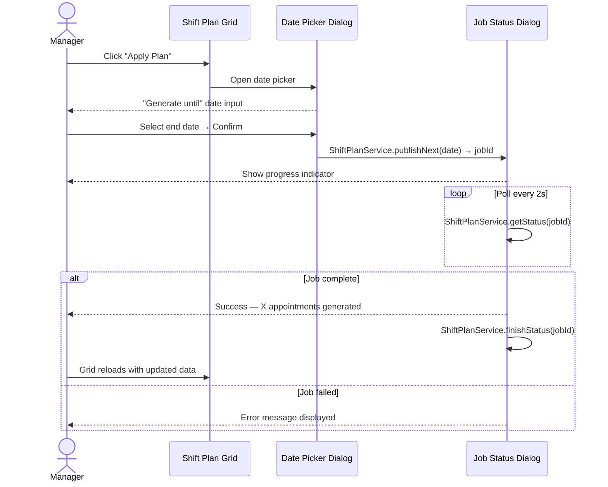
```mermaid
sequenceDiagram
    actor Manager
    participant Grid as Shift Plan Grid
    participant DateDlg as Date Picker Dialog
    participant JobDlg as Job Status Dialog

    Manager->>Grid: Click "Apply Plan"
    Grid->>DateDlg: Open date picker
    DateDlg-->>Manager: "Generate until" date input

    Manager->>DateDlg: Select end date → Confirm
    DateDlg->>JobDlg: ShiftPlanService.publishNext(date) → jobId
    JobDlg-->>Manager: Show progress indicator

    loop Poll every 2s
        JobDlg->>JobDlg: ShiftPlanService.getStatus(jobId)
    end

    alt Job complete
        JobDlg-->>Manager: Success — X appointments generated
        JobDlg->>JobDlg: ShiftPlanService.finishStatus(jobId)
        Manager->>Grid: Grid reloads with updated data
    else Job failed
        JobDlg-->>Manager: Error message displayed
    end
```

---

### 9.3 Shift Plan — Interdependencies Summary

| Factor | Affects | How |
|:---|:---|:---|
| Weekday + time hour | Price type suggestion | Auto-suggests WEEKDAY/WEEKNIGHT/WEEKENDDAY/WEEKENDNIGHT |
| Scheduling type | Appointment frequency | WEEKLY = every X weeks; FIRSTOFMONTH/XOFMONTH/LASTOFMONTH = monthly patterns |
| Doctor selection | Collision detection | Optional, but triggers conflict check when provided |
| expertOnly flag | Location field | When checked, location is hidden and not required |
| Month closed status | Plan application | Closed months block new appointment generation |
| Preferred experts | Assignment priority | Ordered list determines which experts are assigned first during generation |

---

## Area 10: Council Plan Management

### Context

The Council Plan module manages recurring council session templates. Councils are appointments with `jobType=COUNCIL`, focused on doctor role assignments rather than expert shifts. Plans define doctor collections, scheduling patterns, and auto-generate council appointments. Simpler than Shift Plan — no price type suggestion, no close month button.

**Who uses it:** Administrative staff scheduling recurring council (consultation board) sessions.

**Entry point:** User navigates to Council Plan list from sidebar.

**Exit points:** Plan saved, council appointments generated via Apply Plan.

---

### 10.1 Council Plan — User Journey Flowchart

```mermaid
flowchart TD
    LIST["Council Plan List<br>10-column CRUD grid"]

    LIST -->|"Click Add"| NEW["New Council Plan Dialog<br>15 fields + doctor collection<br>Defaults: count=2, scheduling=WEEKLY"]
    LIST -->|"Select row → Edit"| EDIT["Edit Council Plan Dialog"]
    LIST -->|"Select row → Delete"| DEL["Confirm deletion"]
    LIST -->|"Click Apply Plan"| APPLY["Apply Plan Dialog<br>Date picker: generate until"]

    NEW --> PLAN_FORM["Plan Form:<br>Job, Weekday, Time range,<br>Scheduling type + multiplier,<br>Location (conditional),<br>Job Support flag,<br>Expert Only flag"]

    PLAN_FORM --> DOCTORS["Doctor Collection<br>Repeater: doctor autocomplete + role"]
    PLAN_FORM --> EXPERT{"Expert Only<br>checked?"}
    EXPERT -->|"Yes"| HIDE_LOC["Hide Location field"]
    EXPERT -->|"No"| SHOW_LOC["Show Location field (mandatory)"]

    PLAN_FORM -->|"Save"| SAVED["Plan saved<br>→ Grid reloads"]

    APPLY -->|"Select end date"| GEN["Generate council appointments<br>(async job)"]
    GEN --> JOB["Job Status Dialog<br>Polling progress"]
    JOB -->|"Complete"| DONE["Council appointments created"]

    style LIST fill:#e8f4f8,stroke:#2c7bb6
    style SAVED fill:#d4edda,stroke:#155724
    style DONE fill:#d4edda,stroke:#155724
    style DEL fill:#fce4ec,stroke:#c62828
```

**Key observations:**

- Council Plan is structurally similar to Shift Plan but simpler.
- No price type auto-suggestion (councils don't have shift-based pricing).
- No Close Month button (unlike Shift Plan and Appointment Plan).
- Doctor collection replaces expert collection — doctors have role assignments instead of priority ordering.
- `jobSupport` checkbox is council-specific (not present in shift plans).
- Default values on create: count=2, scheduling=WEEKLY.
- `schedulingMulitplier` has a typo in the legacy datamodel (kept as-is for compatibility).

---

### 10.2 Council Apply Plan — Sequence Diagram

```mermaid
sequenceDiagram
    actor Staff
    participant Grid as Council Plan Grid
    participant DateDlg as Date Picker Dialog
    participant JobDlg as Job Status Dialog

    Staff->>Grid: Click "Apply Plan"
    Grid->>DateDlg: Open date picker
    DateDlg-->>Staff: "Generate until" date input

    Staff->>DateDlg: Select end date → Confirm
    DateDlg->>JobDlg: CouncilPlanService.publishNext(date) → jobId
    JobDlg-->>Staff: Show progress indicator

    loop Poll every 2s
        JobDlg->>JobDlg: CouncilPlanService.getStatus(jobId)
    end

    alt Job complete
        JobDlg-->>Staff: Success — X council appointments generated
        JobDlg->>JobDlg: CouncilPlanService.finishStatus(jobId)
        Staff->>Grid: Grid reloads
    else Job failed
        JobDlg-->>Staff: Error message displayed
    end
```

---

### 10.3 Council Plan — Interdependencies Summary

| Factor | Affects | How |
|:---|:---|:---|
| expertOnly flag | Location field | When checked, location is hidden and not required |
| jobSupport flag | Council sessions | Council-specific flag for support sessions |
| Scheduling type | Frequency | WEEKLY, FIRSTOFMONTH, XOFMONTH, LASTOFMONTH |
| Doctor collection | Role assignments | Defines which doctors and their roles in generated councils |
| Default count=2 | Plan creation | Pre-fills with 2 doctors minimum |

---

## Cross-Module Shared Components (Areas 7–10)

The four Batch 10 modules share several components and patterns:

| Shared Component | Used By | Notes |
|:---|:---|:---|
| Job Status Dialog | Appointment Admin (template export), Shift Plan (apply plan), Council Plan (apply plan) | Async polling dialog with progress indicator |
| Close Month Dialog | Appointment Admin, Appointment Support (CDR), Shift Plan | Year + month select, calls ClosedMonthService |
| Collision Detection | Shift Plan (on save) | Checks doctor appointment overlaps |
| Doctor Autocomplete | Shift Plan (experts), Council Plan (doctors) | Uses UserService.findDoctor |
| MonthTable Grid | *Not used* in Batch 10 (Shift List / Council List are in Batch 4) | Batch 10 modules use standard CRUD grids |

---

## Batch 10 Wireframe Screenshots

### Appointment Admin Wireframes

#### W1: Inline Consultation — Admin Grid

Admin appointment grid with 13-column table, year/month/day toolbar, navbar with 11 action buttons (Edit, Delete, Calculate, EK/VK/VK-Loc exports, Template Export, Worklog, Close Month), payment-type color-coded rows (green=FULL, yellow=VK/EK, red=IGNORE), and month-closed alert banner.


**Annotations:**
- Grid columns: 13-column table layout.
- Toolbar: 11 action buttons.
- Summary statistics displayed.

#### W1b: Inline Consultation — Detail Drawer

1200px detail drawer with header info (staff count, job code, date, time, state badge), 5 form fields (Customer RO, Location, State, Job, Payment), assigned experts, 3-column time management (Expert/Logging/Verified), consultation table with 13 inline-editable columns, summary statistics, and Save footer.


**Annotations:**
- Time management: 3-column layout (Expert / Logging / Verified).
- Inline-editable: 13-column consultation table.

#### W2: Calculation Dialog

700px dialog showing appointment billing calculation. Header with appointment context, EK (Purchase) table with 8 columns (Physician, Location, Patients, Time/Patient, Time, Payable Patients, EUR, Total), VK (Sale) table with 5 columns (Location, Time, Patients, EUR, Total), and currency totals.


**Annotations:**
- EK table: 8-column layout.
- VK table: 5-column layout.

#### W3: QM Dialog

800px view-only QM questionnaire dialog. Summary stats (Patients, Entries, Follow-ups, Referrals, Repeat Entries), 6 rating fields on 1-6 scales (Tele-Applicability, Room Quality, Equipment, Communication, Extra Referral, Translator), equipment availability flags (Dermatoscope, Otoscope, Stethoscope, Vital Signs), reporting status, and comment.


**Annotations:**
- View-only QM questionnaire, 12 rating fields.

#### W4: Export Dialog

600px template export dialog. Year/Month inputs (prefilled from toolbar), Export Template autocomplete (filtered by APPOINTMENT/CUSTOMER_SALE/EXPERT_BILLING/INVOICE_RECEIVER_SALE), optional Customer/Location/User filter autocompletes, and Start Export button triggering async Job Status dialog.


**Annotations:**
- 6 fields with template/customer/expert filters.

#### W5: Email/Submit Dialog

600px consultation submit dialog. Confirmation message, read-only location/time info, Submit Type select (Standard per Setting / Backup / Email / Download), patient data type and access info, previous transmit result, and Transmit button.


**Annotations:**
- Submit dialog with 4 submit types.

#### W6: Print Preview

1000px print preview dialog with large placeholder area for server-rendered invoice template.


**Annotations:**
- Server-side template rendering, browser print.

#### W7: Job Status Dialog

500px async job polling dialog. Status text, progress bar with completion percentage, step detail, download link on completion, and async queue link if queued.


**Annotations:**
- Async polling, progress bar, download link.

#### W8: State & Payment Legend

800px visual reference card. 12 appointment state badges in 2 rows with color coding, and 4 payment type badges (FULL=green, VK=yellow, EK=yellow, IGNORE=red).


**Annotations:**
- 12 states + 4 payment types color-coded.

### CDR Call (Appointment Support) Wireframes

#### W1: CDR Call List

1440px full-page view. 16-column responsive grid with year/month/day toolbar, navbar buttons (Edit, Delete, Assignments, Close Month), 7 color-coded status badges (NEW=blue, ACKNOWLEDGED=cyan, IN_PROGRESS=yellow, COMPLETED=green, ESCALATED=orange, ARCHIVED=gray, CANCELED=red), pagination.


**Annotations:**
- 16-column DataTable, 7 statuses color-coded.

#### W2: CDR Call Detail

800px call detail dialog. Read-only call info (date, time, duration, caller, callee), Direction and Status fields, Expert and Location, phone numbers, notes textarea. Status transitions drive available actions.


**Annotations:**
- Status transitions: NEW→ACKNOWLEDGED→IN_PROGRESS→COMPLETED→ARCHIVED.

#### W3: CDR Assignment CRUD

600px assignment management dialog. Toolbar with Add/Delete buttons, 5-column assignment table (ID, Call ID, Consultation, Date, Actions), assignment detail sub-section with Call ID and Consultation select.


**Annotations:**
- CdrCallAssignmentService, consultation dropdown, Create option.

#### W4: Close Month Dialog

500px shared close month dialog. Year input, Month select, info alert about billing period lock. Toggle between Close Month and Open Month based on current state.


**Annotations:**
- Shared dialog: Appointment Admin + Plan + Shift Plan, toggle open/close.

#### W5: CDR Status Legend

600px visual reference card. 7 CDR call status badges with colors, and status transition descriptions (NEW→ACKNOWLEDGED→IN_PROGRESS→COMPLETED→ARCHIVED, with ESCALATED and CANCELED branches).


**Annotations:**
- 7 statuses, terminal states ARCHIVED/CANCELED.

### Shift Plan Wireframes

#### W1: Shift Plan List

1440px full-page CRUD grid. 10-column table (ID, Name, Count, Preferred Doctors, Job, Min Patients, Day, Price Type, Start, End), toolbar with Add/Edit/Delete/Apply Plan/Close Month buttons, search, pagination. NOT the MonthTable calendar (that's Batch 4).


**Annotations:**
- 10-column CRUD grid, NOT MonthTable, preferred doctors with priority, price type auto-suggest.

#### W2: Shift Plan Detail

1200px plan template dialog. 15 form fields (Name, Job, Day, Time Start/End, Price Type with auto-suggest, Scheduling type/multiplier, Last Date, Min Patients, Count, Location, Expert Only), sortable Preferred Experts collection with priority ordering and preferred flag.


**Annotations:**
- 15 fields + expert collection, price type auto-suggested, sortable priority.

#### W3: Apply Plan Dialog

500px date picker dialog. "Generate Until" date input, info alert about duplicate prevention, Generate button triggering async job polling via ShiftPlanService.publishNext.


**Annotations:**
- publishNext(date) → jobId, polls getStatus, finishStatus on complete.

#### W4: Shift State Legend

600px visual reference card. 12 shift states (same state machine as Appointment) with color-coded badges and transition descriptions.


**Annotations:**
- 12 states = subset of appointment states.

### Council Plan Wireframes

#### W1: Council Plan List

1440px full-page CRUD grid. 10-column table (ID, Name, Count, Doctors, Job, Min Patients, Day, Support, Start, End), toolbar with Add/Edit/Delete/Apply Plan buttons (no Close Month). Default on create: count=2, scheduling=WEEKLY.


**Annotations:**
- 10-column CRUD grid, default count=2 scheduling=WEEKLY, no Close Month button.

#### W2: Council Plan Detail

1000px plan template dialog. 15 fields (Name, Job, Day, Time Start/End, Scheduling, Multiplier, Last Date, Count, Location, Expert Only, Job Support checkboxes), Preferred Doctors collection with role assignments (Main Doctor / Support) instead of priority ordering.


**Annotations:**
- 15 fields + doctor collection with role assignments.

#### W3: Apply Council Plan Dialog

500px date picker dialog. Same pattern as Shift Apply Plan. "Generate Until" date input, info alert, Generate button triggering CouncilPlanService.publishNext.


**Annotations:**
- publishNext(date) → jobId, polls getStatus, finishStatus on complete.
