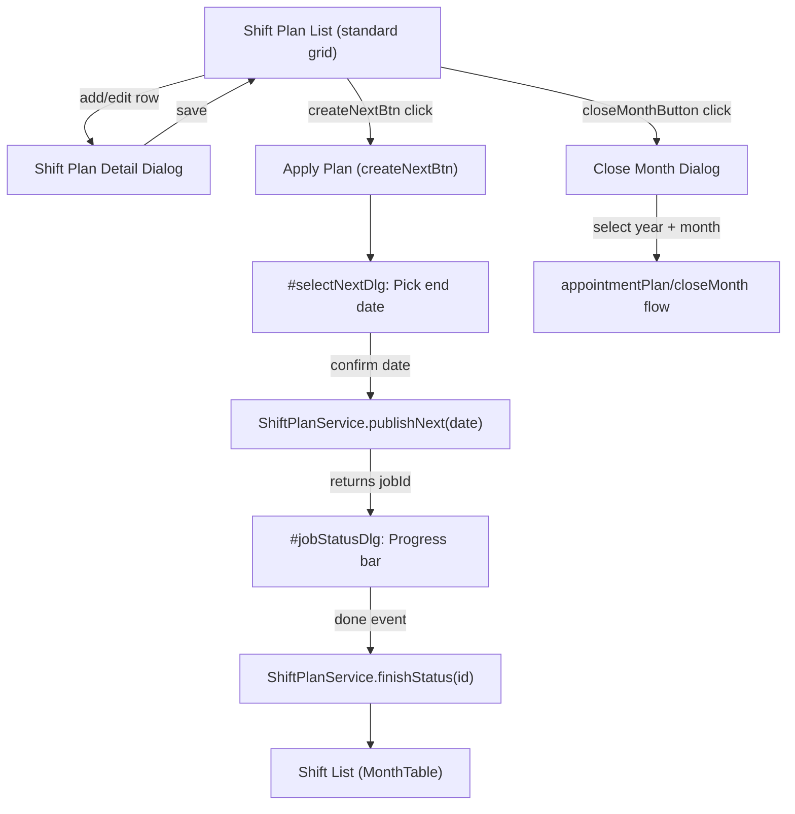
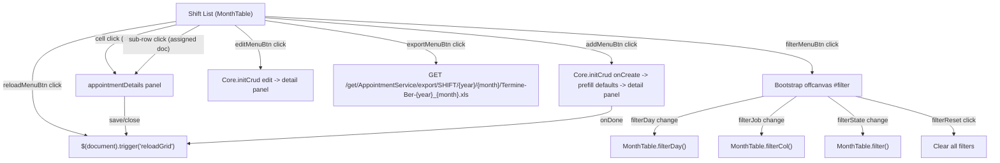
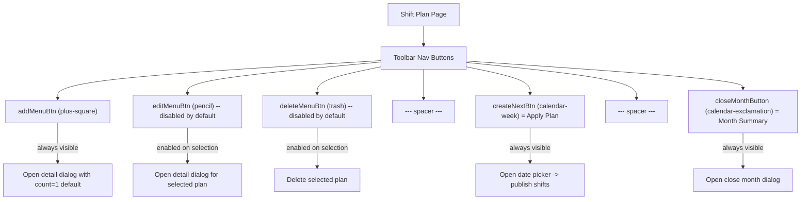

# Shift List & Shift Plan Pages

This analysis covers two related pages:
1. **Shift List** (`shift/index.htmlm` + `shift/index.js`) -- A MonthTable calendar grid displaying shift appointments, with embedded appointment detail/edit panel, assigned staff rendering, and filtering.
2. **Shift Plan** (`shiftPlan/index.htmlm` + `shiftPlan/index.js`) -- A standard CRUD list for shift plan templates, with detail dialog containing preferred expert collection, scheduling options, and actions to apply plans to the calendar and close months.

Both pages share the same backend `AppointmentService` model (shifts are appointments with `type: "SHIFT"`), but the Shift Plan manages recurring templates while the Shift List displays the actual calendar instances.

---

## Cross-References

### Source Includes

| Type | Direction | Detail | Linked Document | Condition / Context |
|------|-----------|--------|-----------------|---------------------|
| include | **Includes** | `{{> appointmentDetails}}` | [Appointment Details Scheduling](_shared-components/appointment-details-scheduling.md) | Inline detail/edit panel for shift scheduling |
| include | **Includes** | `{{> assignUserDlg}}` | [Appointment Assign User](_shared-components/appointment-assign-user.md) | Assign user/collision dialog |
| include | **Includes** | `{{> closeMonth}}` | [Close Month Dialog](../../appointment-support/close-month.md) | Shared month close/reopen dialog |

---

## Behavior Diagrams

### Shift Plan to Shift Creation Flow



### Shift List Dialog Navigation



### Shift Plan Toolbar Permission Diagram



---

## Page 1: Shift List

### HTMLM Header Metadata

| Field | Method | Value / Params | Purpose |
| :--- | :--- | :--- | :--- |
| `usePanel` | variable | `true` | Enables panel layout |
| `navBar` | template | `../_include/navbar.mustache` | Standard navigation bar |
| `siteloader` | template | `../_include/siteloader.mustache` | Loading indicator |
| `search` | variable | `true` | Enables global site search bar (`#siteSearch`) |
| `nav` | variable | `{ filter: false, buttons: [...] }` | Toolbar button definitions |
| `jobType` | variable | `"SHIFT"` | Filters to shift type |
| `appointmentDetails` | template | `../appointment/details.html` | Inline detail/edit panel |
| `assignUserDlg` | template | `../appointment/assignUser.html` | Assign user dialog |
| `docFinder` | template | `../profile/docFinder.html` | Doctor finder lookup |

### Grid Structure (MonthTable -- Dynamic Columns)

The Shift list uses the same `MonthTable` pattern as the Appointment list. Columns are **not** statically defined; they are dynamically generated from the backend response.

| Axis | Content | Source |
| :--- | :--- | :--- |
| Row headers | Day of month (1-31) | Generated by MonthTable from current month |
| Column headers | Job/shift names | Returned by `AppointmentService` for `["SHIFT", month, year]` |
| Cells | Shift entries with state icon + assigned staff sub-rows | Rendered by custom `renderFn` callback |

### MonthTable Initialization

| Parameter | Value | Purpose |
| :--- | :--- | :--- |
| `serviceName` | `"AppointmentService"` | Backend service |
| `paramFn` | `(param) => ["SHIFT", param[0], param[1]]` | Builds request: `[type, month, year]` |
| `prefillFn` | Creates prefill from cell click | Returns `{ date, state:"READY", location, customer, job, timeStart, timeEnd }` |
| `transformFn` | Adds `info` and `colorClass` | Calls `i18n.appointmentState(data.state)`, removes raw `color` |
| `renderFn` | Builds DOM for each cell | State-colored span + assigned staff sub-rows |

### Cell Rendering

Each shift cell contains:

| Element | Content | CSS class | Condition |
| :--- | :--- | :--- | :--- |
| Main span | State icon (`info.icon`) + escaped name | `info.colorClass` (from `appointmentState()`) | Always |
| Sub-row: assigned staff | `{index}. {stateIcon} {displayName}` | `sub {assignedState.color}` | `data.details.assigned[i]` exists |
| Sub-row: missing slot | `{index}. {stateIcon} ---` | `sub {assignedState(null).color}` | `data.details.assigned[i]` is null |

### New Shift Defaults (onCreate)

| Field | Default value | Source |
| :--- | :--- | :--- |
| `type` | `"SHIFT"` | Hardcoded fallback (if not in prefill) |
| `date` | Current MonthTable month/year via Luxon | `$("#gridTable").data().cur.month/year` |
| `state` | `"READY"` | Hardcoded |
| `requiredStaffCount` | `1` | Hardcoded |
| `minPatients` | `1` | Hardcoded |

### Detail Panel Visibility on Create

| Panel section | Visibility |
| :--- | :--- |
| `#navDetailsEdit` | shown |
| `#navAssigned` | shown |
| `#employeeActions` | shown |
| `#navSuggestion` | hidden |
| `#navQm` | hidden |

**Note**: The shift detail reuses `appointment/details.html` entirely. On dialog open, the title is set to `$detail.data().titleshift`. The location field (`#selectedLocation`) is made non-mandatory (`.removeClass("mandatory invalid")`), since shifts do not require a physical location.

### Toolbar Buttons (Shift List)

| Button ID | Icon | Label (i18n key) | Initial state | Action |
| :--- | :--- | :--- | :--- | :--- |
| `reloadMenuBtn` | `fa-sync` | `action.reload` | Enabled | Triggers `$(document).trigger("reloadGrid")`, auto-fires on load |
| `addMenuBtn` | `fa-plus-square` | `action.add` | Enabled | Opens detail panel with defaults |
| `editMenuBtn` | `fa-pencil` | `action.change` | **Disabled** | Opens detail panel for selected shift |
| (spacer) | -- | -- | -- | Visual separator |
| `exportMenuBtn` | `fa-file-export` | `action.export` | Enabled | Downloads `.xls` export |
| `filterMenuBtn` | `fa-filter` | `Filter` | Enabled | Opens offcanvas filter panel |

### Filter Panel (Shift List)

**Container**: `<div id="filter" class="offcanvas offcanvas-end">` (right-side slide-in)

| # | Element ID | Type | Icon | Placeholder / Label | i18n key | Filter mechanism | Notes |
| :--- | :--- | :--- | :--- | :--- | :--- | :--- | :--- |
| 1 | `filterDay` | `<input type="number">` | `fa-calendar-day` | `"Tag"` | `action.date` (title) | `MonthTable.filterDay()` -- row filter by day number | **HARDCODED** placeholder "Tag" (German) |
| 2 | `filterJob` | `<input type="text">` | `fa-briefcase-medical` | `{{i18n.jobId}}` | `jobId` | `MonthTable.filterCol()` -- column filter by job name | |
| 3 | `filterState` | `<select>` | `fa-traffic-light` | `"- {{i18n.AppointmentState}} -"` | `AppointmentState` | Triggers `#siteSearch` filter -> `MonthTable.filter()` | 12 state options |

**Filter State Options**: READY, STARTED, REQUESTED, LOCKEDIN, ACTIVE, REOPENED, DONE, CLOSED, STORNO, RESCHEDULED, CANCELED, ARCHIVED

### Filter Logic

| Filter | Scope | Match logic |
| :--- | :--- | :--- |
| Site search + State | Cell-level (`MonthTable.filter`) | Matches assigned user `displayName` or shift `name` (case-insensitive substring). If state is set, must also match `data.state` exactly. |
| Day (`#filterDay`) | Row-level (`MonthTable.filterDay`) | Exact match on `row.day` number. Empty/NaN = show all. |
| Job (`#filterJob`) | Column-level (`MonthTable.filterCol`) | Substring match on `col.data.name` (case-insensitive). Empty = show all. |

### Location / Room Selection Logic

Cascading location-room selection (within detail panel):

| Element | Behavior |
| :--- | :--- |
| `#selectedLocation` | On change: unlocks `#selectedRoom`, clears room selection |
| `#selectedRoom` | Locked (`readonly`) when no location selected. On change: auto-fills location from room's parent. Filter returns selected location ID. |

### Server Calls (Shift List)

| Action | Service | Method / URL | Parameters | Response |
| :--- | :--- | :--- | :--- | :--- |
| Load month data | `AppointmentService` | Via `MonthTable.init()` | `["SHIFT", month, year]` | Populates calendar grid |
| Get shift detail | `AppointmentService` | Via `Core.initCrud` (`getMethod: AppointmentDetails.getMethod`) | Shift ID | Fills detail panel |
| Create shift | `AppointmentService` | Via `Core.initCrud` | Prefilled shift object | `onDone` triggers `reloadGrid` |
| Export month | `AppointmentService` | `GET /get/AppointmentService/export/SHIFT/{year}/{month}/Termine-Ber-{year}_{month}.xls` | Year, month in URL | Browser downloads `.xls` |

### CRUD Configuration

```
Core.initCrud($this, {
    grid: $grid,
    detail: $detail,
    serviceName: "AppointmentService",
    getMethod: AppointmentDetails.getMethod,
    deeplink: { view: false }
})
```

---

## Page 2: Shift Plan

### HTMLM Header Metadata

| Field | Method | Value / Params | Purpose |
| :--- | :--- | :--- | :--- |
| `usePanel` | variable | `true` | Enables panel layout |
| `navBar` | template | `../_include/navbar.mustache` | Standard navigation bar |
| `search` | variable | `true` | Enables site search |
| `nav` | variable | `{ filter: true, buttons: [...] }` | Toolbar buttons + built-in filter |
| `jobStatusDlg` | template | `../_include/jobStatusDlg.html` | Async job progress dialog |
| `docFinder` | template | `../profile/docFinder.html` | Doctor finder lookup |
| `closeMonth` | template | `../appointmentPlan/closeMonth.html` | Close month dialog |

### Grid Columns (ShiftPlan -- 10 Static Columns)

| # | `data-field` | Header label (i18n key) | Width | Sortable | Formatter | Notes |
| :--- | :--- | :--- | :--- | :--- | :--- | :--- |
| 1 | `id` | `label.id` | 40 | Yes | (none) | Row ID |
| 2 | `name` | `label.name` | 100 | Yes | (none) | Plan name |
| 3 | `count` | `shiftPlan.numberOfDoctors` | 60 | Yes | (none) | Required doctor count |
| 4 | `prefered` | `shiftPlan.doctors` | 230 | Yes | `i18n.userListFormatter` | Preferred doctors list (concatenated display names) |
| 5 | `job` | `shiftPlan.area` | 250 | Yes | `Formatter.code` | Job/area code |
| 6 | `minPatients` | `appointment.minPatients` | 60 | Yes | (none) | Minimum patients |
| 7 | `day` | `shiftPlan.day` | 80 | Yes | `Formatter.weekday` | Weekday (MO-SU, HO) |
| 8 | `priceType` | `shiftPlan.shift` | 70 | Yes | `i18n.priceTypeFormatter` | Price type (WEEKDAY/WEEKNIGHT/WEEKENDDAY/WEEKENDNIGHT) |
| 9 | `timeStart` | `"Start"` | 60 | Yes | `Formatter.onlyTime` | **HARDCODED** header "Start" |
| 10 | `timeEnd` | `shiftPlan.end` | 60 | Yes | `Formatter.onlyTime` | End time |

### Detail Dialog Form Elements

**Container**: `<div class="detail" data-icon="fas fa-calendar-check" data-width="1100" data-color="bg-color-shift" title="{{i18n.shiftPlan}}">`

| # | Field name | Type | Icon | Placeholder / Label | i18n key | Mandatory | Notes |
| :--- | :--- | :--- | :--- | :--- | :--- | :--- | :--- |
| 1 | `data.name` | `<input text>` | (none) | `label.name` | `label.name` | No | Plan name |
| 2 | `data.count` | `<input number>` | `fa-users` | `shiftPlan.numberOfDoctors` | `shiftPlan.numberOfDoctors` | Yes | Number of doctors required |
| 3 | `data.job` | `<input autocomplete>` | `fa-graduation-cap` | (none) | -- | Yes | `JobService.autocompleteType` with filter `"SHIFT"`, display `code` |
| 4 | `data.day` | `<select>` | `fa-calendar-day` | `shiftPlan.day` | `shiftPlan.day` | Yes | Weekday select: MO, TU, WE, TH, FR, SA, SU, HO. Has CSS class `suggestType`. |
| 5 | `data.start` | `<input time>` | `fa-play` | `"Start"` | -- | Yes | Start time (clockpicker). Has CSS class `suggestType`. **HARDCODED** placeholder. |
| 6 | `data.priceType` | `<select>` | (grouped with start) | `AppointmentPriceType` | `AppointmentPriceType` | Yes | Price type: WEEKDAY, WEEKNIGHT, WEEKENDDAY, WEEKENDNIGHT |
| 7 | `data.end` | `<input time>` | `fa-stop` | `shiftPlan.end` | `shiftPlan.end` | Yes | End time (clockpicker) |
| 8 | `data.minPatients` | `<input number>` | (text label) | `appointment.minPatients` | `appointment.minPatients` | Yes | Minimum patients |
| 9 | `data.lastDate` | `<input date>` | `fa-calendar-day` | `appointment.start` | `appointment.start` | Yes | Start date (search from this date). Title: "Ab dem Tag nach diesem wird nach dem Wochentag gesucht" (**HARDCODED** German tooltip) |
| 10 | `data.endDate` | `<input date>` | (grouped with lastDate) | `appointmentPlan.end` | `appointmentPlan.end` | No | End date (optional) |
| 11 | `data.schedulingMulitplier` | `<input number>` | `fa-calendar-plus` | (none) | -- | Yes | Scheduling multiplier (note: typo "Mulitplier" in original) |
| 12 | `data.scheduling` | `<select>` | (grouped with multiplier) | -- | `WeekScheduling.*` | Yes | WEEKLY, FIRSTOFMONTH, XOFMONTH, LASTOFMONTH |
| 13 | `data.nextStart` | display field | (grouped with scheduling) | -- | -- | -- | Read-only date display (`<i class="field date">`) |
| 14 | `data.comment` | `<textarea>` | (none) | `label.comment` | `label.comment` | No | Comment text |
| 15 | `data.doctor` (inserts into `data.prefered`) | `<input autocomplete>` | `fa-user-md` | `consultation.doctor` | `consultation.doctor` | No | Doctor finder via `UserService.findDoctor`, display `displayName`. Class `insert` = adds to collection. |

### Preferred Experts Collection

**Label**: `{{i18n.appointment.prefered}}`
**Collection field**: `data.prefered`
**Input**: Autocomplete input (`data.doctor`) using `UserService.findDoctor`, class `insert` (adds selected item to the collection rather than replacing).

| Collection element | Purpose |
| :--- | :--- |
| `<i class="action sortUp fa fa-chevron-up">` | Move expert up in priority order |
| `<i class="action sortDown fa fa-chevron-down">` | Move expert down in priority order |
| `<span class="field">prefered.displayName</span>` | Display name of preferred expert |
| `<i class="action delete fa fa-trash">` | Remove expert from collection |

### Price Type Auto-Suggestion Logic

When both `data.day` (weekday select) and `data.start` (time input) have values, and `data.priceType` is empty, the system auto-suggests a price type:

| Condition | Auto-selected priceType |
| :--- | :--- |
| Day is SA, SU, or HO AND time hour < 18 | `WEEKENDDAY` |
| Day is SA, SU, or HO AND time hour >= 18 | `WEEKENDNIGHT` |
| Day is MO-FR AND time hour < 18 | `WEEKDAY` |
| Day is MO-FR AND time hour >= 18 | `WEEKNIGHT` |

Both `data.day` and `data.start` have CSS class `suggestType` to trigger this logic on change.

### Toolbar Buttons (Shift Plan)

| Button ID | Icon | Label (i18n key) | Initial state | Action |
| :--- | :--- | :--- | :--- | :--- |
| `addMenuBtn` | `fa-plus-square` | `action.add` | Enabled | Opens detail dialog with `{ count: 1 }` default |
| `editMenuBtn` | `fa-pencil` | `action.change` | **Disabled** | Opens detail for selected plan |
| `deleteMenuBtn` | `fa-trash` | `action.delete` | **Disabled** | Deletes selected plan |
| (spacer) | -- | -- | -- | Visual separator |
| `createNextBtn` | `fa-calendar-week` | `action.applyPlan` | Enabled | Opens date picker dialog -> publishes shifts |
| (spacer) | -- | -- | -- | Visual separator |
| `closeMonthButton` | `fa-calendar-exclamation` | `action.monthSummary` | Enabled | Opens close month dialog |

### Filter Panel (Shift Plan)

**Container**: `<div id="filter" class="offcanvas offcanvas-end">` with apply/reset pattern.

| # | Field name | Type | Icon | Placeholder / Label | Notes |
| :--- | :--- | :--- | :--- | :--- | :--- |
| 1 | `data.endDate[0]` | `<input date>` (array index 0) | `fa-stop` | (none) | End date range start |
| 2 | `data.endDate[1]` | `<input date>` (array index 1) | (grouped) | (none) | End date range end |
| 3 | `data.job` | `<input autocomplete>` | `fa-briefcase-medical` | `jobId` | `JobService.autocomplete`, display `code` |

**Max results selector**: 100 (default), 150, 200, 300, 500, >500
**Buttons**: Apply (`button.apply`) and Reset (`button.reset`)

### Full-Text Search (Shift Plan Grid)

The `slickerGrid` filter searches across:
- `item.name` (plan name)
- `item.prefered[].userProfile.displayName` (preferred doctors)
- `item.job.code` (job code)
- `item.minPatients` (min patients -- note: searches as string)
- `i18n.day[item.day]` (localized weekday name)

### Apply Plan Dialog (`#selectNextDlg`)

**Title**: `{{i18n.end.date}}`
**Icon**: `fas fa-calendar-week`, color `bg-color-shift`
**Target**: modal

| Content | Notes |
| :--- | :--- |
| Text: `{{i18n.shift}} {{i18n.appointmentPlan.generateUntil}}:` | "Shift generate until:" prompt |
| `<input class="form-control date" name="data.date"/>` | Date picker for target end date |

**Flow**:
1. User clicks `createNextBtn`
2. `#selectNextDlg` modal opens
3. User picks end date and confirms
4. Calls `ShiftPlanService.publishNext(date)` -- returns a `jobId`
5. Opens `#jobStatusDlg` with progress bar (polls job status)
6. On `done` event: calls `ShiftPlanService.finishStatus(jobId)`

### Close Month Dialog (`#closeMonthDlg`)

**Source**: `appointmentPlan/closeMonth.html` (shared with appointment plan)
**Title**: `{{i18n.month.summary.title}}`
**Icon**: `fas fa-calendar-exclamation`, color `bg-color-appointment`
**Target**: modal

**Text (HARDCODED German)**: "Welches Monat soll fur Experten geschlossen werden?" (Which month should be closed for experts?)

| # | Field name | Type | Label | Notes |
| :--- | :--- | :--- | :--- | :--- |
| 1 | `data.year` | `<input type="number">` | `{{i18n.year}}` | Year input |
| 2 | `data.month` | `<select>` | `{{i18n.month}}` | Month dropdown: JAN-DEC (values 1-12) |

### Job Status Dialog (`#jobStatusDlg`)

**Source**: `_include/jobStatusDlg.html` (shared component)
**Icon**: `far fa-download`, color `bg-color-administration`
**Target**: modal

Displays a progress bar (`progress-bar-striped`) with percentage. Contains a hidden `#asyncJob` div that becomes visible when the job is queued, with a link to the async job queue page.

**HARDCODED German text**: "Processing...", "Der Auftrag ist in der Warteschlange. Sie konnen diesen Dialog schliessen und das Ergebnis in Warteschlangen sehen."

### Server Calls (Shift Plan)

| Action | Service | Method | Parameters | Response |
| :--- | :--- | :--- | :--- | :--- |
| Load all plans | `ShiftPlanService` | `getAll` | `[filter, -1]` (filter object + limit -1 = all) | Array of shift plan objects |
| Get plan detail | `ShiftPlanService` | `get` | Plan ID | Single shift plan |
| Create/save plan | `ShiftPlanService` | Via `Core.initCrud` | Plan object | Saved plan |
| Delete plan | `ShiftPlanService` | Via `Core.initCrud` | Plan ID | -- |
| Publish shifts | `ShiftPlanService` | `publishNext` | `[date]` | Returns `jobId` for async tracking |
| Finish job | `ShiftPlanService` | `finishStatus` | `[jobId]` | Marks async job as finalized |
| Save grid settings | `UserService` | `saveSetting` | `[name, JSON.stringify(settings)]` | Persists column widths/order |

### CRUD Configuration

```
Core.initCrud($this, {
    grid: $grid,
    detail: $detail,
    serviceName: "ShiftPlanService",
    getMethod: "get",
    onCreate: { count: 1 }
})
```

---

## Click Actions Summary

### Shift List

| Action ID | Icon | Title (i18n key) | English | Notes |
| :--- | :--- | :--- | :--- | :--- |
| `reloadMenuBtn` | `fa-sync` | `action.reload` | Reload | Auto-fires on page load |
| `addMenuBtn` | `fa-plus-square` | `action.add` | Add | |
| `editMenuBtn` | `fa-pencil` | `action.change` | Edit | Disabled until selection |
| `exportMenuBtn` | `fa-file-export` | `action.export` | Export | Downloads .xls |
| `filterMenuBtn` | `fa-filter` | `"Filter"` | Filter | **HARDCODED** label |

### Shift Plan

| Action ID | Icon | Title (i18n key) | English | Notes |
| :--- | :--- | :--- | :--- | :--- |
| `addMenuBtn` | `fa-plus-square` | `action.add` | Add | |
| `editMenuBtn` | `fa-pencil` | `action.change` | Edit | Disabled until selection |
| `deleteMenuBtn` | `fa-trash` | `action.delete` | Delete | Disabled until selection |
| `createNextBtn` | `fa-calendar-week` | `action.applyPlan` | Apply Plan | Opens date picker then async job |
| `closeMonthButton` | `fa-calendar-exclamation` | `action.monthSummary` | Month Summary | Opens close month dialog |

---

## Cross-Module References

| Template | Source path | Used by | Purpose |
| :--- | :--- | :--- | :--- |
| `appointment/details.html` | `../appointment/details.html` | Shift List | Full appointment detail/edit panel (reused as shift detail) |
| `appointment/details.js` | `appointment/details.js` | Shift List | Detail panel logic (loaded via `<script>` tag) |
| `appointment/assignUser.html` | `../appointment/assignUser.html` | Shift List | Dialog for assigning staff to shifts |
| `profile/docFinder.html` | `../profile/docFinder.html` | Shift List, Shift Plan | Doctor/expert finder lookup |
| `appointmentPlan/closeMonth.html` | `../appointmentPlan/closeMonth.html` | Shift Plan | Month close/summary dialog (shared with appointment plan) |
| `appointmentPlan/closeMonth.js` | `appointmentPlan/closeMonth.js` | Shift Plan | Close month logic (loaded by closeMonth.html) |
| `_include/jobStatusDlg.html` | `../_include/jobStatusDlg.html` | Shift Plan | Async job progress dialog |
| `_include/jobStatusDlg.js` | `_include/jobStatusDlg.js` | Shift Plan | Job status polling logic |
| `_lib/scripts/monthTable.js` | `_lib/scripts/monthTable.js` | Shift List | MonthTable calendar grid component |
| `_lib/scripts/monthTable.css` | `_lib/scripts/monthTable.css` | Shift List | MonthTable styling |
| `appointment/messages.i18n.js` | `appointment/messages.i18n.js` | Shift List | Appointment state translations |

---

## Translation Table

| Text-Reference | German | English | Notes |
| :--- | :--- | :--- | :--- |
| `AppointmentType.SHIFT` | Bereitschaft | Shift | Type label |
| `ShiftTime.MORNING` | (Morgen) | Morning | Shift time |
| `ShiftTime.AFTERNOON` | (Nachmittag) | Afternoon | Shift time |
| `ShiftTime.NIGHT` | (Nacht) | Night | Shift time |
| `AppointmentPriceType` | (Preistyp) | Price Type | Dropdown label |
| `AppointmentPriceType.WEEKDAY` | (Werktag) | Weekday | |
| `AppointmentPriceType.WEEKNIGHT` | (Werktagsnacht) | Weeknight | |
| `AppointmentPriceType.WEEKENDDAY` | (Wochenendtag) | Weekend Day | |
| `AppointmentPriceType.WEEKENDNIGHT` | (Wochenendnacht) | Weekend Night | |
| `AppointmentState` | (Zustand) | State | Filter dropdown label |
| `AppointmentState.READY` | Angelegt | Ready | |
| `AppointmentState.STARTED` | (Gestarted) | Started | |
| `AppointmentState.REQUESTED` | Angefragt | Requested | |
| `AppointmentState.LOCKEDIN` | Bestatigt | Locked in | |
| `AppointmentState.ACTIVE` | Gestarted | Started | |
| `AppointmentState.REOPENED` | Wieder Geoffnet | Reopen | |
| `AppointmentState.DONE` | Durchgefuhrt | Done | |
| `AppointmentState.CLOSED` | Uberpruft | Closed | |
| `AppointmentState.STORNO` | Kunde Abgesagt | Storno | |
| `AppointmentState.RESCHEDULED` | Verschoben | Rescheduled | |
| `AppointmentState.CANCELED` | Ausgefallen (Arzt) | Canceled | |
| `AppointmentState.ARCHIVED` | (Archiviert) | Archived | |
| `shiftPlan` | (Schichtplan) | Shift Plan | Dialog title |
| `shiftPlan.numberOfDoctors` | (Anzahl Arzte) | Number of Doctors | Grid + form label |
| `shiftPlan.doctors` | (Arzte) | Doctors | Grid column |
| `shiftPlan.area` | (Bereich) | Area | Grid column (job) |
| `shiftPlan.day` | (Tag) | Day | Weekday column |
| `shiftPlan.shift` | (Schicht) | Shift | Price type column |
| `shiftPlan.end` | (Ende) | End | End time column |
| `appointment.minPatients` | (Min. Patienten) | Min patients | |
| `appointment.minutes` | (Minuten) | Minutes | |
| `appointment.start` | (Start) | Start | Date label |
| `appointment.until` | (Bis) | Until | |
| `appointment.prefered` | (Bevorzugt) | Preferred | Collection label |
| `appointmentPlan.end` | (Ende) | End | End date field |
| `appointmentPlan.generateUntil` | (generieren bis) | generate until | Apply plan prompt |
| `action.add` | (Hinzufugen) | Add | Toolbar |
| `action.change` | (Bearbeiten) | Edit | Toolbar |
| `action.delete` | (Loschen) | Delete | Toolbar |
| `action.reload` | (Neu laden) | Reload | Toolbar |
| `action.export` | (Exportieren) | Export | Toolbar |
| `action.applyPlan` | (Plan anwenden) | Apply Plan | Toolbar |
| `action.monthSummary` | (Monatsubersicht) | Month Summary | Toolbar |
| `WeekDay.MO` | Montag | Monday | |
| `WeekDay.TU` | Dienstag | Tuesday | |
| `WeekDay.WE` | Mittwoch | Wednesday | |
| `WeekDay.TH` | Donnerstag | Thursday | |
| `WeekDay.FR` | Freitag | Friday | |
| `WeekDay.SA` | Samstag | Saturday | |
| `WeekDay.SU` | Sonntag | Sunday | |
| `WeekDay.HO` | Feiertag | Holiday | Additional option beyond standard weekdays |
| `WeekScheduling.WEEKLY` | (Wochentlich) | Weekly | Scheduling type |
| `WeekScheduling.FIRSTOFMONTH` | (Erster im Monat) | First of Month | Scheduling type |
| `WeekScheduling.XOFMONTH` | (X. im Monat) | X of Month | Scheduling type |
| `WeekScheduling.LASTOFMONTH` | (Letzter im Monat) | Last of Month | Scheduling type |
| `label.id` | (ID) | ID | Grid column |
| `label.name` | (Name) | Name | Grid column + form |
| `label.comment` | (Kommentar) | Comment | Textarea placeholder |
| `consultation.doctor` | (Arzt) | Doctor | Autocomplete placeholder |
| `jobId` | (Job ID) | Job ID | Filter placeholder |
| `button.apply` | (Anwenden) | Apply | Filter button |
| `button.reset` | (Zurucksetzen) | Reset | Filter button |
| `filter.results` | (Ergebnisse) | Results | Max results selector title |
| `end.date` | (Enddatum) | End Date | Apply plan dialog title |
| `month.summary.title` | (Monatsubersicht) | Month Summary | Close month dialog title |
| `year` | (Jahr) | Year | Close month field |
| `month` | (Monat) | Month | Close month field |
| `Month.JAN`-`Month.DEC` | Januar-Dezember | January-December | Close month dropdown |
| `null.name` | (kein Name) | (no name) | Fallback for missing name |
| **"Tag"** | Tag | Day | **HARDCODED** -- shift filter day placeholder |
| **"Filter"** | Filter | Filter | **HARDCODED** -- shift list nav button + offcanvas title |
| **"Start"** | Start | Start | **HARDCODED** -- shiftPlan grid column 9 header + detail form placeholder |
| **"Status"** | Status | Status | **HARDCODED** -- jobStatusDlg title in JS |
| **"Processing..."** | Processing... | Processing... | **HARDCODED** -- jobStatusDlg body |
| **closeMonth dialog text** | Welches Monat soll fur Experten geschlossen werden? | Which month should be closed for experts? | **HARDCODED** German |
| **jobStatusDlg queue text** | Der Auftrag ist in der Warteschlange... | The job is in the queue... | **HARDCODED** German |
| **lastDate tooltip** | Ab dem Tag nach diesem wird nach dem Wochentag gesucht | From the day after this, the weekday will be searched | **HARDCODED** German title attribute |
| **"Termine-Ber-"** | -- | -- | **HARDCODED** export filename prefix |

---

## Key Implementation Notes for Rebuild

1. **Shift List reuses Appointment infrastructure**: The shift list is essentially the appointment list filtered to `type: "SHIFT"`. It embeds the same `appointment/details.html` panel, `assignUser.html` dialog, and `docFinder.html` lookup. The only differences are:
   - `jobType = "SHIFT"` instead of `"APPOINTMENT"`
   - Location field is not mandatory
   - Export filename uses `"Termine-Ber-"` prefix instead of `"Termine-SS-"`
   - Dialog title uses `titleshift` variant

2. **MonthTable is shared**: Both appointment and shift lists use the identical `MonthTable` component. A React rebuild should implement a single reusable `MonthTable` component.

3. **Shift Plan is a template system**: Plans define recurring shift patterns (weekday + time + scheduling frequency). The "Apply Plan" action generates actual shift appointments from these templates for a given date range.

4. **Async job pattern**: The "Apply Plan" action uses an async job queue pattern (`publishNext` -> `jobStatusDlg` with progress bar -> `finishStatus`). The rebuild needs an equivalent async operation with progress feedback.

5. **Preferred experts collection**: The shift plan detail has an ordered, sortable collection of preferred doctors. This maps well to a React drag-and-drop list or a simple up/down button reorder UI.

6. **Price type auto-suggestion**: The auto-suggestion of price type from weekday + time is a useful UX pattern that should be preserved. The logic threshold is hour < 18 for "day" vs "night".

7. **Scheduling options**: The plan supports four scheduling modes (WEEKLY, FIRSTOFMONTH, XOFMONTH, LASTOFMONTH) combined with a multiplier value. This determines how shifts recur.

8. **Close Month is cross-module**: The `closeMonth.html` dialog is shared between appointment plan and shift plan. It should be a shared component in the rebuild.
