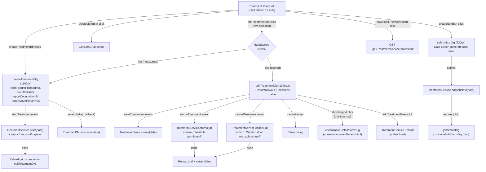
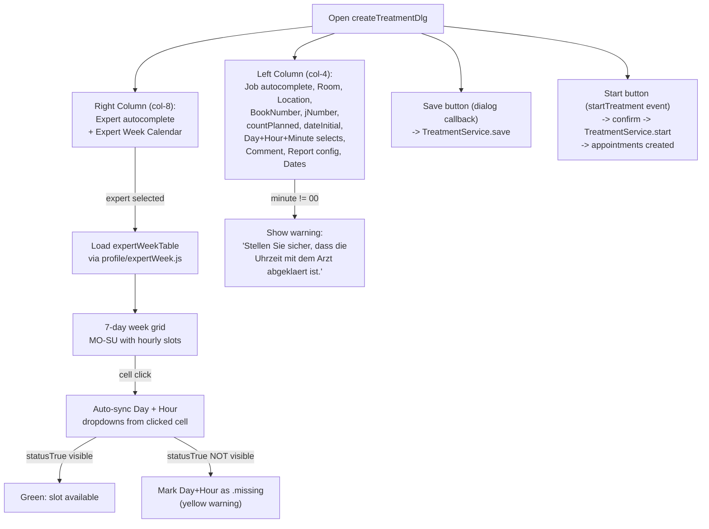
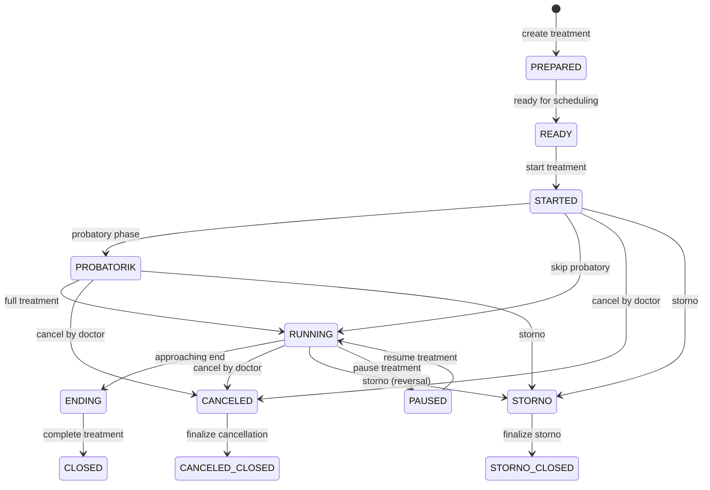

---
---

# Treatment Plan Page

This analysis covers the **Treatment Plan** page (`treatmentPlan/index.htmlm` + `treatmentPlan/index.js` + `treatmentPlan/messages.i18n.js`). The page displays treatment plans in a standard **SlickerGrid** (17 columns -- the largest grid in the codebase), with a create dialog featuring an embedded expert week calendar, and a detail/edit dialog with appointment position collections and file attachments.

**Data source**: `TreatmentService.getAllSortedLocation`, filtered by `history` flag. The grid uses client-side full-text search across assigned, location, bookNumber, jNumber, day, and job fields.

---

## Cross-References

### Script Includes

| Type | Direction | Detail | Linked Document | Condition / Context |
|------|-----------|--------|-----------------|---------------------|
| include | **Includes** | `<script src="/profile/expertWeek.js">` | [Profile Expert Availability](_shared-components/profile-expert-availability.md) | Week availability grid embedded in create dialog |

---

## Behavior Diagrams

### Dialog Navigation Diagram

### Create Treatment Wizard Flow

### TreatmentState State Machine

---

## HTMLM Header Metadata

| Field | Method | Value / Params | Purpose |
| :--- | :--- | :--- | :--- |
| `usePanel` | variable | `true` | Enables panel layout |
| `navBar` | template | `../_include/navbar.mustache` | Standard navigation bar |
| `siteloader` | template | `../_include/siteloader.mustache` | Loading indicator |
| `consultationViewDetails` | template | `../consultation/viewDetails.html` | Embedded consultation detail viewer |
| `search` | variable | `true` | Enables global site search bar (`#siteSearch`) |
| `history` | request | `history` | URL parameter toggles historical/archived treatments |
| `jobStatusDlg` | template | `../_include/jobStatusDlg.html` | Async job progress dialog |
| `treatmentState` | enum | `TreatmentState`, style `OPTION` | Rendered as `<option>` elements for grid filter column |
| `nav` | variable | `{ buttons: [...] }` | Toolbar button definitions (see Toolbar Buttons below) |

---

## Toolbar Buttons (Nav Bar)

| Button ID | Icon | Label (i18n key) | Default State | Action |
| :--- | :--- | :--- | :--- | :--- |
| `createTreatmentBtn` | `plus-square` | `action.add` | Enabled | Open createTreatmentDlg with defaults |
| `editTreatmentBtn` | `pencil` | `action.change` | **Disabled** | Open edit/create dlg based on `dateStarted` |
| `deleteMenuBtn` | `trash` | `action.delete` | **Disabled** | Delete selected treatment |
| --- | *spacer* | --- | --- | --- |
| `createNextBtn` | `calendar-week` | `action.applyPlan` | Enabled | Open selectNextDlg to generate next appointments |
| `downloadTherapyButton` | `file-export` | `Export` | Enabled | Download CSV/export from `/get/TreatmentService/download/` |

**History mode**: When `data-history="true"`, `createTreatmentBtn` and `createNextBtn` are hidden.

---

## Grid Columns (17 columns)

**Container**: `
`
**Grid type**: SlickerGrid (standard row-based grid with `fullscreen: true`)
**Data service**: `TreatmentService.getAllSortedLocation(filter, -1)`

| # | Field | Name (i18n key) | Sortable | Width | Formatter | Notes |
| :--- | :--- | :--- | :--- | :--- | :--- | :--- |
| 1 | `id` | `label.id` | Yes | 40 | (none) | Numeric ID |
| 2 | `externalUuid` | `Treatment.externalUuid` | Yes | 80 | (none) | External UUID reference |
| 3 | `assigned` | `AppointmentState.ASSIGNED` | Yes | 140 | `Formatter.name` | Assigned expert (displayName) |
| 4 | `location` | `location` | Yes | 180 | `Formatter.name` | Location object (name) |
| 5 | `bookNumber` | `consultation.booknumber` | Yes | 80 | (none) | Patient book number |
| 6 | `dateStart` | `action.dateStart` | Yes | 80 | `Formatter.dateTime` | Treatment start date |
| 7 | `day` | `WeekDay` | Yes | 80 | `Formatter.weekday` | Weekday of recurring slot |
| 8 | `startTime` | `action.dateStartTime` | Yes | 80 | (none) | Time of appointment slot |
| 9 | `jNumber` | `jNumber` (HARDCODED) | Yes | 80 | (none) | J-number reference |
| 10 | `job` | `jobId` | Yes | 180 | `Formatter.name` | Job/service type (name) |
| 11 | `state` | `Treatment.state` | Yes | 180 | `i18n.treatmentStateFormatter` | Color-coded state with icon; contains `{{{treatmentState}}}` enum options |
| 12 | `archived` | `Treatment.archived` | Yes | 80 | `Formatter.bool` | Boolean archived flag |
| 13 | `closed` | `Treatment.closed` | Yes | 100 | `Formatter.dateTime` | Date treatment was closed |
| 14 | `countTotal` | `Treatment.countCreated` | Yes | 100 | (none) | Total appointments created |
| 15 | `countFinished` | `Treatment.countFinished` | Yes | 130 | (none) | Completed appointments |
| 16 | `countPlanned` | `Treatment.countPlanned` | Yes | 110 | (none) | Planned appointments |
| 17 | `comment` | `Treatment.comment` | Yes | 310 | (none) | Free-text comment |

### Client-Side Search Filter

The `#siteSearch` input filters grid rows by matching against:
- `assigned.displayName`
- `location.name`
- `bookNumber`
- `jNumber`
- `i18n.day[item.day]` (localized weekday)
- `job.title`

Escape key clears the search.

---

## TreatmentState Machine (12 States)

| State | i18n Key | CSS Color Class | Commented Icon (not implemented) |
| :--- | :--- | :--- | :--- |
| `PREPARED` | `TreatmentState.PREPARED` | `tr-prepared` | `XXXXXXXXXXXX` (placeholder) |
| `READY` | `TreatmentState.READY` | `tr-ready` | `fa-folder-open` |
| `STARTED` | `TreatmentState.STARTED` | `tr-started` | `fa-user-plus` |
| `PROBATORIK` | `TreatmentState.PROBATORIK` | `tr-probatorik` | `XXXXXXXXXXXX` (placeholder) |
| `RUNNING` | `TreatmentState.RUNNING` | `tr-running` | `XXXXXXXXXXXX` (placeholder) |
| `ENDING` | `TreatmentState.ENDING` | `tr-ending` | `fa-forward-step` |
| `CANCELED` | `TreatmentState.CANCELED` | `tr-canceled` | `fa-slash` |
| `CANCELED_CLOSED` | `TreatmentState.CANCELED_CLOSED` | `tr-canceled_closed` | (not listed) |
| `CLOSED` | `TreatmentState.CLOSED` | `tr-closed` | `fa-door-closed` |
| `STORNO` | `TreatmentState.STORNO` | `tr-storno` | `fa-ban` |
| `STORNO_CLOSED` | `TreatmentState.STORNO_CLOSED` | `tr-storno_closed` | (not listed) |
| `PAUSED` | `TreatmentState.PAUSED` | `tr-paused` | `fa-pause` |

**Formatter logic** (`i18n.treatmentStateFormatter`): Returns `<i class="far {icon}"></i> {localizedValue}`. Icons are commented out in production, so only color classes are active. When value is null/empty, returns empty string.

---

## Create Treatment Dialog (`createTreatmentDlg`)

**Width**: 1100px
**Icon**: `fas fa-people-arrows`
**Color**: `bg-color-appointment`
**Layout**: 2 columns (col-md-4 left, col-md-8 right)

### Left Column: Form Fields

| # | Field Name | Type | Label (i18n key) | Icon | Mandatory | Service/Autocomplete | Notes |
| :--- | :--- | :--- | :--- | :--- | :--- | :--- | :--- |
| 1 | `data.job` | autocomplete (object) | `action.jobTitle` | `fa-graduation-cap` | Yes | `JobService.autocompleteType` filter `"APPOINTMENT"` | Job/service type; display=`code` |
| 2 | `data.room` | autocomplete (object) | `room` (placeholder) | `far fa-building` | No | `RoomService.autocompleteAvailableRooms` | Room selection; display=`name` |
| 3 | `data.location` | autocomplete (object) | `location` (placeholder) | `far fa-compass` | Yes | `LocationService.autocomplete` | Location; display=`name` |
| 4 | `data.bookNumber` | text | `consultation.booknumber` | -- | No | -- | Book number |
| 5 | `data.jNumber` | text | `jNumber` (HARDCODED) | -- | No | -- | Title: "JNumber used to get the bookNumber" (HARDCODED English) |
| 6 | `data.countPlanned` | number | `Treatment.countPlanned` | -- | Yes | -- | Default: 65 |
| 7 | `data.dateInitial` | date | `Treatment.countInitial` | -- | Yes | -- | Default: 5 (initial count label); tooltip: `Treatment.AppointmentCountInitialExtend.Desc` |
| 8 | `data.day` | select | -- | -- | No | -- | Weekday: MO/TU/WE/TH/FR/SA/SU |
| 9 | `data.hour` | select (number) | -- | `far fa-clock` | No | -- | Hour: 1-24 |
| 10 | `data.minutes` | select (number) | -- | -- | No | -- | Minutes: 00/15/30/45 |
| 11 | `data.comment` | textarea | `Treatment.comment` (placeholder) | -- | No | -- | Free-text |
| 12 | `data.jobReportPobatorik` | autocomplete (object) | `probatory` + `action.jobTitle` | -- | Yes | `JobService.autocompleteType` filter `"SHIFT"` | Probatory report job; display=`code` |
| 13 | `data.reportingPath` | text | -- | `fa-cloud-upload` | No | -- | Upload path (placeholder: "upload path") |
| 14 | `data.jobReport` | autocomplete (object) | `action.jobTitle` | -- | Yes | `JobService.autocompleteType` filter `"SHIFT"` | Report job; display=`code` |
| 15 | `data.reportCountInitial` | number | `Treatment.reportCountInitial` | -- | Yes | -- | Default: 5 |
| 16 | `data.reportCountRhytm` | number | `Treatment.reportCountRhytm` | `fas fa-drum` | Yes | -- | Default: 20 |
| 17 | `data.dateStart` | date | `Treatment.Start` | `fa-calendar-day` | No | -- | Treatment start date |
| 18 | `data.dateAcceptedPTLeitung` | date | `Treatment.AcceptedPTLeitung` | `fa-calendar-day` | No | -- | Accepted by PT leadership |
| 19 | `data.dateAcceptedPT` | date | `Treatment.AcceptedPT` | `fa-calendar-day` | No | -- | Accepted by PT |
| 20 | `data.dateAcceptedLocation` | date | `Treatment.AcceptedLocation` | `fa-calendar-day` | No | -- | Accepted by location |

### Right Column: Expert Selection + Week Calendar

| # | Element | Type | Details |
| :--- | :--- | :--- | :--- |
| 1 | `data.assigned` (id: `tratmentCreateExpertSelection`) | autocomplete (object) | `UserService.findDoctor`; display=`displayName`; icon: `fa-user-md` |
| 2 | `expertWeekTable` | embedded table | 7-day week view (MO-SU) with hourly slots; loaded from `profile/expertWeek.js`; hidden input `weekTypeSelection` = `"TREATMENT"` |

**Expert Week Calendar behavior**:
- On expert selection change: loads week availability data for selected expert
- On hour slot click: syncs `#selectDay` and `#selectTime` dropdowns to the clicked cell
- On dropdown change: scrolls calendar to matching row and highlights matching cell
- Slot cells have 3 visibility states: `statusNull` (circle), `statusTrue` (check), `statusFalse` (X)
- If expert is selected but slot is not `statusTrue`, dropdowns get `.missing` class (visual warning)
- Cell click adds `bg-warning` highlight class

**Minute warning**: When `data.minutes` is not `00`, shows a hardcoded German warning:
> "Stellen Sie sicher, dass die Uhrzeit mit dem Arzt abgeklaert ist."

### Dialog Buttons

| Button | Event | Position | FAB Icon | Label | Notes |
| :--- | :--- | :--- | :--- | :--- | :--- |
| Start | `startTreatment` | 30 | `fa-play` | `label.start` | Confirm: "Therapie starten? (Termine werden angelegt)" (HARDCODED German) |

### Default Values on Create

| Field | Default Value |
| :--- | :--- |
| `countInitial` | `5` |
| `countPlanned` | `65` |
| `reportCountInitial` | `5` |
| `reportCountRhytm` | `20` |
| `appointmentCountRhytmExtend` | `20` |
| `type` | `"PSYCH"` |
| `state` | `"PREPARED"` |

---

## Edit Treatment Dialog (`editTreatmentDlg`)

**Width**: 1300px
**Icon**: `fas fa-people-arrows`
**Color**: `bg-color-appointment`
**CRUD buttons**: `false` (custom button set)
**Layout**: 3 columns top row (col-md-4, col-md-4, col-md-4) + full-width bottom row with positions table and file attachments

### Top Row: Column 1 (Read-Only Info)

| Field | Type | Display |
| :--- | :--- | :--- |
| `data.assigned.displayName` | span (read-only) | Expert name; icon: `fa-user-md` |
| `data.jNumber` | span (read-only) | J-number |
| `data.bookNumber` | span (read-only) | Book number; icon: `far fa-user-injured` |
| `data.location.name` | span (read-only) | Location |
| `data.customer.name` | span (read-only) | Customer |
| `data.dateAcceptedPTLeitung` | span (date, read-only) | Accepted by PT leadership |
| `data.dateAcceptedPT` | span (date, read-only) | Accepted by PT |
| `data.dateAcceptedLocation` | span (date, read-only) | Accepted by location |
| `data.dateStart` | span (date, read-only) | Start date; label: "Start" (HARDCODED English) |

### Top Row: Column 2 (Editable Scheduling)

| # | Field Name | Type | Label | Mandatory | Notes |
| :--- | :--- | :--- | :--- | :--- | :--- |
| 1 | `data.room` | autocomplete (object) | `room` (placeholder) | No | `RoomService.autocompleteAvailableRooms` |
| 2 | `data.day` | select | -- | No | Weekday MO-SU |
| 3 | `data.hour` | select (number) | -- | No | Hour 1-24 |
| 4 | `data.minutes` | select (number) | -- | No | Minutes 00/15/30/45 |
| 5 | `data.comment` | textarea | `Treatment.comment` (placeholder) | No | Free-text |

### Top Row: Column 3 (Counts & Report Config)

| # | Field Name | Type | Label | Notes |
| :--- | :--- | :--- | :--- | :--- |
| 1 | `data.countFinished` / `data.countPlanned` | span (read-only) | `Treatment.Appointments` (HARDCODED German: "Termine") | Display: "finished/planned" |
| 2 | `data.countPlanned` | number (editable) | `Treatment.AppointmentCounts` (placeholder) | Editable planned count |
| 3 | `data.jobReportPobatorik` | autocomplete (object) | -- | `JobService.autocompleteType` filter `"APPOINTMENT"` |
| 4 | `data.reportCountInitial` | number | `Treatment.reportCountInitial` (placeholder) | Report initial count |
| 5 | `data.reportCountRhytm` | number | `Treatment.reportCountRhytm` (placeholder) | Report rhythm count |
| 6 | `data.jobReport` | autocomplete (object) | -- | `JobService.autocompleteType` filter `"SHIFT"` |
| 7 | `data.dateLastAppointment` | date | `Treatment.DateLastAppointment` | Last appointment date |
| 8 | `data.closed` | date | `Treatment.closed` | Close date |
| 9 | `data.reportingPath` | text | -- | Upload path + "Test" button (`testConnection`) |
| 10 | `data.archived` | checkbox (boolean) | `Treatment.archived` | Toggle archived state |

### Appointment Positions Collection

**Container**: `<tbody class="collection" data-field="data.positions" id="treatmentPosition">`
**Type**: jsForm collection (repeater rows)

| Column | Field | Type | Label | Notes |
| :--- | :--- | :--- | :--- | :--- |
| # | `positions.$idx` | span (index) | `#` | Auto-incrementing row number |
| Datum | `positions.date` | date input (mandatory) | `Datum` (HARDCODED German) | CSS class: `suggestType` |
| Start | `positions.timeStart` | time input (mandatory) | `Start` (HARDCODED German) | Clockpicker; `linkEndTime` linked to `timeEnd` |
| Ende | `positions.timeEnd` | time input (mandatory) | `Ende` (HARDCODED German) | Clockpicker; auto-adjusted when start changes |
| Status | `positions.state` | span (read-only) | `Status` (HARDCODED German) | Color-coded via `i18n.appointmentState()` |
| Bericht | `positions.forceReport` | checkbox | `Bericht` (HARDCODED German) | Force report flag; title: "verpflichtent" (HARDCODED German, typo) |
| -- | `positions.requireReport` | formatter (bool) | -- | Read-only formatted bool |
| -- | `positions.report.dateStart` | span (datetime) | -- | Report start; visible if `report.consultationId` exists |
| -- | `positions.report.dateEnd` | span (time) | -- | Report end time |
| Actions | (delete icon) | `fa-trash delPosition` | -- | Toggle `.deleted` class (strikethrough); if no `appointmentId`, removes row |
| Actions | (add icon in thead) | `fa-plus add` | -- | Add new position row |

**Delete behavior**: Rows with an existing `appointmentId` are soft-deleted (toggled `.deleted` CSS class with strikethrough). Rows without `appointmentId` (newly added) are hard-removed from DOM.

**Report link**: If `positions.report.consultationId` exists, clicking the `fa-file-alt showReport` icon opens `consultationDetailsViewDlg` with the consultation data.

**Time linking**: `linkStartEndTime` preserves duration -- when start time changes, end time shifts by the same delta (uses Luxon DateTime).

### File Attachments Collection

**Container**: `<tbody class="collection" data-field="data.attachments" id="treatmentFiles">`
**Type**: jsForm collection (repeater rows)

| Column | Field | Type | Label | Notes |
| :--- | :--- | :--- | :--- | :--- |
| Datei | `attachments.file.name` | link | `Datei` (HARDCODED German) | href template: `/get/TreatmentService/attachment/{data.id}/{file.id}/{file.name}` |
| Actions | (delete icon) | `fa-trash remove` | -- | Confirm delete -> `TreatmentService.removeFile(treatmentId, fileId)` |

**Upload**: `jsfileupload` on `#addTreatmentFiles` calls `TreatmentService.upload` with params `[treatmentId]`. On success, adds returned file objects to the collection.

### Dialog Buttons

| Button | Event | Position | FAB Icon | Label | Notes |
| :--- | :--- | :--- | :--- | :--- | :--- |
| Save | `saveTreatement` | 10 | `fa-save` | `dialog.ok` | Validates then saves via `asyncExecutorProgress` |
| Storno | `stornoTreatment` | 20 | `fa-store-slash` | `Storno` (HARDCODED German) | Confirm: "Wirklich stornieren?" (HARDCODED German) |
| Cancel/End | `cancelTreatment` | 30 | `fa-user-slash` | `Beenden/Abbruch` (HARDCODED German) | Confirm: "Wirklich durch Arzt abbrechen?" (HARDCODED German) |
| Close | `cancel` | 40 | `fa-times` | `dialog.cancel` | Close dialog without saving |

---

## Apply Plan Dialog (`selectNextDlg`)

**Width**: 220px
**Icon**: `fas fa-calendar-week`
**Color**: `bg-color-shift`
**Target**: `modal`

| Field | Type | Label | Notes |
| :--- | :--- | :--- | :--- |
| `data.date` | date | `end.date` combined with `Treatment` + `appointmentPlan.generateUntil` | "Generate until" date |

**Description text** (HARDCODED German): "Es werden fuer die Ausgewaehlten angewendet. Wurde niemand ausgewaehlt, wird fuer alle erstellt."

**Flow**: Submit calls `TreatmentService.publishNext(date)` which returns a `jobId`. The `jobStatusDlg` is then opened to track async job progress.

---

## Click Actions Table

| Action ID / Selector | Symbol | Title / Label | English | Notes |
| :--- | :--- | :--- | :--- | :--- |
| `createTreatmentBtn` | `fa-plus-square` | `action.add` | Add | Hidden in history mode |
| `editTreatmentBtn` | `fa-pencil` | `action.change` | Edit | Disabled until row selected; opens create or edit based on `dateStarted` |
| `deleteMenuBtn` | `fa-trash` | `action.delete` | Delete | Disabled until row selected |
| `createNextBtn` | `fa-calendar-week` | `action.applyPlan` | Apply Plan | Hidden in history mode; opens selectNextDlg |
| `downloadTherapyButton` | `fa-file-export` | `Export` | Export | HARDCODED English label |
| `startTreatment` (btn) | `fa-play` | `label.start` | Start | In createTreatmentDlg; HARDCODED German confirm |
| `saveTreatement` (btn) | `fa-save` | `dialog.ok` | OK/Save | In editTreatmentDlg; note typo "Treatement" |
| `stornoTreatment` (btn) | `fa-store-slash` | `Storno` | Storno/Reversal | HARDCODED German label + confirm |
| `cancelTreatment` (btn) | `fa-user-slash` | `Beenden/Abbruch` | End/Cancel | HARDCODED German label + confirm |
| `testConnection` (btn) | `fa-check` | `Test` | Test | HARDCODED; calls `TreatmentService.testUpload`; alert: "Erfolg!" (HARDCODED German) |
| `.delPosition` | `fa-trash` | -- | -- | Toggle soft-delete on position row |
| `.showReport` | `fa-file-alt` | -- | -- | Open consultation details for report |
| `#addTreatmentFiles` | `fa-file-plus` | `Datei hochladen` | File upload | HARDCODED German title |
| `.remove` (files) | `fa-trash` | -- | -- | Delete file attachment with confirm |

---

## Cross-Module References

| Module | Reference | Purpose |
| :--- | :--- | :--- |
| `consultation/viewDetails.html` | Template `consultationViewDetails` | Embedded dialog for viewing consultation details linked to treatment report positions |
| `_include/jobStatusDlg.html` | Template `jobStatusDlg` | Async job progress tracking dialog for `publishNext` operation |
| `profile/expertWeek.js` | Script include | Expert week availability calendar; loaded into `#expertWeekTable`; triggered by expert selection; uses `weekTypeSelection = "TREATMENT"` |
| `appointment/messages.i18n.js` | Script include | Appointment state formatters and i18n; used for position row state display (`i18n.appointmentState()`) |
| `_include/navbar.mustache` | Template `navBar` | Standard navigation bar |
| `_include/siteloader.mustache` | Template `siteloader` | Loading indicator |

---

## CSS Classes

| Class | Target | Effect |
| :--- | :--- | :--- |
| `.deleted` | Position `<tr>` | `text-decoration: line-through` (soft-delete visual) |
| `.deleted input` | Inputs inside deleted row | `background-color: gray` |
| `tr-prepared` | State span | Color for PREPARED state |
| `tr-ready` | State span | Color for READY state |
| `tr-started` | State span | Color for STARTED state |
| `tr-probatorik` | State span | Color for PROBATORIK state |
| `tr-running` | State span | Color for RUNNING state |
| `tr-ending` | State span | Color for ENDING state |
| `tr-canceled` | State span | Color for CANCELED state |
| `tr-canceled_closed` | State span | Color for CANCELED_CLOSED state |
| `tr-closed` | State span | Color for CLOSED state |
| `tr-storno` | State span | Color for STORNO state |
| `tr-storno_closed` | State span | Color for STORNO_CLOSED state |
| `tr-paused` | State span | Color for PAUSED state |
| `.missing` | Day/Time selects | Warning highlight when expert slot is unavailable |
| `.bg-warning` | Week calendar cell | Highlights selected time slot |

---

## Translation Table

| Text Reference | German (Source) | English | Notes |
| :--- | :--- | :--- | :--- |
| `Treatment` | Behandlung | Treatment | i18n key |
| `Treatment.state` | Status | State | i18n key |
| `Treatment.archived` | Archiviert | Archived | i18n key |
| `Treatment.closed` | Geschlossen | Closed | i18n key |
| `Treatment.comment` | Kommentar | Comment | i18n key |
| `Treatment.externalUuid` | Externe UUID | External UUID | i18n key |
| `Treatment.countCreated` | Anzahl erstellt | Number created | i18n key |
| `Treatment.countFinished` | Anzahl abgeschlossen | Number completed | i18n key |
| `Treatment.countPlanned` | Anzahl geplant | Number planned | i18n key |
| `Treatment.Appointments` | **Termine** | Appointments | **HARDCODED German** in both dialogs |
| `Treatment.Location` | Standort | Location | i18n key |
| `Treatment.DateAccepted` | Datum akzeptiert | Date Accepted | i18n key |
| `Treatment.Start` | Start | Start | i18n key |
| `Treatment.AcceptedPTLeitung` | Akzeptiert PT Leitung | Accepted PT Leadership | i18n key |
| `Treatment.AcceptedPT` | Akzeptiert PT | Accepted PT | i18n key |
| `Treatment.AcceptedLocation` | Akzeptiert Standort | Accepted Location | i18n key |
| `Treatment.report` | Bericht | Report | i18n key |
| `Treatment.reports` | Berichte | Reports | i18n key |
| `Treatment.reportCountInitial` | Bericht Anfang | Report Initial Count | i18n key |
| `Treatment.reportCountRhytm` | Bericht Rhythmus | Report Rhythm | i18n key |
| `Treatment.countInitial` | Anfang | Initial Count | i18n key |
| `Treatment.customer` | Kunde | Customer | i18n key |
| `Treatment.DateLastAppointment` | Letzter Termin | Last Appointment Date | i18n key |
| `action.applyPlan` | Plan anwenden | Apply Plan | i18n key |
| `action.jobTitle` | Leistung | Job Title | i18n key |
| `probatory` | Probatorisch | Probatory | i18n key |
| `WeekDay` | Wochentag | Weekday | i18n key |
| `WeekDay.MO` - `WeekDay.SU` | Mo-So | Mon-Sun | i18n keys |
| `room` | Raum | Room | i18n key |
| `location` | Standort | Location | i18n key |
| `consultation.booknumber` | Buchnummer | Book Number | i18n key |
| `end.date` | Enddatum | End Date | i18n key |
| `appointmentPlan.generateUntil` | Erstellen bis | Generate Until | i18n key |
| -- | `Stellen Sie sicher, dass die Uhrzeit mit dem Arzt abgeklaert ist.` | Make sure the time is agreed with the doctor. | **HARDCODED German** `#minuteWarning` |
| -- | `Wirklich stornieren?` | Really reverse? | **HARDCODED German** confirm |
| -- | `Wirklich durch Arzt abbrechen?` | Really cancel by doctor? | **HARDCODED German** confirm |
| -- | `Therapie starten? (Termine werden angelegt)` | Start therapy? (Appointments will be created) | **HARDCODED German** confirm |
| -- | `Behandelnder Arzt` | Treating Doctor | **HARDCODED German** title attribute |
| -- | `Abgeschlossen` / `Geplant` | Completed / Planned | **HARDCODED German** title attributes |
| -- | `Datum` | Date | **HARDCODED German** positions table header |
| -- | `Start` / `Ende` | Start / End | **HARDCODED German** positions table headers |
| -- | `Status` | Status | **HARDCODED German** positions table header |
| -- | `Bericht` | Report | **HARDCODED German** positions table header |
| -- | `Datei` | File | **HARDCODED German** files table header |
| -- | `Datei hochladen` | Upload file | **HARDCODED German** upload button title |
| -- | `verpflichtent` | mandatory (typo: should be "verpflichtend") | **HARDCODED German** title; contains typo |
| -- | `Erfolg!` | Success! | **HARDCODED German** testConnection alert |
| -- | `Es werden fuer die Ausgewaehlten angewendet...` | Will be applied for selected. If none selected, created for all. | **HARDCODED German** selectNextDlg description |
| -- | `jNumber` | jNumber | **HARDCODED English** column name and labels |
| -- | `Export` | Export | **HARDCODED English** nav button |
| -- | `upload path` | upload path | **HARDCODED English** placeholder |
| -- | `Test` | Test | **HARDCODED English** button label |
| -- | `Start` (edit dlg col-1) | Start | **HARDCODED English** label in edit dialog |
| -- | `JNumber used to get the bookNumber` | -- | **HARDCODED English** tooltip |

---

## Additional Formatters

| Formatter | Location | Signature | Purpose |
| :--- | :--- | :--- | :--- |
| `Formatter.hourminute` | `messages.i18n.js` | `(row, cell, value, ref, data)` | Formats hour value as `HH:MM` using `value` (hour) and `data.minutes`; pads with leading zero |
| `i18n.treatmentState` | `messages.i18n.js` | `(value)` | Returns `{ color, icon, value }` object for a state; null returns `{ color:'', value:'', icon:'fa-question' }` |
| `i18n.treatmentStateFormatter` | `messages.i18n.js` | `(row, cell, value)` | Grid cell formatter wrapping `treatmentState()` output in colored span with icon |

---

## Key Implementation Notes

1. **Largest grid**: 17 columns makes this the widest grid in the legacy codebase
2. **Dual dialog pattern**: Editing opens `createTreatmentDlg` (with expert week calendar) when treatment has not started, and `editTreatmentDlg` (with positions/files) when it has been started -- behavior is determined by checking `dateStarted` on the fetched record
3. **Expert week calendar integration**: The create dialog embeds a full week availability grid from `profile/expertWeek.js` that bidirectionally syncs with the day/hour dropdown selects
4. **Async operations**: Save, start, storno, and cancel all use `asyncExecutorProgress` for long-running server operations with progress feedback
5. **Apply plan** (`publishNext`): Generates future appointments from the treatment plan up to a selected date; tracked as an async job via `jobStatusDlg`
6. **History mode**: URL parameter `?history=true` switches to showing historical/archived treatments and hides create/apply-plan buttons
7. **Typo in event name**: `saveTreatement` (extra 'e') is the actual event name in both HTML and JS
8. **Time linking**: Position start/end times are linked so changing start preserves the appointment duration (Luxon-based calculation)
9. **Soft delete pattern**: Position rows with existing `appointmentId` use CSS strikethrough toggle rather than DOM removal
10. **Hardcoded strings**: Extensive hardcoded German strings in both dialogs, positions table headers, confirm dialogs, and the selectNextDlg -- all need i18n migration
