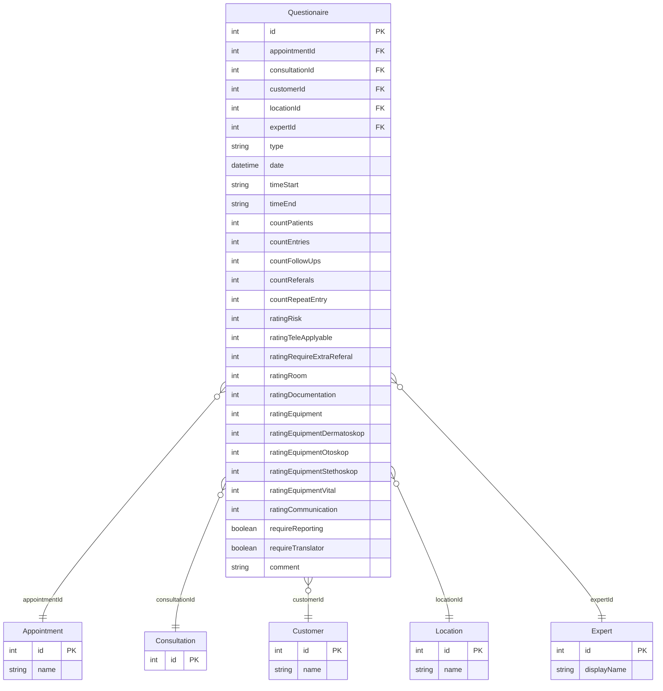

---
---

# Questionnaire List Page with Inline Detail

---

## 1. Block: Questionnaire List

### HTMLM Metadata

| Property       | Value                                          |
| -------------- | ---------------------------------------------- |
| Templates      | `navbar` (`../_include/navbar.mustache`)        |
| Variables      | `usePanel = true`                               |
| Filter panel   | **Disabled** (`filter: false`)                  |
| Container ID   | `#questionaire`                                 |
| CSS class      | `tableView`                                     |
| Data limit     | `100`                                           |

### Service Binding (from `index.js`)

| Property       | Value                          |
| -------------- | ------------------------------ |
| Service name   | `QuestionaireService`          |
| List method    | `getAll`                       |
| Detail method  | `get`                          |
| Grid plugin    | `slickerGrid` (fullscreen)     |
| Load guard     | `Core.hasLoaded("questionaireLoaded")` |
| Save settings  | `UserService.saveSetting` (persists grid column settings per user) |
| Data limit     | `100` (passed as second param to `getAll`) |

---

## 2. Grid Columns (24 columns)

All columns share: `data-sortable="true"`, `data-resizable="true"`, `data-width="80"`.

| # | `data-field` | `data-name` | `data-formatter` | Notes |
|---|---|---|---|---|
| 1 | `id` | `id` | — | Primary key |
| 2 | `appointmentId` | `appointmentId` | — | FK to Appointment |
| 3 | `consultationId` | `consultationId` | — | FK to Consultation |
| 4 | `customerId` | `customerId` | — | FK to Customer |
| 5 | `locationId` | `locationId` | — | FK to Location |
| 6 | `expertId` | `expertId` | — | FK to Expert/Doctor |
| 7 | `type` | `type` | — | Questionnaire type |
| 8 | `date` | `date` | `Formatter.dateTime` | Appointment date |
| 9 | `timeStart` | `timeStart` | — | Start time |
| 10 | `timeEnd` | `timeEnd` | — | End time |
| 11 | `countPatients` | `countPatients` | — | Number of patients |
| 12 | `ratingRisk` | `ratingRisk` | — | Risk rating |
| 13 | `ratingTeleApplyable` | `ratingTeleApplyable` | — | Telemedicine applicability rating |
| 14 | `ratingRequireExtraReferal` | `ratingRequireExtraReferal` | — | Extra referral likelihood |
| 15 | `ratingRoom` | `ratingRoom` | — | Room conditions rating |
| 16 | `ratingDocumentation` | `ratingDocumentation` | — | Documentation rating |
| 17 | `requireReporting` | `requireReporting` | `Formatter.bool` | Forwarding to medical management |
| 18 | `ratingEquipment` | `ratingEquipment` | — | Video/connection quality rating |
| 19 | `ratingCommunication` | `ratingCommunication` | — | Staff cooperation rating |
| 20 | `requireTranslator` | `requireTranslator` | `Formatter.bool` | Interpreter needed |
| 21 | `comment` | `comment` | — | Free-text comment |
| 22 | `countEntries` | `countEntries` | — | Number of admissions |
| 23 | `countFollowUps` | `countFollowUps` | — | Number of follow-ups |
| 24 | `countReferals` | `countReferals` | — | Number of referrals |

**Formatters used**: `Formatter.dateTime` (column 8), `Formatter.bool` (columns 17, 20).

---

## 3. Toolbar Buttons

| Button ID        | Label (i18n)    | Icon          | Disabled | Notes |
| ---------------- | --------------- | ------------- | -------- | ----- |
| `editMenuBtn`    | `action.change` | `pencil`      | `true`   | Edit questionnaire |
| `deleteMenuBtn`  | `action.delete` | `trash`       | `true`   | Delete questionnaire |
| *(spacer)*       | —               | —             | —        | Visual separator |
| `someActionBtn`  | `Action`        | `lock-alt`    | `true`   | Unknown/lock action (HARDCODED label "Action") |

All buttons start disabled. No JS logic enables them (the `rowSelected` handler at line 43 is empty), so these buttons appear permanently non-functional in the current codebase.

---

## 4. Inline Detail Panel

### Detail Container Attributes

| Attribute    | Value                        |
| ------------ | ---------------------------- |
| `data-icon`  | `fas fa-boxes`               |
| `data-color` | `bg-color-appointment`       |
| `data-width` | `800`                        |
| `title`      | `{{i18n.questionaire}}`      |
| Initial CSS  | `display:none`               |

### 4.1 Header Fields (row, Bootstrap grid)

| Col Width | Label (i18n) | Data Binding | Notes |
|---|---|---|---|
| `col-md-2` | `{{i18n.appointment}}:` | `data.appointment.name` | Appointment name |
| `col-md-3` | `{{i18n.consultation}}:` | `data.consultation` | Consultation (raw value, not `.name`) |
| `col-md-4` | *(none)* | `data.customer.name` | Customer name (no label) |
| `col-md-4` | *(none)* | `data.location.name` | Location name (no label) |
| `col-md-4` | *(none)* | `data.expert.displayName` | Expert display name (no label) |
| `col-md-2` | `fa-calendar-day` icon | `data.qm.date` (class `date`), `data.qm.timeStart` - `data.qm.timeEnd` | Date and time range |

**Note**: The Bootstrap column widths sum to more than 12 per row (2+3+4+4+4+2 = 19), causing wrapping to multiple visual rows. The layout relies on Bootstrap's row wrapping behavior.

### 4.2 Appointment Counts Section

**Header**: `<h3>Appointment</h3>` -- **HARDCODED in English** (not using i18n)

| Col Width | Label (i18n) | Data Binding |
|---|---|---|
| `col-md-4` | `{{i18n.appointment.patients}}` | `data.qm.countPatients` |
| `col-md-4` | `{{i18n.Questionaire.countEntries}}` | `data.qm.countEntries` |
| `col-md-4` | `{{i18n.Questionaire.countFollowUps}}` | `data.qm.countFollowUps` |
| `col-md-4` | `{{i18n.Questionaire.countReferals}}` | `data.qm.countReferals` |
| `col-md-6` | `{{i18n.Questionaire.countRepeatEntry}}` | `data.qm.countRepeatEntry` |

### 4.3 Questions/Ratings Table

**Header**: `<h3>{{i18n.questions}}</h3>` (translated)

Table has `style="overflow:auto;max-height:calc(100vh - 110px)"` for vertical scrolling.

All rating rows use `class="radioNext"` on the value `<td>`, indicating a radio-button group renderer.

| # | i18n Key | Data Binding | Icon | `allowHiding` | Hidden Input | Default |
|---|---|---|---|---|---|---|
| 1 | `Questionaire.ratingTeleApplyable` | `data.qm.ratingTeleApplyable` | — | Yes | — | — |
| 2 | `Questionaire.ratingEquipmentDermatoskop` | `data.qm.ratingEquipmentDermatoskop` | `far fa-wifi` | Yes | `value="-1"`, `display:none` | `-1` |
| 3 | `Questionaire.ratingEquipmentOtoskop` | `data.qm.ratingEquipmentOtoskop` | `far fa-wifi` | Yes | `value="-1"`, `display:none` | `-1` |
| 4 | `Questionaire.ratingEquipmentStethoskop` | `data.qm.ratingEquipmentStethoskop` | `far fa-wifi` | Yes | `value="-1"`, `display:none` | `-1` |
| 5 | `Questionaire.ratingEquipmentVital` | `data.qm.ratingEquipmentVital` | `far fa-wifi` | Yes | `value="-1"`, `visibility:hidden` | `-1` |
| 6 | `Questionaire.ratingRoom` | `data.qm.ratingRoom` | — | Yes | — | — |
| 7 | `Questionaire.ratingEquipment` | `data.qm.ratingEquipment` | — | Yes | — | — |
| 8 | ~~`Questionaire.ratingRisk`~~ | ~~`data.qm.ratingRisk`~~ | — | ~~`qmshift`~~ | — | — |
| 9 | `Questionaire.ratingRequireExtraReferal` | `data.qm.ratingRequireExtraReferal` | — | Yes | — | — |
| 10 | `Questionaire.ratingCommunication` | `data.qm.ratingCommunication` | — | Yes | — | — |
| 11 | `Questionaire.requireTranslator` | `data.qm.requireTranslator` | — | **No** | — | — |
| 12 | `Questionaire.requireReporting` | `data.qm.requireReporting` | — | **No** | — | — |

**Row 8 is dead code** (see section 6).

After the table, a free-text comment is rendered: `<div class="field">data.qm.comment</div>`

### 4.4 allowHiding Behavior (from `index.js` lines 47-57)

On the `filled` event (after detail data loads), each `.allowHiding` row is inspected:
- If the `.field` span's HTML content equals `"-1"`, the row is **hidden** (`$(this).hide()`)
- Otherwise the row is **shown** (`$(this).show()`)

This means equipment-specific ratings (dermatoscope, otoscope, stethoscope, vital signs) default to `-1` and are hidden when not applicable. The hidden `<input>` elements with `value="-1"` serve as default form values for save operations.

---

## 5. Hidden Inputs with Default Values

| Field | Input `name` | Default `value` | CSS Hiding Method |
|---|---|---|---|
| Dermatoscope rating | `data.qm.ratingEquipmentDermatoskop` | `-1` | `display:none` |
| Otoscope rating | `data.qm.ratingEquipmentOtoskop` | `-1` | `display:none` |
| Stethoscope rating | `data.qm.ratingEquipmentStethoskop` | `-1` | `display:none` |
| Vital signs rating | `data.qm.ratingEquipmentVital` | `-1` | `visibility:hidden` |

**Inconsistency**: Three inputs use `display:none`, but the vital signs input uses `visibility:hidden`. The behavioral difference is minor (both are invisible), but it is an inconsistency worth noting.

---

## 6. Dead Code

### Commented-out `ratingRisk` row (lines 169-176)

```html
<!--
<tr class="qmshift">
    <td class="th">{{i18n.Questionaire.ratingRisk}}</td>
    <td class="radioNext">
        <span class="field">data.qm.ratingRisk"/>
    </td>
</tr>
 -->
```

**Observations**:
- Uses class `qmshift` instead of `allowHiding` (different toggle group)
- Contains a **syntax error**: `data.qm.ratingRisk"/>` has a stray `"/>` (malformed self-closing tag mixed with span content)
- The `ratingRisk` field still exists in the grid (column 12), indicating partial removal
- The `ratingRisk` translation key exists: `Questionaire.ratingRisk = Risk` / `Risiko`
- **Recommendation**: Do not implement this field in the detail view. Keep only if reporting/grid needs it.

### Empty `rowSelected` handler (line 43-45)

```js
$grid.on("rowSelected", function(ev, data){
    // ...
});
```

The handler body is empty, meaning toolbar buttons never get enabled on row selection. This is likely incomplete functionality.

---

## 7. Translation Table

| i18n Key | EN | DE | Source |
|---|---|---|---|
| `Questionaire` | Questionaire | Fragebogen | i18n |
| `questionaire` | Questionaire | Fragebogen | i18n |
| `questions` | Questions | Fragen | i18n |
| `appointment.patients` | Patients | Patienten | i18n |
| `Questionaire.countEntries` | Number of admissions | Anzahl Einweisungen | i18n |
| `Questionaire.countFollowUps` | Number of follow-up appointments | Anzahl Folgetermine | i18n |
| `Questionaire.countReferals` | Number of transfers | Anzahl Überweisungen | i18n |
| `Questionaire.countRepeatEntry` | Number of re-presentations in the event of deterioration | Anzahl Wiedervorstellung bei Verschlechterung | i18n |
| `Questionaire.ratingCommunication` | Please rate the cooperation with the staff present | *(not provided)* | i18n |
| `Questionaire.ratingEquipment` | Please rate the video/connection quality of your patient! | *(not provided)* | i18n |
| `Questionaire.ratingEquipmentDermatoskop` | How do you rate the use of the digital dermatoscope? | *(not provided)* | i18n |
| `Questionaire.ratingEquipmentOtoskop` | How do you rate the use of the digital otoscope? | *(not provided)* | i18n |
| `Questionaire.ratingEquipmentStethoskop` | How do you rate the use of the digital stethoscope? | *(not provided)* | i18n |
| `Questionaire.ratingEquipmentVital` | How do you rate the use of the vital signs monitor? | *(not provided)* | i18n |
| `Questionaire.ratingRequireExtraReferal` | Without your treatment, how likely would an immediate evacuation or immediate external referral have been necessary? | *(not provided)* | i18n |
| `Questionaire.ratingRisk` | Risk | *(not provided)* | i18n (dead code) |
| `Questionaire.ratingRoom` | Please assess the spatial conditions during the treatment! | *(not provided)* | i18n |
| `Questionaire.ratingTeleApplyable` | How well was/are the treatment(s) treatable by telemedicine? | *(not provided)* | i18n |
| `Questionaire.requireReporting` | Would you like your case to be forwarded to the medical management of the video clinic for review? | *(not provided)* | i18n |
| `Questionaire.requireTranslator` | Was an interpreter necessary for the treatment? | *(not provided)* | i18n |
| `"Appointment"` (h3 tag) | Appointment | **HARDCODED** | HTML line 78 |
| `"Action"` (button label) | Action | **HARDCODED** | HTMLM header line 11 |

### HARDCODED Strings

| String | Location | Issue |
|---|---|---|
| `"Appointment"` | `<h3>` at line 78 | Should use `{{i18n.appointment}}` |
| `"Action"` | Toolbar button `someActionBtn` label (line 11) | Should use an i18n key |

---

## 8. Data Model Diagram



### Field Type Notes

- **Rating fields** (`ratingTeleApplyable`, `ratingRoom`, `ratingEquipment`, `ratingCommunication`, `ratingRequireExtraReferal`, `ratingRisk`): Rendered as `radioNext` (radio button groups), likely integer scale 1-6 based on German comments (e.g., "1-6").
- **Equipment-specific ratings** (`ratingEquipmentDermatoskop`, `ratingEquipmentOtoskop`, `ratingEquipmentStethoskop`, `ratingEquipmentVital`): Same radio scale, but default to `-1` (meaning "not applicable / not used").
- **Boolean fields** (`requireReporting`, `requireTranslator`): Formatted with `Formatter.bool` in grid.
- **`ratingDocumentation`**: Present in grid columns but **absent from the detail panel** -- only visible in the list grid.
- **Joined relations**: The detail panel accesses nested objects (`data.appointment.name`, `data.customer.name`, `data.location.name`, `data.expert.displayName`), indicating the `get` method returns eagerly joined data. The `consultation` field uses `data.consultation` directly (no `.name`), suggesting it may be a plain ID or string.

---

## 9. Implementation Notes for React/Shadcn

### Key Behaviors to Preserve
1. **Conditional row visibility**: Equipment rating rows hidden when value is `-1`. Implement with conditional rendering based on field value, not CSS toggle.
2. **Radio scale inputs**: The `radioNext` class indicates a 1-6 radio button group for ratings. Consider a reusable `<RatingScale>` component.
3. **Default `-1` for equipment ratings**: These represent "not applicable". In the React model, use `null` or `undefined` instead of `-1` as a sentinel value.
4. **Detail panel is read-only display**: Despite having `<input>` elements and `onSave` in CRUD init, the detail appears primarily to be a read-only view (no save button visible, no form submission logic beyond `Core.initCrud`).
5. **Grid settings persistence**: Column widths/order saved per user via `UserService.saveSetting`.

### Fields in Grid but NOT in Detail
- `ratingDocumentation` -- grid column 16, absent from detail panel
- `ratingRisk` -- grid column 12, commented out in detail (dead code)

### Spelling Inconsistencies in Legacy Code
- `questionaire` (should be `questionnaire`)
- `countReferals` (should be `countReferrals`)
- `ratingRequireExtraReferal` (should be `ratingRequireExtraReferral`)
- `ratingEquipmentDermatoskop` (German spelling, English: `dermatoscope`)
- `ratingEquipmentOtoskop` (German spelling, English: `otoscope`)
- `ratingEquipmentStethoskop` (German spelling, English: `stethoscope`)

These should be normalized to correct English spelling in the reimplementation, with migration mappings documented.

---

## Cross-References

| Type | Direction | Detail | Linked Document | Condition / Context |
|------|-----------|--------|-----------------|---------------------|
| include | **Included by** | `{{> questionaire}}` | [Dialogs Treatment](../dashboard/dialogs-treatment.md) | QM list partial in treatment dashboard dialogs |
| include | **Included by** | `{{> questionaire}}` | [Appointment Admin](07-appointment-admin/appointment-admin.md) | QM list view in admin panel |
| service | **Uses** | `QuestionaireService.getAll` | [Questionnaire Detail](questionnaire-detail.md) | List service; `get` used for inline detail panel |
| service | **Uses** | `UserService.saveSetting` | [Profile Staff](_shared-components/profile-staff.md) | Persists grid column settings per user |
| event | **Incoming** | `rowSelected` | [Consultation Details JS](../consultation/consultation-details-js.md) | Empty handler; toolbar buttons never enabled on row selection |
| entity | **References** | `Appointment` | [Appointment Details Patient](appointment-details-patient.md) | FK via `appointmentId` (column 2) |
| entity | **References** | `Consultation` | [Consultation Details Standard](../consultation/consultation-details-standard.md) | FK via `consultationId` (column 3) |
| entity | **References** | `Customer` | [Customer List Detail](09-customers/customer-list-detail.md) | FK via `customerId` (column 4) |
| entity | **References** | `Location` | [Location And Users](09-customers/locations.md) | FK via `locationId` (column 5) |
| entity | **References** | `Expert` | [Profile Staff](_shared-components/profile-staff.md) | FK via `expertId` (column 6); expert profile |

> **Include context:** This page is the QM list entry point. Its companion detail dialog is documented in [Questionnaire Detail](questionnaire-detail.md). The `QuestionaireService` is shared with the detail dialog via `getAll` (list) and `get` (inline detail fetch).