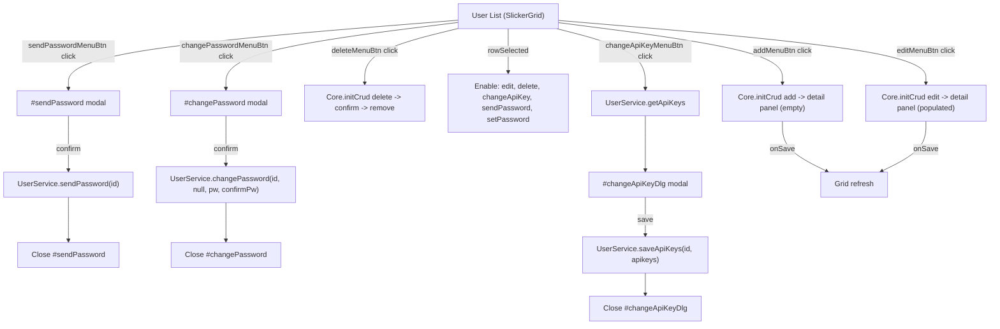
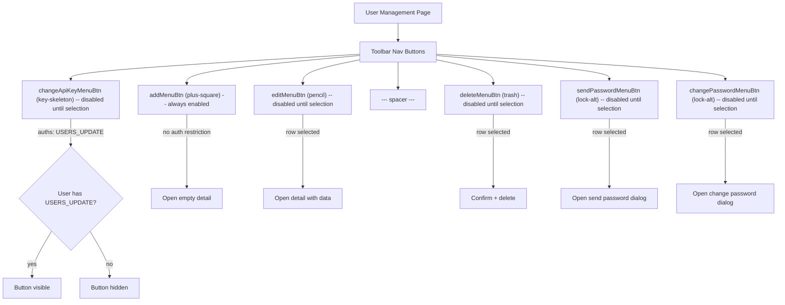

# Admin User Management Page

This analysis covers the **Admin User Management** page (`admin/user.htmlm` + `admin/user.js`). The page displays a user list in a SlickerGrid data grid with QuickFilter (A-Z alphabetical filtering), full-text search, and an inline detail panel for editing user properties. It includes three dialogs: Send Password, Set Password, and API Key management.

**Data source**: `UserService.getAll` via `slickerGrid`, with `UserService.get` for detail retrieval and `UserService.saveUser` for persistence.

---

## Behavior Diagrams

### Dialog Navigation Diagram

### Toolbar Permission Diagram

---

## HTMLM Header Metadata

| Field | Method | Value / Params | Purpose |
| :--- | :--- | :--- | :--- |
| `usePanel` | variable | `true` | Enables panel layout |
| `navBar` | template | `../_include/navbar.mustache` | Standard navigation bar |
| `sendPasswordDlg` | template | `../admin/password.mustache` | Send password confirmation dialog |
| `passwordDlg` | template | `../profile/passwordDlg.html` | Change/set password dialog (shared with profile) |
| `quickFilter` | template | `../_include/quickFilter.mustache` | A-Z alphabetical quick filter bar |
| `profile` | template | `../profile/userProfile.mustache` | Shared user profile form (embedded, analyzed separately) |
| `search` | variable | `true` | Enables global site search bar (`#siteSearch`) |
| `quickFilterData` | variable | `{ full: [A-Z, #], short: [A-D, E-H, ...], input: true }` | QuickFilter letter ranges + free text input |
| `nav` | variable | `{ filter: true, buttons: [...] }` | Toolbar button definitions (see below) |

---

## Block: User List Grid (SlickerGrid)

**Container**: `
`
**Grid type**: SlickerGrid (row-based data grid with sorting, resizing, filtering)
**Data fetch**: `UserService.getAll(filter, 100)` where `filter` comes from `$this.data().filter`
**Data processing**: Flattens `userProfile` sub-object fields onto the row object (firstName, lastName, etc.)

### Grid Columns

| # | Field | Name (i18n key) | Sortable | Resizable | Width | Formatter |
| :--- | :--- | :--- | :--- | :--- | :--- | :--- |
| 1 | `id` | `label.id` | Yes | Yes | 80 | `Formatter.id` |
| 2 | `username` | `user.username` | Yes | Yes | 300 | (none -- plain text) |
| 3 | `email` | `user.email` | Yes | Yes | 180 | (none -- plain text) |
| 4 | `firstName` | `user.firstName` | Yes | Yes | 80 | (none -- plain text) |
| 5 | `lastName` | `user.lastName` | Yes | Yes | 80 | (none -- plain text) |
| 6 | `dateTwoFactor` | `2FA` (HARDCODED) | Yes | Yes | 100 | `Formatter.dateTime` |
| 7 | `role` | `label.id` | Yes | Yes | 100 | `Formatter.role` (renders localized role name) |
| 8 | `enabled` | Icon: `fa-lightbulb-on` | No | No | 30 | `Formatter.bool` (checkmark/blank) |
| 9 | `accountLocked` | Icon: `fa-lock` | No | No | 30 | `Formatter.boolStop` (stop icon/blank) |

### QuickFilter

The QuickFilter targets the `username` field (`$("#quickFilter").data().field = "username"`).

| Mode | Values | Usage |
| :--- | :--- | :--- |
| Full (desktop) | A, B, C, D, E, F, G, H, I, J, K, L, M, N, O, P, Q, R, S, T, U, V, W, X, Y, Z, # | Each letter filters usernames starting with that letter |
| Short (mobile) | A-D, E-H, I-L, M-P, Q-T, U-X, Y-Z# | Grouped ranges for smaller screens |
| Input | Free text input | Available alongside letter buttons |

### Full-Text Search (siteSearch)

The `#siteSearch` input triggers client-side filtering on the loaded data. The filter function searches across:
- `firstName` (case-insensitive substring)
- `lastName` (case-insensitive substring)
- `username` (case-insensitive substring)
- `email` (case-insensitive substring)

Escape key clears the search.

### Grid Row Selection Behavior

On `rowSelected` event, the following buttons are enabled and receive the selected row's data:
- `#changePasswordMenuBtn`
- `#sendPasswordMenuBtn`
- `#changeApiKeyMenuBtn`

---

## Block: User Detail Panel (Inline Form)

**Container**: `
`
**CRUD config**: `Core.initCrud` with `UserService.get` / `UserService.saveUser`
**onSave cleanup**: Strips `accessRights`, `actions`, `worklog` from data before saving.

### Form Elements -- Left Column

| # | Text-Reference / Name | Symbol | Data Model | Type | Options | Placeholder | Default | Required | Read-only | Condition |
| :--- | :--- | :--- | :--- | :--- | :--- | :--- | :--- | :--- | :--- | :--- |
| 1 | `user.username` | `far fa-sign-in` | `data.username` | text | -- | `user.username` | -- | Yes (`mandatory`) | No | -- |
| 2 | `user.email` | `@` | `data.email` | email | -- | `user.email` | -- | Yes (`mandatory`, `email`) | No | -- |
| 3 | `user.firstName` | -- | `data.userProfile.firstName` | text | -- | `user.firstName` | -- | Yes (`mandatory`) | No | -- |
| 4 | `user.lastName` | -- | `data.userProfile.lastName` | text | -- | `user.lastName` | -- | Yes (`mandatory`) | No | -- |
| 5 | `user.enabled` | Switch | `data.enabled` | checkbox (switch) | -- | -- | -- | No | No | Shows `countInvalidLogin` with warning icon |
| 6 | `employee.status` | Label text | `data.employeeState` | select | UNCONFIRMED, ACTIVE, SICK, HOLIDAY, INACTIVE | -- | -- | No | No | -- |
| 7 | `user.locked` | Switch | `data.accountLocked` | checkbox (switch) | -- | -- | -- | No | No | Shows `dateLocked` datetime |
| 8 | `user.requireTotp` | Switch | `data.requireTotp` | checkbox (switch) | -- | -- | -- | No | No | -- |
| 9 | Two-Factor Info | `far fa-phone-laptop` | `data.dateTwoFactor` | display (datetime) | -- | -- | -- | No | Yes | Hidden if `!dateTwoFactor`; includes reset trash icon |
| 10 | `user.secondFactorNotificationText` | -- | -- | paragraph (muted) | -- | -- | -- | -- | Yes | Always shown |

### Form Elements -- Right Column

| # | Text-Reference / Name | Symbol | Data Model | Type | Options | Placeholder | Default | Required | Read-only | Condition |
| :--- | :--- | :--- | :--- | :--- | :--- | :--- | :--- | :--- | :--- | :--- |
| 11 | `user.role` | `@` | `data.role` | select | REGISTERED, STANDARD, KUNDE, ADMIN_KUNDE, LEITER_INTERN, ADMIN_INTERN, ADMIN | -- | -- | No | No | -- |
| 12 | Groups list | -- | `data.groups` | collection (list) | -- | -- | -- | No | No | Each item shows `name (role)` with delete icon |
| 13 | Group selector | -- | `data.groups` (insert) | select | Grouped by role: GUEST, STANDARD, KUNDE, ADMIN_KUNDE, LEITER_INTERN, ADMIN_INTERN, ADMIN | `group.select` | -- | No | No | Options loaded from `GroupService.getAll` |
| 14 | Customer list | -- | `data.customers` | collection (list) | -- | -- | -- | No | No | Each item shows `name` with delete icon |
| 15 | Customer selector | -- | `data.customers` (insert) | autocomplete | `data-display="name"` | -- | -- | No | No | Autocomplete search field |

### Employee State Enum

| Value | i18n Key | Description |
| :--- | :--- | :--- |
| `UNCONFIRMED` | `EmployeeState.UNCONFIRMED` | Not yet confirmed |
| `ACTIVE` | `EmployeeState.ACTIVE` | Active employee |
| `SICK` | `EmployeeState.SICK` | On sick leave |
| `HOLIDAY` | `EmployeeState.HOLIDAY` | On holiday |
| `INACTIVE` | `EmployeeState.INACTIVE` | Inactive / deactivated |

### Role Enum

| Value | i18n Key | Suffix (HARDCODED) |
| :--- | :--- | :--- |
| `REGISTERED` | `role.REGISTERED` | `(Registered)` |
| `STANDARD` | `role.STANDARD` | `(Standard)` |
| `KUNDE` | `role.KUNDE` | -- |
| `ADMIN_KUNDE` | `role.ADMIN_KUNDE` | -- |
| `LEITER_INTERN` | `role.LEITER_INTERN` | `(Leiter Intern)` |
| `ADMIN_INTERN` | `role.ADMIN_INTERN` | `(Admin Intern)` |
| `ADMIN` | `role.ADMIN` | -- |

### Two-Factor Reset Action

- **Trigger**: Click `#twoFactorReset` (trash icon next to 2FA date)
- **Guard**: Requires `dateTwoFactor` to be truthy AND user confirmation via `confirm(i18n.dialog_confirmUnrevertable)`
- **Action**: `UserService.clearTotp(id)`
- **Effect**: Hides `.twoFactorInfo` block

---

## Block: API Key Dialog

**Container**: `
`
**Permission**: Button gated by `auths="USERS_UPDATE"`
**Data load**: `UserService.getApiKeys(id)` -- transforms `whitelist` array to `whitelistText` (semicolon-joined)
**Save**: `UserService.saveApiKeys(id, apikeys)` -- parses `whitelistText` back to `whitelist` array (splits on spaces, normalizes commas/semicolons)

### API Key Table Columns

| # | Field | Header | Type | Editable | Notes |
| :--- | :--- | :--- | :--- | :--- | :--- |
| 1 | `apikeys.key` | Key (HARDCODED) | display text | No | Auto-generated key value |
| 2 | `apikeys.whitelistText` | IP (HARDCODED) | text input | Yes | Placeholder: `0.0.0.0/0` |
| 3 | `apikeys.enabled` | Active (HARDCODED) | checkbox | Yes | Boolean toggle |
| 4 | `apikeys.dateLastUsed` | Last Use (HARDCODED) | display datetime | No | Last usage timestamp |
| 5 | (add/delete) | `fa-plus` / `fa-trash` | action icons | -- | Add new row / delete row |

### API Key Dialog Elements

| # | Text-Reference / Name | Data Model | Type | Read-only |
| :--- | :--- | :--- | :--- | :--- |
| 1 | `user.username` | `data.username` | display text (span) | Yes |
| 2 | API Keys table | `data.apikeys` | collection (table) | Partially (see columns above) |

---

## Block: Send Password Dialog

**Container**: `
`
**Source file**: `admin/password.mustache` + `admin/password.js`
**Action**: `UserService.sendPassword(id)` on confirm
**Dialog init**: `Dialog.init("#sendPassword")` (simple confirm dialog)

### Dialog Content

| # | Element | Content | Notes |
| :--- | :--- | :--- | :--- |
| 1 | Description | "Folgender Benutzer wird ein E-Mail mit einem Neuen Password bekommen:" (HARDCODED German) | Not i18n-ized |
| 2 | Username | `data.username` | Display field |
| 3 | Email | `data.email` | Display field |
| 4 | Warning | "Es wird ein neues Passwort erstellt. Das Alte ist nicht mehr gultig!" (HARDCODED German) | Italic, not i18n-ized |

---

## Block: Change Password Dialog

**Container**: `
`
**Source file**: `profile/passwordDlg.html` + `profile/passwordDlg.js` (shared with profile)
**Action**: `UserService.changePassword(id, null, password, confirmPassword)` -- note: `null` for current password (admin override)
**Admin override**: `$("#currentPasswordInput").remove()` -- removes the current password field since admin does not need it

### Password Dialog Elements

| # | Text-Reference / Name | Data Model | Type | Required | Condition |
| :--- | :--- | :--- | :--- | :--- | :--- |
| 1 | `user.password.change.text` | -- | label (description) | -- | Always shown |
| 2 | Password Rule 1 | -- | validation indicator | -- | `user.password.change.rule1` with icon toggle |
| 3 | Password Rule 2 | -- | validation indicator | -- | `user.password.change.rule2` with icon toggle |
| 4 | Password Rule 3 | -- | validation indicator | -- | `user.password.change.rule3` with icon toggle |
| 5 | Password Rule 4 | -- | validation indicator (alert-danger) | -- | `user.password.change.rule4`, hidden by default |
| 6 | Current password | `data.current` | password | Yes (`mandatory`) | **REMOVED by admin JS** (`#currentPasswordInput.remove()`) |
| 7 | New password | `data.password` | password | Yes (`mandatory`) | With strength progress bar and show/hide toggle |
| 8 | Confirm password | `data.confirmPassword` | password | Yes (`mandatory`) | Must match new password |

---

## Block: Advanced Filter (Offcanvas)

**Container**: `
`

### Filter Form Elements

| # | Text-Reference / Name | Data Model | Type | Options | Notes |
| :--- | :--- | :--- | :--- | :--- | :--- |
| 1 | `user.username` | `data.username` | text input | -- | Appended to `#filter` |
| 2 | `user.email` | `data.email` | text input | -- | Appended to `#filter` |
| 3 | `jobId` | `data.job` | autoselect (object) | `JobService.autocomplete`, display: `code` | Appended to `#filter` |
| 4 | `skill` | `data.skill` | autoselect (object) | `SkillService.autocomplete`, display: `code` | Appended to `#filter` |

### Filter Controls

| # | Element | i18n Key | Action |
| :--- | :--- | :--- | :--- |
| 1 | Apply button | `button.apply` | Applies filter to grid |
| 2 | Max results select | `filter.results` | Options: 100 (default), 150, 200, 300, 500, >500 (-1) |
| 3 | Reset button | `button.reset` | Clears all filter inputs |

---

## Click Actions

| Action ID | Symbol | Title (i18n) | English | Behavior |
| :--- | :--- | :--- | :--- | :--- |
| `addMenuBtn` | `plus-square` | `action.add` | Add | Opens empty detail panel for new user creation |
| `editMenuBtn` | `pencil` | `action.change` | Change | Opens detail panel with selected user data |
| `deleteMenuBtn` | `trash` | `action.delete` | Delete | Deletes selected user with confirmation |
| `changeApiKeyMenuBtn` | `key-skeleton` | `user.apiKey` | API Key | Opens API key management dialog (gated: USERS_UPDATE) |
| `sendPasswordMenuBtn` | `lock-alt` | `action.sendPassword` | Send Password | Opens send password confirmation dialog |
| `changePasswordMenuBtn` | `lock-alt` | `action.setPassword` | Set Password | Opens change password dialog (admin mode, no current pw) |
| `twoFactorReset` | `far fa-trash` | "2. Faktor Resetten" (HARDCODED German) | Reset 2FA | Clears TOTP with confirmation (`dialog_confirmUnrevertable`) |

---

## Permissions

| Permission / Condition | Scope | Description |
| :--- | :--- | :--- |
| `USERS_UPDATE` | `changeApiKeyMenuBtn` visibility | Only users with `USERS_UPDATE` auth can see/use the API Key button |
| (implicit) | Page access | Page is under `/admin/` -- assumed admin-level access required |
| Row selection | Button enable/disable | `editMenuBtn`, `deleteMenuBtn`, `changeApiKeyMenuBtn`, `sendPasswordMenuBtn`, `changePasswordMenuBtn` are disabled until a grid row is selected |

---

## Translations

| Text-Reference | German (inferred) | English | Notes |
| :--- | :--- | :--- | :--- |
| `user.username` | Benutzername | Username | Grid column + form placeholder |
| `user.email` | E-Mail | Email | Grid column + form placeholder |
| `user.firstName` | Vorname | First Name | Grid column + form placeholder |
| `user.lastName` | Nachname | Last Name | Grid column + form placeholder |
| `user.enabled` | Aktiviert | Enabled | Switch label |
| `user.locked` | Gesperrt | Locked | Switch label |
| `user.requireTotp` | TOTP erforderlich | Require TOTP | Switch label |
| `user.twoFactor` | Zwei-Faktor | Two Factor | Icon title |
| `user.secondFactorNotificationText` | (notification text) | (notification text) | Muted paragraph |
| `user.password` | Passwort | Password | -- |
| `user.apiKey` | API-Schlussel | API Key | Dialog title + button name |
| `user.role` | Rolle | Role | Form title |
| `user.newpassword` | Neues Passwort | New Password | Password dialog label |
| `user.confirmPassword` | Passwort bestatigen | Confirm Password | Password dialog label |
| `user.password.change.text` | (instruction text) | (instruction text) | Password dialog description |
| `user.password.change.rule1` | (rule 1 text) | (rule 1 text) | Password validation rule |
| `user.password.change.rule2` | (rule 2 text) | (rule 2 text) | Password validation rule |
| `user.password.change.rule3` | (rule 3 text) | (rule 3 text) | Password validation rule |
| `user.password.change.rule4` | (rule 4 text) | (rule 4 text) | Password validation rule (hidden by default) |
| `login.password.current` | Aktuelles Passwort | Current Password | Removed in admin context |
| `label.id` | ID | ID | Grid column header |
| `action.add` | Hinzufugen | Add | Toolbar button |
| `action.change` | Bearbeiten | Change | Toolbar button |
| `action.delete` | Loschen | Delete | Toolbar button |
| `action.sendPassword` | Passwort senden | Send Password | Toolbar button |
| `action.setPassword` | Passwort setzen | Set Password | Toolbar button |
| `employee.status` | Mitarbeiter-Status | Employee Status | Select label |
| `EmployeeState.UNCONFIRMED` | Unbestatigt | Unconfirmed | Select option |
| `EmployeeState.ACTIVE` | Aktiv | Active | Select option |
| `EmployeeState.SICK` | Krank | Sick | Select option |
| `EmployeeState.HOLIDAY` | Urlaub | Holiday | Select option |
| `EmployeeState.INACTIVE` | Inaktiv | Inactive | Select option |
| `role.REGISTERED` | Registriert | Registered | Role select option |
| `role.STANDARD` | Standard | Standard | Role select option |
| `role.KUNDE` | Kunde | Customer | Role select option |
| `role.ADMIN_KUNDE` | Admin Kunde | Admin Customer | Role select option |
| `role.LEITER_INTERN` | Leiter Intern | Internal Manager | Role select option |
| `role.ADMIN_INTERN` | Admin Intern | Internal Admin | Role select option |
| `role.ADMIN` | Admin | Admin | Role select option |
| `role.GUEST` | Gast | Guest | Group select optgroup label |
| `group` | Gruppe | Group | Section header |
| `group.select` | Gruppe wahlen | Select Group | Group select default option |
| `customer` | Kunde | Customer | Section label |
| `dialog.changePassword` | Passwort andern | Change Password | Dialog title |
| `dialog_confirmUnrevertable` | (irreversible confirm) | (irreversible confirm) | 2FA reset confirmation |
| `button.apply` | Anwenden | Apply | Filter apply button |
| `button.reset` | Zurucksetzen | Reset | Filter reset button |
| `filter.results` | Ergebnisse | Results | Max results select title |
| `jobId` | Job | Job | Filter autocomplete placeholder |
| `skill` | Kompetenz | Skill | Filter autocomplete placeholder |
| `administration.user` | Benutzerverwaltung | User Management | Detail panel title |

### Hardcoded Strings (Not i18n)

| String | Location | Language | Notes |
| :--- | :--- | :--- | :--- |
| `"2FA"` | Grid column header for `dateTwoFactor` | English | Should be i18n-ized |
| `"Key"`, `"IP"`, `"Active"`, `"Last Use"` | API Key dialog table headers | English | Should be i18n-ized |
| `"Password Senden"` | Send password dialog title | German | Should be i18n-ized |
| `"Folgender Benutzer wird ein E-Mail..."` | Send password dialog body | German | Full sentence, should be i18n-ized |
| `"Es wird ein neues Passwort erstellt..."` | Send password dialog warning | German | Full sentence, should be i18n-ized |
| `"2. Faktor Resetten"` | 2FA reset icon title | German | Should be i18n-ized |
| `"(Registered)"`, `"(Standard)"`, etc. | Role select option suffixes | Mixed | Parenthetical hints, consider removing in rebuild |
| `"0.0.0.0/0"` | API key IP whitelist placeholder | Technical | Acceptable as-is |

---

## Cross-References

### Source Includes

| Type | Direction | Detail | Linked Document | Condition / Context |
|------|-----------|--------|-----------------|---------------------|
| include | **Included by** | `{{> totpOnboarding}}` via HTMLM serviceCall | [TOTP Onboarding](./totp-onboarding.md) | Security page loads TOTP 2FA onboarding UI |
| include | **Includes** | `{{> _include/navbar.mustache}}` | [Includes Shared Components](_shared-components/includes-shared-components.md) | Standard navigation bar |
| include | **Includes** | `{{> _include/quickFilter.mustache}}` | [Includes Shared Components](_shared-components/includes-shared-components.md) | A-Z alphabetical quick filter bar |
| include | **Includes** | `{{> _include/password.mustache}}` | [TOTP Onboarding](./totp-onboarding.md) | Send password confirmation dialog |
| include | **Includes** | `{{> profile/userProfile.mustache}}` | [Includes Shared Components](_shared-components/includes-shared-components.md) | Shared user profile form embedded in detail panel |
| include | **Includes** | `{{> profile/passwordDlg.html}}` | [Includes Shared Components](_shared-components/includes-shared-components.md) | Shared change password dialog (admin removes current password field) |

### Service Calls

| Service | Method | Parameters | Linked Document | Context |
|---------|--------|------------|-----------------|---------|
| `UserService` | `getAll` | `[filter, limit]` | — | Grid data fetch |
| `UserService` | `get` | `[id]` | — | Detail panel load |
| `UserService` | `saveUser` | `[userData]` | — | Detail panel save |
| `UserService` | `sendPassword` | `[id]` | — | Send password dialog |
| `UserService` | `changePassword` | `[id, null, pw, confirmPw]` | — | Admin override (no current password) |
| `UserService` | `getApiKeys` | `[id]` | — | API key dialog open |
| `UserService` | `saveApiKeys` | `[id, apikeys]` | — | API key dialog save |
| `UserService` | `clearTotp` | `[id]` | [TOTP Onboarding](./totp-onboarding.md) | 2FA reset action (#twoFactorReset) |
| `GroupService` | `getAll` | `[]` | — | Group selector population |

### Event Flows

| Type | Direction | Event | Linked Document | Condition |
|------|-----------|-------|-----------------|----------|
| event | **Outgoing** | `success` (jQuery) | [TOTP Onboarding](./totp-onboarding.md) | Triggered on `#totpOnboarding` after `UserService.activateTotp`; `userSecurity.js` reloads page |

> **Include context:** This file's source `admin/user.html` is the admin user management page. It includes [TOTP Onboarding](./totp-onboarding.md) via HTMLM serviceCall for the `totpOnboarding` field (security tab), [navbar.mustache](_shared-components/includes-shared-components.md) for navigation, [quickFilter.mustache](_shared-components/includes-shared-components.md) for A-Z filtering, and shares the [password dialog](_shared-components/includes-shared-components.md) with profile pages. The `success` event fires after TOTP activation, signaling `userSecurity.js` to reload.

---

## Cross-Module References

| Reference | Source | Target | Notes |
| :--- | :--- | :--- | :--- |
| User Profile form | `user.htmlm` line 8 | `profile/userProfile.mustache` | Embedded via template include; analyzed separately in `specs/analysis/profile/profile-form.md` |
| Password Dialog | `user.htmlm` line 6 | `profile/passwordDlg.html` + `profile/passwordDlg.js` | Shared password change dialog; admin context removes `#currentPasswordInput` |
| Send Password Dialog | `user.htmlm` line 5 | `admin/password.mustache` + `admin/password.js` | Admin-specific send password confirmation |
| Navbar | `user.htmlm` line 4 | `_include/navbar.mustache` | Shared navigation bar |
| QuickFilter | `user.htmlm` line 7 | `_include/quickFilter.mustache` | Shared A-Z filter component |
| GroupService | `user.js` line 7 | Backend `GroupService.getAll` | Populates group selector with role-grouped options |
| CustomerSelect | `user.htmlm` line 140 | Autocomplete widget | Customer assignment autocomplete (widget class `customerSelect`) |
| JobService | `user.htmlm` line 209 | Backend `JobService.autocomplete` | Filter panel job autocomplete |
| SkillService | `user.htmlm` line 219 | Backend `SkillService.autocomplete` | Filter panel skill autocomplete |

---

## Backend Service Methods

| Service | Method | Parameters | Used By | Notes |
| :--- | :--- | :--- | :--- | :--- |
| `UserService` | `getAll` | `(filter, limit)` | Grid data fetch | Returns user list with optional filter |
| `UserService` | `get` | `(id)` | Detail panel load | Returns single user for editing |
| `UserService` | `saveUser` | `(userData)` | Detail panel save | Strips `accessRights`, `actions`, `worklog` before save |
| `UserService` | `sendPassword` | `(id)` | Send password dialog | Generates new password and emails it |
| `UserService` | `changePassword` | `(id, currentPw, newPw, confirmPw)` | Change password dialog | Admin passes `null` for `currentPw` |
| `UserService` | `getApiKeys` | `(id)` | API key dialog open | Returns array of API key objects |
| `UserService` | `saveApiKeys` | `(id, apikeys)` | API key dialog save | Saves modified API key collection |
| `UserService` | `clearTotp` | `(id)` | 2FA reset action | Clears TOTP second factor |
| `UserService` | `saveSetting` | `(name, settingsJson)` | Grid settings persistence | Saves grid column/sort preferences |
| `GroupService` | `getAll` | `()` | Group select population | Returns all groups for selector |
| `JobService` | `autocomplete` | `(query)` | Filter panel | Job autocomplete for filtering |
| `SkillService` | `autocomplete` | `(query)` | Filter panel | Skill autocomplete for filtering |

---

## Data Model (Inferred)

### User Object

| Field | Type | Notes |
| :--- | :--- | :--- |
| `id` | number/string | Primary key |
| `username` | string | Login username |
| `email` | string | Email address |
| `userProfile.firstName` | string | First name (nested under userProfile) |
| `userProfile.lastName` | string | Last name (nested under userProfile) |
| `enabled` | boolean | Account enabled flag |
| `accountLocked` | boolean | Account locked flag |
| `dateLocked` | datetime | When account was locked |
| `role` | enum | One of: REGISTERED, STANDARD, KUNDE, ADMIN_KUNDE, LEITER_INTERN, ADMIN_INTERN, ADMIN |
| `employeeState` | enum | One of: UNCONFIRMED, ACTIVE, SICK, HOLIDAY, INACTIVE |
| `requireTotp` | boolean | Whether TOTP is required |
| `dateTwoFactor` | datetime | When 2FA was set up (null if not set) |
| `countInvalidLogin` | number | Count of invalid login attempts |
| `groups` | array | Associated groups, each with `name` and `role` |
| `customers` | array | Associated customers, each with `name` |
| `apikeys` | array | API keys (separate fetch via `getApiKeys`) |
| `accessRights` | object | Stripped before save |
| `actions` | object | Stripped before save |
| `worklog` | object | Stripped before save |

### API Key Object

| Field | Type | Notes |
| :--- | :--- | :--- |
| `key` | string | The API key value (read-only display) |
| `whitelistText` | string | IP whitelist as text (semicolon/comma/space separated) |
| `whitelist` | array of string | Parsed IP whitelist entries |
| `enabled` | boolean | Whether key is active |
| `dateLastUsed` | datetime | Last usage timestamp |
