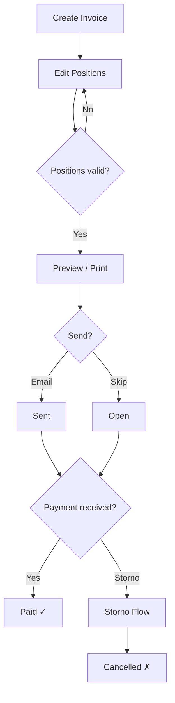
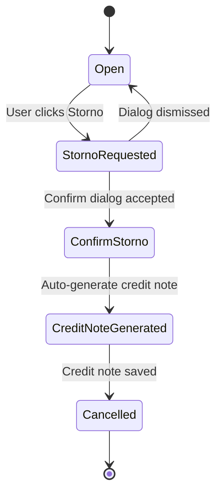
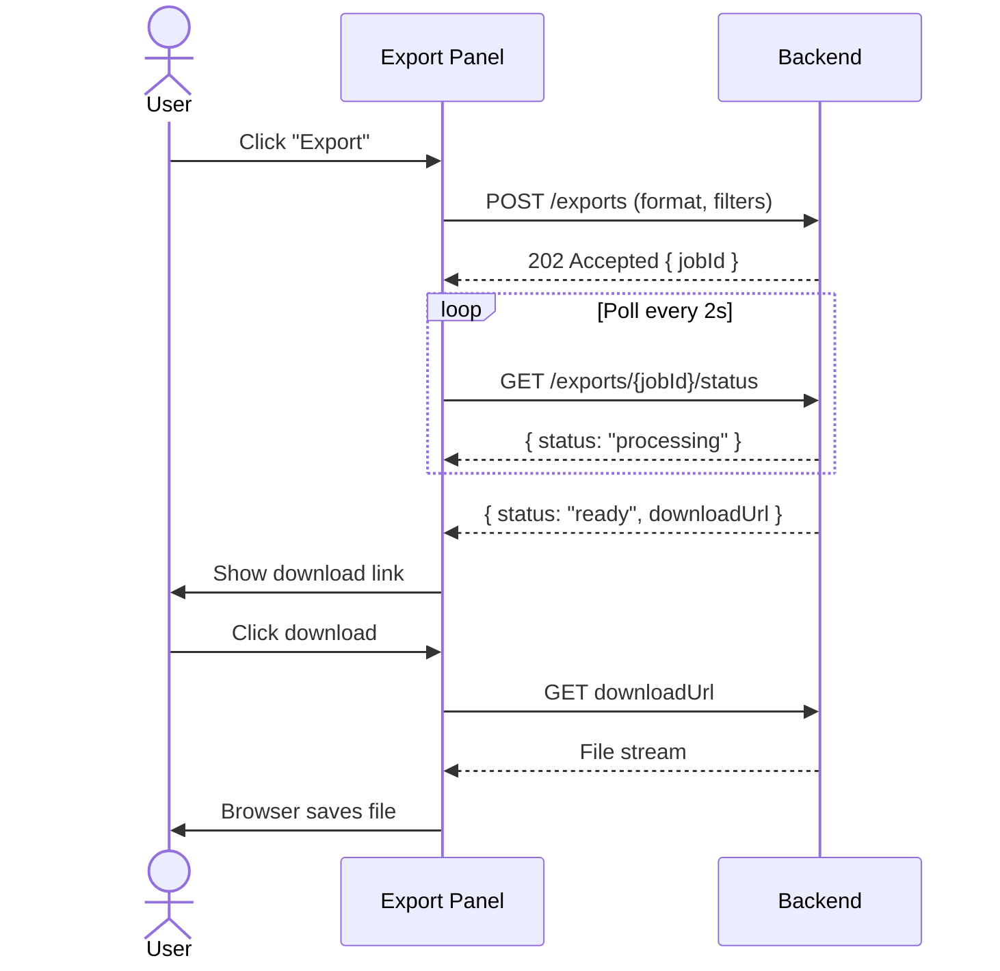
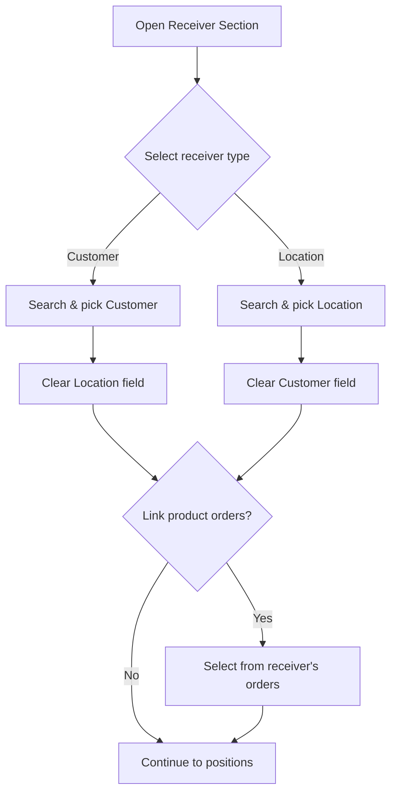
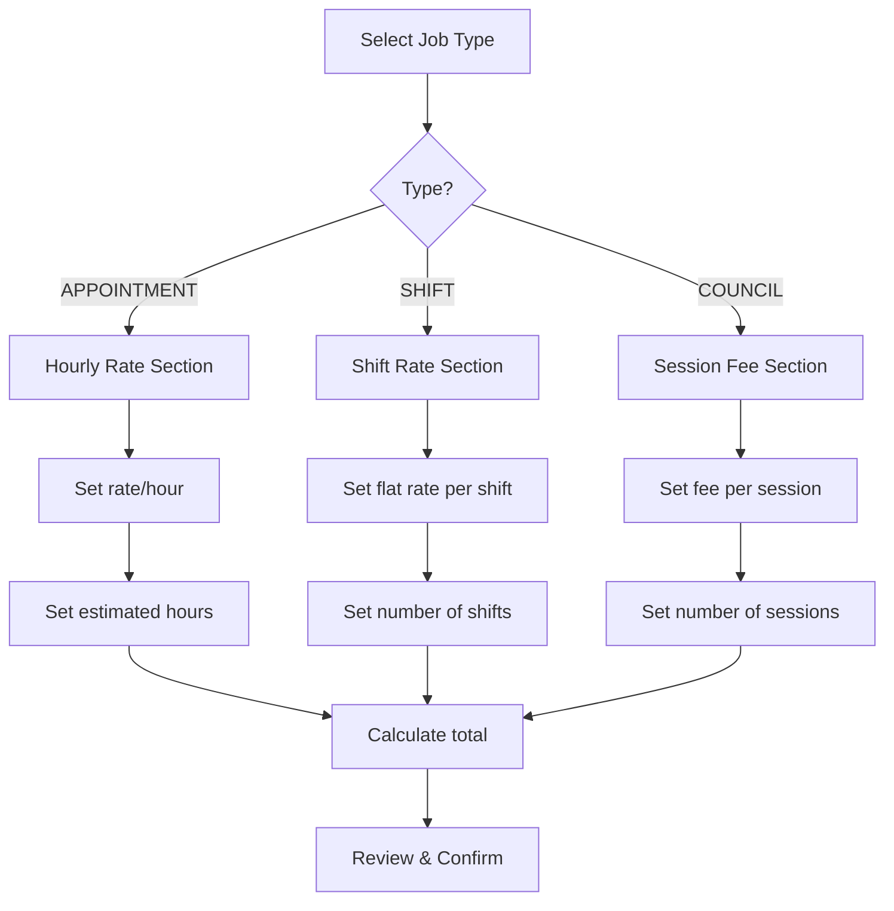

---
---

# Accounting Domain — User Workflows

## Context

| Aspect | Detail |
|--------|--------|
| **Who** | Office staff, accountants, admins with accounting permissions |
| **Entry** | Sidebar → Accounting section (invoices list, export panel) |
| **Exit** | Invoice finalized (paid/storno), export downloaded, or user navigates away |

---

## 1. Invoice Lifecycle

The user creates an invoice, adds/edits line-item positions, then prints or sends it. The invoice eventually reaches a terminal state: paid or storno.

---

## 2. Invoice Storno States

When an invoice is cancelled, it transitions through confirmation and optional credit-note generation before reaching the final cancelled state.

---

## 3. Async Export Polling

The user triggers an export (PDF/CSV), and the UI polls the backend until the file is ready for download. A timeout or error shows a retry option.

---

## 4. Invoice Receiver Management

An invoice receiver is either a **Customer** or a **Location** — never both. Selecting one clears the other. Product orders can optionally be linked after the receiver is set.

---

## 5. Job Configuration — Type-Conditional Pricing

Depending on the job type selected, the pricing section adapts. APPOINTMENT shows hourly rates, SHIFT shows shift-based flat rates, and COUNCIL shows per-session fees.

---

## Interdependencies Summary

| Workflow | Depends On | Feeds Into |
|----------|-----------|------------|
| Invoice Lifecycle | Receiver Management (receiver must be set) | Export (invoices are exportable) |
| Storno Flow | Invoice Lifecycle (invoice must exist and be open/sent) | Credit notes list |
| Async Export | Invoice Lifecycle (filters reference invoice states) | Downloaded files (external) |
| Receiver Management | Customer / Location master data | Invoice Lifecycle (sets bill-to) |
| Job Config Pricing | Job type enum (APPOINTMENT / SHIFT / COUNCIL) | Invoice positions (line items derived from pricing) |

---

## Wireframe Screenshots

### W1: Invoice List

Month/year filter toolbar with navigation arrows, 11-column DataTable with status badges, 12 toolbar action buttons (view, edit, delete, send, XML, print, download ZIP, export XLS, template export, multi-template export), pagination. Dialogs: Export Invoice (period selector), Template Export, Multi-Template Export, Job Status (async polling).

**Annotations:**
- `[DataTable]` 11-col grid → `@shadcn/table` DataTable pattern
- 12 toolbar actions — some row-selection-gated
- Month/Year filter → `@shadcn/select` + `@shadcn/input`
- `[async: poll job status]` Template Export + ZIP generation
- Status formatter: colored badge per `InvoiceState` enum
- Row-selection → enables bulk actions (Close, Reopen, Delete, Export)

---

### W2: Invoice Details Drawer

1100px drawer with 4-column header layout (client info, title/description, invoice date/skonto, period/submission). Positions collection table with inline add/delete/sort and auto-recalculation (`netPrice × amount + tax`). Totals section (subtotal, tax, gross total). Action bar: Print, Email, Mark Paid, Storno. Annotations cover multi-entity invoice switch, async PDF generation, dialogs (Print Preview, Email, Create Invoice, Storno, Appointment Work Log).

**Annotations:**
- `[multi-entity: invoice switch]` ← Prev / Next → navigate between invoices without closing
- 1100px `@shadcn/sheet` drawer with positions collection inline editing
- `[calc: netPrice × amount + tax]` Auto-recalculated totals on edit
- Footer summary: netTotal, taxTotal, grossTotal
- State badge with transition actions (Close, Reopen, Approve)

---

### W3: Worklog

Monthly worklog list with month/year filter toolbar (same pattern as W1), 8-column DataTable. Below: 21-column weekly assignments matrix grid (expert rows × 7 days × 3 shifts: morning/afternoon/night). Toolbar actions: Edit, Structure, PerMonth, MonthGST, Export XLS, ZIP Download.

**Annotations:**
- `[DataTable]` Monthly list → `@shadcn/table` DataTable pattern
- `[matrix: 7d×3shifts]` Weekly assignments = 21 columns (expert × day × shift)
- `[HARDCODED]` All column headers need i18n keys
- Month/Year selector → `@shadcn/select` + `@shadcn/input`

---

### W4: Invoice Receiver

List view with filter panel (active toggle + max results), 6-column DataTable, toolbar (Add, Edit, Delete, Create Invoice, Create All, Export XLS). 2-tab detail form:
- **Tab 1 — Payment Contact**: Entity selection (customer↔location mutex with address auto-fill), address fields, contact & payment terms (payment goal, skonto), storno groups (3 selects), tax, banking (IBAN/bank), mail/post invoice switches, worklog export config collection.
- **Tab 2 — Product Orders**: 5 flat-rate toggles + product collection table (amount, product autocomplete, dates, description, price, adjusted price, total, delete/sort).

**Annotations:**
- 2-tab detail: Tab 1 Payment Contact (35 fields), Tab 2 Product Orders (flat-rate toggles + product collection)
- `[cond: customer↔location mutex]` — selecting customer clears location and vice versa
- `[repeats: product collection]` — product rows with unit price, amount, discount
- Council/Shift storno sections conditionally visible

---

### W5: Job Configuration

List view with 8-column DataTable + filter panel. 1200px 2-tab detail dialog:
- **Tab 1 — Info & Skills**: General fields (name, code, color), job type select, consultation type checkboxes, billing section `[cond: billing.enabled]`, skills collection with nested skill rules `[nested: skill → rules]`, on-call numbers collection.
- **Tab 2 — Times & Pricing**: Type-conditional sections — Shift: 4-period × 6-tier pricing matrix with price points sub-dialog `[cond: type=SHIFT]`; Appointment: hourly rates with rounding + storno `[cond: type=APPOINTMENT]`; Council: per-patient pricing + support hourly + rounding `[cond: type=COUNCIL]`.

**Annotations:**
- 1200px `@shadcn/dialog`, 2-tab detail
- Tab 1 (shown): Info + skills collection `[nested: skill → rules]`
- Tab 2: Times/Pricing — type-conditional:
  - `[cond: type=SHIFT]` 4-period × 6-tier pricing matrix with editable eur cells
  - `[cond: type=APPOINTMENT]` 2 price brackets
  - `[cond: type=COUNCIL/TREATMENT]` simpler structures

---

### W6: Accounting Config

5 config CRUD modules organized as top-level tabs:
1. **Storno Groups** — Master list + detail with nested storno rules collection (days, percentage, amount).
2. **Job Price Lists** — Master list + detail with nested prices collection and conditional fields by job type.
3. **Products** — 8 fields with 2 enum selects (product type, tax type).
4. **Closed Months** — Batch-generated list with 3 date milestones (no add/delete) `[batch: generated records]`.
5. **Expert Work Monthly** — Year/month filter, nested worklog collection, regenerate/send/download/export ZIP actions `[cond: role=ADMIN|ACCOUNTING]`, export status dialog with progress polling.

**Annotations:**
- 5 config modules as `@shadcn/tabs`: Storno Groups, Price Lists, Products, Closed Months, Expert Work Monthly
- Showing: Storno Groups tab with master list + detail panel with nested rules collection
- `[repeats: rules collection]` — each rule: type select, storno percentage input

