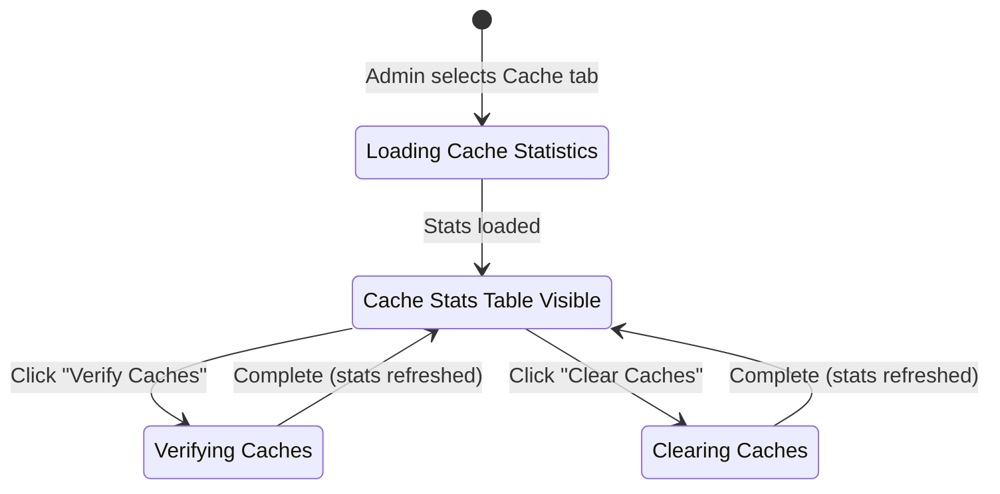
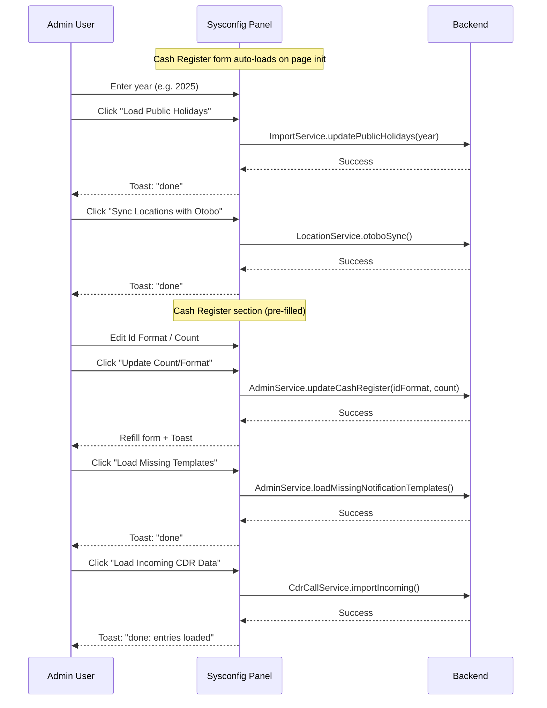
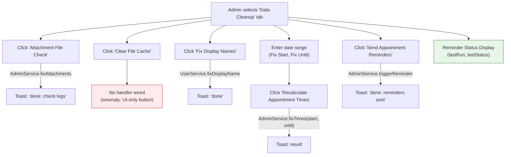
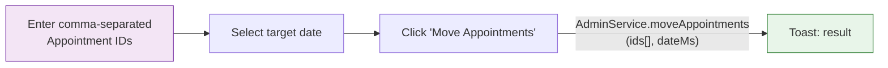

# System Configuration (Sysconfig) -- Admin Workflows

This document describes the user experience and decision flows when a system administrator uses the Sysconfig panel. All diagrams represent the journey from the admin's perspective, not internal system architecture.

---

## Context

The Sysconfig panel is a tabbed administration interface accessible only to system administrators. It provides manual trigger buttons for various maintenance, synchronization, and diagnostic operations. The panel is organized into 5 tabs, each grouping related administrative actions.

**Who uses it:** System administrators with full admin access.

**Entry point:** The admin navigates to Administration > Sysconfig from the sysadmin sidebar.

**Exit points:** The admin stays on the sysconfig page until they navigate away. Each action produces immediate feedback (toast notification with result).

---

## 1. Tab Navigation Flowchart

This diagram shows the top-level navigation structure and what each tab offers the admin.

```mermaid
flowchart TD
    ENTRY["Sysadmin Sidebar"] -->|"Click Sysconfig"| TABS["Sysconfig Panel"]

    TABS --> T1["Tab 1: Basis Web<br>(Default active)"]
    TABS --> T2["Tab 2: Cache"]
    TABS --> T3["Tab 3: Data Update"]
    TABS --> T4["Tab 4: Data Cleanup"]
    TABS --> T5["Tab 5: Training"]

    T1 --> T1A["BasisWeb Sync Actions<br>(3 buttons)"]
    T1 --> T1B["Emergency Form Lookup<br>(inputs + 2 buttons)"]
    T1 --> T1C["Consultation XML Viewer<br>(input + 1 button)"]

    T2 --> T2A["Cache Stats Table<br>(auto-loaded on tab select)"]
    T2 --> T2B["Verify / Clear Buttons<br>(2 buttons)"]

    T3 --> T3A["Public Holidays<br>(year input + button)"]
    T3 --> T3B["Otobo Sync<br>(button)"]
    T3 --> T3C["Invoice Format<br>(2 inputs + button)"]
    T3 --> T3D["Templates + CDR<br>(2 buttons)"]

    T4 --> T4A["File Maintenance<br>(2 buttons)"]
    T4 --> T4B["Display Name Fix<br>(button)"]
    T4 --> T4C["Appointment Time Fix<br>(2 date inputs + button)"]
    T4 --> T4D["Manual Reminder<br>(button + status display)"]

    T5 --> T5A["Move Appointments<br>(IDs input + date input + button)"]

    style ENTRY fill:#e8f4f8,stroke:#2c7bb6
    style TABS fill:#f5f5f5,stroke:#333
    style T1 fill:#FFF3E0,stroke:#E65100
    style T2 fill:#E8F5E9,stroke:#2E7D32
    style T3 fill:#E3F2FD,stroke:#1565C0
    style T4 fill:#FCE4EC,stroke:#C62828
    style T5 fill:#F3E5F5,stroke:#6A1B9A
```

**Key observations:**
- Tab 1 (Basis Web) is the default active tab on page load.
- Tab 2 (Cache) auto-loads cache statistics when selected.
- All actions use a fire-and-forget pattern: click button, wait for toast confirmation.
- No action requires multi-step wizards or confirmation dialogs -- they are all single-click operations.
- The only tab with read-only output areas is Tab 1 (decrypted JSON, consultation XML).

---

## 2. Basis Web Tab -- User Journey

This diagram shows the three independent workflows within the Basis Web tab.

```mermaid
flowchart TD
    subgraph SYNC["BasisWeb Data Synchronization"]
        S1["Click 'Load BasisWeb Data'"] -->|"AdminService.updateBasisWeb"| S1R["Toast: 'done'"]
        S2["Click 'Load Open Registrations'"] -->|"BasisWebAppointmentService.fetch"| S2R["Toast: 'done'"]
        S3["Click 'Sync Registration List'"] -->|"BasisWebAppointmentService.sync"| S3R["Toast: 'done'"]
    end

    subgraph BOGEN["Emergency Form Lookup"]
        B1["Enter Jnummer, JVA, UID"] --> B2["Click 'Load Emergency Form'"]
        B2 -->|"BasisWebDataService.fetchBogen"| B2R["Toast: 'done'"]
        B3["Enter Jnummer, PIN"] --> B4["Click 'Decrypt Emergency Form'"]
        B4 -->|"BasisWebDataService.decryptBogen"| B4R["JSON displayed in <pre> output"]
    end

    subgraph XML["Consultation XML Viewer"]
        X1["Enter Consultation ID (numeric)"] --> X2["Click 'Show Treatment Data (XML)'"]
        X2 -->|"Validates numeric"| X2V{"Valid?"}
        X2V -->|"Yes"| X2R["XML formatted in <pre> output"]
        X2V -->|"No"| X2E["Validation error toast"]
    end

    style SYNC fill:#FFF8E1,stroke:#F57F17
    style BOGEN fill:#E8F5E9,stroke:#2E7D32
    style XML fill:#E3F2FD,stroke:#1565C0
    style X2E fill:#FFEBEE,stroke:#C62828
```

**Who:** System administrator needing to manually trigger BasisWeb synchronization or debug patient data.

**Entry point:** Admin is on Tab 1 (Basis Web) -- the default tab.

**Exit points:** Admin stays on the tab; results are displayed inline (JSON/XML output areas) or as toast notifications.

**Key observations:**
- The three sections are independent. No workflow links between them.
- Emergency Form lookup requires two separate steps: first fetch (JVA + Jnummer + UID), then decrypt (Jnummer + PIN).
- The XML viewer validates that the Consultation ID is numeric before making the service call.
- All three BasisWeb sync buttons are independent and can be used in any order.

---

## 3. Cache Tab -- State Diagram

**Who:** System administrator investigating cache health or resolving display issues (e.g., calendar rendering errors).

**Entry point:** Admin clicks the "Cache" tab.

**Exit points:** Admin stays on the tab; cache stats table is always visible.

**Key observations:**
- Cache statistics auto-load when the tab is selected (no explicit "refresh" button).
- After Verify or Clear, stats automatically refresh to show the updated state.
- The descriptive text explains when clearing is necessary: "when the calendar displays incorrectly (e.g. after changing service priorities)".

---

## 4. Data Update Tab -- Sequence Diagram

**Who:** System administrator running periodic data maintenance tasks.

**Entry point:** Admin clicks the "Data Update" tab.

**Exit points:** Admin stays on the tab; each action completes independently.

**Key observations:**
- The Cash Register Info form is pre-filled on page load via `AdminService.getCashRegister()`.
- Cash Register update has mandatory fields (Id Format, Count) -- validation prevents submission if empty.
- All other actions are parameterless single-click buttons (except Public Holidays which takes a year).
- Format examples are displayed as hints: "Fixed year: 22/%04d" and "Dynamic (current): %02d/%04d".

---

## 5. Data Cleanup Tab -- Decision Flow

**Who:** System administrator performing data maintenance and cleanup tasks.

**Entry point:** Admin clicks the "Data Cleanup" tab.

**Exit points:** Admin stays on the tab.

**Key observations:**
- "Clear File Cache" button exists in UI but has no handler wired (known anomaly from legacy analysis).
- "Recalculate Appointment Times" is the only action that requires input (date range).
- Reminder status (last run time, last status) is displayed read-only -- loaded from the parent sysadmin page header.
- "Fix Display Names" has a helper description: "When first/last name is displayed incorrectly".

---

## 6. Training Tab -- Simple Flow

**Who:** System administrator preparing a training/demo environment.

**Entry point:** Admin clicks the "Training" tab.

**Exit points:** Admin stays on the tab.

**Key observations:**
- This is a training/demo utility, not a production workflow.
- Default appointment IDs are hardcoded ("37883,37884,...,37894") -- demo data.
- Target date defaults to today's date.
- IDs are parsed as comma-separated numbers; date is converted to epoch milliseconds.

---

## 7. Interdependencies Summary

| Factor | Affects | Tabs Involved | Impact on User Experience |
|:---|:---|:---|:---|
| Admin role | All tabs | All | Entire sysconfig panel is admin-only; no role-specific tab visibility |
| Tab selection | Cache auto-load | Tab 2 | Selecting Cache tab automatically fetches fresh stats |
| Page load | Cash Register pre-fill | Tab 3 | Cash Register form is pre-filled with current values on initial page load |
| Page load | Reminder status | Tab 4 | lastRun/lastStatus displayed from parent page header data |
| Emergency Form fetch | Decrypt availability | Tab 1 | Must fetch first (Jnummer+JVA+UID), then decrypt (Jnummer+PIN) in sequence |
| Consultation ID validation | XML viewer | Tab 1 | Non-numeric input blocked with validation error |
| Date range inputs | Appointment time fix | Tab 4 | Both fixStart and fixUntil must be provided for recalculation |
| Hardcoded demo IDs | Training workflow | Tab 5 | Pre-filled with specific appointment IDs; admin typically overrides |

---

## 8. Shadcn Component Mapping

| Legacy UI Element | Shadcn Component | Notes |
|:---|:---|:---|
| Bootstrap nav-tabs (5 tabs) | `@shadcn/tabs` | Horizontal tab bar with `TabsList` + `TabsTrigger` + `TabsContent` |
| `<input type="text">` fields | `@shadcn/input` | Jnummer, JVA, UID, PIN, Consultation ID, Appointment IDs |
| `<input type="number">` fields | `@shadcn/input` with `type="number"` | Year, Count |
| `<input type="date">` fields | `@shadcn/date-picker` (popover + calendar) | fixStart, fixUntil, moveAppointmentDate |
| `<button>` action triggers | `@shadcn/button` | Primary variant for main actions |
| `<pre>` output areas | `@shadcn/card` with `<pre>` inside | Monospace output for JSON/XML |
| `alert("done")` feedback | `@shadcn/sonner` (toast) | Replace all alert() with toast notifications |
| Cache stats table | `@shadcn/table` | Read-only columns: Id, Size, TS, Hits, Misses, Resets, DbChecks |
| Section headings (`<h4>`, `<h5>`) | Native `<h4>`, `<h5>` with Tailwind | Semantic headings within tab content |
| Muted description text | `
` | Helper descriptions below buttons |
| Reminder status display | `@shadcn/badge` or inline text | lastRun + lastStatus as read-only metadata |

---

## Wireframe Screenshots

### Tab 1: Basis Web

BasisWeb data synchronization, emergency form lookup (fetch + decrypt), and consultation XML viewer. Three independent sections with text inputs, action buttons, and read-only `<pre>` output areas for JSON/XML results.

### Tab 2: Cache

Cache statistics table (7 columns: Id, Size, TS, Hits, Misses, Resets, DbChecks) with auto-load on tab selection. Two action buttons: Verify Caches and Clear Caches (destructive variant).

### Tab 3: Data Update

Five independent data maintenance sections: Public Holidays (year input), Otobo Sync (single button), Invoice Format (Id Format + Count inputs), Templates, and CDR import.

### Tab 4: Data Cleanup

Five cleanup actions: Attachment File Check, Clear File Cache (anomaly: no handler wired), Fix Display Names, Recalculate Appointment Times (date range inputs), and Manual Appointment Reminders (with lastRun/lastStatus status display).

### Tab 5: Training (Schulung)

Training/demo utility for bulk-moving appointments to a target date. Comma-separated appointment IDs input (pre-filled with hardcoded demo IDs) and date picker. Warning alert indicates this is a demo-only tool.

