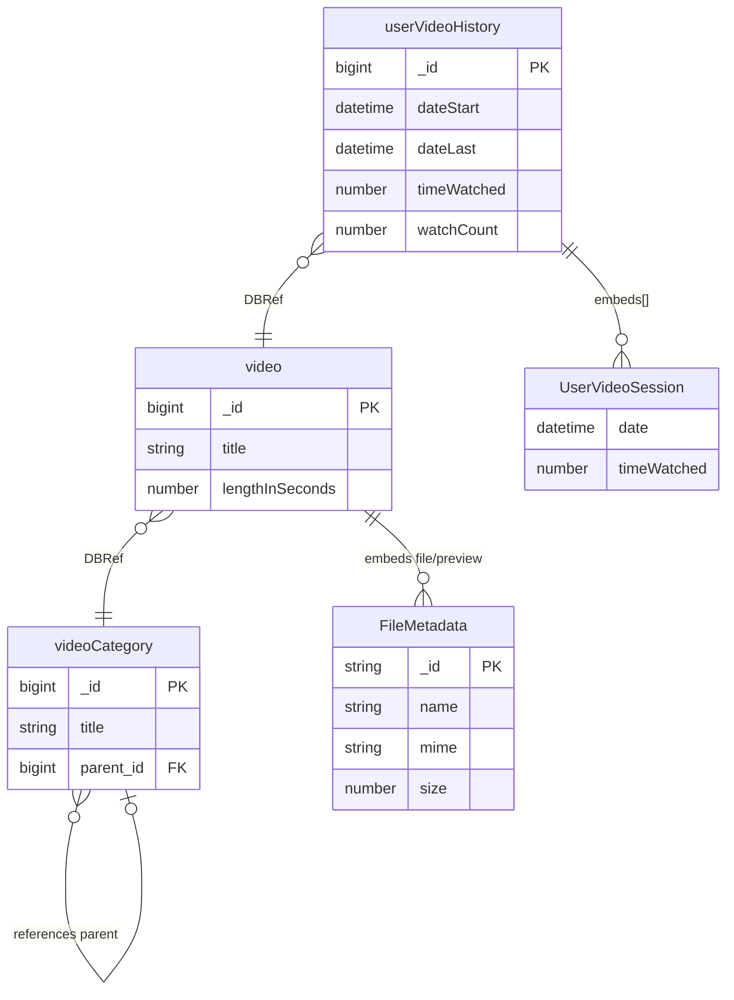

# Academy (Training)

[← Back to Index]\1../../readme.md\3

This file covers the Academy category: educational resources and training materials for users.

---

## ER Diagram {#er-diagram}

Training videos, categories, and per-user viewing history.

---

## Entities in This Category

| Table Name (DBML) | Business Entity | Description Summary |
| :--- | :--- | :--- |
| [`video`](#entity-videos) | Videos (Videos) | Metadata for instructional or informational videos in the system. |
| [`userVideoHistory`](#entity-user-video-history) | Video-Verlauf (User Video History) | Tracking of video call attempts and successful connections. |
| [`videoCategory`](#entity-video-categories) | Videokategorien (Video Categories) | Categorization for organizing the video library. |

---

## Entity: Videos (Videos) {#entity-videos}
Metadaten für Schulungs- oder Informationsvideos.

### Table: video
| Column | Type | Field Type | Description |
| :--- | :--- | :--- | :--- |
| `_id` | `Long` | schema | Interner Bezeichner |
| `version` | `Long` | schema | Versionsnummer |
| `name` | `String` | schema | Videotitel |
| `category` | `DBRef` | schema | Reference to [videoCategory](#entity-video-categories) |
| `file` | `Document` | schema | Metadaten der Videodatei ([FileMetadata](./user-management.md#sub-entity-filemetadata)) |
| `preview` | `Document` | schema | Metadaten des Vorschaubilds ([FileMetadata](./user-management.md#sub-entity-filemetadata)) |
| `lengthInSeconds` | `Long` | schema | Videolänge in Sekunden |
| `path` | `String` | schema | Speicherpfad |
| `_class` | `String` | schema | Laufzeitklassen-Marker: `de.videoclinic.model.Video` |

The `video` entity is referenced by:
- [`userVideoHistory`](#entity-user-video-history)

## Entity: Video-Verlauf (User Video History) {#entity-user-video-history}
Protokollierung der von Benutzern angesehenen (Schulungs-)Videos.

### Table: userVideoHistory
| Column | Type | Field Type | Description |
| :--- | :--- | :--- | :--- |
| `_id` | `Long` | schema | Interner Bezeichner |
| `version` | `Long` | schema | Versionsnummer |
| `user` | `DBRef` | schema | Reference to [user](./user-management.md#entity-expert) |
| `video` | `DBRef` | schema | Reference to [video](#entity-videos) |
| `dateStart` | `Date` | schema | Erster Zugriff |
| `dateLast` | `Date` | schema | Letzter Zugriff |
| `timeWatched` | `Long` | schema | Gesamt-Zuschauerzeit in Sekunden |
| `watchCount` | `Number` | schema | Anzahl der Aufrufe |
| `sessions` | `Array` | schema | Einzelne Video-Sitzungen ([UserVideoSession](#sub-entity-uservideosession)) |
| `_class` | `String` | schema | Laufzeitklassen-Marker: `de.videoclinic.model.UserVideoHistory` |

The `userVideoHistory` entity references:
- [`user`](./user-management.md#entity-expert) (via `user` DBRef)
- [`video`](#entity-videos) (via `video` DBRef)

### Sub-entities for userVideoHistory

#### Sub-entity: UserVideoSession {#sub-entity-uservideosession}
Einzelne Wiedergabe-Sitzung eines Videos.

| Column | Type | Field Type | Description |
| :--- | :--- | :--- | :--- |
| `_id` | `String` | inferred | Internal identifier |
| `sessionId` | `String` | schema | Session-ID |
| `dateStart` | `Date` | inferred | Beginn der Sitzung |
| `dateEnd` | `Date` | inferred | Ende der Sitzung |
| `duration` | `Long` | inferred | Wiedergabedauer in Sekunden |
| `completed` | `Boolean` | inferred | Ob das Video vollständig gesehen wurde |
| `date` | `Date` | inferred | Zeitpunkt |
| `timeWatched` | `Long` | schema | Zuschauerzeit in dieser Sitzung |

The `UserVideoSession` sub-entity is used within:
- [`userVideoHistory`](#entity-user-video-history) (as `sessions` array)

## Entity: Videokategorien (Video Categories) {#entity-video-categories}
Kategorisierung von Videos in einer hierarchischen Struktur.

### Table: videoCategory
| Column | Type | Field Type | Description |
| :--- | :--- | :--- | :--- |
| `_id` | `Long` | schema | Interner Bezeichner |
| `version` | `Long` | schema | Versionsnummer |
| `title` | `String` | inferred | Name der Kategorie |
| `description` | `String` | inferred | Beschreibung |
| `thumbnail` | `Document` | inferred | Vorschaubild ([FileMetadata](./user-management.md#sub-entity-filemetadata)) |
| `parent` | `Long` | schema | Reference to übergeordnete [videoCategory](#entity-video-categories) |
| `_class` | `String` | schema | Laufzeitklassen-Marker: `de.videoclinic.model.VideoCategory` |

The `videoCategory` entity is referenced by:
- [`video`](#entity-videos)
