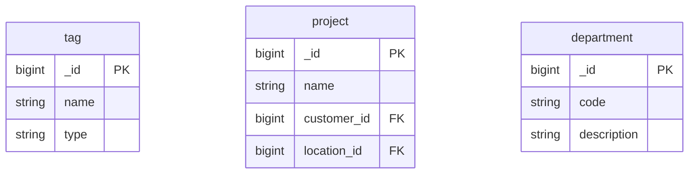

# Deprecated Entities

[← Back to Index]\1../../readme.md\3

This file covers tables that are no longer in use or not yet implemented.

---

## ER Diagram {#er-diagram}

Collections that are no longer in use or not yet implemented.

---

## Entities in This Category

| Table Name (DBML) | Business Entity | Description Summary |
| :--- | :--- | :--- |
| [`tag`](#entity-tags) | Tags (Tags) | Metadata tags used for labeling and filtering various system entities. |
| [`project`](#entity-projects) | Projekte (Projects) | Organizational entities used to group related resources or operations. |
| [`department`](#entity-departments) | Abteilungen (Departments) | Medical specialties or organizational departments. |

---

## Entity: Tags (Tags) {#entity-tags}
Zentrales Verzeichnis für Tags zur Kategorisierung verschiedener Entitäten.

### Table: tag
| Column | Type | Field Type | Description |
| :--- | :--- | :--- | :--- |
| `_id` | `Long` | schema | Interner Bezeichner |
| `tag` | `String` | inferred | Tag-Name |
| `type` | `String` | inferred | Tag-Kategorie |
| `count` | `Long` | schema | Verwendungshäufigkeit |
| `_class` | `String` | schema | Laufzeitklassen-Marker: `de.videoclinic.model.Tag` |

The `tag` entity is used for:
- (Labeling and filtering various system entities)

## Entity: Projekte (Projects) {#entity-projects}
Verwaltung von Projekten, die Kunden und Standorten zugeordnet sind.

### Table: project
| Column | Type | Field Type | Description |
| :--- | :--- | :--- | :--- |
| `_id` | `Long` | schema | Interner Bezeichner |
| `version` | `Long` | schema | Versionsnummer |
| `dateStart` | `Date` | schema | Projektstart |
| `dateEnd` | `Date` | schema | Projektende |
| `description` | `String` | schema | Projektbeschreibung |
| `state` | `String` | inferred | Projektstatus |
| `customer` | `DBRef` | inferred | Reference to [customer](./customer.md#entity-customers) |
| `location` | `DBRef` | schema | Reference to [location](./customer.md#entity-locations) |
| `_class` | `String` | schema | Laufzeitklassen-Marker: `de.videoclinic.model.Project` |

The `project` entity is referenced by:
- (Internal project management tools)

## Entity: Abteilungen (Departments) {#entity-departments}
Definition von organisatorischen Abteilungen.

### Table: department
| Column | Type | Field Type | Description |
| :--- | :--- | :--- | :--- |
| `_id` | `Long` | schema | Interner Bezeichner |
| `version` | `Long` | schema | Versionsnummer |
| `code` | `String` | schema | Abteilungs-Code |
| `description` | `String` | schema | Beschreibung |
| `_class` | `String` | schema | Laufzeitklassen-Marker: `de.videoclinic.model.Department` |

The `department` entity is used for:
- (Organizational structure within locations)
