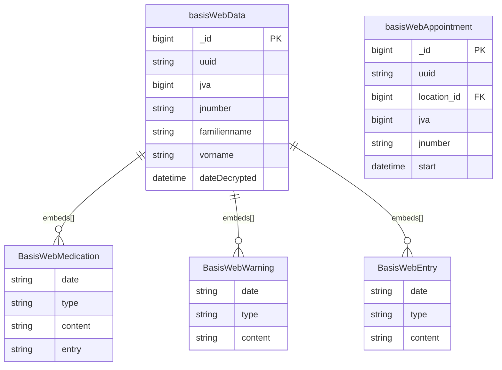

# Interfaces

[← Back to Index]\1../../readme.md\3

This file covers the Interfaces category: data exchange and integration with external systems like BasisWeb.

---

## ER Diagram {#er-diagram} {#er-diagram}

External data exchange with BasisWeb (JVA patient systems).

---

## Entities in This Category

| Table Name (DBML) | Business Entity | Description Summary |
| :--- | :--- | :--- |
| [`basisWebData`](#entity-basis-web-data) | JVA Patientendaten (Basis Web Data) | Encrypted patient information from external JVA systems. |
| [`basisWebAppointment`](#entity-basis-web-appointment) | Web-Terminanfragen (Basis Web Appointment) | External appointment requests originating from BasisWeb. |

---

## Entity: JVA Patientendaten (Basis Web Data) {#entity-basis-web-data} {#entity-basis-web-data}
Vom JVA-System übermittelte Patientendaten, die verschlüsselt in der Datenbank abgelegt werden.

### Table: basisWebData
| Column | Type | Field Type | Description |
| :--- | :--- | :--- | :--- |
| `_id` | `Long` | schema | Interner Bezeichner |
| `version` | `Long` | schema | Versionsnummer |
| `uuid` | `String` | schema | Eindeutige ID der Übermittlung |
| `jva` | `Long` | schema | ID der JVA |
| `jnummer` | `String` | schema | J-Nummer des Gefangenen |
| `buchnummer` | `String` | schema | Buchnummer des Gefangenen |
| `familienname` | `String` | schema | Familienname |
| `geburtsname` | `String` | schema | Geburtsname |
| `vorname` | `String` | schema | Vorname |
| `geburtsdatum` | `String` | schema | Geburtsdatum |
| `staatsangehoerigkeit` | `String` | schema | Staatsangehörigkeit |
| `geburtsland` | `String` | schema | Geburtsland |
| `geschlecht` | `String` | schema | Geschlecht |
| `medication` | `Array` | schema | Liste übermittelter Medikamente ([BasisWebMedication](#sub-entity-basiswebmedication)) |
| `warning` | `Array` | schema | Liste übermittelter Warnhinweise ([BasisWebWarning](#sub-entity-basiswebwarning)) |
| `dateDecrypted` | `Date` | inferred | Entschlüsselungszeitpunkt |
| `dateCreated` | `Date` | schema | Erstellungsdatum |
| `appointment` | `DBRef` | schema | Associated appointment (Reference to [appointment](./planning.md#entity-appointments)) |
| `_class` | `String` | schema | Laufzeitklassen-Marker: `de.videoclinic.model.BasisWebData` |

The `basisWebData` entity is referenced by:
- [`consultationData`](./treatment.md#entity-consultation-data) (via `basisWebDataId`)

### Sub-entities for basisWebData

#### Sub-entity: BasisWebMedication {#sub-entity-basiswebmedication} {#sub-entity-basiswebmedication}
Übermitteltes Medikament aus dem JVA-System.

| Column | Type | Field Type | Description |
| :--- | :--- | :--- | :--- |
| `_id` | `Long` | schema | Interner Bezeichner |
| `date` | `String` | schema | Datum |
| `type` | `String` | schema | Art des Medikaments (Encrypted/Hashed) |
| `content` | `String` | schema | Inhalt/Wirkstoff |
| `entry` | `String` | schema | Eintragstext |
| `note` | `String` | schema | Notiz |
| `until` | `String` | schema | Gültig bis |

The `BasisWebMedication` sub-entity is used within:
- [`basisWebData`](#entity-basis-web-data) (as `medication` array)

#### Sub-entity: BasisWebWarning {#sub-entity-basiswebwarning} {#sub-entity-basiswebwarning}
Übermittelter Warnhinweis aus dem JVA-System.

| Column | Type | Field Type | Description |
| :--- | :--- | :--- | :--- |
| `_id` | `String` | inferred | Internal identifier |
| `date` | `String` | schema | Datum |
| `active` | `String` | schema | Status (Encrypted/Hashed) |
| `type` | `String` | schema | Art der Warnung (Encrypted/Hashed) |
| `content` | `String` | schema | Inhaltstext |

The `BasisWebWarning` sub-entity is used within:
- [`basisWebData`](#entity-basis-web-data) (as `warning` array)

#### Sub-entity: BasisWebEntry {#sub-entity-basiswebentry} {#sub-entity-basiswebentry}
Allgemeiner medizinischer Eintrag aus dem JVA-System.

| Column | Type | Field Type | Description |
| :--- | :--- | :--- | :--- |
| `_id` | `String` | inferred | Internal identifier |
| `date` | `String` | schema | Datum |
| `active` | `String` | schema | Status (Encrypted/Hashed) |
| `type` | `String` | schema | Art des Eintrags (Encrypted/Hashed) |
| `content` | `String` | schema | Inhaltstext |

The `BasisWebEntry` sub-entity is used within:
- (Internal JVA patient data processing)

## Entity: Web-Terminanfragen (Basis Web Appointment) {#entity-basis-web-appointment} {#entity-basis-web-appointment}
Vom Web-System übermittelte Terminanfragen.

### Table: basisWebAppointment
| Column | Type | Field Type | Description |
| :--- | :--- | :--- | :--- |
| `_id` | `Long` | schema | Interner Bezeichner |
| `version` | `Long` | schema | Versionsnummer |
| `uuid` | `String` | schema | Eindeutige ID der Anfrage |
| `start` | `Date` | schema | Gewünschter Startzeitpunkt |
| `location` | `Long` | schema | Reference to [location](./customer.md#entity-locations) |
| `jva` | `Long` | schema | ID der JVA |
| `dateCreated` | `Date` | schema | Erstellungsdatum |
| `_class` | `String` | schema | Laufzeitklassen-Marker: `de.videoclinic.model.BasisWebAppointment` |

The `basisWebAppointment` entity is referenced by:
- [`appointment`](./planning.md#entity-appointments) (implicitly when converted to an appointment)
