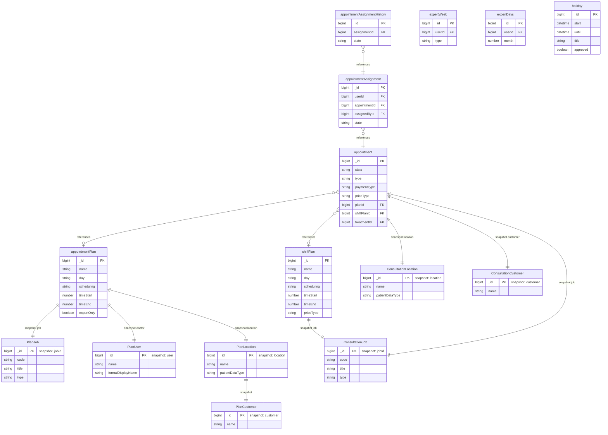

# Planning

[← Back to Index]\1../../readme.md\3

This file covers the Planning category: definition of consultation schedules, shifts, and expert availability.

---

## ER Diagram {#er-diagram}

Consultation schedules, shift plans, individual appointments, and expert availability.

---

## Entities in This Category

| Table Name (DBML) | Business Entity | Description Summary |
| :--- | :--- | :--- |
| [`appointmentPlan`](#entity-appointment-plan) | Sprechstundenplan (Appointment Plan) | Definition of a consultation schedule entry, including service, day, repetitions, times, assigned experts, locations, and customers. |
| [`expertWeek`](#entity-expert-week) | Experten-Wochenplan (Expert Week) | Weekly availability and shift definitions for an individual expert. |
| [`expertDays`](#entity-expert-days) | Jahreskalender eines Experten (Expert Days) | Detailed availability calendar for experts, tracking shifts and appointment availability per day. |
| [`appointment`](#entity-appointments) | Termine (Appointments) | Individual appointments scheduled for patients with experts. |
| [`appointmentAssignment`](#entity-appointment-assignments) | Terminzuweisungen (Appointment Assignments) | Links between appointments and the experts or tasks assigned to them. |
| [`appointmentAssignmentHistory`](#entity-appointment-assignment-history) | Terminzuweisungs-Historie (Appointment Assignment History) | Audit trail for changes to appointment assignments. |
| [`shiftPlan`](#entity-shift-plan) | Schichtplan (Shift Plan) | Recurring shift schedule for expert on-call duties. |
| [`holiday`](#entity-holidays) | Abwesenheiten/Urlaub (Holidays) | Individual expert absences, vacations, or sick leave. |

---

## Entity: Sprechstundenplan (Appointment Plan) {#entity-appointment-plan}
The appointment plan defines the schedule for consultation hours, including services, recurrence rules, assigned experts, locations, and customers.

### Table: appointmentPlan
| Column | Type | Field Type | Description (from all-together.md) |
| :--- | :--- | :--- | :--- |
| `_id` | `Long` | schema | Interner Bezeichner |
| `version` | `Long` | schema | Versionsnummer (Zeitstempel) |
| `name` | `String` | schema | Ein Name für den Plan (Freitext) |
| `job` | `Document` | snapshot | Eine Dienstleistung (denormalized snapshot of [`jobId`](./accounting.md#entity-service)) ([PlanJob](#sub-entity-planjob)) |
| `day` | `String` | schema | Einen Wochentag: • `MO` (Used) • `TU` (Used) • `WE` (Used) • `TH` (Used) • `FR` (Used) |
| `startDate` | `Date` | schema | Ein Startdatum |
| `endDate` | `Date` | schema | Einen Enddatum |
| `lastDate` | `Date` | schema | Ein Datum der letzten Wiederholung |
| `count` | `Number` | schema | Einer Anzahl von Wiederholungen |
| `scheduling` | `String` | schema | Die Eigenschaft der Wiederholung: • `WEEKLY`: Wöchentlich (Used) • `XOFMONTH`: jeder x-te Tag im Monat (Used) • `FIRST_DAY_MONTH`: Erster Tag im Monats (Not used) • `DAY_MONTH`: Tag im Monat (Not used) • `LAST_DAY_MONTH`: Letzter Tag im Monat (Not used) |
| `schedulingMulitplier` | `Number` | schema | Multiplikator für die Wiederholung |
| `timeStart` | `Number` | schema | Einer Startuhrzeit (Format: HHmm, z.B. 930 für 09:30) |
| `timeEnd` | `Number` | schema | Eine Enduhrzeit (Format: HHmm, z.B. 1200 für 12:00) |
| `doctor` | `Document` | snapshot | Assigned expert (denormalized snapshot of [`user`](./user-management.md#entity-expert)) ([PlanUser](#sub-entity-planuser)) |
| `location` | `Document` | snapshot | Assigned location (denormalized snapshot of [`location`](./customer.md#entity-locations)) ([PlanLocation](#sub-entity-planlocation)) |
| `comment` | `String` | schema | Einem Kommentar (Freitext) |
| `expertOnly` | `Boolean` | schema | Indicates if only the assigned expert can provide the service |
| `dateCreated` | `Date` | schema | Creation date |
| `createdBy` | `Document/DBRef` | snapshot | Creator (denormalized snapshot of [`user`](./user-management.md#entity-expert)) ([PlanUser](#sub-entity-planuser)) |
| `dateChanged` | `Date` | schema | Date of last change |
| `changedBy` | `Document/DBRef` | snapshot | Changed by (denormalized snapshot of [`user`](./user-management.md#entity-expert)) ([PlanUser](#sub-entity-planuser)) |
| `_class` | `String` | schema | Laufzeitklassen-Marker: `de.videoclinic.model.AppointmentPlan` |

The `appointmentPlan` entity is referenced by:
- [`appointment`](#entity-appointments) (via `planId`)
- [`asyncJobQueue`](./system.md#entity-async-job-queue) (via `type`)

### Functionality Details
- **Recurrence rules:** The `scheduling` field maps to "Wöchentlich", "Erster Tag im Monats", "jeder x-te Tag im Monat", "Tag im Monat", "Letzter Tag im Monat" (Only `WEEKLY` and `XOFMONTH` currently in use).
- **Time Format:** `timeStart` and `timeEnd` use a numeric representation of time (e.g., 900 = 09:00, 1500 = 15:00).
- **Expert restriction:** `expertOnly` (Boolean) indicates if only the assigned expert can perform the service.

### Sub-entities for appointmentPlan

The following structures are used as nested documents within the `appointmentPlan` collection. These are denormalized snapshots (copies) of selected fields from other collections, used to ensure historical consistency and performance.

#### Sub-entity: PlanJob {#sub-entity-planjob}
A denormalized snapshot of the associated [`jobId`](./accounting.md#entity-service) entity.

| Column | Type | Field Type | Description |
| :--- | :--- | :--- | :--- |
| `_id` | `Long` | schema | ID of the job |
| `code` | `String` | schema | Short code (Systematische Kodierung) |
| `color` | `String` | schema | HEX color code |
| `expertTitle` | `String` | schema | Title for experts (Freitext) |
| `remoteCode` | `String` | schema | External code (Systematische Kodierung) |
| `title` | `String` | schema | Service title (Freitext) |
| `type` | `String` | schema | Job type: `APPOINTMENT` (Used) |

The `PlanJob` sub-entity is used within:
- [`appointmentPlan`](#entity-appointment-plan)

#### Sub-entity: PlanUser {#sub-entity-planuser}
A denormalized snapshot of the associated [`user`](./user-management.md#entity-expert) entity.

| Column | Type | Field Type | Description |
| :--- | :--- | :--- | :--- |
| `_id` | `Long` | schema | User ID |
| `name` | `String` | schema | Full name (Freitext) |
| `email` | `String` | schema | Email address (Freitext) |
| `formalDisplayName` | `String` | schema | Formal display name (Freitext) |

The `PlanUser` sub-entity is used within:
- [`appointmentPlan`](#entity-appointment-plan)

#### Sub-entity: PlanLocation {#sub-entity-planlocation}
A denormalized snapshot of the associated [`location`](./customer.md#entity-locations) entity.

| Column | Type | Field Type | Description |
| :--- | :--- | :--- | :--- |
| `_id` | `Long` | schema | Location ID (referenced from [`location`](./customer.md#entity-locations)) |
| `name` | `String` | schema | Location name (copied from [`location`](./customer.md#entity-locations) for consistency) |
| `booknumberMask` | `String` | schema | Mask for booking numbers (Strukturierter Text) |
| `patientDataType` | `String` | schema | Data type: `EXTERNAL`, `EXTERNAL_BASISWEB`, `INTERNAL`, `INTERNAL_SECUREBOX`, `INTERNAL_VCCLOUD` (Used) ([Location.patientDataType](./customer.md#entity-locations)) |
| `customer` | `Document` | snapshot | Denormalized snapshot of the assigned customer ([PlanCustomer](#sub-entity-plancustomer)) |

The `PlanLocation` sub-entity is used within:
- [`appointmentPlan`](#entity-appointment-plan)

#### Sub-entity: PlanCustomer {#sub-entity-plancustomer}
A denormalized snapshot of the associated [`customer`](./customer.md#entity-customers) entity.

| Column | Type | Field Type | Description |
| :--- | :--- | :--- | :--- |
| `_id` | `Long` | schema | Customer ID (referenced from [`customer`](./customer.md#entity-customers)) |
| `name` | `String` | schema | Customer name (copied from [`customer`](./customer.md#entity-customers) for consistency) |

The `PlanCustomer` sub-entity is used within:
- [`appointmentPlan`](#entity-appointment-plan) (nested in `location`)

## Entity: Experten-Wochenplan (Expert Week) {#entity-expert-week}
Standardisierte wöchentliche Verfügbarkeitsslots für Experten.

### Table: expertWeek
| Column | Type | Field Type | Description |
| :--- | :--- | :--- | :--- |
| `_id` | `Long` | schema | Interner Bezeichner |
| `version` | `Long` | schema | Versionsnummer |
| `userId` | `Long` | schema | Reference to [user](./user-management.md#entity-expert) |
| `type` | `String` | schema | Typ des Wochenplans: • `TREATMENT` (Used) |
| `slotsMo` | `Array` | schema | Zeit-Slots für Montag (Werte: 1-24, entsprechend der Tagesstunde) |
| `slotsTu` | `Array` | schema | Zeit-Slots für Dienstag (Werte: 1-24) |
| `slotsWe` | `Array` | schema | Zeit-Slots für Mittwoch (Werte: 1-24) |
| `slotsTh` | `Array` | schema | Zeit-Slots für Donnerstag (Werte: 1-24) |
| `slotsFr` | `Array` | schema | Zeit-Slots für Freitag (Werte: 1-24) |
| `slotsSa` | `Array` | schema | Zeit-Slots für Samstag (Werte: 1-24) |
| `slotsSu` | `Array` | schema | Time slots for Sunday (values: 1-24) |
| `dateChanged` | `Date` | schema | Zeitpunkt der letzten Änderung |
| `changedBy` | `DBRef` | schema | Last change by (Reference to [user](./user-management.md#entity-expert)) |
| `dateCreated` | `Date` | schema | Erstellungszeitpunkt |
| `createdBy` | `DBRef` | schema | Erstellt von (Reference to [user](./user-management.md#entity-expert)) |
| `_class` | `String` | schema | Laufzeitklassen-Marker: `de.videoclinic.model.ExpertWeek` |

The `expertWeek` entity defines standard schedules for:
- [`user`](./user-management.md#entity-expert) (referenced via `userId`)

## Entity: Jahreskalender eines Experten (Expert Days) {#entity-expert-days}
Detailed availability calendar for experts, tracking shifts and appointment availability per day.

### Table: expertDays
| Column | Type | Field Type | Description |
| :--- | :--- | :--- | :--- |
| `_id` | `Long` | schema | Interner Bezeichner |
| `version` | `Long` | schema | Versionsnummer |
| `userId` | `Long` | schema | Reference to [user](./user-management.md#entity-expert) |
| `month` | `Number` | schema | Monat (Format: YYYYMM) |
| `maxWeekDayMorning` | `Number` | schema | Maximale Vormittagsschichten (Wochentag) |
| `maxWeekDayAfternoon` | `Number` | schema | Maximale Nachmittagsschichten (Wochentag) |
| `maxWeekDayNight` | `Number` | schema | Maximale Nachtschichten (Wochentag) |
| `maxWeekEndMorning` | `Number` | schema | Maximale Vormittagsschichten (Wochenende) |
| `maxWeekEndAfternoon` | `Number` | schema | Maximale Nachmittagsschichten (Wochenende) |
| `maxWeekEndNight` | `Number` | schema | Maximale Nachtschichten (Wochenende) |
| `maxWeekDayAppointmentMorning` | `Number` | schema | Maximale Vormittagssprechstunden |
| `maxWeekDayAppointmentAfternoon` | `Number` | schema | Maximale Nachmittagssprechstunden |
| `morningNo` | `Array` | schema | Days with explicit "No" for morning availability |
| `afternoonNo` | `Array` | schema | Tage mit explizitem "Nein" für Nachmittagsbereitschaft |
| `nightNo` | `Array` | schema | Tage mit explizitem "Nein" für Nachtbereitschaft |
| `morningYes` | `Array` | schema | Tage mit explizitem "Ja" für Vormittagsbereitschaft |
| `afternoonYes` | `Array` | schema | Tage mit explizitem "Ja" für Nachmittagsbereitschaft |
| `nightYes` | `Array` | schema | Tage mit explizitem "Ja" für Nachtbereitschaft |
| `morningAppointmentNo` | `Array` | schema | Tage mit explizitem "Nein" für Vormittagssprechstunde |
| `afternoonAppointmentNo` | `Array` | schema | Tage mit explizitem "Nein" für Nachmittagssprechstunde |
| `treatmentAppointmentNo` | `Array` | schema | Tage mit explizitem "Nein" für Therapiesprechstunde |
| `morningAppointmentYes` | `Array` | schema | Tage mit explizitem "Ja" für Vormittagssprechstunde |
| `afternoonAppointmentYes` | `Array` | schema | Tage mit explizitem "Ja" für Nachmittagssprechstunde |
| `treatmentAppointmentYes` | `Array` | schema | Days with explicit "Yes" for therapy appointment |
| `dateChanged` | `Date` | schema | Time of last change |
| `changedBy` | `DBRef` | schema | Last change by (Reference to [user](./user-management.md#entity-expert)) |
| `_class` | `String` | schema | Laufzeitklassen-Marker: `de.videoclinic.model.ExpertDays` |

The `expertDays` entity defines availability for:
- [`user`](./user-management.md#entity-expert) (referenced via `userId`)

## Entity: Termine (Appointments) {#entity-appointments}
Verwaltung von Einzelterminen, Bereitschaften und Behandlungen.

### Table: appointment
| Column | Type | Field Type | Description |
| :--- | :--- | :--- | :--- |
| `_id` | `Long` | schema | Interner Bezeichner |
| `version` | `Long` | schema | Versionsnummer |
| `start` | `Date` | schema | Startzeitpunkt |
| `until` | `Date` | schema | Endzeitpunkt |
| `adjustedStart` | `Date` | schema | Angepasster Startzeitpunkt |
| `adjustedUntil` | `Date` | schema | Angepasster Endzeitpunkt |
| `actualStart` | `Date` | schema | Tatsächlicher Startzeitpunkt |
| `actualUntil` | `Date` | schema | Tatsächlicher Endzeitpunkt |
| `loggedStart` | `Date` | schema | Protokollierter Startzeitpunkt |
| `loggedUntil` | `Date` | schema | Protokollierter Endzeitpunkt |
| `verifiedStart` | `Date` | schema | Verifizierter Startzeitpunkt |
| `verifiedUntil` | `Date` | schema | Verifizierter Endzeitpunkt |
| `billStart` | `Date` | schema | Abrechnungs-Startzeitpunkt |
| `billUntil` | `Date` | schema | Abrechnungs-Endzeitpunkt |
| `dateStarted` | `Date` | schema | Startdatum des Termins |
| `dateDone` | `Date` | schema | Abschlussdatum des Termins |
| `dateStorno` | `Date` | schema | Stornierungsdatum |
| `firstContact` | `Date` | schema | Erster Kontaktzeitpunkt |
| `dateCreated` | `Date` | schema | Erstellungsdatum |
| `dateChanged` | `Date` | schema | Letztes Änderungsdatum |
| `title` | `String` | schema | Titel |
| `comment` | `String` | schema | Kommentar |
| `state` | `String` | schema | Status: • `ACTIVE` (Used) • `CANCELED` (Used) • `CLOSED` (Used) • `DONE` (Used) • `LOCKEDIN` (Used) • `READY` (Used) • `REQUESTED` (Used) • `RESCHEDULED` (Used) • `STARTED` (Used) • `STORNO` (Used) |
| `type` | `String` | schema | Typ: • `APPOINTMENT` (Used) • `SHIFT` (Used) • `TREATMENT` (Used) • `TREATMENT_REPORT` (Used) |
| `job` | `Document` | snapshot | Erbrachte Dienstleistung (denormalized snapshot of [`jobId`](./accounting.md#entity-service)) ([ConsultationJob](./user-management.md#sub-entity-consultationjob)) |
| `billingType` | `String` | schema | Abrechnungsart: • `HOURLY` (Used) • `PER_CONSULTATION` (Used) |
| `paymentType` | `String` | schema | Zahlungsart: • `EK` (Used) • `FULL` (Used) • `VK` (Used) • `IGNORE` (Used) |
| `priceType` | `String` | schema | Preistyp: • `WEEKDAY` (Used) • `WEEKNIGHT` (Used) • `WEEKENDDAY` (Used) • `WEEKENDNIGHT` (Used) |
| `customer` | `Document` | snapshot | Zugehöriger Kunde (denormalized snapshot of [`customer`](./customer.md#entity-customers)) ([ConsultationCustomer](./user-management.md#sub-entity-consultationcustomer)) |
| `location` | `Document` | snapshot | Ort des Termins (denormalized snapshot of [`location`](./customer.md#entity-locations)) ([ConsultationLocation](./user-management.md#sub-entity-consultationlocation)) |
| `treatmentId` | `Long` | schema | Reference to [treatment](./treatment.md#entity-treatment) |
| `minPatients` | `Number` | schema | Mindestanzahl Patienten |
| `actualPatients` | `Number` | schema | Anzahl tatsächlicher Patienten |
| `billablePatients` | `Number` | schema | Anzahl abrechenbarer Patienten |
| `payablePatients` | `Number` | schema | Anzahl zahlungspflichtiger Patienten |
| `billableBaseTime` | `Long` | schema | Abrechenbare Basiszeit (ms) |
| `workTimePlanned` | `Long` | schema | Geplante Arbeitszeit (ms) |
| `workTimeActual` | `Long` | schema | Tatsächliche Arbeitszeit (ms) |
| `workTimeIs` | `Long` | schema | Differenz Arbeitszeit (ms) |
| `requiredStaffCount` | `Number` | schema | Benötigte Personalanzahl |
| `addedStaffCount` | `Number` | schema | Hinzugefügte Personalanzahl |
| `backlogCount` | `Number` | schema | Backlog-Anzahl |
| `adjustedStaffCount` | `Number` | schema | Angepasste Personalanzahl |
| `assignedStaffCount` | `Number` | schema | Zugewiesene Personalanzahl |
| `reservedStaffCount` | `Number` | schema | Reservierte Personalanzahl |
| `missing` | `Long` | schema | Fehlend (ms) |
| `finished` | `Boolean` | schema | Abgeschlossen |
| `countFurtherFollowUp` | `Number` | schema | Anzahl Folgeuntersuchungen |
| `countFurtherIfRequired` | `Number` | schema | Anzahl bei Bedarf |
| `countFurtherReferral` | `Number` | schema | Anzahl Überweisungen |
| `countFurtherReferralOther` | `Number` | schema | Anzahl sonstige Überweisungen |
| `period` | `Number` | schema | Abrechnungszeitraum (YYYYMM) |
| `changedById` | `Long` | schema | Reference ID to [user](./user-management.md#entity-expert) (last change) |
| `createdById` | `Long` | schema | Reference ID to [user](./user-management.md#entity-expert) (creation) |
| `stornoById` | `Long` | schema | Reference ID to [user](./user-management.md#entity-expert) (cancellation) |
| `planId` | `Long` | schema | Reference ID to [appointmentPlan](#entity-appointment-plan) |
| `shiftPlanId` | `Long` | schema | Reference ID to [shiftPlan](#entity-shift-plan) |
| `expertOnly` | `Boolean` | schema | Nur Experte |
| `jobSupport` | `Boolean` | schema | Job Support |
| `treatmentRequireReport` | `Boolean` | schema | Bericht erforderlich (Treatment) |
| `assignedDisplayName` | `String` | schema | Angezeigter Name des zugewiesenen Experten |
| `expertAppointment` | `Document` | schema | Experten-Termin Snapshot |
| `unmatchedShiftCalls` | `Number` | schema | Nicht zugeordnete Schichtanrufe |
| `unmatchedConsultationsCalls` | `Number` | schema | Nicht zugeordnete Konsultationsanrufe |
| `_class` | `String` | schema | Laufzeitklassen-Marker: `de.videoclinic.model.Appointment` |

The `appointment` entity is referenced by:
- [`appointmentAssignment`](#entity-appointment-assignments)
- [`basisWebData`](./interfaces.md#entity-basis-web-data)
- [`cDRCallAssignment`](./external-data.md#entity-cdr-call-assignment)
- [`consultationData`](./treatment.md#entity-consultation-data) (via `appointmentId`)
- [`invoiceComponent`](./accounting.md#entity-invoice-components)
- [`log`](./system.md#entity-logs)
- [`patientData`](./treatment.md#entity-patient-data)
- [`questionaire`](./treatment.md#entity-questionaires)
- [`treatment`](./treatment.md#entity-treatment) (in `positions`)

## Entity: Terminzuweisungen (Appointment Assignments) {#entity-appointment-assignments}
Zuweisung von Experten zu bestimmten Terminen mit Statusverfolgung.

### Table: appointmentAssignment
| Column | Type | Field Type | Description |
| :--- | :--- | :--- | :--- |
| `_id` | `Long` | schema | Interner Bezeichner |
| `version` | `Long` | schema | Versionsnummer |
| `userId` | `Long` | schema | Reference to [user](./user-management.md#entity-expert) |
| `assignedById` | `Long` | schema | Zugewiesen durch (Reference to [user](./user-management.md#entity-expert)) |
| `appointmentId` | `Long` | schema | Reference to [appointment](#entity-appointments) |
| `period` | `number` | inferred | Abrechnungszeitraum (YYYYMM) |
| `control` | `boolean` | inferred | Kontrollstatus |
| `force` | `boolean` | inferred | Erzwingen |
| `appointmentDay` | `Date` | inferred | Tag des Termins |
| `paused` | `Long` | inferred | Pausiert (ms) |
| `state` | `String` | schema | Status der Zuweisung |
| `dateAssigned` | `Date` | schema | Zuweisungsdatum |
| `dateCreated` | `Date` | inferred | Erstellungsdatum |
| `dateChanged` | `Date` | inferred | Änderungsdatum |
| `changedById` | `Long` | inferred | Zuletzt geändert von (Reference to [user](./user-management.md#entity-expert)) |
| `dateReminder` | `Date` | schema | Erinnerungsdatum |
| `dateSelfAdded` | `Date` | inferred | Datum der Selbsteintragung |
| `support` | `boolean` | inferred | Support-Status |
| `_class` | `String` | schema | Laufzeitklassen-Marker: `de.videoclinic.model.AppointmentAssignment` |

The `appointmentAssignment` entity is referenced by:
- [`appointmentAssignmentHistory`](#entity-appointment-assignment-history)

### Sub-entities for appointmentAssignment

#### Sub-entity: AppointmentAssignmentHistory {#sub-entity-appointmentassignmenthistory}
Audit-Trail für Änderungen an einer Terminzuweisung.

| Column | Type | Field Type | Description |
| :--- | :--- | :--- | :--- |
| `_id` | `Long` | schema | Interner Bezeichner |
| `assignmentId` | `Long` | schema | Reference to [appointmentAssignment](#entity-appointment-assignments) |
| `state` | `String` | schema | Neuer Status |
| `dateCreated` | `Date` | schema | Zeitpunkt der Änderung |
| `message` | `String` | schema | Systemnachricht oder Kommentar |

The `AppointmentAssignmentHistory` sub-entity is used within:
- [`appointmentAssignment`](#entity-appointment-assignments) (conceptually, though also a separate collection `appointmentAssignmentHistory`)

## Entity: Terminzuweisungs-Historie (Appointment Assignment History) {#entity-appointment-assignment-history}
Detaillierte Historie aller Zuweisungsänderungen.

### Table: appointmentAssignmentHistory
| Column | Type | Field Type | Description |
| :--- | :--- | :--- | :--- |
| `_id` | `Long` | schema | Interner Bezeichner |
| `version` | `Long` | schema | Versionsnummer |
| `assignmentId` | `Long` | schema | Reference to [appointmentAssignment](#entity-appointment-assignments) |
| `dateCreated` | `Date` | schema | Zeitpunkt der Änderung |
| `state` | `String` | schema | Neuer Status |
| `target` | `Document` | schema | Ziel des Ereignisses (Snapshot von [user](./user-management.md#entity-expert)) |
| `subject` | `String` | schema | Betreff |
| `message` | `String` | schema | Nachricht oder Kommentar |
| `relevantDate` | `Date` | inferred | Relevantes Datum für das Ereignis |
| `notificationId` | `Long` | inferred | Reference to [notification](./news.md#entity-notifications) |
| `_class` | `String` | schema | Laufzeitklassen-Marker: `de.videoclinic.model.AppointmentAssignmentHistory` |

The `appointmentAssignmentHistory` entity provides an audit trail for:
- [`appointmentAssignment`](#entity-appointment-assignments)

## Entity: Schichtplan (Shift Plan) {#entity-shift-plan}
Planungsvorgaben für wiederkehrende Bereitschaftsdienste.

### Table: shiftPlan
| Column | Type | Field Type | Description |
| :--- | :--- | :--- | :--- |
| `_id` | `Long` | schema | Interner Bezeichner |
| `version` | `Long` | schema | Versionsnummer |
| `name` | `String` | schema | Name des Schichtplans |
| `day` | `String` | schema | Wochentag: • `MO` (Used) • `TU` (Used) • `WE` (Used) • `TH` (Used) • `FR` (Used) • `SA` (Used) • `SU` (Used) |
| `scheduling` | `String` | schema | Wiederholungsregel: • `WEEKLY` (Used) |
| `schedulingMulitplier` | `Number` | schema | Multiplikator für Planung (z.B. alle X Wochen) |
| `timeStart` | `Number` | schema | Startuhrzeit (Format: HHmm) |
| `timeEnd` | `Number` | schema | Enduhrzeit (Format: HHmm) |
| `job` | `Document` | snapshot | Dienstleistung (denormalized snapshot of [`jobId`](./accounting.md#entity-service)) ([ConsultationJob](./user-management.md#sub-entity-consultationjob)) |
| `minPatients` | `Number` | schema | Mindestanzahl an Patienten |
| `count` | `Number` | inferred | Anzahl |
| `lastDate` | `Date` | schema | Letztes geplantes Datum |
| `priceType` | `String` | schema | Abrechnungstyp: • `WEEKDAY` (Used) • `WEEKNIGHT` (Used) • `WEEKENDDAY` (Used) • `WEEKENDNIGHT` (Used) |
| `dateChanged` | `Date` | schema | Zeitpunkt der letzten Änderung |
| `changedBy` | `Document` | snapshot | Letzte Änderung durch (denormalized snapshot of [`user`](./user-management.md#entity-expert)) ([ConsultationDoctor](./user-management.md#sub-entity-consultationdoctor)) |
| `dateCreated` | `Date` | schema | Erstellungszeitpunkt |
| `createdBy` | `Document` | snapshot | Erstellt von (denormalized snapshot of [`user`](./user-management.md#entity-expert)) ([ConsultationDoctor](./user-management.md#sub-entity-consultationdoctor)) |
| `comment` | `String` | schema | Kommentar (Freitext) |
| `prefered` | `Array` | inferred | Liste bevorzugter Ärzte (DBRefs) |
| `_class` | `String` | schema | Laufzeitklassen-Marker: `de.videoclinic.model.ShiftPlan` |

The `shiftPlan` entity is referenced by:
- [`appointment`](#entity-appointments) (via `shiftPlanId`)
- [`asyncJobQueue`](./system.md#entity-async-job-queue) (via `type`)

## Entity: Abwesenheiten/Urlaub (Holidays) {#entity-holidays}
Manuell eingetragene Abwesenheiten oder Urlaubszeiten von Experten.

### Table: holiday
| Column | Type | Field Type | Description |
| :--- | :--- | :--- | :--- |
| `_id` | `Long` | schema | Interner Bezeichner |
| `version` | `Long` | schema | Versionsnummer |
| `start` | `Date` | schema | Beginn der Abwesenheit |
| `until` | `Date` | schema | Ende der Abwesenheit |
| `title` | `String` | inferred | Grund/Bezeichnung |
| `approved` | `Boolean` | inferred | Genehmigungsstatus |
| `minutes` | `Number` | inferred | Dauer in Minuten |
| `dateApproved` | `Date` | inferred | Genehmigungsdatum |
| `approvalComment` | `String` | inferred | Genehmigungskommentar |
| `approvedBy` | `DBRef` | inferred | Genehmigt von (Reference to [user](./user-management.md#entity-expert)) |
| `owner` | `DBRef` | schema | Abwesenheit für (Reference to [user](./user-management.md#entity-expert)) |
| `dateCreated` | `Date` | schema | Erstellungsdatum |
| `dateChanged` | `Date` | schema | Änderungsdatum |
| `createdBy` | `DBRef` | schema | Erstellt von (Reference to [user](./user-management.md#entity-expert)) |
| `changedBy` | `DBRef` | schema | Geändert von (Reference to [user](./user-management.md#entity-expert)) |
| `_class` | `String` | schema | Laufzeitklassen-Marker: `de.videoclinic.model.Holiday` |

The `holiday` entity is used by:
- (Planning tools to show expert unavailability)

