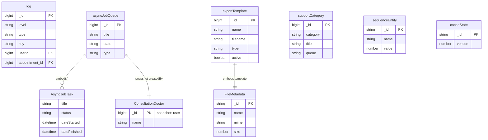

# System

[← Back to Index]\1../../readme.md\3

This file covers the System category: technical configurations, logs, and system-wide settings.

---

## ER Diagram {#er-diagram} {#er-diagram}

Background jobs, application logs, export templates, caches, and system configuration.

---

## Entities in This Category

| Table Name (DBML) | Business Entity | Description Summary |
| :--- | :--- | :--- |
| [`log`](#entity-logs) | System-Logs (Logs) | Technical application logs for monitoring and debugging. |
| [`asyncJobQueue`](#entity-async-job-queue) | Hintergrundaufgaben (Async Job Queue) | Status and tracking of asynchronous background tasks. |
| [`exportTemplate`](#entity-export-templates) | Export-Vorlagen (Export Templates) | Configuration for data exports for various business entities. |
| [`supportCategory`](#entity-support-categories) | Support-Kategorien (Support Categories) | Categories used for organizing support requests and help documents. |
| [`uploadFile`](#entity-upload-files) | Dateiuploads (Upload Files) | Records of generic file uploads managed by the system. |
| [`sequenceEntity`](#entity-sequence-entity) | Sequenz-Zähler (Sequence Entity) | Global counters used to generate unique numeric identifiers. |
| [`videoclinicSystem`](#entity-videoclinic-system) | Systemkonfiguration (Videoclinic System) | Global system settings and configuration parameters. |
| [`cacheState`](#entity-cache-state) | Cache-Status (Cache State) | Technical collection for tracking the version/state of various system caches. |

---

## Entity: System-Logs (Logs) {#entity-logs} {#entity-logs}
Protokollierung von Systemereignissen, Fehlern und sicherheitsrelevanten Aktionen.

### Table: log
| Column | Type | Field Type | Description |
| :--- | :--- | :--- | :--- |
| `_id` | `Long` | schema | Interner Bezeichner |
| `version` | `Long` | schema | Versionsnummer |
| `ts` | `Date` | schema | Zeitstempel |
| `userId` | `Long` | schema | Reference to [user](./user-management.md#entity-expert) |
| `level` | `String` | schema | Log-Level: • `INFO` (Used) • `ERROR` (Used) • `SECURITY` (Used) |
| `type` | `String` | inferred | Art des Ereignisses: • `CONSULTATION` (Used) • `CONSULTATION_TRANSMIT` (Used) • `CONTACT` (Used) |
| `key` | `String` | inferred | Eindeutiger Schlüssel für das Ereignis |
| `message` | `String` | inferred | Log-Nachricht |
| `param` | `Array` | inferred | Parameter zur Nachricht (Strings) |
| `appointment` | `Long` | schema | Reference to [appointment](./planning.md#entity-appointments) |
| `_class` | `String` | schema | Laufzeitklassen-Marker: `de.videoclinic.model.Log` |

The `log` entity stores technical logs and is referenced by:
- (System-wide monitoring tools)

## Entity: Hintergrundaufgaben (Async Job Queue) {#entity-async-job-queue} {#entity-async-job-queue}
Warteschlange für asynchron auszuführende Systemaufgaben.

### Table: asyncJobQueue
| Column | Type | Field Type | Description |
| :--- | :--- | :--- | :--- |
| `_id` | `Long` | schema | Interner Bezeichner |
| `version` | `Long` | schema | Versionsnummer |
| `dateCreated` | `Date` | schema | Erstellungsdatum |
| `dateStarted` | `Date` | schema | Startdatum |
| `dateFinished` | `Date` | schema | Fertigstellungsdatum |
| `title` | `String` | schema | Titel der Aufgabe |
| `state` | `String` | schema | Status: • `DONE` (Used) • `ERROR` (Used) • `FINISHED` (Used) • `RUNNING` (Used) |
| `type` | `String` | schema | Art der Aufgabe: • `APPOINTMENTPLAN` (Used) • `INVOICE` (Used) • `SHIFTPLAN` (Used) • `TREATMENT` (Used) |
| `createdBy` | `Document` | schema | Ersteller ([ConsultationDoctor](./user-management.md#sub-entity-consultationdoctor)) |
| `tasks` | `Array` | schema | Einzelne Teilschritte ([AsyncJobTask](#sub-entity-asyncjobtask)) |
| `_class` | `String` | schema | Laufzeitklassen-Marker: `de.videoclinic.model.AsyncJobQueue` |

The `asyncJobQueue` entity tracks background tasks for:
- [`appointmentPlan`](./planning.md#entity-appointment-plan)
- [`shiftPlan`](./planning.md#entity-shift-plan)
- [`invoice`](./accounting.md#entity-invoices)
- [`treatment`](./treatment.md#entity-treatment)

### Sub-entities for asyncJobQueue

#### Sub-entity: AsyncJobTask {#sub-entity-asyncjobtask} {#sub-entity-asyncjobtask}
Einzelner Arbeitsschritt innerhalb einer Hintergrundaufgabe.

| Column | Type | Field Type | Description |
| :--- | :--- | :--- | :--- |
| `_id` | `String` | inferred | Internal identifier |
| `title` | `String` | schema | Titel des Arbeitsschritts |
| `status` | `String` | schema | Status des Arbeitsschritts (Freitext/Progress message, e.g. "25/2987/5697 OK") |
| `dateStarted` | `Date` | schema | Startzeitpunkt |
| `dateFinished` | `Date` | schema | Endzeitpunkt |

The `AsyncJobTask` sub-entity is used within:
- [`asyncJobQueue`](#entity-async-job-queue)

## Entity: Export-Vorlagen (Export Templates) {#entity-export-templates} {#entity-export-templates}
Definition von Vorlagen für den Datenexport aus dem System.

### Table: exportTemplate
| Column | Type | Field Type | Description |
| :--- | :--- | :--- | :--- |
| `_id` | `Long` | schema | Interner Bezeichner |
| `version` | `Long` | schema | Versionsnummer |
| `name` | `String` | schema | Name der Vorlage |
| `filename` | `String` | schema | Standard-Dateiname für den Export |
| `template` | `Document` | schema | Metadaten der Template-Datei ([FileMetadata](./user-management.md#sub-entity-filemetadata)) |
| `type` | `String` | schema | Export-Typ: • `APPOINTMENT` (Used) • `EXPERT` (Used) • `WORKLOG` (Used) |
| `active` | `Boolean` | schema | Status |
| `_class` | `String` | schema | Laufzeitklassen-Marker: `de.videoclinic.model.ExportTemplate` |

The `exportTemplate` entity is used by:
- (Data export modules for generating CSV/PDF reports)

## Entity: Support-Kategorien (Support Categories) {#entity-support-categories} {#entity-support-categories}
Kategorisierung von Support-Anfragen und deren Zuordnung zu Bearbeitungsschlangen.

### Table: supportCategory
| Column | Type | Field Type | Description |
| :--- | :--- | :--- | :--- |
| `_id` | `Long` | schema | Interner Bezeichner |
| `version` | `Long` | schema | Versionsnummer |
| `category` | `String` | schema | Kategoriename (intern) |
| `title` | `String` | schema | Anzeigename der Kategorie |
| `queue` | `String` | schema | Bearbeitungsschlange (Queue) |
| `subcategories` | `Array` | schema | Liste von Unterkategorien (Strings) |
| `_class` | `String` | schema | Laufzeitklassen-Marker: `de.videoclinic.model.SupportCategory` |

The `supportCategory` entity is used for:
- (Internal helpdesk categorization of support tickets)

## Entity: Dateiuploads (Upload Files) {#entity-upload-files} {#entity-upload-files}
Registry aller über die Benutzeroberfläche hochgeladenen Dateien.

### Table: uploadFile
| Column | Type | Field Type | Description |
| :--- | :--- | :--- | :--- |
| `_id` | `Long` | schema | Interner Bezeichner |
| `version` | `Long` | schema | Versionsnummer |
| `sessionId` | `String` | schema | Session-ID des Uploads |
| `created` | `Long` | schema | Erstellungszeitpunkt (Unix TS) |
| `entry` | `Document` | inferred | Metadaten der Datei ([FileMetadata](./user-management.md#sub-entity-filemetadata)) |
| `_class` | `String` | schema | Laufzeitklassen-Marker: `de.videoclinic.model.UploadFile` |

The `uploadFile` entity references:
- (Uploaded files managed by the system)

## Entity: Sequenz-Zähler (Sequence Entity) {#entity-sequence-entity} {#entity-sequence-entity}
Zähler zur Generierung von fortlaufenden IDs für verschiedene Entitäten.

### Table: sequenceEntity
| Column | Type | Field Type | Description |
| :--- | :--- | :--- | :--- |
| `_id` | `ObjectId` | schema | Interner Bezeichner |
| `name` | `String` | schema | Name der Sequenz (e.g. Entitätsname) |
| `value` | `Long` | schema | Aktueller Zählerwert |
| `_class` | `String` | schema | Laufzeitklassen-Marker: `de.videoclinic.model.SequenceEntity` |

The `sequenceEntity` entity is used by:
- (Internal ID generation logic for various collections)

## Entity: Systemkonfiguration (Videoclinic System) {#entity-videoclinic-system} {#entity-videoclinic-system}
Globale Systemeinstellungen und Metadaten.

### Table: videoclinicSystem
| Column | Type | Field Type | Description |
| :--- | :--- | :--- | :--- |
| `_id` | `ObjectId` | schema | Interner Bezeichner |
| `version` | `Long` | schema | Versionsnummer |
| `invoiceIdFormat` | `String` | schema | Globales Format für Rechnungs-IDs |
| `accountManagement` | `Boolean` | schema | Account-Management aktiviert |
| `timeManagement` | `Boolean` | schema | Zeit-Management aktiviert |
| `_class` | `String` | schema | Laufzeitklassen-Marker: `de.videoclinic.model.VideoclinicSystem` |

The `videoclinicSystem` entity is used for:
- (Global system configuration and feature toggles)

## Entity: Cache-Status (Cache State) {#entity-cache-state} {#entity-cache-state}
Technical collection for tracking the version/state of various system caches.

### Table: cacheState
| Column | Type | Field Type | Description |
| :--- | :--- | :--- | :--- |
| `_id` | `String` | schema | Cache-Bezeichner |
| `version` | `Long` | schema | Aktuelle Version des Caches |
| `_class` | `String` | schema | Laufzeitklassen-Marker: `de.videoclinic.model.CacheState` |

The `cacheState` entity is used for:
- (Internal system performance tracking and cache invalidation)
