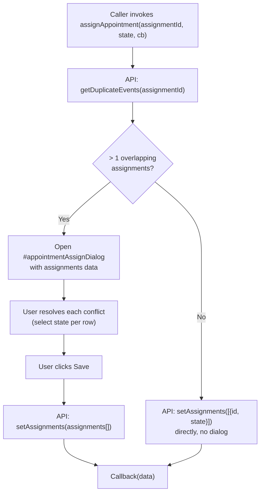

# Appointment Assign User / Collision Dialog — Legacy UI Analysis

---

## Cross-References

### Source Includes

| Type | Direction | Detail | Linked Document | Condition / Context |
|------|-----------|--------|-----------------|---------------------|
| include | **Included by** | `{{> assignUserDlg}}` | [Appointment List](appointment-list.md) | Collision resolution dialog for doctor assignments |
| include | **Included by** | `{{> assignUserDlg}}` | [Shift List](03-shifts/shift-and-plan.md) | Reused for shift staff assignments |
| include | **Included by** | `{{> assignUserDlg}}` | [Treatment List](04-treatments/treatment-and-category.md) | Reused for treatment staff assignments |
| include | **Included by** | `{{> assignUserDlg}}` | [Council List](05-council/council-and-plan.md) | Reused for council staff assignments |
| include | **Included by** | `{{> assignUserDlg}}` | [Staff Management List](_shared-components/profile-staff.md#1-htmlm-metadata) | Reused for staff employee assignments; `#assignmentBtn` opens dialog |

### Service Calls

| Service | Method | Parameters | Dialog / Context |
|---------|--------|------------|------------------|
| `AppointmentService` | `getDuplicateEvents` | `[assignmentId]` | `assignAppointment()` — checks for scheduling conflicts before opening dialog |
| `AppointmentService` | `setAssignments` | `[assignments]` | On dialog Save, or directly if no conflicts |

### Event Flows

| Type | Direction | Event | Linked Document | Condition |
|------|-----------|-------|-----------------|----------|
| event | **Incoming** | `assignAppointment(id, state, cb)` | [Appointment Details Scheduling](appointment-details-scheduling.md#-7-tab-4--assigned-experts) | Accept/Override buttons call `assignAppointment(id, state)` |

> **Include context:** This file's source `assignUser.html` is embedded as `{{> assignUserDlg}}` partial in 5 host pages: [Appointment List](appointment-list.md), [Shift List](03-shifts/shift-and-plan.md), [Treatment List](04-treatments/treatment-and-category.md), [Council List](05-council/council-and-plan.md), and [Staff Management List](_shared-components/profile-staff.md). The `assignAppointment()` global function is called from [Appointment Details Scheduling](appointment-details-scheduling.md) when accepting or overriding doctor assignments.

> **Event chain:** [Appointment Details Scheduling](appointment-details-scheduling.md) -> `assignAppointment(id, state, cb)` -> **this file** -> (if duplicates) opens dialog -> `AppointmentService.setAssignments()` -> callback

---

## 1. Block: Assign User Dialog

| Attribute        | Value                                |
|------------------|--------------------------------------|
| Block ID         | `appointmentAssignDialog`            |
| Element          | `
` with `data-target="modal"`   |
| Icon             | `far fa-user-md` (FontAwesome)       |
| Color            | `bg-color-appointment`               |
| Title            | `{{i18n.appointment}}` ("Appointment") |
| Width            | `800` (px)                           |
| Save button      | `data-buttonsave="true"` (modal has a Save action) |
| Initial display  | `display: none` (hidden until triggered programmatically) |

---

## 2. Description

This is a **collision resolution modal** shown when a manager or admin attempts to assign a doctor (user) to an appointment, and the system detects that the doctor already has overlapping appointments during the same time window.

**Workflow:**
1. The caller invokes `assignAppointment(assignmentId, state, cb)`.
2. The function calls `AppointmentService.getDuplicateEvents(assignmentId)` to check for scheduling conflicts.
3. **If duplicates exist** (response length > 1): the dialog opens, displaying all overlapping assignments in a table. The user must choose a resolution state for each conflicting assignment, then click Save.
4. **If no duplicates**: the assignment is applied directly via `AppointmentService.setAssignments([{id, state}])` without showing the dialog.
5. On Save, the dialog submits the full `data.assignments` array (with updated states) to `AppointmentService.setAssignments`.

---

## 3. Hardcoded Text

| Location | Language | Text | Translation (EN) |
|----------|----------|------|-------------------|
| Line 4 of template, directly inside the modal `
` | **DE (hardcoded)** | "Folgende Termine uberschneiden sich fur die Annahme dieses Arztes." | "The following appointments overlap for accepting this doctor." |

> **Flag:** This German sentence is NOT using an i18n key. It is hardcoded directly in the HTML. The React reimplementation must extract this into a proper translation key.

---

## 4. Collection: Assignments Table

The modal body contains a `<table class="table table-sm">` with a `<tbody>` bound to the collection `data.assignments`.

### Table Columns

| # | Header (i18n key)         | Header (EN) | Data field                                | Type      |
|---|---------------------------|-------------|-------------------------------------------|-----------|
| 1 | *(empty)*                 | *(none)*    | `assignments.state` (select dropdown)      | Select    |
| 2 | `action.dateStart`        | Start       | `assignments.appointment.timeStart`        | Read-only |
| 3 | `action.dateEnd`          | End         | `assignments.appointment.timeEnd`          | Read-only |
| 4 | `action.date`             | Date        | `assignments.appointment.date`             | Read-only |
| 5 | `appointment.title`       | Title       | `assignments.appointment.title`            | Read-only |
| 6 | `location`                | Location    | `assignments.appointment.location.name`    | Read-only |

Each row represents one overlapping assignment. All fields except the state select are read-only display fields rendered via ``.

---

## 5. Form Elements

| Field name          | Element      | Type     | Required             | Options/Values                     | Bound to                |
|---------------------|-------------|----------|----------------------|------------------------------------|-------------------------|
| `assignments.state` | `<select>`  | Dropdown | Yes (`class="mandatory"`) | ACCEPTED, RESERVED, AGREED, OVERRIDE (mapped to AGREED), REJECTED, ABORTED, REMOVE | Each row in collection |

---

## 6. Assignment State Options

| Value      | i18n Key                     | Label (EN) | Description                                                        |
|------------|------------------------------|------------|--------------------------------------------------------------------|
| `ACCEPTED` | `action.assignment.accept`   | Accept     | Confirm the doctor's assignment to this appointment                |
| `RESERVED` | `action.assignment.reserve`  | Reserve    | Tentatively hold the assignment (not yet confirmed)                |
| `AGREED`   | `action.assignment.override` | Override   | Force-accept despite the scheduling conflict (override collision)  |
| `REJECTED` | `action.assignment.reject`   | Reject     | Reject the doctor's assignment to this appointment                 |
| `ABORTED`  | `action.assignment.abort`    | Abort      | Cancel/abort the assignment entirely                               |
| `REMOVE`   | `action.assignment.remove`   | Remove     | Remove the assignment record from the appointment                  |

> **Note:** The `AGREED` value is displayed with the label "Override" (`action.assignment.override`), suggesting that `AGREED` is the backend enum value for an override action. This mapping must be preserved in the reimplementation.

---

## 7. Translation Table

| i18n Key                       | DE (legacy)                                                                                  | EN              | Notes         |
|--------------------------------|----------------------------------------------------------------------------------------------|-----------------|---------------|
| `appointment`                  | Termin                                                                                       | Appointment     | Dialog title  |
| `action.dateStart`             | Start                                                                                        | Start           |               |
| `action.dateEnd`               | Ende                                                                                         | End             |               |
| `action.date`                  | Datum                                                                                        | Date            |               |
| `appointment.title`            | Titel                                                                                        | Title           |               |
| `location`                     | Standort                                                                                     | Location        |               |
| `action.assignment.accept`     | Annehmen                                                                                     | Accept          |               |
| `action.assignment.reserve`    | Reservieren                                                                                  | Reserve         |               |
| `action.assignment.override`   | Uberschreiben                                                                                | Override        |               |
| `action.assignment.reject`     | Ablehnen                                                                                     | Reject          |               |
| `action.assignment.abort`      | Abbrechen                                                                                    | Abort           |               |
| `action.assignment.remove`     | Entfernen                                                                                    | Remove          |               |
| *(hardcoded)*                  | Folgende Termine uberschneiden sich fur die Annahme dieses Arztes.                           | The following appointments overlap for accepting this doctor. | **HARDCODED** |

---

## 8. API Calls

| Service              | Method                | Parameters                  | When called                          | Returns                    |
|----------------------|-----------------------|-----------------------------|--------------------------------------|----------------------------|
| `AppointmentService` | `getDuplicateEvents`  | `[assignmentId]`            | When `assignAppointment()` is called | Array of assignment objects |
| `AppointmentService` | `setAssignments`      | `[assignments]` (array)     | On dialog Save, or directly if no conflicts | Updated data (via callback) |

---

## 9. Dialog Navigation Flow

### Entry Points

The `assignAppointment()` function is a global function called from other appointment views (e.g., appointment detail, calendar views, or assignment management panels) whenever a doctor assignment action is triggered. It is not invoked from within this file itself — it serves as a shared utility that any view can call.

---

## 10. Reimplementation Notes

1. **Extract hardcoded German text** into a proper i18n key (e.g., `appointment.assign.collisionWarning`).
2. **Modal mapping**: Use a Shadcn `Dialog` (or `AlertDialog` given the confirmation nature) with a responsive table inside.
3. **State select**: Use a Shadcn `Select` component per row. The `AGREED`/Override mapping should be documented clearly in the enum/schema.
4. **Loader pattern**: The legacy code uses `showLoader()`/`hideLoader()` around API calls. In React, this maps to loading states on the mutation (e.g., `isPending` from React Query `useMutation`).
5. **Callback pattern**: The legacy `cb(data)` callback should be replaced with React Query cache invalidation and/or `onSuccess` handlers.
6. **The dialog is only shown conditionally** (when duplicates > 1). The React implementation should handle this with state: call the check API, then conditionally render the dialog based on the response.
