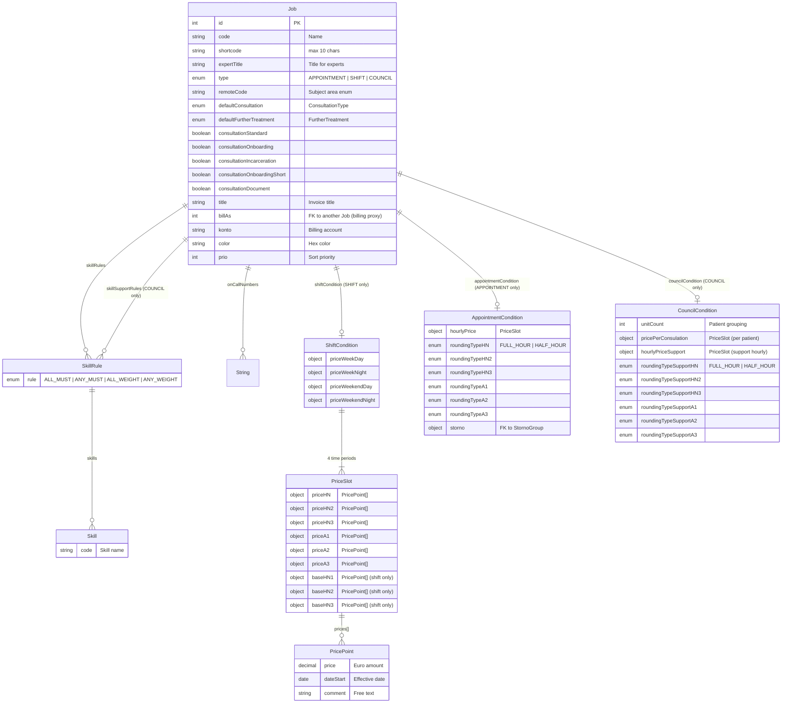

---
---

# 03 - Job/Service Configuration (Admin)

> **Source files**
> - `admin/job.htmlm` (837 lines) -- Job list + tabbed detail dialog (largest file in admin)
> - `admin/job.js` (183 lines) -- Job management logic, price-point handling, skill selection
>
> **External dependencies**: `jquery.colorpicker.css` + `jquery.colorpicker.js` (color picker widget), `messages.i18n.js`

---

## Cross-References

### Service Calls

| Service | Method | Parameters | Dialog / Context |
|---------|--------|------------|------------------|
| `JobService` | `getAll` | `[id, limit]` | Grid data load (100-row limit) |
| `JobService` | `get` | `[id]` | Detail dialog fetch |
| `JobService` | `getAvailableShift` | `[id]` | Shift job `<option>` list (server-side) |
| `JobService` | `getAvailableAppointment` | `[id]` | Appointment job `<option>` list (server-side) |
| `JobService` | `getAvailableCouncil` | `[id]` | Council job `<option>` list (server-side) |
| `StornoGroupService` | `getAll` | `[id]` | Storno/cancellation group `<option>` list |
| `UserService` | `saveSetting` | `[key, value]` | Grid column settings persistence |
| `SkillService` | `autocomplete` | `[query]` | `#skillSelectDlg` skill search |

> **Service context:** Job configuration is the master admin UI for managing job/service definitions. It provides autocomplete lookups for all three job types (APPOINTMENT, SHIFT, COUNCIL) and hosts the skill rule editor used to constrain expert assignment.

---

## 1. HTMLM Metadata

| Property       | Value                                          |
| -------------- | ---------------------------------------------- |
| Templates      | `navbar` (`../_include/navbar.mustache`)        |
| Variables      | `usePanel = false`, `search = true`             |
| Filter panel   | **Enabled** (offcanvas, right-side)             |
| Container ID   | `#job`                                          |
| CSS class      | `tableView`                                     |
| Data limit     | `100`                                           |

### Server-Side Options (pre-loaded into Mustache)

| Variable          | Service                    | Method                  | Value  | Content | Notes                    |
| ----------------- | -------------------------- | ----------------------- | ------ | ------- | ------------------------ |
| `jobsShift`       | `JobService`               | `getAvailableShift`     | `id`   | `code`  | `<option>` list for Shift jobs       |
| `jobsAppointment` | `JobService`               | `getAvailableAppointment` | `id` | `code`  | `<option>` list for Appointment jobs |
| `jobsCouncil`     | `JobService`               | `getAvailableCouncil`   | `id`   | `code`  | `<option>` list for Council jobs     |
| `stornoGroups`    | `StornoGroupService`       | `getAll`                | `id`   | `title` | `<option>` list for cancellation groups |

### Service Binding (from `job.js`)

| Property       | Value                          |
| -------------- | ------------------------------ |
| Service name   | `JobService`                   |
| List method    | `getAll`                       |
| Detail method  | `get`                          |
| Grid plugin    | `slickerGrid` (fullscreen)     |
| Load guard     | `Core.hasLoaded("jobLoaded")`  |
| Save settings  | `UserService.saveSetting` (persists grid column settings per user) |
| Data limit     | `100` (passed as second param to `getAll`) |

### Client-Side Search Filter (from `job.js`)

Searches `code` and `remoteCode` fields (case-insensitive substring match). Bound to `#siteSearch` keyup/change. Escape key clears the filter.

---

## 2. Grid Columns (8 columns)

All columns share: `data-sortable="true"`, `data-resizable="true"`.

| # | `data-field`   | `data-name` (i18n key)   | Width | `data-formatter`         | Notes               |
|---|----------------|--------------------------|-------|--------------------------|----------------------|
| 1 | `id`           | `label.id`               | 80    | --                       | Primary key          |
| 2 | `code`         | `label.name`             | 200   | --                       | Job name/code        |
| 3 | `type`         | `label.type`             | 100   | `i18n.appointmentType`   | APPOINTMENT/SHIFT/COUNCIL |
| 4 | `expertTitle`  | `job.expertTitle`        | 350   | --                       | Title for experts    |
| 5 | `shortcode`    | `jobId.shortcode`        | 150   | --                       | Short code (max 10)  |
| 6 | `remoteCode`   | `label.remoteCode`       | 100   | --                       | Remote/subject area  |
| 7 | `konto`        | `label.account`          | 100   | --                       | Billing account      |
| 8 | `prio`         | `label.priority`         | 80    | --                       | Sort priority        |

**Formatters used**: `i18n.appointmentType` (column 3) -- custom i18n lookup that maps enum values like `SHIFT` to translated labels.

---

## 3. Toolbar Buttons

| Button ID        | Label (i18n)    | Icon           | Disabled | Notes                      |
| ---------------- | --------------- | -------------- | -------- | -------------------------- |
| `addMenuBtn`     | `action.add`    | `plus-square`  | `false`  | Create new job             |
| `editMenuBtn`    | `action.change` | `pencil`       | `true`   | Edit selected job          |
| `deleteMenuBtn`  | `action.delete` | `trash`        | `true`   | Delete selected job        |
| *(spacer)*       | --              | --             | --       | Visual separator           |

---

## 4. Filter Panel (Offcanvas, right-side)

| # | Field Name       | Type       | Placeholder (i18n)    | Notes                        |
|---|------------------|------------|-----------------------|------------------------------|
| 1 | `data.code`      | text       | `filter.name`         | Filter by job name           |
| 2 | `data.type`      | select     | HARDCODED "-- Typ auswahlen --" | APPOINTMENT / SHIFT / COUNCIL |
| 3 | `data.remoteCode`| text       | `label.remoteCode`    | Filter by remote code        |
| 4 | `data.konto`     | text       | `label.account`       | Filter by account            |
| 5 | `data.prio`      | number     | `label.priority`      | Filter by priority           |

Max results selector: 100 (default), 150, 200, 300, 500, >500. Buttons: Apply (`button.apply`) and Reset (`button.reset`).

---

## 5. Detail Dialog -- Tab Structure

| Tab ID      | Icon                  | Label        | Content                                |
| ----------- | --------------------- | ------------ | -------------------------------------- |
| `#tabInfo`  | `fas fa-info`         | *(icon only)* | General info, billing, skills, on-call numbers |
| `#tabTimes` | `fas fa-user-clock`   | *(icon only)* | Pricing/conditions (Shift, Appointment, Council sections) |

### Detail Dialog Attributes

| Attribute    | Value                        |
| ------------ | ---------------------------- |
| `id`         | `jobDlg`                     |
| `data-icon`  | `fa fa-fw fa-graduation-cap` |
| `data-width` | `1200`                       |
| `data-color` | `bg-color3`                  |
| `title`      | `{{i18n.jobId}}`             |

---

## 6. Tab 1: Info (`#tabInfo`)

### 6.1 Form Elements -- Row 1 (General Fields)

| Col  | Name (Binding)                     | Symbol             | Type     | Placeholder (i18n)          | Options                                                  | Required | Condition       |
|------|------------------------------------|--------------------|----------|-----------------------------|---------------------------------------------------------|----------|-----------------|
| 3/12 | `data.code`                       | `far fa-calendar`  | text     | `label.name`                | --                                                       | Yes (mandatory) | --           |
| 3/12 | `data.shortcode`                  | `far fa-file`      | text     | `jobId.shortcode` + " max.10" | maxlength=10                                           | No       | --              |
| 3/12 | `data.expertTitle`                | `far fa-user-md`   | text     | `job.expertTitle`           | --                                                       | No       | --              |
| 3/12 | `data.type`                       | --                 | select   | "---"                       | APPOINTMENT, SHIFT, COUNCIL                              | No       | Controls conditional sections |
| 3/12 | `data.remoteCode`                 | --                 | select   | `job.subjectArea`           | Allgemeinmedizin, Psychiatrie, Dermatologie, Substitution, Psychotherapie | No | -- |
| 3/12 | `data.defaultConsultation`        | --                 | select   | `ConsultationType`          | EXTERNAL, DOCUMENT, STANDARD, ONBOARDING, ONBOARDING_SHORT, INCARCERATION | No | -- |
| 3/12 | `data.defaultFurtherTreatment`    | --                 | select   | `consultation.furtherTreatment` | REFERRAL, IF_REQUIRED, FOLLOW_UP, REFERRAL_OTHER     | No       | --              |

### 6.2 Consultation Type Checkboxes (col-sm-3)

| Name (Binding)                          | Label (i18n)                     |
|-----------------------------------------|----------------------------------|
| `data.consultationStandard`             | `ConsultationType.STANDARD`      |
| `data.consultationOnboarding`           | `ConsultationType.ONBOARDING`    |
| `data.consultationIncarceration`        | `ConsultationType.INCARCERATION` |
| `data.consultationOnboardingShort`      | `ConsultationType.ONBOARDING_SHORT` |
| `data.consultationDocument`             | `ConsultationType.DOCUMENT`      |

All are `type="checkbox"` with class `bool`.

### 6.3 Billing Section

| Col  | Name (Binding)     | Symbol             | Type     | Placeholder (i18n)        | Condition                     |
|------|--------------------|--------------------|----------|---------------------------|-------------------------------|
| 4/12 | `data.title`      | `far fa-receipt`   | text     | `invoice` + `label.title` | Visible when `billAs` is empty (class `billing`) |
| 4/12 | `data.billAs`     | --                 | select   | `invoice`                 | Options grouped by type: Appointment/Shift/Council jobs |
| 4/12 | `data.konto`      | --                 | text     | `billing.konto`           | Visible when `billAs` is empty (class `billing`) |
| 2/12 | `data.color`      | `far fa-palette`   | text (colorPicker) | `color`         | Color picker widget           |
| 2/12 | `data.prio`       | `far fa-sort-amount-down` | number | `label.priority`    | --                            |

**Conditional logic** (from `job.js`): When `#jobBillAs` has a value, elements with class `billing` are hidden. When empty, they are shown. This means the invoice title and konto fields are only relevant when the job handles its own billing (not billing-as another job).

### 6.4 Skills Collection (Skill Rules)

**Header**: "Skills" + conditional "(Main)" label for Council type. Add button: `data-field="data.skillRules"`.

| Collection             | `data-field`             | ID             | Condition                    |
|------------------------|--------------------------|----------------|------------------------------|
| Main skill rules       | `data.skillRules`        | `skillList`    | Always visible               |
| Support skill rules    | `data.skillSupportRules` | `skillSupportList` | Only visible for COUNCIL (`#skillSupportRules`) |

**Repeated row structure** (both collections share the same template):

| Col  | Field Binding          | Type     | Options                                      | Required |
|------|------------------------|----------|----------------------------------------------|----------|
| 4/12 | `skillRules.rule`      | select   | ALL_MUST, ANY_MUST, ALL_WEIGHT, ANY_WEIGHT   | Yes (mandatory) |
| --   | *(add skill button)*   | button   | Opens `#skillSelectDlg`                      | --       |
| 7/12 | `skillRules.skills`    | nested collection | Displays `skills.code` with delete icon | --    |
| 1/12 | *(delete rule)*        | button   | Removes entire rule row                      | --       |

### 6.5 On-Call Numbers Collection

**Header**: "On-Call Numbers". Add button: `data-field="data.onCallNumbers"`.

| Collection           | `data-field`           |
|----------------------|------------------------|
| On-call numbers      | `data.onCallNumbers`   |

**Repeated row**: Single text input per row with phone icon and delete button. Binding: `onCallNumbers.` (direct string value collection).

---

## 7. Tab 2: Times/Pricing (`#tabTimes`)

This tab has **three conditional sections** controlled by the `data.type` select on Tab 1.

### 7.1 Shift Pricing Table (visible when type = SHIFT)

A matrix table with time periods as rows and fee-note/employee tiers as columns. Each cell is a `pricePoints` input that opens the Price Point Dialog on click.

**Column headers** (two-level):

| Level 1         | Level 2 Columns |
|-----------------|-----------------|
| *(empty)*       | *(row labels)*  |
| EK Fee Notes    | HN1, HN2, HN3  |
| *(empty)*       | A1, A2          |
| EK Employees    | A3              |

**Row structure** (4 time periods x 2 sub-rows each):

| Time Period (i18n)                  | Sub-Row | Data Path Prefix                        | Columns (HN, HN2, HN3, A1, A2, A3) |
|-------------------------------------|---------|-----------------------------------------|--------------------------------------|
| `AppointmentPriceType.WEEKDAY`      | Pro Pat. (per patient) | `shiftCondition.priceWeekDay.price{X}` | HN, HN2, HN3, A1, A2, A3 |
| `AppointmentPriceType.WEEKDAY`      | Basis    | `shiftCondition.priceWeekDay.base{X}`   | HN1, HN2, HN3 (A columns empty) |
| `AppointmentPriceType.WEEKNIGHT`    | Pro Pat. | `shiftCondition.priceWeekNight.price{X}` | HN, HN2, HN3, A1, A2, A3 |
| `AppointmentPriceType.WEEKNIGHT`    | Basis    | `shiftCondition.priceWeekNight.base{X}`  | HN1, HN2, HN3 (A columns empty) |
| `AppointmentPriceType.WEEKENDDAY`   | Pro Pat. | `shiftCondition.priceWeekendDay.price{X}` | HN, HN2, HN3, A1, A2, A3 |
| `AppointmentPriceType.WEEKENDDAY`   | Basis    | `shiftCondition.priceWeekendDay.base{X}` | HN1, HN2, HN3 (A columns empty) |
| `AppointmentPriceType.WEEKENDNIGHT` | Pro Pat. | `shiftCondition.priceWeekendNight.price{X}` | HN, HN2, HN3, A1, A2, A3 |
| `AppointmentPriceType.WEEKENDNIGHT` | Basis    | `shiftCondition.priceWeekendNight.base{X}` | HN1, HN2, HN3 (A columns empty) |

All inputs use class `pricePoints` and display a Euro symbol. Clicking opens the Price Point Dialog. Basis rows only have HN1/HN2/HN3 (no A1/A2/A3).

**Note**: The first HN column uses `priceHN` (not `priceHN1`) while the second/third use `priceHN2`/`priceHN3`. Same asymmetry in base columns: `baseHN1`, `baseHN2`, `baseHN3`.

### 7.2 Appointment Pricing (visible when type = APPOINTMENT)

#### Hourly Rate Section

| Tier | Price Field (pricePoints)                     | Rounding Type Binding                              | Rounding Options            |
|------|-----------------------------------------------|----------------------------------------------------|-----------------------------|
| HN1  | `appointmentCondition.hourlyPrice.priceHN`   | `data.appointmentCondition.roundingTypeHN`          | FULL_HOUR, HALF_HOUR        |
| HN2  | `appointmentCondition.hourlyPrice.priceHN2`  | `data.appointmentCondition.roundingTypeHN2`         | FULL_HOUR, HALF_HOUR        |
| HN3  | `appointmentCondition.hourlyPrice.priceHN3`  | `data.appointmentCondition.roundingTypeHN3`         | FULL_HOUR, HALF_HOUR        |
| A1   | `appointmentCondition.hourlyPrice.priceA1`   | `data.appointmentCondition.roundingTypeA1`          | FULL_HOUR, HALF_HOUR        |
| A2   | `appointmentCondition.hourlyPrice.priceA2`   | `data.appointmentCondition.roundingTypeA2`          | FULL_HOUR, HALF_HOUR        |
| A3   | `appointmentCondition.hourlyPrice.priceA3`   | `data.appointmentCondition.roundingTypeA3`          | FULL_HOUR, HALF_HOUR        |

#### Cancellation Conditions

| Field Binding                             | Type     | Options                    |
|-------------------------------------------|----------|----------------------------|
| `data.appointmentCondition.storno`        | select (object, key=id) | Pre-loaded `stornoGroups` |

### 7.3 Council Pricing (visible when type = COUNCIL)

#### Sale Section (HARDCODED German)

| Field Binding                               | Type    | Label                        |
|---------------------------------------------|---------|------------------------------|
| `data.councilCondition.unitCount`           | number  | HARDCODED "gruppiert auf ... Patienten" |

HARDCODED explanation: "Verkaufspreis bezieht sich auf Einheiten von je 4 Patienten (5. Patient = neue Einheit)."

#### Main Expert -- Prices Per Patient

| Tier | Price Field (pricePoints)                           |
|------|-----------------------------------------------------|
| HN   | `councilCondition.pricePerConsulation.priceHN`      |
| HN2  | `councilCondition.pricePerConsulation.priceHN2`     |
| HN3  | `councilCondition.pricePerConsulation.priceHN3`     |
| A1   | `councilCondition.pricePerConsulation.priceA1`      |
| A2   | `councilCondition.pricePerConsulation.priceA2`      |
| A3   | `councilCondition.pricePerConsulation.priceA3`      |

**Note**: The data model uses `pricePerConsulation` (misspelling of "Consultation") -- this is in the legacy data model.

#### Support Expert -- Hourly Rate

| Tier | Price Field (pricePoints)                              |
|------|--------------------------------------------------------|
| HN   | `councilCondition.hourlyPriceSupport.priceHN`         |
| HN2  | `councilCondition.hourlyPriceSupport.priceHN2`        |
| HN3  | `councilCondition.hourlyPriceSupport.priceHN3`        |
| A1   | `councilCondition.hourlyPriceSupport.priceA1`         |
| A2   | `councilCondition.hourlyPriceSupport.priceA2`         |
| A3   | `councilCondition.hourlyPriceSupport.priceA3`         |

#### Support Expert -- Rounding Scheme

| Tier | Binding                                                     | Options              |
|------|-------------------------------------------------------------|----------------------|
| HN   | `data.councilCondition.roundingTypeSupportHN`               | FULL_HOUR, HALF_HOUR |
| HN2  | `data.councilCondition.roundingTypeSupportHN2`              | FULL_HOUR, HALF_HOUR |
| HN3  | `data.councilCondition.roundingTypeSupportHN3`              | FULL_HOUR, HALF_HOUR |
| A1   | `data.councilCondition.roundingTypeSupportA1`               | FULL_HOUR, HALF_HOUR |
| A2   | `data.councilCondition.roundingTypeSupportA2`               | FULL_HOUR, HALF_HOUR |
| A3   | `data.councilCondition.roundingTypeSupportA3`               | FULL_HOUR, HALF_HOUR |

#### Commented-Out: Council Main Hourly Rate + Rounding (lines 565-646)

A commented-out section exists for council main expert hourly rates and rounding schemes (fields `councilCondition.hourlyPrice.*` and `councilCondition.roundingType{HN,HN2,HN3,A1,A2,A3}`). This was presumably replaced by per-patient pricing.

---

## 8. Sub-Dialogs

### 8.1 Price Point Dialog (`#pricePointDlg`)

| Attribute    | Value                        |
| ------------ | ---------------------------- |
| `id`         | `pricePointDlg`              |
| `data-icon`  | `fa fa-fw fa-sack-dollar`    |
| `data-color` | `bg-color3`                  |
| `data-target`| `secondary`                  |
| `title`      | `{{i18n.job.price}}`         |

**Collection**: `data.prices` (table rows with add button)

| # | Field Binding    | Type         | Label       | Required     | Notes              |
|---|------------------|--------------|-------------|--------------|---------------------|
| 1 | `prices.price`  | number       | HARDCODED "Preis" | Yes (mandatory) | Euro suffix     |
| 2 | `prices.dateStart` | date      | HARDCODED "Start" | No          | Date picker        |
| 3 | `prices.comment` | text        | HARDCODED "Kommentar" | No      | Free text          |
| 4 | *(delete)*       | action       | --          | --           | `far fa-trash delete` |

**Behavior** (from `job.js`):
- Clicking any `pricePoints` input opens this dialog with the corresponding nested price data.
- If a single price exists, the input shows the value with Euro sign.
- If multiple prices exist, the input shows the current price or "multiple" with a sack-dollar icon indicator.
- On dialog close, prices are written back to the parent data object.

### 8.2 Skill Select Dialog (`#skillSelectDlg`)

| Attribute    | Value                        |
| ------------ | ---------------------------- |
| `id`         | `skillSelectDlg`             |
| `data-icon`  | `fa fa-fw fa-graduation-cap` |
| `data-color` | `bg-color3`                  |
| `data-target`| `modal`                      |
| `title`      | `{{i18n.skill}}`             |

**Autocomplete input**: Service `SkillService`, method `autocomplete`, displays `code` field. Selecting an item auto-closes the dialog and adds the skill to the target collection.

---

## 9. Conditional Visibility Logic (from `job.js`)

### Type-Based Sections

| `data.type` Value | Visible CSS Classes           | Extra Visibility                  |
|-------------------|-------------------------------|-----------------------------------|
| `APPOINTMENT`     | `.showAppointment`            | --                                |
| `SHIFT`           | `.showShift`                  | --                                |
| `COUNCIL`         | `.showCouncil`                | `#skillSupportRules` shown        |
| *(empty/other)*   | *(all hidden)*                | --                                |

On type change, all conditional classes are hidden first, then the matching set is shown.

### Bill-As Conditional

| `data.billAs` Value | `.billing` Visibility |
|---------------------|-----------------------|
| *(empty)*           | Shown                 |
| *(any job selected)*| Hidden                |

---

## 10. Click Actions Summary

| Action ID / Trigger        | Symbol              | Title (i18n)     | English            | Notes                          |
|----------------------------|----------------------|------------------|--------------------|--------------------------------|
| `addMenuBtn`               | `fa-plus-square`     | `action.add`     | Add                | Opens empty detail dialog      |
| `editMenuBtn`              | `fa-pencil`          | `action.change`  | Change             | Opens detail with selected row |
| `deleteMenuBtn`            | `fa-trash`           | `action.delete`  | Delete             | Deletes selected row           |
| `.pricePoints` click       | --                   | --               | --                 | Opens Price Point Dialog       |
| `.addSkill` click          | `far fa-plus`        | --               | --                 | Opens Skill Select Dialog      |
| `.add[data-field]`         | `fa fa-plus`         | --               | --                 | Adds row to collection         |
| `.delete`                  | `fa fa-trash`        | --               | --                 | Removes row from collection    |
| Filter Apply               | --                   | `button.apply`   | Apply              | Applies filter panel           |
| Filter Reset               | --                   | `button.reset`   | Reset              | Resets filter panel            |

---

## 11. Translation Table

| Text-Reference                        | German (Legacy)              | English                      | Notes                                       |
|---------------------------------------|------------------------------|------------------------------|---------------------------------------------|
| `label.id`                            | ID                           | ID                           | Grid column                                 |
| `label.name`                          | Name                         | Name                         | Grid column + form field                    |
| `label.type`                          | Typ                          | Type                         | Grid column                                 |
| `label.priority`                      | Prioritat                    | Priority                     | Grid column + form field                    |
| `label.account`                       | Konto                        | Account                      | Grid column + filter                        |
| `label.remoteCode`                    | Remote Code                  | Remote Code                  | Grid column + filter                        |
| `job.expertTitle`                     | Titel (Experte)              | Title (Expert)               | Grid column + form field                    |
| `jobId.shortcode`                     | Kurzcode                     | Shortcode                    | Grid column + form field                    |
| `jobId`                               | Dienstleistung               | Job/Service                  | Dialog title                                |
| `job.subjectArea`                     | Fachgebiet                   | Subject Area                 | Select placeholder                          |
| `job.price`                           | Preis                        | Price                        | Price Point Dialog title                    |
| `job.hourlyRate`                      | Stundensatz                  | Hourly Rate                  | Section label                               |
| `job.scheme`                          | Schema                       | Scheme                       | Section label (rounding)                    |
| `job.pricesPerPatient`                | Preise pro Patient           | Prices Per Patient           | Section label                               |
| `job.feeNotes`                        | EK Honorarnoten              | EK Fee Notes                 | Table header                                |
| `job.employees`                       | EK Mitarbeiter               | EK Employees                 | Table header                                |
| `job.cancellationConditions`          | Stornobedingungen            | Cancellation Conditions      | Section label                               |
| `job.role.AllMust`                    | Alle mussen                  | All Must                     | Skill rule option                           |
| `job.role.AnyMust`                    | Einer muss                   | Any Must                     | Skill rule option                           |
| `job.role.AllWeight`                  | Alle gewichtet               | All Weight                   | Skill rule option                           |
| `job.role.AnyWeight`                  | Einer gewichtet              | Any Weight                   | Skill rule option                           |
| `job.generalMedicine`                 | Allgemeinmedizin             | General Medicine             | Subject area option                         |
| `job.psychiatry`                      | Psychiatrie                  | Psychiatry                   | Subject area option                         |
| `job.dermatology`                     | Dermatologie                 | Dermatology                  | Subject area option                         |
| `job.psychotherapy`                   | Psychotherapie               | Psychotherapy                | Subject area option                         |
| `AppointmentType.APPOINTMENT`         | Termin                       | Appointment                  | Type select + filter                        |
| `AppointmentType.SHIFT`              | Dienst                       | Shift                        | Type select + filter                        |
| `AppointmentType.COUNCIL`            | Konsil                       | Council                      | Type select + filter                        |
| `ConsultationType`                    | Konsultationstyp             | Consultation Type            | Select placeholder                          |
| `ConsultationType.STANDARD`          | Standard                     | Standard                     | Checkbox + select option                    |
| `ConsultationType.ONBOARDING`        | Onboarding                   | Onboarding                   | Checkbox + select option                    |
| `ConsultationType.ONBOARDING_SHORT`  | Onboarding (kurz)            | Onboarding Short             | Checkbox + select option                    |
| `ConsultationType.INCARCERATION`     | Inhaftierung                 | Incarceration                | Checkbox + select option                    |
| `ConsultationType.DOCUMENT`          | Dokument                     | Document                     | Checkbox + select option                    |
| `ConsultationType.EXTERNAL`          | Extern                       | External                     | Select option                               |
| `consultation.furtherTreatment`      | Weiterbehandlung             | Further Treatment            | Select placeholder                          |
| `FurtherTreatment.REFERRAL`          | Uberweisung                  | Referral                     | Select option                               |
| `FurtherTreatment.IF_REQUIRED`       | Bei Bedarf                   | If Required                  | Select option                               |
| `FurtherTreatment.FOLLOW_UP`         | Nachsorge                    | Follow Up                    | Select option                               |
| `FurtherTreatment.REFERRAL_OTHER`    | Uberweisung andere           | Referral Other               | Select option                               |
| `HourlyRoundingType.FULL_HOUR`       | Volle Stunde                 | Full Hour                    | Rounding select option                      |
| `HourlyRoundingType.HALF_HOUR`       | Halbe Stunde                 | Half Hour                    | Rounding select option                      |
| `AppointmentPriceType.WEEKDAY`       | Werktag                      | Weekday                      | Shift price row                             |
| `AppointmentPriceType.WEEKNIGHT`     | Werknacht                    | Weeknight                    | Shift price row                             |
| `AppointmentPriceType.WEEKENDDAY`    | Wochenendtag                 | Weekend Day                  | Shift price row                             |
| `AppointmentPriceType.WEEKENDNIGHT`  | Wochenendnacht               | Weekend Night                | Shift price row                             |
| `council.main`                       | Hauptexperte                 | Main (Expert)                | Section label                               |
| `council.support`                    | Unterstutzung                | Support                      | Section label                               |
| `invoice`                            | Rechnung                     | Invoice                      | Billing placeholder                         |
| `billing.konto`                      | Konto                        | Account                      | Billing field                               |
| `color`                              | Farbe                        | Color                        | Color picker placeholder                    |
| `skill`                              | Qualifikation                | Skill                        | Skill dialog title                          |
| `skills`                             | Qualifikationen              | Skills                       | Section header                              |
| `onCallNumbers`                      | Bereitschaftsnummern         | On-Call Numbers              | Collection header + placeholder             |
| `shift`                              | Dienst                       | Shift                        | Section header in Times tab                 |
| `appointment`                        | Termin                       | Appointment                  | Section header in Times tab                 |
| `filter.name`                        | Name                         | Name                         | Filter field                                |
| `button.apply`                       | Anwenden                     | Apply                        | Filter button                               |
| `button.reset`                       | Zurucksetzen                 | Reset                        | Filter button                               |
| `filter.results`                     | Ergebnisse                   | Results                      | Max results title                           |
| `action.add`                         | Hinzufugen                   | Add                          | Toolbar button                              |
| `action.change`                      | Andern                       | Change                       | Toolbar button                              |
| `action.delete`                      | Loschen                      | Delete                       | Toolbar button                              |

### Hardcoded German Strings

| Location          | German Text                                                              | Suggested i18n Key             |
|-------------------|--------------------------------------------------------------------------|--------------------------------|
| Filter type select | "-- Typ auswahlen --"                                                   | `filter.selectType`            |
| Shift table rows  | "Pro Pat." (per patient)                                                 | `job.perPatient`               |
| Shift table rows  | "Basis"                                                                  | `job.basis`                    |
| Council sale heading | "Verkauf"                                                              | `job.sale`                     |
| Council grouping  | "gruppiert auf ... Patienten"                                           | `job.groupedOnPatients`        |
| Council explanation | "Verkaufspreis bezieht sich auf Einheiten von je 4 Patienten..."       | `job.saleExplanation`          |
| Council note      | "Damit pro Patient abgerechnet wird mindestens HN fullen..."           | `job.councilBillingNote`       |
| Price Point Dialog | "Preis", "Start", "Kommentar"                                          | `label.price`, `label.start`, `label.comment` |
| Substitution option | "Substitution"                                                         | `job.substitution`             |

---

## 12. Data Model Mapping Diagram



---

## 13. Tab-to-Data Relationship Diagram

```mermaid
graph TD
    subgraph "Tab 1: Info"
        A1[General Fields<br/>code, shortcode, expertTitle, type,<br/>remoteCode, defaultConsultation,<br/>defaultFurtherTreatment]
        A2[Consultation Checkboxes<br/>consultationStandard, consultationOnboarding,<br/>consultationIncarceration, consultationOnboardingShort,<br/>consultationDocument]
        A3[Billing<br/>title, billAs, konto, color, prio]
        A4[Skill Rules Collection<br/>skillRules → rule + skills]
        A5[Skill Support Rules<br/>skillSupportRules → rule + skills<br/>COUNCIL only]
        A6[On-Call Numbers<br/>onCallNumbers]
    end

    subgraph "Tab 2: Times"
        B1[Shift Pricing Matrix<br/>shiftCondition.price{Period}.price/base{Tier}<br/>4 periods x 6 tiers + 3 base tiers]
        B2[Appointment Hourly<br/>appointmentCondition.hourlyPrice.price{Tier}<br/>+ roundingType{Tier} + storno]
        B3[Council Main Per-Patient<br/>councilCondition.pricePerConsulation.price{Tier}]
        B4[Council Support Hourly<br/>councilCondition.hourlyPriceSupport.price{Tier}<br/>+ roundingTypeSupport{Tier}]
        B5[Council Sale Config<br/>councilCondition.unitCount]
    end

    subgraph "Sub-Dialogs"
        C1[Price Point Dialog<br/>prices: price, dateStart, comment]
        C2[Skill Select Dialog<br/>SkillService.autocomplete]
    end

    B1 -->|click pricePoints| C1
    B2 -->|click pricePoints| C1
    B3 -->|click pricePoints| C1
    B4 -->|click pricePoints| C1
    A4 -->|addSkill button| C2
    A5 -->|addSkill button| C2

    TYPE{data.type} -->|SHIFT| B1
    TYPE -->|APPOINTMENT| B2
    TYPE -->|COUNCIL| B3
    TYPE -->|COUNCIL| B4
    TYPE -->|COUNCIL| B5
    TYPE -->|COUNCIL| A5
```

---

## 14. Key Implementation Notes for Rebuild

1. **Price Points are complex objects**: Each price field is not a simple number but a collection of dated price entries with comments. The UI shows a single value when there is one price, "multiple" when there are several, and opens a sub-dialog for editing. This needs a custom `PricePointInput` component.

2. **Type-conditional rendering**: The `data.type` field controls which entire sections of Tab 2 are visible. In React, this maps to conditional rendering or a polymorphic form based on the type enum.

3. **Nested collections**: Skill rules have two levels of nesting -- a collection of rules, each containing a nested collection of skills. The skill select uses an autocomplete service dialog.

4. **Color picker**: The legacy code uses `jquery.colorpicker`. The rebuild should use a shadcn-compatible color picker or a simple hex input with preview.

5. **Bill-As select**: The options are grouped by type (Appointment/Shift/Council) and populated server-side. When a bill-as job is selected, the local billing fields (title, konto) are hidden since billing is delegated to the referenced job.

6. **Hardcoded German**: Multiple strings in the Times tab and Price Point Dialog are hardcoded in German. These need i18n keys for the rebuild.

7. **Data model typo**: `pricePerConsulation` is misspelled (should be `pricePerConsultation`). The rebuild should use the correct spelling and handle mapping if the legacy API is still in use.

8. **Commented-out council hourly rates**: Lines 565-646 contain a commented-out section for council main expert hourly rates and rounding. This was replaced by per-patient pricing. The rebuild should not include this unless explicitly requested.

---

## Wireframe Reference (ASCII)

> Full wireframe: [`specs/wireframes/accounting/workflows.md#w5-job-configuration`](../../../wireframes/accounting/workflows.md#w5-job-configuration)

```
┌──────────────────── Job Configuration ─ Shift Berlin Morning ──────────────┐
│                                                                             │
│ [Info & Skills]  [Times & Pricing]                                          │
│                                                                             │
│ General                                                                     │
│ Name *: [Shift Berlin Morning]   Code *: [SH-BER-MO]       Color: [■████] │
│ Job Type: [SHIFT ▾]  Consultation Types: [☑Standalone] [☑Onboarding] [☑Prs]│
│                                                                             │
│ Billing [cond: billing.enabled]                                             │
│ [✓ Billing Enabled]  [✓ Active]                                             │
│                                                                             │
│ Skills [repeats] [nested: skill → rules]                      [+ Add Skill]│
│ ┌──────────────────────┬───────────┬─────────┐                              │
│ │ Skill Name           │ Sub Rules │ Actions │                              │
│ ├──────────────────────┼───────────┼─────────┤                              │
│ │ Allgemeinmedizin     │ 2 rules   │ ✎ ✕     │                              │
│ │ Psychiatrie          │ 1 rule    │ ✎ ✕     │                              │
│ └──────────────────────┴───────────┴─────────┘                              │
│                                                                             │
│                                                  [Cancel]  [Save]           │
└─────────────────────────────────────────────────────────────────────────────┘
  Tab 2 (Times & Pricing) = type-conditional:
    [cond: type=SHIFT]       → 4-period × 6-tier pricing matrix + pricePoints
    [cond: type=APPOINTMENT] → Hourly rates + rounding + storno config
    [cond: type=COUNCIL]     → Per-patient pricing + support hourly + rounding
  Sub-dialogs: Price Point Dialog, Skill Select Dialog (autocomplete)
```
