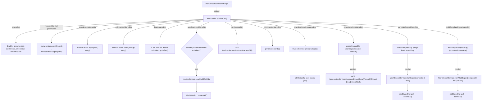

# Invoice List Page

This analysis covers the **Invoice List** page (`invoice/index.htmlm` + `invoice/index.js` + `invoice/messages.i18n.js`). The page displays invoices in a standard **SlickerGrid** (row-based data table) filtered by a month/year toolbar. It provides extensive toolbar actions for viewing, editing, deleting, sending, exporting, and downloading invoices in multiple formats (PDF, xRechnung/XML, XLS, worklog templates).

**Data source**: `InvoiceService.getAll`, filtered by date range derived from month/year selector. Returns up to 300 records per request.

---

## Behavior Diagrams

### Action Flow Diagram



### Toolbar Permission Diagram

```mermaid
flowchart TD
    Page["Invoice List Page"]
    Page --> Toolbar["Toolbar Nav Buttons"]

    Toolbar --> ShowBtn["showInvoiceMenuBtn (receipt) - disabled by default"]
    Toolbar --> EditBtn["editInvoiceMenuBtn (pencil) - disabled by default"]
    Toolbar --> DeleteBtn["deleteMenuBtn (trash) - disabled by default"]
    Toolbar --> Spacer1["--- spacer ---"]
    Toolbar --> SendBtn["sendInvoicesMenuBtn (envelope-open-text) - disabled by default"]
    Toolbar --> Spacer2["--- spacer ---"]
    Toolbar --> XmlBtn["xmlInvoiceBtn (file-code) - disabled by default"]
    Toolbar --> PrintBtn["printInvoiceMenuBtn (print) - enabled"]
    Toolbar --> DownloadBtn["downloadInvoicesMenuBtn (download) - enabled"]
    Toolbar --> ExportBtn["exportInvoicesMenuBtn (table) - enabled"]
    Toolbar --> Spacer3["--- spacer ---"]
    Toolbar --> TemplateBtn["templateExportMenuBtn (table) - enabled"]
    Toolbar --> MultiTemplateBtn["multiTemplateExportMenuBtn (table) - enabled"]

    ShowBtn -->|"enabled on row select"| ViewAction["Open InvoiceDetails in view mode"]
    EditBtn -->|"enabled on row select"| EditAction["Open InvoiceDetails in edit mode"]
    DeleteBtn -->|"enabled on row select"| DeleteAction["Delete selected invoice"]
    SendBtn -->|"enabled on row select"| SendAction["Send emails for selected invoices"]
    XmlBtn -->|"enabled on row select"| XmlAction["Download xRechnung XML"]
```



---

## HTMLM Header Metadata

| Field | Method | Value / Params | Purpose |
| :--- | :--- | :--- | :--- |
| `usePanel` | variable | `true` | Enables panel layout |
| `navBar` | template | `../_include/navbar.mustache` | Standard navigation bar |
| `siteloader` | template | `../_include/siteloader.mustache` | Loading indicator |
| `search` | variable | `true` | Enables global site search bar (`#siteSearch`) |
| `nav` | variable | `{ filter: false, buttons: [...] }` | Toolbar button definitions (12 buttons, see Toolbar Buttons below) |
| `jobStatusDlg` | template | `../_include/jobStatusDlg.html` | Async job status polling dialog |
| `invoiceDlg` | template | `../invoice/invoiceDetails.html` | Invoice detail/edit dialog |

---

## Month/Year Selector (Filter Toolbar)

The page features a prominent month/year selector toolbar that determines the invoice date range for the grid query.

| Element | Type | ID | Default Value | Behavior |
| :--- | :--- | :--- | :--- | :--- |
| Year input | `<input type="number">` | `year` | Previous month's year (Dec of prev year if current month is Jan) | Tracked in deeplink state |
| Month dropdown | `<select>` | `month` | Previous month (12 if current month is Jan) | On change: triggers `$grid.slickerGrid("reload")` |

**Date range calculation**: The grid queries invoices where date falls between the 1st of the selected month (00:00:01) and the 1st of the next month, using Luxon `DateTime.fromObject` and `.plus({ months: 1 })`. Both values are passed as millisecond timestamps.

**Default behavior**: On load, the page defaults to the **previous month** (e.g., if today is March 2026, it shows February 2026). Special case: if current month is January, it shows December of the previous year.

---

## Grid Columns

**Container**: `<div id="invoice" class="tableView siteLoader" data-limit="100">`
**Grid type**: SlickerGrid (standard row-based data table)
**Fullscreen**: `true`
**Service**: `InvoiceService.getAll` with filter params `[filter, 300]`

| # | Field | Name (i18n key) | Sortable | Resizable | Width | Formatter | Notes |
| :--- | :--- | :--- | :--- | :--- | :--- | :--- | :--- |
| 1 | `no` | `"No"` | Yes | Yes | 100 | (none, plain text) | **HARDCODED** column name "No" |
| 2 | `client` | `customer` | Yes | Yes | 380 | `Formatter.name` | Displays client name |
| 3 | `client` (id=`email`) | `invoice.shipping` | Yes | Yes | 60 | `Formatter.client` | Shows mail/post icons (see Formatters below) |
| 4 | `title` | `label.title` | Yes | Yes | 380 | (none, plain text) | Invoice title |
| 5 | `dateInvoice` | `invoice.date` | Yes | Yes | 100 | `Formatter.date` | Invoice date |
| 6 | `totalPrice` | `invoice.total` | Yes | Yes | 90 | `Formatter.currency` | Total amount with currency formatting |
| 7 | `paidAt` | `invoice.paid` | Yes | Yes | 100 | `Formatter.date` | Payment date |
| 8 | `comment` | `label.comment` | Yes | Yes | 100 | (none, plain text) | Comment field |
| 9 | `dateWorklog` | `Invoice.Worklog` | Yes | Yes | 100 | `Formatter.exists` | Shows existence indicator (has worklog or not) |
| 10 | `dateCreated` | `invoice.dateCreated` | Yes | Yes | 100 | `Formatter.dateTime` | Creation timestamp |
| 11 | `dateSubmit` | `invoice.dateSubmit` | Yes | Yes | 100 | `Formatter.dateTime` | Submission timestamp |

---

## Formatters

| Formatter | Logic | Output |
| :--- | :--- | :--- |
| `Formatter.name` | Extracts display name from object | Client full name |
| `Formatter.client` | Checks `value.mailInvoice` and `value.postInvoice` | `<i class="fa fa-at">` for email, `<i class="fa fa-envelope">` for post |
| `Formatter.date` | Formats date value | Date string |
| `Formatter.dateTime` | Formats datetime value | DateTime string |
| `Formatter.currency` | Formats number as currency | Currency string |
| `Formatter.exists` | Checks if value exists | Existence indicator |
| `Formatter.payment` | Maps payment type to i18n label | `i18n['invoice_' + value + '_name']` |
| `Formatter.receiptType` | Maps receipt type to i18n label | `i18n['receipt_' + value + '_name']` |

---

## Toolbar Buttons

| # | Button ID | Icon | Label (i18n key) | Initial State | Action |
| :--- | :--- | :--- | :--- | :--- | :--- |
| 1 | `showInvoiceMenuBtn` | `fa-receipt` | `action.view` | **Disabled** | Opens `InvoiceDetails.open(view, entry)` |
| 2 | `editInvoiceMenuBtn` | `fa-pencil` | `action.change` | **Disabled** | Opens `InvoiceDetails.open(change, entry)` |
| 3 | `deleteMenuBtn` | `fa-trash` | `action.delete` | **Disabled** | Deletes selected invoice via `Core.initCrud` |
| — | (spacer) | — | — | — | Visual separator |
| 4 | `sendInvoicesMenuBtn` | `fa-envelope-open-text` | `action.send` | **Disabled** | Sends emails for all selected invoices (multi-select) |
| — | (spacer) | — | — | — | Visual separator |
| 5 | `xmlInvoiceBtn` | `fa-file-code` | `Invoice.xRechnung` | **Disabled** | Downloads xRechnung XML for selected invoice |
| 6 | `printInvoiceMenuBtn` | `fa-print` | `action.print` | Enabled | Prints/downloads PDF for selected invoice |
| 7 | `downloadInvoicesMenuBtn` | `fa-download` | `"Download"` | Enabled | Prepares ZIP of all selected invoices (async job) |
| 8 | `exportInvoicesMenuBtn` | `fa-table` | `"Export"` | Enabled | Opens export dialog (month/quarter/year XLS) |
| — | (spacer) | — | — | — | Visual separator |
| 9 | `templateExportMenuBtn` | `fa-table` | `Invoice.Worklog.Download` | Enabled | Opens worklog template export dialog (single invoice) |
| 10 | `multiTemplateExportMenuBtn` | `fa-table` | `"Multi-Export"` | Enabled | Opens multi-invoice worklog template export dialog |

### Button Enable/Disable Logic

On row selection (`rowSelected` event), the following buttons are enabled:
- `showInvoiceMenuBtn`
- `editInvoiceMenuBtn`
- `addWorkLogMenuBtn` (referenced but not in nav buttons)
- `xmlInvoiceBtn`
- `addExtendedWorkLogMenuBtn` (referenced but not in nav buttons)
- `sendInvoicesMenuBtn`

---

## Click Actions

| Action ID | Symbol | Title (i18n) | English | Notes |
| :--- | :--- | :--- | :--- | :--- |
| `showInvoiceMenuBtn` | `fa-receipt` | `action.view` | View | Opens detail dialog in view mode |
| `editInvoiceMenuBtn` | `fa-pencil` | `action.change` | Edit | Opens detail dialog in edit mode |
| `deleteMenuBtn` | `fa-trash` | `action.delete` | Delete | Deletes via CRUD handler |
| `sendInvoicesMenuBtn` | `fa-envelope-open-text` | `action.send` | Send | Sends multi-mail; **HARDCODED** German confirm dialog |
| `xmlInvoiceBtn` | `fa-file-code` | `Invoice.xRechnung` | xInvoice | Direct download via URL redirect |
| `printInvoiceMenuBtn` | `fa-print` | `action.print` | Print | Calls `printInvoice(entry)` |
| `downloadInvoicesMenuBtn` | `fa-download` | `"Download"` | Download | **HARDCODED** label; async ZIP via jobStatusDlg |
| `exportInvoicesMenuBtn` | `fa-table` | `"Export"` | Export | **HARDCODED** label; opens exportInvoiceDlg |
| `templateExportMenuBtn` | `fa-table` | `Invoice.Worklog.Download` | Worklog Download | Opens exportTemplateDlg for single invoice |
| `multiTemplateExportMenuBtn` | `fa-table` | `"Multi-Export"` | Multi-Export | **HARDCODED** label; opens multiExportTemplateDlg |

---

## Dialogs

### Export Invoice Dialog (`#exportInvoiceDlg`)

**Purpose**: Select a time period and download an XLS export of invoices.

| Element | Type | Name | Options | Notes |
| :--- | :--- | :--- | :--- | :--- |
| Month/Period select | `<select>` | `data.month` | Jan-Dec (1-12), Q1-Q4 (21-24), Q1/Q2 (31), Q3/Q4 (32), Year (41) | Extended period options beyond basic months |
| Year input | `<input type="number">` | `data.year` | Pre-filled with current grid year | |

**On confirm**: Opens `GET /get/InvoiceService/downloadExport/{year}/{month}/Export-{year}-{month}.xls`

**Period value mapping**:

| Value | Period |
| :--- | :--- |
| 1-12 | Individual months (Jan-Dec) |
| 21 | Q1 (Quarter 1) |
| 22 | Q2 (Quarter 2) |
| 23 | Q3 (Quarter 3) |
| 24 | Q4 (Quarter 4) |
| 31 | H1 (Q1 + Q2) |
| 32 | H2 (Q3 + Q4) |
| 41 | Full year |

### Template Export Dialog (`#exportTemplateDlg`)

**Purpose**: Generate a worklog export for a single invoice using a custom export template.

| Element | Type | Name | Options | Notes |
| :--- | :--- | :--- | :--- | :--- |
| Invoice number | Display field | `data.invoice.no` | (read-only) | Shows selected invoice number |
| Appointment type | `<select>` | `data.type` | `""` (---), APPOINTMENT, SHIFT, COUNCIL | Filters by appointment type |
| Export template | Autocomplete input | `data.exportTemplate` | `ExportTemplateService.autocomplete`, filter `["WORKLOG"]` | Mandatory field |
| Attach to invoice | `<input type="checkbox">` | `data.attachToInvoice` | Boolean | Whether to attach export to invoice |

**On confirm**: Calls `WorkExportService.startExport(templateId, data)` then opens `jobStatusDlg` to poll status and provide download link at `/get/WorkExportService/downloadExport/{exportId}/`.

### Multi-Template Export Dialog (`#multiExportTemplateDlg`)

**Purpose**: Generate worklog exports for multiple selected invoices using a custom export template.

| Element | Type | Name | Options | Notes |
| :--- | :--- | :--- | :--- | :--- |
| Invoice numbers | Collection display | `data.invoices` | (read-only list) | Shows all selected invoice numbers |
| Appointment type | `<select>` | `data.type` | `""` (All), APPOINTMENT, SHIFT, TREATMENT, TREATMENT_REPORT, COUNCIL | More type options than single export |
| Export template | Autocomplete input | `data.exportTemplate` | `ExportTemplateService.autocomplete`, filter `["WORKLOG"]` | Mandatory field |

**On confirm**: Calls `WorkExportService.startMultiExport(templateId, data, invIds)` then opens `jobStatusDlg` for async polling.

### Job Status Dialog (`#jobStatusDlg`)

**Purpose**: Polls an async backend job for completion status and provides a download link when ready.

**Configuration** (passed via `Dialog.open`):

| Field | Value (ZIP download) | Value (template export) |
| :--- | :--- | :--- |
| `service` | (not set, uses default) | `"WorkExportService"` |
| `statusMethod` | (not set, uses default) | `"getStatus"` |
| `title` | (not set) | `"Custom Export"` (**HARDCODED**) |
| `id` | Job ID from `prepareZip` | Export ID from `startExport` / `startMultiExport` |
| `download` | (not set, uses default) | `/get/WorkExportService/downloadExport/{id}/` |

---

## Site Search (Client-Side Filter)

The grid supports client-side text filtering via the `#siteSearch` input:

| Match field | Logic |
| :--- | :--- |
| `item.no` | Case-insensitive substring match on invoice number |
| `item.client.name` | Case-insensitive substring match on client name |

**Escape key**: Clears search and resets filter.

---

## CRUD Configuration

```
Core.initCrud($this, {
    grid: $grid,
    detail: $detail,
    serviceName: "InvoiceService",
    getMethod: "get",
    onSave: function(data) { return data; },
    deeplink: {
        view: false,
        fields: ["year", "month"]
    }
});
```

| Config | Value | Purpose |
| :--- | :--- | :--- |
| `serviceName` | `"InvoiceService"` | Backend service for CRUD |
| `getMethod` | `"get"` | Method to fetch single invoice |
| `deeplink.view` | `false` | No direct URL linking to specific invoice |
| `deeplink.fields` | `["year", "month"]` | Year and month are tracked in URL for deep linking |

---

## Server Calls

| Action | Service | Method / URL | Parameters | Response Handling |
| :--- | :--- | :--- | :--- | :--- |
| Load invoice list | `InvoiceService` | `getAll` | `[filter, 300]` where `filter.date = [startMillis, endMillis]` | Populates grid rows |
| Get single invoice | `InvoiceService` | `get` | Invoice ID | Fills detail dialog |
| Send multi-mail | `InvoiceService` | `sendMultiMail` | `[ids]` (array of invoice IDs) | Alert with count sent |
| Download xRechnung | `InvoiceService` | `GET /get/InvoiceService/downloadXml/{id}` | Invoice ID in URL | Browser navigates to download |
| Print invoice | (via `printInvoice()`) | (external function) | Entry object | Opens print view |
| Prepare ZIP download | `InvoiceService` | `prepareZip` | `[ids]` (array of invoice IDs) | Returns job ID, opens jobStatusDlg |
| Export XLS | `InvoiceService` | `GET /get/InvoiceService/downloadExport/{year}/{month}/{filename}.xls` | Year, month, filename in URL | Browser opens download |
| Template export | `WorkExportService` | `startExport` | `[templateId, data]` | Returns export ID, opens jobStatusDlg |
| Multi-template export | `WorkExportService` | `startMultiExport` | `[templateId, data, invIds]` | Returns export ID, opens jobStatusDlg |
| Check job status | `WorkExportService` | `getStatus` | `[exportId]` | Polled by jobStatusDlg |
| Download export result | `WorkExportService` | `GET /get/WorkExportService/downloadExport/{id}/` | Export ID in URL | Browser opens download |
| Save grid settings | `UserService` | `saveSetting` | `[settingName, JSON.stringify(settings)]` | Persists column widths/order |

---

## Translation Table

| Text Reference | German (source) | English | Notes |
| :--- | :--- | :--- | :--- |
| `customer` | Kunde | Customer | Grid column: client name |
| `invoice.no` | Rechnungsnr. | Invoice No. | Invoice number field |
| `invoice.date` | Rechnungsdatum | Invoice Date | Grid column: dateInvoice |
| `invoice.client` | Kunde | Client | Invoice client field |
| `invoice.type` | Typ | Type | Invoice type field |
| `invoice.dateCreated` | Erstellt | Date Created | Grid column: creation date |
| `invoice.dateInvoice` | Rechnungsdatum | Invoice Date | Detail field |
| `invoice.datePaidUntil` | Zahlbar bis | Paid Until | Payment deadline |
| `invoice.dateSubmit` | Gesendet | Date Submitted | Grid column: submission date |
| `invoice.paid` | Bezahlt | Paid | Grid column: paid date |
| `invoice.paidat` | Bezahlt am | Paid At | Detail field |
| `invoice.unpaid` | Unbezahlt | Unpaid | Payment status |
| `invoice.shipping` | Versand | Shipping | Grid column: shipping method icons |
| `invoice.total` | Gesamt | Total | Grid column: total price |
| `invoice.totalNetPrice` | Netto | Net Price | Detail field |
| `invoice.totalTaxes` | MwSt. | Total Taxes | Detail field |
| `invoice.totalPrice` | Brutto | Total Price | Detail field |
| `invoice.tax` | Steuer | Tax | Tax field |
| `invoice.positions.amount` | Menge | Amount | Line item quantity |
| `invoice.positions.service` | Leistung | Service | Line item service |
| `invoice.positions.serviceDate` | Datum | Service Date | Line item date |
| `invoice.positions.price` | Preis | Price | Line item price |
| `invoice.paymentType` | Zahlungsart | Payment Type | Payment method |
| `invoice.storno` | Storno | Storno/Reversal | Reversal action |
| `invoice.isStorno` | Ist Storno | Is Reversal | Status indicator |
| `invoice.hasStorno` | Hat Storno | Has Reversal | Status indicator |
| `invoice.confirmStorno` | Storno bestätigen | Confirm Reversal | Confirmation dialog |
| `invoice.saveNull` | Null speichern | Save Zero | Zero-amount save |
| `invoice.directInput` | Direkteingabe | Direct Input | Manual entry mode |
| `Invoice.Worklog` | Arbeitsnachweis | Worklog | Grid column: worklog existence |
| `Invoice.Worklog.Download` | Arbeitsnachweis Download | Worklog Download | Toolbar button |
| `Invoice.xRechnung` | xRechnung | xInvoice | Toolbar button: XML invoice |
| `email.send` | E-Mail senden | Send Email | Email action |
| `action.view` | Anzeigen | View | Toolbar button |
| `action.change` | Bearbeiten | Edit | Toolbar button |
| `action.delete` | Löschen | Delete | Toolbar button |
| `action.send` | Senden | Send | Toolbar button |
| `action.print` | Drucken | Print | Toolbar button |
| `label.title` | Titel | Title | Grid column |
| `label.comment` | Kommentar | Comment | Grid column |
| `year` | Jahr | Year | Export dialog label |
| `Month.JAN` | Januar | January | Month selector |
| `Month.FEB` | Februar | February | Month selector |
| `Month.MAR` | März | March | Month selector |
| `Month.APR` | April | April | Month selector |
| `Month.MAY` | Mai | May | Month selector |
| `Month.JUN` | Juni | June | Month selector |
| `Month.JUL` | Juli | July | Month selector |
| `Month.AUG` | August | August | Month selector |
| `Month.SEP` | September | September | Month selector |
| `Month.OCT` | Oktober | October | Month selector |
| `Month.NOV` | November | November | Month selector |
| `Month.DEC` | Dezember | December | Month selector |
| `InvoicePositionType.APPOINTMENT` | Termin | Appointment | Position type |
| `InvoicePositionType.OTHER` | Sonstiges | Other | Position type |
| `InvoicePositionType.PRODUCT` | Produkt | Product | Position type |
| `InvoiceTimeframe.MANUAL` | Manuell | Manual | Timeframe type |
| `InvoiceTimeframe.MONTHLY` | Monatlich | Monthly | Timeframe type |
| `InvoiceTimeframe.QUARTERLY` | Vierteljährlich | Quarterly | Timeframe type |
| `AppointmentType.APPOINTMENT` | Sprechstunde | Appointment | Template export filter |
| `AppointmentType.SHIFT` | Bereitschaft | Shift | Template export filter |
| `AppointmentType.COUNCIL` | Konsil | Council | Template export filter |
| `AppointmentType.TREATMENT` | Therapie | Treatment | Multi-template export filter |
| `AppointmentType.TREATMENT_REPORT` | Therapiebericht | Treatment Report | Multi-template export filter |
| `AppointmentType.ALL` | Alle | All | Multi-template "all types" option |
| `exportTemplate.template` | Vorlage | Template | Autocomplete placeholder |
| `templateExportDlg.title` | Export | Export | Dialog title |
| `export.attachInvoice` | An Rechnung anhängen | Attach to Invoice | Checkbox label |

### Payment Types (i18n)

| Key | German | English |
| :--- | :--- | :--- |
| `invoice.CASH.name` | Bar | Cash |
| `invoice.CREDIT_CARD.name` | Kreditkarte | Credit Card |
| `invoice.ATM_CARD.name` | EC-Karte | ATM/Debit Card |
| `invoice.INVOICE.name` | Rechnung | Invoice |
| `invoice.STORNO.name` | Storno | Reversal |
| `invoice.INVOICE_STORNO.name` | Rechnungsstorno | Invoice Reversal |

### Receipt Types (i18n)

| Key | German | English |
| :--- | :--- | :--- |
| `receipt.START_INVOICE` | Startrechnung | Start Invoice |
| `receipt.YEAR_INVOICE` | Jahresrechnung | Year Invoice |
| `receipt.MONTH_INVOICE` | Monatsrechnung | Month Invoice |
| `receipt.DAY_INVOICE` | Tagesrechnung | Day Invoice |
| `receipt.COLLECTIVE_INVOICE` | Sammelrechnung | Collective Invoice |
| `receipt.INVOICE` | Rechnung | Invoice |

### Tax Rate Keys (i18n)

| Key | German | English |
| :--- | :--- | :--- |
| `tax.SATZ_BESONDERS` | Besonderer Steuersatz | Special Tax Rate |
| `tax.SATZ_ERMAESSIGT_1` | Ermäßigt 1 | Reduced Rate 1 |
| `tax.SATZ_ERMAESSIGT_2` | Ermäßigt 2 | Reduced Rate 2 |
| `tax.SATZ_NORMAL` | Normaler Steuersatz | Standard Tax Rate |
| `tax.SATZ_NULL` | Null Steuersatz | Zero Tax Rate |

---

## HARDCODED Strings (Not Using i18n)

| String | Location | Language | Replacement Needed |
| :--- | :--- | :--- | :--- |
| `"No"` | Grid column name for `no` field | English | Should use `invoice.no` |
| `"Download"` | Nav button label for `downloadInvoicesMenuBtn` | English | Needs i18n key |
| `"Export"` | Nav button label for `exportInvoicesMenuBtn` | English | Needs i18n key |
| `"Multi-Export"` | Nav button label for `multiTemplateExportMenuBtn` | English | Needs i18n key |
| `"Q1"`, `"Q2"`, `"Q3"`, `"Q4"` | Export dialog period options | English | Needs i18n keys |
| `"Q1/Q2"`, `"Q3/Q4"` | Export dialog half-year options | English | Needs i18n keys |
| `"Wirklich N Mails schicken?"` | Send confirmation prompt (index.js:175) | **German** | Must use i18n confirmation |
| `" versendet!"` | Send success alert (index.js:180) | **German** | Must use i18n alert |
| `"Rechnung "` | Template export dialog label (index.htmlm:115) | **German** | Must use `invoice` i18n key |
| `"Custom Export"` | jobStatusDlg title (index.js:133, 155) | English | Needs i18n key |
| `"Export-"` | XLS filename prefix (index.js:111) | English | Needs i18n key or keep as technical |
| `"---"` | Empty option in type selects | Neutral | Acceptable |

---

## Included Templates

| Template | Mustache Partial | Purpose |
| :--- | :--- | :--- |
| `navbar.mustache` | `{{> navBar}}` | Top navigation bar with toolbar buttons |
| `siteloader.mustache` | `{{> siteloader}}` | Loading spinner overlay |
| `jobStatusDlg.html` | `{{> jobStatusDlg}}` | Async job status polling dialog (shared component) |
| `invoiceDetails.html` | `{{> invoiceDlg}}` | Invoice detail/edit dialog (rendered inside `#invoice` div) |

---

## Key Patterns for Rebuild

1. **Month/Year URL state**: The `deeplink.fields: ["year", "month"]` pattern should map to TanStack Router search params for the invoice list route.
2. **Multi-select operations**: Send, Download ZIP, and Multi-Template Export all operate on `$this.data().entries` (multiple selected rows). The rebuild needs multi-row selection support in the data table.
3. **Async job polling**: ZIP download and template exports use `jobStatusDlg` for async job status polling. This should be rebuilt as a React dialog with polling via React Query (`useQuery` with `refetchInterval`).
4. **Export dialog with extended periods**: The export dialog supports months, quarters, half-years, and full year via numeric encoding (1-12, 21-24, 31-32, 41). This needs a clean period selector component.
5. **Template autocomplete**: The export template input uses `ExportTemplateService.autocomplete` with a `["WORKLOG"]` filter. This should become a React combobox/autocomplete component.
6. **Client-side filtering**: The grid supports client-side text search on `no` and `client.name`. With server-side pagination in the rebuild, this should move to server-side filtering.
7. **Shipping icons**: The `Formatter.client` column shows `mailInvoice` and `postInvoice` boolean flags as icons. This is a compact visual indicator pattern.

---

## Wireframe Reference (ASCII)

> Full wireframe: [`specs/wireframes/accounting/workflows.md#w1-invoice-list`](../../../wireframes/accounting/workflows.md#w1-invoice-list)

```
┌─────────────────────────────────────────────────────────────────────────────┐
│ ▌Invoices                                    Month: [March ▾] Year: [2025] │
├─────────────────────────────────────────────────────────────────────────────┤
│ [View][Edit][Delete] | [Send][XML][Print][ODT] | [ZIP][Export][Tmpl][Multi]│
├────┬────────┬──────────┬──────┬────────┬────────┬────────┬────┬────────────┤
│ ID │ Number │ Client   │ Type │ Date   │ Amount │ Status │ ✉  │ Actions   │
├────┼────────┼──────────┼──────┼────────┼────────┼────────┼────┼────────────┤
│571 │INV-42  │JVA Berlin│Shift │15.11.25│€4,186  │Paid    │ @  │   ...      │
│592 │INV-43  │JVA Hambg │Appt  │20.11.25│€1,405  │Storno  │ ✉  │   ...      │
├────┴────────┴──────────┴──────┴────────┴────────┴────────┴────┴────────────┤
│ Showing 1-2 of 14 invoices                              [< 1  2  3  4  >] │
└─────────────────────────────────────────────────────────────────────────────┘
  Dialogs: Export Invoice (period), Template Export, Multi-Template, Job Status
  [async: poll job status] for ZIP/template exports
```
