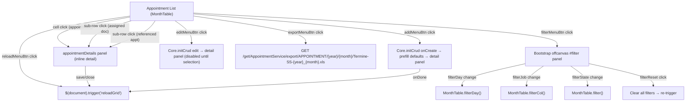
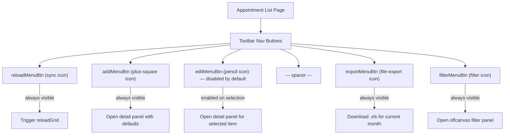

# Appointment List Page

This analysis covers the **Appointment List** page (`appointment/index.htmlm` + `appointment/index.js`). The page displays appointments in a **MonthTable** (calendar-style monthly grid), not a standard DataTables row-based table. Each column represents a "job" (service/shift), each row represents a day of the month, and cells contain appointment entries with state-colored icons and assigned staff sub-rows.

**Data source**: `AppointmentService` via `MonthTable.init()`, filtered to type `"APPOINTMENT"`. The MonthTable fetches data by `[type, month, year]` parameters.

---

## Behavior Diagrams

### Dialog Navigation Diagram



### Toolbar Permission Diagram



---

## HTMLM Header Metadata

| Field | Method | Value / Params | Purpose |
| :--- | :--- | :--- | :--- |
| `usePanel` | variable | `true` | Enables panel layout |
| `navBar` | template | `../_include/navbar.mustache` | Standard navigation bar |
| `siteloader` | template | `../_include/siteloader.mustache` | Loading indicator |
| `search` | variable | `true` | Enables global site search bar (`#siteSearch`) |
| `nav` | variable | `{ filter: false, buttons: [...] }` | Toolbar button definitions (see Toolbar Buttons below) |
| `jobType` | variable | `"APPOINTMENT"` | Filters to appointment type |
| `appointmentDetails` | template | `../appointment/details.html` | Inline detail/edit panel |
| `assignUserDlg` | template | `../appointment/assignUser.html` | Assign user dialog |
| `docFinder` | template | `../profile/docFinder.html` | Doctor finder lookup dialog |
| `appointmentStates` | enum | `AppointmentState` enum, style `OPTION`, i18n `onboarding.states` | Rendered as `<option>` elements (triple-mustache, unescaped HTML) |

---

## Block: Appointment List (MonthTable)

**Container**: `<div id="appointment" class="tableView" data-limit="100">`
**Grid type**: MonthTable (calendar grid) — NOT a standard DataTables row-based table
**Table element**: `<table id="gridTable" class="siteLoader table table-bordered">`
**Empty thead**: `<thead><tr></tr></thead>` — columns are dynamically generated by MonthTable.js

### Visualization

The MonthTable renders as a calendar grid where:
- **Rows** = days of the month (1..28/29/30/31)
- **Columns** = jobs/services returned by `AppointmentService` for the selected month
- **Cells** = appointment entries, each rendered as a colored `<span>` with state icon + name

### Cell Rendering

Each appointment cell contains:

| Element | Content | CSS class | Condition |
| :--- | :--- | :--- | :--- |
| Main span | State icon + name | `ap-{state.toLowerCase()}` (color class from `appointmentState()`) | Always |
| Extra icon | `fa-heartbeat` | (inline) | `data.details.referenced` exists |
| Sub-row: assigned staff | `{index}. {stateIcon} {displayName}` | `sub {assignedState.color}` | `data.details.assigned` array has entries |
| Sub-row: missing staff | `{index}. fa-octagon ---` | `sub state-missing` | Assigned entry is `null` |
| Sub-row: referenced appts | `{stateIcon} {timeStart}-{timeEnd} {location.name}` | `sub {refState.color}` | `data.details.referenced` array has entries |

### MonthTable Initialization

```
MonthTable.init(serviceName, paramFn, prefillFn, transformFn, renderFn)
```

| Parameter | Value | Purpose |
| :--- | :--- | :--- |
| `serviceName` | `"AppointmentService"` | Backend service to call |
| `paramFn` | `(param) => ["APPOINTMENT", param[0], param[1]]` | Builds request params: `[type, month, year]` |
| `prefillFn` | Creates prefill object from cell click | Returns `{ date, state:"READY", location, customer, job, timeStart, timeEnd }` |
| `transformFn` | Adds `info` and `colorClass` to each data item | Calls `i18n.appointmentState(data.state)` |
| `renderFn` | Builds DOM `<span>` elements for each cell | Renders main entry + assigned staff + referenced appointments |

### New Appointment Defaults (onCreate)

When creating a new appointment via the add button:

| Field | Default value | Source |
| :--- | :--- | :--- |
| `type` | `"APPOINTMENT"` | Hardcoded fallback |
| `date` | Current MonthTable month/year via Luxon | `$("#gridTable").data().cur.month/year` |
| `state` | `"READY"` | Hardcoded |
| `requiredStaffCount` | `1` | Hardcoded |
| `minPatients` | `1` | Hardcoded |
| `paymentType` | `"FULL"` | Hardcoded |

### Detail Panel Visibility on Create

| Panel section | Visibility |
| :--- | :--- |
| `#navDetailsEdit` | shown |
| `#navAssigned` | shown |
| `#employeeActions` | shown |
| `#navSuggestion` | hidden |
| `#navQm` | hidden |

---

## Grid Columns

The MonthTable does **not** use traditional DataTables column definitions. Instead, columns are dynamically generated from the service response data. The grid structure is:

| Axis | Content | Source |
| :--- | :--- | :--- |
| Row headers | Day of month (1-31) | Generated by MonthTable from current month |
| Column headers | Job/service names | Returned by `AppointmentService` for current month |
| Cells | Appointment entries with state + assigned staff | Rendered by `renderFn` callback |

### Month/Year Navigation

The MonthTable provides built-in month/year navigation controls. The current month and year are stored in `$("#gridTable").data().cur.month` and `.year`.

---

## Toolbar Buttons

| Button ID | Icon | Label (i18n key) | Initial state | Action |
| :--- | :--- | :--- | :--- | :--- |
| `reloadMenuBtn` | `fa-sync` | `action.reload` | Enabled | Triggers `$(document).trigger("reloadGrid")` — also auto-triggered on page load |
| `addMenuBtn` | `fa-plus-square` | `action.add` | Enabled | Opens detail panel with defaults via `Core.initCrud` onCreate |
| `editMenuBtn` | `fa-pencil` | `action.change` | **Disabled** | Opens detail panel for selected appointment (enabled on selection) |
| (spacer) | — | — | — | Visual separator |
| `exportMenuBtn` | `fa-file-export` | `action.export` | Enabled | Downloads Excel export for current month |
| `filterMenuBtn` | `fa-filter` | `Filter` | Enabled | Opens offcanvas filter panel |

---

## Filter Panel

**Container**: `<div id="filter" class="offcanvas offcanvas-end">` (Bootstrap 5 offcanvas, right-side slide-in)
**Options**: `data-bs-scroll="true"` (body scroll allowed), `data-bs-backdrop="false"` (no backdrop overlay)

### Form Elements

| # | Element ID | Type | Icon | Placeholder / Label | i18n key | Filter mechanism | Notes |
| :--- | :--- | :--- | :--- | :--- | :--- | :--- | :--- |
| 1 | `filterDay` | `<input type="number">` | `fa-calendar-day` | `"Tag"` | `action.date` (title only) | `MonthTable.filterDay()` — filters rows by day number | **HARDCODED** placeholder "Tag" (German for "Day") |
| 2 | `filterJob` | `<input type="text">` | `fa-briefcase-medical` | `{{i18n.jobId}}` | `jobId` | `MonthTable.filterCol()` — filters columns by job name substring match | |
| 3 | `filterState` | `<select>` | `fa-traffic-light` | `"- {{i18n.AppointmentState}} -"` (empty option) | `AppointmentState` | Triggers `#siteSearch` filter event → `MonthTable.filter()` | Options rendered from `{{{appointmentStates}}}` (triple-mustache, unescaped enum HTML) |
| 4 | `filterReset` | `<button>` | — | `{{i18n.button.reset}}` | `button.reset` | Clears all filter inputs and re-triggers all filter events | |

### Filter Logic Details

| Filter | Scope | Match logic |
| :--- | :--- | :--- |
| Site search (`#siteSearch`) + State (`#filterState`) | Cell-level (`MonthTable.filter`) | Matches against: assigned user `displayName`, referenced location `name`, or appointment `name` (case-insensitive substring). If state filter is set, must also match `data.state` exactly. |
| Day (`#filterDay`) | Row-level (`MonthTable.filterDay`) | Exact match on `row.day` number. Empty/NaN = show all. |
| Job (`#filterJob`) | Column-level (`MonthTable.filterCol`) | Substring match on `col.data.name` (case-insensitive). Empty = show all. |

---

## Click Actions

| Trigger | Target | Action | Details |
| :--- | :--- | :--- | :--- |
| Cell click in MonthTable | Appointment entry | Opens detail panel via `Core.initCrud` | Prefill data: `{ date, state:"READY", location, customer, job, timeStart, timeEnd }` |
| Assigned staff sub-row click | Staff `<span class="sub">` | Opens detail panel | `span.data().pojo` contains the assigned staff object |
| Referenced appointment sub-row click | Reference `<span class="sub">` | Opens detail panel | `span.data().pojo` contains the referenced appointment object |
| Reload button click | `#reloadMenuBtn` | Refreshes grid | `$(document).trigger("reloadGrid")` |
| Add button click | `#addMenuBtn` | Creates new appointment | Uses prefill data from button `.data().prefill` or defaults |
| Edit button click | `#editMenuBtn` | Edits selected appointment | Disabled until an appointment is selected |
| Export button click | `#exportMenuBtn` | Downloads Excel file | `GET /get/AppointmentService/export/APPOINTMENT/{year}/{month}/Termine-SS-{year}_{month}.xls` |
| Filter button click | `#filterMenuBtn` | Opens filter offcanvas | `$("#filter").data().bsfilter.show()` |

---

## Server Calls

| Action | Service | Method / URL | Parameters | Response handling |
| :--- | :--- | :--- | :--- | :--- |
| Load month data | `AppointmentService` | Via `MonthTable.init()` | `["APPOINTMENT", month, year]` | Populates calendar grid cells |
| Get appointment detail | `AppointmentService` | Via `Core.initCrud` (`getMethod: AppointmentDetails.getMethod`) | Appointment ID | Fills detail panel |
| Create appointment | `AppointmentService` | Via `Core.initCrud` | Prefilled appointment object (see defaults above) | `onDone` triggers `reloadGrid` |
| Export month | `AppointmentService` | `GET /get/AppointmentService/export/APPOINTMENT/{year}/{month}/Termine-SS-{year}_{month}.xls` | Year, month in URL path | Browser downloads `.xls` file |

### CRUD Configuration

```
Core.initCrud($this, {
    grid: $grid,
    detail: $detail,
    serviceName: "AppointmentService",
    getMethod: AppointmentDetails.getMethod,
    deeplink: { view: false }
})
```

Note: `deeplink.view` is `false` — appointment list does not support direct URL linking to a specific appointment.

---

## Location / Room Selection Logic

The page includes location-room cascading selection (likely used within the detail panel):

| Element | Behavior |
| :--- | :--- |
| `#selectedLocation` | On change: unlocks `#selectedRoom`, clears room selection |
| `#selectedRoom` | Locked (`readonly`) when no location is selected. On change: auto-fills location from room's parent location if location is empty. Uses `Core.autoselect()` with filter function returning selected location ID. |

---

## Appointment State Visualization

### State Icons and Colors

| State | Icon | CSS color class | EN label | DE label |
| :--- | :--- | :--- | :--- | :--- |
| `READY` | `fa-folder-open` | `ap-ready` | Ready | Angelegt |
| `STARTED` | `fa-user-plus` | `ap-started` | (Started) | (Gestarted) |
| `REQUESTED` | `fa-user-tag` | `ap-requested` | Requested | Angefragt |
| `LOCKEDIN` | `fa-check` | `ap-lockedin` | Locked in | Bestätigt |
| `ACTIVE` | `fa-traffic-light-go` | `ap-active` | Started | Gestarted |
| `DONE` | `fa-traffic-light-stop` | `ap-done` | Done | Durchgeführt |
| `CLOSED` | `fa-door-closed` | `ap-closed` | Closed | Überprüft |
| `STORNO` | `fa-ban` | `ap-storno` | Storno | Kunde Abgesagt |
| `CANCELED` | `fa-slash` | `ap-canceled` | Canceled | Ausgefallen (Arzt) |
| `ARCHIVED` | `fa-pallet-alt` | `ap-archived` | (Archived) | (Archiviert) |
| `RESCHEDULED` | (none defined) | `ap-rescheduled` | Rescheduled | Verschoben |
| `REOPENED` | (none defined) | `ap-reopened` | Reopen | Wieder Geöffnet |
| `null` / missing | `fa-question` | (empty) | — | — |

### Assigned Staff State Icons and Colors

| State | Icon | CSS color class | Notes |
| :--- | :--- | :--- | :--- |
| `null` / missing | `fa-octagon` | `state-missing` | Placeholder for unfilled slot |
| `ADDED` / `PLANADDED` | `fa-search-plus` | `state-added` | Staff added to appointment |
| `AGREED` | `fa-user` | `state-agree` | Staff agreed |
| `AGREED_RESERVATION` | `fa-chair` | `state-agree` | Staff agreed with reservation |
| `CANCELED` | `fa-user-slash` | `state-canceled` | Staff canceled |
| `SELFADDED` | `fa-user-plus` | `selfAssigned` | Self-assigned staff |
| `ACCEPTED` | `fa-check` | `state-accepted` | Staff accepted |
| `RESERVED` | `fa-badge-check` | `state-reserved` | Staff reserved |
| `REJECTED` | `fa-hand-paper` | `state-rejected` | Staff rejected |
| `DOUBLE_BOOKED` | `fa-ban` | `state-double-booked` | Double booking conflict |
| `DISAGREED` | `fa-ban` | `state-disagreed` | Expert disagreed |
| `ABORTED` | `fa-ban` | `state-aborted` | Assignment aborted |

---

## Translation Table

| Key | EN | DE | Notes |
| :--- | :--- | :--- | :--- |
| `appointment` | Appointment | Sprechstunde | Page title |
| `AppointmentState` | State | (Zustand) | Filter dropdown label |
| `AppointmentState.READY` | Ready | Angelegt | |
| `AppointmentState.REOPENED` | Reopen | Wieder Geöffnet | |
| `AppointmentState.STARTED` | (Started) | (Gestarted) | Referenced in i18n but not in enum translations |
| `AppointmentState.REQUESTED` | Requested | Angefragt | |
| `AppointmentState.LOCKEDIN` | Locked in | Bestätigt | |
| `AppointmentState.ACTIVE` | Started | Gestarted | |
| `AppointmentState.DONE` | Done | Durchgeführt | |
| `AppointmentState.CLOSED` | Closed | Überprüft | |
| `AppointmentState.STORNO` | Storno | Kunde Abgesagt | |
| `AppointmentState.RESCHEDULED` | Rescheduled | Verschoben | |
| `AppointmentState.CANCELED` | Canceled | Ausgefallen (Arzt) | |
| `AppointmentState.ARCHIVED` | (Archived) | (Archiviert) | In i18n.js but not in pre-extracted enum |
| `AppointmentState.CONFIRMED` | (Confirmed) | Bestätigt | In DE enum only |
| `AppointmentState.DECLINED` | declined | Abgelehnt | |
| `AppointmentType.APPOINTMENT` | Appointment | Sprechstunde | |
| `AppointmentType.COUNCIL` | Council | Konsil | |
| `AppointmentType.SHIFT` | Shift | Bereitschaft | |
| `AppointmentType.TREATMENT` | therapy | (not provided) | |
| `ActionState.ACCEPTED` | (Accepted) | (Akzeptiert) | Assigned staff state |
| `ActionState.ADDED` | (Added) | (Hinzugefügt) | Assigned staff state |
| `ActionState.AGREED` | (Agreed) | (Zugestimmt) | Assigned staff state |
| `ActionState.AGREED_RESERVATION` | (Agreed Reservation) | (Zugestimmt Reservierung) | Assigned staff state |
| `ActionState.DISAGREED` | (Disagreed) | (Abgelehnt) | Assigned staff state |
| `ActionState.DOUBLE_BOOKED` | (Double Booked) | (Doppelt Gebucht) | Assigned staff state |
| `ActionState.REJECTED` | (Rejected) | (Abgelehnt) | Assigned staff state |
| `ActionState.RESERVED` | (Reserved) | (Reserviert) | Assigned staff state |
| `ActionState.SELFADDED` | (Self Added) | (Selbst Hinzugefügt) | Assigned staff state |
| `ActionState.PLANADDED` | (Plan Added) | (Plan Hinzugefügt) | Assigned staff state |
| `ActionState.ABORTED` | (Aborted) | (Abgebrochen) | Assigned staff state |
| `ActionState.CANCELED` | (Canceled) | (Storniert) | Assigned staff state |
| `ActionState.DISAGREEDBYEXPERT` | (Disagreed by Expert) | (Vom Experten Abgelehnt) | Tooltip for DISAGREED state |
| `action.reload` | Reload | (Neu laden) | Toolbar button |
| `action.add` | Add | (Hinzufügen) | Toolbar button |
| `action.change` | Edit | (Bearbeiten) | Toolbar button |
| `action.export` | Export | (Exportieren) | Toolbar button |
| `action.date` | Date | (Datum) | Filter day input title |
| `jobId` | Job ID | (Job ID) | Filter job input placeholder |
| `button.reset` | Reset | (Zurücksetzen) | Filter reset button |
| `appointment.duplicate.EXISTS` | (Duplicate exists) | (Duplikat vorhanden) | Duplicate warning |
| `appointment.proceed.ANYWAY` | (Proceed anyway) | (Trotzdem fortfahren) | Duplicate confirmation |
| `appointment.minutes` | (Minutes) | (Minuten) | Time unit |
| `appointment.start` | (Start) | (Start) | Time label |
| `appointment.until` | (Until) | (Bis) | Time label |
| `appointment.minPatients` | (Min patients) | (Min. Patienten) | Detail field |
| `shift.storno.message` | (Shift cancellation message) | (Schicht-Storno Nachricht) | Shift cancel dialog |
| `action.move` | (Move) | (Verschieben) | Used in appointmentAdmin |
| **"Tag"** | Day | Tag | **HARDCODED** German placeholder on `#filterDay` input |
| **"Filter"** | Filter | Filter | **HARDCODED** label in offcanvas header + nav button name |

**HARDCODED items** (not using i18n):
- `"Tag"` — placeholder on `#filterDay` input (line 63 of index.htmlm)
- `"Filter"` — offcanvas title (line 56) and nav button name (line 15)
- `"Termine-SS-"` — export filename prefix (line 139 of index.js)

---

## State Action Translations

The i18n file defines action-variant translations for state transitions (used in detail panel buttons):

| Key | Purpose |
| :--- | :--- |
| `AppointmentState.ARCHIVED.action` | Action label to archive |
| `AppointmentState.ORDER.action` | Action label to order |
| `AppointmentState.CANCELED.action` | Action label to cancel |
| `AppointmentState.STORNO.action` | Action label to storno |
| `AppointmentState.RESCHEDULED.action` | Action label to reschedule |
| `AppointmentState.CLOSED.action` | Action label to close |
| `AppointmentState.CONFIRMED.action` | Action label to confirm |
| `AppointmentState.CREATED.action` | Action label to create |
| `AppointmentState.READY.action` | Action label to set ready |
| `AppointmentState.REOPENED.action` | Action label to reopen |
| `AppointmentState.STARTED.action` | Action label to start |
| `AppointmentState.REQUESTED.action` | Action label to request |
| `AppointmentState.LOCKEDIN.action` | Action label to lock in |
| `AppointmentState.DONE.action` | Action label to mark done |

---

## Included Templates

| Template | Mustache partial | Purpose |
| :--- | :--- | :--- |
| `navbar.mustache` | `{{> navBar}}` | Top navigation bar with toolbar buttons |
| `details.html` | `{{> appointmentDetails}}` | Inline appointment detail/edit panel (rendered inside `#appointment` div) |
| `assignUser.html` | `{{> assignUserDlg}}` | Dialog for assigning users/staff to appointments |
| `docFinder.html` | `{{> docFinder}}` | Doctor/staff finder lookup dialog |
| `siteloader.mustache` | `{{> siteloader}}` | Loading spinner overlay |
