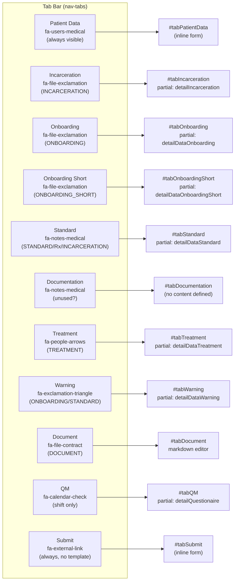
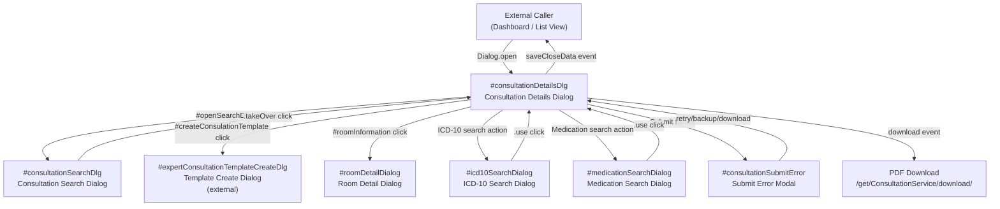
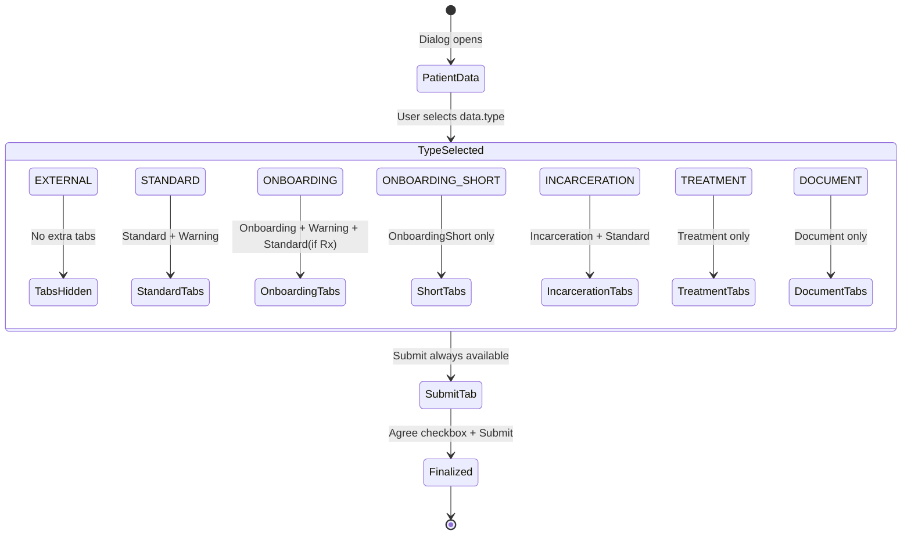

---
---

# 02 - Consultation Details Dialog: Header, Tabs, and Scaffold

> Source: `consultation/details.html` (778 lines), `consultation/details.js`, `consultation/details.ts`

---

## 1. Consultation Details Dialog (`#consultationDetailsDlg`)

The primary detail dialog for viewing and editing a single consultation record. This is a large, multi-tab form dialog that adapts its visible tabs based on the selected consultation type.

### Visualization Attributes

| Attribute | Value |
|-----------|-------|
| `data-target` | `primary` |
| `data-width` | `1500` |
| `data-crudbuttons` | `false` |
| `data-icon` | `fa fa-heartbeat` |
| `data-color` | `bg-color-consultation` |
| `title` | `{{i18n.consultation}}` |

### Script Includes

| Resource | Purpose |
|----------|---------|
| `consultation/messages.i18n.js` | i18n message bundle for consultation domain |
| `consultation/details.js` | Compiled JS from `details.ts` -- dialog init, events, save, submit |
| `_lib/3rdparty/jquery.conditionize2.min.js` | Conditional field visibility based on other field values |
| `_lib/scripts/highlightSearch.js` + `.css` | Search term highlighting in ICD-10 results |

---

## 2. Style Block (Custom CSS)

| Class / Rule | Purpose | Details |
|-------------|---------|---------|
| `.icd10inclusion li` | ICD-10 inclusion list marker | `list-style-type: "+ "` |
| `.icd10exclusion li` | ICD-10 exclusion list marker | `list-style-type: "- "` |
| `.scrolling` | Tab pane scrolling | `max-height: calc(100vh - 190px); overflow: auto` |
| `.siren-on` | Emergency siren animation (active) | Blue background with red flash animation (2s infinite keyframes cycling `#007BFF` -> `red` -> `#007BFF`) |
| `.siren-off` | Emergency siren (inactive) | Static blue background `#007BFF`, white text |
| `@keyframes sirenFlash` | Siren animation | 3-step: 0% blue, 50% red, 100% blue |

---

## 3. Header Row (`notemplate`)

The top row of the dialog contains patient identifiers, date, and time fields. It is marked `notemplate` (hidden when the consultation is from a template).

### Form Elements

| Text-Reference / Name | Symbol | Datamodel | Type of UI element | Options | Placeholder | Default value | Required | Read-only | Condition/Permission |
|----------------------|--------|-----------|-------------------|---------|-------------|---------------|----------|-----------|---------------------|
| Book Number | `far fa-user-injured` | `data.bookNumber` | `input` (text) | -- | `{{i18n.consultation.booknumber}}` | -- | No | Yes (`disabled`) | Always visible |
| Copy Existing Consultation | `far fa-copy` | -- | icon button (action) | -- | -- | -- | -- | -- | Always visible. `id="openSearchDlg"`. Opens `#consultationSearchDlg` |
| Save as Template | `far fa-books-medical` | -- | icon button (action) | -- | -- | -- | -- | -- | Always visible. `id="createConsulationTemplate"`. Opens template create dialog |
| Gender | -- | `data.body.gender` | `select` | `""` (placeholder), `FEMALE`, `MALE`, `OTHER` | `{{i18n.user.gender}}` (as first option) | `""` | Yes (`required`) | No | `class="internalOnly"` -- internal users only |
| Birthday | `far fa-birthday-cake` | `data.body.birthday` | `input` (date) | -- | `{{i18n.patient.birthday}}` | -- | No | No | `class="internalOnly"` -- internal users only |
| Age | -- | `data.body.age` | `input` (number) | -- | `{{i18n.patient.age}}` | -- | Yes (`required`) | No (auto-calculated from birthday) | `class="internalOnly"` -- internal users only. Width: 70px |
| Consultation Date | `far fa-calendar-day` | `data.date` | `input` (date) | -- | `{{i18n.consultation.startDate}}` | -- | Yes (`mandatory required`) | No | Always visible |
| Start Time | `far fa-play` | `data.start` | `input` (time) | -- | `{{i18n.consultation.startTime}}` | -- | Yes (`mandatory required`) | No | Always visible. Uses `clockpicker` |

### Header Row Behavior (from JS)

- **Birthday -> Age auto-calc**: When `data.body.birthday` changes and has >= 4 chars, the age field is automatically computed as `floor(diffNow("years"))` using Luxon.
- **Dialog open**: On `dialogopen`, the first tab (`#tabPatientData`) is activated. If `data.closed === true`, `#reopenBtn` and `#reopenIcon` are shown; otherwise hidden.
- **Required validation**: All `.required` fields get a `change` handler that toggles `missing` class based on empty value.

---

## 4. Tab Navigation (`nav-tabs`)

Tabs are Bootstrap `nav-tabs` with icon-only display using Font Awesome stacked icons. Each tab has a status indicator icon (`fa-question text-danger`) bound to a completion data-field, and a loading spinner (`fa-sync fa-spin`). Tab visibility is controlled dynamically by the consultation `type` field.

### Tab Definitions

| Tab ID (flap) | Tab Pane ID | Icon | Title (i18n) | Status Field | Default Visible | Visibility Condition (from JS `toggleTab`) |
|---------------|-------------|------|-------------|-------------|-----------------|-------------------------------------------|
| _(always visible)_ | `#tabPatientData` | `fa-users-medical` | `{{i18n.consultation.patientData}}` | `baseComplete` | Yes (active) | Always shown |
| `#flapIncarcerationData` | `#tabIncarceration` | `fa-file-exclamation` | `{{i18n.consultation.incarceration}}` | `incarcerationComplete` | No | `type === "INCARCERATION"` |
| `#flapOnboardingData` | `#tabOnboarding` | `fa-file-exclamation` | `{{i18n.consultation.onboarding}}` | `dataComplete` | No | `type === "ONBOARDING"` |
| `#flapOnboardingShortData` | `#tabOnboardingShort` | `fa-file-exclamation` | `{{i18n.consultation.onboarding}}` | `dataComplete` | No | `type === "ONBOARDING_SHORT"` |
| `#flapStandardData` | `#tabStandard` | `fa-notes-medical` | `{{i18n.consultation.documentation}}` | `dataComplete` | No | `type === "STANDARD"` or `requirePrescription` or `isIncarceration` |
| `#flapDocumentationData` | `#tabDocumentation` | `fa-notes-medical` | `{{i18n.consultation.documentation}}` | `dataComplete` | No | _(not toggled via JS -- possibly legacy/unused)_ |
| `#flapTreatmentData` | `#tabTreatment` | `fa-people-arrows` | `{{i18n.consultation.treatment}}` | `treatmentComplete` | No | `type === "TREATMENT"` |
| `#flapWarningData` | `#tabWarning` | `fa-exclamation-triangle` | `{{i18n.consultation.warning}}` | `warningComplete` | No | `type === "ONBOARDING"` or `type === "STANDARD"` |
| `#flapDocumentData` | `#tabDocument` | `fa-file-contract` | `{{i18n.consultation.documentation}}` | `documentComplete` | No | `type === "DOCUMENT"` |
| `#flapQMData` | `#tabQM` | `fa-calendar-check` | `{{i18n.questionaire}}` | `qmComplete` | No | `data.shift && type !== "TREATMENT"` |
| `#flapSubmitData` | `#tabSubmit` | `fa-external-link` | `{{i18n.consulation.submit}}` | `submitComplete` | Yes (`notemplate`) | Always shown (hidden for templates) |

### Tab Status Indicator Pattern

Each tab icon uses a stacked icon pattern:
```html
<span class="fa-stack">
    <i class="fas fa-stack-2x {main-icon}"></i>                          <!-- main icon -->
    <i class="fas fa-stack-1x fa-question text-danger corner status"     <!-- status: ? = incomplete -->
       data-field="{completionField}"></i>
    <i class="fas fa-stack-1x fa-sync loading corner text-info fa-spin"></i> <!-- loading spinner -->
</span>
```

Status popovers are initialized on each `li.nav-item` using Bootstrap Popover with hover trigger, showing `i18n.exception_data_missing` as title and the specific missing-field messages from `status.data().message`.

### Tab Toggle Mechanism (`toggleTab`)

```
toggleTab(tabName, show, skipcheck?)
```
1. Toggles visibility of the flap element `#flap{tabName}Data`
2. Adds/removes `transient` class on all `input,select,textarea` within `#tab{tabName}` (transient fields are excluded from form serialization)
3. If hiding: removes `invalid` class from all fields
4. If showing (and `!skipcheck`): triggers `change` on all fields to re-validate

### Type-Based Tab Visibility Matrix

| Consultation Type | Patient | Incarceration | Onboarding | OnboardingShort | Standard | Documentation | Treatment | Warning | Document | QM | Submit |
|------------------|---------|---------------|------------|-----------------|----------|---------------|-----------|---------|----------|----|--------|
| `EXTERNAL` | Yes | -- | -- | -- | -- | -- | -- | -- | -- | -- | Yes |
| `STANDARD` | Yes | -- | -- | -- | Yes | -- | -- | Yes | -- | If shift | Yes |
| `ONBOARDING` | Yes | -- | Yes | -- | If Rx | -- | -- | Yes | -- | If shift | Yes |
| `ONBOARDING_SHORT` | Yes | -- | -- | Yes | -- | -- | -- | -- | -- | If shift | Yes |
| `INCARCERATION` | Yes | Yes | -- | -- | Yes | -- | -- | -- | -- | If shift | Yes |
| `TREATMENT` | Yes | -- | -- | -- | -- | -- | Yes | -- | -- | -- | Yes |
| `DOCUMENT` | Yes | -- | -- | -- | -- | -- | -- | -- | Yes | If shift | Yes |

_"If Rx" = if `data.onboarding.additionalPrescription === "true"`. "If shift" = if `data.shift` is truthy._

---

## 5. Content Scaffold

### Tab Pane Structure

All tab panes live inside `div.tab-content`. The first tab (`#tabPatientData`) is `show active`. All other panes (except `#tabFiles`) use the `scrolling` class for vertical overflow with `max-height: calc(100vh - 190px)`.

| Tab Pane | Content Structure | Partial Template |
|----------|-------------------|-----------------|
| `#tabPatientData` | Inline form rows (see Section 5.1 below) | -- (inline HTML) |
| `#tabOnboarding` | Container with partial | `{{> detailDataOnboarding}}` |
| `#tabOnboardingShort` | Container with partial | `{{> detailDataOnboardingShort}}` |
| `#tabStandard` | Container with partial | `{{> detailDataStandard}}` |
| `#tabIncarceration` | Container with partial | `{{> detailIncarceration}}` |
| `#tabDocument` | Markdown editor textarea | -- (inline: `textarea.markdownedit` bound to `data.document.documentation`, `height: calc(100vh - 160px)`) |
| `#tabTreatment` | Container with partial | `{{> detailDataTreatment}}` |
| `#tabWarning` | Container with partial | `{{> detailDataWarning}}` |
| `#tabQM` | Container with partial | `{{> detailQuestionaire}}` |
| `#tabSubmit` | Inline form (see Section 5.2 below) | -- (inline HTML) |
| `#tabFiles` | File upload card + attachments table | -- (inline HTML, currently disabled in tabs via comment) |

### 5.1 Patient Data Tab (`#tabPatientData`) -- Form Elements

| Text-Reference / Name | Symbol | Datamodel | Type of UI element | Options | Placeholder | Default value | Required | Read-only | Condition/Permission |
|----------------------|--------|-----------|-------------------|---------|-------------|---------------|----------|-----------|---------------------|
| Location Name | `far fa-compass` | `data.location.name` | span (display field) | -- | -- | -- | -- | Yes | `notemplate` |
| Location Customer | -- | `data.location.customer.name` | span (display field) | -- | -- | -- | -- | Yes | `notemplate` |
| Room | `fas fa-building` | `data.room` | autocomplete input (object) | `RoomService.autocompleteAvailableRooms` | `{{i18n.equipment.room}}` | -- | No | Yes (`readonly`) | `notemplate`. `id="roomAutoselect"`. Filtered by `data.location.id` |
| Room Info | `fas fa-info` | -- | icon button (action) | -- | -- | -- | -- | -- | `id="roomInformation"`. Opens `#roomDetailDialog` with room data |
| Time of Contact | `far fa-phone-plus` | `data.base.contact` | `input` (time) | -- | `{{i18n.consultation.timeContact}}` | -- | Yes (`required`) | No | `class="shiftonly"` -- only for shift consultations |
| Location External Description | -- | `data.location.externalDescription` | div (display field) | -- | -- | -- | -- | Yes | `notemplate` |
| Template Name | -- | `data.name` | h6/strong (display) | -- | -- | -- | -- | Yes | `class="template"` -- only for template consultations |
| Template Description | -- | `data.description` | span (display) | -- | -- | -- | -- | Yes | `class="template"` |
| Consultation Type | -- | `data.type` | `select` | `EXTERNAL`, `DOCUMENT`, `STANDARD`, `INCARCERATION`, `ONBOARDING`, `TREATMENT` | -- | -- | Yes (`mandatory required`) | No | `id="consultationTypeSelection"`. `EXTERNAL` option has `class="externalonly"` |
| Specialization | `far fa-briefcase-medical` | `data.job.code` | div (display field) | -- | -- | -- | -- | Yes | `notemplate` |
| Doctor | `far fa-user-md` | `data.doctor` | autocomplete input (object) | `UserService.findDoctor` | `{{i18n.consultation.doctor}}` | -- | No | Yes (disabled/readonly) unless admin | `{{^isAnAdmin}}disabled{{/isAnAdmin}}` -- editable only for admins |
| Communication Type | -- | `data.base.communicationType` | `select` | `""` (placeholder), `VIDEO`, `VCGO`, `PHONE`, `EMAIL` | `{{i18n.CommunicationType}}` (as first option) | -- | Yes (`mandatory required`) | No | `notemplate` |
| Medical Trained Personnel | -- | `data.base.medicalTrainedPersonel` | checkbox (switch) | -- | -- | -- | No | No | `notemplate` |

### 5.2 Submit Tab (`#tabSubmit`) -- Form Elements

| Text-Reference / Name | Symbol | Datamodel | Type of UI element | Options | Placeholder | Default value | Required | Read-only | Condition/Permission |
|----------------------|--------|-----------|-------------------|---------|-------------|---------------|----------|-----------|---------------------|
| End Time | -- | `data.end` | `input` (time) | -- | `{{i18n.consultation.end}}` | -- | Yes (`required`) | No | `class="shiftonly"` |
| Require Reporting | -- | `data.requireReporting` | radio (boolean pair) | `true` / `false` | -- | -- | No | No | Label: `{{i18n.Questionaire.requireReporting}}` |
| Comment | -- | `data.comment` | `textarea` | -- | `{{i18n.label.comment}}` | -- | Conditional (mandatory if requireReporting=true) | No | -- |
| Refer Psychotherapy | -- | `data.referral.referPsychotherapy` | checkbox (switch) | -- | -- | -- | No | No | `id="referPsychotherapy"` |
| Psychotherapy Comment | -- | `data.referral.psychoTherapy.comment` | `textarea` | -- | `{{i18n.consultation.reasoning}}` | -- | No | No | `class="conditional" data-condition="#referPsychotherapy"` -- shown when referPsychotherapy is checked |
| Further Treatment | -- | `data.base.furtherTreatment` | `select` | `""`, `REFERRAL`, `IF_REQUIRED`, `FOLLOW_UP`, `REFERRAL_OTHER` | `{{i18n.consultation.furtherTreatment}}` | -- | Yes (`required`) | No | `id="furtherTreatment"` |
| Further Treatment Date | -- | `data.base.dateFurtherTreatment` | `input` (date) | -- | `{{i18n.consultation.furtherTreatmentDate}}` | -- | Yes (`required`) | No | `class="conditional"` -- shown when `furtherTreatment` is `FOLLOW_UP` |
| Referral To | -- | `data.standard.referralTo` | `select` | Dynamic from `{{{treatmentCategories}}}` | -- | -- | Yes (`required`) | No | `class="conditional"` -- shown when `furtherTreatment` is `REFERRAL` or `REFERRAL_OTHER` |
| Finalize Agree Checkbox | -- | -- | checkbox | -- | -- | unchecked | -- | -- | `id="submitConsultationAgree"`. Gates the submit button |
| Finalize Button | -- | -- | `button` | -- | -- | -- | -- | -- | `id="submitConsultationOK"`. Disabled until agree checkbox is checked. Saves then calls `submit("SUBMIT")` |
| Transmit Result | -- | `data.transmitResult` | span (display field) | -- | -- | -- | -- | Yes | Shows result of submission |
| Debug Textarea | -- | -- | `textarea` | -- | `Debug` | -- | -- | -- | `{{#roleSwitch}}` -- admin/debug only. `id="consultationDebug"` |
| Generate BasisWeb | -- | -- | `button` | -- | -- | -- | -- | -- | `{{#roleSwitch}}` -- admin/debug only. `id="generateBasisWeb"` |

---

## 6. ICD-10 Search Dialog (`#icd10SearchDialog`)

A standalone search dialog for finding and selecting ICD-10 diagnosis codes.

### Visualization Attributes

| Attribute | Value |
|-----------|-------|
| `title` | `ICD 10` (HARDCODED) |
| `data-icon` | `fa fa-heartbeat` |
| `data-color` | `bg-color-consultation` |
| `data-width` | `800` |

### Form Elements

| Text-Reference / Name | Symbol | Datamodel | Type of UI element | Options | Placeholder | Default value | Required | Read-only | Condition/Permission |
|----------------------|--------|-----------|-------------------|---------|-------------|---------------|----------|-----------|---------------------|
| Search Input | `fa fa-search` (action) | `search` | `input` (text) | -- | -- | -- | No | No | Search icon triggers search action |

### Collection: `data.diagnosis`

Scrollable container (`height: calc(70vh); overflow: auto`) with result cards.

| Field | Display | CSS Class |
|-------|---------|-----------|
| `diagnosis.title` | Bold code | -- |
| `diagnosis.icd10.name` | Name text | -- |
| `diagnosis.icd10.text` | Rendered markdown | `render` |
| `diagnosis.icd10.inclusion` | Inclusion list | `icd10inclusion render` |
| `diagnosis.icd10.exclusion` | Exclusion list | `icd10exclusion render` |

Each result card has a `fa-check use` action icon to select the diagnosis.

---

## 7. Medication Search Dialog (`#medicationSearchDialog`)

### Visualization Attributes

| Attribute | Value |
|-----------|-------|
| `title` | `{{i18n.medication}}` |
| `data-icon` | `fa far fa-prescription-bottle` |
| `data-color` | `bg-color-consultation` |
| `data-width` | `800` |

### Collection: `data.prescription`

Scrollable container (`height: calc(50vh); overflow: auto`).

| Field | Display |
|-------|---------|
| `prescription.medication.name` | Bold name |
| `prescription.medication.code` | Code |
| `prescription.product.ingredientInfo` | Ingredient info |
| `prescription.medication.usage` | Usage |

Each result has a `fa-check use` action icon.

---

## 8. Attachments Section

Two separate attachment presentations exist:

### 8.1 Patient Data Tab -- Inline Attachment List (line 318-336)

Located inside `#tabPatientData`, marked `notemplate`.

| Text-Reference / Name | Symbol | Datamodel | Type of UI element | Options | Placeholder | Default value | Required | Read-only | Condition/Permission |
|----------------------|--------|-----------|-------------------|---------|-------------|---------------|----------|-----------|---------------------|
| Uploaded Files Label | -- | -- | `label` | -- | -- | -- | -- | -- | `{{i18n.PatientData.Attachments.UploadedFiles}}:` |
| Attachments Collection | `fa fa-file-download` | `data.attachments` | `ul.collection` | -- | -- | -- | -- | Yes | Each `<li>` shows download link + comment |

Download URL template: `/get/ConsultationService/attachment/[[data.id]]/[[cur.file.id]]/[[cur.file.name]]`

### 8.2 Files Tab (`#tabFiles`) -- Full File Manager (line 463-490)

Currently disabled in tab navigation (commented out in HTML). Contains:

| Text-Reference / Name | Symbol | Datamodel | Type of UI element | Options | Placeholder | Default value | Required | Read-only | Condition/Permission |
|----------------------|--------|-----------|-------------------|---------|-------------|---------------|----------|-----------|---------------------|
| File Upload | -- | -- | `input[type=file]` | `multiple` | -- | -- | -- | -- | `id="attachFile"` |
| Upload Status | -- | -- | `div` | -- | -- | -- | -- | -- | `id="uploadStatus"` |
| File List | -- | `data.attachments` | `table` with `collection insert` | -- | -- | -- | -- | -- | `id="fileList"`. Shows name, date, delete button |
| Delete Attachment | `fa fa-trash` | -- | icon button (action) | -- | -- | -- | -- | -- | `class="deleteAttachment"`. `{{#isAnAdmin}}` -- admin only |

### 8.3 BasisWeb Data Section (`basiswebonly notemplate`)

A read-only section showing external medication history and patient history from the BasisWeb system. Contains two tables:

**Medication Table** (`data.history.medication`):
- Columns: date + type + active ingredient, entry + content + note, extra, valid-until date
- Header: "Medikation" (HARDCODED), "Gultig bis" (HARDCODED)

**Patient History Table** (`data.history.history`):
- Columns: date + type + active, entry + content + note, extra + until
- Header: "Patientengeschichte" (HARDCODED)

---

## 9. Buttonset

The dialog footer buttonset (custom `data-event` pattern for the Dialog framework).

| Button Label | Class | `data-event` | `data-position` | `data-fab-html` | Condition |
|-------------|-------|-------------|-----------------|-----------------|-----------|
| `{{i18n.dialog.save}}` | `btn-primary data` | `saveData` | `10` | `<i class='fa fa-save'></i>` | Always |
| `{{i18n.dialog.ok}}` | `btn-primary data` | `saveCloseData` | `10` | `<i class='fa fa-check'></i>` | Always |
| `{{i18n.dialog.download}}` | `btn-secondary data notemplate` | `download` | `40` | `<i class='fa fa-file-pdf'></i>` | Not templates |

### Button Event Handlers (from JS)

| Event | Handler |
|-------|---------|
| `saveData` | Calls `ConsultationDetails.save()` (save without closing) |
| `saveCloseData` | Calls `ConsultationDetails.save(callback)` -- on success: resets changed fields, triggers `$(document).reload`, closes dialog |
| `download` | Calls `ConsultationDetails.save(callback)` -- on success: opens PDF download URL, closes dialog |

### Save Function (`ConsultationDetails.save`)

1. If `data.template`: removes `invalid` class from `notemplate` fields (templates skip certain validations)
2. Calls `jsForm("get")` to extract and validate form data
3. If `data.state === "CLOSED"`: skips save, only calls callback
4. If `data.dateSignedOff`: restricts to QM fields only
5. Otherwise: sends data to server via `ConsultationService`

### Download Filename Generation (`generateDownloadName`)

Format: `{date}-{bookNumber}-{displayName}-{birthday}-{jobCode}{type}.pdf`

Type suffixes: `APPOINTMENT` -> `-Sprechstunde`, `COUNCIL` -> `-Konsil`, `SHIFT` -> `-Bereitschaft`

---

## 10. Submission Error Modal (`#consultationSubmitError`)

A Bootstrap modal for handling submission failures.

| Element | ID | Type | Label / Content |
|---------|----|------|-----------------|
| Title | -- | `h5.modal-title` | `{{i18n.consultation.finalize.issue.title}}` |
| Close | `#cancelConsultationSubmit` | `span.action` | `x` |
| Error Message | `#consultationSubmitErrorMessage` | `p.alert-warning` | Dynamic error text |
| Backup Info | `#consultationBackup` | `p.alert-info` | Dynamic backup info |
| Retry | `#resubmitConsultation` | `button.btn-primary` | `{{i18n.button.retry}}` -- calls `submit("SUBMIT")` |
| Submit Backup | `#submitBackupConsultation` | `button.btn-primary` | `{{i18n.consultation.submitbackup}}` -- calls `submit("BACKUP")` |
| Download | `#submitDownloadConsultation` | `button.btn-secondary` | `{{i18n.dialog.download}}` -- calls `submit("DOWNLOAD")` |

---

## 11. Consultation Search Dialog (`#consultationSearchDlg`)

A modal dialog for searching and copying data from existing consultations or templates.

### Visualization Attributes

| Attribute | Value |
|-----------|-------|
| `data-target` | `modal` |
| `data-crudbuttons` | `false` |
| `data-icon` | `fa fa-file` |
| `data-width` | `700` |
| `data-color` | `bg-color-consultation` |
| `title` | `Behandlungssuche` (HARDCODED) |

### Filter Form (`#consultationSearchDlgFilter`)

| Text-Reference / Name | Symbol | Datamodel | Type of UI element | Options | Placeholder | Default value | Required | Read-only | Condition/Permission |
|----------------------|--------|-----------|-------------------|---------|-------------|---------------|----------|-----------|---------------------|
| Book Number | `far fa-user-injured` | `filter.bookNumber` | `input` (text) | -- | `Buchnummer` (HARDCODED) | Prefilled from current consultation | No | No | -- |
| Location | `far fa-compass` | `filter.location` | autocomplete input (object) | `LocationService.autocomplete` | `{{i18n.location}}` | Prefilled from current consultation | Yes (`mandatory`) | No | -- |
| Date From | -- | `filter.dateStart` | `input` (date) | -- | -- | -- | No | No | Label: `{{i18n.dateFilter.fromDate}}` |
| Date To | -- | `filter.dateEnd` | `input` (date) | -- | -- | -- | No | No | Label: `{{i18n.dateFilter.toDate}}` |
| Search Button | -- | -- | `button` | -- | `Suche` (HARDCODED) | -- | -- | -- | Calls `ConsultationService.getAll` |

### Result Tables

**Search Results** (`#consultationSearchDlgFilterResult`, collection `data.result`):

| Column | Field |
|--------|-------|
| BookNumber (HARDCODED header) | `result.bookNumber` |
| `{{i18n.location}}` | `result.location.name` |
| `{{i18n.label.date}}` | `result.date` (formatted) |
| Action | "Take Over" button (`class="takeOver"`) with `{{i18n.label.use}}` |

**Template Results** (`#consultationSearchDlgTemplateResult`, collection `data.templates`):

| Column | Field |
|--------|-------|
| `{{i18n.consultationTemplate}}` | `templates.name` |
| `{{i18n.label.description}}` | `templates.description` |
| Action | "Take Over" button (`class="takeOver"`) with `{{i18n.label.use}}` |

### Buttonset

| Button Label | `data-event` | `data-position` |
|-------------|-------------|-----------------|
| `{{i18n.dialog.cancel}}` | `cancel` | `40` |

---

## 12. Room Detail Dialog (`#roomDetailDialog`)

A simple read-only dialog showing room information and equipment list.

### Visualization Attributes

| Attribute | Value |
|-----------|-------|
| `data-icon` | `fa fa-building` |
| `data-color` | `bg-color-room` |
| `title` | `{{i18n.room}}` |

### Display Fields

| Field | Layout |
|-------|--------|
| `data.name` | col-md-4 |
| `data.number` | col-md-1 |
| `data.description` | col-md-7 |

### Equipment Table (`data.equipments`)

| Column Header | Field |
|---------------|-------|
| `{{i18n.equipment.name}}` | `equipments.name` |
| `{{i18n.equipment.serialNumber}}` | `equipments.serialNumber` |
| `{{i18n.EquipmentStatus}}` | `equipments.status` |
| `{{i18n.equipment.description}}` | `equipments.description` |

---

## 13. Permission Gating

| Mechanism | CSS Class / Mustache | Scope | Effect |
|-----------|---------------------|-------|--------|
| Internal Only | `class="internalOnly"` | Gender, Birthday/Age fields in header | Hidden for external users (CSS-based) |
| Admin Only (Doctor field) | `{{^isAnAdmin}}disabled{{/isAnAdmin}}` | Doctor autocomplete | Disabled/readonly for non-admins |
| Admin Only (Delete attachment) | `{{#isAnAdmin}}...{{/isAnAdmin}}` | Delete icon in file list | Only rendered for admins |
| External Only | `class="externalonly"` | `EXTERNAL` option in consultation type select | Hidden for internal users |
| Shift Only | `class="shiftonly"` | Time of Contact, End Time fields | Only visible during shift consultations |
| BasisWeb Only | `class="basiswebonly"` | Medication/History tables | Only visible for BasisWeb-connected locations |
| Template / NoTemplate | `class="template"` / `class="notemplate"` | Various sections | Toggled based on whether consultation is from a template |
| Role Switch (Debug) | `{{#roleSwitch}}` | Debug textarea + Generate BasisWeb button in Submit tab | Only for admin/debug roles |
| Incarceration Hide | `class="incarceration-hide"` | Various fields in Standard tab | Hidden when type is `INCARCERATION` |

---

## 14. Click Actions Summary

| Trigger / Selector | Action | Handler Location |
|--------------------|--------|-----------------|
| `#openSearchDlg` click | Opens consultation search dialog, pre-fills with current consultation's location and bookNumber | `details.js` line 560 |
| `#createConsulationTemplate` click | Gets current form data, opens `#expertConsultationTemplateCreateDlg` to save as template | `details.js` line 542 |
| `#roomInformation` click | Fetches room data via `RoomService.get(roomId)`, opens `#roomDetailDialog` | `details.js` line 183 |
| `select[name='data.type']` change | Toggles tab visibility based on consultation type (see matrix in Section 4) | `details.js` line 340 |
| `input[name='data.body.birthday']` change | Auto-calculates age field | `details.js` line 127 |
| `#submitConsultationAgree` change | Toggles `disabled` class on `#submitConsultationOK` button | `details.js` line 472 |
| `#submitConsultationOK` click | If agreed: save consultation, then call `submit("SUBMIT")` | `details.js` line 478 |
| `#resubmitConsultation` click | `submit("SUBMIT")` | `details.js` line 524 |
| `#submitBackupConsultation` click | `submit("BACKUP")` | `details.js` line 527 |
| `#submitDownloadConsultation` click | `submit("DOWNLOAD")` | `details.js` line 518 |
| `#submitMailConsultation` click | `submit("MAIL")` | `details.js` line 521 |
| `.search` (ICD-10 dialog) click | Searches ICD-10 codes | ICD-10 dialog handler |
| `.use` (ICD-10/medication result) click | Selects the diagnosis/medication entry | Collection action |
| `.takeOver` (search results) click | Copies consultation data into current form (with confirm dialog) | `details.js` line 594 |
| `.deleteAttachment` click | Deletes attachment (admin only) | Attachment handler |
| `select[name='data.onboarding.additionalPrescription']` change | Re-triggers type change to update Standard tab visibility | `details.js` line 461 |
| `.requireReporting` radio change | If `true`: makes comment textarea mandatory; if `false`: removes mandatory | `details.js` line 265 |

---

## 15. Translation Table

### i18n References (from Mustache `{{i18n.*}}`)

| Key | English | Context |
|-----|---------|---------|
| `consultation` | Consultation | Dialog title |
| `consultation.booknumber` | Book number | Header placeholder |
| `consultation.startDate` | Start date | Header date placeholder |
| `consultation.startTime` | _(not in provided translations)_ | Header time placeholder |
| `consultation.doctor` | Doctor | Doctor autocomplete placeholder |
| `consultation.patientData` | _(not provided)_ | Patient Data tab title |
| `consultation.incarceration` | _(not provided)_ | Incarceration tab title |
| `consultation.onboarding` | Onboarding | Onboarding tab title |
| `consultation.documentation` | _(not provided)_ | Documentation/Standard tab title |
| `consultation.treatment` | Treatment | Treatment tab title |
| `consultation.warning` | _(not provided)_ | Warning tab title |
| `consultation.finalize` | Finalize | Finalize button text |
| `consultation.finalize.confirm` | Confirm finalize | Submit confirmation text |
| `consultation.finalize.confirm.title` | _(not provided)_ | Finalize section heading |
| `consultation.finalize.confirm.agree` | _(not provided)_ | Checkbox label for agree |
| `consultation.finalize.ChangeNoLongerPossible` | _(not provided)_ | Warning about irreversible finalization |
| `consultation.finalize.issue.title` | _(not provided)_ | Submit error modal title |
| `consultation.finalize.issue` | _(not provided)_ | Submit error modal body |
| `consultation.end` | _(not provided)_ | End time placeholder |
| `consultation.end.description` | _(not provided)_ | End time label |
| `consultation.timeContact` | _(not provided)_ | Time of contact placeholder |
| `consultation.timeContact.description` | _(not provided)_ | Time of contact tooltip |
| `consultation.furtherTreatment` | _(not provided)_ | Further treatment select placeholder |
| `consultation.furtherTreatmentDate` | _(not provided)_ | Further treatment date placeholder |
| `consultation.furtherTreatment.referPsychotherapy` | _(not provided)_ | Psychotherapy referral label |
| `consultation.furtherTreatment.referPsychotherapy.notice` | _(not provided)_ | Psychotherapy referral notice |
| `consultation.reasoning` | _(not provided)_ | Psychotherapy comment placeholder |
| `consultation.medicalTrainedJVAPersonnel` | _(not provided)_ | Medical trained personnel toggle label |
| `consultation.submitbackup` | _(not provided)_ | Submit backup button |
| `consulation.submit` | _(not provided, note typo: "consulation")_ | Submit tab title |
| `ConsultationType` | _(not provided)_ | Consultation type label |
| `ConsultationType.EXTERNAL` | _(not provided)_ | External type option |
| `ConsultationType.DOCUMENT` | _(not provided)_ | Document type option |
| `ConsultationType.STANDARD` | _(not provided)_ | Standard type option |
| `ConsultationType.INCARCERATION` | _(not provided)_ | Incarceration type option |
| `ConsultationType.ONBOARDING` | _(not provided)_ | Onboarding type option |
| `ConsultationType.TREATMENT` | _(not provided)_ | Treatment type option |
| `CommunicationType` | _(not provided)_ | Communication type placeholder |
| `CommunicationType.video` | _(not provided)_ | Video option |
| `CommunicationType.vcgo` | _(not provided)_ | VCGO option |
| `CommunicationType.phone` | _(not provided)_ | Phone option |
| `CommunicationType.email` | _(not provided)_ | Email option |
| `FurtherTreatment.REFERRAL` | _(not provided)_ | Referral option |
| `FurtherTreatment.IF_REQUIRED` | _(not provided)_ | If required option |
| `FurtherTreatment.FOLLOW_UP` | _(not provided)_ | Follow-up option |
| `FurtherTreatment.REFERRAL_OTHER` | _(not provided)_ | Referral other option |
| `Questionaire.requireReporting` | _(not provided)_ | Require reporting label |
| `questionaire` | _(not provided)_ | QM tab title |
| `consultationTemplate` | _(not provided)_ | Template table header |
| `medication` | _(not provided)_ | Medication dialog title |
| `user.gender` | Gender | Gender select placeholder |
| `Gender.FEMALE` | Female | Female option |
| `Gender.MALE` | Male | Male option |
| `Gender.OTHER` | Other | Other option |
| `patient.birthday` | Birthday | Birthday placeholder |
| `patient.age` | Age | Age placeholder |
| `PatientData.Attachments.UploadedFiles` | _(not provided)_ | Attachments label |
| `equipment.room` | _(not provided)_ | Room placeholder |
| `equipment.name` | _(not provided)_ | Equipment name header |
| `equipment.serialNumber` | _(not provided)_ | Equipment serial number header |
| `equipment.description` | _(not provided)_ | Equipment description header |
| `EquipmentStatus` | _(not provided)_ | Equipment status header |
| `consultation.specialization` | _(not provided)_ | Specialization tooltip |
| `room` | _(not provided)_ | Room dialog title |
| `location` | _(not provided)_ | Location placeholder |
| `label.type` | _(not provided)_ | Type label tooltip |
| `label.name` | _(not provided)_ | Name column header |
| `label.date` | _(not provided)_ | Date column header |
| `label.comment` | _(not provided)_ | Comment placeholder |
| `label.description` | _(not provided)_ | Description column header |
| `label.yes` | _(not provided)_ | Yes label |
| `label.no` | _(not provided)_ | No label |
| `label.use` | _(not provided)_ | Use/Take Over button |
| `dialog.save` | _(not provided)_ | Save button |
| `dialog.ok` | _(not provided)_ | OK button |
| `dialog.download` | _(not provided)_ | Download button |
| `dialog.cancel` | _(not provided)_ | Cancel button |
| `button.retry` | _(not provided)_ | Retry button |
| `dateFilter.fromDate` | _(not provided)_ | From date label |
| `dateFilter.toDate` | _(not provided)_ | To date label |
| `exception_data_missing` | _(not provided)_ | Tab popover title for missing data |
| `dialog_validation_notOk` | _(not provided)_ | Alert when validation fails |
| `consultation_template_data_overwrite` | _(not provided)_ | Confirm dialog for overwriting with template |

### Hardcoded Strings (German)

| String | Location | English Equivalent |
|--------|----------|-------------------|
| `Existierende Behandlung kopieren` | Header copy icon `title` | Copy existing consultation |
| `Als Vorlage speichern` | Header template icon `title` | Save as template |
| `ICD 10` | ICD-10 dialog `title` | ICD 10 |
| `Behandlungssuche` | Search dialog `title` | Consultation search |
| `Buchnummer` | Search dialog filter placeholder | Book number |
| `BookNumber` | Search results table header | Book Number |
| `Suche` | Search button label | Search |
| `Medikation` | BasisWeb medication table header | Medication |
| `Gultig bis` | BasisWeb medication "valid until" header (`G&uuml;ltig bis`) | Valid until |
| `Patientengeschichte` | BasisWeb history table header | Patient history |
| `Debug` | Debug textarea placeholder | Debug |
| `Generate BasisWeb` | Debug button label | Generate BasisWeb |
| `Ihre Vorlage wurde gespeichert.` | Alert after template save (in JS) | Your template has been saved. |
| `-Sprechstunde` | Download filename suffix (in JS) | -Consultation |
| `-Konsil` | Download filename suffix (in JS) | -Council |
| `-Bereitschaft` | Download filename suffix (in JS) | -On-call |

---

## 16. Mermaid Diagrams

### 16.1 Tab Navigation Structure



### 16.2 Dialog Navigation Map



### 16.3 Consultation Type State Machine


