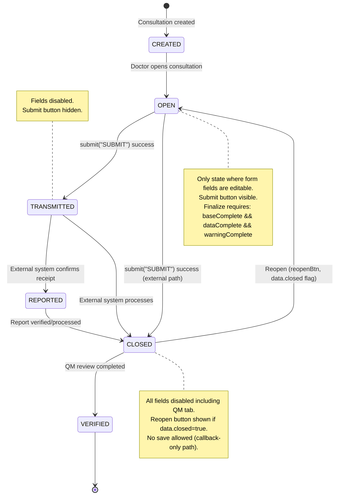

# 08 — Consultation Details: JavaScript Behavior and State Management

> **Source files analyzed:**
> - `/videoclinic-prod/web/src/main/webapp/consultation/details.js` (1066 lines)
> - `/videoclinic-prod/web/src/main/webapp/consultation/details.ts` (1192 lines)
>
> The `.js` file is the compiled output of the `.ts` file. They are functionally identical. Analysis is based on both, with the `.ts` file used as the authoritative source for type information.

---

## 1. ConsultationDetails Namespace Structure

The entire module is a TypeScript `namespace ConsultationDetails` (compiled to an IIFE in JS). It acts as a singleton state manager for the consultation detail dialog.

### Exported Properties

| Property | Type | Purpose |
|----------|------|---------|
| `data` | `any` | The current consultation data object (global mutable state) |
| `detail` | `JQuery` | Reference to the detail dialog DOM element |
| `onSave` | `(data: any) => void` | Callback invoked after successful save |
| `pages` | `JQuery[]` | Declared but **never used** in the code |

### Private Variables

| Variable | Type | Purpose |
|----------|------|---------|
| `consultationSubmit` | `any` | Declared but **never assigned or used** |
| `consultationSubmitError` | `any` | Bootstrap Modal instance for submit error dialog |

### Exported Functions

| Function | Signature | Purpose |
|----------|-----------|---------|
| `initButtonEvents` | `($detail: JQuery) => any` | Binds saveData, saveCloseData, download events |
| `generateDownloadName` | `(data?: any) => string` | Builds PDF filename from consultation data |
| `initControls` | `($detail: JQuery) => any` | Main initialization: binds all controls, events, dialogs |
| `save` | `(onSave?: (data: any) => void) => void` | Validates, serializes, and persists consultation |
| `fillDialog` | `() => void` | Fills the dialog from `ConsultationDetails.data`, sets tab statuses |
| `openDialog` | `() => void` | Configures visibility classes and opens the dialog |
| `open` | `(consultation: any, onSave: (data: any) => void, consultationTemplate?: boolean) => void` | Entry point: fetches consultation if needed, then opens dialog |
| `copyConsultation` | `(selected: any, noTemplateData: any, data?: any) => void` | Copies data from another consultation/template onto current |

### Private Functions

| Function | Purpose |
|----------|---------|
| `toggleTab(tab, show, skipcheck?)` | Shows/hides a tab flap, toggles `transient` class on fields, triggers validation |
| `submit(type: string)` | Submits/finalizes consultation via `ConsultationService.submit` |
| `handleSpecialFields(data, save)` | On load: applies markdown to `location.externalDescription`, ensures `qm` and `standard` objects exist. On save: no-op (returns data unchanged) |
| `filterQm($detail, data)` | Called from `fillDialog` -- defined externally (not in this file), applies QM questionnaire filtering logic |

---

## 2. Dialog Lifecycle

### Opening

```
open(consultation, onSave, consultationTemplate?)
  |
  +--> If consultation has no .id and no .appointment:
  |      ConsultationService.get(consultation)  --> handleSpecialFields --> openDialog()
  |
  +--> Else:
         data = consultation --> openDialog()

openDialog()
  |
  +--> If data.template:
  |      Show .internalonly, .basiswebonly; hide .externalonly
  |      Show .template fields; hide .notemplate fields
  |      Swap .mandatory <-> .notemplate-mandatory classes
  |
  +--> Else (regular consultation):
  |      Determine dlglocation (appointment.location || data.location)
  |      Toggle .shiftonly, .internalonly, .externalonly, .basiswebonly
  |      Show/hide consultation type options based on job flags
  |      Apply markdown to location.externalDescription (once)
  |      Show .notemplate fields; hide .template fields
  |
  +--> Dialog.open(detail, data)
  +--> fillDialog()
```

### Filling

`fillDialog()`:
1. Add `.missing` to all `.insert-required` fields
2. Call `jsForm("fill", data)` to populate all form fields
3. Call `filterQm()` for QM questionnaire logic
4. Set tab status icons (check/question) based on completeness fields
5. Disable all form fields if state is not `OPEN`
6. Hide submit button if state is not `OPEN`
7. Show/hide finalize button based on: `state !== "CLOSED" && type !== "EXTERNAL" && !archived && baseComplete && dataComplete && warningComplete`
8. Trigger type change to update tab visibility
9. Set all links to open in new tab

### Saving

`save(onSave?)`:
1. If `data.template`, remove `.invalid` from `.notemplate` children (template validation bypass)
2. Call `jsForm("get")` for validation + data extraction
3. If `state === "CLOSED"`: skip save, invoke callback only
4. If `dateSignedOff` is set: empty block (comment says "only allow qm fields" but no logic implemented)
5. Reduce foreign entities (`location`, `job`, `doctor`, `customer`, `appointment`) to `{ id }` only
6. Call `handleSpecialFields(data, true)` (currently a no-op on save)
7. Show loading animation on nav-link status icons
8. If `data.template`: call `ExpertConsultationTemplateService.save`
9. Else: call `ConsultationService.save`
10. On success: `handleSpecialFields` on response, update `ConsultationDetails.data`, `fillDialog()`, invoke callback

### Closing

- `saveCloseData` event: save, then `jsForm("resetChanged")`, trigger `$(document).reload`, `Dialog.close($detail)`
- `download` event: save, then `window.open(PDF URL)`, `Dialog.close($detail)`
  - **Bug**: `Dialog.close` is called outside the save callback, so it executes even if save fails

### Submitting (Finalizing)

`submit(type)`:
1. Hide previous error modal and submit button
2. Show loader with 15-second timeout
3. Call `ConsultationService.submit(id, type)` with `{onError: true}`
4. On success: reset changed fields, trigger `success` event, update data, fill dialog, invoke `onSave`, force-close dialog, open PDF download (unless EXTERNAL)
5. On error: display error modal with message, show backup options based on `location.patientDataAccess`, show/hide backup button based on error code

---

## 3. State Machine

### Consultation States

The system defines six consultation states. The JS code primarily distinguishes between `OPEN` (editable) and all other states (read-only), with `CLOSED` getting additional restrictions.



### State-based UI Behavior

| State | Fields Editable | Submit Visible | Finalize Visible | QM Editable | Reopen Visible |
|-------|----------------|----------------|------------------|-------------|----------------|
| CREATED | No (not OPEN) | No | No | Yes (if not CLOSED) | No |
| OPEN | Yes | Yes | Conditional* | Yes | No |
| TRANSMITTED | No | No | No | Yes | No |
| REPORTED | No | No | No | Yes | No |
| CLOSED | No | No | No | No | Yes (if data.closed) |
| VERIFIED | No | No | No | Yes | No |

*Finalize conditions: `state !== "CLOSED" && type !== "EXTERNAL" && !archived && baseComplete && dataComplete && warningComplete`

---

## 4. Type-Based Form Switching

When `select[name='data.type']` changes, `toggleTab()` is called for each form section. The `toggleTab` function:
- Shows/hides the tab "flap" (navigation element)
- Adds/removes `.transient` class on all inputs (transient fields are excluded from validation/serialization)
- Triggers or skips validation

### Type-Form Mapping Table

| Consultation Type | Tab: Standard | Tab: Onboarding | Tab: OnboardingShort | Tab: Incarceration | Tab: Document | Tab: Treatment | Tab: Warning | Tab: QM |
|-------------------|:---:|:---:|:---:|:---:|:---:|:---:|:---:|:---:|
| **STANDARD** | Yes | - | - | - | - | - | Yes | If shift |
| **ONBOARDING** | - | Yes | - | - | - | - | Yes | If shift |
| **ONBOARDING_SHORT** | - | - | Yes | - | - | - | - | If shift |
| **INCARCERATION** | Yes* | - | - | Yes | - | - | - | If shift |
| **TREATMENT** | - | - | - | - | - | Yes | - | - |
| **DOCUMENT** | - | - | - | - | Yes | - | - | If shift |
| **EXTERNAL** | hidden finalize/print | - | - | - | - | - | - | If shift |

*Standard tab also shown for INCARCERATION, but `.incarceration-hide` elements are hidden within it.

**Additional prescription override**: If `data.onboarding.additionalPrescription === "true"`, the Standard tab is also shown (regardless of type) to allow prescription entry alongside onboarding.

### Type Availability Based on Job Flags

| Job Flag | Type Option |
|----------|-------------|
| `job.consultationStandard` | STANDARD |
| `job.consultationOnboarding` | ONBOARDING |
| `job.consultationOnboardingShort` | ONBOARDING_SHORT (see dead code note) |
| `job.consultationDocument` | DOCUMENT |
| `data.treatmentId` exists | TREATMENT |

---

## 5. Collection Handlers (postAddCollection)

| Collection ID / Selector | data-field | postAddCollection Behavior |
|--------------------------|------------|---------------------------|
| `#prescriptionList` | `data.standard.prescription` | Populates product `<select>` from `pojo.medication.products`. Sets selected product. Renders extra ingredients list. Removes customPrescription or select based on whether medication has products. Adds `.required` change validation. Binds prescription type change to show/hide `.longterm`, `.standard`, `.limited` sections. |
| `#warningCollection` | `data.warnings` | Hides non-selected options in warning type dropdown. Disables the warning type select (locks selection). |
| `#patientReportList` | `data.patientReport` | Adds change handler on textarea: shows `.missing` if empty. Triggers initial validation. |
| `#anamnesisList` | `data.anamnesis` (inferred) | Links textarea to `.anamnesisLink` fields bidirectionally (by `pojo.type` matching `data-linktype`). Adds keyup sync and missing-class validation on change. |
| `.icd10renderCollection` | (ICD-10 diagnosis collections) | Renders markdown in `.render` elements using `marked()`. |
| `#consultationSearchDlgFilterResult .collection` | `result` | Adds `.takeOver` click handler: confirms overwrite, preserves body/date/start/room/timeStart/communicationType, calls `copyConsultation`. |
| `#consultationSearchDlgTemplateResult .collection` | `templates` | Same as above but also deletes `pojo.name` and `pojo.description` before copying. |
| `#icd10SearchDialog .collection` | `diagnosis` | Renders markdown in `.render` elements. Adds `.use` click handler (guarded by `useInit` flag) that inserts the ICD-10 code into `.icd10insert` in the main form. |
| `#medicationSearchDialog .collection` | `prescription` | Renders markdown in `.render` elements. Adds `.use` click handler (guarded by `useInit` flag) that inserts medication into `.medicationInsert` in the main form. |

---

## 6. Click Action Handlers

| Action ID / Selector | Trigger | Behavior |
|----------------------|---------|----------|
| `#openSearchDlg` | Click | Pre-fills search filter with current location + bookNumber. Opens `#consultationSearchDlg` dialog. Triggers initial search. Loads all templates via `ExpertConsultationTemplateService.getAll`. |
| `#createConsulationTemplate` | Click | Gets current form data, removes `id` and `version`, opens `#expertConsultationTemplateCreateDlg` for naming, saves via `ExpertConsultationTemplateService.save`. Shows German alert on success. |
| `#consultationSearchDlgFilter .search` | Click | Builds filter object from form (location, bookNumber, date range). Calls `ConsultationService.getAll(filter, 30)`. Fills result collection. |
| `#searchIcd10Btn` | Click | Takes query from adjacent autoselect input, clears it, opens `#icd10SearchDialog`, triggers search. |
| `#icd10SearchDialog .search` | Click | Calls `IcdService.search(query)`. Fills diagnosis collection. |
| `#searchMedicationBtn` | Click | Takes query from `#medicationAutoSelect`, clears it, opens `#medicationSearchDialog`, triggers search. |
| `#medicationSearchDialog .search` | Click | Calls `ConsultationService.prescription(query, medicationType, 100)`. Fills prescription collection. |
| `#medicationAdd` | Click | Creates a custom prescription pojo with typed product name, inserts into `#medicationAutoSelect` collection. |
| `#submitConsultationOK` | Click | Requires `#submitConsultationAgree` checkbox. Saves consultation, then calls `submit("SUBMIT")`. |
| `#cancelConsultationSubmit` | Click | Hides the submit error modal. |
| `#submitDownloadConsultation` | Click | Calls `submit("DOWNLOAD")`. |
| `#submitMailConsultation` | Click | Calls `submit("MAIL")`. |
| `#resubmitConsultation` | Click | Calls `submit("SUBMIT")`. |
| `#submitBackupConsultation` | Click | Calls `submit("BACKUP")`. |
| `#generateBasisWeb` | Click | Admin tool. Calls `BasisWebDataService.getSerializedResult(id)`. Puts result in `#consultationDebug` textarea. |
| `#roomInformation` | Click | Gets room ID from `#roomAutoselect` data, calls `RoomService.get(roomId)`, opens `#roomDetailDialog`. |
| `.requireReporting` radio | Change | If "true" selected: adds `.mandatory` to comment textarea. If "false": removes it. |
| `#submitConsultationAgree` checkbox | Change | Toggles `.disabled` class on `#submitConsultationOK` button. |

---

## 7. Server API Calls

| Service | Method | Arguments | Trigger | Purpose |
|---------|--------|-----------|---------|---------|
| `ConsultationService` | `get` | `[id]` | `open()` when consultation is just an ID | Fetch full consultation data |
| `ConsultationService` | `save` | `[data]` | `save()` for non-template consultations | Persist consultation changes |
| `ConsultationService` | `submit` | `[id, type]` | `submit()` -- type is SUBMIT/DOWNLOAD/MAIL/BACKUP | Finalize/transmit consultation |
| `ConsultationService` | `getAll` | `[filter, 30]` | Search dialog search button | Search consultations for copy-from |
| `ConsultationService` | `prescription` | `[query, medicationType, 100]` | Medication search dialog | Search medications by name + type |
| `ConsultationService` | `download` | N/A (GET endpoint) | download event, post-submit | Download consultation as PDF (`/get/ConsultationService/download/{id}/{filename}`) |
| `ConsultationService` | `attachment` | N/A (GET endpoint) | Attachment links | Download attachment (`/get/ConsultationService/attachment/{consultationId}/{fileId}/{fileName}`) |
| `ExpertConsultationTemplateService` | `save` | `[data]` | `save()` for template consultations; createConsulationTemplate | Save consultation template |
| `ExpertConsultationTemplateService` | `getAll` | `[]` | openSearchDlg | List all templates |
| `ExpertConsultationTemplateService` | `get` | `[id]` | `copyConsultation()` when selected is template | Fetch template for copy |
| `IcdService` | `search` | `[query]` | ICD-10 search dialog | Search ICD-10 codes |
| `UserService` | `findCustomer` | `[term, null, -1]` | `.consultationUserSelect` autocomplete | Search patients by name |
| `RoomService` | `get` | `[roomId]` | `#roomInformation` click | Fetch room details |
| `BasisWebDataService` | `getSerializedResult` | `[id]` | `#generateBasisWeb` click (admin) | Debug: serialize BasisWeb data |

---

## 8. Siren Animation

The siren classes are **purely CSS-driven** with no JavaScript toggling. They are applied statically in `detailDataIncarceration.html` via conditionize2 (the `data-condition` attribute on HTML elements, not JS logic).

### CSS Definition (in `details.html`)

- `.siren-on`: Blue background with 2-second infinite flash animation alternating blue -> red -> blue
- `.siren-off`: Static blue background (no animation)

### Usage Context

Applied to `<span class="input-group-text">` elements in the incarceration form. The `.siren-on` class is used for the primary "mandatory attention" field (appears to be the first/main incarceration alert field), while `.siren-off` is used on all other incarceration fields as a visual accent without the flashing urgency.

There is **no JavaScript logic** that dynamically toggles between `siren-on` and `siren-off`. The classes are hardcoded in the HTML templates.

---

## 9. ICD-10 Search Dialog

### Flow

1. User clicks `#searchIcd10Btn` (magnifying glass next to autoselect input)
2. Current autoselect query is transferred to dialog input, autoselect is cleared
3. `#icd10SearchDialog` opens, initial search is triggered
4. Search calls `IcdService.search(query)` and fills `diagnosis` collection
5. Each result row renders markdown content via `marked()`
6. Each row gets a `.use` button (click handler added once via `useInit` guard)
7. Clicking `.use` triggers `insert` event on `.icd10insert` in the main consultation form, passing the full ICD-10 pojo

### Guard Pattern

The `useInit` flag on `line.data()` prevents duplicate click handlers on re-rendered collection items. This is a common pattern also used in the medication search dialog.

---

## 10. Attachment Handling

Attachment handling in `details.js`/`details.ts` is **minimal**. The file does NOT contain upload or delete logic for attachments.

### What IS in these files:
- **Display**: Attachment collections are rendered via `jsForm` data binding (`data-field="data.attachments"`)
- **Download links**: Generated via URL template `/get/ConsultationService/attachment/{consultationId}/{fileId}/{fileName}`

### What is NOT in these files:
- **Upload logic**: The `#attachFile` file input and `#uploadStatus` div exist in the HTML but no JS handler is bound in `details.js`. Upload logic is likely in a shared library (possibly `dialog.ts` or a file upload utility).
- **Delete logic**: The `.deleteAttachment` action icon exists in HTML (admin-only via Mustache `{{#isAnAdmin}}`) but no click handler is bound in `details.js`.

This is a **gap** -- the upload/delete behavior is handled elsewhere (shared framework code).

---

## 11. Conditional Field Visibility (JS-driven)

Beyond the CSS-only `conditionize2` plugin (`.conditional` elements with `data-condition`), the following visibility logic is driven by JavaScript:

| Condition | Elements Affected | Logic |
|-----------|-------------------|-------|
| `data.type` change | All tab flaps and their fields | `toggleTab()` calls per type (see Section 4) |
| `data.type === "EXTERNAL"` | `#finalizeBtn`, `#printConsultationBtn` | Hidden for EXTERNAL type |
| `data.type === "INCARCERATION"` | `.incarceration-hide` elements | Hidden within Standard tab for INCARCERATION |
| `data.shift === true` | `.shiftonly` elements | Visible only for shift consultations |
| `data.type !== "EXTERNAL"` | `.internalonly` | Visible for non-external |
| `dlglocation.patientDataType === "EXTERNAL"` | `.externalonly` | Visible for external patient data locations |
| `dlglocation.patientDataType === "EXTERNAL_BASISWEB"` | `.basiswebonly` | Visible for BasisWeb locations |
| `data.template` | `.template`, `.notemplate` | Template mode toggles these classes |
| `data.closed` | `#reopenBtn`, `#reopenIcon` | Visible when consultation is closed |
| `data.state === "OPEN"` | `#treatmentSubmit` | Visible only in OPEN state |
| `data.state !== "OPEN"` | All form inputs | Disabled (not hidden) |
| `consultationTemplate` parameter | `#physicalFindings` | Hidden when opening a template |
| `pojo.medication?.products` exists | `select[name='prescription.product']` vs `.customPrescription` | Mutually exclusive: if medication has products, remove custom input; else remove product select |
| `prescription.type` value | `.longterm`, `.standard`, `.limited` | Show matching class, hide others |
| `warning.entryRequirement` + type | Warning options | Options with `entryRequirement` only shown for ONBOARDING type |
| `data.onboarding.additionalPrescription` | Standard tab | Standard tab shown in addition to current type's tab |
| Finalize button | `#finalizeBtn` | `state !== "CLOSED" && type !== "EXTERNAL" && !archived && baseComplete && dataComplete && warningComplete` |
| `data.type === "INCARCERATION"` | `#furtherTreatment` | Auto-set to "IF_REQUIRED" |

---

## 12. Dead Code Inventory

| Location | Code | Notes |
|----------|------|-------|
| `details.ts:14` / `details.js:10` | `let consultationSubmit` | Declared, **never assigned or used**. Was likely intended for a Bootstrap Modal similar to `consultationSubmitError`. |
| `details.ts:12` / `details.js:12` (export) | `pages: JQuery[]` | Exported property, **never assigned or used** anywhere in this file. |
| `details.ts:1099-1101` / `details.js:976-978` | `if(!data.job.consultationOnboardingShort) { // hide line commented out }` | The `if` block exists but the action line is **commented out**: `// $("#consultationTypeSelection option[value='ONBOARDING_SHORT']").hide();`. This means ONBOARDING_SHORT is always shown regardless of the job flag. Likely intentional change but the dead if-block remains. |
| `details.ts:937-939` / `details.js:826-828` | `if(data.dateSignedOff) { // only allow qm fields }` | Empty block with comment indicating intended restriction on signed-off consultations. **No implementation**. |
| `details.ts:889-891` / `details.js:785-787` | `handleSpecialFields(data, true)` on save path | The `save=true` branch immediately returns `data` unchanged. The comment "saving Consulation" [sic] suggests transformation was intended but never implemented. The function is a no-op on the save path. |
| `details.html:516` | `<!-- <h6>{{i18n.consultation.furtherTreatment.referPsychotherapy}}</h6> -->` | Commented-out heading, replaced by the form-switch label below it. |

---

## 13. Bugs and Issues Found

### Bug 1: Download closes dialog before save completes (HIGH)

**Location**: `details.ts:42-53` / `details.js:35-45`

```typescript
$detail.on("download", ()=>{
    ConsultationDetails.save((data) => {
        if(!data) { alert(...); return; }
        window.open("/get/ConsultationService/download/" + ConsultationDetails.data?.id + "/" + generateDownloadName());
    });
    Dialog.close($detail);  // <-- OUTSIDE the save callback
});
```

`Dialog.close($detail)` is called immediately, not inside the `save` callback. This means the dialog closes before the save completes. If save fails or validation fails, the dialog is already closed. Compare with `saveCloseData` where `Dialog.close` is correctly inside the callback.

### Bug 2: Birthday age calculation off-by-one (MEDIUM)

**Location**: `details.ts:151` / `details.js:132`

```typescript
$("input[name='data.body.age']").val(
    -1 * Math.floor(Core.asDateTime(value).diffNow("years").years) - 1
).trigger("change");
```

The formula computes `-1 * floor(diff) - 1`. Luxon's `diffNow("years").years` returns a negative number for past dates, so `-1 * floor(negative)` gives a positive number. The extra `- 1` appears to be an off-by-one correction, but `Math.floor` on a negative number already rounds away from zero (e.g., `floor(-25.3) = -26`, so `-1 * -26 = 26`). The `- 1` then makes it `25`, which could be correct depending on birthday interpretation, but the logic is fragile and confusing. If the birthday falls on today's date, the result would be wrong.

### Bug 3: Typo in variable "allply" (LOW)

**Location**: `details.ts:375`

```typescript
// no requirement: always allply
```

Comment typo: "allply" should be "apply". No functional impact.

### Bug 4: ONBOARDING_SHORT hide logic commented out (MEDIUM)

**Location**: `details.ts:1099-1101` / `details.js:976-978`

The job flag `consultationOnboardingShort` is checked but the hide action is commented out. This means ONBOARDING_SHORT type is always available in the type selector regardless of whether the job supports it. This could be intentional but contradicts the pattern used for all other types.

### Bug 5: `handleSpecialFields` no-op on save (LOW)

**Location**: `details.ts:887-892`

The save path of `handleSpecialFields` does nothing except `console.log("saving Consulation")` (with typo). The comment in `save()` says "special field handling (array -> object) i.e. anamnesisobj" but no transformation occurs. Either the transformation was removed/moved elsewhere, or it was never implemented.

### Bug 6: Missing error handling on save (MEDIUM)

**Location**: `details.ts:957-988` / `details.js:842-872`

Both `ConsultationService.save` and `ExpertConsultationTemplateService.save` have `.then()` but **no `.catch()`** handler. If the save RPC fails, the error is silently swallowed (or falls through to a global error handler if one exists). The loading animation (`.loading` shown, `.status` hidden) is never restored on error.

### Bug 7: `dateSignedOff` restriction not implemented (MEDIUM)

**Location**: `details.ts:937-939`

The empty `if(data.dateSignedOff)` block with comment "only allow qm fields" suggests that once a consultation is signed off, only QM fields should be editable. This restriction is **not implemented**, meaning signed-off consultations can have all fields modified if state is still OPEN.

### Issue 8: Global mutable state pattern (ARCHITECTURAL)

The entire module relies on a single global `ConsultationDetails.data` object that is mutated in place by multiple functions. This makes it difficult to:
- Support multiple consultations open simultaneously
- Track changes for undo/redo
- Prevent race conditions between save operations

### Issue 9: Hardcoded German strings (I18N)

Several user-facing strings are hardcoded in German rather than using the i18n system:
- `"Ihre Vorlage wurde gespeichert."` (template save confirmation)
- `"Alternative: Videoclinic Cloud"`, `"Alternative: Email"`, `"Alternative: Download und manuelle übermittlung"` (submit error fallback messages)
- `"System Error: no location"` (mixed English)
- Download name suffixes: `"-Sprechstunde"`, `"-Konsil"`, `"-Bereitschaft"`

### Issue 10: XSS risk in submit error display (SECURITY)

**Location**: `details.ts:857` / `details.js:757`

```typescript
$("#consultationSubmitErrorMessage").html(data.message + "<br/><b>" + data.longMessage + "</b>...");
```

Server error messages (`data.message`, `data.longMessage`) are injected via `.html()` without sanitization. If the server returns user-controlled content in error messages, this is an XSS vector.

---

## Summary of Key Behavioral Patterns for React Reimplementation

1. **State management**: Replace global mutable `ConsultationDetails.data` with React state (likely React Query cache + local form state via react-hook-form or similar).

2. **Type-based form rendering**: Replace tab toggling with conditional React component rendering based on `consultation.type`. Each type maps to a set of visible form sections.

3. **Collection handlers**: Replace jQuery `postAddCollection` callbacks with React component logic. Each collection item should be a component that handles its own initialization, validation, and linked-field syncing.

4. **Dialog lifecycle**: Replace jQuery dialog open/fill/close with controlled drawer/dialog state. The "open -> fetch -> fill -> configure visibility -> render" pipeline becomes a standard data-fetching + conditional rendering pattern.

5. **Submit flow**: The multi-step submit (save -> validate -> submit -> handle error with retry/download/mail/backup options) needs careful state machine modeling, possibly with a dedicated submission state.

6. **Field linking**: The bidirectional field linking pattern (anamnesis <-> anamnesisLink, `.linked` fields) needs explicit React state lifting or shared form context.

7. **Attachment handling**: Must be implemented from scratch since it is not in this file. Needs file upload, download URL generation, and admin-only delete.
