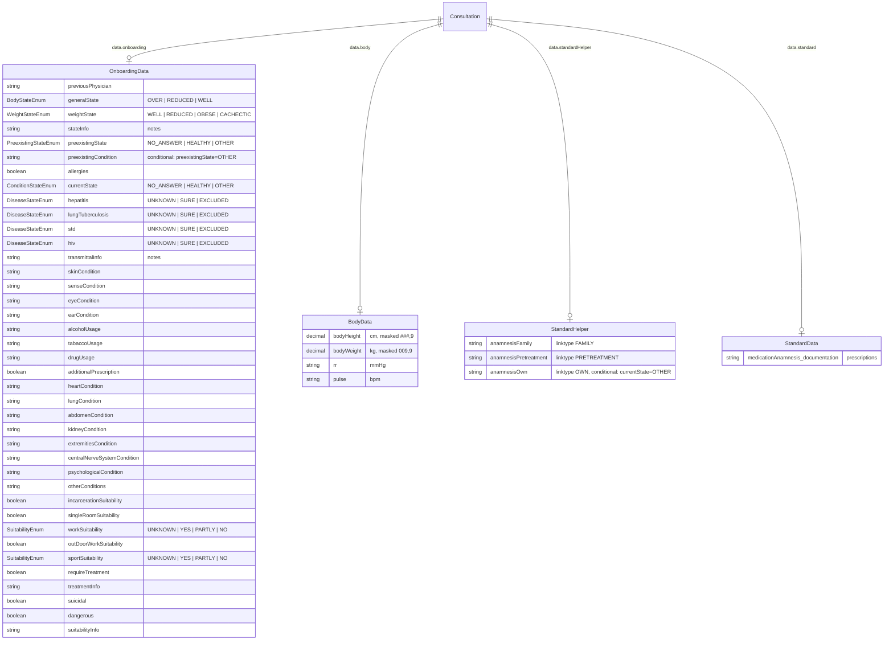

# 04 - Consultation Details: Onboarding Forms (Full + Short)

> **Source files analysed**
> - `consultation/detailDataOnboarding.html` (276 lines) -- Full onboarding form (type `ONBOARDING`)
> - `consultation/detailDataOnboardingShort.html` (79 lines) -- Short onboarding form (type `ONBOARDING_SHORT`)

---

## 1. Block: Full Onboarding Form (`ONBOARDING`)

This is the comprehensive medical intake form used when a patient is onboarded. It is rendered as a partial inside the consultation details dialog when `consultation.type === 'ONBOARDING'`.

### 1.1 Layout Structure

The form is split into **two rows**:

**Row 1 -- Medical History & Examination** (12 columns, wrapping)

| Column span | Section content |
|---|---|
| `col-md-4` | Family history (textarea) |
| `col-md-4` | Previous physician (input + pretreatment notes textarea) |
| `col-md-2` | Physical findings: height, weight, blood pressure, pulse |
| `col-md-2` | General state select + weight state select + state notes |
| `col-md-4` | Preexisting conditions select + conditional textarea + allergies |
| `col-md-4` | Current health state select + conditional textarea |
| `col-md-4` | Infectious diseases (Hepatitis, TBC, STD, HIV selects + notes) |
| `col-md-4` | Skin condition (textarea) |
| `col-md-4` | Head/Neck: sensory organs, eyes, ears (inputs) |
| `col-md-4` | Alcohol consumption (textarea) |
| `col-md-4` | Tobacco consumption (textarea) |
| `col-md-4` | Drug usage (textarea) |
| `col-md-4` | Prescriptions textarea + additional prescription boolean |
| `col-md-4` | Heart condition (textarea) |
| `col-md-4` | Lung condition (textarea) |
| `col-md-4` | Abdomen condition (textarea) |
| `col-md-4` | Kidney condition (textarea) |
| `col-md-4` | Extremities condition (textarea) |
| `col-md-4` | Central nervous system condition (textarea) |
| `col-md-4` | Psychological condition (textarea) |
| `col-md-4` | Other conditions (textarea) |

**Row 2 -- Evaluation** (section title `{{i18n.consultation.onboarding.evaluation}}`)

| Column span | Section content |
|---|---|
| `col-md-5` | Incarceration suitability, single room suitability, work suitability, outdoor work suitability, sport suitability |
| `col-md-7` | Requires treatment + treatment info, suicidal, dangerous |
| `col-md-12` | Suitability info (full-width textarea with `*` marker) |

### 1.2 Form Elements Table (Full Onboarding)

| # | Label (i18n key) | Data binding (`name=`) | Type | Required | Conditional | Notes |
|---|---|---|---|---|---|---|
| 1 | `OnboardingData.familyInfo` | `data.standardHelper.anamnesisFamily` | textarea | Yes | -- | CSS class `anamnesisLink`, `data-linktype="FAMILY"` |
| 2 | `OnboardingData.previousPhysician` | `data.onboarding.previousPhysician` | text input | Yes | -- | Placeholder: `label.name` |
| 3 | *(under previous physician)* | `data.standardHelper.anamnesisPretreatment` | textarea | No | -- | CSS class `anamnesisLink`, `data-linktype="PRETREATMENT"`, placeholder `OnboardingData.notes` |
| 4 | `OnboardingData.physicalFindings` (section) | `data.body.bodyHeight` | number input | Yes | -- | Masked `###,9`, unit `cm`, icon `fa-ruler-vertical` |
| 5 | *(under physical findings)* | `data.body.bodyWeight` | number input | Yes | -- | Masked `009,9`, unit `kg`, icon `fa-weight` |
| 6 | `OnboardingData.rr` | `data.body.rr` | text input | Yes | -- | Unit `mmHg` |
| 7 | `OnboardingData.pulse` | `data.body.pulse` | text input | Yes | -- | Unit `bpm` |
| 8 | `OnboardingData.generalState` | `data.onboarding.generalState` | select | Yes | -- | Options: `OVER`, `REDUCED`, `WELL` (enum `BodyState`) |
| 9 | `OnboardingData.weightState` | `data.onboarding.weightState` | select | Yes | -- | Options: `WELL`, `REDUCED`, `OBESE`, `CACHECTIC` (enum `WeightState`) |
| 10 | *(state notes)* | `data.onboarding.stateInfo` | textarea | No | -- | Placeholder `OnboardingData.notes` |
| 11 | `OnboardingData.preexistingState` | `data.onboarding.preexistingState` | select | Yes | -- | Options: `NO_ANSWER`, `HEALTHY`, `OTHER`. ID `preexistingState` |
| 12 | *(preexisting detail)* | `data.onboarding.preexistingCondition` | textarea | No | `#preexistingState === 'OTHER'` | Placeholder `OnboardingData.preexistingCondition`, class `conditional` |
| 13 | `OnboardingData.allergies` | `data.onboarding.allergies` | boolean select | Yes | -- | Options: `-`, Yes, No |
| 14 | `OnboardingData.currentState` | `data.onboarding.currentState` | select | Yes | -- | Options: `NO_ANSWER`, `HEALTHY`, `OTHER` (enum `ConditionState`). ID `currentState` |
| 15 | *(current state detail)* | `data.standardHelper.anamnesisOwn` | textarea | No | `#currentState === 'OTHER'` | Class `conditional anamnesisLink`, `data-linktype="OWN"`, placeholder `OnboardingData.currentCondition` |
| 16 | `OnboardingData.infectiousDiseases` (section) | -- | label | -- | -- | Section label only |
| 17 | `OnboardingData.hepatitis` | `data.onboarding.hepatitis` | select | Yes | -- | Options: `-`, `UNKNOWN`, `SURE`, `EXCLUDED` (enum `DiseaseState`) |
| 18 | `OnboardingData.lungTuberculosis` | `data.onboarding.lungTuberculosis` | select | Yes | -- | Same options as hepatitis |
| 19 | `OnboardingData.std` | `data.onboarding.std` | select | Yes | -- | Same options as hepatitis |
| 20 | `OnboardingData.hiv` | `data.onboarding.hiv` | select | Yes | -- | Same options as hepatitis |
| 21 | *(infectious diseases notes)* | `data.onboarding.transmittalInfo` | textarea | No | -- | Placeholder `OnboardingData.notes` |
| 22 | `OnboardingData.skinCondition` | `data.onboarding.skinCondition` | textarea | Yes | -- | -- |
| 23 | `consultation.headNeckLabel` (section) | -- | label | -- | -- | Section label only |
| 24 | `OnboardingData.senseCondition` | `data.onboarding.senseCondition` | text input | Yes | -- | -- |
| 25 | `OnboardingData.eyeCondition` | `data.onboarding.eyeCondition` | text input | Yes | -- | -- |
| 26 | `OnboardingData.earCondition` | `data.onboarding.earCondition` | text input | Yes | -- | -- |
| 27 | `OnboardingData.alcoholUsage` | `data.onboarding.alcoholUsage` | textarea | Yes | -- | -- |
| 28 | `OnboardingData.tabaccoUsage` | `data.onboarding.tabaccoUsage` | textarea | Yes | -- | Note: typo in original (tabacco vs tobacco) |
| 29 | `OnboardingData.drugUsage` | `data.onboarding.drugUsage` | textarea | Yes | -- | -- |
| 30 | `OnboardingData.prescriptions` | `data.standard.medicationAnamnesis.documentation` | textarea | Yes | -- | ID `standardMedicationAnamnesis` |
| 31 | `OnboardingData.additionalPrescription` | `data.onboarding.additionalPrescription` | boolean select | Yes | -- | Options: `-`, Yes, No |
| 32 | `OnboardingData.heartCondition` | `data.onboarding.heartCondition` | textarea | Yes | -- | -- |
| 33 | `OnboardingData.lungCondition` | `data.onboarding.lungCondition` | textarea | Yes | -- | -- |
| 34 | `OnboardingData.abdomenCondition` | `data.onboarding.abdomenCondition` | textarea | Yes | -- | -- |
| 35 | `OnboardingData.kidneyCondition` | `data.onboarding.kidneyCondition` | textarea | Yes | -- | -- |
| 36 | `OnboardingData.extremitiesCondition` | `data.onboarding.extremitiesCondition` | textarea | Yes | -- | -- |
| 37 | `OnboardingData.centralNerveSystemCondition` | `data.onboarding.centralNerveSystemCondition` | textarea | Yes | -- | -- |
| 38 | `OnboardingData.psychologicalCondition` | `data.onboarding.psychologicalCondition` | textarea | Yes | -- | -- |
| 39 | `OnboardingData.otherConditions` | `data.onboarding.otherConditions` | textarea | Yes | -- | -- |
| 40 | `consultation.onboarding.evaluation` | -- | `<h6>` section title | -- | -- | Begins evaluation row |
| 41 | `OnboardingData.incarcerationSuitability` | `data.onboarding.incarcerationSuitability` | boolean select | Yes | -- | Options: `-`, Yes, No |
| 42 | `OnboardingData.singleRoomSuitability` | `data.onboarding.singleRoomSuitability` | boolean select | Yes | -- | Options: `-`, Yes, No |
| 43 | `OnboardingData.workSuitability` | `data.onboarding.workSuitability` | select | Yes | -- | Options: `UNKNOWN`, `YES`, `PARTLY`, `NO` (enum `Suitability`). ID `workSuitability` |
| 44 | `OnboardingData.outDoorWorkSuitability` | `data.onboarding.outDoorWorkSuitability` | boolean select | Yes | -- | Options: `-`, Yes, No. ID `outDoorWorkSuitability` |
| 45 | `OnboardingData.sportSuitability` | `data.onboarding.sportSuitability` | select | Yes | -- | Options: `UNKNOWN`, `YES`, `PARTLY`, `NO` (enum `Suitability`). ID `sportSuitability` |
| 46 | `OnboardingData.requireTreatment` | `data.onboarding.requireTreatment` | boolean select | Yes | -- | Options: `-`, Yes, No |
| 47 | *(treatment info)* | `data.onboarding.treatmentInfo` | textarea | No | -- | Placeholder `OnboardingData.treatmentInfo` |
| 48 | `OnboardingData.suicidal` | `data.onboarding.suicidal` | boolean select | Yes | -- | Options: `-`, Yes, No |
| 49 | `OnboardingData.dangerous` | `data.onboarding.dangerous` | boolean select | Yes | -- | Options: `-`, Yes, No |
| 50 | *(suitability info)* | `data.onboarding.suitabilityInfo` | textarea | No | -- | Placeholder `OnboardingData.suitabilityInfo`, preceded by `*` marker. ID `suitabilityInfo` |

---

## 2. Block: Short Onboarding Form (`ONBOARDING_SHORT`)

This is a condensed version of the onboarding form. It includes only the state assessment selects and the full evaluation section. There is no medical history, physical findings, examination, infectious diseases, or organ-by-organ review.

### 2.1 Layout Structure

A single row with three columns:

| Column span | Section content |
|---|---|
| `col-md-2` | General state select + weight state select |
| `col-md-4` | Evaluation label + suitability selects (incarceration, single room, work, outdoor, sport) |
| `col-md-6` | Requires treatment + treatment info, suicidal, dangerous, suitability info |

### 2.2 Form Elements Table (Short Onboarding)

| # | Label (i18n key) | Data binding (`name=`) | Type | Required | Notes |
|---|---|---|---|---|---|
| 1 | `OnboardingData.generalState` | `data.onboarding.generalState` | select | Yes | Options: `OVER`, `REDUCED`, `WELL` (enum `BodyState`) |
| 2 | `OnboardingData.weightState` | `data.onboarding.weightState` | select | Yes | Options: `WELL`, `REDUCED`, `OBESE`, `CACHECTIC` (enum `WeightState`) |
| 3 | `consultation.onboarding.evaluation` | -- | label (section title) | -- | Used as `<label>` not `<h6>` unlike full form |
| 4 | `OnboardingData.incarcerationSuitability` | `data.onboarding.incarcerationSuitability` | boolean select | Yes | Options: `-`, Yes, No |
| 5 | `OnboardingData.singleRoomSuitability` | `data.onboarding.singleRoomSuitability` | boolean select | Yes | Options: `-`, Yes, No |
| 6 | `OnboardingData.workSuitability` | `data.onboarding.workSuitability` | select | Yes | Options: `UNKNOWN`, `YES`, `PARTLY`, `NO` (enum `Suitability`) |
| 7 | `OnboardingData.outDoorWorkSuitability` | `data.onboarding.outDoorWorkSuitability` | boolean select | Yes | Options: `-`, Yes, No |
| 8 | `OnboardingData.sportSuitability` | `data.onboarding.sportSuitability` | select | Yes | Options: `UNKNOWN`, `YES`, `PARTLY`, `NO` (enum `Suitability`) |
| 9 | `OnboardingData.requireTreatment` | `data.onboarding.requireTreatment` | boolean select | Yes | Options: `-`, Yes, No |
| 10 | *(treatment info)* | `data.onboarding.treatmentInfo` | textarea | No | Placeholder `OnboardingData.treatmentInfo` |
| 11 | `OnboardingData.suicidal` | `data.onboarding.suicidal` | boolean select | Yes | Options: `-`, Yes, No |
| 12 | `OnboardingData.dangerous` | `data.onboarding.dangerous` | boolean select | Yes | Options: `-`, Yes, No |
| 13 | *(suitability info)* | `data.onboarding.suitabilityInfo` | textarea | No | Placeholder `OnboardingData.suitabilityInfo` |

---

## 3. Differences Between Full and Short Forms

The short form is a strict **subset** of the full form. It retains only the assessment/evaluation fields.

### Fields present in Full but absent in Short

| Category | Fields removed in short form |
|---|---|
| **Family history** | `data.standardHelper.anamnesisFamily` |
| **Previous physician** | `data.onboarding.previousPhysician`, `data.standardHelper.anamnesisPretreatment` |
| **Physical findings** | `data.body.bodyHeight`, `data.body.bodyWeight`, `data.body.rr`, `data.body.pulse` |
| **State notes** | `data.onboarding.stateInfo` |
| **Preexisting conditions** | `data.onboarding.preexistingState`, `data.onboarding.preexistingCondition` |
| **Allergies** | `data.onboarding.allergies` |
| **Current health state** | `data.onboarding.currentState`, `data.standardHelper.anamnesisOwn` |
| **Infectious diseases** | `data.onboarding.hepatitis`, `data.onboarding.lungTuberculosis`, `data.onboarding.std`, `data.onboarding.hiv`, `data.onboarding.transmittalInfo` |
| **Skin** | `data.onboarding.skinCondition` |
| **Head/Neck** | `data.onboarding.senseCondition`, `data.onboarding.eyeCondition`, `data.onboarding.earCondition` |
| **Substance use** | `data.onboarding.alcoholUsage`, `data.onboarding.tabaccoUsage`, `data.onboarding.drugUsage` |
| **Medications** | `data.standard.medicationAnamnesis.documentation`, `data.onboarding.additionalPrescription` |
| **Organ systems** | `data.onboarding.heartCondition`, `data.onboarding.lungCondition`, `data.onboarding.abdomenCondition`, `data.onboarding.kidneyCondition`, `data.onboarding.extremitiesCondition`, `data.onboarding.centralNerveSystemCondition`, `data.onboarding.psychologicalCondition`, `data.onboarding.otherConditions` |

### Fields shared between Full and Short

Both forms share exactly these 13 fields:
- `data.onboarding.generalState`
- `data.onboarding.weightState`
- `data.onboarding.incarcerationSuitability`
- `data.onboarding.singleRoomSuitability`
- `data.onboarding.workSuitability`
- `data.onboarding.outDoorWorkSuitability`
- `data.onboarding.sportSuitability`
- `data.onboarding.requireTreatment`
- `data.onboarding.treatmentInfo`
- `data.onboarding.suicidal`
- `data.onboarding.dangerous`
- `data.onboarding.suitabilityInfo`

### Minor layout differences

- In the full form, `consultation.onboarding.evaluation` is rendered as an `<h6>` section title spanning `col-md-12`. In the short form it is rendered as a `<label>` inline with the suitability selects.
- The full form evaluation splits into `col-md-5` + `col-md-7` + `col-md-12`. The short form uses `col-md-4` + `col-md-6`.
- The full form suitability info textarea has a leading `*` marker in a span; the short form has it as a plain textarea.

---

## 4. Conditional Visibility Rules

Both conditional rules exist **only in the full form**.

| Condition expression | Target field | Behavior |
|---|---|---|
| `#preexistingState === 'OTHER'` | `data.onboarding.preexistingCondition` | Show the "allegedly suffering from" textarea only when preexisting state is `OTHER` |
| `#currentState === 'OTHER'` | `data.standardHelper.anamnesisOwn` | Show the "current condition details" textarea only when current state is `OTHER` |

**Implementation**: Both use the CSS class `conditional` with a `data-condition` attribute. This is evaluated by the legacy `conditionize2` jQuery plugin which shows/hides the element based on the referenced form element's value.

**React equivalent**: Use a watched form value (e.g. `react-hook-form` `watch` or Zod-driven state) to conditionally render or show/hide these textareas.

---

## 5. Special Behaviors

### 5.1 Anamnesis Link Fields

Several fields have the class `anamnesisLink` with a `data-linktype` attribute. These fields are linked to a shared anamnesis system:

| Field binding | Link type | Purpose |
|---|---|---|
| `data.standardHelper.anamnesisFamily` | `FAMILY` | Family medical history, linked to patient's anamnesis record |
| `data.standardHelper.anamnesisPretreatment` | `PRETREATMENT` | Previous treatment history |
| `data.standardHelper.anamnesisOwn` | `OWN` | Patient's own health statement |

These bind to `data.standardHelper.*` rather than `data.onboarding.*`, indicating shared data across consultation types.

### 5.2 Medication Anamnesis

The prescriptions field (`data.standard.medicationAnamnesis.documentation`) binds to `data.standard.*`, another shared namespace, suggesting medications are part of a standard consultation model reused across types.

### 5.3 Input Masks

| Field | Mask | Description |
|---|---|---|
| `data.body.bodyHeight` | `###,9` | Up to 3 digits, comma, 1 decimal (e.g. `180,5`) |
| `data.body.bodyWeight` | `009,9` | Up to 3 digits, comma, 1 decimal (e.g. `85,3`) |

Note: German number format uses comma as decimal separator.

---

## 6. Translation Table

### 6.1 Field Labels

| i18n Key | DE (German) | EN (English) |
|---|---|---|
| `OnboardingData.familyInfo` | Familieanamnese | Family history |
| `OnboardingData.previousPhysician` | Name zuletzt behandelnder Arzt (Krankenhaus) | Name of last attending physician (hospital) |
| `OnboardingData.notes` | Notizen | Notes |
| `OnboardingData.physicalFindings` | Koerperlicher Befund | Physical findings |
| `OnboardingData.rr` | RR. | RR. |
| `OnboardingData.pulse` | Puls | Puls |
| `OnboardingData.generalState` | Allgemeinzustand | General condition |
| `OnboardingData.weightState` | Ernaehrungszustand | Nutritional status |
| `OnboardingData.preexistingState` | Angaben ueber fruehere Erkrankungen | Information on previous illnesses |
| `OnboardingData.preexistingCondition` | Angeblich erkrankt an | Allegedly suffering from |
| `OnboardingData.allergies` | Allergien | Allergies |
| `OnboardingData.currentState` | Angaben ueber den gegenwaertigen Gesundheitszustand | Information on the current state of health |
| `OnboardingData.currentCondition` | Angeblich erkrankt an | Allegedly suffering from |
| `OnboardingData.infectiousDiseases` | Angaben ueber ansteckende Krankheiten | Information on infectious diseases |
| `OnboardingData.hepatitis` | Hepatitis | Hepatitis |
| `OnboardingData.lungTuberculosis` | Lungentuberkulose | Pulmonary tuberculosis |
| `OnboardingData.std` | Geschlechtskrankheiten | Venereal diseases |
| `OnboardingData.hiv` | HIV | HIV |
| `OnboardingData.skinCondition` | Haut | Skin |
| `OnboardingData.senseCondition` | Sinnesorgane | Sensory organs |
| `OnboardingData.eyeCondition` | Augen | Eyes |
| `OnboardingData.earCondition` | Ohren | Ears |
| `OnboardingData.alcoholUsage` | Alkoholkonsum | Alcohol consumption |
| `OnboardingData.tabaccoUsage` | Tabakkonsum | Tobacco consumption |
| `OnboardingData.drugUsage` | Drogen | Drugs |
| `OnboardingData.prescriptions` | Medikamente (Anamnese) | Medication (medical history) |
| `OnboardingData.additionalPrescription` | Medikation Verordnung | Medication prescription |
| `OnboardingData.heartCondition` | Herz | Heart |
| `OnboardingData.lungCondition` | Lunge | Lungs |
| `OnboardingData.abdomenCondition` | Abdomen | Abdomen |
| `OnboardingData.kidneyCondition` | Nieren und Geschlechtsorgane | Kidneys and reproductive organs |
| `OnboardingData.extremitiesCondition` | Extremitaeten | Extremities |
| `OnboardingData.centralNerveSystemCondition` | Zentralnervensystem | Central nervous system |
| `OnboardingData.psychologicalCondition` | Psyche | Psyche |
| `OnboardingData.otherConditions` | weitere Befunde | Further findings |
| `OnboardingData.incarcerationSuitability` | Vollzugstauglich | Suitable for implementation |
| `OnboardingData.singleRoomSuitability` | Bedenken gegen Einzelunterbringung | Concerns about individual accommodation |
| `OnboardingData.workSuitability` | Arbeitsfaehig | Able to work |
| `OnboardingData.outDoorWorkSuitability` | Aussenarbeitsfaehig | Able to work outdoors |
| `OnboardingData.sportSuitability` | Sporttauglich | Suitable for sports |
| `OnboardingData.requireTreatment` | Aerztlicher Behandlung beduerftig | Requires medical treatment |
| `OnboardingData.treatmentInfo` | Informationen | Information about |
| `OnboardingData.suicidal` | Anzeichen fuer Suizidgefaehrdung | Signs of suicidal tendencies |
| `OnboardingData.dangerous` | Besondere Massnahmen wegen Gefahr fuer andere erforderlich | Special measures required due to danger to others |
| `OnboardingData.suitabilityInfo` | *Bemerkung | *Note |
| `OnboardingData.stateInfo` | Notizen | *(missing in EN, fallback: Notes)* |
| `OnboardingData.transmittalInfo` | Notizen | *(missing in EN, fallback: Notes)* |
| `consultation.headNeckLabel` | Kopf/Hals | *(missing in EN, fallback: Head/Neck)* |
| `consultation.onboarding.evaluation` | Beurteilung | Evaluation |

### 6.2 Enum Values

#### BodyState (General State)

| Value | DE | EN |
|---|---|---|
| `OVER` | schlecht | obese |
| `REDUCED` | reduziert | reduced |
| `WELL` | gut | Well |

#### WeightState (Nutritional Status)

| Value | DE | EN |
|---|---|---|
| `WELL` | gut | well |
| `REDUCED` | reduziert | reduced |
| `OBESE` | adipoes | obese |
| `CACHECTIC` | kachektisch | cachectic |

#### Suitability (Work/Sport)

| Value | DE | EN |
|---|---|---|
| `UNKNOWN` | unbekannt | *(missing -- infer: unknown)* |
| `YES` | ja | *(missing -- infer: yes)* |
| `PARTLY` | eingeschraenkt *) | *(missing -- infer: partly)* |
| `NO` | nein | *(missing -- infer: no)* |

> Note: The EN properties file has `OnboardingData.Suitability.NO` and `OnboardingData.Suitability.PARTLY` as separate keys but the template references `Suitability.*` directly.

#### DiseaseState (Infectious Diseases)

| Value | DE | EN |
|---|---|---|
| `UNKNOWN` | nicht bekannt | unknown |
| `SURE` | gesichert | sure |
| `EXCLUDED` | ausgeschlossen | excluded |

> Note: EN file uses lowercase keys (`consultation.diseaseState.unknown`) while DE uses uppercase (`consultation.diseaseState.UNKNOWN`). Template references uppercase. Verify case sensitivity in i18n resolution.

#### ConditionState (Current/Preexisting)

| Value | DE | EN |
|---|---|---|
| `NO_ANSWER` | Keine Angaben | No Answer |
| `HEALTHY` | Gesund | Healthy |
| `OTHER` | Angeblich erkrankt an | Other illness |

#### PreexistingState (specific overrides for preexisting conditions select)

| Value | DE | EN |
|---|---|---|
| `NO_ANSWER` | Keine Angaben | No Answer |
| `HEALTHY` | Angeblich nicht krank gewesen | Allegedly not having been ill |
| `OTHER` | Angeblich erkrankt an | Other Illnes *(sic -- typo in EN)* |

#### Boolean Selects

| Value | DE | EN |
|---|---|---|
| *(empty)* | `-` | `-` |
| `true` | Ja | Yes |
| `false` | Nein | No |

### 6.3 Hardcoded Strings

| String | Location | Notes |
|---|---|---|
| `cm` | Body height unit suffix | Not translated, hardcoded in HTML |
| `kg` | Body weight unit suffix | Not translated, hardcoded in HTML |
| `mmHg` | Blood pressure unit suffix | Not translated, hardcoded in HTML |
| `bpm` | Pulse unit suffix | Not translated, hardcoded in HTML |
| `*` | Suitability info prefix | Hardcoded asterisk marker in span |
| `-` | Boolean select empty option | Hardcoded dash as placeholder |

---

## 7. Data Model Diagram



---

## 8. Implementation Notes for React/Shadcn

### 8.1 Form Architecture

- Use a single shared React component that accepts a `variant` prop (`'full' | 'short'`) to render either form.
- The short form fields are a strict subset, so conditionally render the extra sections based on variant.
- Use `react-hook-form` with a Zod schema. The schema should have optional fields for the full-only sections, validated conditionally based on variant.

### 8.2 Conditional Fields

Replace `conditionize2` jQuery logic with `react-hook-form` `watch`:

```tsx
const preexistingState = watch('onboarding.preexistingState');
const currentState = watch('onboarding.currentState');
// Render preexistingCondition textarea only when preexistingState === 'OTHER'
// Render anamnesisOwn textarea only when currentState === 'OTHER'
```

### 8.3 Boolean Selects

Many fields use a tri-state boolean select (`null | true | false`). Create a reusable `BooleanSelect` component mapping `""` to `null`, `"true"` to `true`, `"false"` to `false`.

### 8.4 Enum Selects

Group the enums:
- `BodyState`: `OVER`, `REDUCED`, `WELL`
- `WeightState`: `WELL`, `REDUCED`, `OBESE`, `CACHECTIC`
- `Suitability`: `UNKNOWN`, `YES`, `PARTLY`, `NO`
- `DiseaseState`: `UNKNOWN`, `SURE`, `EXCLUDED`
- `ConditionState` / `PreexistingState`: `NO_ANSWER`, `HEALTHY`, `OTHER`

### 8.5 Anamnesis Link System

The `anamnesisLink` class with `data-linktype` suggests these fields are bidirectionally synced with a patient anamnesis record. The React implementation needs to:
1. Determine if anamnesis data is pre-populated from the patient record.
2. Decide if edits propagate back to the patient record or stay local to the consultation.

### 8.6 Input Masks

Replace `data-mask` with a React input mask library (e.g. `react-input-mask` or `react-number-format`) for `bodyHeight` and `bodyWeight`. Use German locale comma-decimal formatting.

### 8.7 Responsive Layout

The original uses Bootstrap grid (`col-md-*`). Map to Tailwind CSS grid or flexbox. The full form has many `col-md-4` (1/3 width) blocks which naturally form a 3-column grid on desktop, stacking on mobile.
