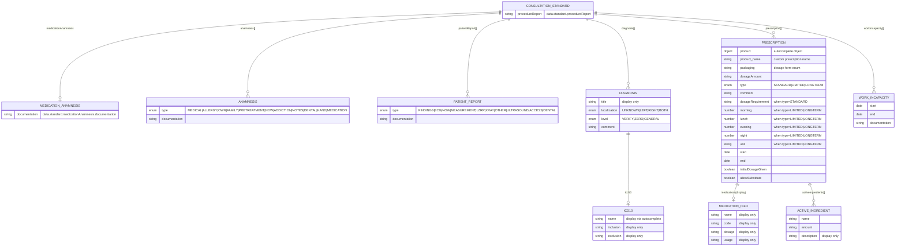

# 03 - Standard Consultation Detail Data Form

**Source**: `videoclinic-prod/web/src/main/webapp/consultation/detailDataStandard.html` (317 lines)

**Context**: This is a partial HTML template included inside the consultation details dialog. It renders the form fields specific to consultation type `STANDARD`. The form is divided into five major blocks: Medication Anamnesis, Anamnesis Collection, Patient Report Collection, Diagnosis (ICD-10) Collection, Prescription (Medication) Collection, Work Incapacity Collection, and Procedere Report.

**Visibility gate**: Three outer `
` wrappers carry class `incarceration-hide`, meaning the Medication Anamnesis + Anamnesis + Patient Report row (lines 1-96), the Prescription block (lines 148-288), and the Work Incapacity + Procedere block (lines 290-318) are hidden when the consultation is in incarceration mode.

---

## 1. Block: Medication Anamnesis (col-md-4)

Section title: `{{i18n.AnamnesisType.MEDICATION}}` ("Medication history")

### Form Elements

| # | Text-Reference / Name | Symbol | Datamodel | Type | Options | Placeholder | Default | Required | Read-only | Condition/Permission |
|---|----------------------|--------|-----------|------|---------|-------------|---------|----------|-----------|---------------------|
| 1 | AnamnesisType.MEDICATION (section heading) | `<h6>` | -- | section-title | -- | -- | -- | -- | -- | `incarceration-hide` |
| 2 | -- | `<textarea>` | `data.standard.medicationAnamnesis.documentation` | textarea | -- | -- | -- | Yes (`class="required"`) | No | `incarceration-hide`; linked to `#standardMedicationAnamnesis` via `class="linked"` |

---

## 2. Block: Anamnesis Collection (col-md-4)

Section title: `{{i18n.consultation.anamnesis}}` ("AA/Anamnese")

### Collection: `data.standard.anamnesis`

Repeater container: `
`

Each repeater item contains:

| # | Text-Reference / Name | Symbol | Datamodel | Type | Options | Placeholder | Default | Required | Read-only | Condition/Permission |
|---|----------------------|--------|-----------|------|---------|-------------|---------|----------|-----------|---------------------|
| 1 | anamnesis type selector | `<select>` | `anamnesis.type` | select (readonly) | `""` = patientReport, `MEDICAL`, `ALLERGY`, `OWN`, `FAMILY`, `PRETREATMENT`, `NOW`, `ADDICTION`, `NOTES`, `DENTAL`, `HAND` | -- | `""` | No | Yes (`readonly`) | -- |
| 2 | Delete action | `` | -- | action-button | -- | -- | -- | -- | -- | -- |
| 3 | Documentation | `<textarea>` | `anamnesis.documentation` | textarea | -- | `{{i18n.consultation.details.letters}}` | -- | Yes (`class="required"`) | No | -- |

**Insert control** (add new anamnesis item):

| # | Text-Reference / Name | Symbol | Datamodel | Type | Options | Placeholder | Default | Required | Read-only | Condition/Permission |
|---|----------------------|--------|-----------|------|---------|-------------|---------|----------|-----------|---------------------|
| 1 | Insert type selector | `<select>` | inserts into `data.standard.anamnesis` | select (`class="insert insertType insert-required"`) | `""` = anamnesis (placeholder), `MEDICAL`, `ALLERGY`, `DENTAL`, `OWN`, `FAMILY`, `HAND`, `NOW`, `MEDICATION`, `NOTES`, `ADDICTION`, `PRETREATMENT` | -- | -- | Yes (insert-required) | No | -- |

**Note**: The insert dropdown includes `MEDICATION` which is not in the readonly display dropdown. The order of options also differs between the display and insert selects.

### Anamnesis Type Enum Values

| Value | i18n Key | DE | EN |
|-------|----------|----|----|
| _(empty)_ | `consultation.patientReport` | AB/Aktueller Befund | ab/actual report |
| `MEDICAL` | `AnamnesisType.MEDICAL` | Anamnese | Anamnesis |
| `ALLERGY` | `AnamnesisType.ALLERGY` | Allergieanamnese | Allergy |
| `OWN` | `AnamnesisType.OWN` | Eigen Anamnese | Personal medical history |
| `FAMILY` | `AnamnesisType.FAMILY` | Familienanamnese | Family history |
| `PRETREATMENT` | `AnamnesisType.PRETREATMENT` | Vorbehandelnde Aerzte / Krankenhaeuser | Previous treating doctors/hospitals |
| `NOW` | `AnamnesisType.NOW` | Jetztanamnese | Current medical history |
| `ADDICTION` | `AnamnesisType.ADDICTION` | Suchtanamnese | Addiction |
| `NOTES` | `AnamnesisType.NOTES` | Notizen | Notes |
| `DENTAL` | `AnamnesisType.DENTAL` | Dentalanamnese | Dental anamnesis |
| `HAND` | `AnamnesisType.HAND` | Handakte | Reference file |
| `MEDICATION` | `AnamnesisType.MEDICATION` | Medikamentenanamnese | Medication history |

---

## 3. Block: Patient Report Collection (col-md-4)

Section title: `{{i18n.consultation.patientReport}}` ("AB/Aktueller Befund")

### Collection: `data.standard.patientReport`

Repeater container: `
`

Each repeater item contains:

| # | Text-Reference / Name | Symbol | Datamodel | Type | Options | Placeholder | Default | Required | Read-only | Condition/Permission |
|---|----------------------|--------|-----------|------|---------|-------------|---------|----------|-----------|---------------------|
| 1 | Report type selector | `<select>` | `patientReport.type` | select (readonly) | `""` = patientReport, `FINDINGS`, `ECG`, `NOW`, `MEASUREMENT`, `LZRR`, `XRAY`, `OTHER`, `ULTRASOUND`, `ACCESS`, `DENTAL` | -- | `""` | No | Yes (`readonly`) | -- |
| 2 | Delete action | `` | -- | action-button | -- | -- | -- | -- | -- | -- |
| 3 | Documentation | `<textarea>` | `patientReport.documentation` | textarea | -- | `{{i18n.consultation.details.letters}}` | -- | Yes (`class="required"`) | No | -- |

**Insert control**:

| # | Text-Reference / Name | Symbol | Datamodel | Type | Options | Placeholder | Default | Required | Read-only | Condition/Permission |
|---|----------------------|--------|-----------|------|---------|-------------|---------|----------|-----------|---------------------|
| 1 | Insert type selector | `<select>` | inserts into `data.standard.patientReport` | select (`class="insert insertType insert-required"`) | `""` = patientReport, `FINDINGS`, `MEASUREMENT`, `ECG`, `NOW`, `LZRR`, `XRAY`, `OTHER`, `ULTRASOUND`, `ACCESS`, `DENTAL` | -- | -- | Yes (insert-required) | No | -- |

### Patient Report Type Enum Values

| Value | i18n Key | DE | EN |
|-------|----------|----|----|
| _(empty)_ | `consultation.patientReport` | AB/Aktueller Befund | ab/actual report |
| `FINDINGS` | `PatientReportType.FINDINGS` | Befund | **MISSING in EN** (fallback: DE) |
| `ECG` | `PatientReportType.ECG` | Befund EKG | **MISSING in EN** |
| `NOW` | `PatientReportType.NOW` | Befund Jetzt | **MISSING in EN** |
| `MEASUREMENT` | `PatientReportType.MEASUREMENT` | Befund Einfache Messung | **MISSING in EN** |
| `LZRR` | `PatientReportType.LZRR` | Befund LZRR | **MISSING in EN** |
| `XRAY` | `PatientReportType.XRAY` | Befund Roentgen | **MISSING in EN** |
| `OTHER` | `PatientReportType.OTHER` | Befund sonstiges | Other |
| `ULTRASOUND` | `PatientReportType.ULTRASOUND` | Befund Utraschall | **MISSING in EN** |
| `ACCESS` | `PatientReportType.ACCESS` | Befund Zugang | **MISSING in EN** |
| `DENTAL` | `PatientReportType.DENTAL` | Dentalbefund | **MISSING in EN** |

> **Warning**: Only `PatientReportType.OTHER` has an EN translation. All other PatientReportType values are missing from the EN properties file.

---

## 4. Block: Diagnosis / ICD-10 Collection

No section heading (`<h6>`) -- this block begins directly.

### Collection: `data.standard.diagnosis`

Repeater container: `
`

Each repeater item (row with two columns):

| # | Text-Reference / Name | Symbol | Datamodel | Type | Options | Placeholder | Default | Required | Read-only | Condition/Permission |
|---|----------------------|--------|-----------|------|---------|-------------|---------|----------|-----------|---------------------|
| 1 | Localization | `<select>` | `diagnosis.localization` | select | `UNKNOWN`="", `LEFT`="L", `RIGHT`="R", `BOTH`="B" | -- | `UNKNOWN` | No | No | -- |
| 2 | Diagnostic certainty level | `<select>` | `diagnosis.level` | select (`class="mandatory"`) | `""`="-", `VERIFY`="V", `ZERO`="Z", `GENERAL`="G" | -- | `""` | Yes (`mandatory`) | No | -- |
| 3 | Delete action | `` | -- | action-button | -- | -- | -- | -- | -- | -- |
| 4 | Diagnosis title | `` | `diagnosis.title` | field-display (bold) | -- | -- | -- | -- | Yes (display only) | -- |
| 5 | ICD-10 Inclusion | `
` | `diagnosis.icd10.inclusion` | field-display (rendered) | -- | -- | -- | -- | Yes (display only) | -- |
| 6 | ICD-10 Exclusion | `
` | `diagnosis.icd10.exclusion` | field-display (rendered) | -- | -- | -- | -- | Yes (display only) | -- |
| 7 | Comment | `<textarea>` | `diagnosis.comment` | textarea | -- | `{{i18n.label.comment}}` | -- | No | No | -- |

**Insert control** (autocomplete):

| # | Text-Reference / Name | Symbol | Datamodel | Type | Options | Placeholder | Default | Required | Read-only | Condition/Permission |
|---|----------------------|--------|-----------|------|---------|-------------|---------|----------|-----------|---------------------|
| 1 | ICD-10 search | `<input class="autoselect icd10insert">` | inserts into `data.standard.diagnosis` | autocomplete (`data-service="IcdService"`, `data-method="autocomplete"`, `data-forceselect="true"`) | display: `title icd10.name` | `{{i18n.consultation.diagnosisReport}}` | -- | Yes (insert-required) | No | -- |
| 2 | ICD-10 search button | `<i id="searchIcd10Btn">` | -- | action-button | -- | -- | -- | -- | -- | Opens ICD-10 search dialog |

### Diagnosis Localization Enum

| Value | i18n Key (title) | DE | EN | Display |
|-------|-----------------|----|----|---------|
| `UNKNOWN` | `diagnosis.localization.UNKNOWN` | Unbekannt | **MISSING in EN** | _(empty)_ |
| `LEFT` | `diagnosis.localization.LEFT` | Links | **MISSING in EN** | L |
| `RIGHT` | `diagnosis.localization.RIGHT` | Rechts | **MISSING in EN** | R |
| `BOTH` | `diagnosis.localization.BOTH` | Beidseitig | **MISSING in EN** | B |

### Diagnosis Level Enum

| Value | i18n Key (title) | DE | EN | Display |
|-------|-----------------|----|----|---------|
| `""` | `diagnosis.level.NONE` | Keine | **MISSING in EN** | - |
| `VERIFY` | `diagnosis.level.VERIFY` | Verdachts-/auszuschliessende Diagnose | **MISSING in EN** | V |
| `ZERO` | `diagnosis.level.ZERO` | (symptomloser) Zustand n.b. Diagnose | **MISSING in EN** | Z |
| `GENERAL` | `diagnosis.level.GENERAL` | Gesicherte Diagnose | **MISSING in EN** | G |

> **Warning**: All `diagnosis.*` i18n keys are missing from EN properties file. Titles only exist in DE.

---

## 5. Block: Prescription / Medication Collection

No section heading -- wrapped in `
`.

### Collection: `data.standard.prescription`

Repeater container: `
`

Each repeater item is a complex multi-column row:

### Column 1 (col-md-6): Product & Active Ingredients

| # | Text-Reference / Name | Symbol | Datamodel | Type | Options | Placeholder | Default | Required | Read-only | Condition/Permission |
|---|----------------------|--------|-----------|------|---------|-------------|---------|----------|-----------|---------------------|
| 1 | Info action | `<i class="action info">` | -- | action-button | -- | -- | -- | -- | -- | -- |
| 2 | Product selector | `<select>` | `prescription.product` | select (`class="object"`) | custom-filled | -- | -- | No | No | -- |
| 3 | Product name (custom) | `<input>` | `prescription.product.name` | text (`class="customPrescription"`) | -- | **HARDCODED**: "Medikament" | -- | Yes (`mandatory`) | No | Shown via `customPrescription` class |
| 4 | Delete action | `` | -- | action-button | -- | -- | -- | -- | -- | -- |
| 5 | Packaging / dosage form | `<select>` | `prescription.packaging` | select (`class="mandatory"`) | See Packaging Enum below | **HARDCODED**: "Darreichungsform" | -- | Yes (`mandatory`) | No | -- |

#### Packaging Enum (HARDCODED German)

| Value | Display | data-check |
|-------|---------|------------|
| `""` | **Darreichungsform** (placeholder) | -- |
| `Tbl.` | Tbl. | tbl,tablette |
| `Kapsel` | Kapsel | kpsl,kapsel,kp |
| `Tropfen` | Tropfen | tr,tropfen |
| `Salbe/Creme` | Salbe/Creme | salbe,creme |
| `Gel` | Gel | gel |
| `Saft/Sirup` | Saft/Sirup | saft,sirup |
| `Supp.` | Supp. | -- |
| `mg` | mg | mg |
| `ml` | ml | ml |
| `ug` | ug | -- |
| `Infusion` | Infusion | -- |
| `i.m.` | i.m. | i.m. |
| `i.v.` | i.v. | -- |
| `sonstiges` | sonstiges | pfl |

> **HARDCODED**: All packaging values and placeholder are in German with no i18n keys.

### Nested Collection: `prescription.activeIngredients`

Label: **HARDCODED**: "Aktiver Wirkstoff"

Add button: `<i class="fa fa-plus add action customPrescription" data-field="prescription.activeIngredients">`

Each nested repeater item:

| # | Text-Reference / Name | Symbol | Datamodel | Type | Options | Placeholder | Default | Required | Read-only | Condition/Permission |
|---|----------------------|--------|-----------|------|---------|-------------|---------|----------|-----------|---------------------|
| 1 | Name (display) | `` | `activeIngredients.name` | field-display (bold) | -- | -- | -- | -- | Yes | -- |
| 2 | Amount (display) | `` | `activeIngredients.amount` | field-display | -- | -- | -- | -- | Yes | -- |
| 3 | Name (input) | `<input>` | `activeIngredients.name` | text (`class="customPrescription"`) | -- | **HARDCODED**: "Wirkstoff" | -- | Yes (`mandatory`) | No | `customPrescription` |
| 4 | Amount (input) | `<input>` | `activeIngredients.amount` | text (`class="customPrescription"`) | -- | **HARDCODED**: "Menge/Einheit" | -- | Yes (`mandatory`) | No | `customPrescription` |
| 5 | Delete action | `` | -- | action-button | -- | -- | -- | -- | -- | -- |
| 6 | Description (display) | `` | `activeIngredients.description` | field-display | -- | -- | -- | -- | Yes | -- |

### Column 2 (col-md-6): Dosage & Medication Info

| # | Text-Reference / Name | Symbol | Datamodel | Type | Options | Placeholder | Default | Required | Read-only | Condition/Permission |
|---|----------------------|--------|-----------|------|---------|-------------|---------|----------|-----------|---------------------|
| 1 | Dosage amount | `<textarea>` | `prescription.dosageAmount` | textarea | -- | `{{i18n.Prescription.dosageAmount}}` | -- | Yes (`required`) | No | -- |
| 2 | Medication name | `` | `prescription.medication.name` | field-display (bold) | -- | -- | -- | -- | Yes | -- |
| 3 | Medication code | `` | `prescription.medication.code` | field-display | -- | -- | -- | -- | Yes | -- |
| 4 | Medication dosage | `` | `prescription.medication.dosage` | field-display | -- | -- | -- | -- | Yes | -- |
| 5 | Medication usage | `` | `prescription.medication.usage` | field-display | -- | -- | -- | -- | Yes | -- |

### Column 3 (col-md-4): Prescription Type & Comment

| # | Text-Reference / Name | Symbol | Datamodel | Type | Options | Placeholder | Default | Required | Read-only | Condition/Permission |
|---|----------------------|--------|-----------|------|---------|-------------|---------|----------|-----------|---------------------|
| 1 | Prescription type | `<select>` | `prescription.type` | select (`class="mandatory required"`) | `""` = "- PrescriptionType", `STANDARD`, `LIMITED`, `LONGTERM` | -- | `""` | Yes | No | -- |
| 2 | Comment | `<input>` | `prescription.comment` | text | -- | `{{i18n.label.comment}}` | -- | No | No | -- |

### Prescription Type Enum

| Value | i18n Key | DE | EN |
|-------|----------|----|----|
| `""` | `PrescriptionType` (with "-" prefix) | -- | -- |
| `STANDARD` | `PrescriptionType.STANDARD` | Bedarfsmedikation | **MISSING in EN** |
| `LIMITED` | `PrescriptionType.LIMITED` | Begrenzte Medikation (befristet) | **MISSING in EN** |
| `LONGTERM` | `PrescriptionType.LONGTERM` | Dauermedikation | **MISSING in EN** |

### Column 4 (col-md-4): Dosage Schedule

This column has **conditional visibility** based on `prescription.type`:

#### When type = `STANDARD` (`
`)

| # | Text-Reference / Name | Symbol | Datamodel | Type | Options | Placeholder | Default | Required | Read-only | Condition/Permission |
|---|----------------------|--------|-----------|------|---------|-------------|---------|----------|-----------|---------------------|
| 1 | Dosage requirement | `<input>` | `prescription.dosageRequirement` | text | -- | `{{i18n.Prescription.dosageRequirement}}` | -- | Yes (`required`) | No | Visible when `prescription.type = STANDARD` |

#### When type = `LIMITED` or `LONGTERM` (`<table class="prescription limited longterm">`)

Dosage schedule table with morning/noon/evening/night columns:

| # | Text-Reference / Name | Symbol | Datamodel | Type | Options | Placeholder | Default | Required | Read-only | Condition/Permission |
|---|----------------------|--------|-----------|------|---------|-------------|---------|----------|-----------|---------------------|
| 1 | Morning header | `<th>` | -- | header | -- | -- | -- | -- | -- | `prescription.type` in `[LIMITED, LONGTERM]` |
| 2 | Noon header | `<th>` | -- | header | -- | -- | -- | -- | -- | same |
| 3 | Evening header | `<th>` | -- | header | -- | -- | -- | -- | -- | same |
| 4 | Night header | `<th>` | -- | header | -- | -- | -- | -- | -- | same |
| 5 | Morning dose | `<input>` | `prescription.morning` | number | -- | -- | -- | No | No | same; title=**HARDCODED** "Morgens" |
| 6 | Noon dose | `<input>` | `prescription.lunch` | number | -- | -- | -- | No | No | same; title=**HARDCODED** "Mittags" |
| 7 | Evening dose | `<input>` | `prescription.evening` | number | -- | -- | -- | No | No | same; title=**HARDCODED** "Abends" |
| 8 | Night dose | `<input>` | `prescription.night` | number | -- | -- | -- | No | No | same; title=**HARDCODED** "Nachts" |
| 9 | Unit | `<select>` | `prescription.unit` | select | See Unit Enum below | -- | `""` | No | No | same |

#### Unit Enum (HARDCODED German)

| Value | Display |
|-------|---------|
| `""` | **Einheit** (placeholder) |
| `Stueck` | Stueck |
| `IE` | IE |
| `Tropfen` | Tropfen |
| `ml` | ml |
| `mg` | mg |
| `Hinweis` | siehe Hinweis |

> **HARDCODED**: All unit values and placeholder are in German with no i18n keys.

### Column 5 (col-md-3): Dates & Checkboxes

| # | Text-Reference / Name | Symbol | Datamodel | Type | Options | Placeholder | Default | Required | Read-only | Condition/Permission |
|---|----------------------|--------|-----------|------|---------|-------------|---------|----------|-----------|---------------------|
| 1 | Start date | `<input>` | `prescription.start` | date | -- | **HARDCODED**: "Startdatum" | -- | No | No | -- |
| 2 | End date | `<input>` | `prescription.end` | date | -- | **HARDCODED**: "Enddatum" | -- | No | No | -- |
| 3 | Initial dosage given | `<input type="checkbox">` | `prescription.initialDosageGiven` | checkbox | -- | -- | unchecked | No | No | -- |
| 4 | Allow substitute | `<input type="checkbox">` | `prescription.allowSubstitute` | checkbox | -- | -- | unchecked | No | No | -- |

**Insert control** (autocomplete for new prescription):

| # | Text-Reference / Name | Symbol | Datamodel | Type | Options | Placeholder | Default | Required | Read-only | Condition/Permission |
|---|----------------------|--------|-----------|------|---------|-------------|---------|----------|-----------|---------------------|
| 1 | Medication search | `<input class="medicationInsert" id="medicationAutoSelect">` | inserts into `data.standard.prescription` | autocomplete (`data-service="ConsultationService"`, `data-method="prescription"`, `data-forceselect="true"`) | display: `medication.name` | `{{i18n.consultation.medication}}` | -- | No | No | -- |
| 2 | Medication add action | `<i id="medicationAdd">` | -- | action-button | -- | -- | -- | -- | -- | -- |
| 3 | Medication search button | `<i id="searchMedicationBtn">` | -- | action-button | -- | -- | -- | -- | -- | Opens medication search dialog |

---

## 6. Block: Work Incapacity Collection

Section title: `{{i18n.consultation.workIncapacity}}` ("Arbeitsunfaehigkeit")

### Collection: `data.standard.workIncapacity`

Add button is inline in the `<h6>`: `<i class="action fa fa-plus add" data-field="data.standard.workIncapacity">`

Repeater container: `
`

Each repeater item:

| # | Text-Reference / Name | Symbol | Datamodel | Type | Options | Placeholder | Default | Required | Read-only | Condition/Permission |
|---|----------------------|--------|-----------|------|---------|-------------|---------|----------|-----------|---------------------|
| 1 | Start date | `<input>` | `workIncapacity.start` | date | -- | **HARDCODED**: "Startdatum" | -- | No | No | `incarceration-hide` |
| 2 | End date | `<input>` | `workIncapacity.end` | date | -- | **HARDCODED**: "Enddatum" | -- | No | No | `incarceration-hide` |
| 3 | Delete action | `` | -- | action-button | -- | -- | -- | -- | -- | -- |
| 4 | Documentation | `<textarea>` | `workIncapacity.documentation` | textarea | -- | `{{i18n.consultation.workIncapacity.documentation}}` | -- | No | No | `incarceration-hide` |

---

## 7. Block: Procedere Report

No section heading -- standalone textarea at the bottom.

| # | Text-Reference / Name | Symbol | Datamodel | Type | Options | Placeholder | Default | Required | Read-only | Condition/Permission |
|---|----------------------|--------|-----------|------|---------|-------------|---------|----------|-----------|---------------------|
| 1 | Procedere report | `<textarea>` | `data.standard.procedureReport` | textarea | -- | `{{i18n.consultation.procedereReport}}` | -- | Yes (`required`) | No | `incarceration-hide` |

---

## 8. Conditional Visibility Summary

| Condition | Mechanism | Affected Elements |
|-----------|-----------|-------------------|
| Incarceration mode | CSS class `incarceration-hide` (toggled via JS on parent) | Blocks 1-3 (Medication Anamnesis, Anamnesis, Patient Report), Block 5 (Prescription), Blocks 6-7 (Work Incapacity, Procedere) |
| Prescription type = `STANDARD` | CSS class matching `.prescription.standard` | Dosage requirement text input |
| Prescription type = `LIMITED` or `LONGTERM` | CSS class matching `.prescription.limited.longterm` | Dosage schedule table (morning/noon/evening/night + unit) |
| Custom prescription mode | CSS class `customPrescription` | Product name input, active ingredients inputs (name + amount) |

---

## 9. Collections / Repeaters Summary

| Collection Path | Item Fields | Insert Mechanism | Insert Source |
|----------------|-------------|------------------|---------------|
| `data.standard.anamnesis` | `type` (select), `documentation` (textarea) | Select dropdown with `class="insert insertType"` | Type enum selection |
| `data.standard.patientReport` | `type` (select), `documentation` (textarea) | Select dropdown with `class="insert insertType"` | Type enum selection |
| `data.standard.diagnosis` | `localization`, `level`, `title` (display), `icd10.inclusion` (display), `icd10.exclusion` (display), `comment` | Autocomplete input via `IcdService.autocomplete` | ICD-10 search |
| `data.standard.prescription` | `product`, `product.name`, `packaging`, `activeIngredients[]`, `dosageAmount`, `type`, `comment`, `dosageRequirement`, `morning/lunch/evening/night`, `unit`, `start`, `end`, `initialDosageGiven`, `allowSubstitute`, `medication.*` (display) | Autocomplete input via `ConsultationService.prescription` | Medication search |
| `data.standard.prescription[].activeIngredients` | `name`, `amount`, `description` (display) | Add button (`fa-plus`) with `data-field="prescription.activeIngredients"` | Manual entry |
| `data.standard.workIncapacity` | `start` (date), `end` (date), `documentation` (textarea) | Add button (`fa-plus`) in section heading | Manual entry |

---

## 10. Translation Table

### i18n Keys Referenced in Template

| i18n Key | DE | EN | Notes |
|----------|----|----|-------|
| `AnamnesisType.MEDICATION` | Medikamentenanamnese | Medication history | Section heading |
| `consultation.anamnesis` | AA/Anamnese | AA/anamnesis | Section heading + insert placeholder |
| `consultation.patientReport` | AB/Aktueller Befund | ab/actual report | Section heading + default option |
| `consultation.details.letters` | Bitte geben Sie mindestens 50 Buchstaben ein | Please enter at least 50 letters | Textarea placeholder |
| `AnamnesisType.MEDICAL` | Anamnese | Anamnesis | |
| `AnamnesisType.ALLERGY` | Allergieanamnese | Allergy | |
| `AnamnesisType.OWN` | Eigen Anamnese | Personal medical history | |
| `AnamnesisType.FAMILY` | Familienanamnese | Family history | |
| `AnamnesisType.PRETREATMENT` | Vorbehandelnde Aerzte / Krankenhaeuser | Previous treating doctors/hospitals | |
| `AnamnesisType.NOW` | Jetztanamnese | Current medical history | |
| `AnamnesisType.ADDICTION` | Suchtanamnese | Addiction | |
| `AnamnesisType.NOTES` | Notizen | Notes | |
| `AnamnesisType.DENTAL` | Dentalanamnese | Dental anamnesis | |
| `AnamnesisType.HAND` | Handakte | Reference file | |
| `PatientReportType.FINDINGS` | Befund | **MISSING** | |
| `PatientReportType.ECG` | Befund EKG | **MISSING** | |
| `PatientReportType.NOW` | Befund Jetzt | **MISSING** | |
| `PatientReportType.MEASUREMENT` | Befund Einfache Messung | **MISSING** | |
| `PatientReportType.LZRR` | Befund LZRR | **MISSING** | |
| `PatientReportType.XRAY` | Befund Roentgen | **MISSING** | |
| `PatientReportType.OTHER` | Befund sonstiges | Other | |
| `PatientReportType.ULTRASOUND` | Befund Utraschall | **MISSING** | |
| `PatientReportType.ACCESS` | Befund Zugang | **MISSING** | |
| `PatientReportType.DENTAL` | Dentalbefund | **MISSING** | |
| `diagnosis.localization` | -- (title attribute) | **MISSING** | |
| `diagnosis.localization.UNKNOWN` | Unbekannt | **MISSING** | |
| `diagnosis.localization.LEFT` | Links | **MISSING** | |
| `diagnosis.localization.RIGHT` | Rechts | **MISSING** | |
| `diagnosis.localization.BOTH` | Beidseitig | **MISSING** | |
| `diagnosis.level` | Diagnosesicherheit | **MISSING** | |
| `diagnosis.level.NONE` | Keine | **MISSING** | |
| `diagnosis.level.VERIFY` | Verdachts-/auszuschliessende Diagnose | **MISSING** | |
| `diagnosis.level.ZERO` | (symptomloser) Zustand n.b. Diagnose | **MISSING** | |
| `diagnosis.level.GENERAL` | Gesicherte Diagnose | **MISSING** | |
| `label.comment` | **NOT FOUND** | **NOT FOUND** | Used as placeholder; likely "Kommentar" / "Comment" |
| `consultation.diagnosisReport` | AD/Aktuelle Diagnose | ad/actual diagnosis report | Autocomplete placeholder |
| `PrescriptionType` | -- | -- | Used as "- {label}" prefix |
| `PrescriptionType.STANDARD` | Bedarfsmedikation | **MISSING** | |
| `PrescriptionType.LIMITED` | Begrenzte Medikation (befristet) | **MISSING** | |
| `PrescriptionType.LONGTERM` | Dauermedikation | **MISSING** | |
| `Prescription.dosageAmount` | Dosierhinweise | Dosage Amount | |
| `Prescription.dosageRequirement` | Bedarfsregel | Dosage Requirement | |
| `Prescription.initialDosageGiven` | Erste Ausgabe erledigt | Initial Dosage Given | |
| `Prescription.allowSubstitute` | Die verordneten Praeparate koennen ... ersetzt werden | allow substitution | DE is a full sentence |
| `consultation.inTheMorning` | Morgens | In the morning | |
| `consultation.atNoon` | Mittags | At noon | |
| `consultation.inTheEvening` | Abends | In the evening | |
| `consultation.atNight` | Nachts | At night | |
| `consultation.medication` | AM/Neu Angeordnete Medikation | Medication | |
| `consultation.workIncapacity` | Arbeitsunfaehigkeit | Work Incapacity | |
| `consultation.workIncapacity.documentation` | Arbeitsunfaehigkeit Dokumentation | Work Incapacity Documentation | |
| `consultation.procedereReport` | PC / Procedere | pc / procedere | |

### Hardcoded German Strings (no i18n key)

| Location | Hardcoded String | Suggested EN |
|----------|-----------------|--------------|
| Prescription product name placeholder | `Medikament` | Medication |
| Prescription packaging placeholder | `Darreichungsform` | Dosage form |
| Packaging options | `Tbl.`, `Kapsel`, `Tropfen`, `Salbe/Creme`, `Gel`, `Saft/Sirup`, `Supp.`, `Infusion`, `sonstiges` | Tablet, Capsule, Drops, Ointment/Cream, Gel, Juice/Syrup, Supp., Infusion, other |
| Active ingredient label | `Aktiver Wirkstoff` | Active ingredient |
| Active ingredient name placeholder | `Wirkstoff` | Active ingredient |
| Active ingredient amount placeholder | `Menge/Einheit` | Amount/Unit |
| Dosage morning title | `Morgens` | Morning |
| Dosage noon title | `Mittags` | Noon |
| Dosage evening title | `Abends` | Evening |
| Dosage night title | `Nachts` | Night |
| Unit placeholder | `Einheit` | Unit |
| Unit options | `Stueck`, `Tropfen`, `siehe Hinweis` | Pieces, Drops, see note |
| Prescription start placeholder | `Startdatum` | Start date |
| Prescription end placeholder | `Enddatum` | End date |
| Work incapacity start placeholder | `Startdatum` | Start date |
| Work incapacity end placeholder | `Enddatum` | End date |

---

## 11. Datamodel Diagram

---

## 12. Implementation Notes for React/Shadcn

1. **Five collections** need repeater/dynamic-list components: anamnesis, patientReport, diagnosis, prescription (with nested activeIngredients), and workIncapacity.
2. **Prescription** is the most complex collection item -- it has conditional sub-layouts based on `prescription.type` (STANDARD shows a single dosage-requirement field; LIMITED/LONGTERM show a morning/noon/evening/night dosage grid).
3. **Two autocomplete endpoints** are needed: `IcdService.autocomplete` for diagnosis and `ConsultationService.prescription` for medication.
4. **Incarceration mode** hides most of the form (everything except the Diagnosis block). This should be implemented as a visibility condition based on consultation state.
5. **Massive i18n gaps**: Most `PatientReportType.*`, all `diagnosis.*`, and all `PrescriptionType.*` keys are missing from the EN properties file. Many field labels/placeholders are hardcoded in German.
6. **The `customPrescription` class** toggles visibility of manual-entry fields for product name and active ingredients -- this appears to be shown when no product is selected from the autocomplete, allowing free-text entry.
7. **`class="linked"` with `data-link`** on the medication anamnesis textarea connects it to an element `#standardMedicationAnamnesis` (likely a display panel elsewhere in the parent template).
