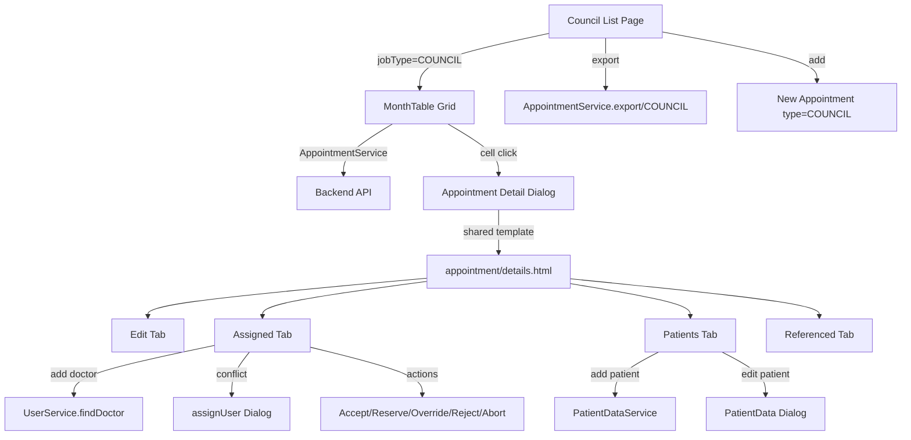
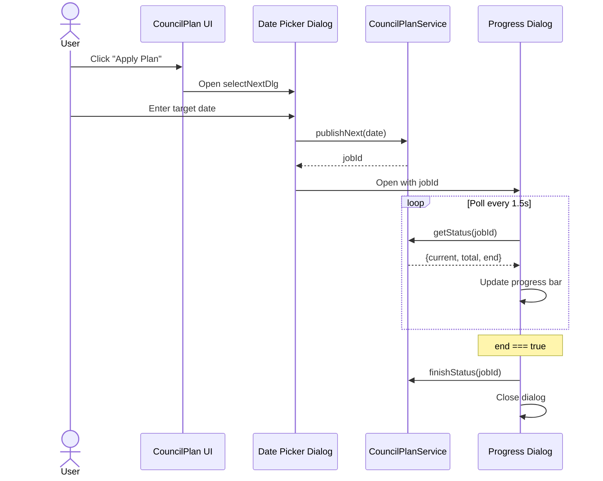
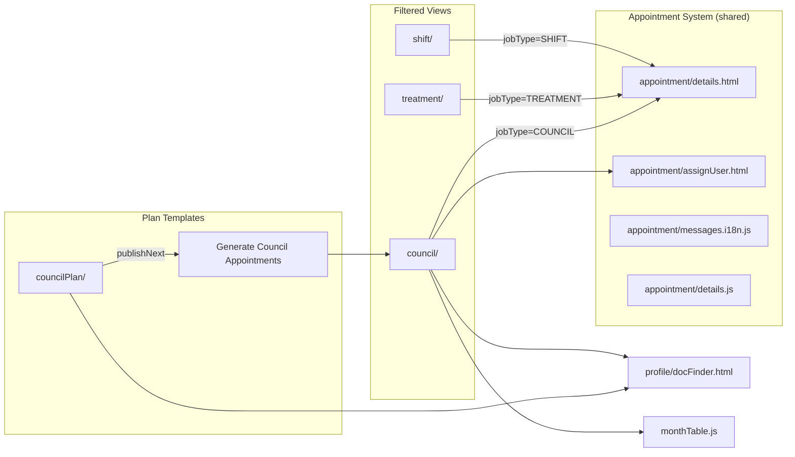
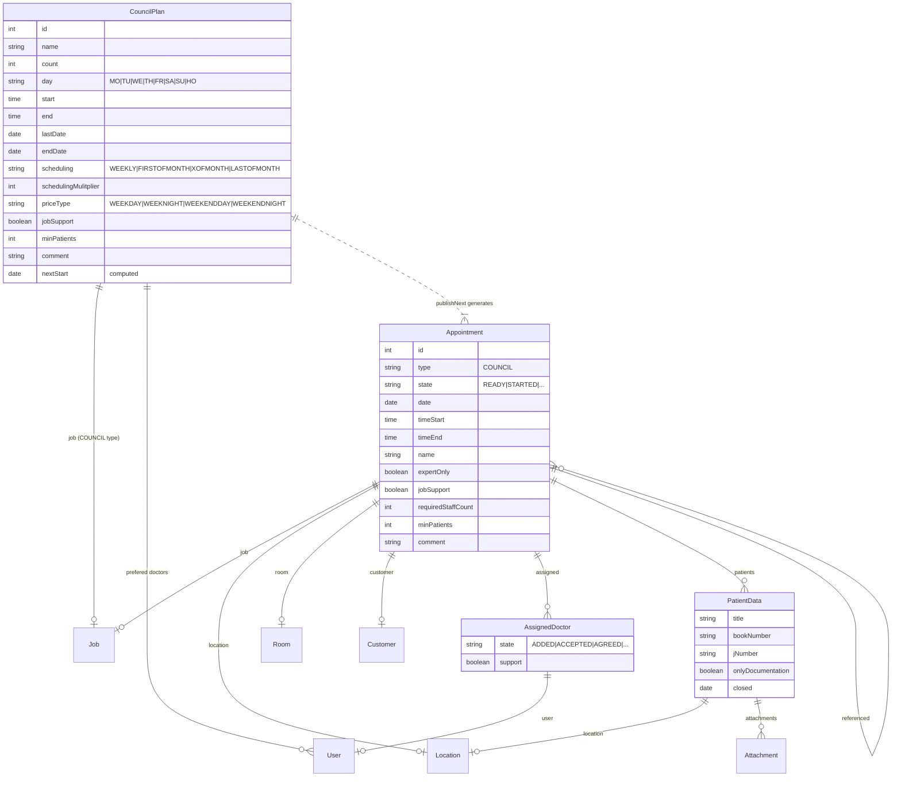

# Council & Council Plan -- Legacy UI Analysis

> **Source**: `videoclinic-prod/web/src/main/webapp/council/` (3 files, ~235 lines) and `councilPlan/` (3 files, ~399 lines)
> **Analysed**: 2026-03-22

---

## 1. Module Overview

### 1.1 Council (Filtered Appointment View)

The **council** module is **not** a standalone entity -- it is a **filtered view of the appointment system** with `jobType="COUNCIL"`. It shares the same detail dialog (`appointment/details.html`), assignment dialog (`appointment/assignUser.html`), and doctor finder (`profile/docFinder.html`) as the **shift** and **treatment** modules.

The list uses a **MonthTable** (dynamic calendar grid), not a standard row-based table. Each cell displays an appointment with its status icon, name, and a list of assigned doctors with their assignment states.

### 1.2 Council Plan (Plan Template CRUD)

The **councilPlan** module is a standalone CRUD for recurring council plan templates. Plans define scheduling rules (weekday, time, recurrence) and are used to bulk-generate council appointments via the "Apply Plan" action.

---

## 2. Council -- MonthTable Grid

### 2.1 Grid Structure

The council grid is a **MonthTable** -- a calendar-style matrix where:
- **Rows** = days of the month (1-31)
- **Columns** = council plan entries (jobs/locations)
- **Cells** = individual council appointments for that day/plan intersection

The grid is initialized via `MonthTable.init("AppointmentService", ...)` with the `"COUNCIL"` job type filter.

### 2.2 Cell Rendering

Each cell renders:

| Element | Source Field | Description |
|---|---|---|
| Status icon | `data.state` via `i18n.appointmentState()` | Color-coded icon (e.g. fa-folder-open for READY) |
| Appointment name | `data.name` | Escaped HTML text |
| Assigned doctors (sub-rows) | `data.details.assigned[i]` | Numbered list of assigned physicians |
| Doctor state icon | `assigned.state` via `i18n.assignedState()` | Per-doctor assignment status icon |
| Doctor name | `assigned.user.displayName` | Physician display name |
| Doctor role icon | `assigned.support` | `fa-user-md support` (treating physician) or `fa-user-md-chat main` (council physician) |

### 2.3 MonthTable Init Parameters

```
Service: AppointmentService
Job Type: "COUNCIL"
Params: [month, year]
Cell prefill on click: { date, state:"READY", location, customer, job, timeStart, timeEnd }
```

---

## 3. Council -- Detail Dialog (Shared Appointment Detail)

The council module embeds `appointment/details.html` which is the **shared appointment detail dialog** used by shift, treatment, and council. The dialog title dynamically switches based on type (`data-titleCOUNCIL`).

### 3.1 Detail Dialog Tabs

| Tab ID | Icon | Title (i18n key) | Visible for Council | Description |
|---|---|---|---|---|
| `navDetailsEdit` | `fas fa-info` | Info | Yes (shown) | Main edit form |
| `navReferenced` | `far fa-heartbeat` | `appointmentDlg.patientAppointments` | Yes | Referenced/linked appointments |
| `navPatient` | `far fa-user-injured` | `appointmentDlg.patients` | Yes | Patient data list |
| `navAssigned` | `far fa-user-tie` | `appointmentDlg.expertConfirm` | Yes (shown) | Assigned doctors and their states |
| `navSuggestion` | `far fa-user-plus` | `appointmentDlg.addExpert` | **No** (hidden) | Doctor suggestion (hidden for council) |
| `navQm` | -- | -- | **No** (hidden) | QM tab (hidden for council) |

### 3.2 Detail Edit Tab -- Form Fields

| Field | HTML Element | Name Attribute | Type | Mandatory | i18n Placeholder/Title | Notes |
|---|---|---|---|---|---|---|
| Date | `<input>` date | `data.date` | date | Yes | `action.date` | Also triggers `suggestType` |
| Time Start | `<input>` time | `data.timeStart` | time | Yes | `action.dateStart` | Triggers `suggestType` |
| Time End | `<input>` time | `data.timeEnd` | time | Yes | `action.dateEnd` | -- |
| Expert Only | `<input>` checkbox | `data.expertOnly` | boolean | No | `appointment.expertOnly` | CSS class `appointment` |
| State | `<select>` | `data.state` | enum | -- | `AppointmentState` | Disabled by default; changed via action button |
| Customer | `<input>` readonly | `data.customer` | object (autocomplete) | No | `customer` | Read-only display |
| Location | `<input>` autoselect | `data.location` | object (autocomplete) | Yes | `location` | Service: `LocationService.autocomplete` |
| Room | `<input>` autoselect | `data.room` | object (autocomplete) | No | `room` | Service: `RoomService.autocompleteAvailableRooms`; filtered by location |
| Required Staff Count | `<input>` integer | `data.requiredStaffCount` | integer | Yes | `action.requiredStaffCount` | -- |
| Job | `<input>` autoselect | `data.job` | object (autocomplete) | Yes | -- | Service: `JobService.autocompleteType`; filter: `"COUNCIL"` |
| Price Type | `<select>` | `data.priceType` | enum | No | `AppointmentPriceType` | CSS class `shift` (may be hidden for council) |
| Job Support | `<input>` checkbox | `data.jobSupport` | boolean | No | `CouncilPlan.jobSupport` | CSS class `council` (council-specific) |
| Min Patients | `<input>` number | `data.minPatients` | number | No | `appointment.minPatients` | CSS class `shift` |
| Comment | `<textarea>` | `data.comment` | text | No | `label.comment` | -- |

### 3.3 Appointment State Enum

| Value | Icon | CSS Class | German (server key) | English (estimated) |
|---|---|---|---|---|
| `READY` | `fa-folder-open` | `ap-ready` | Bereit | Ready |
| `STARTED` | `fa-user-plus` | `ap-started` | Gestartet | Started |
| `REQUESTED` | `fa-user-tag` | `ap-requested` | Angefragt | Requested |
| `LOCKEDIN` | `fa-check` | `ap-lockedin` | Gesperrt | Locked In |
| `ACTIVE` | `fa-traffic-light-go` | `ap-active` | Aktiv | Active |
| `REOPENED` | -- | `ap-reopened` | Wiedereroffnet | Reopened |
| `DONE` | `fa-traffic-light-stop` | `ap-done` | Erledigt | Done |
| `CLOSED` | `fa-door-closed` | `ap-closed` | Geschlossen | Closed |
| `STORNO` | `fa-ban` | `ap-storno` | Storno | Cancelled (Storno) |
| `RESCHEDULED` | -- | `ap-rescheduled` | Umgeplant | Rescheduled |
| `CANCELED` | `fa-slash` | `ap-canceled` | Abgesagt | Canceled |
| `ARCHIVED` | `fa-pallet-alt` | `ap-archived` | Archiviert | Archived |

### 3.4 Assigned Doctors Tab

Each assigned doctor row shows:

| Element | Description |
|---|---|
| Profile image | `/get/UserService/getImage/{userId}/profile.jpg` |
| Role icon | `fa-user-md support` (treating) or `fa-user-md-chat main` (council) or `fa-user-md doctor` (generic) |
| Display name | `assigned.user.displayName` |
| Phone number | `assigned.user.userProfile.cellularNumber` (tel: link) |
| State icon | Via `i18n.assignedState()` |
| Action buttons | Accept, Reserve, Override, Reject, Abort |
| Send reminder | `fa-comment-exclamation` icon action |
| History | `fa-history` icon action |
| Send message | `fa-comment-dots` icon action |
| Delete | Disabled link, enabled on row selection |

### 3.5 Assignment State Enum

| Value | Icon | CSS Color Class | Description |
|---|---|---|---|
| `ADDED` | `fa-search-plus` | `state-added` | Manually added |
| `PLANADDED` | `fa-search-plus` | `state-added` | Added by plan |
| `SELFADDED` | `fa-user-plus` | `selfAssigned` | Self-assigned |
| `ACCEPTED` | `fa-check` | `state-accepted` | Accepted by doctor |
| `RESERVED` | `fa-badge-check` | `state-reserved` | Reserved |
| `AGREED` | `fa-user` | `state-agree` | Agreed/confirmed |
| `AGREED_RESERVATION` | `fa-chair` | `state-agree` | Agreed with reservation |
| `REJECTED` | `fa-hand-paper` | `state-rejected` | Rejected by doctor |
| `DISAGREED` | `fa-ban` | `state-disagreed` | Disagreed by expert |
| `DOUBLE_BOOKED` | `fa-ban` | `state-double-booked` | Scheduling conflict |
| `CANCELED` | `fa-user-slash` | `state-canceled` | Canceled |
| `ABORTED` | `fa-ban` | `state-aborted` | Aborted |

### 3.6 Assignment Action Buttons

| Button CSS Class | Icon | i18n Title Key | Action |
|---|---|---|---|
| `accept` | `fa-thumbs-up` | `action.assignment.accept` | Accept assignment |
| `reserve` | `fa-chair` | `action.assignment.reserve` | Reserve assignment |
| `override` | `fa-check-double` | `action.assignment.override` | Override/force agree |
| `reject` | `fa-thumbs-down` | `action.assignment.reject` | Reject assignment |
| `abort` | `fa-eject` | `action.assignment.abort` | Abort assignment |
| `sendReminder` | `fa-comment-exclamation` | `action.assignment.sendReminder` | Send reminder message |
| `assignmentHistory` | `fa-history` | `action.assignment.history` | View assignment history |

### 3.7 Patient Data Tab

| Column | Field | Description |
|---|---|---|
| Patient title | `patients.title` | Patient identifier/name |
| Documentation only | `patients.onlyDocumentation` | Boolean checkbox icon |
| Closed date | `patients.closed` | DateTime when closed |
| Location | `patients.location.name` | Patient's location |
| Actions | edit, remove, sortUp, sortDown | Row manipulation icons |

### 3.8 Patient Data Edit Dialog (`patientDataDlg`)

| Field | Name | Type | Mandatory | Notes |
|---|---|---|---|---|
| Book Number | `data.bookNumber` | text | No | `consultation.booknumber` |
| J-Number | `data.jNumber` | text | No | Used to derive bookNumber |
| Location | `data.location` | object (autocomplete) | Yes (council) | CSS class `council` -- council-specific; `LocationService.autocomplete` |
| Closed date | `data.closed` | date | No | `PatientData.Closed` |
| Attachments | `data.attachments` | collection | No | File upload via `PatientDataService.upload` |

### 3.9 Referenced Appointments Tab

| Column | Field | Description |
|---|---|---|
| Time range | `referenced.timeStart` - `referenced.timeEnd` | Appointment time window |
| Location | `referenced.location.name` | Location name |
| Book number mask | `referenced.location.booknumberMask` | Book number format |
| Job code | `referenced.job.code` | Job/specialty code |
| State | `refState` action | Clickable state display |
| Edit | `fa-edit` action | Open referenced appointment |

### 3.10 Suggestion Tab (Hidden for Council)

The suggestion tab is hidden for council (`$("#navSuggestion").hide()`) but exists in the shared template. It shows available doctors with their skills, allowing admins to add them to the appointment.

---

## 4. Council -- Filter Panel

| Filter ID | HTML Element | Type | Placeholder/Title | Filters On |
|---|---|---|---|---|
| `filterDay` | `<input>` number | number | "Tag" (Day) HARDCODED | MonthTable row (day of month) |
| `filterJob` | `<input>` text | text | `jobId` | MonthTable column (job name) |
| `filterState` | `<select>` | enum | `AppointmentState` | Cell data (appointment state) |
| `siteSearch` | global search bar | text | -- | Cell data: doctor displayName, appointment name |
| `filterReset` | `<button>` | action | `button.reset` | Clears all filters |

### 4.1 Filter Logic

- **Day filter**: `MonthTable.filterDay()` -- hides rows where day does not match
- **Job filter**: `MonthTable.filterCol()` -- hides columns where job name does not match
- **State filter**: Combined with `siteSearch` in `MonthTable.filter()` -- filters individual cells
- **Search**: Matches against `data.name` and `data.details.assigned[].user.displayName`

---

## 5. Council -- Click Actions (Nav Buttons)

| Action ID | Icon | i18n Key | English | Notes |
|---|---|---|---|---|
| `reloadMenuBtn` | `fa-sync` | `action.reload` | Reload | Triggers `reloadGrid` event |
| `addMenuBtn` | `fa-plus-square` | `action.add` | Add | Creates new council appointment with COUNCIL type, READY state, current month/year |
| `editMenuBtn` | `fa-pencil` | `action.change` | Edit | Disabled until row selected |
| `exportMenuBtn` | `fa-file-export` | `action.export` | Export | Downloads XLS: `/get/AppointmentService/export/COUNCIL/{year}/{month}/Termine-Konsil-{year}_{month}.xls` |
| `filterMenuBtn` | `fa-filter` | "Filter" | Filter | **HARDCODED** label "Filter"; opens offcanvas filter panel |

### 5.1 Export Details

The export generates an Excel file via:
```
GET /get/AppointmentService/export/COUNCIL/{year}/{month}/Termine-Konsil-{year}_{month}.xls
```

### 5.2 Create (Add) Defaults

When creating a new council appointment:

| Field | Default Value |
|---|---|
| `type` | `"COUNCIL"` |
| `date` | Current month/year from MonthTable |
| `state` | `"READY"` |
| `requiredStaffCount` | `1` |
| `minPatients` | `1` |

---

## 6. Council Plan -- Static Grid Columns

| # | Field | i18n Key | Sortable | Resizable | Width | Formatter | Notes |
|---|---|---|---|---|---|---|---|
| 1 | `id` | `label.id` | Yes | Yes | 40 | -- | Numeric ID |
| 2 | `name` | `label.name` | Yes | Yes | 100 | -- | Plan name |
| 3 | `count` | `shiftPlan.numberOfDoctors` | Yes | Yes | 60 | -- | Number of required doctors |
| 4 | `prefered` | `shiftPlan.doctors` | Yes | Yes | 230 | `i18n.userListFormatter` | Concatenated display names |
| 5 | `job` | `shiftPlan.area` | Yes | Yes | 250 | `Formatter.code` | Job/specialty code |
| 6 | `minPatients` | `appointment.minPatients` | Yes | Yes | 60 | -- | Min patients |
| 7 | `day` | `shiftPlan.day` | Yes | Yes | 80 | `Formatter.weekday` | Weekday enum |
| 8 | `priceType` | `shiftPlan.shift` | Yes | Yes | 70 | `i18n.priceTypeFormatter` | Price type enum |
| 9 | `timeStart` | "Start" | Yes | Yes | 60 | `Formatter.onlyTime` | **HARDCODED** label "Start" |
| 10 | `timeEnd` | `shiftPlan.end` | Yes | Yes | 60 | `Formatter.onlyTime` | End time |

---

## 7. Council Plan -- Detail Form Fields

| Field | HTML Element | Name Attribute | Type | Mandatory | i18n Placeholder | Notes |
|---|---|---|---|---|---|---|
| Name | `<input>` text | `data.name` | text | No | `label.name` | Plan template name |
| Doctor Count | `<input>` number | `data.count` | number | Yes | `shiftPlan.numberOfDoctors` | Number of required doctors |
| Job | `<input>` autoselect | `data.job` | object | Yes | -- | `JobService.autocompleteType` filter `"COUNCIL"` |
| Job Support | `<input>` checkbox | `data.jobSupport` | boolean | No | `CouncilPlan.jobSupport` | -- |
| Day of Week | `<select>` | `data.day` | enum | Yes | `shiftPlan.day` | Values: MO/TU/WE/TH/FR/SA/SU/HO |
| Start Time | `<input>` time | `data.start` | time | Yes | "Start" HARDCODED | Triggers `suggestType` |
| End Time | `<input>` time | `data.end` | time | Yes | `shiftPlan.end` | -- |
| Last Date (from) | `<input>` date | `data.lastDate` | date | Yes | `appointment.start` | Title: "Ab dem Tag nach diesem wird nach dem Wochentag gesucht" HARDCODED German |
| End Date | `<input>` date | `data.endDate` | date | No | `appointmentPlan.end` | Optional plan expiry |
| Scheduling Multiplier | `<input>` number | `data.schedulingMulitplier` | number | Yes | -- | Note: typo "Mulitplier" in original |
| Scheduling Type | `<select>` | `data.scheduling` | enum | Yes | -- | See below |
| Next Start (display) | `<i>` field | `data.nextStart` | date (read-only) | -- | -- | Shows computed next occurrence |
| Comment | `<textarea>` | `data.comment` | text | No | `label.comment` | -- |
| Preferred Doctors | `<input>` autoselect + collection | `data.prefered` / `data.doctor` | object list | No | `consultation.doctor` | `UserService.findDoctor`; collection with delete |

### 7.1 Scheduling Type Enum

| Value | i18n Key | Description |
|---|---|---|
| `WEEKLY` | `WeekScheduling.WEEKLY` | Every X weeks |
| `FIRSTOFMONTH` | `WeekScheduling.FIRSTOFMONTH` | First occurrence of weekday in month |
| `XOFMONTH` | `WeekScheduling.XOFMONTH` | Xth occurrence of weekday in month |
| `LASTOFMONTH` | `WeekScheduling.LASTOFMONTH` | Last occurrence of weekday in month |

### 7.2 Weekday Enum

| Value | i18n Key | German | English |
|---|---|---|---|
| `MO` | `WeekDay.MO` | Montag | Monday |
| `TU` | `WeekDay.TU` | Dienstag | Tuesday |
| `WE` | `WeekDay.WE` | Mittwoch | Wednesday |
| `TH` | `WeekDay.TH` | Donnerstag | Thursday |
| `FR` | `WeekDay.FR` | Freitag | Friday |
| `SA` | `WeekDay.SA` | Samstag | Saturday |
| `SU` | `WeekDay.SU` | Sonntag | Sunday |
| `HO` | `WeekDay.HO` | Feiertag | Holiday |

### 7.3 Price Type Enum (Shift Category)

| Value | i18n Key | German | English |
|---|---|---|---|
| `WEEKDAY` | `AppointmentPriceType.WEEKDAY` | Werktag | Weekday |
| `WEEKNIGHT` | `AppointmentPriceType.WEEKNIGHT` | Werktag Nacht | Weeknight |
| `WEEKENDDAY` | `AppointmentPriceType.WEEKENDDAY` | Wochenende Tag | Weekend Day |
| `WEEKENDNIGHT` | `AppointmentPriceType.WEEKENDNIGHT` | Wochenende Nacht | Weekend Night |

---

## 8. Council Plan -- Filter Panel

| Filter Element | Type | Name Attribute | Description |
|---|---|---|---|
| End Date range (from) | `<input>` date | `data.endDate[0]` | Start of end-date range |
| End Date range (to) | `<input>` date | `data.endDate[1]` | End of end-date range |
| Job | `<input>` autoselect | `data.job` | `JobService.autocomplete`; filter by job |
| Max Results | `<select>` | -- | Options: 100, 150, 200, 300, 500, >500 |
| Apply button | `<button>` | -- | `button.apply` |
| Reset button | `<button>` | -- | `button.reset` |
| `siteSearch` | global search bar | -- | Filters on: name, prefered displayName, locationName, job.code, weekday |

---

## 9. Council Plan -- Click Actions (Nav Buttons)

| Action ID | Icon | i18n Key | English | Notes |
|---|---|---|---|---|
| `addMenuBtn` | `fa-plus-square` | `action.add` | Add | Creates plan with defaults: count=2, scheduling=WEEKLY, multiplier=1, jobSupport=true |
| `editMenuBtn` | `fa-pencil` | `action.change` | Edit | Disabled until row selected |
| `deleteMenuBtn` | `fa-trash` | `action.delete` | Delete | Disabled until row selected |
| `createNextBtn` | `fa-calendar-week` | `action.applyPlan` | Apply Plan | Opens date picker dialog, then calls `CouncilPlanService.publishNext(date)` |

### 9.1 Apply Plan Workflow

1. User clicks "Apply Plan" button
2. Dialog `selectNextDlg` opens with a date picker (title: `end.date`)
3. Prompt text: `{shift} {appointmentPlan.generateUntil}:` (i.e., "Generate appointments until:")
4. On confirm, calls `CouncilPlanService.publishNext(date)` which returns a job ID
5. Opens `jobStatusDlg` (progress modal) that polls `CouncilPlanService.getStatus(jobId)`
6. Progress bar updates until `data.end === true`
7. On completion, calls `CouncilPlanService.finishStatus(jobId)` and closes dialog

---

## 10. Council Plan -- Create Defaults

| Field | Default Value |
|---|---|
| `count` | `2` |
| `scheduling` | `"WEEKLY"` |
| `schedulingMulitplier` | `1` |
| `jobSupport` | `true` |

---

## 11. Assign User Dialog (Conflict Resolution)

When assigning a doctor who has scheduling conflicts, `appointment/assignUser.html` displays:

| Column | Field | Description |
|---|---|---|
| State select | `assignments.state` | ACCEPTED, RESERVED, AGREED, REJECTED, ABORTED, REMOVE |
| Time Start | `assignments.appointment.timeStart` | Conflicting appointment start |
| Time End | `assignments.appointment.timeEnd` | Conflicting appointment end |
| Date | `assignments.appointment.date` | Conflicting appointment date |
| Title | `assignments.appointment.title` | Conflicting appointment title |
| Location | `assignments.appointment.location.name` | Conflicting location |

Header text: "Folgende Termine uberschneiden sich fur die Annahme dieses Arztes." **HARDCODED German** ("The following appointments overlap for accepting this doctor.")

---

## 12. Doctor Finder Dialog (`docFinder`)

A shared dialog for searching doctors:

| Element | Description |
|---|---|
| Search input | `UserService.findEmployee` autocomplete |
| Filter display | Shows job code, day, start, end from current context |
| Results collection | List of matching doctors with `displayName` |

---

## 13. Cross-Module References

```
council/
  +-- appointment/details.html    (shared detail dialog)
  +-- appointment/details.js      (shared detail logic)
  +-- appointment/assignUser.html (conflict resolution dialog)
  +-- appointment/assignUser.js   (conflict resolution logic)
  +-- appointment/messages.i18n.js(shared i18n)
  +-- profile/docFinder.html      (doctor search dialog)
  +-- profile/docFinder.js        (doctor search logic)
  +-- _lib/scripts/monthTable.js  (calendar grid component)
  +-- _lib/scripts/monthTable.css (calendar grid styles)

councilPlan/
  +-- profile/docFinder.html      (doctor search dialog for preferred doctors)
```

### 13.1 Service Dependencies

| Service | Methods Used | Module |
|---|---|---|
| `AppointmentService` | `getMethod` (dynamic), `export` | council |
| `CouncilPlanService` | `get`, `getAll`, `publishNext`, `getStatus`, `finishStatus` | councilPlan |
| `JobService` | `autocompleteType` (filtered by "COUNCIL"), `autocomplete` | both |
| `LocationService` | `autocomplete` | council (via appointment detail) |
| `RoomService` | `autocompleteAvailableRooms` | council (via appointment detail) |
| `UserService` | `findDoctor`, `findEmployee`, `getImage`, `saveSetting` | both |
| `PatientDataService` | `upload`, `attachment` | council (via patient data dialog) |

### 13.2 Relationship to Shift and Treatment

The council module is architecturally identical to shift and treatment. All three are filtered appointment views:

| Module | `jobType` | Grid Type | Detail Dialog | Unique Features |
|---|---|---|---|---|
| **shift** | `"SHIFT"` | MonthTable | `appointment/details.html` | Shift-specific priceType, minPatients |
| **treatment** | `"TREATMENT"` | MonthTable | `appointment/details.html` | Treatment-specific fields |
| **council** | `"COUNCIL"` | MonthTable | `appointment/details.html` | jobSupport checkbox, hidden suggestion tab, hidden QM tab |

---

## 14. Translation Table

| Text Reference | German (Original) | English (Translated) | Notes |
|---|---|---|---|
| `action.reload` | Neu laden | Reload | Shared i18n |
| `action.add` | Hinzufugen | Add | Shared i18n |
| `action.change` | Bearbeiten | Edit | Shared i18n |
| `action.export` | Exportieren | Export | Shared i18n |
| `action.delete` | Loschen | Delete | Shared i18n |
| `action.applyPlan` | Plan anwenden | Apply Plan | councilPlan nav button |
| `action.date` | Datum | Date | Shared |
| `action.dateStart` | Startzeit | Start Time | Shared |
| `action.dateEnd` | Endzeit | End Time | Shared |
| `action.requiredStaffCount` | Benotigte Mitarbeiter | Required Staff Count | Appointment detail |
| `action.assignment.accept` | Annehmen | Accept | Assignment action |
| `action.assignment.reserve` | Reservieren | Reserve | Assignment action |
| `action.assignment.override` | Uberschreiben | Override | Assignment action |
| `action.assignment.reject` | Ablehnen | Reject | Assignment action |
| `action.assignment.abort` | Abbrechen | Abort | Assignment action |
| `action.assignment.sendReminder` | Erinnerung senden | Send Reminder | Assignment action |
| `action.assignment.history` | Verlauf | History | Assignment action |
| `action.assignment.remove` | Entfernen | Remove | Assign user dialog |
| "Filter" | Filter | Filter | **HARDCODED** in council nav |
| "Tag" | Tag | Day | **HARDCODED** in filterDay placeholder |
| "Start" | Start | Start | **HARDCODED** in councilPlan grid header and plan form |
| "Processing..." | Processing... | Processing... | **HARDCODED** English in exportStatusDlg |
| "Status" | Status | Status | **HARDCODED** in jobStatusDlg |
| "Behandelnder Arzt" | Behandelnder Arzt | Treating Physician | **HARDCODED** German in council cell render |
| "Konsil Arzt" | Konsil Arzt | Council Physician | **HARDCODED** German in council cell render |
| "Ab dem Tag nach diesem wird nach dem Wochentag gesucht" | (same) | "From the day after this, the weekday will be searched" | **HARDCODED** German tooltip on lastDate |
| "Folgende Termine uberschneiden sich..." | (same) | "The following appointments overlap for accepting this doctor." | **HARDCODED** German in assignUser dialog |
| "Datei" | Datei | File | **HARDCODED** German in patient data attachments header |
| "Datei hochladen" | Datei hochladen | Upload File | **HARDCODED** German in file upload title |
| "Patient" | Patient | Patient | **HARDCODED** in patient data table header |
| `jobId` | Fachgebiet | Specialty/Job ID | Filter placeholder |
| `AppointmentState` | Terminstatus | Appointment State | Filter select label |
| `button.reset` | Zurucksetzen | Reset | Filter reset |
| `button.apply` | Anwenden | Apply | Filter apply |
| `button.add` | Hinzufugen | Add | Generic add |
| `button.delete` | Loschen | Delete | Generic delete |
| `label.id` | ID | ID | Grid column |
| `label.name` | Name | Name | Grid column / form |
| `label.comment` | Kommentar | Comment | Form textarea |
| `label.transmit` | Ubermitteln | Transmit | Patient data attachment |
| `shiftPlan.numberOfDoctors` | Anzahl Arzte | Number of Doctors | CouncilPlan grid/form |
| `shiftPlan.doctors` | Arzte | Doctors | CouncilPlan grid |
| `shiftPlan.area` | Bereich | Area/Specialty | CouncilPlan grid |
| `shiftPlan.day` | Wochentag | Weekday | CouncilPlan grid/form |
| `shiftPlan.shift` | Schicht | Shift | CouncilPlan grid |
| `shiftPlan.end` | Ende | End | CouncilPlan grid/form |
| `appointment.minPatients` | Min. Patienten | Min Patients | CouncilPlan grid |
| `appointment.start` | Beginn | Start | CouncilPlan form (lastDate) |
| `appointment.prefered` | Bevorzugt | Preferred | CouncilPlan preferred doctors label |
| `appointment.expertOnly` | Nur Experten | Expert Only | Appointment detail checkbox |
| `appointment.nextStep` | Nachster Schritt | Next Step | State change dialog |
| `appointment.assignmentHistory` | Zuweisungsverlauf | Assignment History | History dialog title |
| `appointmentPlan.end` | Planende | Plan End | CouncilPlan endDate |
| `appointmentPlan.generateUntil` | Generieren bis | Generate Until | Apply plan dialog |
| `appointmentDlg.patientAppointments` | Patiententermine | Patient Appointments | Tab title |
| `appointmentDlg.patients` | Patienten | Patients | Tab title |
| `appointmentDlg.expertConfirm` | Arzt Bestatigung | Expert Confirmation | Tab title |
| `appointmentDlg.addExpert` | Arzt hinzufugen | Add Expert | Tab title (hidden for council) |
| `CouncilPlan.jobSupport` | Unterstutzung | Job Support | Checkbox label |
| `councilPlan` | Konsilplan | Council Plan | Detail dialog title |
| `council` | Konsil | Council | Appointment detail title variant |
| `council.support` | Unterstutzung | Support (treating physician) | Doctor role label |
| `council.main` | Konsil Arzt | Council Physician (main) | Doctor role label |
| `consultation.doctor` | Arzt | Doctor | Preferred doctor placeholder |
| `consultation.booknumber` | Buchungsnummer | Book Number | Patient data / referenced |
| `consultation.jnumber` | J-Nummer | J-Number | Patient data |
| `customer` | Kunde | Customer | Appointment detail |
| `location` | Standort | Location | Appointment detail |
| `room` | Raum | Room | Appointment detail |
| `user.doctor` | Arzt | Doctor | DocFinder title |
| `docFinder.physician` | Arzt | Physician | DocFinder input placeholder |
| `User.Expert` | Experte | Expert | Assigned doctor input |
| `patient.number` | Patientennummer | Patient Number | Patient data add input |
| `PatientDataType` | Patientendaten | Patient Data | Patient data dialog title |
| `PatientData.Closed` | Abgeschlossen | Closed | Patient data closed field |
| `PatientData.onlyDocumentation` | Nur Dokumentation | Documentation Only | Patient data checkbox (commented out) |
| `end.date` | Enddatum | End Date | Apply plan dialog title |
| `shift` | Schicht | Shift | Used in apply plan prompt |
| `filter.results` | Ergebnisse | Results | Max results select title |
| `WeekScheduling.WEEKLY` | Wochentlich | Weekly | Scheduling enum |
| `WeekScheduling.FIRSTOFMONTH` | Erster im Monat | First of Month | Scheduling enum |
| `WeekScheduling.XOFMONTH` | X-ter im Monat | Xth of Month | Scheduling enum |
| `WeekScheduling.LASTOFMONTH` | Letzter im Monat | Last of Month | Scheduling enum |
| `null.name` | (empty/null) | (empty/null) | Null display |

---

## 15. Architecture Diagrams

### 15.1 Council Module Data Flow



### 15.2 Council Plan Apply Workflow



### 15.3 Module Relationship Diagram



### 15.4 Council Plan Entity Relationship



---

## 16. Known Issues and Quirks

1. **Typo in field name**: `schedulingMulitplier` (should be `schedulingMultiplier`) -- preserved from legacy.
2. **Hardcoded German strings**: Multiple hardcoded German strings in both HTML templates and JS render functions (see Translation Table).
3. **Hardcoded English**: "Processing..." and "Status" in exportStatusDlg.
4. **Room depends on Location**: Room autocomplete is disabled until a location is selected; selecting a room auto-fills the location.
5. **Council hides tabs**: `navSuggestion` and `navQm` are explicitly hidden via JS `onCreate`.
6. **Shared i18n keys with shiftPlan**: CouncilPlan reuses `shiftPlan.*` i18n keys (numberOfDoctors, doctors, area, day, shift, end) suggesting these were copied from the shift plan module.
7. **Price type auto-suggestion**: The `suggestType` class triggers automatic price type selection based on weekday and time (before/after 18:00).
8. **Filter panel differences**: Council uses an offcanvas panel opened by a dedicated button; councilPlan uses the built-in `filter: true` nav option with a server-side filter.
