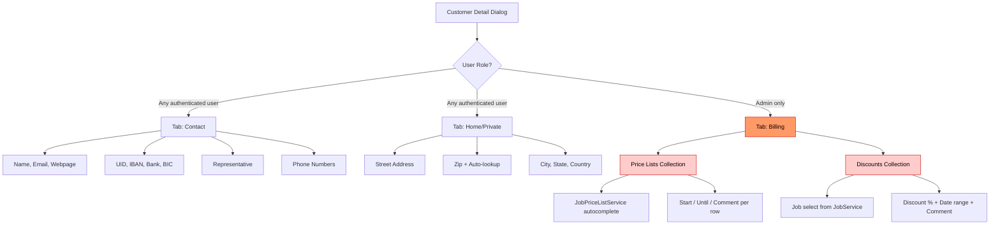

# Customer List & Detail Page — Legacy UI Analysis

> **Source files analyzed:**
> - `web/src/main/webapp/customer/index.htmlm` (216 lines)
> - `web/src/main/webapp/customer/index.js` (97 lines)
> - `web/src/main/webapp/customer/messages.i18n.js` (64 lines)
> - `web/src/main/webapp/contact/messages.i18n.js` (33 lines)
> - `web/src/main/webapp/customer/zipCodeLookup.js` (69 lines)

---

## 1. Block Title & Visualization

| Attribute | Value |
|-----------|-------|
| Block ID | `customer` |
| CSS class | `tableView` |
| Icon | `fas fa-hospital-user` (on detail dialog) |
| Color | `bg-color-customer` (on detail dialog) |
| CRUD config | `Core.initCrud` with `serviceName: "CustomerService"`, `getMethod: "get"` |
| Grid mode | `fullscreen: true` via `slickerGrid` |

---

## 2. HTMLM Header Metadata

### Variables

| Field | Method | Value |
|-------|--------|-------|
| `usePanel` | `variable` | `true` |
| `nav` | `variable` | Filter disabled (`filter: false`), toolbar buttons (see Section 3) |

### Template Includes

| Field | Method | Template Path |
|-------|--------|---------------|
| `navBar` | `template` | `../_include/navbar.mustache` |

### Option Sources

| Field | Service | Method | Style | Value Key | Content Key | Data |
|-------|---------|--------|-------|-----------|-------------|------|
| `jobs` | `JobService` | `getAllOptions` | `OPTION` | `id` | `code` | `pojo` |

### Script Includes

| Script |
|--------|
| `/customer/index.js` |
| `/customer/messages.i18n.js` |
| `/contact/messages.i18n.js` |
| `/customer/zipCodeLookup.js` |

---

## 3. Toolbar (Nav Buttons)

Defined in `nav.buttons` array inside the HTMLM header.

| # | ID | Name (i18n key) | Icon | Disabled (initial) | Auth / Role Gate | Purpose (from JS) |
|---|-----|-----------------|------|---------------------|------------------|--------------------|
| 1 | `addMenuBtn` | `action.add` | `plus-square` | `false` (default) | -- | Add new customer |
| 2 | `editMenuBtn` | `action.change` | `pencil` | `true` | -- | Edit selected customer |
| 3 | `deleteMenuBtn` | `action.delete` | `trash` | `true` | -- | Delete selected customer |
| -- | *(spacer)* | -- | -- | -- | -- | -- |

**Filter toggle**: `filter: false` -- no offcanvas filter panel.

---

## 4. Grid / Table Columns

Defined in `<div class="grid">` inside `#customer`.

| # | `data-field` | `data-name` | `data-sortable` | `data-width` | Formatter | Notes |
|---|-------------|-------------|-----------------|-------------|-----------|-------|
| 1 | `id` | `{{i18n.label.id}}` | -- (default) | 30 | -- (raw) | Numeric ID |
| 2 | `name` | `{{i18n.label.name}}` | -- (default) | 500 | -- (raw) | Customer name, widest column |
| 3 | `bank` | **`"Bank"`** | -- (default) | 100 | -- (raw) | **HARDCODED label** (no i18n key) |
| 4 | `state` | `{{i18n.contact.state}}` | `true` | 130 | -- (raw) | Federal state / region |
| 5 | `representative` | `{{i18n.customer.representative}}` | `true` | 150 | -- (raw) | Customer representative |
| 6 | `email` | `{{i18n.contact.primaryemail}}` | `true` | 200 | -- (raw) | Primary email address |
| 7 | `phone` | `{{i18n.contact.workphone}}` | `true` | 130 | -- (raw) | Work phone number |

**Grid data source** (from JS):
- Service: `CustomerService`
- Method: `getAll`
- Params: `[{}]` (empty filter object)
- Settings persistence: `UserService.saveSetting` keyed by `#gridSetting` `data-code`

---

## 5. Detail Dialog — Tab Structure

The detail panel uses a Bootstrap tabbed layout with `nav-tabs`.

| # | Tab ID | Title (i18n) | Icon | Default Active | Permission Gate |
|---|--------|-------------|------|----------------|-----------------|
| 1 | `tabContact` | `{{i18n.contact}}` | `fas fa-address-card` | Yes | -- (all users) |
| 2 | `tabPrivate` | `{{i18n.contact.private}}` | `far fa-home` | No | -- (all users) |
| 3 | `tabBilling` | **`"Abrechnung"`** (HARDCODED German) | `far fa-money-bill` | No | **`{{#isAdmin}}`** -- admin only |

**Detail dialog attributes:**
- `data-icon`: `fas fa-hospital-user`
- `data-width`: `900`
- `data-buttonsave`: `true`
- `data-color`: `bg-color-customer`
- `title`: `{{i18n.customer}}`

---

## 6. Form Elements — Tab: Contact (`tabContact`)

| # | Text-Reference / Name | Symbol | Datamodel (`name=`) | Type | Options | Placeholder | Default | Required | Read-only | Condition / Permission |
|---|----------------------|--------|---------------------|------|---------|-------------|---------|----------|-----------|----------------------|
| 1 | `customer.name` | -- | `data.name` | `text` | -- | `{{i18n.customer.name}}` | -- | Yes (`mandatory` class) | No | -- |
| 2 | `contact.primaryemail` | `@` (input-group-text) | `data.email` | `email` | -- | `{{i18n.contact.primaryemail}}` | -- | No | No | -- |
| 3 | `contact.webpage` | `fa-link` icon | `data.webpage` | `text` | -- | `{{i18n.contact.webpage}}` | -- | No | No | -- |
| 4 | `address.uid` | -- | `data.uid` | `text` | -- | `{{i18n.address.uid}}` | -- | No | No | -- |
| 5 | `address.iban` | -- | `data.iban` | `text` | -- | `{{i18n.address.iban}}` | -- | No | No | -- |
| 6 | `address.bank` | -- | `data.bank` | `text` | -- | `{{i18n.address.bank}}` | -- | No | No | -- |
| 7 | `address.bic` | -- | `data.bic` | `text` | -- | `{{i18n.address.bic}}` | -- | No | No | Inline with bank |
| 8 | `customer.representative` | -- | `data.representative` | `text` | -- | `{{i18n.customer.representative}}` | -- | No | No | -- |
| 9 | `contact.cellularnumber` | `fa-mobile-alt` icon | `data.phone` | `text` | -- | `{{i18n.contact.cellularnumber}}` | -- | No | No | -- |
| 10 | `contact.workphone` | `fa-phone-office` icon | `data.phone2` | `text` | -- | `{{i18n.contact.workphone}}` | -- | No | No | -- |
| 11 | `contact.faxnumber` | `fa-fax` icon | `data.faxNumber` | `text` | -- | `{{i18n.contact.faxnumber}}` | -- | No | No | -- |

**Layout**: Two columns (`col-md-6`). Left column: name, email, webpage. Right column: uid, iban, bank+bic. Second row: left = representative, right = phone numbers (cellular, work, fax).

---

## 7. Form Elements — Tab: Home/Private (`tabPrivate`)

| # | Text-Reference / Name | Symbol | Datamodel (`name=`) | Type | Options | Placeholder | Default | Required | Read-only | Condition / Permission |
|---|----------------------|--------|---------------------|------|---------|-------------|---------|----------|-----------|----------------------|
| 1 | `contact.street` | -- | `data.address` | `text` | -- | `{{i18n.contact.street}}` | -- | No | No | -- |
| 2 | `contact.street2` | -- | `data.address2` | `text` | -- | `{{i18n.contact.street2}}` | -- | No | No | -- |
| 3 | `contact.zipcode` | -- | `data.zip` | `text` | ZipCode autocomplete | `{{i18n.contact.zipcode}}` | -- | No | No | `searchZipCode` class triggers auto-fill |
| 4 | `contact.state` | -- | `data.state` | `text` | -- | `{{i18n.contact.state}}` | -- | No | No | Auto-filled by zip lookup |
| 5 | `contact.city` | -- | `data.city` | `text` | -- | `{{i18n.contact.city}}` | -- | No | No | Auto-filled by zip lookup |
| 6 | `contact.country` | -- | `data.country` | `text` | -- | `{{i18n.contact.country}}` | -- | No | No | Auto-filled by zip lookup |

**Layout**: Single column (`col-md-6`). Zip/state/city are in an `input-group` (side-by-side row).

**Zip Code Lookup Behavior** (from `zipCodeLookup.js`):
- Fields with class `searchZipCode` get a jQuery autocomplete
- Source: `ZipCodeService.get(term)` -- returns `{ zipCode, city, state, country }`
- On select: auto-populates `data.city`, `data.state`, `data.country`
- Min length: 1 character

---

## 8. Form Elements — Tab: Billing (`tabBilling`) -- Admin Only

### 8a. Price Lists Collection

| # | Text-Reference / Name | Symbol | Datamodel (`name=`) | Type | Options | Placeholder | Default | Required | Read-only | Condition / Permission |
|---|----------------------|--------|---------------------|------|---------|-------------|---------|----------|-----------|----------------------|
| 1 | `jobPriceList` (insert) | -- | `data.priceLists` (collection) | `autocomplete` | `JobPriceListService.autocomplete` | -- | -- | No | No | `{{#isAdmin}}` |

**Price Lists table** (collection rows in `data.priceLists`):

| # | Column Header | Datamodel (`name=`) | Type | Notes |
|---|--------------|---------------------|------|-------|
| 1 | `{{i18n.jobPriceList}}` | `priceLists.priceList.name` | `span` (read-only display) | Shows price list name |
| 2 | `{{i18n.label.start}}` | `priceLists.start` | `date` input | Start date |
| 3 | `{{i18n.label.until}}` | `priceLists.until` | `date` input | End date |
| 4 | `{{i18n.label.comment}}` | `priceLists.comment` | `text` input | Free-text comment |
| 5 | *(delete action)* | -- | `fa-trash` icon | Delete row action |

**Validation alert**: `#priceListInfo` shows `data.priceListsValid` message in an `alert-danger` div when `data.priceListsValid` is truthy.

**Autocomplete behavior** (from JS):
- Service: `JobPriceListService.autocomplete`
- Min length: 0 (shows all on focus)
- On insert: sets `pojo.priceList = { name, id }`, `pojo.start = Date.now()`, clears comment

### 8b. Discounts Collection

| # | Column Header | Datamodel (`name=`) | Type | Notes |
|---|--------------|---------------------|------|-------|
| 1 | `{{i18n.jobId}}` | `discounts.job` | `select` | Populated from `{{{jobs}}}` options (`JobService.getAllOptions`) |
| 2 | `{{i18n.billing.rebate}}` | `discounts.discount` | `percent` input | Percentage field with `%` suffix |
| 3 | **`"Start"`** (HARDCODED) | `discounts.dateStart` | `date` input | **HARDCODED column header** |
| 4 | `{{i18n.customer.end}}` | `discounts.dateUntil` | `date` input | End date |
| 5 | `{{i18n.label.comment}}` | `discounts.comment` | `text` input | Free-text comment |
| 6 | *(delete action)* | -- | `fa-trash` icon | Delete row action |

**Add button**: `<i class="fa fa-plus add action" data-field="data.discounts">` above the discounts table.

---

## 9. Click Actions

| Action ID | Symbol | Title | English | Notes |
|-----------|--------|-------|---------|-------|
| `addMenuBtn` | `plus-square` | `action.add` | Add | Toolbar button |
| `editMenuBtn` | `pencil` | `action.change` | Change | Toolbar button, disabled until row selected |
| `deleteMenuBtn` | `trash` | `action.delete` | Delete | Toolbar button, disabled until row selected |
| Grid row click | -- | -- | -- | Selects row, enables edit/delete buttons (via `Core.initCrud`) |
| Grid row double-click | -- | -- | -- | Opens detail dialog (via `Core.initCrud`) |
| Price list insert | `fa-plus` | -- | -- | Adds price list to collection via autocomplete |
| Discount add | `fa-plus` | -- | -- | Adds empty discount row to collection |
| Collection row delete | `fa-trash` | -- | -- | Removes row from collection (price list or discount) |
| Detail save | -- | -- | Save | `data-buttonsave="true"` on detail dialog |

---

## 10. Permissions

| Element | Gate | Condition | Effect |
|---------|------|-----------|--------|
| Billing tab (`tabBilling`) | `{{#isAdmin}}` | User is admin | Tab and all contents rendered only for admins |
| Billing tab link | `{{#isAdmin}}` | User is admin | Tab navigation link hidden for non-admins |
| All other tabs/buttons | None | -- | Visible to all authenticated users |

---

## 11. Permission Gating Diagram



---

## 12. Data Model Summary

Based on form field `name` attributes, the Customer data model includes:

| Field | Tab | Type | Notes |
|-------|-----|------|-------|
| `id` | Grid | number | Primary key |
| `name` | Contact | string | Required (`mandatory`) |
| `email` | Contact | string (email) | Primary email |
| `webpage` | Contact | string (URL) | Website |
| `uid` | Contact | string | VAT/Tax ID |
| `iban` | Contact | string | Bank account IBAN |
| `bank` | Contact | string | Bank name |
| `bic` | Contact | string | Bank BIC/SWIFT |
| `representative` | Contact | string | Customer representative |
| `phone` | Contact | string | Cellular number (grid: mapped to workphone column) |
| `phone2` | Contact | string | Work phone |
| `faxNumber` | Contact | string | Fax number |
| `address` | Private | string | Street line 1 |
| `address2` | Private | string | Street line 2 |
| `zip` | Private | string | Postal/ZIP code |
| `state` | Private | string | State/region |
| `city` | Private | string | City |
| `country` | Private | string | Country |
| `priceLists` | Billing | array | Collection of `{ priceList: { id, name }, start, until, comment }` |
| `priceListsValid` | Billing | string/boolean | Validation message for price lists |
| `discounts` | Billing | array | Collection of `{ job, discount, dateStart, dateUntil, comment }` |

**Note on phone field mapping**: The grid column `phone` uses header `workphone`, but the detail form maps `data.phone` to cellular number and `data.phone2` to work phone. This is a naming inconsistency in the legacy code.

---

## 13. Translations

| Text-Reference | German (likely) | English | Notes |
|----------------|----------------|---------|-------|
| `customer` | Kunde | Customer | Main entity name |
| `customer.representative` | Ansprechpartner | Representative | -- |
| `customer.name` | Kundenname | Customer Name | Used as label + placeholder |
| `customer.end` | Ende | End | Discount end date column |
| `contact` | Kontakt | Contact | Tab title |
| `contact.private` | Privat | Private/Home | Tab title |
| `contact.street` | Strasse | Street | -- |
| `contact.street2` | -- | Street Line 2 | -- |
| `contact.state` | Bundesland | State | -- |
| `contact.primaryemail` | E-Mail | Primary Email | -- |
| `contact.workphone` | Telefon (Arbeit) | Work Phone | -- |
| `contact.cellularnumber` | Mobiltelefon | Cellular Number | -- |
| `contact.faxnumber` | Fax | Fax Number | -- |
| `contact.zipcode` | PLZ | Zip Code | -- |
| `contact.city` | Stadt / Ort | City | -- |
| `contact.country` | Land | Country | -- |
| `contact.webpage` | Webseite | Webpage | -- |
| `address.uid` | UID | UID (VAT ID) | -- |
| `address.iban` | IBAN | IBAN | -- |
| `address.bank` | Bank | Bank | -- |
| `address.bic` | BIC | BIC | -- |
| `label.id` | ID | ID | Grid column |
| `label.name` | Name | Name | Grid column |
| `label.start` | Start | Start | Price list column |
| `label.until` | Bis | Until | Price list column |
| `label.comment` | Kommentar | Comment | -- |
| `jobPriceList` | Preisliste | Price List | -- |
| `jobId` | Leistung | Job/Service | Discount job column |
| `billing.rebate` | Rabatt | Rebate/Discount | -- |
| `action.add` | Hinzufugen | Add | Toolbar |
| `action.change` | Bearbeiten | Change | Toolbar |
| `action.delete` | Loschen | Delete | Toolbar |
| -- | **Bank** | **Bank** | **HARDCODED** in grid column header (no i18n) |
| -- | **Abrechnung** | **Billing** | **HARDCODED** German in Billing tab title |
| -- | **Start** | **Start** | **HARDCODED** in discounts table header |

---

## 14. Services Referenced

| Service | Method | Used For |
|---------|--------|----------|
| `CustomerService` | `getAll` | Grid data source |
| `CustomerService` | `get` | Detail dialog load (via CRUD) |
| `JobService` | `getAllOptions` | Discount job `<select>` options |
| `JobPriceListService` | `autocomplete` | Price list autocomplete insert |
| `UserService` | `findCustomer` | Customer-user autocomplete (unused in visible UI?) |
| `UserService` | `saveSetting` | Grid column settings persistence |
| `ZipCodeService` | `get` | Zip code autocomplete lookup |

---

## 15. Key Implementation Notes for Rebuild

1. **HARDCODED strings to fix**: "Bank" (grid column), "Abrechnung" (billing tab title), "Start" (discounts table header) must be converted to i18n keys.
2. **Phone field naming inconsistency**: `data.phone` = cellular in form but grid column says "workphone". Clarify with data model.
3. **Admin-only Billing tab**: Must implement role-based conditional rendering. The entire tab (including both Price Lists and Discounts collections) is gated by admin role.
4. **Zip code auto-fill**: The zip code field triggers a lookup that auto-populates city, state, and country. This should be implemented as a debounced search with combobox in the new UI.
5. **Price list autocomplete**: Uses `JobPriceListService.autocomplete` with `minLength: 0` (shows all on empty input). On selection, auto-sets `start` to current date.
6. **Collections (Price Lists, Discounts)**: Both are editable table collections with inline add/delete. In the new UI, consider using `DataTable` with inline editing or a repeatable form group pattern.
7. **No filter panel**: Unlike other pages, the customer list has `filter: false` -- no offcanvas filter.
8. **Detail dialog width**: 900px -- relatively wide to accommodate two-column layout.

---

## Wireframe Reference (ASCII)

> Full wireframe: [`specs/wireframes/customer/workflows.md#w1-customer-list--detail`](../../../wireframes/customer/workflows.md#w1-customer-list--detail)

```
┌─────────────────────────────────────────────────────────────────────────────┐
│ ▌Customers                                                                 │
├─────────────────────────────────────────────────────────────────────────────┤
│ [+ Add] [✎ Edit] [🗑 Delete]                                               │
├────┬──────────────────┬────────┬────────┬───────────────┬──────────┬────────┤
│ ID │ Name             │ Bank   │ State  │ Representative│ Email    │ Phone  │
├────┼──────────────────┼────────┼────────┼───────────────┼──────────┼────────┤
│  1 │ JVA Musterstadt  │ Erste  │ Wien   │ Dr. Müller    │ jva@...  │ +43... │
│  2 │ Justizanstalt XY │ Raiff. │ NÖ     │ Mag. Schmidt  │ xy@...   │ +43... │
├────┴──────────────────┴────────┴────────┴───────────────┴──────────┴────────┤
│ Showing 1-2 of 42 customers                             [< 1  2  3  4  >] │
└─────────────────────────────────────────────────────────────────────────────┘

┌─ Customer Detail (900px) ──────────────────────────────────────────────────┐
│  [Tab: Contact] [Tab: Address] [Tab: Billing*]       * [cond: role==ADMIN] │
├────────────────────────────────────────────────────────────────────────────┤
│  Tab 1: Contact                                                            │
│  ┌──────────────────────┐  ┌──────────────────────┐                        │
│  │ Name*          [___] │  │ UID            [___] │                        │
│  │ Email     @    [___] │  │ IBAN           [___] │                        │
│  │ Webpage   🔗   [___] │  │ Bank / BIC     [___] │                        │
│  │ Representative [___] │  │ Mobile    📱   [___] │                        │
│  │                      │  │ Work Phone     [___] │                        │
│  │                      │  │ Fax            [___] │                        │
│  └──────────────────────┘  └──────────────────────┘                        │
│                                                                            │
│  Tab 2: Address                                                            │
│  Street [_____] Street 2 [_____]                                           │
│  Zip [____] → City [auto] State [auto] Country [auto]                      │
│  [autofill: ZipCodeService]                                                │
│                                                                            │
│  Tab 3: Billing [admin-only]                                               │
│  Price Lists [repeats]:  PriceList(autocomplete) | Start | Until | Comment │
│  Discounts [repeats]:    Job(select) | Discount% | Start | Until | Comment │
│                                            [Cancel] [Save]                 │
└────────────────────────────────────────────────────────────────────────────┘
```
