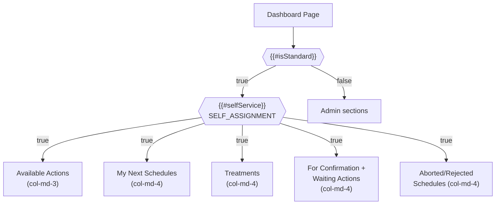
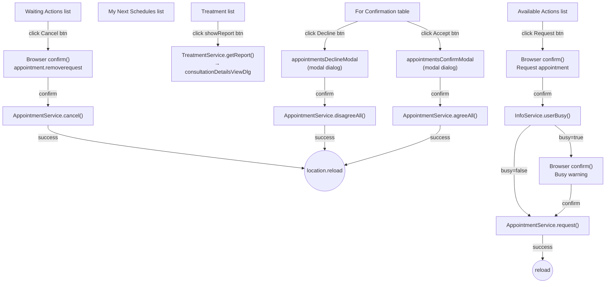

# Dashboard Self-Service Sections Analysis

**Source**: `videoclinic-prod/web/src/main/webapp/dash/index.htmlm` (lines 305-484)
**JS Handler**: `videoclinic-prod/web/src/main/webapp/dash/dash.js`
**Permission gate**: `{{#selfService}}` -> `SELF_ASSIGNMENT` authority
**Parent gate**: `{{#isStandard}}` (standard user role, not admin)

---

## Permission Gating Diagram

## Dialog Navigation Diagram

---

## Section 1: Available Actions (`#availableActions`)

**Container**: `div.col-md-3#availableActions`
**Card header**: icon `far fa-business-time`, title `{{{i18n.dash.scheduleNotFull}}}` (contains HTML)
**Loading state**: `div.loading` with preloader spinner — removed after `InfoService.getAvailableActions()` returns
**Empty state**: `div.none.card-body` with text `{{i18n.dialog.nonefound}}` — shown when data is empty array
**JS Init**: Separate jsForm with `prefix: "availableActions"`, loaded via `InfoService.getAvailableActions()` after 800ms delay

### Collection: availableActionList (data-field: `availableActions.availableActions`)

**Element**: `ul.list-group.list-group-flush.collection#availableActionList`
**Template element**: `li.list-group-item.actionItem`

| Field | Type | Datamodel | Display |
| :--- | :--- | :--- | :--- |
| Type abbreviation | field-display | `availableActions.iType` | Bold, inline |
| Weekday | field-display | `availableActions.wd` | Bold, inline |
| Date | field-display | `availableActions.date` | Bold, inline |
| Time start | field-display | `availableActions.timeStart` | Bold, inline, followed by " - " |
| Time end | field-display | `availableActions.timeEnd` | Bold, inline |
| Expert title | field-display | `availableActions.job.expertTitle` | Normal weight, block |
| Location name | field-display | `availableActions.location.name` | Normal weight, block |

#### Row Actions

| Action type | CSS class | Label | Icon | Behavior |
| :--- | :--- | :--- | :--- | :--- |
| click | `.request` | `{{i18n.request}}` | `fa fa-check` | 1. Calls `InfoService.userBusy(pojo)` to check conflicts. 2. If busy, shows `confirm(i18n.appointmet_request)`. 3. Shows HARDCODED German confirm dialog with appointment details. 4. Calls `AppointmentService.request([pojo.id])`. 5. Triggers `reload` event. |

**Button**: `btn btn-sm btn-secondary`, aligned right (`text-end`)

---

## Section 2: My Next Schedules (`#myActionList`)

**Container**: `div.col-md-4`
**Card header**: icon `far fa-user-hard-hat`, title `{{{i18n.dash.MyNextSchedules}}}` (contains HTML)
**No loading/empty state defined in template** (data comes from main `getDashInfo` response as `data.myActions`)

### Collection: myActionList (data-field: `data.myActions`)

**Element**: `ul.list-group.list-group-flush.collection#myActionList`
**Template element**: `li.list-group-item.actionItem`

| Field | Type | Datamodel | Display |
| :--- | :--- | :--- | :--- |
| Type abbreviation | field-display | `myActions.appointment.iType` | Bold, inline |
| Weekday | field-display | `myActions.appointment.wd` | Bold, inline |
| Date | field-display | `myActions.appointment.date` | Bold, inline |
| Time start | field-display | `myActions.appointment.timeStart` | Bold, inline, followed by " - " |
| Time end | field-display | `myActions.appointment.timeEnd` | Bold, inline |
| Expert title | field-display | `myActions.appointment.job.expertTitle` | Normal weight, block |
| Location name | field-display | `myActions.appointment.location.name` | Normal weight, block |

#### Row Actions (from JS)

| Action type | CSS class | Behavior |
| :--- | :--- | :--- |
| click (no button in template — handled via JS) | `.openAction` | Not present in template HTML but handled in JS: sets `pojo.action.reserved = pojo.reserved`, opens `#actionDlg` dialog with action data |

> **Note**: The `.openAction` class is not visible in the self-service template HTML for `myActionList`. The JS handler at line 461-466 binds to it, suggesting the list items may be clickable but the template only shows display fields without explicit action buttons.

---

## Section 3: Treatments (`#treatmentCard`)

**Container**: `div.col-md-4#treatmentCard`
**Card header**: icon `far fa-people-arrows`, title `{{i18n.Treatment}}`
**Visibility**: Hidden entirely if `data.treatments` is empty or null (controlled in JS reload handler lines 639-641)

### Collection: treatmentList (data-field: `data.treatments`)

**Element**: `tbody.collection#treatmentList` inside a `table.table`
**Template element**: `<tr>`

#### Table Headers

| Column | Icon | Tooltip |
| :--- | :--- | :--- |
| Book number | `far fa-user-injured` | `{{i18n.consultation.booknumber}}` |
| Date | `far fa-calendar` | (none) |
| Job/Location | `far fa-briefcase-medical` | `{{i18n.action.jobTitle}}` |
| Actions | (none) | (none) |

#### Collection Fields

| Field | Type | Datamodel | Display |
| :--- | :--- | :--- | :--- |
| Book number | field-display | `treatments.bookNumber` | Bold |
| J-Number | field-display | `treatments.jNumber` | Bold, inline with bookNumber |
| Next start date | field-display date | `treatments.next.start` | Date formatted |
| Location name | field-display | `treatments.location.name` | Normal |

#### Row Actions

| Action type | CSS class | Icon | Title | Behavior |
| :--- | :--- | :--- | :--- | :--- |
| click | `.showReport` | `fa fa-books-medical` | HARDCODED: "Dokumentation" | Conditionally shown: hidden if `pojo.lastReport` is falsy. Calls `TreatmentService.getReport([pojo.id, pojo.lastReport.id])`, opens `consultationDetailsViewDlg` dialog with result. |

**Button style**: `btn btn-sm btn-secondary`

---

## Section 4: For Confirmation (queued actions + waiting actions)

**Container**: `div.col-md-4`
**Card header**: icon `far fa-traffic-light`, title `{{{i18n.dash.forConfirmation}}}` (contains HTML), followed by `data.open` field-display (count of open items)

### Toolbar Buttons (btn-group)

| Button | ID | CSS class | Icon | Label | Behavior |
| :--- | :--- | :--- | :--- | :--- | :--- |
| Accept | `#acceptAppointments` | `btn btn-success accept` | `fa fa-check` | `{{i18n.appointment.confirmation.confirm}}` | Gets selected items via `getAllSelected()`, opens `#appointmentsConfirmModal` with items list, on confirm calls `AppointmentService.agreeAll([ids])`, shows loader, reloads page |
| Decline | `#disagreeAppointments` | `btn btn-sm btn-danger decline` | `fa fa-thumbs-down` | `{{i18n.appointment.confirmation.decline}}` | Gets selected items via `getAllSelected()`, opens `#appointmentsDeclineModal` with items list, on confirm calls `AppointmentService.disagreeAll([ids])`, shows loader, reloads page |
| Select All | `#selectAll` | `btn btn-sm btn-secondary` | `fa fa-square-check` | HARDCODED: "Alle auswahlen" | Toggles all checkboxes in `#queuedActionList`: if all selected, deselects all; otherwise selects all |

### Collection: queuedActionList (data-field: `data.queuedActions`)

**Element**: `tbody.collection.selectable#queuedActionList` with `data-multi="true"`
**Template element**: `tr.actionItem`
**Multi-select**: Enabled via `data-multi="true"` and per-row `input[type=checkbox].row-select`
**Row click behavior**: Clicking anywhere on row toggles the checkbox (unless clicking directly on the checkbox). Uses `.selected` class on `<tr>` for selection state.

| Field | Type | Datamodel | Display |
| :--- | :--- | :--- | :--- |
| (checkbox) | checkbox | — | Row selection for bulk actions |
| Reserve indicator | icon (conditional) | — | `fa fa-chair` with `class="reserve"`, tooltip `{{i18n.action.assignment.reserve}}` |
| Type abbreviation | field-display | `queuedActions.appointment.iType` | Bold, inline, `white-space: nowrap` |
| Weekday | field-display | `queuedActions.appointment.wd` | Bold, inline |
| Date | field-display | `queuedActions.appointment.date` | Bold, inline |
| Time start | field-display | `queuedActions.appointment.timeStart` | Bold, inline, followed by " - " |
| Time end | field-display | `queuedActions.appointment.timeEnd` | Bold, inline |
| Expert title | field-display | `queuedActions.appointment.job.expertTitle` | Normal, second column |
| Location name | field-display | `queuedActions.appointment.location.name` | Normal, below expert title (line break) |

#### Table Headers

| Column | Header text | Notes |
| :--- | :--- | :--- |
| Checkbox | (empty, `width: 1%`) | — |
| Date/time | HARDCODED: "Datum" | — |
| Type | HARDCODED: "Typ" | — |
| Actions | (empty, `text-end`) | — |

### Confirmation Modals

#### appointmentsConfirmModal

**Type**: Modal dialog (`data-target="modal"`)
**Title**: `{{i18n.appointment.agreeAppointments}}`
**Icon**: `far fa-calendar-plus`, Color: `bg-color-appointment`
**Content**: Collection `data.items` rendered as `ul.list-group` with `items.text` field-display
**On confirm**: Calls `AppointmentService.agreeAll([ids])` with loader

#### appointmentsDeclineModal

**Type**: Modal dialog (`data-target="modal"`)
**Title**: `{{i18n.appointment.disagreeAppointments}}`
**Icon**: `far fa-calendar-plus`, Color: `bg-color-appointment`
**Content**: Collection `data.items` rendered as `ul.list-group` with `items.text` field-display
**On confirm**: Calls `AppointmentService.disagreeAll([ids])` with loader

---

## Section 5: Waiting Actions (`#waitingActionList`)

**Container**: Inside the same `div.col-md-4` card as the "For Confirmation" section (shares card)
**No separate header** — renders below the queued actions table within the same card

### Collection: waitingActionList (data-field: `data.waitingActions`)

**Element**: `ul.list-group.list-group-flush.collection#waitingActionList`
**Template element**: `li.list-group-item.actionItem.text-muted`

| Field | Type | Datamodel | Display |
| :--- | :--- | :--- | :--- |
| Status icon | icon | — | `fa fa-question-circle` (static, always shown) |
| Type abbreviation | field-display | `waitingActions.appointment.iType` | Muted text, inline |
| Weekday | field-display | `waitingActions.appointment.wd` | Muted text, inline |
| Date | field-display | `waitingActions.appointment.date` | Muted text, inline |
| Time start | field-display | `waitingActions.appointment.timeStart` | Muted text, inline, followed by " - " |
| Time end | field-display | `waitingActions.appointment.timeEnd` | Muted text, inline |
| Expert title | field-display | `waitingActions.appointment.job.expertTitle` | Muted text, inline |
| Location name | field-display | `waitingActions.appointment.location.name` | Muted text, inline |

#### Row Actions

| Action type | CSS class | Icon | Label | Behavior |
| :--- | :--- | :--- | :--- | :--- |
| click | `.cancel` | `fa fa-trash` | HARDCODED: "Anfrage entfernen" | Shows `confirm(i18n.appointment_removerequest)`. On confirm, calls `AppointmentService.cancel([pojo.id])`, reloads page. |

**Button**: `btn btn-sm btn-secondary`, inside `btn-group d-block`

---

## Section 6: Aborted/Rejected Schedules

**Container**: `div.col-md-4`
**Card header**: icon `far fa-user-hard-hat`, title `{{{i18n.dash.abortedSchedules}}}` (contains HTML)
**No JS handler** — purely display, no row-level actions

### Collection: (unnamed, data-field: `data.rejectedAppointments`)

**Element**: `ul.list-group.list-group-flush.collection` (no ID)
**Template element**: `li.list-group-item.actionItem.text-muted`

| Field | Type | Datamodel | Display |
| :--- | :--- | :--- | :--- |
| Rejected icon | icon | — | `far fa-thumbs-down` (static) |
| Type abbreviation | field-display | `rejectedAppointments.appointment.iType` | Italic, muted |
| Weekday | field-display | `rejectedAppointments.appointment.wd` | Italic, muted |
| Date | field-display | `rejectedAppointments.appointment.date` | Italic, muted |
| Time start | field-display | `rejectedAppointments.appointment.timeStart` | Italic, muted, followed by " - " |
| Time end | field-display | `rejectedAppointments.appointment.timeEnd` | Italic, muted |
| Expert title | field-display | `rejectedAppointments.appointment.job.expertTitle` | Muted, not italic |
| Location name | field-display | `rejectedAppointments.appointment.location.name` | Muted, not italic |

---

## Data Loading Summary

| Data source | API call | JS target | Timing |
| :--- | :--- | :--- | :--- |
| Main dashboard data (`data.*`) | `InfoService.getDashInfo([-1])` | `#dashInfo` jsForm fill | On page load (800ms delay), populates: `data.myActions`, `data.treatments`, `data.queuedActions`, `data.waitingActions`, `data.rejectedAppointments`, `data.open` |
| Available actions | `InfoService.getAvailableActions([-1])` | `#availableActions` jsForm fill (separate prefix) | After main data loads, fills `{availableActions: data}` |

---

## Status Visualization

| Element | Icon | Color/Style | Meaning |
| :--- | :--- | :--- | :--- |
| Reserve indicator (queued actions) | `fa fa-chair` | Default (within bold text) | Appointment is reserved/pre-assigned |
| Waiting status | `fa fa-question-circle` | `text-muted` | Request is pending, not yet confirmed |
| Rejected indicator | `far fa-thumbs-down` | `text-muted` | Appointment was rejected/canceled |
| Loading spinner | preloader partial | — | Data is being fetched (availableActions only) |
| Empty state | — | `display:none` toggled | "None found" text when no available actions |

---

## Permissions

| Permission / Condition | Scope | Description |
| :--- | :--- | :--- |
| `SELF_ASSIGNMENT` | Entire self-service section (lines 305-484) | All 6 sub-sections are gated behind this permission via `{{#selfService}}` |
| `isStandard` (parent) | Wraps the selfService block | User must be a standard (non-admin) role |

---

## Naming and Translation

| Text-Reference | German | English | Notes |
| :--- | :--- | :--- | :--- |
| `{{i18n.dash.scheduleNotFull}}` | Nicht volle Einsatze | Unfilled schedules | Triple-mustache: contains HTML |
| `{{i18n.dash.MyNextSchedules}}` | Meine nachsten Einsatze | My next schedules | Triple-mustache: contains HTML |
| `{{i18n.Treatment}}` | Therapie | Treatment | |
| `{{i18n.dash.forConfirmation}}` | Zur Bestatigung | For confirmation | Triple-mustache: contains HTML |
| `{{i18n.dash.abortedSchedules}}` | Abgesagte/Abgelehnte Einsatze | Canceled/rejected schedules | Triple-mustache: contains HTML |
| `{{i18n.dialog.nonefound}}` | (framework) | None found | From corinis:webCore BaseResources.properties |
| `{{i18n.request}}` | Anfragen | Request | |
| `{{i18n.appointment.confirmation.confirm}}` | Annehmen | Accept | |
| `{{i18n.appointment.confirmation.decline}}` | Ablehnen | Decline | |
| `{{i18n.action.assignment.reserve}}` | Reserviert/Vorgemerkt | Reserved | Used as tooltip on chair icon |
| `{{i18n.consultation.booknumber}}` | Buchnummer | Book number | Tooltip on column header icon |
| `{{i18n.action.jobTitle}}` | Dienstleistung | Job | Tooltip on column header icon |
| `{{i18n.appointment.agreeAppointments}}` | Sind Sie sicher, dass Sie alle Termine annehmen mochten? | Are you sure you want to accept all selected appointments? | Modal title |
| `{{i18n.appointment.disagreeAppointments}}` | Sind Sie sicher, dass Sie alle Termine ablehnen mochten? | Are you sure you want to decline all selected appointments? | Modal title |
| `i18n.appointment_removerequest` (JS) | Hiermit wird die Terminanfrage von Ihnen zuruckgenommen... | Hereby you are retracting the appointment-request... | Used in `confirm()` dialog in JS |
| `i18n.appointmet_request` (JS) | (not found in properties — likely typo of `appointment_request`) | — | Used in busy-check confirm; key may be missing or aliased |
| — | **"Alle auswahlen"** | **Select all** | **HARDCODED** German on `#selectAll` button |
| — | **"Datum"** | **Date** | **HARDCODED** German table header in queued actions |
| — | **"Typ"** | **Type** | **HARDCODED** German table header in queued actions |
| — | **"Dokumentation"** | **Documentation** | **HARDCODED** German tooltip on showReport button in treatments |
| — | **"Anfrage entfernen"** | **Remove request** | **HARDCODED** German button label in waiting actions |
| — | **"Folgenden Termin anfragen: '...'?"** | **"Request the following appointment: '...'?"** | **HARDCODED** German confirm dialog text in `availableActionList` JS handler (line 433-435) |
| — | **"Sie erhalten eine seperate Bestatigung bei Zuteilung..."** | **"You will receive a separate confirmation upon assignment..."** | **HARDCODED** German, continuation of the request confirm dialog (line 434-435) |

---

## Datamodel Mapping Diagram

```mermaid
classDiagram
    class AvailableActions {
        <<separate API call>>
        availableActions[] : repeater
        availableActions.iType : string
        availableActions.wd : string
        availableActions.date : string
        availableActions.timeStart : string
        availableActions.timeEnd : string
        availableActions.job.expertTitle : string
        availableActions.location.name : string
        availableActions.id : string [action param]
    }

    class DashInfo {
        <<main API response>>
        data.open : number
        data.myActions[] : repeater
        data.treatments[] : repeater
        data.queuedActions[] : repeater
        data.waitingActions[] : repeater
        data.rejectedAppointments[] : repeater
    }

    class MyAction {
        myActions.appointment.iType : string
        myActions.appointment.wd : string
        myActions.appointment.date : string
        myActions.appointment.timeStart : string
        myActions.appointment.timeEnd : string
        myActions.appointment.job.expertTitle : string
        myActions.appointment.location.name : string
        myActions.reserved : boolean [JS only]
        myActions.action : object [JS only]
    }

    class Treatment {
        treatments.bookNumber : string
        treatments.jNumber : string
        treatments.next.start : date
        treatments.location.name : string
        treatments.id : string [action param]
        treatments.lastReport : object|null [JS conditional]
        treatments.lastReport.id : string [action param]
    }

    class QueuedAction {
        queuedActions.appointment.iType : string
        queuedActions.appointment.wd : string
        queuedActions.appointment.date : string
        queuedActions.appointment.timeStart : string
        queuedActions.appointment.timeEnd : string
        queuedActions.appointment.job.expertTitle : string
        queuedActions.appointment.location.name : string
        queuedActions.id : string [action param]
    }

    class WaitingAction {
        waitingActions.appointment.iType : string
        waitingActions.appointment.wd : string
        waitingActions.appointment.date : string
        waitingActions.appointment.timeStart : string
        waitingActions.appointment.timeEnd : string
        waitingActions.appointment.job.expertTitle : string
        waitingActions.appointment.location.name : string
        waitingActions.id : string [action param]
    }

    class RejectedAppointment {
        rejectedAppointments.appointment.iType : string
        rejectedAppointments.appointment.wd : string
        rejectedAppointments.appointment.date : string
        rejectedAppointments.appointment.timeStart : string
        rejectedAppointments.appointment.timeEnd : string
        rejectedAppointments.appointment.job.expertTitle : string
        rejectedAppointments.appointment.location.name : string
    }

    DashInfo --> MyAction
    DashInfo --> Treatment
    DashInfo --> QueuedAction
    DashInfo --> WaitingAction
    DashInfo --> RejectedAppointment
```

---

## API Service Calls (Self-Service)

| Service | Method | Parameters | Trigger | Response handling |
| :--- | :--- | :--- | :--- | :--- |
| `InfoService` | `getDashInfo` | `[-1]` | Page load (800ms delay) | Fills `#dashInfo` jsForm — populates all `data.*` collections |
| `InfoService` | `getAvailableActions` | `[-1]` | After `getDashInfo` completes | Fills `#availableActions` jsForm; shows `.none` if empty, removes `.loading` |
| `InfoService` | `userBusy` | `[appointment]` | Before requesting an available action | Returns boolean; if true, shows busy warning confirm |
| `AppointmentService` | `request` | `[pojo.id]` | User confirms request for available action | Triggers `reload` event, removes list item |
| `AppointmentService` | `agreeAll` | `[ids[]]` | Accept button on confirmation modal | Shows loader, reloads page on success |
| `AppointmentService` | `disagreeAll` | `[ids[]]` | Decline button on decline modal | Shows loader, reloads page on success |
| `AppointmentService` | `cancel` | `[pojo.id]` | Cancel button on waiting action | Reloads page on success |
| `TreatmentService` | `getReport` | `[pojo.id, pojo.lastReport.id]` | Click showReport on treatment row | Opens `consultationDetailsViewDlg` with report data |

---

## Layout Summary

| Section | Grid | Card style | Header color |
| :--- | :--- | :--- | :--- |
| Available Actions | `col-md-3` | card with list-group | `bg-color-shift text-white` |
| My Next Schedules | `col-md-4` | card with list-group | `bg-color-shift text-white` |
| Treatments | `col-md-4` | card with table | `bg-color-shift text-white` |
| For Confirmation + Waiting | `col-md-4` | card with table + list-group | Default (no bg-color-shift) |
| Aborted/Rejected | `col-md-4` | card with list-group | `bg-color-shift text-white` |

> **Note**: The "For Confirmation" card header lacks `bg-color-shift text-white` — this appears intentional to visually distinguish it as requiring user action.
