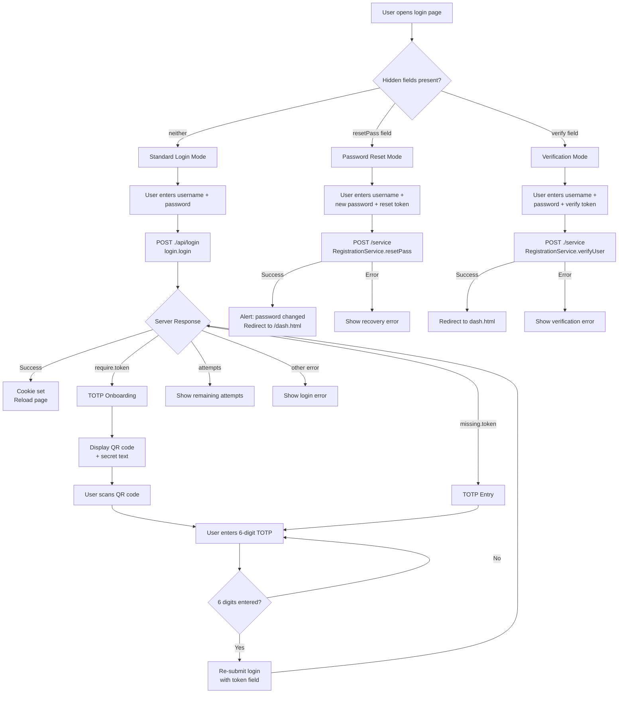
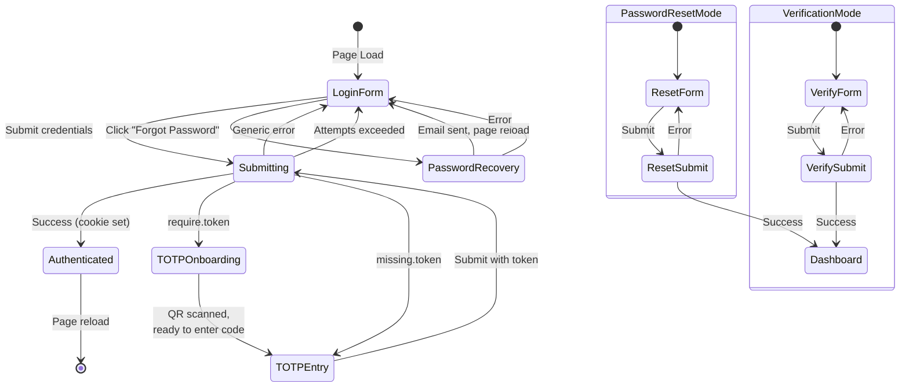
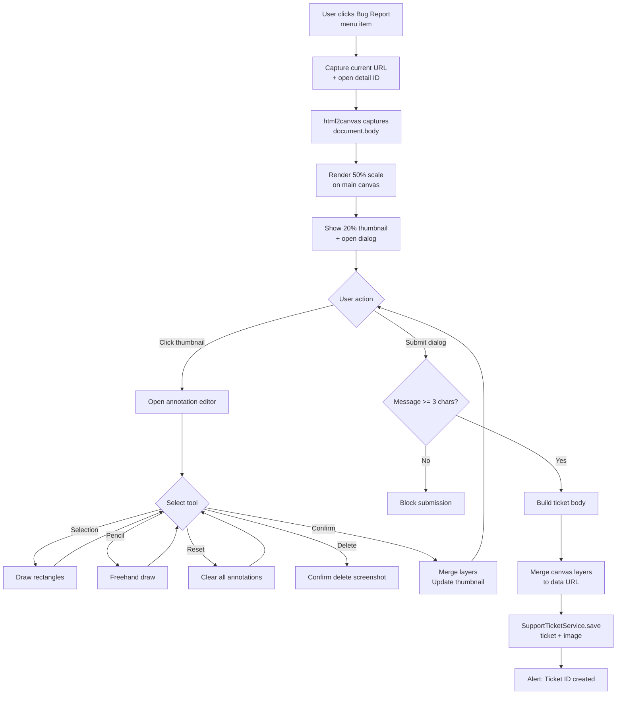

# 02 -- Includes: Customization, Login, and Global Overrides

> **Source directory:** `web/src/main/webapp/_include/`
> **Files analyzed:** `customOverride.js` (157 lines), `customOverride.i18n.js` (96 lines), `categories.css` (160 lines), `instance.css` (3 lines), `login.js` (283 lines), `bugReport/bugReport.html` (~64 lines), `bugReport/bugReport.js` (~120 lines), `bugReport/captureScreen.js` (~342 lines), `bugReport/messages.i18n.js` (2 lines)

---

## Block 1: Custom Overrides (`customOverride.js`)

### Purpose

Global application-level utilities injected on every page. Despite the name "CustomOverride," this file does **not** contain entity-specific Formatters (those live in `customOverride.i18n.js`). Instead it provides:

1. **Layout helper** -- `setMainHeight(ele)`: Calculates remaining viewport height below the header/alert panel and sets `max-height` + `overflow:auto` on `#main` (or any element). Registers a `window.resize` listener for dynamic adjustment. Prevents duplicate listeners via `ele.data().resizeWithWindow`.

2. **App detection** -- `inApp()` / `getAppDto()`: Checks `window.dto` to determine if running inside an embedded app context (vs. standalone webpage).

3. **Toast notifications** -- `notifyInline(title, message)`: Renders a Bootstrap `.toast` with a close button. Used as fallback when browser notifications are denied.

4. **Browser notifications** -- `notifyMe(title, message)`: Requests `Notification` permission, shows native browser notification. On click navigates to `/notification.html`. Falls back to `notifyInline` when denied.

5. **Notification badge** -- `updateNotificationCount(value)`: Updates the unread-message badge on the sidebar nav link (`#mainNav a[href='/notification.html'] .fa-comments`). Displays "9+" for counts >= 10. Shows/hides badge based on count > 0.

6. **Notification polling** -- On page load, calls `InfoService.getNotification(-1)` every 30 seconds (initial delay 5s). If response includes `loadDash` and the user is on a dashboard page, triggers a `reload` event. Also reads `body[data-unread]` attribute for initial badge count.

7. **Session timeout handler** -- Listens for `server.sessionTimeout` event. Shows a `confirm()` dialog (`i18n.dialog_sessiontimeout`). If confirmed, reloads the page to trigger re-login.

8. **Remote logging** -- `sendLog(type, msg)`: Sends log entries to server via `AdminService.log(type, msg)`.

9. **Init hook** -- `initApp()`: Fires the `initApp` custom event on `document`.

### Server API Calls

| Function | Service | Method | Parameters | Notes |
|---|---|---|---|---|
| Notification polling | `InfoService` | `getNotification` | `[-1]` | Returns `{title, message, loadDash, total}` |
| Remote logging | `AdminService` | `log` | `[type, msg]` | Fire-and-forget |

### Hardcoded Strings

| String | Location | Language |
|---|---|---|
| `'/notification.html'` | `notifyMe` onclick | -- (URL) |
| `'/dash.html'` | Commented out in login redirect | -- (URL) |

---

## Block 2: Custom i18n Overrides (`customOverride.i18n.js`)

### Purpose

Sets application-specific `i18n.*` keys (using the `$[key]` server-side template syntax to inject translations from `.properties` files) and defines **custom Formatters** used by the SlickGrid-based table framework across all modules.

### i18n Key Overrides

| JS Key | Properties Key | Purpose |
|---|---|---|
| `i18n.consultation` | `consultation` | Entity label |
| `i18n.tasks` | `tasks` | Entity label |
| `i18n.contact` | `contact` | Entity label |
| `i18n.patient` | `patient` | Entity label |
| `i18n.invoice` | `invoice` | Entity label |
| `i18n.location` | `location` | Entity label |
| `i18n.account` | `account` | Entity label |
| `i18n.treatment` | `treatment` | Entity label |
| `i18n.languageskills` | `languageSkills` | Entity label |
| `i18n.user_doctor` | `user.doctor` | Role label |
| `i18n.day.{MO..SU,HO}` | `WeekDay.{MO..SU,HO}` | Weekday names |
| `i18n.month.{JAN..DEC}` | `Month.{JAN..DEC}` | Month names |

### Formatter Registry

All Formatters follow the SlickGrid signature: `(row, cell, value, columnDef, dataContext) => string`.

| Formatter | Input Type | Rendering Logic | Used By |
|---|---|---|---|
| `Formatter.code` | `{code: string}` | Returns `value.code` or empty string | Code/enum displays |
| `Formatter.address` | `{address, address2, zip, city, country, addressInfo}` | Joins all non-null fields with space separator | Location/customer addresses |
| `Formatter.time` | `number` (HHMM encoded, e.g. `930` = 09:30) | Converts numeric time to `HH:MM` format. Math: `ceil(value/100)` for hours, `value%100` for minutes, zero-padded | Shift/schedule time displays |
| `Formatter.weekday` | `string` (e.g. `"MO"`) | Looks up `i18n.day[value]` | Schedule views |
| `Formatter.month` | `number` (1-12) | Switch-case maps to `i18n.month.*` | Calendar/date displays |
| `Formatter.locationCustomer` | `{customer: {name: string}}` | Returns nested `value.customer.name` | Location list views |

> **Note:** Entity-specific Formatters referenced in other analysis documents (`Formatter.employeestate`, `Formatter.shift`, `Formatter.appointment`, `Formatter.therapy`, `Formatter.notificationFolder`) are **not** defined here. They are likely defined in module-specific JS files or the framework itself.

---

## Block 3: Category Colors (`categories.css`)

### Purpose

Defines the complete application color system used by all modules for entity type identification, appointment/treatment/shift state styling, and calendar UI. Referenced globally via CSS class names.

### Entity Category Color Map

| # | CSS Class(es) | Hex Color | Entity Types |
|---|---|---|---|
| 1 | `.bg-color1`, `.bg-color-dash`, `.bg-color-log`, `.bg-color-warning` | `#e94b3b` | Dashboard, Logs, Warnings |
| 2 | `.bg-color2`, `.bg-color-appointment`, `.bf-color-calendar`, `.bg-color-expertWorkMonthly` | `#f98e33` | Appointments, Calendar, Expert Work |
| -- | `.bg-color-action`, `.bg-color-shift` | `#fcae53` | Actions, Shifts |
| -- | `.bg-color-treatment` | `#ffb61c` | Treatments |
| -- | `.bg-color-council` | `#b7c317` | Councils |
| 3 | `.bg-color3`, `.bg-color-consultation`, `.bg-color-basisWebData` | `#8aac13` | Consultations, Base Web Data |
| 4 | `.bg-color4`, `.bg-color-appointmentAdmin`, `.bg-color-equipment`, `.bg-color-room` | `#23ae89` | Appointment Admin, Equipment, Rooms |
| 5 | `.bg-color5`, `.bg-color-videoCategory`, `.bg-color-video` | `#198754` | Video Categories, Videos |
| 6 | `.bg-color6`, `.bg-color-notify`, `.bg-color-product` | `#2ec1cc` | Notifications, Products |
| 7 | `.bg-color7`, `.bg-color-infrastructure`, `.bg-color-userVideoHistory` | `#449dd5` | Infrastructure, Video History |
| 8 | `.bg-color8`, `.bg-color-customer`, `.bg-color-invoice` | `#1c7ebb` | Customers, Invoices |
| 9 | `.bg-color9`, `.bg-color-user`, `.bg-color-staff`, `.bg-color-onboardingStep` | `#6a55c2` | Users, Staff, Onboarding |
| -- | `.bg-admin`, `.bg-administration`, `.bg-color-administration` | `#aaaaaa` | Administration |
| -- | `.bg-sysadmin` | `#888888` | System Administration |

### Global Nav

```css
#globalNav { border-left-color: #007bb7; }
```

### Appointment State Colors

| CSS Class | State | Hex Color | Font Weight | Notes |
|---|---|---|---|---|
| `.ap-lockedin` | Locked In | `#c6e0b4` | bold | Green tint |
| `.ap-active` | Active | `#ffff00` | bold | Bright yellow |
| `.ap-ready` | Ready | `#fff2cc` | normal | Light yellow |
| `.ap-started` | Started | `#ded8fc` | normal | Light purple |
| `.ap-requested` | Requested | `#c093f1` | normal | Purple |
| `.ap-closed` | Closed | `#AAC918` | normal | Olive green |
| `.ap-canceled` | Canceled | `#ffc000` | bold | Orange |
| `.ap-storno` | Storno (Reversed) | `#ff0000` | bold | Red |
| `.ap-rescheduled` | Rescheduled | `rgb(192, 28, 40)` | bold | Dark red |
| `.ap-done` | Done | `#38B2D8` | bold | Cyan |
| `.ap-archived` | Archived | `#DAD8D8` | italic | Light gray |

### Treatment State Colors

| CSS Class | State | Hex Color |
|---|---|---|
| `.tr-prepared` | Prepared | `#dc8add` |
| `.tr-ready` | Ready | `#fff2cc` |
| `.tr-started` | Started | `#ded8fc` |
| `.tr-probatorik` | Probatorik (Trial) | `#ff99cc` |
| `.tr-running` | Running | `#57e389` |
| `.tr-ending` | Ending | `#ffa348` |
| `.tr-closed` | Closed | `#aac918` |
| `.tr-canceled` | Canceled | `#ffc000` |
| `.tr-canceled_closed` | Canceled+Closed | `#ff8300` |
| `.tr-storno` | Storno (Reversed) | `#ff5733` |
| `.tr-storno_closed` | Storno+Closed | `#dd1f1f` |
| `.tr-paused` | Paused | `#b5835a` |

### Generic State Colors (Shift Assignments / Scheduling)

| CSS Class | State | Hex Color |
|---|---|---|
| `.state-added` | Added | `#fff2cc` |
| `.state-agree` | Agreed | `#c6e0b4` |
| `.state-canceled` | Canceled | `#e0ccb4` |
| `.state-missing` | Missing | `#ea4d5b` |
| `.state-accepted` | Accepted | `#fcaf3e` |
| `.state-reserved` | Reserved | `#edd400` |
| `.state-rejected` | Rejected | `#f8d7da` |
| `.state-double-booked` | Double Booked | `#f8d7da` |
| `.state-disagreed` | Disagreed | `#e2a3bd` |
| `.state-aborted` | Aborted | `#e2a3bd` |

Each of the above also has an `-icon` variant (e.g. `.state-added-icon`) that adds a 2px colored border, `border-radius: 5px`, and `box-shadow: 0 2px 4px rgba(0,0,0,0.2)`.

### Calendar / Self-Assignment Colors

| CSS Class | Hex Color | Usage |
|---|---|---|
| `.selfAssigned` | `#66FFCC` | Self-assigned shift highlight |
| `.rejected` | `#FF7C80` | Shift rejection |
| `.doubleBooked` | `#FF99CC` | Double booking conflict |
| `.reserved` | `#99CCFF` | Reserved slot |
| `.accepted` | `#c6e0b4` | Accepted assignment |
| `.disagreed` | `#FF0066` | Disagreement |
| `.agreed` | `#c6e0b4` | Agreement |
| `.reservedAgreed` | `#6699FF` | Reserved + Agreed |
| `.canceled` | `#e0ccb4` | Canceled |

### Utility Colors

| CSS Class | Hex Color | Usage |
|---|---|---|
| `.star` | `#ffcc00` | Star/rating icon |
| `.green` | `#c6e0b4` | Generic positive |
| `.red` | `#FF0066` | Generic negative |
| `.weekend` | `#DAD8D8` | Weekend day background |
| `.publicHoliday` | `#fff2cc` | Public holiday background |
| `.missing` | border `#e83333`, bg `#FFDDDD` | Missing/required field |
| `.clickable:hover` | `#006ee0` | Hover state for clickable elements |

### Instance CSS (`instance.css`)

Empty placeholder (comment only). Overwritten during deployment for per-instance branding. This is the extension point for white-labeling.

---

## Block 4: Login Flow (`login.js`)

### Purpose

Complete client-side authentication flow handling: username/password login, TOTP 2FA onboarding and verification, password reset, user verification, and session management.

### Authentication Modes

The login form operates in three modes based on the presence of hidden input fields:

1. **Standard Login** -- Default: `username` + `password` fields only
2. **Password Reset** -- When `input[name='resetPass']` exists (from URL token)
3. **User Verification** -- When `input[name='verify']` exists (from verification link)

### Server API Calls

| Flow | Service URL | Service | Method | Parameters | Response |
|---|---|---|---|---|---|
| Standard login | `./api/login` | `login` | `login` | `[{user, password, autologin, token?}]` | Cookie set, reload |
| Password reset | `/service` | `RegistrationService` | `resetPass` | `[username, newPassword, resetToken]` | Success message |
| User verification | `./service` | `RegistrationService` | `verifyUser` | `[username, password, verifyToken]` | Cookie set, redirect |
| Password recovery | `./service` | `RegistrationService` | `recoverPassword` | `[username]` | Email sent confirmation |

### Login Error Handling

| Error Code | Meaning | UI Response |
|---|---|---|
| `require.token` | TOTP not yet set up; server returns secret in `er.message` | Show QR code onboarding dialog with secret |
| `missing.token` | TOTP configured but token not provided | Show TOTP entry dialog (6-digit input) |
| `attempts` | Too many failed attempts | Show remaining attempts count (`er.value`) |
| (any other) | Generic login failure | Show `#loginError` block |
| `er.longMessage` | Detailed error message from server | Rendered as HTML in `.detail` span |

### TOTP Onboarding Flow

1. User submits username + password
2. Server responds with `require.token` error; `er.message` contains the TOTP secret URI (format: `otpauth://totp/...?secret=SECRET&...`)
3. Client extracts the secret from the URI
4. QR code is rendered using `QRCode` library (128x128, black/white, correction level M)
5. Secret is displayed as text (`#totpTokenSecret`)
6. User scans QR code with authenticator app
7. User enters 6-digit TOTP code
8. Login is re-submitted with `token` field appended to original credentials

### TOTP Input Widget

Six individual `input.single-digit` fields with keyboard handling:
- **Arrow keys** (37/39): Navigate between digits
- **Backspace** (8): Clear current + move to previous
- **Delete** (46): Clear current
- **Paste** (Ctrl+V / keyCode 86): Split pasted value across all fields
- **Numeric input**: Fill current field, auto-advance to next
- **Last digit entry**: Auto-submits the token

### Password Recovery Flow

1. User enters username (minimum 3 chars, no spaces)
2. Client calls `RegistrationService.recoverPassword([username])`
3. On success: shows alert `i18n.password_recorvery_email_sent`, reloads page
4. On error: shows `#recoveryError` with `er.longMessage`

### Anti-Spam Protection

- Login button gets `.disabled` class during request
- Re-enabled after 1 second via `setTimeout` in `finally` block
- Prevents rapid resubmission

### Session Management

- On successful login: `location.href = window.location.href` + `location.reload()` (double reload ensures cookie is picked up)
- On password reset success: redirects to `/dash.html`
- On verification success: redirects to `dash.html`

---

## Block 5: Bug Report (`bugReport/`)

### Purpose

In-app bug reporting system with automatic screen capture, annotation tools, and ticket submission to a backend support system.

### Components

#### 5.1 Bug Report Dialog (`bugReport.html`)

**Structure:**
- Trigger: `<a id="createBugReport">` dropdown menu item with camera icon (`fa-camera-retro`)
- Dialog: `#bugReportDlg` -- standard framework dialog with `data-target="secondary"`, `data-width="1000"`, `data-color="bg-color-customer"` (blue)

**Form Fields:**
- Subject input: `name="data.errorReport.subject"`, mandatory, prefilled with "Problem"
- Message textarea: `name="data.errorReport.message"`, mandatory, markdown-enabled (`.markdownedit`), 250px height
- Screenshot preview: 100x100 thumbnail, click to open editor
- Screenshot editor toolbar: Reset, Selection tool, Pencil, Color picker, Delete, Confirm

**Hardcoded strings in HTML:**
- `"Bildschirmaufnahme"` (German: "Screen capture") -- hardcoded `<h6>` heading

#### 5.2 Bug Report Logic (`bugReport.js`)

**Error Capture:**
- Global `window.error` listener captures last JS error (message, filename, lineno, colno, stack)
- Global `unhandledrejection` listener captures unhandled promise rejections
- Error info is attached to bug report body if present

**Submission Flow:**
1. User clicks `#createBugReport`
2. System captures current URL and any open detail panel ID (`$(".detail.show").data().pojo.id`)
3. After 100ms delay, initiates screen capture and opens dialog
4. On dialog confirm (with validation: message >= 3 chars):
   - Captures annotated screenshot as data URL
   - Builds ticket body with sections separated by `---`:
     - `Fehlerbericht:` (Error Report) + URL
     - `Detail-ID:` + open detail ID (if any)
     - `Benutzernachricht:` (User Message) + user text
     - `Fehlermeldung:` (Error Message) + JS error JSON
5. Submits via `SupportTicketService.save([ticket, image])`
6. Shows alert with ticket ID and number: `"Ihr Ticket {id}/{ticketNumber} wurde erstellt."`

**Hardcoded strings in JS:**
- `"Fehlerbericht:\n"` (German)
- `"Detail-ID:\n"` (German)
- `"Benutzernachricht:\n"` (German)
- `"Fehlermeldung:\n"` (German)
- `"Ihr Ticket "+ result.id +"/"+result.ticketNumber+" wurde erstellt."` (German)
- `"Problem"` (default subject)

#### 5.3 Screen Capture Engine (`captureScreen.js`)

**Architecture:** Three-layer canvas system:
1. **Main canvas** -- Base screenshot (rendered by `html2canvas`, scaled to 50%)
2. **Selection overlay** -- Rectangle annotations (z-index 10, crosshair cursor)
3. **Pencil overlay** -- Freehand drawing annotations

**Tools:**
| Tool | Button ID | Behavior |
|---|---|---|
| Selection | `#captureCanvasSelect` | Draw rectangular outlines on overlay canvas |
| Pencil | `#captureCanvasPencil` | Freehand drawing, 4px line width, round cap |
| Reset | `#captureCanvasReset` | Clears all annotations, resets to default tool |
| Delete | `#captureCanvasDelete` | Deletes entire screenshot (with confirmation) |
| Confirm | `#captureCanvasConfirm` | Merges layers, updates thumbnail, closes editor |
| Color Picker | `#captureCanvasColorPicker input[type=color]` | Default `#ff0000`, applies to both tools |

**Thumbnail system:** 20% scale preview thumbnail shown after capture. Click to open full editor. Confirm regenerates thumbnail with annotations merged.

**Export:** `getScreen()` merges all three canvas layers into a single `dataURL` for submission. Returns `null` if user deleted the image.

### Server API Calls (Bug Report)

| Function | Service | Method | Parameters | Response |
|---|---|---|---|---|
| Submit bug report | `SupportTicketService` | `save` | `[{title, body}, imageDataUrl]` | `{id, ticketNumber}` |

---

## Block 6: Color Mapping Table (Complete)

| Entity / Context | CSS Class | Hex Color | RGB |
|---|---|---|---|
| Dashboard / Logs / Warnings | `.bg-color-dash` | `#e94b3b` | 233, 75, 59 |
| Appointments / Calendar | `.bg-color-appointment` | `#f98e33` | 249, 142, 51 |
| Actions / Shifts | `.bg-color-shift` | `#fcae53` | 252, 174, 83 |
| Treatments | `.bg-color-treatment` | `#ffb61c` | 255, 182, 28 |
| Councils | `.bg-color-council` | `#b7c317` | 183, 195, 23 |
| Consultations | `.bg-color-consultation` | `#8aac13` | 138, 172, 19 |
| Rooms / Equipment | `.bg-color-room` | `#23ae89` | 35, 174, 137 |
| Videos | `.bg-color-video` | `#198754` | 25, 135, 84 |
| Notifications / Products | `.bg-color-notify` | `#2ec1cc` | 46, 193, 204 |
| Infrastructure | `.bg-color-infrastructure` | `#449dd5` | 68, 157, 213 |
| Customers / Invoices | `.bg-color-customer` | `#1c7ebb` | 28, 126, 187 |
| Users / Staff | `.bg-color-user` | `#6a55c2` | 106, 85, 194 |
| Administration | `.bg-administration` | `#aaaaaa` | 170, 170, 170 |
| System Administration | `.bg-sysadmin` | `#888888` | 136, 136, 136 |

---

## Block 7: Formatter Registry (Complete)

| Formatter | Input | Output | Null Handling | Notes |
|---|---|---|---|---|
| `Formatter.code` | `{code: string}` | `value.code` | Returns `''` | Simple property extraction |
| `Formatter.address` | `{address, address2, zip, city, country, addressInfo}` | Space-joined non-null fields | Returns `''` | Filters falsy values |
| `Formatter.time` | `number` (HHMM) | `"HH:MM"` string | Returns `''` | `930` -> `"09:30"`, `1430` -> `"14:30"` |
| `Formatter.weekday` | `string` (`"MO"`, `"TU"`, etc.) | Localized weekday name | Returns `''` | i18n lookup |
| `Formatter.month` | `number` (1-12) | Localized month name | Returns `''` | Switch-case + i18n lookup |
| `Formatter.locationCustomer` | `{customer: {name: string}}` | Customer name string | Returns `''` | Nested null check |

---

## Block 8: Server API Calls (All)

| Caller | Service | Method | Parameters | Trigger | Auth Required |
|---|---|---|---|---|---|
| customOverride.js | `InfoService` | `getNotification` | `[-1]` | 30s polling (5s initial) | Yes (session) |
| customOverride.js | `AdminService` | `log` | `[type, msg]` | On `sendLog()` call | Yes (session) |
| login.js | `login` | `login` | `[{user, password, autologin, token?}]` | Form submit | No (pre-auth) |
| login.js | `RegistrationService` | `resetPass` | `[username, newPassword, resetToken]` | Reset form submit | No (token-based) |
| login.js | `RegistrationService` | `verifyUser` | `[username, password, verifyToken]` | Verify form submit | No (token-based) |
| login.js | `RegistrationService` | `recoverPassword` | `[username]` | "Forgot password" click | No |
| bugReport.js | `SupportTicketService` | `save` | `[{title, body}, imageDataUrl]` | Dialog confirm | Yes (session) |

---

## Block 9: Translation Table

### Login & Authentication

| Key | EN | DE | Source |
|---|---|---|---|
| `login` | Login | Anmeldung | properties |
| `login.username` | User | E-Mail | properties |
| `login.password` | Password | Passwort | properties |
| `login.autologin` | Autologin | Automatisch Anmelden | properties |
| `login.recoverPassword` | Forgot Password | Passwort vergessen | properties |
| `login.resetPass` | *(not in EN)* | Passwort Wiederherstellen | properties |
| `login.verify` | *(not in EN)* | Verifizierung | properties |
| `login.timeout` | Session Timeout | Ihre Sitzung ist Abgelaufen | properties |
| `login.timeout.description` | Your session has timed out. Please re-login... | Ihre Sitzung ist abgelaufen. Um weiter zu arbeiten... | properties |
| `passwordChange.success` | The password has been successfully changed... | Das Passwort wurde erfolgreich geaendert... | properties |
| `passwordRecorvery.emailSent` | You will shortly receive an e-mail... | Sie erhalten in Kuerze ein E-Mail... | properties |
| `passwordRecorvery.userNotFound` | User not found. Please check your login. | Ihr Benutzer wurde nicht gefunden... | properties |
| `errors.password.remainingAttempts` | Remaining Attempts | Verbleibende Versuche | properties |
| `user.requireTotp` | Require Two-Factor | 2-Faktor verpflichtend | properties |
| `user.password.change.rule1` | contain at least 8 characters | mindestens 8 Zeichen enthalten | properties |
| `user.password.change.rule2` | ...uppercase and lowercase letter | ...Gross und einen Kleinbuchstaben... | properties |
| `user.password.change.rule3` | ...special or numeric character | ...Sonderzeichen oder eine Ziffer... | properties |
| `user.password.change.rule4` | ...too commonly used... | ...zu haeufig verwendet... | properties |

### Bug Report

| Key | EN | DE | Source |
|---|---|---|---|
| `bureport.title` | Bug Report | Bug Report | properties |
| `bugReport.deleteImageConfirm` | This action will delete whole bug report attachment. Are you sure? | Diese Aktion loescht den gesamten Anhang des Fehlerberichts. Sind Sie sicher? | properties |
| `email.subject` | Subject | Betreff | properties |
| `screenshot.action.confirm` | Confirm | Bestaetigen | properties |
| `screenshot.action.delete` | Delete | Loeschen | properties |
| `screenshot.action.pencil` | Pencil | Pinsel | properties |
| `screenshot.action.reset` | Reset | Zuruecksetzen | properties |
| `screenshot.action.selection` | Selection Tool | Auswahlwerkzeug | properties |

### Weekdays

| Key | EN | DE |
|---|---|---|
| `WeekDay.MO` | Monday | Montag |
| `WeekDay.TU` | Tuesday | Dienstag |
| `WeekDay.WE` | Wednesday | Mittwoch |
| `WeekDay.TH` | Thursday | Donnerstag |
| `WeekDay.FR` | Friday | Freitag |
| `WeekDay.SA` | Saturday | Samstag |
| `WeekDay.SU` | Sunday | Sonntag |
| `WeekDay.HO` | Holiday | Feiertags |

### Months

| Key | EN | DE |
|---|---|---|
| `Month.JAN` | January | Januar |
| `Month.FEB` | February | Februar |
| `Month.MAR` | March | Maerz |
| `Month.APR` | April | April |
| `Month.MAY` | May | Mai |
| `Month.JUN` | June | Juni |
| `Month.JUL` | July | Juli |
| `Month.AUG` | August | August |
| `Month.SEP` | September | September |
| `Month.OCT` | October | Oktober |
| `Month.NOV` | November | November |
| `Month.DEC` | December | Dezember |

### HARDCODED Strings (Not in Properties)

| String | Language | File | Line |
|---|---|---|---|
| `"Bildschirmaufnahme"` | DE | bugReport.html | 28 |
| `"Fehlerbericht:\n"` | DE | bugReport.js | 88 |
| `"Detail-ID:\n"` | DE | bugReport.js | 92 |
| `"Benutzernachricht:\n"` | DE | bugReport.js | 96 |
| `"Fehlermeldung:\n"` | DE | bugReport.js | 100 |
| `"Ihr Ticket {id}/{ticketNumber} wurde erstellt."` | DE | bugReport.js | 68 |
| `"Problem"` | EN/DE | bugReport.js | 54 |
| `'/notification.html'` | -- | customOverride.js | 81 |

---

## Block 10: Mermaid Diagrams

### Login Flow



### Authentication State Machine



### Bug Report Flow



---

## Migration Notes for React/Shadcn Reimplementation

### Category Colors
- Map the entity color palette to Tailwind CSS custom properties or a `colors` config in `tailwind.config.ts`.
- State colors (appointment, treatment, shift) should become a typed `statusColor` utility function rather than CSS classes.
- Consider using CSS custom properties for theme-ability: `--color-entity-appointment: #f98e33;`.

### Formatters
- Replace SlickGrid Formatters with TanStack Table cell renderers (React components).
- `Formatter.time` logic (HHMM numeric to HH:MM string) should become a shared utility.
- `Formatter.address` should become a component that handles optional fields gracefully.
- Weekday/month formatting should use `Intl.DateTimeFormat` or `date-fns` locale support instead of custom i18n maps.

### Login
- Replace with Better Auth flows (already in the new stack).
- TOTP onboarding: use shadcn `InputOTP` component instead of custom single-digit inputs.
- Password recovery: map to Better Auth's password reset flow.
- Session timeout: use Better Auth session management + React state.

### Bug Report
- Replace `html2canvas` with a modern alternative or keep it.
- Canvas annotation tools can be replaced with a lightweight annotation library or custom React canvas component.
- Replace `SupportTicketService.save` with an oRPC procedure.
- All hardcoded German strings must be moved to i18n.

### Notifications
- Replace polling with WebSocket or Server-Sent Events.
- Browser notification permission request should be a one-time React effect.
- Badge count should be managed via React Query with a polling interval.

### Instance CSS
- Per-instance theming should use Tailwind CSS theme variables overridden at deployment time.
- Consider a `theme.json` or environment-driven theme config.
