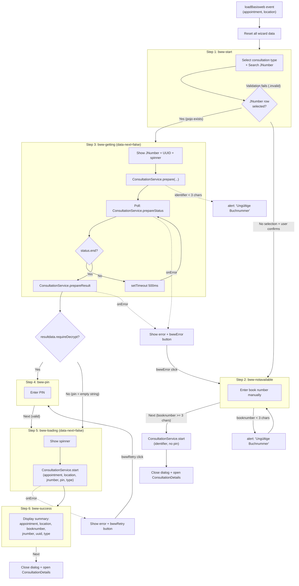

# BasisWeb Wizard (`#basisWebWizard`) — Analysis

> **Source files:**
> - `web/src/main/webapp/dash/basisWebWizard.html`
> - `web/src/main/webapp/dash/basisWebWizard.js`

## Dialog Configuration

| Property     | Value                                                      |
| ------------ | ---------------------------------------------------------- |
| ID           | `#basisWebWizard`                                          |
| Type         | Modal dialog (wizard)                                      |
| Width        | 600px                                                      |
| Icon         | `fa fa-file-medical-alt`                                   |
| Color        | `bg-color-basisWebData`                                    |
| CRUD buttons | `false` (none)                                             |
| Title        | `{{i18n.consultationWizard.start}}` ("Start Consultation") |

## Wizard Flow Diagram



## Wizard Steps Table

| #   | Step ID            | Title (i18n)                                                               | data-next      | Next button | Retry button   | Error button   | Description                                                       |
| --- | ------------------ | -------------------------------------------------------------------------- | -------------- | ----------- | -------------- | -------------- | ----------------------------------------------------------------- |
| 1   | `bww-start`        | `consultationWizard.enterJNumber`                                          | (default=true) | Visible     | Hidden         | Hidden         | Consultation type select + JNumber search with autocomplete table |
| 2   | `bww-notavailable` | `consultationWizard.enterBookNumber`                                       | (default=true) | Visible     | Hidden         | Hidden         | Fallback manual book number entry                                 |
| 3   | `bww-getting`      | `basiswebWizard.emergencyFormIsLoading`                                    | `false`        | **Hidden**  | Hidden         | Shown on error | Loading/polling state for prepare call                            |
| 4   | `bww-pin`          | `basiswebWizard.enterPin`                                                  | (default=true) | Visible     | Hidden         | Hidden         | PIN entry for encrypted data                                      |
| 5   | `bww-loading`      | `basiswebWizard.emergencyFormIsLoadingAndEncrypted`                        | `false`        | **Hidden**  | Shown on error | Hidden         | Decryption loading state                                          |
| 6   | `bww-success`      | `basiswebWizard.emergencyFormFor` + `basiswebWizard.successfullyDecrypted` | (default=true) | Visible     | Hidden         | Hidden         | Summary of decrypted data                                         |

## Step Details

### Step 1: `bww-start` — JNumber Search

**Form Elements:**

| Element           | Type       | Name/ID             | Required                     | Notes                                                                                                                                                                                                         |
| ----------------- | ---------- | ------------------- | ---------------------------- | ------------------------------------------------------------------------------------------------------------------------------------------------------------------------------------------------------------- |
| Consultation type | `<select>` | `data.type`         | `mandatory`                  | Options: EXTERNAL, DOCUMENT, STANDARD, INCARCERATION, ONBOARDING, TREATMENT. Options dynamically hidden based on `job` capabilities and `location.patientDataType`. Default set to `job.defaultConsultation`. |
| JNumber input     | `<input>`  | `#bwwjnumberselect` | `requireInput` (group-level) | Autocomplete/search field. Placeholder: `{{consultation.jnumber}}`                                                                                                                                            |

**Actions:**

| Action | Element ID | Trigger | Behavior |
|---|---|---|---|
| Search | `#bwwjnumbersearch` | click | Calls `ConsultationService.findBasisWeb([jnumber, appointmentId, locationId])`. If `jnumber.length <= 2`, clears results and shows info alert. Otherwise populates collection table. |
| Reload | `#bwwjnumberreload` | click | Calls `ConsultationService.refreshBasisWebAppointments(...)`. Shows spinner, re-triggers search on completion. |
| Auto-search | `#bwwjnumberselect` | change, keyup | Triggers `#bwwjnumbersearch` click (live search as user types) |

**Collection Table:**

- Data field: `anmeldungen.list`
- Class: `collection selectable` (radio-select behavior)
- Columns: `list.jnumber`, `list.uuid`, `list.remoteCode`
- On row select: sets radio button checked on `.selected` row, stores `pojo` data

**Alerts:**
- Info alert `#jnumberinfo`: shown when no results or search input too short. Contains HTML from `basiswebWizard.jnumberCanBeFoundHere` + two more i18n lines.
- Error alert `.error`: hidden by default, shown on reload failure.
- Spinner `.spin`: shown during reload, hidden after start tab load completes.

**Consultation Type Visibility Rules (from JS):**

| Condition | Hidden option |
|---|---|
| `location.patientDataType !== "EXTERNAL"` | EXTERNAL |
| `!job.consultationStandard` | STANDARD |
| `!job.consultationOnboarding` | ONBOARDING |
| `!job.consultationDocument` | DOCUMENT |
| `!job.consultationIncarceration` | INCARCERATION |
| `!appointment.treatmentId` | TREATMENT |
| `ONBOARDING_SHORT` | Commented out in JS — always hidden in step 1 select (but present in step 6 summary select) |

**Next Button Logic (from `bwwNext` handler):**
1. If `.invalid` elements exist in `#bww-start`, abort (validation failed).
2. Read selected consultation type from `<select>`, store as `data.type`.
3. If no table row selected: show `confirm()` dialog (hardcoded German). If user confirms, go to `notavailable`. If declined, stay.
4. If row selected with valid `pojo`: store `anmeldung`, `jnumber`, `uuid`, go to `getting`.

### Step 2: `bww-notavailable` — Fallback Book Number

**Form Elements:**

| Element | Type | ID | Required | Notes |
|---|---|---|---|---|
| Book number | `<input>` | `#bwwbooknumber` | `mandatory` | Placeholder: `{{consultation.booknumber}}`. Pre-filled from `data.booknumber` if set. |

**Alerts:**
- Danger alert: `basiswebWizard.jnumberNotFound` — explains JNumber was not found.
- Warning alert: `basiswebWizard.doConsultationWithBooknumer` — explains treatment can proceed with book number.

**Next Button Logic:**
1. Validate book number length >= 3. If too short, `alert("Ungültige Buchnummer")`.
2. Call `ConsultationService.start([appointmentId, location, null, identifier, null, type])` — no PIN, no BasisWeb check.
3. On success: close dialog, trigger page reload, open `ConsultationDetails`.

### Step 3: `bww-getting` — Prepare & Poll

**Display Elements:**
- `{{i18n.consultation.jnumber}}`: label
- `span.jnumber`: populated JNumber
- `span.uuid`: populated UUID
- Spinner: visible during polling
- Error area: `.errormsg` for error text, `.error` alert with support email

**`data-next="false"`** — Next button is hidden for this step.

**Async Flow:**
1. Resolve `identifier`: use `data.uuid` if available, else `bwwbooknumber` value. Validate length >= 3.
2. Call `ConsultationService.prepare([appointmentId, location, identifier, anmeldungId, false])` — returns `pid`.
3. Poll `ConsultationService.prepareStatus([pid])` every 500ms:
   - If `status.end === true`: call `ConsultationService.prepareResult([pid])`.
   - If not ended: re-poll after 500ms.
4. On `prepareResult` success:
   - If `resultdata.requireDecrypt === true`: go to `pin`.
   - Else: set `data.pin = ""`, go to `loading`.

**Error Handling:**
- `prepareStatus` error: show `bwwError` button, display error message + hardcoded German text.
- `prepareResult` error: show `bwwError` button, display error message + hardcoded German text.
- `bwwError` button navigates to `notavailable` (fallback to manual book number).

### Step 4: `bww-pin` — PIN Entry

**Form Elements:**

| Element | Type | ID/Name | Required | Notes |
|---|---|---|---|---|
| PIN input | `<input>` (styled as `form-select`) | `#bwwpin` / `data.pin` | `mandatory` | Icon: `fa-key`. Placeholder: "Pin" (hardcoded). Cleared on step show. |

**Display Elements:**
- JNumber + UUID labels
- Help text (muted): `basiswebWizard.pinFoundInBasisweb`

**Next Button Logic:**
1. If `.invalid` elements in `#bww-pin`, abort.
2. Store PIN value in `data.pin`.
3. Go to `loading`.

### Step 5: `bww-loading` — Decryption

**Display Elements:**
- JNumber + UUID labels
- Spinner: visible during request
- Error area: `.errormsg` for error text

**`data-next="false"`** — Next button is hidden for this step.

**Async Flow:**
1. Call `ConsultationService.start([appointmentId, location, null, jnumber, pin, type])`.
2. On success: trigger page reload, store `decryptedData`, go to `success`.

**Error Handling:**
- On error: show `bwwRetry` button, display error message + hardcoded German text.
- Sends `sendBwwStatus("StartError", message)` on failure.
- `bwwRetry` button navigates back to `pin` (re-enter PIN).

### Step 6: `bww-success` — Summary

**Display Elements:**

| Label (i18n) | Field | Notes |
|---|---|---|
| `{{i18n.appointment}}` | `data.appointment.job.expertTitle` | Read-only |
| `{{i18n.location}}` | `data.location.name` | Read-only |
| `{{i18n.consultation.booknumber}}` | `data.booknumber` | Read-only |
| `{{i18n.consultation.jnumber}}` | `data.jnumber` + `data.uuid` | Read-only |
| `{{i18n.ConsultationType}}` | `data.type` | Disabled `<select>` with all 7 options (includes ONBOARDING_SHORT) |

**Header:** Bold text: `basiswebWizard.emergencyFormFor` + `span.jnumber` + `basiswebWizard.successfullyDecrypted`

**Next Button Logic:**
1. Close dialog.
2. Open `ConsultationDetails` with `data.decryptedData`.
3. On ConsultationDetails save: trigger page reload.

Uses `jsForm("fill", data)` to populate all `.field` spans/selects.

## Buttonset

| Button | CSS class | data-event | ID | Visibility | Icon |
|---|---|---|---|---|---|
| Cancel | `btn-secondary` | `cancel` | — | Always visible | None |
| Next | `btn-primary default` | `bwwNext` | `#bwwNext` | Visible unless `data-next="false"` on active step | `fa-angle-right` |
| Retry | `btn-primary default` | `bwwRetry` | `#bwwRetry` | Shown only on `loading` step error | `fa-redo` |
| Error/Fallback | `btn-primary default` | `bwwError` | `#bwwError` | Shown only on `getting` step error | `fa-angle-right` |

All buttons have `data-position` attributes (5 for cancel, 6 for action buttons) and `data-fab-html` for mobile FAB rendering.

## Data-Event Actions

| Event | Handler | Behavior |
|---|---|---|
| `cancel` | Framework default | Closes the dialog |
| `bwwNext` | Switch on visible step | Navigates forward through wizard (see per-step logic above) |
| `bwwRetry` | Same handler as `bwwNext` | From `loading` error: goes back to `pin` to re-enter PIN |
| `bwwError` | Dedicated handler | Always navigates to `notavailable` (manual book number fallback) |

## Async Flow: Service Calls

```
1. ConsultationService.findBasisWeb(jnumber, appointmentId, locationId)
   → Returns list of matching anmeldungen (registrations)

2. ConsultationService.refreshBasisWebAppointments(jnumber, appointmentId, locationId)
   → Refreshes cached BasisWeb data, then re-searches

3. ConsultationService.prepare(appointmentId, location, identifier, anmeldungId, false)
   → Returns pid (prepare ID) — starts async server-side fetch

4. ConsultationService.prepareStatus(pid)
   → Returns { end: boolean } — polled every 500ms

5. ConsultationService.prepareResult(pid)
   → Returns { requireDecrypt: boolean, ... } — fetched once status.end=true

6. ConsultationService.start(appointmentId, location, null, jnumber/identifier, pin, type)
   → Returns decrypted consultation data — used in both:
     a. Normal flow (with PIN or empty PIN after prepare)
     b. Fallback flow (book number only, pin=null)
```

## Initialization (`loadBasisweb` Event)

The wizard is triggered externally via `$(document).trigger("loadBasisweb", [appointment, location])`.

**On init:**
1. Set `data.location` and `data.appointment`.
2. Clear all inputs, selects, span.jnumber elements.
3. Delete stale data properties: `booknumber`, `jnumber`, `job`, `anmeldung`, `offline`, `decrypted`, `decryptedData`, `prepare`, `pin`, `type`.
4. Hide spinner and error button.
5. Send status log: `sendBwwStatus("init")`.
6. Show step `start`.
7. Open dialog with `Dialog.open(...)`.

**Job-based type filtering** (in `bwwShow("start")`):
1. Fetches job details via `JobService.get(appointment.job.id)`.
2. Sets default type from `job.defaultConsultation`.
3. Hides options based on job capabilities and location data type.

## Status Logging

`sendBwwStatus(where, extra)` sends structured log messages via `sendLog("BasisWebWizard#<tab>", msg)`.

Logged fields: `appointment.id`, `location.name`, `job.code`, `type`, `jnumber`, `booknumber`, `anmeldung` (jnummer/jnumber/uuid).

Called at: `init`, every step transition, and `StartError`.

## Translation Keys

| Key | English | Contains HTML | Notes |
|---|---|---|---|
| `consultationWizard.start` | "Start Consultation" | No | Dialog title |
| `consultationWizard.typeselect` | "Choose the consultation type:" | No | Step 1 heading |
| `consultationWizard.enterJNumber` | "Please enter the J-Number of the patient:" | No | Step 1 heading |
| `consultationWizard.enterBookNumber` | "Please enter the book-number of the patient:" | No | Step 2 heading |
| `consultation.jnumber` | "Inmate Number" | No | Input placeholder + labels in steps 3/4/5 |
| `consultation.booknumber` | *(book number label)* | No | Input placeholder in step 2 + summary label |
| `basiswebWizard.jnumberCanBeFoundHere` | "The JNumber can be found in the BasisWeb system..." | **Yes** (`{{{triple-brace}}}`) | Info alert in step 1 |
| `basiswebWizard.infoOnlyLastFourDigitsSufficient` | "Input for basic web: The last 4 digits are sufficient" | No | Info alert in step 1 |
| `basiswebWizard.uuidLastFourLetterCheck` | "Check the UID with Basis-Web..." | No | Info alert in step 1 |
| `basiswebWizard.jnumberNotFound` | "Since the Jnumber was not found..." | No | Danger alert in step 2 |
| `basiswebWizard.doConsultationWithBooknumer` | "The treatment can be performed using the booking number..." | No | Warning alert in step 2 |
| `basiswebWizard.emergencyFormIsLoading` | "Emergency form is loading..." | No | Step 3 heading |
| `basiswebWizard.emergencyFormIsLoadingAndEncrypted` | "Emergency form is loaded and decrypted" | No | Step 5 heading |
| `basiswebWizard.pleaseCopyAndSendErrorMessage` | "Please copy the error message and send it to" | No | Step 3 error info alert |
| `basiswebWizard.enterPin` | "Enter pin" | No | Step 4 heading |
| `basiswebWizard.pinFoundInBasisweb` | "The PIN can be found in the basic web system..." | No | Step 4 help text |
| `basiswebWizard.emergencyFormFor` | "Emergency form for" | No | Step 6 header prefix |
| `basiswebWizard.successfullyDecrypted` | "was successfully decrypted" | No | Step 6 header suffix |
| `label.type` | *(Type)* | No | `title` attribute on type select group |
| `ConsultationType` | *(Consultation Type)* | No | Default option label + summary label |
| `ConsultationType.EXTERNAL` | *(External)* | No | Select option |
| `ConsultationType.DOCUMENT` | *(Document)* | No | Select option |
| `ConsultationType.STANDARD` | *(Standard)* | No | Select option |
| `ConsultationType.INCARCERATION` | *(Incarceration)* | No | Select option |
| `ConsultationType.ONBOARDING` | *(Onboarding)* | No | Select option |
| `ConsultationType.ONBOARDING_SHORT` | *(Onboarding Short)* | No | Only in step 6 summary select |
| `ConsultationType.TREATMENT` | *(Treatment)* | No | Select option |
| `appointment` | *(Appointment)* | No | Step 6 summary label |
| `location` | *(Location)* | No | Step 6 summary label |
| `button.cancel` | "Cancel" | No | Buttonset |
| `button.next` | "Next" | No | Buttonset |
| `button.retry` | "Retry" | No | Buttonset |

## Hardcoded German Strings

| Location | German String | English Translation | Context |
|---|---|---|---|
| `#bwwjnumbersearch` title attribute | `"Suchen"` | "Search" | Tooltip on search icon |
| `#bwwjnumberreload` title attribute | `"Daten von Basisweb neu laden"` | "Reload data from BasisWeb" | Tooltip on reload icon |
| `bwwShow("getting")` — identifier validation | `"Ungültige Buchnummer"` | "Invalid book number" | `alert()` when identifier < 3 chars |
| `bwwNext` — notavailable step validation | `"Ungültige Buchnummer"` | "Invalid book number" | `alert()` when booknumber < 3 chars |
| `bwwNext` — start step no selection | `"Sie haben keine JNummer auswählt, Sie führen nun eine Behandlung ohne Patientenhistorie und Übermittlung über Basis-Web aus."` | "You have not selected a JNumber. You are now performing a treatment without patient history and BasisWeb transmission." | `confirm()` dialog |
| `prepareStatus` onError | `": Der Notfallbogen konnte nicht gefunden werden."` | ": The emergency form could not be found." | Appended to error message in step 3 |
| `prepareResult` onError | `": Der Notfallbogen konnte nicht gefunden werden."` | ": The emergency form could not be found." | Appended to error message in step 3 |
| `loading` onError | `": Die behandlung konnte nicht gestartet werden."` | ": The treatment could not be started." | Appended to error message in step 5 |
| `refreshBasisWebAppointments` onError | `": Es gab einen Fehler bei der Kommunikation mit Basis-Web."` | ": There was an error communicating with BasisWeb." | Appended to error message in step 1 reload |
| Step 3 error info alert | `"office@videoclinic.de"` + `subject=BasisWeb Fehlermeldung` | Support email + "BasisWeb Error Message" subject | Hardcoded mailto link |
| PIN input placeholder | `"Pin"` | "Pin" | Placeholder text on `#bwwpin` |

## Consultation Type Enum Values

```
EXTERNAL | DOCUMENT | STANDARD | INCARCERATION | ONBOARDING | ONBOARDING_SHORT | TREATMENT
```

Note: `ONBOARDING_SHORT` is only present in the step 6 summary `<select>`, not in the step 1 selection `<select>`. Its visibility rule is commented out in JS (line 49-50).

## Data Model (stored on `#basisWebWizard` jQuery data)

| Property | Set when | Used by |
|---|---|---|
| `location` | init | All service calls |
| `appointment` | init | All service calls |
| `type` | Step 1 next | `ConsultationService.start` |
| `jnumber` | Step 1 next (from selected row) | Display in steps 3-6, `ConsultationService.start` |
| `uuid` | Step 1 next (from selected row) | Display in steps 3-6, identifier for prepare |
| `booknumber` | Step 1 (no selection) or step 2 next, or step 6 (from decrypted) | `ConsultationService.start` (fallback flow) |
| `anmeldung` | Step 1 next (from selected row pojo) | `ConsultationService.prepare` (anmeldungId) |
| `pin` | Step 4 next or auto-set to "" | `ConsultationService.start` |
| `prepare` | Step 3 (prepareResult) | Internal — result of prepare |
| `decrypted` | Step 5 success | Stored but not directly referenced |
| `decryptedData` | Step 5 success | Passed to `ConsultationDetails.open()` |
| `job` | Cleaned on init | Referenced in status logging |
| `offline` | Cleaned on init | Not set within wizard |
