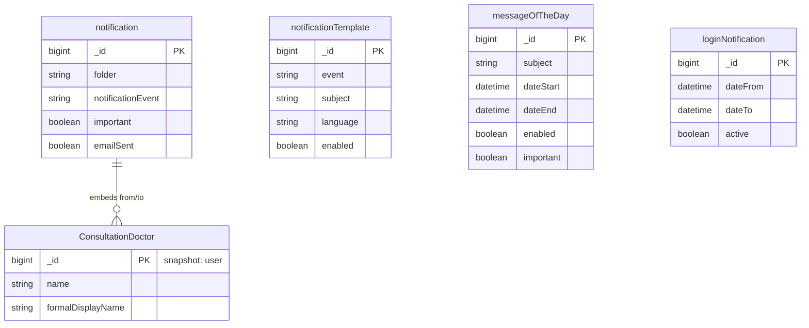

# News

[← Back to Index](./README.md)

This file covers the News category: system announcements and user notifications.

---

## ER Diagram

User notifications, templates, system announcements, and login alerts.

---

## Entities in This Category

| Table Name (DBML) | Business Entity | Description Summary |
| :--- | :--- | :--- |
| [`notification`](#entity-benachrichtigungen-notifications) | Benachrichtigungen (Notifications) | Logs of notifications sent to users via various channels. |
| [`notificationTemplate`](#entity-benachrichtigungsvorlagen-notification-templates) | Benachrichtigungsvorlagen (Notification Templates) | Reusable templates for automated system notifications. |
| [`messageOfTheDay`](#entity-system-ank-ndigungen-message-of-the-day) | System-Ankündigungen (Message of the Day) | Global announcements displayed to users upon login. |

---

## Entity: Benachrichtigungen (Notifications)
Interne Benachrichtigungen und Nachrichten zwischen Benutzern oder vom System.

### Table: notification
| Column | Type | Field Type | Description |
| :--- | :--- | :--- | :--- |
| `_id` | `Long` | schema | Interner Bezeichner |
| `version` | `Long` | schema | Versionsnummer |
| `ts` | `Date` | schema | Zeitstempel |
| `from` | `Document` | snapshot | Absender (denormalized snapshot of [`user`](./user-management.md#entity-experte-expert)) ([ConsultationDoctor](./user-management.md#sub-entity-consultationdoctor)) |
| `to` | `Document` | snapshot | Empfänger (denormalized snapshot of [`user`](./user-management.md#entity-experte-expert)) ([ConsultationDoctor](./user-management.md#sub-entity-consultationdoctor)) |
| `important` | `Boolean` | schema | Wichtigkeit |
| `folder` | `String` | schema | Ordner: • `INBOX` (Used) • `OUTBOX` (Used) • `TRASH` (Used) • `ARCHIVE` (Not used) |
| `read` | `Date` | schema | Gelesen-Zeitpunkt |
| `subject` | `String` | schema | Betreff |
| `message` | `String` | schema | Nachrichtentext |
| `notificationEvent` | `String` | schema | Art des Ereignisses |
| `emailSent` | `Boolean` | schema | Ob eine E-Mail versendet wurde |
| `_class` | `String` | schema | Laufzeitklassen-Marker: `de.videoclinic.model.Notification` |

The `notification` entity is referenced by:
- [`appointmentAssignmentHistory`](./planning.md#entity-terminzuweisungs-historie-appointment-assignment-history) (via `notificationId`)

## Entity: Benachrichtigungsvorlagen (Notification Templates)
Vordefinierte Vorlagen für Systembenachrichtigungen basierend auf Ereignissen.

### Table: notificationTemplate
| Column | Type | Field Type | Description |
| :--- | :--- | :--- | :--- |
| `_id` | `Long` | schema | Interner Bezeichner |
| `version` | `Long` | schema | Versionsnummer |
| `event` | `String` | schema | Ereignis-Typ (Used: `APPOINTMENT_ACCEPTED`, `APPOINTMENT_AGREED`, `APPOINTMENT_ASSIGNED`, `APPOINTMENT_CANCELED`, `APPOINTMENT_DELETED`, `APPOINTMENT_DISAGREED`, `APPOINTMENT_DONE`, `APPOINTMENT_EXPERT_AGREED`, `APPOINTMENT_EXPERT_CANCELED`, `APPOINTMENT_EXPERT_DISAGREED`, `APPOINTMENT_REJECTED`, `APPOINTMENT_REMINDER`, `APPOINTMENT_REQUEST`, `APPOINTMENT_RESERVED`, `APPOINTMENT_STORNO`, `APPOINTMENT_UPCOMING`, `APPOINTMENT_UPCOMING_LOCATION`, `ASYNC_JOB_QUEUE_ERROR`, `ASYNC_JOB_QUEUE_SUCCESS`, `CONSULATION_REPORTED`, `CONSULATION_REPORTED_EXPERT`, `CONSULATION_REPORTING`, `CONSULATION_SUBMIT`, `CONSULTATION_REPORTING_PSYCHOTHERAPY`, `COUNCIL_START`, `COUNCIL_SUBMIT`, `EXPERT_SUMMARY`, `FORWARD_NOTIFICATION`, `HOLIDAY_REMOVED`, `HOLIDAY_REQUEST`, `INVOICE_CUSTOMER`, `JOB_FINISHED`, `RECOVER_PASSWORD`, `TEMPLATE`, `TREATMENT_END_STORNO`, `TREATMENT_EXPERT_START`, `TREATMENT_START`, `USER_PASSWORD`) |
| `subject` | `String` | schema | Betreffzeile (Strukturierter Text) |
| `message` | `String` | schema | Nachrichtentext mit Platzhaltern (Strukturierter Text) |
| `enabled` | `Boolean` | schema | Ob die Vorlage aktiv ist |
| `language` | `String` | schema | Sprache der Vorlage (Used: `de`) |
| `dateCreated` | `Date` | schema | Erstellungsdatum |
| `dateChanged` | `Date` | inferred | Änderungsdatum |
| `changedBy` | `DBRef` | inferred | Geändert von (Reference to [user](./user-management.md#entity-experte-expert)) |
| `_class` | `String` | schema | Laufzeitklassen-Marker: `de.videoclinic.model.NotificationTemplate` |

The `notificationTemplate` entity is used by:
- (System-wide notification logic triggered by events)

## Entity: System-Ankündigungen (Message of the Day)
Meldungen, die Benutzern beim Login oder auf dem Dashboard angezeigt werden.

### Table: messageOfTheDay
| Column | Type | Field Type | Description |
| :--- | :--- | :--- | :--- |
| `_id` | `Long` | schema | Interner Bezeichner |
| `version` | `Long` | schema | Versionsnummer |
| `message` | `String` | schema | Die eigentliche Nachricht (HTML/Text) |
| `subject` | `String` | schema | Betreff |
| `roles` | `Array` | schema | Rollen, denen diese Nachricht angezeigt wird (Strings) |
| `dateStart` | `Date` | schema | Anzeige ab |
| `dateEnd` | `Date` | schema | Anzeige bis |
| `enabled` | `Boolean` | schema | Status |
| `important` | `Boolean` | schema | Wichtig-Kennzeichnung |
| `_class` | `String` | schema | Laufzeitklassen-Marker: `de.videoclinic.model.MessageOfTheDay` |

The `messageOfTheDay` entity is used for:
- (Global announcements shown to users on the dashboard)
