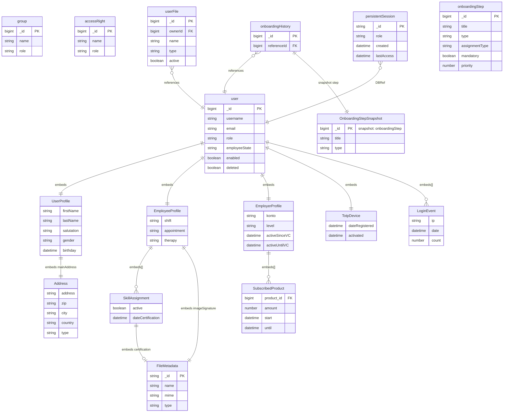

# User Management

[← Back to Index](./README.md)

This file covers the User Management category: management of experts, users, roles, and their associated profiles and sessions.

---

## ER Diagram

Expert profiles, groups, permissions, sessions, and onboarding.

---

## Entities in This Category

| Table Name (DBML) | Business Entity | Description Summary |
| :--- | :--- | :--- |
| [`user`](#entity-experte-expert) | Experte (Expert) | Expert profile including personal details, contact info, credentials, status, billing info, and qualifications. |
| [`group`](#entity-benutzergruppen-groups) | Benutzergruppen (Groups) | Roles and permissions groups assigned to users. |
| [`accessRight`](#entity-zugriffsrechte-access-rights) | Zugriffsrechte (Access Rights) | Definition of individual permissions and their descriptions. |
| [`userFile`](#entity-benutzerdateien-user-files) | Benutzerdateien (User Files) | Metadata and references for files uploaded by or for users. |
| [`persistentSession`](#entity-benutzersitzungen-persistent-sessions) | Benutzersitzungen (Persistent Sessions) | Storage for persistent user authentication sessions. |
| [`onboardingHistory`](#entity-onboarding-verlauf-onboarding-history) | Onboarding-Verlauf (Onboarding History) | Records of onboarding steps completed by employees or locations. |
| [`onboardingStep`](#entity-onboarding-schritte-onboarding-steps) | Onboarding-Schritte (Onboarding Steps) | Individual steps and checks required for onboarding processes. |
| [`loginNotification`](#entity-login-benachrichtigungen-login-notifications) | Login-Benachrichtigungen (Login Notifications) | Specialized notifications triggered by user login events. |
| [`1testuser`](#entity-testbenutzer-test-user) | Testbenutzer (Test User) | Placeholder or dedicated entity for system testing and QA. |

---

## Entity: Experte (Expert)
Personal and professional data for medical experts.

### Table: user
| Column | Type | Field Type | Description (from all-together.md) |
| :--- | :--- | :--- | :--- |
| `_id` | `Long` | schema | Interner Bezeichner |
| `version` | `Long` | schema | Versionsnummer (Zeitstempel) |
| `username` | `String` | schema | Benutzername für den Login |
| `email` | `String` | schema | Primäre E-Mail-Adresse |
| `password` | `String` | schema | Persönliches Passwort |
| `enabled` | `Boolean` | schema | Ob das Konto aktiv oder deaktiviert ist |
| `accountLocked` | `Boolean` | schema | Ob das Konto gesperrt ist |
| `accountExpired` | `Boolean` | schema | Ob das Konto abgelaufen ist |
| `credentialsExpired` | `Boolean` | schema | Ob die Anmeldedaten abgelaufen sind |
| `deleted` | `Boolean` | schema | Ob der Benutzer gelöscht wurde |
| `external` | `Boolean` | schema | Ob es ein externer Benutzer ist |
| `role` | `String` | schema | Rolle des Benutzers: • `ADMIN` • `ADMIN_INTERN` • `ADMIN_KUNDE` • `KUNDE` • `LEITER_INTERN` • `REGISTERED` • `STANDARD` |
| `employeeState` | `String` | schema | Status des Kontos: • `ACTIVE` • `CUSTOMER` • `INACTIVE` • `UNCONFIRMED` |
| `userProfile` | `Document` | schema | Persönliches Profil des Benutzers ([UserProfile](#sub-entity-userprofile)) |
| `employeeProfile` | `Document` | schema | Berufliches Profil des Experten ([EmployeeProfile](#sub-entity-employeeprofile)) |
| `employerProfile` | `Document` | schema | Profil des Arbeitgebers/Abrechnungsdaten ([EmployerProfile](#sub-entity-employerprofile)) |
| `nextBirthday` | `Date` | schema | Nächster Geburtstag |
| `totpDevice` | `Document` | schema | TOTP-Gerät Information ([TotpDevice](#sub-entity-totpdevice)) |
| `requireTotp` | `Boolean` | schema | Ob TOTP erforderlich ist |
| `totpActivity` | `Document` | schema | Letzte TOTP-Aktivität ([TotpActivity](#sub-entity-totpactivity)) |
| `countInvalidLogin` | `Number` | schema | Anzahl ungültiger Logins |
| `dateLocked` | `Date` | schema | Sperrdatum des Kontos |
| `lastIP` | `String` | schema | Letzte IP-Adresse |
| `countLogin` | `Number` | schema | Gesamtanzahl Logins |
| `lastLogin` | `Date` | schema | Letzter Login-Zeitpunkt |
| `settings` | `Document` | schema | Benutzereinstellungen |
| `ip` | `String` | schema | Aktuelle IP-Adresse |
| `invalidLogins` | `Array` | schema | Liste ungültiger Logins ([LoginEvent](#sub-entity-loginevent)) |
| `groups` | `Array` | schema | Liste zugeordneter Gruppen (DBRefs to [group](#entity-benutzergruppen-groups)) |
| `consecutiveFailedLoginAttempts` | `Number` | schema | Aufeinanderfolgende fehlgeschlagene Logins |
| `successfulLogins` | `Array` | schema | Liste erfolgreicher Logins ([LoginEvent](#sub-entity-loginevent)) |
| `dateAcceptedLoginNotification` | `Date` | schema | Akzeptanzdatum der Login-Benachrichtigung |
| `resetDate` | `Date` | schema | Datum des Passwort-Resets |
| `resetIp` | `String` | schema | IP des Passwort-Resets |
| `resetKey` | `String` | schema | Schlüssel für Passwort-Reset |
| `dateChanged` | `Date` | schema | Änderungsdatum |
| `changedBy` | `Document` | schema | Zuletzt geändert von ([PlanUser](./planning.md#sub-entity-planuser)) |
| `lastReminder` | `Date` | schema | Letzte Erinnerung |
| `emailVerified` | `String` | schema | Status der E-Mail-Verifizierung |
| `dateCreated` | `Date` | schema | Erstellungsdatum |
| `createdBy` | `Document` | schema | Erstellt von ([PlanUser](./planning.md#sub-entity-planuser)) |
| `onBoardingPercentComplete` | `Number` | inferred | Onboarding Fortschritt (%) |
| `stepsTotal` | `Number` | inferred | Gesamtanzahl Onboarding-Schritte |
| `stepsCompleted` | `Number` | inferred | Abgeschlossene Onboarding-Schritte |
| `customers` | `Array` | schema | Zugeordnete Kunden (DBRefs to [customer](./customer.md#entity-kunden-customers)) |
| `lang` | `String` | schema | Spracheinstellung (z.B. `de`) |
| `verifikationKey` | `String` | schema | Verifizierungsschlüssel |
| `_class` | `String` | schema | Laufzeitklassen-Marker: `de.videoclinic.model.User` |

The `user` entity is referenced by:
- [`appointmentAssignment`](./planning.md#entity-terminzuweisungen-appointment-assignments)
- [`appointmentAssignmentHistory`](./planning.md#entity-terminzuweisungs-historie-appointment-assignment-history)
- [`appointmentPlan`](./planning.md#entity-sprechstundenplan-appointment-plan) (as `doctor`, `createdBy`, `changedBy`)
- [`consultationData`](./treatment.md#entity-konsultationsdaten-consultation-data) (as `signedOffBy`, `doctor`, `changedBy`, `createdBy`)
- [`expertDays`](./planning.md#entity-jahreskalender-eines-experten-expert-days)
- [`expertWeek`](./planning.md#entity-experten-wochenplan-expert-week)
- [`holiday`](./planning.md#entity-abwesenheiten-urlaub-holidays)
- [`invoice`](./accounting.md#entity-rechnungen-invoices) (as `createdBy`, `changedBy`)
- [`log`](./system.md#entity-system-logs-logs)
- [`notification`](./news.md#entity-benachrichtigungen-notifications)
- [`patient`](./treatment.md#entity-patienten-patients) (as `createdBy`, `changedBy`)
- [`userFile`](#entity-benutzerdateien-user-files)
- [`userVideoHistory`](./academy.md#entity-video-verlauf-user-video-history)
- [`persistentSession`](#entity-benutzersitzungen-persistent-sessions)
- [`onboardingHistory`](#entity-onboarding-verlauf-onboarding-history) (as `changedBy`)
- [`onboardingStep`](#entity-onboarding-schritte-onboarding-steps) (as `createdBy`, `changedBy`)
- [`notificationTemplate`](./news.md#entity-benachrichtigungsvorlagen-notification-templates) (as `changedBy`)
- [`cDRCall`](./external-data.md#entity-anrufliste-cdr-calls) (as `ownerId`, `assignedById`)
- [`expertWorkMonthly`](./accounting.md#entity-monatliche-expertenarbeit-expert-work-monthly) (as `userId`)
- [`closedMonth`](./accounting.md#entity-abgeschlossene-zeitr-ume-closed-months) (as `closedBy`)

### Functionality Details
- **Availability:** Managed via `expertDays` collection (mapped from "Jahreskalender eines Experten").
- **Account Status:** `employeeState` includes `ACTIVE`, `CUSTOMER`, `INACTIVE`, `UNCONFIRMED`.
- **Focus and Hingabe:** Focus levels for `shift`, `appointment`, and `therapy` are stored in `employeeProfile`.
- **Certifications:** Documents for skills are stored in `employeeProfile.skills[].certification`.

### Sub-entities for user

The following structures are used as nested documents within the `user` collection.

#### Sub-entity: UserProfile
Contains personal information and general settings for the user.

| Column | Type | Field Type | Description |
| :--- | :--- | :--- | :--- |
| `_id` | `String` | schema | Internal identifier (often UUID if present, otherwise nested) |
| `firstName` | `String` | schema | Vorname |
| `lastName` | `String` | schema | Nachname |
| `displayName` | `String` | inferred | Vollständiger Name für die Anzeige |
| `title` | `String` | inferred | Akademischer Titel |
| `salutation` | `String` | inferred | Anrede: • `MALE` • `FEMALE` |
| `gender` | `String` | schema | Geschlecht: • `MALE` (Used) • `FEMALE` (Used) |
| `birthday` | `Date` | schema | Geburtsdatum |
| `mainAddress` | `Document` | inferred | Hauptadresse ([Address](#sub-entity-address)) |
| `cellularNumber` | `String` | inferred | Mobilfunknummer |
| `shiftPhoneNumber` | `String` | inferred | Bereitschaftsnummer |
| `notificationPerMail` | `Boolean` | inferred | Benachrichtigung per E-Mail |
| `exludedNotifications` | `Array` | inferred | Ausgeschlossene Benachrichtigungen (Strings) |
| `photo` | `Document` | inferred | Profilfoto ([UserFileMetadata](#sub-entity-userfilemetadata)) |
| `homePhone` | `String` | inferred | Privatnummer |
| `faxNumber` | `String` | inferred | Faxnummer |
| `workPhone` | `String` | inferred | Dienstnummer |
| `userId` | `Long` | inferred | Reference to [user](#entity-experte-expert) |

The `UserProfile` sub-entity is used within:
- [`user`](#entity-experte-expert) (as `userProfile` field)

#### Sub-entity: Address
A reusable structure for postal addresses.

| Column | Type | Field Type | Description |
| :--- | :--- | :--- | :--- |
| `_id` | `Long` | schema | Internal identifier |
| `name` | `String` | schema | Name des Empfängers |
| `address` | `String` | schema | Straße und Hausnummer |
| `address2` | `String` | schema | Adresszusatz |
| `zip` | `String` | schema | Postleitzahl |
| `city` | `String` | schema | Ort |
| `state` | `String` | schema | Bundesland |
| `country` | `String` | schema | Land |
| `type` | `String` | schema | Art der Adresse: • `PRIVATE` (Used) • `WORK` (Used) • `PRAXIS` (Used) • `OTHER` (Used) |

The `Address` sub-entity is used within:
- [`UserProfile`](#sub-entity-userprofile) (as `mainAddress` field)
- [`EmployerProfile`](#sub-entity-employerprofile) (as `billingAddress` field)
- [`customer`](./customer.md#entity-kunden-customers) (as `mainAddress` field)

#### Sub-entity: EmployeeProfile
Contains professional qualifications and payment details for the expert.

| Column | Type | Field Type | Description |
| :--- | :--- | :--- | :--- |
| `_id` | `String` | schema | Internal identifier |
| `email2` | `String` | schema | Sekundäre E-Mail-Adresse |
| `activeSince` | `Date` | schema | Ab wann der Experte als Arzt tätig ist |
| `bank` | `String` | schema | Kreditinstitut |
| `iban` | `String` | schema | IBAN |
| `bic` | `String` | schema | BIC |
| `taxid` | `String` | schema | Steuer-ID |
| `uid` | `String` | schema | Umsatzsteuernummer |
| `mailInvoice` | `Boolean` | schema | E-Mail-Rechnung senden |
| `postInvoice` | `Boolean` | schema | Post-Rechnung senden |
| `shift` | `String` | schema | Bereitschaftsdienst Fokus (`NONE`, `LOW`, `MEDIUM`, `HIGH`) |
| `appointment` | `String` | schema | Sprechstunde Fokus (`NONE`, `LOW`, `MEDIUM`, `HIGH`) |
| `therapy` | `String` | schema | Therapie Fokus (`NONE`, `LOW`, `MEDIUM`, `HIGH`) |
| `skills` | `Array` | schema | Liste der erlangten Fähigkeiten ([EmployeeSkillAssignment](#sub-entity-employeeskillassignment)) |
| `exclusionCriteria` | `Array` | inferred | Ausschlusskriterien |
| `imageSignature` | `Document` | schema | Bild mit der Unterschrift ([UserFileMetadata](#sub-entity-userfilemetadata)) |
| `bayernBoxAccess` | `Document` | schema | Zugangsdaten SecureBox ([BayernBoxAccess](#sub-entity-bayernboxaccess)) |
| `categoriesWatched` | `Array` | inferred | Gesehene Video-Kategorien ([WatchedCategory](#sub-entity-watchedcategory)) |

The `EmployeeProfile` sub-entity is used within:
- [`user`](#entity-experte-expert) (as `employeeProfile` field)

#### Sub-entity: SkillAssignment
Maps a specific skill to the expert with certification details.

| Column | Type | Field Type | Description |
| :--- | :--- | :--- | :--- |
| `_id` | `String` | inferred | Internal identifier |
| `skill` | `DBRef` | schema | Reference to [skill](./capabilities.md#entity-fähigkeiten-skills) collection |
| `active` | `Boolean` | schema | Whether the skill is active for the expert |
| `dateCertification` | `Date` | schema | Date when the skill was obtained |
| `certification` | `Document` | schema | Zertifikatsdatei ([FileMetadata](#sub-entity-filemetadata)) |

The `SkillAssignment` sub-entity is used within:
- [`EmployeeProfile`](#sub-entity-employeeprofile) (as `skills` array)

#### Sub-entity: EmployerProfile
Contains contract details and billing information related to Videoclinic.

| Column | Type | Field Type | Description |
| :--- | :--- | :--- | :--- |
| `_id` | `String` | schema | Internal identifier |
| `konto` | `String` | schema | Debitorenkonto (GKTK) |
| `gkto` | `String` | schema | Debitorennummer (GKTO) |
| `efn` | `String` | inferred | Einheitliche Fortbildungsnummer (EFN) |
| `level` | `String` | schema | Qualifikationsniveau: • `ONBOARDING` (Used) • `BEGINNER` (Not used) • `AMATEUR` (Not used) • `PROFI` (Not used) |
| `activeSinceVC` | `Date` | schema | Ab wann for Videoclinic tätig |
| `activeUntilVC` | `Date` | schema | Bis wann for Videoclinic tätig |
| `products` | `Array` | schema | Liste abonnierter Waren ([SubscribedProduct](#sub-entity-subscribedproduct)) |
| `sipAccounts` | `Array` | inferred | Liste von SIP-Accounts ([SipAccount](#sub-entity-sipaccount)) |
| `employeeType` | `Array` | inferred | Beschäftigungsverhältnis ([EmployeeTypeEntry](#sub-entity-employeetypeentry)) |
| `currentIncome` | `Number` | inferred | Aktuelles Einkommen |
| `activeSince` | `Date` | inferred | Aktiv seit |
| `inctiveReason` | `String` | inferred | Grund für Inaktivität |
| `experienceAddictionMedicine` | `String` | inferred | Erfahrung in Suchtmedizin |

The `EmployerProfile` sub-entity is used within:
- [`user`](#entity-experte-expert) (as `employerProfile` field)

#### Sub-entity: SubscribedProduct
A product or service the expert has subscribed to.

| Column | Type | Field Type | Description |
| :--- | :--- | :--- | :--- |
| `_id` | `String` | schema | Internal identifier |
| `product` | `DBRef` | schema | Reference to [product](./accounting.md#entity-waren-products) collection |
| `amount` | `Number` | schema | Quantity |
| `start` | `Date` | schema | Start date |
| `until` | `Date` | schema | Enddatum |
| `adjustedPrice` | `Number` | schema | Angebotspreis |
| `description` | `String` | schema | Beschreibung |
| `comment` | `String` | schema | Kommentar |

The `SubscribedProduct` sub-entity is used within:
- [`EmployerProfile`](#sub-entity-employerprofile) (as `products` array)

#### Sub-entity: TotpDevice
Information about the TOTP device used for multi-factor authentication.

| Column | Type | Field Type | Description |
| :--- | :--- | :--- | :--- |
| `ip` | `String` | schema | IP address used during registration |
| `dateRegistered` | `Date` | schema | Date of registration |
| `secret` | `String` | schema | TOTP secret key |
| `activated` | `Date` | schema | Date of activation |

The `TotpDevice` sub-entity is used within:
- [`user`](#entity-experte-expert) (as `totpDevice` field)

#### Sub-entity: TotpActivity
Records the last TOTP-related activity.

| Column | Type | Field Type | Description |
| :--- | :--- | :--- | :--- |
| `dateAccess` | `Date` | schema | Date of last access |
| `ip` | `String` | schema | IP address of the access |
| `ua` | `String` | schema | User Agent of the access |
| `action` | `String` | schema | Performed action (e.g., `login`) |

The `TotpActivity` sub-entity is used within:
- [`user`](#entity-experte-expert) (as `totpActivity` field)

#### Sub-entity: LoginEvent
Details of a login attempt (successful or unsuccessful).

| Column | Type | Field Type | Description |
| :--- | :--- | :--- | :--- |
| `ip` | `String` | schema | IP address of the attempt |
| `date` | `Date` | schema | Date of the latest attempt for this IP |
| `first` | `Date` | schema | Date of the first attempt for this IP |
| `ua` | `String` | inferred | User Agent (often present in successful logins) |
| `count` | `Number` | schema | Total count of attempts for this IP |

The `LoginEvent` sub-entity is used within:
- [`user`](#entity-experte-expert) (as `invalidLogins` and `successfulLogins` arrays)

#### Sub-entity: FileMetadata
Metadata for uploaded files (signatures, certifications, etc.).

| Column | Type | Field Type | Description |
| :--- | :--- | :--- | :--- |
| `_id` | `String` | schema | Eindeutiger Dateiname/ID |
| `name` | `String` | schema | Ursprünglicher Dateiname |
| `mime` | `String` | schema | MIME-Typ |
| `size` | `Long` | schema | Dateigröße in Bytes |
| `checksum` | `String` | schema | Prüfsumme (SHA-256) |
| `type` | `String` | schema | Dateityp: • `cert` (Used) • `sig` (Used) • `usertn` (Used) • `usertempupload` (Used) |
| `dateCreated` | `Date` | schema | Erstellungsdatum |

The `FileMetadata` sub-entity is used within:
- [`EmployeeProfile`](#sub-entity-employeeprofile) (as `imageSignature`)
- [`SkillAssignment`](#sub-entity-skillassignment) (as `certification`)
- [`uploadFile`](./system.md#entity-dateiuploads-upload-files) (as `data`)
- [`video`](./academy.md#entity-videos-videos) (as `file` and `preview`)
- [`exportTemplate`](./system.md#entity-export-vorlagen-export-templates) (as `template`)

#### Sub-entity: ConsultationDoctor

Denormalisierter Snapshot eines Experten ([user](#entity-experte-expert)).

| Column | Type | Field Type | Description |
| :--- | :--- | :--- | :--- |
| `_id` | `Long` | snapshot | Referenz-ID auf [user](#entity-experte-expert) |
| `name` | `String` | snapshot | Name des Experten |
| `email` | `String` | snapshot | E-Mail-Adresse |
| `formalDisplayName` | `String` | snapshot | Vollständiger Name mit Titel |

The `ConsultationDoctor` sub-entity is used within:

- [`consultationData`](./treatment.md#entity-konsultationsdaten-consultation-data) (as `doctor`)
- [`consultation`](./treatment.md#entity-konsultationen-cqrs-read-projection) (as `doctor`)
- [`notification`](./news.md#entity-benachrichtigungen-notifications) (as `from` and `to`)
- [`cDRCallAssignment`](./external-data.md#entity-cdr-call-zuweisungen-cdr-call-assignment) (as `user`)
- [`expertWorklogEntry`](./accounting.md#sub-entity-expertworklogentry) (as `expert`)
- [`asyncJobQueue`](./system.md#entity-hintergrundaufgaben-async-job-queue) (as `createdBy`)

> **Note**: `changedBy`, `createdBy`, and `reportingExpert` in `consultation`/`consultationData` use a **slim variant** (fields: `_id`, `name`, `email` — no `formalDisplayName`) compared to the full `ConsultationDoctor` shape used in `doctor`.

#### Sub-entity: ConsultationJob

Denormalisierter Snapshot einer Dienstleistung ([jobId](./accounting.md#entity-dienstleistung-service)).

| Column | Type | Field Type | Description |
| :--- | :--- | :--- | :--- |
| `_id` | `Long` | snapshot | Referenz-ID auf [jobId](./accounting.md#entity-dienstleistung-service) |
| `code` | `String` | snapshot | Dienstleistungscode |
| `color` | `String` | snapshot | Farbe (Hex/Name) |
| `expertTitle` | `String` | snapshot | Titel für Experten |
| `remoteCode` | `String` | snapshot | Externer Code |
| `title` | `String` | snapshot | Titel |
| `type` | `String` | snapshot | Abrechnungsart (z.B. `APPOINTMENT`, `SHIFT`) |

The `ConsultationJob` sub-entity is used within:

- [`appointment`](./planning.md#entity-termine-appointments) (as `job`)
- [`consultationData`](./treatment.md#entity-konsultationsdaten-consultation-data) (as `job`)
- [`consultation`](./treatment.md#entity-konsultationen-cqrs-read-projection) (as `job`)
- [`expertConsultationTemplate`](./treatment.md#entity-konsultationsvorlagen-expert-consultation-templates) (as `job`)
- [`shiftPlan`](./planning.md#entity-schichtplan-shift-plan) (as `job`)

#### Sub-entity: ConsultationCustomer

Denormalisierter Snapshot eines Kunden ([customer](./customer.md#entity-kunden-customers)).

| Column | Type | Field Type | Description |
| :--- | :--- | :--- | :--- |
| `_id` | `Long` | snapshot | Referenz-ID auf [customer](./customer.md#entity-kunden-customers) |
| `name` | `String` | snapshot | Name des Kunden |

The `ConsultationCustomer` sub-entity is used within:

- [`appointment`](./planning.md#entity-termine-appointments) (as `customer`)
- [`consultationData`](./treatment.md#entity-konsultationsdaten-consultation-data) (as `customer`)
- [`consultation`](./treatment.md#entity-konsultationen-cqrs-read-projection) (as `customer`)
- [`treatment`](./treatment.md#entity-behandlungsverlauf-treatment) (as `customer`)

#### Sub-entity: ConsultationLocation

Denormalisierter Snapshot eines Standorts ([location](./customer.md#entity-standorte-locations)).

| Column | Type | Field Type | Description |
| :--- | :--- | :--- | :--- |
| `_id` | `Long` | snapshot | Referenz-ID auf [location](./customer.md#entity-standorte-locations) |
| `name` | `String` | snapshot | Name des Ortes |
| `booknumberMask` | `String` | snapshot | Maske für Buchnummern |
| `patientDataType` | `String` | snapshot | Datentyp der Patienten (z.B. `EXTERNAL`, `INTERNAL_VCCLOUD`) |
| `customer` | `Document` | snapshot | Zugehöriger Kunde ([ConsultationCustomer](#sub-entity-consultationcustomer)) |

The `ConsultationLocation` sub-entity is used within:

- [`appointment`](./planning.md#entity-termine-appointments) (as `location`)
- [`consultationData`](./treatment.md#entity-konsultationsdaten-consultation-data) (as `location`)
- [`consultation`](./treatment.md#entity-konsultationen-cqrs-read-projection) (as `location`)
- [`treatment`](./treatment.md#entity-behandlungsverlauf-treatment) (as `location`)
- [`patientData`](./treatment.md#entity-patientenerg-nzungsdaten-patient-data) (as `location`)
- [`appointmentPlan`](./planning.md#entity-sprechstundenplan-appointment-plan) (as `location`)

## Entity: Benutzergruppen (Groups)

Zusammenfassung von Benutzern zu Gruppen mit gemeinsamen Rollen und Rechten.

### Table: group
| Column | Type | Field Type | Description |
| :--- | :--- | :--- | :--- |
| `_id` | `Long` | schema | Interner Bezeichner |
| `version` | `Long` | schema | Versionsnummer |
| `name` | `String` | schema | Gruppenname |
| `description` | `String` | inferred | Beschreibung (Freitext) |
| `role` | `String` | inferred | Hauptrolle der Gruppe |
| `rights` | `Array` | inferred | Liste zugeordneter Rechte |
| `_class` | `String` | schema | Laufzeitklassen-Marker: `de.videoclinic.model.Group` |

The `group` entity is referenced by:
- [`user`](#entity-experte-expert) (in `groups`)

## Entity: Zugriffsrechte (Access Rights)
Definition von spezifischen Berechtigungen innerhalb des Systems.

### Table: accessRight
| Column | Type | Field Type | Description |
| :--- | :--- | :--- | :--- |
| `_id` | `Long` | schema | Interner Bezeichner |
| `version` | `Long` | schema | Versionsnummer |
| `name` | `String` | schema | Name des Rechts |
| `description` | `String` | schema | Beschreibung (Freitext) |
| `role` | `String` | inferred | Zugeordnete Rolle |
| `_class` | `String` | schema | Laufzeitklassen-Marker: `de.videoclinic.model.AccessRight` |

The `accessRight` entity is referenced by:
- [`group`](#entity-benutzergruppen-groups) (via `rights`)

## Entity: Benutzerdateien (User Files)
Dateien, die Benutzern zugeordnet sind (z.B. Zertifikate).

### Table: userFile
| Column | Type | Field Type | Description |
| :--- | :--- | :--- | :--- |
| `_id` | `Long` | schema | Interner Bezeichner |
| `version` | `Long` | schema | Versionsnummer |
| `data` | `Document` | schema | Metadaten der Datei ([FileMetadata](#sub-entity-filemetadata)) |
| `name` | `String` | schema | Anzeigename |
| `type` | `String` | schema | Dateityp: • `APPROBIATION` (Used) • `AUTHENTICATED_MEDICAL_SPECIALIST_CERTIFICATE` (Used) • `BASIC_RULES_CONTRACT` (Used) • `BAVARIA_LAWS_CONTRACT` (Used) • `CONDUCT_CERTIFICATE` (Used) • `CURRICULUM_VITAE` (Used) • `DATA_PROTECTION_CONTRACT` (Used) • `LOAN_AGREEMENT` (Used) • `OTHER` (Used) • `PROFESSIONAL_LIABILITY_INSURANCE` (Used) • `PROOF_OF_EXPERTISE` (Used) • `SERVICE_CONTRACT` (Used) • `SOCIAL_SECURITY_CHECKLIST` (Used) |
| `ownerId` | `Long` | schema | Reference to [user](#entity-experte-expert) |
| `date` | `Date` | inferred | Datum |
| `active` | `Boolean` | inferred | Status |
| `_class` | `String` | schema | Laufzeitklassen-Marker: `de.videoclinic.model.UserFile` |

The `userFile` entity references:
- [`user`](#entity-experte-expert) (via `ownerId`)

## Entity: Benutzersitzungen (Persistent Sessions)
Speichert Informationen über aktive und vergangene Benutzersitzungen im System.

### Table: persistentSession
| Column | Type | Field Type | Description |
| :--- | :--- | :--- | :--- |
| `_id` | `String` | schema | Session-ID |
| `version` | `Long` | schema | Versionsnummer |
| `user` | `DBRef` | schema | Reference to [user](#entity-experte-expert) |
| `created` | `Date` | schema | Erstellungszeitpunkt |
| `ip` | `String` | schema | IP-Adresse des Benutzers |
| `userAgent` | `String` | schema | Browser-Informationen (User Agent) |
| `authorities` | `Array` | inferred | Liste zugeordneter Berechtigungen ([UserAuthority](#sub-entity-userauthority)) |
| `loginUser` | `Long` | inferred | Reference to [user](#entity-experte-expert) |
| `lang` | `String` | inferred | Spracheinstellung (z.B. `de`) |
| `csfr` | `String` | inferred | CSRF-Token |
| `newSession` | `Boolean` | inferred | Ob es eine neue Sitzung ist |
| `type` | `String` | inferred | Sitzungstyp |
| `lastAccess` | `Date` | inferred | Letzter Zugriff |
| `role` | `String` | schema | Aktive Rolle in der Sitzung |
| `_class` | `String` | schema | Laufzeitklassen-Marker: `de.videoclinic.model.PersistentSession` |

The `persistentSession` entity references:
- [`user`](#entity-experte-expert)

## Entity: Onboarding-Verlauf (Onboarding History)
Verlauf und Status der einzelnen Onboarding-Schritte eines Experten.

### Table: onboardingHistory
| Column | Type | Field Type | Description |
| :--- | :--- | :--- | :--- |
| `_id` | `Long` | schema | Interner Bezeichner |
| `version` | `Long` | schema | Versionsnummer |
| `referenceId` | `Long` | schema | Reference (e.g. [user.id](#entity-experte-expert) or [location.id](./customer.md#entity-standorte-locations)) |
| `step` | `Document` | schema | Snapshot des Onboarding-Schritts ([OnboardingStep](#sub-entity-onboardingstep)) |
| `comment` | `String` | schema | Kommentar (Freitext) |
| `dateStarted` | `Date` | schema | Startzeitpunkt des Schritts |
| `dateCompleted` | `Date` | schema | Abschlusszeitpunkt des Schritts |
| `dateChanged` | `Date` | schema | Zeitpunkt der letzten Änderung |
| `changedBy` | `DBRef` | schema | Letzte Änderung durch (Reference to [user](#entity-experte-expert)) |
| `_class` | `String` | schema | Laufzeitklassen-Marker: `de.videoclinic.model.OnboardingHistory` |

The `onboardingHistory` entity references:
- [`user`](#entity-experte-expert) (via `referenceId` or `changedBy`)
- [`location`](./customer.md#entity-standorte-locations) (via `referenceId`)

### Sub-entities for onboardingHistory

#### Sub-entity: OnboardingStep
Definition der einzelnen Schritte, die ein Experte oder Standort während des Onboarding-Prozesses durchlaufen muss.

| Column | Type | Field Type | Description |
| :--- | :--- | :--- | :--- |
| `_id` | `Long` | schema | Interner Bezeichner |
| `version` | `Long` | schema | Versionsnummer (Zeitstempel) |
| `title` | `String` | schema | Titel des Schritts (Freitext) |
| `description` | `String` | schema | Beschreibung (Freitext) |
| `priority` | `Number` | schema | Sortierreihenfolge |
| `mandatory` | `Boolean` | schema | Pflichtschritt |
| `type` | `String` | schema | Typ des Onboarding-Schritts: • `CHECK` (Used) |
| `assignmentType` | `String` | schema | Art der Zuordnung: • `EMPLOYEE` (Used) • `LOCATION` (Used) |
| `dateCreated` | `Date` | schema | Creation time |
| `dateChanged` | `Date` | schema | Time of last change |
| `createdBy` | `DBRef` | schema | Created by (Reference to [user](#entity-experte-expert)) |
| `changedBy` | `DBRef` | schema | Changed by (Reference to [user](#entity-experte-expert)) |

The `OnboardingStep` sub-entity is used within:
- [`onboardingHistory`](#entity-onboarding-verlauf-onboarding-history) (as `step` snapshot)
- [`onboardingStep`](#entity-onboarding-schritte-onboarding-steps) (as the main entity table)

## Entity: Onboarding-Schritte (Onboarding Steps)
Definition der einzelnen Schritte, die ein Experte oder Standort während des Onboarding-Prozesses durchlaufen muss.

### Table: onboardingStep
| Column | Type | Field Type | Description |
| :--- | :--- | :--- | :--- |
| `_id` | `Long` | schema | Interner Bezeichner |
| `version` | `Long` | schema | Versionsnummer (Zeitstempel) |
| `title` | `String` | schema | Titel des Schritts (Freitext) |
| `description` | `String` | schema | Detaillierte Beschreibung (Freitext) |
| `priority` | `Number` | schema | Reihenfolge der Bearbeitung |
| `mandatory` | `Boolean` | schema | Ob der Schritt verpflichtend ist |
| `type` | `String` | schema | Art des Schritts: • `CHECK` (Used) |
| `assignmentType` | `String` | schema | Art der Zuordnung: • `EMPLOYEE` (Used) • `LOCATION` (Used) |
| `createdBy` | `DBRef` | schema | Erstellt von (Reference to [user](#entity-experte-expert)) |
| `dateCreated` | `Date` | schema | Erstellungsdatum |
| `dateChanged` | `Date` | schema | Änderungsdatum |
| `changedBy` | `DBRef` | schema | Geändert von (Reference to [user](#entity-experte-expert)) |
| `_class` | `String` | schema | Laufzeitklassen-Marker: `de.videoclinic.model.OnboardingStep` |

The `onboardingStep` entity is referenced by:
- [`onboardingHistory`](#entity-onboarding-verlauf-onboarding-history) (as a snapshot in `step`)

## Entity: Login-Benachrichtigungen (Login Notifications)
Spezifische Meldungen, die Benutzern beim Einloggen in das System angezeigt werden.

### Table: loginNotification
| Column | Type | Field Type | Description |
| :--- | :--- | :--- | :--- |
| `_id` | `Long` | schema | Interner Bezeichner |
| `version` | `Long` | schema | Versionsnummer |
| `content` | `String` | schema | Inhalt der Benachrichtigung |
| `dateFrom` | `Date` | schema | Gültig ab |
| `dateTo` | `Date` | schema | Gültig bis |
| `active` | `Boolean` | schema | Status |
| `dateCreated` | `Date` | inferred | Erstellungsdatum |
| `createdBy` | `DBRef` | inferred | Erstellt von (Reference to [user](#entity-experte-expert)) |
| `dateChanged` | `Date` | inferred | Letztes Änderungsdatum |
| `changedBy` | `DBRef` | inferred | Geändert von (Reference to [user](#entity-experte-expert)) |
| `_class` | `String` | schema | Laufzeitklassen-Marker: `de.videoclinic.model.LoginNotification` |

The `loginNotification` entity is used for:
- (Alerts shown to users upon successful system login)

## Entity: Testbenutzer (Test User)
Interne Testbenutzer für Systemprüfungen.

### Table: 1testuser
| Column | Type | Field Type | Description |
| :--- | :--- | :--- | :--- |
| `_id` | `Long` | schema | Interner Bezeichner |
| `password` | `String` | schema | Passwort |
| `_class` | `String` | schema | Laufzeitklassen-Marker: `de.videoclinic.model.TestUser` |

The `1testuser` entity is used for:
- (System testing and QA)
