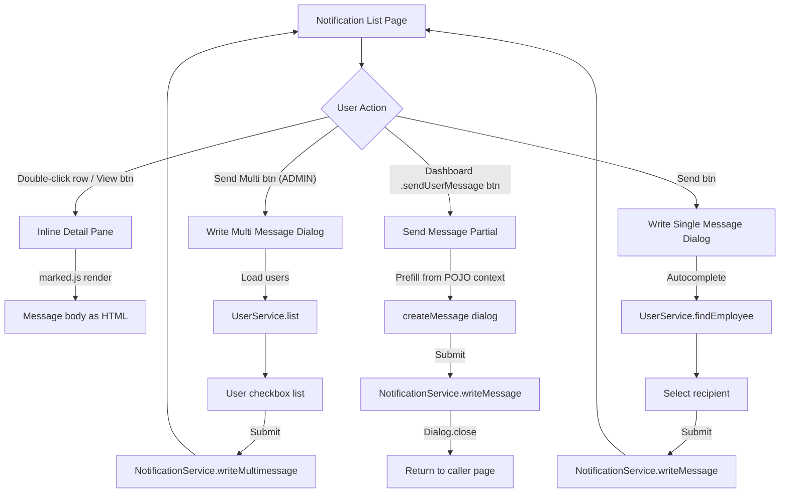
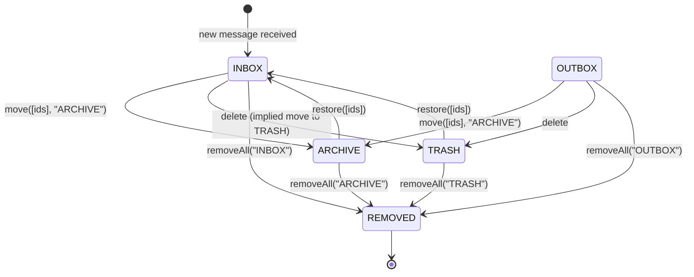
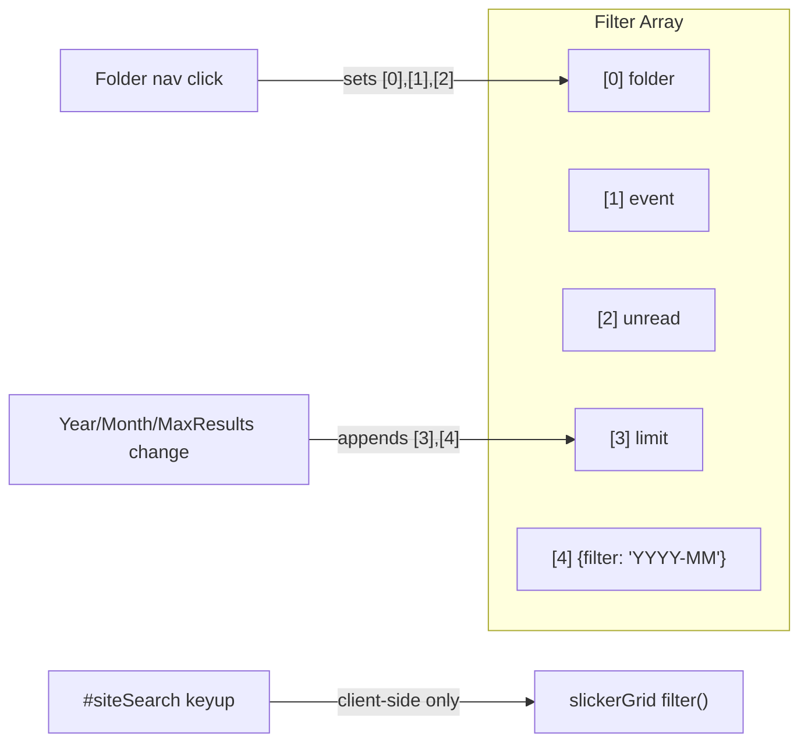

# Notification Module -- Legacy UI Analysis

> **Source files analysed**
>
> | File | Lines | Role |
> |------|------:|------|
> | `notification/index.htmlm` | 139 | List page -- grid, detail pane, two compose dialogs |
> | `notification/index.js` | 288 | List page logic (CRUD, folder nav, multi-message) |
> | `notification/messages.i18n.js` | 28 | i18n overrides + custom formatters |
> | `notification/sendMessage.mustache` | 17 | Dashboard-embedded "send message" partial |
> | `notification/sendMessage.js` | 63 | Send-message dialog logic (prefill, autocomplete) |
> | `ApplicationResources.properties` | -- | German translations |
> | `ApplicationResources_en.properties` | -- | English translations |

---

## 1. Block: Notification List (Grid)

### 1.1 HTMLM Header Metadata

| Field | Value |
|-------|-------|
| `usePanel` | `true` |
| `navBar` | `../_include/navbar.mustache` |
| `search` | `true` (enables `#siteSearch` text input) |
| `filter` | `true` |

### 1.2 Nav Buttons (Toolbar Actions)

| ID | Label key | Icon | Roles | Initial state |
|----|-----------|------|-------|---------------|
| `sendMultiMenuBtn` | `notification.multi` | `layer-plus` | **ADMIN** | enabled |
| `viewMenuBtn` | `action.view` | `envelope-open-text` | all | enabled |
| `deleteMenuBtn` | `action.delete` | `trash` | all | **disabled** |
| `restoreMenuBtn` | `action.restore` | `trash-restore` | all | enabled |
| `deleteAllMenuBtn` | `action.deleteAll` | `dumpster` | all | enabled |

> There is a spacer between `deleteMenuBtn` and `restoreMenuBtn`.

### 1.3 Toolbar Controls (Year / Month / Max Results)

| Control | Element | Default | Options |
|---------|---------|---------|---------|
| Year | `<input type="number" id="year">` | `2025` (HARDCODED) | free numeric |
| Month | `<select id="month">` | `""` (all) | `""`, `1`-`12` (i18n month names) |
| Max results | `<select id="maxResults">` | `100` | `100`, `200`, `300`, `500` |

Changing any control rebuilds the filter array and calls `$grid.slickerGrid("reload")`.

Filter array structure: `[folder, event, unread, limit, {filter: "YYYY-MM"}]`

### 1.4 Grid Columns

| # | `data-field` | Label key | Width | Formatter | Notes |
|---|-------------|-----------|------:|-----------|-------|
| 1 | `important` | `" "` (space) | 30 | `Formatter.important` | Envelope icon (open/closed) + exclamation if important |
| 2 | `from` | `notification.from` | 130 | `Formatter.name` | Sender display name |
| 3 | `ts` | `notification.ts` | 130 | `Formatter.dateTime` | Timestamp |
| 4 | `subject` | `notification.subject` | 400 | (none -- raw text) | |
| 5 | `folder` | `notification.folder` | 100 | `Formatter.notificationFolder` | Maps enum to i18n label |

Initial data-filter: `["INBOX", null, false]` -- Inbox, no event filter, include read.

### 1.5 Grid Configuration (SlickerGrid)

```js
{
  fullscreen: true,
  dataService: {
    service: "NotificationService",
    method: "list",
    param: function(){ return $this.data().filter; }
  },
  filter: function(item, args) {
    // client-side text filter on from.name and subject
  },
  saveSettings: function(settings) {
    // persists grid column settings via UserService.saveSetting
  }
}
```

### 1.6 Client-Side Search

`#siteSearch` keyup/change filters the grid client-side on `from.name` and `subject`. Escape clears the search.

### 1.7 Custom Formatters

#### `Formatter.important`

Returns a Font Awesome icon stack:
- `far fa-envelope-open` if `rowdata.read` is truthy (with `title` = read timestamp)
- `far fa-envelope` if unread
- `fas fa-exclamation` appended if `rowdata.important` is truthy

#### `Formatter.notificationFolder`

Maps the folder enum string to its i18n label via `i18n["notification_folder_" + value]`.

---

## 2. Block: Message Detail (Inline)

The detail pane is rendered inline below the selected grid row (not a separate route/dialog).

| Property | `data-icon` | `data-color` | `title` |
|----------|------------|-------------|---------|
| Detail container | `fas fa-building` | `bg-color-notify` | `{{i18n.notification}}` |

### 2.1 Detail Fields

| Row | Col span | Field path | Display | Style |
|-----|----------|-----------|---------|-------|
| 1 | col-md-4 | `data.to.name` | Recipient name | normal |
| 1 | col-md-4 | `data.from.name` | Sender name | *italic* |
| 1 | col-md-4 | `data.ts` | Timestamp | `dateTime` formatter |
| 2 | col-md-12 | `data.subject` | Subject | **bold**, followed by `<hr>` |
| 3 | col-md-12 | `data.message` | Message body | rendered via `marked()` (Markdown to HTML) |

### 2.2 Detail Data Loading

The `getMethod` override fetches via `NotificationService.get(id)`, then runs `marked(data.message)` to convert Markdown before rendering. This means the message body is stored as Markdown on the server.

---

## 3. Block: Write Multi Message Dialog (`writeMultiMessageDlg`)

**Access control**: Only the `sendMultiMenuBtn` trigger is visible; that button requires **ADMIN** role (declared in HTMLM header `roles: "ADMIN"`).

### 3.1 Layout

Two-column layout (col-md-4 / col-md-8):

**Left panel -- User selection**

| Element | ID / Selector | Purpose |
|---------|--------------|---------|
| Search input | `#msgUserSearch` | Filters user list client-side by `displayName` |
| Toggle all checkbox | `#msgUserToggle` | Checks/unchecks all *visible* users |
| Customer filter dropdown | `#msgUserfilter` | `NULL` (all), `CUSTOMER` (customers only) |
| User list container | `#msgUserList` | Scrollable (250px) list of `.userDetail` rows |
| User row template | `.userDetail` | Checkbox (`class="boolean array" name="data.tos"`) + `<span class="name">` |

**Right panel -- Message form**

| Element | `name` | Placeholder key | Validation |
|---------|--------|----------------|------------|
| Subject input | `data.subject` | `notification.subject` | `mandatory` |
| Message textarea | `data.message` | `notification.message` | `noescape` (allows HTML/Markdown) |

### 3.2 Form Elements Table

| Field | Type | `name` | Required | Special class | Notes |
|-------|------|--------|----------|---------------|-------|
| User search | text | (no name) | no | -- | Client-side filter only, not submitted |
| Toggle all | checkbox | (no name) | no | -- | UI helper, not submitted |
| Customer filter | select | (no name) | no | -- | Triggers server reload of user list |
| Recipient checkboxes | checkbox[] | `data.tos` | at least 1 | `boolean array` | Values are user IDs |
| Subject | text | `data.subject` | yes | `mandatory` | |
| Message | textarea | `data.message` | no | `noescape` | Markdown/HTML content |

### 3.3 User List Loading

1. On first open: calls `UserService.list([false, null])` to load all non-customer users.
2. Caches result in module-level `userList` variable.
3. On `#msgUserfilter` change:
   - `NULL` -> `UserService.list([false, null])` (all employees)
   - `CUSTOMER` -> `UserService.list([true, null])` (customers only)
4. User list is rebuilt from a detached jQuery template each time.

### 3.4 Submit

```
NotificationService.writeMultimessage(tos[], subject, message)
```

Validation: `data.tos.length > 0` required, otherwise submission is blocked (`return false`). After success, grid reloads.

---

## 4. Block: Write Single Message Dialog (`writeMessageDlg`)

### 4.1 Layout

Two-row form (col-md-3 + col-md-9, then col-md-12).

### 4.2 Form Elements Table

| Field | Type | `name` | Required | Special class | Notes |
|-------|------|--------|----------|---------------|-------|
| Recipient | text (autocomplete) | `data.to` | yes | `mandatory object` | `data-display="name"`, autocomplete via `UserService.findEmployee` |
| Subject | text | `data.subject` | yes | `mandatory` | |
| Message | textarea | `data.message` | no | `noescape` | Markdown/HTML content |

### 4.3 Recipient Autocomplete

```js
Core.autoselect(input, {
  serviceName: "UserService",
  method: "findEmployee",
  display: "displayName",
  useFilter: true,
  filter: function() { return {}; },
  appendTo: $("#writeMessageDlg")
});
```

The autocomplete searches employees by display name and stores the full user object in the form field.

### 4.4 Submit

This dialog is initialized via `Dialog.init($writeDlg)` but no explicit submit handler is shown in the JS. It likely uses the standard `Core.initCrud` save flow, which would call `NotificationService.save` or `NotificationService.write`. The exact method is not visible in the extracted code; the multi-message dialog uses `writeMultimessage` while the dashboard partial uses `writeMessage`.

---

## 5. Block: Send Message Partial (`sendMessage.mustache` / `createMessage`)

This is a standalone partial included from the dashboard (and potentially other pages). It has its own JS file.

### 5.1 Dialog Metadata

| Property | Value |
|----------|-------|
| `id` | `createMessage` |
| `data-icon` | `fas fa-comment-alt-lines` |
| `data-color` | `bg-color-notify` |
| `title` | `{{i18n.notification.message}}` |

### 5.2 Form Elements Table

| Field | Type | `name` | Required | Special class | Notes |
|-------|------|--------|----------|---------------|-------|
| Subject | text | `data.subject` | yes | `mandatory` | col-md-8 |
| Recipient | text (autocomplete) | `data.to` | yes | `mandatory object` | `data-display="displayName"`, col-md-4 |
| Message | textarea | `data.message` | no | (none) | No `noescape` -- plain text only |

> Note: Unlike the other two compose dialogs, this textarea does NOT have `class="noescape"`, meaning HTML/Markdown may be escaped on submission.

### 5.3 Autocomplete

The autocomplete is configured identically to `writeMessageDlg` (using `UserService.findEmployee` with `displayName`). Configuration is set up within `sendMessage.js` via the same `Core.autoselect` pattern (implied by the `object` class and `data-display` attribute).

### 5.4 Prefill Mechanism

The `sendUserMessage(prefill)` function accepts an object:

```js
{ to: userObject, subject: string, message: string }
```

It is invoked by:
1. Direct call: `sendUserMessage(prefill)`
2. Click handler on `.sendUserMessage` buttons anywhere in the DOM:
   - Looks up the nearest `.POJO` ancestor and extracts user from `pojo.user`, `pojo.ownerView`, or `pojo.userView`
   - Reads `data-subject` and `data-message` attributes from the button element

### 5.5 Focus Behavior

On `dialogopen`:
- If `to` is already prefilled, focus goes to the textarea
- Otherwise, focus goes to the `data.to` input

### 5.6 Submit

```
NotificationService.writeMessage(data.to.id, data.subject, data.message)
```

On success, calls `Dialog.close("#createMessage")`.

---

## 6. Click Actions Summary

| Trigger | Element / Event | Action |
|---------|----------------|--------|
| Row double-click | `$grid.on("rowAction")` | Triggers `#viewMenuBtn` click (opens detail) |
| Row select | `$grid.on("rowSelected")` | Enables/disables toolbar buttons based on `folder` state |
| View | `#viewMenuBtn` | Opens inline detail pane (via `Core.initCrud`) |
| Delete | `#deleteMenuBtn` | Moves to TRASH (disabled until row selected + not already in TRASH) |
| Restore | `#restoreMenuBtn` | Calls `NotificationService.restore([ids])` -- moves from TRASH/ARCHIVE to INBOX |
| Delete All | `#deleteAllMenuBtn` | Confirm dialog, then `NotificationService.removeAll(currentFolder)` |
| Archive | `#archiveMenuBtn` | Calls `NotificationService.move([ids], "ARCHIVE")` |
| Send Multi | `#sendMultiMenuBtn` | Opens `writeMultiMessageDlg` (ADMIN only) |
| Send Single | `#sendMenuBtn` | Opens `writeMessageDlg` |
| Create (dashboard) | `#notificationCreate` | Delegates to `#sendMenuBtn` click |
| Folder: New | `#notificationNew` | Sets filter to `["INBOX", null, true]` (unread only) |
| Folder: Sent | `#notificationSent` | Sets filter to `["OUTBOX", null, false]` |
| Folder: Archive | `#notificationArchive` | Sets filter to `["ARCHIVE", null, false]` |
| Folder: Trash | `#notificationTrash` | Sets filter to `["TRASH", null, false]` |
| `.sendUserMessage` | Any button with class | Opens `createMessage` dialog with prefilled data |

### Row Selection Button State Logic

```
On rowSelected:
  - replyMenuBtn    -> enabled
  - viewMenuBtn     -> enabled
  - archiveMenuBtn  -> disabled if folder === "ARCHIVE"
  - deleteMenuBtn   -> disabled if folder === "TRASH"
  - restoreMenuBtn  -> disabled if folder !== "TRASH" AND folder !== "ARCHIVE"
```

---

## 7. Server API Calls

| Service | Method | Parameters | Trigger | Notes |
|---------|--------|-----------|---------|-------|
| `NotificationService` | `list` | `[folder, event, unread, limit?, {filter}?]` | Grid load / reload | Main data source |
| `NotificationService` | `get` | `[id]` | Detail view | Response `.message` is Markdown-rendered |
| `NotificationService` | `removeAll` | `[folder]` | Delete All button | Deletes all in current folder |
| `NotificationService` | `move` | `[ids[], "ARCHIVE"]` | Archive button | Moves selected to ARCHIVE |
| `NotificationService` | `restore` | `[ids[]]` | Restore button | Moves selected back to INBOX |
| `NotificationService` | `writeMultimessage` | `[tos[], subject, message]` | Multi-message dialog | ADMIN only |
| `NotificationService` | `writeMessage` | `[toUserId, subject, message]` | Send message partial | Single recipient |
| `UserService` | `list` | `[isCustomer, role]` | Multi-message user list | `[false, null]` or `[true, null]` |
| `UserService` | `findEmployee` | `(search text)` | Recipient autocomplete | Returns employees matching search |
| `UserService` | `saveSetting` | `[name, settingsJSON]` | Grid column save | Persists grid layout preferences |

---

## 8. Permissions

| Feature | Required Role | Enforcement |
|---------|--------------|-------------|
| View notification list | Authenticated | Page-level (implicit) |
| View/read message detail | Authenticated | Row-level via `NotificationService.get` |
| Send single message | Authenticated | `writeMessageDlg` / `createMessage` available to all |
| Send bulk message | **ADMIN** | `sendMultiMenuBtn` has `roles: "ADMIN"` in HTMLM header |
| Delete / Archive / Restore | Authenticated | Toolbar buttons, no extra role check |
| Delete All | Authenticated | Confirm dialog only |

---

## 9. Translation Table

### Core Notification Labels

| Key | DE (German) | EN (English) | Source |
|-----|-------------|-------------|--------|
| `notification` | Nachrichten | Notification | properties |
| `notification.customers` | Kunden | Customers | properties |
| `notification.folder` | Ort | Folder | properties |
| `notification.folder.ARCHIVE` | Archiv | Archived | properties |
| `notification.folder.INBOX` | Eingang | Inbox | properties |
| `notification.folder.OUTBOX` | Ausgang | Outbox | properties |
| `notification.folder.TRASH` | Geloscht | Trash | properties |
| `notification.from` | Sender | From | properties |
| `notification.important` | Wichtig | MISSING | properties (DE only) |
| `notification.message` | Nachricht | Message | properties |
| `notification.multi` | Massen-Nachricht | Bulk message | properties |
| `notification.recipient` | Empfanger | Recipent | properties |
| `notification.subject` | Titel | Subject | properties |
| `notification.ts` | Datum | Date | properties |

### Hardcoded / Implicit Strings

| String | Location | Language | Note |
|--------|----------|----------|------|
| `"2025"` | `index.htmlm` line 27 | -- | HARDCODED year default |
| `"-"` | `index.htmlm` line 29 | -- | HARDCODED month placeholder (no i18n) |
| `"100"`, `"200"`, `"300"`, `"500"` | `index.htmlm` lines 45-48 | -- | HARDCODED result limits |
| `"---"` | `index.htmlm` line 99 | -- | HARDCODED null-option label in customer filter |
| `i18n.dialog_delete_confirm` | `index.js` line 117 | -- | Used in `confirm()` for Delete All (framework-level key) |
| `"NULL"`, `"CUSTOMER"` | `index.htmlm` lines 99-100 | -- | HARDCODED option values in user filter dropdown |

### Notification Event Types (for reference)

These are defined in `ApplicationResources` but not directly used by the notification UI module (they appear in notification templates and system-generated messages):

| Event | DE | EN |
|-------|----|----|
| `APPOINTMENT_ABORTED` | Termin Abgebrochen | Appointment Aborted |
| `APPOINTMENT_ACCEPTED` | Termin Akzeptiert | Appointment Accepted |
| `APPOINTMENT_AGREED` | Termin vom Arzt akzeptiert | Appointment Agreed |
| `FORWARD_NOTIFICATION` | Benutzer Nachricht Weiterleitung | Forward message from another user |
| ... (30+ events) | | |

---

## 10. Data Model (Inferred)

### Notification Object

| Field | Type | Notes |
|-------|------|-------|
| `id` | string | Primary key |
| `from` | `{ id, name }` | Sender user reference |
| `to` | `{ id, name }` | Recipient user reference |
| `subject` | string | Message subject |
| `message` | string | Body content (Markdown) |
| `ts` | datetime | Timestamp |
| `folder` | enum: `INBOX`, `OUTBOX`, `ARCHIVE`, `TRASH` | Current folder location |
| `read` | boolean/timestamp | Read status (falsy = unread, truthy = read timestamp) |
| `important` | boolean | Important flag |

### Folder Enum

```
INBOX   -- received messages (default view)
OUTBOX  -- sent messages
ARCHIVE -- archived messages
TRASH   -- deleted messages
```

---

## 11. Mermaid Diagrams

### 11.1 Dialog Navigation Flow



### 11.2 Folder State Transitions



### 11.3 Filter Array Construction



---

## 12. Implementation Notes for React/Shadcn Migration

### Key Behavioral Differences to Preserve

1. **Inline detail pane** -- The detail view renders below the selected row in the grid, not as a separate route or drawer. Consider using an expandable row or a split-pane layout.

2. **Markdown rendering** -- Message bodies are stored as Markdown and rendered with `marked.js`. Use a React Markdown renderer (e.g., `react-markdown` or `@mdx-js/react`).

3. **Multi-select user list** -- The bulk message dialog has a searchable, filterable checkbox list with toggle-all. This is a custom compound component (search + filter dropdown + virtual list + select-all).

4. **Prefill from context** -- The `sendUserMessage` function is callable from any page where a `.sendUserMessage` button exists inside a `.POJO` container. The React equivalent should expose a composable hook or context-based trigger.

5. **Client-side grid filtering** -- The search box filters the already-loaded data client-side (no server round-trip). The year/month/maxResults controls trigger a server reload.

6. **Folder navigation via sidebar** -- Folder switching (`#notificationNew`, `#notificationSent`, etc.) changes the filter array and reloads. These are sidebar sub-items with active-state management.

7. **Grid settings persistence** -- Column width/order settings are saved per user via `UserService.saveSetting`.

### Typo in Legacy EN Translation

`notification.recipient` = "Recipent" (missing 'i') -- should be "Recipient" in the new implementation.
