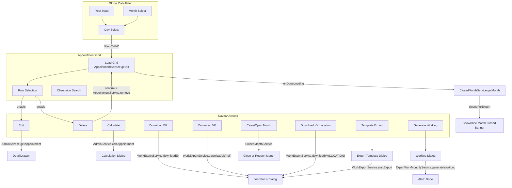
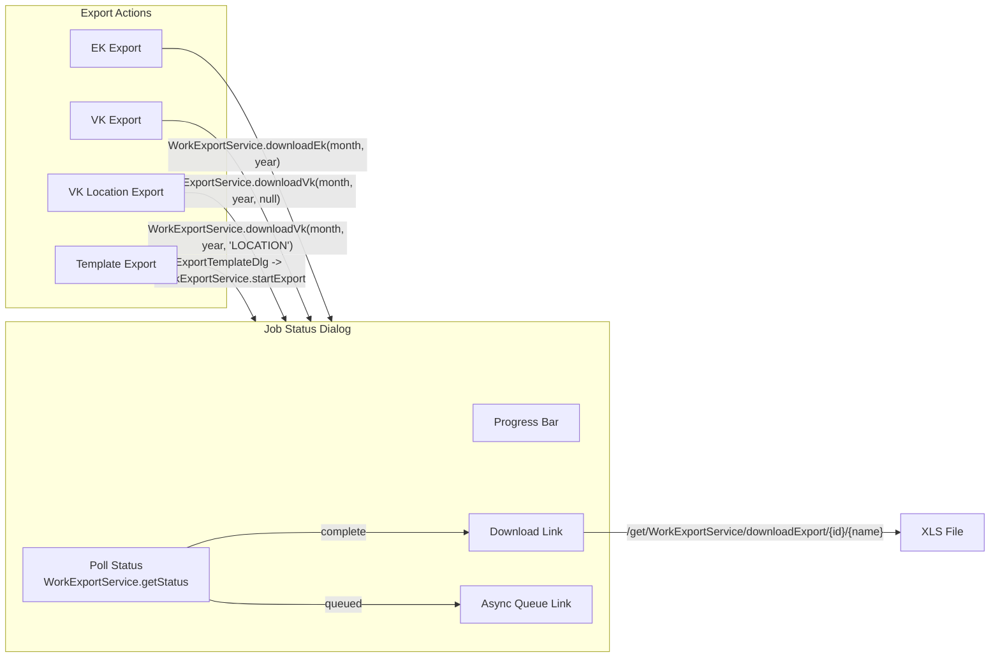
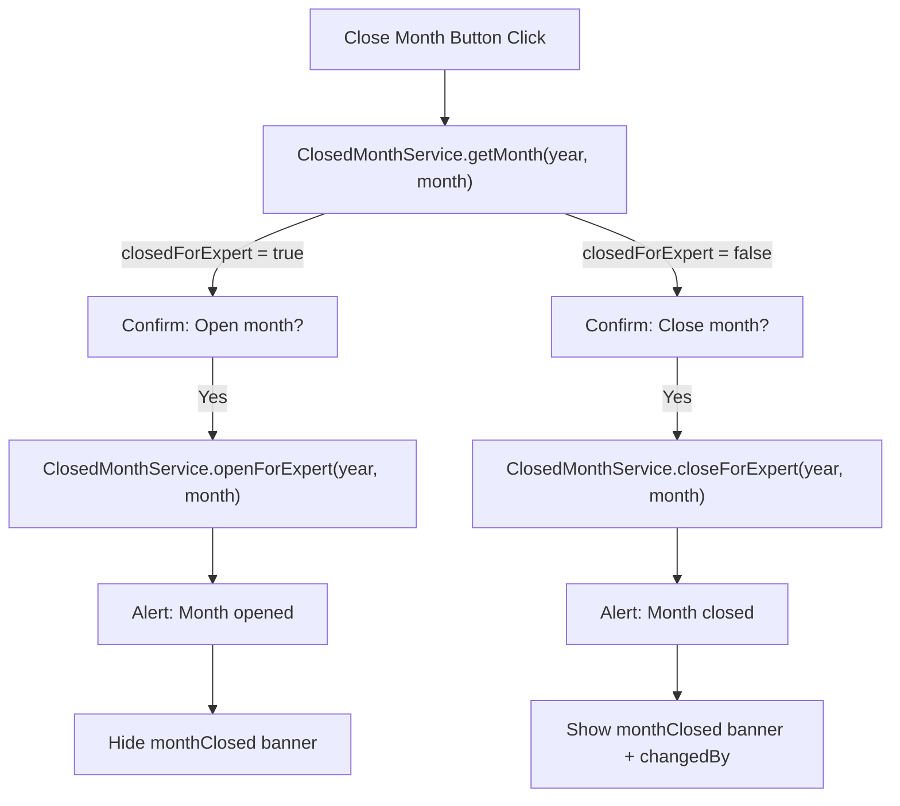

# Appointment Admin Module Analysis

> **Source**: `appointmentAdmin/index.htmlm` + `appointmentAdmin/index.js` + `appointmentAdmin/messages.i18n.js`
> **Lines**: ~1,881 (HTMLM ~1,146 + JS ~732 + i18n ~6)
> **Role**: Administrative billing/operations view for appointments (not scheduling). Provides grid overview, detail editing, billing calculation, multiple export formats, consultation management, CDR call assignment, QM questionnaire review, and month-close workflow.

---

## Cross-References

### Source Includes

| Type | Direction | Detail | Linked Document | Condition / Context |
|------|-----------|--------|-----------------|---------------------|
| include | **Includes** | `{{> closeMonth}}` | [Close Month Dialog](../../appointment-support/close-month.md) | Shared month close/reopen dialog |

### References

| Type | Direction | Detail | Linked Document | Condition / Context |
|------|-----------|--------|-----------------|---------------------|
| reference | **References** | QM questionnaire review | [questionnaire-detail](./questionnaire-detail.md) | QM questionnaire detail view for consultation review |

---

## 1. Page Structure Overview

The module is a single-page admin view composed of:

1. **Global date filter toolbar** (year / month / day selectors)
2. **Month-closed alert banner** (shown when month is closed for expert)
3. **Main appointment grid** (SlickerGrid with 13 columns)
4. **Detail drawer** (appointment detail with summary times, consultations list, embedded toolbars)
5. **Seven dialogs**: Consultation Edit, Consultation Move, Calculation, QM Questionnaire, CDR Call Assignment, Consultation Submit, Generate Worklog, Export Template, Job Status, Consultation Logs

---

## 2. Global Date Filter Toolbar

| Field | Type | ID | Default | Notes |
|-------|------|----|---------|-------|
| Year | `<input type="number">` | `#year` | Current year (JS-set) | Width 100px |
| Month | `<select>` (1-12) | `#month` | Current month (JS-set) | i18n Month.JAN..DEC labels |
| Day | `<select>` (blank + 1-31) | `#day` | Current day (JS-set) | Blank = all days in month |

**Behavior**: Changes to year/month trigger day change. Day change constructs filter string `YYYY-M-D`, sets `$(document).data().globalFilter.filter`, triggers `loadGrid`. Deeplink tracks `year`, `month`, `day`.

---

## 3. Month-Closed Alert

- ID: `#monthClosed`, hidden by default
- Shown after grid loads if `ClosedMonthService.getMonth(year, month)` returns `closedForExpert = true`
- Displays: `{{i18n.monthClosed.by}} <span id="changedBy">{name}</span>`

---

## 4. Main Grid

### 4.1 Grid Configuration

| Property | Value |
|----------|-------|
| Container | `#appointment .grid` |
| Plugin | `slickerGrid` |
| fullscreen | `true` |
| Data Service | `AppointmentService.getAll` |
| Params | `[filter, 100]` (limit 100) |
| Save Settings | `UserService.saveSetting` (per grid-setting code) |

### 4.2 Grid Columns

| # | Field | Name (i18n key) | Sortable | Width | Formatter | Notes |
|---|-------|-----------------|----------|-------|-----------|-------|
| 1 | `id` | `label.id` | Yes | 60 | (none) | Plain text |
| 2 | `date` | `appointment.start` | Yes | 80 | `Formatter.date` | Date only |
| 3 | `timeStart` | `appointment.from` | Yes | 60 | (none) | Time string |
| 4 | `timeEnd` | `appointment.until` | Yes | 60 | (none) | Time string |
| 5 | `location` | `appointment.location` | Yes | 230 | `Formatter.name` | Object `.name` |
| 6 | `job` | `appointment.service` | Yes | 205 | `Formatter.name` | Object `.name` |
| 7 | `assignedDisplayName` | `appointment.physician` | Yes | 160 | (none) | Flat string |
| 8 | `type` | `appointment.type` | Yes | 100 | `options` (enum) | AppointmentType enum dropdown |
| 9 | `state` | `AppointmentState` | Yes | 120 | `i18n.appointmentStateFormatter` | Color-coded icon + label |
| 10 | `paymentType` | `AppointmentPaymentType` | Yes | 100 | `options` (enum) | AppointmentPaymentType enum |
| 11 | `dateStorno` | `appointment.cancel` | Yes | 100 | `i18n.stornoTimeFormatter` | Custom: shows `humanTime(start - dateStorno)` |
| 12 | `count` | `appointment.count` | Yes | 70 | (none) | Number |
| 13 | `period` | `appointment.period` | Yes | 100 | (none) | String |

### 4.3 Grid Client-Side Search Filter

Field: `#siteSearch` (text input, from navbar)

Searches across: `assignedDisplayName`, `location.name`, `date`, `timeStart`, `timeEnd`, `id` (case-insensitive substring match). ESC clears.

---

## 5. Navbar Toolbar Actions

| # | Button ID | Name (i18n) | Icon | Default State | Description |
|---|-----------|-------------|------|---------------|-------------|
| 1 | `editMenuBtn` | `action.change` | `pencil` | Disabled | Edit selected appointment (opens detail) |
| 2 | `deleteAppointmentBtn` | `action.delete` | `trash` | Disabled | Delete selected appointment(s) - calls `AppointmentService.remove([ids])` with confirm |
| 3 | `calcMenuBtn` | `action.calculate` | `cash-register` | Enabled | Open billing calculation dialog |
| 4 | *(spacer)* | | | | |
| 5 | `downloadEkMenuBtn` | `appointment.list.EK` | `file-export` | Enabled | Export EK (internal/purchase) XLS |
| 6 | `downloadVkMenuBtn` | `appointment.list.VK` | `file-export` | Enabled | Export VK (client/sale) XLS |
| 7 | `downloadVkLocationMenuBtn` | `appointment.location.VK` | `file-export` | Enabled | Export VK by location XLS |
| 8 | `templateExportMenuBtn` | `action.export` | `file-export` | Enabled | Custom template export dialog |
| 9 | *(spacer)* | | | | |
| 10 | `generateWorklogMenuBtn` | `Worklog` | `file-export` | Enabled | Generate expert work log |
| 11 | `closeMonthBtn` | `action.closeMonth` | `calendar-exclamation` | Enabled | Toggle close/open month for expert |

---

## 6. Detail Drawer

### 6.1 Configuration

| Property | Value |
|----------|-------|
| ID | `#appointment .detail` |
| Icon | `fas fa-boxes` |
| Width | 1200 |
| Color | `bg-color-appointment` |
| Target | `primary` |
| Save Button | Yes |
| Title | "Termin" (HARDCODED German) |
| CRUD Service | `AdminService.getAppointment` / `AdminService.saveAppointment` |

### 6.2 Detail Header (Read-Only Display)

| Element | Data Binding | Notes |
|---------|-------------|-------|
| Required staff count | `data.appointment.requiredStaffCount` | Prefixed with "x" |
| Job code | `data.appointment.job.code` | |
| Weekday | `data.appointment.weekday` | |
| Date | `data.appointment.date` | |
| Time range | `data.appointment.timeStart` - `timeEnd` | |
| Display state | `data.appointment.displayState` | Inline block |
| Comment | `data.appointment.comment` | Italic |
| Expert appointment link | `data.appointment.expertAppointment.id` / `.expertName` | Deeplink |
| Referenced appointments | `data.appointment.referenced[]` collection | Each is a deeplink with `displayName` |

### 6.3 Detail Form Fields

| # | Field Path | Type | Label / Placeholder | Widget | Notes |
|---|-----------|------|---------------------|--------|-------|
| 1 | `data.appointment.customer` | Object autocomplete | `{{i18n.customer}}` | Read-only input, display=name | With calc button |
| 2 | `data.appointment.location` | Object autocomplete | `{{i18n.location}}` | `LocationService.autocomplete` | Editable |
| 3 | `data.appointment.state` | Select (enum) | `{{i18n.AppointmentState}}` | `#stateap`, AppointmentState options | Changes show/hide storno vs active sections |
| 4 | `data.appointment.job` | Object autocomplete | (none) | `JobService.autocomplete`, display=code, mandatory | |
| 5 | `data.appointment.paymentType` | Select (enum) | (none) | `#paymentType`, AppointmentPaymentType options | Color-coded background |

### 6.4 Assigned Experts Collection

| Collection ID | `#assignedExperts` |
|--------------|-----|
| Data field | `data.appointment.assigned` |
| Display per row | Icon (support/main/doctor) + `assigned.user.displayName` + `assigned.state` |

Icon logic:
- `support === true` -> blue `fa-user-md` (support icon)
- `support === false` -> green `fa-user-md-chat` (main icon)
- else -> default `fa-user-md` (doctor, not a council)

### 6.5 Time Sections (Storno vs Active)

#### Storno Section (`.stornoap`, shown when state = STORNO or CANCELED)

| # | Field Path | Type | Label | Notes |
|---|-----------|------|-------|-------|
| 1 | `data.summary.stornoTime` | Human time input | `{{i18n.appointment.cancellation}}` | Format: "5d 3h". On keyup recalculates `dateStorno` |

#### Active Section (`.activeap`, shown for non-storno states)

**Expert Times Column:**

| # | Field Path | Type | Label |
|---|-----------|------|-------|
| 1 | `data.summary.firstContact` | Time picker | `{{i18n.appointment.firstContact}}` |
| 2 | `data.summary.adjustedStart` | Time picker | Play icon |
| 3 | `data.summary.adjustedUntil` | Time picker | Stop icon |

**Logging Times Column:**

| # | Field Path | Type | Label | Notes |
|---|-----------|------|-------|-------|
| 1 | `data.summary.loggedFirstContact` | Time picker | `{{i18n.appointment.firstContact}}` | Has CDR call assignment phone icon |
| 2 | `data.summary.loggedStart` | Time picker | Play icon | `suggestType` class |
| 3 | `data.summary.loggedUntil` | Time picker | Stop icon | |
| 4 | (display) | Text | | "X Offene CDR" (unmatched shift calls) |
| 5 | `#takeLogTimes` | Button | `{{i18n.label.apply}}` | Copies logged times -> verified times |

**Verified Times Column:**

| # | Field Path | Type | Label | Notes |
|---|-----------|------|-------|-------|
| 1 | `data.summary.verifiedFirstContact` | Time picker | `{{i18n.appointment.firstContact}}` | |
| 2 | `data.summary.verifiedStart` | Time picker | Play icon | `suggestType` class |
| 3 | `data.summary.verifiedUntil` | Time picker | Stop icon | |
| 4 | `#takePlanTimes` | Button | "Planungszeit nehmen" (HARDCODED) | Copies planned times -> verified times |

### 6.6 Summary Statistics Row

| # | Field Path | Type | Label |
|---|-----------|------|-------|
| 1 | (display) `data.summary.sum` | Text | "Patienten" (HARDCODED) + min count from `data.appointment.minPatients` |
| 2 | `data.summary.referral` | Number input | `{{i18n.FurtherTreatment.REFERRAL}}` |
| 3 | `data.summary.ifRequired` | Number input | "WV" (HARDCODED) |
| 4 | `data.summary.followUp` | Number input | `{{i18n.FurtherTreatment.FOLLOW_UP}}` |
| 5 | `data.summary.referralOther` | Number input | `{{i18n.appointment.transfer}}` |
| 6 | `data.summary.nofollow` | Number input | `{{i18n.appointment.unknownfollowup}}` |
| 7 | `data.qm.comment` | Textarea | `{{i18n.label.comment}}` | Only shown for APPOINTMENT type (`.showap`) |

### 6.7 Appointment Comment

| Field Path | Type | Label |
|-----------|------|-------|
| `data.appointment.comment` | Textarea | `{{i18n.label.comment}}` |

---

## 7. Consultation List (Embedded in Detail)

### 7.1 Consultation Toolbar

| # | Button ID | Icon | Title (i18n) | Action |
|---|-----------|------|-------------|--------|
| 1 | `consultationEditBtn` | `fa-file-edit` | (none) | Open consultation edit dialog for selected row |
| 2 | `consultationCheckQmBtn` | `fa-clipboard-list-check` | `consultation.qm` | Load QM questionnaire for selected consultation |
| 3 | `consultationTransmitBtn` | `fa-external-link` | `label.transmit` | Open submit dialog to transmit consultation |
| 4 | `consultationDownloadBtn` | `fa-cloud-download` | `label.download` | Download consultation PDF |
| 5 | `consultationCopyBtn` | `fa-copy` | `button.copy` | Duplicate consultation N times (prompt for count) |
| 6 | `consultationUploadBtn` | `fa-upload` | `button.upload` | File upload via `AdminService.savePrefilledConsultation` |
| 7 | `consultationLogsBtn` | `fa-fw fa-stream` | `consultation.logs.button.upload` | Show consultation logs dialog |
| 8 | `consultationDeleteBtn` | `fa-trash` | `action.delete` | Delete selected consultation (with confirm) |
| 9 | `doctorSelect` | (select) | (none) | Doctor picker for new consultations, populated from assigned experts (AGREED/ADDED/ACCEPTED) |
| 10 | `addCustomConsultation` | `fa-plus` | (none) | Add new consultation row with prefill from detail context |
| 11 | `consultationMoveBtn` | `fa-dolly` | `action.move` | Move consultations between appointments |

### 7.2 Consultation List Table Columns

| # | Column | Field Binding | Type | Notes |
|---|--------|--------------|------|-------|
| 1 | (index) | `consultations.$idx` | Display | Row counter |
| 2 | (doctor icon) | `cur.doctor` | Icon + tooltip | `fa-user-md` with doctor name tooltip |
| 3 | Patient | `consultations.jNumber` + `consultations.bookNumber` | Display | J-Number + Book Number |
| 4 | Location | `consultations.location.name` | Display | |
| 5 | First Contact | `consultations.contact` | Time input | Editable clockpicker, 60px |
| 6 | Start | `consultations.start` | Time input | Editable clockpicker, 60px |
| 7 | End | `consultations.end` | Time input | Editable clockpicker, 60px |
| 8 | Submit Date | `consultations.dateTransmitted` | DateTime display | Tooltip shows `transmitResult` |
| 9 | Further Treatment | `consultations.furtherTreatment` | Select | Options: (none), REFERRAL, IF_REQUIRED, FOLLOW_UP, REFERRAL_OTHER |
| 10 | Payment | `cur.paymentType` | Icon display | Dynamic icon: `fa-check` (FULL), `fa-cash-register` (VK), `fa-user-md` (EK), `fa-ban` (IGNORE) |
| 11 | Communication Type | `consultations.communicationType` | Select | Options: VIDEO, VCGO, PHONE, EMAIL |
| 12 | Attachments | `consultations.attachments[]` | Nested collection | Links to `ConsultationService/attachment/{parentId}/{fileId}` |
| 13 | Comment | `cur.comment` | Icon display | `fa-comment` with tooltip, hidden if comment length <= 1 |

### 7.3 Consultation Prefill (on add)

When adding a new consultation, the prefill data includes:
- `location`: from current appointment detail
- `state`: "VERIFIED"
- `communicationType`: "VIDEO"
- `medicalTrainedPersonel`: false
- `contact`, `start`: appointment start time (HH:mm)
- `end`: appointment start + 30min
- `doctorId` / `doctor`: from `#doctorSelect` selection

---

## 8. Dialogs

### 8.1 Consultation Edit Dialog (`#consultationEditWindow`)

| Property | Value |
|----------|-------|
| Width | 600 |
| Target | `secondary` |
| Title | `{{i18n.consultation}}` |
| Flush | true |

**Form Fields:**

| # | Field Path | Type | Label / Placeholder |
|---|-----------|------|---------------------|
| 1 | `data.jNumber` | Text input | `{{i18n.consultation.jnumber}}` |
| 2 | `data.bookNumber` | Text input | `{{i18n.consultation.booknumber}}` |
| 3 | `data.doctor` | Display only | Doctor name (read-only) |
| 4 | `data.location` | Object autocomplete | `LocationService.autocomplete` |
| 5 | `data.state` | Select | ConsultationState: CREATED, OPEN, TRANSMITTED, CLOSED, VERIFIED |
| 6 | `data.start` | Time picker | Play icon |
| 7 | `data.dateTransmitted` | DateTime display | Read-only, file-import icon |
| 8 | `data.end` | Time picker | Stop icon |
| 9 | `data.contact` | Time picker | `fa-phone-plus` (first contact) |
| 10 | `data.paymentType` | Select (enum) | `#consulPaymentType`, AppointmentPaymentType, color-coded |
| 11 | `data.communicationType` | Select | VIDEO, VCGO, PHONE, EMAIL |
| 12 | `data.medicalTrainedPersonel` | Checkbox | `{{i18n.consultation.medicalTrainedJVAPersonnel}}` |
| 13 | `data.furtherTreatment` | Select | REFERRAL, IF_REQUIRED, FOLLOW_UP, REFERRAL_OTHER |
| 14 | `data.requireReporting` | Checkbox | `{{i18n.consultation.requireReporting}}` |
| 15 | `data.comment` | Textarea | `{{i18n.label.comment}}` |

### 8.2 Calculation Dialog (`#calcWindow`)

| Property | Value |
|----------|-------|
| Width | 700 |
| Icon | `fas fa-cash-register` |
| Title | "Termin Berechnung" (HARDCODED) |
| Target | `secondary` |
| Service | `AdminService.calcAppointment` |

**Header Display:**
- Location name, staff count, job code, weekday, date, time range
- Bill start/until times
- Display state, comment

**EK (Purchase) Table:**

| # | Column | Field | Formatter |
|---|--------|-------|-----------|
| 1 | Physician | `ek.user.displayName` + `ek.employeeType` | |
| 2 | Location | `ek.location.name` | |
| 3 | Patients | `ek.actualPatients` | number |
| 4 | Time/Patient | `ek.timePerPatient` | humantime |
| 5 | Time | `ek.payableWorkTime` | humantimeday |
| 6 | Payable Patients | `ek.payablePatients` | number |
| 7 | EUR | `ek.payValue` | currency |
| 8 | Total | `ek.payValueTotal` | currency |

Footer: `data.ekValueTotal` (currency)

**VK (Sale) Table:**

| # | Column | Field | Formatter |
|---|--------|-------|-----------|
| 1 | Location | `vk.location.name` | |
| 2 | Time | `vk.billableWorkTime` | humantimeday |
| 3 | Patients | `vk.billablePatients` | |
| 4 | EUR | `vk.billValue` | currency |
| 5 | Total | `vk.billValueTotal` | currency |

Footer: `data.vkValueTotal` (currency)

### 8.3 Consultation Move Dialog (`#consultationMoveDlg`)

| Property | Value |
|----------|-------|
| Title | "Verschieben" (HARDCODED) |
| Icon | `fas fa-dolly` |
| Target | `secondary` |

**Fields:**
- `data.targetId` - Number input for target appointment ID
- `#checkTargetId` - Button to verify target (calls `AppointmentService.get`, displays `id: displayName job.code`)
- Consultation move list table (same columns as main consultation list, read-only)

**Move Workflow:**
1. Click move button -> opens dialog
2. Select consultation in main list -> click move -> consultation moves to move list (hidden in main)
3. Enter target appointment ID, verify
4. Confirm -> `AdminService.moveConsultations(sourceAppId, targetId, consultationIds)`
5. Cancel -> consultations return to main list

### 8.4 QM Questionnaire Dialog (`#dataQmDialog`)

| Property | Value |
|----------|-------|
| Width | 800 |
| Icon | `fas fa-boxes` |
| Title | `{{i18n.questionaire}}` |

**Summary Display:**

| Field | Label (i18n) |
|-------|-------------|
| `data.qm.countPatients` | `appointment.patients` |
| `data.qm.countEntries` | `Questionaire.countEntries` |
| `data.qm.countFollowUps` | `Questionaire.countFollowUps` |
| `data.qm.countReferals` | `Questionaire.countReferals` |
| `data.qm.countRepeatEntry` | `Questionaire.countRepeatEntry` |

**Rating Fields (all read-only display):**

| # | Field | i18n Key | Notes |
|---|-------|---------|-------|
| 1 | `data.qm.ratingTeleApplyable` | `Questionaire.ratingTeleApplyable` | 1-6 scale |
| 2 | `data.qm.ratingEquipmentDermatoskop` | `Questionaire.ratingEquipmentDermatoskop` | WiFi icon |
| 3 | `data.qm.ratingEquipmentOtoskop` | `Questionaire.ratingEquipmentOtoskop` | WiFi icon |
| 4 | `data.qm.ratingEquipmentStethoskop` | `Questionaire.ratingEquipmentStethoskop` | WiFi icon |
| 5 | `data.qm.ratingEquipmentVital` | `Questionaire.ratingEquipmentVital` | WiFi icon |
| 6 | `data.qm.ratingRoom` | `Questionaire.ratingRoom` | 1-6 scale |
| 7 | `data.qm.ratingEquipment` | `Questionaire.ratingEquipment` | 1-6 scale |
| 8 | `data.qm.ratingRequireExtraReferal` | `Questionaire.ratingRequireExtraReferal` | 1-6 scale |
| 9 | `data.qm.ratingCommunication` | `Questionaire.ratingCommunication` | 1-6 scale |
| 10 | `data.qm.requireTranslator` | `Questionaire.requireTranslator` | Yes/No |
| 11 | `data.qm.requireReporting` | `Questionaire.requireReporting` | Yes/No |
| 12 | `data.qm.comment` | (none) | Bold text, end of dialog |

**Data Source**: `QuestionaireService.getByAppointment(appointmentId)` or `QuestionaireService.getByConsultation(consultationId)`

### 8.5 CDR Call Assignment Dialog (`#cdrCallDlg`)

| Property | Value |
|----------|-------|
| Width | 600 |
| Icon | `fas fa-phone-square-alt` |
| Title | "CDRCall Zuweisung" (HARDCODED) |
| Target | `secondary` |
| Service | `CdrCallAssignmentService.guessByAppointment` |

**Two-panel layout:**

**Left Panel - Assigned Calls (`#cdrCallAssigned`):**

| # | Column | Field | Notes |
|---|--------|-------|-------|
| 1 | ID | `assigned.id` | |
| 2 | Start-Until | `assigned.start` (datetime) - `assigned.until` (time) | |
| 3 | Duration | `assigned.duration` | humantime |
| 4 | User | `assigned.user.name` + `assigned.userNumber` | |
| 5 | Location | `assigned.location` + `assigned.locationNumber` | |
| 6 | Consultation | Dynamic `<select>` | Populated from appointment consultations + "Erstellen" (create) option |
| 7 | State/Confidence | `assigned.state` + `assigned.confidence` | |
| 8 | Remove | Trash icon | Unassigns call (`CdrCallAssignmentService.reassign(id, null, null)`) |

**Consultation select behavior:**
- Changing to a consultation ID -> `CdrCallAssignmentService.reassign(callId, appointmentId, consultationId)`
- Selecting "CREATE" -> `AdminService.createCdrConsultation(appointmentId, callId)` -> creates new consultation and reloads detail

**Right Panel - Unassigned Calls (`#cdrCallUnassigned`):**

**Filter bar (`#cdrFilter`):**

| Field | Type | Placeholder |
|-------|------|-------------|
| `data.start` | Date | `Cdr.start` |
| `data.until` | Date | `Cdr.until` |
| `data.numbers` | Text | `Cdr.number` |

Search button calls `CdrCallAssignmentService.getUnassigned(start, until, numbers, false)`.

| # | Column | Field | Notes |
|---|--------|-------|-------|
| 1 | Assign | Arrow-left icon | Assigns to appointment (`CdrCallAssignmentService.reassign(id, appointmentId, null)`) |
| 2 | ID | `unassigned.id` | |
| 3 | Start | `unassigned.start` | datetime |
| 4 | Until | `unassigned.until` | datetime |
| 5 | Duration | `unassigned.duration` | humantime |
| 6 | User | `unassigned.user.name` + `unassigned.userNumber` | |
| 7 | Location | `unassigned.location` + `unassigned.locationNumber` | |
| 8 | Numbers | `unassigned.numbers` | Phone numbers |

### 8.6 Consultation Submit Dialog (`#consultationSubmitDlg`)

| Property | Value |
|----------|-------|
| Title | "Abschicken" (HARDCODED) |
| Icon | `far fa-receipt` |
| Target | `modal` |

**Content:**
- Header: "Die Behandlung wirklich ubermitteln?" (HARDCODED)
- Location name + start time display
- Submit type select: SUBMIT ("Standard nach Einstellung"), BACKUP, EMAIL, DOWNLOAD (all HARDCODED German)
- Location data display: `patientDataType`, `patientDataAccess.url`, `patientDataAccess.email`
- Previous transmit result display

**Action**: `ConsultationService.submit(consultationId, submitType)`

### 8.7 Generate Worklog Dialog (`#generateExpertWorkDlg`)

| Property | Value |
|----------|-------|
| Title | `{{i18n.Worklog}}` |
| Icon | `far fa-receipt` |
| Target | `modal` |
| Color | `bg-color-invoice` |

**Fields:**

| # | Field | Type | Notes |
|---|-------|------|-------|
| 1 | `data.month` | Select (1-12) | Default: previous month - 1 |
| 2 | `data.year` | Number input | Default: previous month year |
| 3 | `data.sendMail` | Checkbox | `{{i18n.appointment.sendEmail}}` |

**Action**: `ExpertWorkMonthlyService.generateWorkLog(null, year, month, sendMail)`

### 8.8 Export Template Dialog (`#exportTemplateDlg`)

| Property | Value |
|----------|-------|
| Title | `{{i18n.templateExportDlg.title}}` |
| Icon | `far fa-download` |
| Target | `modal` |
| Color | `bg-color-appointmentAdmin` |

**Fields:**

| # | Field | Type | Notes |
|---|-------|------|-------|
| 1 | `data.year` | Number input | Mandatory, prefilled from toolbar |
| 2 | `data.month` | Select (1-12) | Mandatory, prefilled from toolbar |
| 3 | `data.exportTemplate` | Object autocomplete | `ExportTemplateService.autocomplete`, filter: APPOINTMENT, CUSTOMER_SALE, EXPERT_BILLING, INVOICE_RECEIVER_SALE |
| 4 | `data.customer` | Object autocomplete | `CustomerService.autocomplete` |
| 5 | `data.location` | Object autocomplete | `LocationService.autocomplete` |
| 6 | `data.user` | Object autocomplete | `UserService.findDoctor`, display=displayName |

**Action**: `WorkExportService.startExport(templateId, data)` -> opens Job Status dialog

### 8.9 Consultation Logs Dialog (`#consultationLogsDlg`)

| Property | Value |
|----------|-------|
| Title | `{{i18n.log.consultationDlg}}` |
| Width | 800 |
| Target | `secondary` |

**Collection**: `data.log[]` with fields: `log.level`, `log.message`, `log.ts` (datetime)

**Data Source**: `LogService.getAll({appointment: [appointmentId]}, 100)`

### 8.10 Job Status Dialog (Included Template)

Shared template from `_include/jobStatusDlg.html`. Displays a progress bar and polling status for async export jobs. Can link to `asyncJobQueue.html` for background jobs.

---

## 9. Filter Panel (Offcanvas)

| # | Field | Type | Label / Placeholder | Service |
|---|-------|------|---------------------|---------|
| 1 | `data.location` | Object autocomplete | `{{i18n.location}}` | `LocationService.autocomplete` |
| 2 | `data.start[0]` | Date input | Start date (range start) | |
| 3 | `data.start[1]` | Date input | Start date (range end) | |
| 4 | `data.job` | Object autocomplete | (none) | `JobService.autocomplete`, display=code, mandatory |
| 5 | `data.state` | Select | "- Status" | AppointmentState values: READY, STARTED, REQUESTED, LOCKEDIN, ACTIVE, REOPENED, DONE, CLOSED, STORNO, RESCHEDULED, CANCELED, ARCHIVED |
| 6 | `data.priceType` | Select | `{{i18n.AppointmentPriceType}} Typ` | Values: WEEKDAY, WEEKNIGHT, WEEKENDDAY, WEEKENDNIGHT |

**Controls:**
- Apply button (`{{i18n.button.apply}}`)
- Max results select: -, 150, 200, 300, 500
- Reset button (`{{i18n.button.reset}}`)

---

## 10. Collections / Repeaters Summary

| Collection ID | Data Field | Context | Type |
|--------------|-----------|---------|------|
| `#assignedExperts` | `data.appointment.assigned` | Detail | `<ul>/<li>` |
| `#consultationList` | `data.consultations` | Detail | `<tbody>/<tr>` table |
| `#consultationMoveList` | `data.consultations` | Move dialog | `<tbody>/<tr>` table |
| `data.ek` | `data.ek` | Calc dialog | `<tbody>/<tr>` table |
| `data.vk` | `data.vk` | Calc dialog | `<tbody>/<tr>` table |
| `#cdrCallAssigned` | `data.assigned` | CDR dialog | `<tbody>/<tr>` table |
| `#cdrCallUnassigned` | `data.unassigned` | CDR dialog | `<tbody>/<tr>` table |
| `data.log` | `data.log` | Logs dialog | `<div>` repeater |
| `consultations.attachments` | `consultations.attachments` | Nested in consultation | `<tbody>/<tr>` table |
| `data.appointment.referenced` | `data.appointment.referenced` | Detail header | `<div>` repeater |

---

## 11. Click Actions Table

| # | Action ID | Symbol | Title | English | Notes |
|---|-----------|--------|-------|---------|-------|
| 1 | `editMenuBtn` | `fa-pencil` | `action.change` | Edit | Navbar |
| 2 | `deleteAppointmentBtn` | `fa-trash` | `action.delete` | Delete | Navbar, confirm dialog |
| 3 | `calcMenuBtn` / `calcBtn` | `fa-cash-register` | `action.calculate` / "Berechnen" | Calculate | Navbar + inline, HARDCODED title on inline |
| 4 | `downloadEkMenuBtn` | `fa-file-export` | `appointment.list.EK` | Download EK | Navbar |
| 5 | `downloadVkMenuBtn` | `fa-file-export` | `appointment.list.VK` | Download VK | Navbar |
| 6 | `downloadVkLocationMenuBtn` | `fa-file-export` | `appointment.location.VK` | Download VK by Location | Navbar |
| 7 | `templateExportMenuBtn` | `fa-file-export` | `action.export` | Template Export | Navbar |
| 8 | `generateWorklogMenuBtn` | `fa-file-export` | "Worklog" | Generate Worklog | Navbar, HARDCODED |
| 9 | `closeMonthBtn` | `fa-calendar-exclamation` | `action.closeMonth` | Close/Open Month | Navbar, toggle behavior |
| 10 | `consultationEditBtn` | `fa-file-edit` | (none) | Edit Consultation | Consultation toolbar |
| 11 | `consultationCheckQmBtn` | `fa-clipboard-list-check` | `consultation.qm` | Check QM | Consultation toolbar |
| 12 | `consultationTransmitBtn` | `fa-external-link` | `label.transmit` | Transmit | Consultation toolbar |
| 13 | `consultationDownloadBtn` | `fa-cloud-download` | `label.download` | Download PDF | Consultation toolbar |
| 14 | `consultationCopyBtn` | `fa-copy` | `button.copy` | Copy/Duplicate | Consultation toolbar, prompt for count |
| 15 | `consultationUploadBtn` | `fa-upload` | `button.upload` | Upload | Consultation toolbar, file upload |
| 16 | `consultationLogsBtn` | `fa-fw fa-stream` | `consultation.logs.button.upload` | View Logs | Consultation toolbar |
| 17 | `consultationDeleteBtn` | `fa-trash` | `action.delete` | Delete Consultation | Consultation toolbar, confirm |
| 18 | `addCustomConsultation` | `fa-plus` | (none) | Add Consultation | Consultation toolbar |
| 19 | `consultationMoveBtn` | `fa-dolly` | `action.move` | Move Consultation | Consultation toolbar |
| 20 | `appointmentQm` | `fa-clipboard-list-check` | (none) | View Appointment QM | Detail section |
| 21 | `takeLogTimes` | `fa-chevron-double-right` | `label.apply` | Copy Log->Verified | Detail section |
| 22 | `takePlanTimes` | `fa-chevron-double-down` | "Planungszeit nehmen" | Copy Plan->Verified | HARDCODED |
| 23 | `cdrCallAssignment` | `fa-phone-alt` | (none) | Open CDR Assignment | Detail section |
| 24 | `checkTargetId` | `fa-check` | (none) | Verify Target Appointment | Move dialog |

---

## 12. Cross-Module References

| Reference | Type | Usage |
|-----------|------|-------|
| `consultation/details.js` | Script include | Provides consultation detail editing logic (loaded globally) |
| `questionaire/detailQM.html` | Template include | QM questionnaire detail view, embedded as `{{> detailQuestionaire}}` |
| `_include/jobStatusDlg.html` | Template include | Job status progress dialog, embedded as `{{> jobStatusDlg}}` |
| `_include/navbar.mustache` | Template include | Navigation bar |
| `appointment/messages.i18n.js` | Script include | Appointment state formatters, icons, action state translations |
| `admin/messages.i18n.js` | Script include | Admin-level translations (customer, roles, appointment types, location) |
| `consultation/messages.i18n.js` | Script include | Consultation state/type formatters, anamnesis, report types |

---

## 13. Enums

### AppointmentState
READY, STARTED, REQUESTED, LOCKEDIN, ACTIVE, REOPENED, DONE, CLOSED, STORNO, RESCHEDULED, CANCELED, ARCHIVED

### AppointmentType
SHIFT, APPOINTMENT, COUNCIL

### AppointmentPaymentType
FULL, VK, EK, IGNORE

### AppointmentPriceType (filter only)
WEEKDAY, WEEKNIGHT, WEEKENDDAY, WEEKENDNIGHT

### ConsultationState (edit dialog)
CREATED, OPEN, TRANSMITTED, CLOSED, VERIFIED

### CommunicationType
VIDEO, VCGO, PHONE, EMAIL

### FurtherTreatment
REFERRAL, IF_REQUIRED, FOLLOW_UP, REFERRAL_OTHER

### SubmitType (consultation submit)
SUBMIT, BACKUP, EMAIL, DOWNLOAD

---

## 14. Service Calls

| # | Service | Method | Parameters | Usage |
|---|---------|--------|-----------|-------|
| 1 | `AppointmentService` | `getAll` | `[filter, 100]` | Grid data |
| 2 | `AdminService` | `getAppointment` | `[appointmentId]` | Detail load |
| 3 | `AdminService` | `saveAppointment` | `[data]` | Detail save |
| 4 | `AdminService` | `calcAppointment` | `[appointmentId]` | Billing calculation |
| 5 | `AdminService` | `duplicateConsultation` | `[consultationId, count]` | Copy consultation |
| 6 | `AdminService` | `moveConsultations` | `[sourceAppId, targetId, consultationIds]` | Move consultations |
| 7 | `AdminService` | `savePrefilledConsultation` | (file upload) | Upload consultation data |
| 8 | `AdminService` | `createCdrConsultation` | `[appointmentId, cdrCallId]` | Create consultation from CDR |
| 9 | `AppointmentService` | `remove` | `[ids]` | Delete appointments |
| 10 | `AppointmentService` | `get` | `[id]` | Verify target appointment |
| 11 | `ConsultationService` | `submit` | `[consultationId, submitType]` | Transmit consultation |
| 12 | `ConsultationService` | download | `/get/ConsultationService/download/{id}/{id}.pdf` | Download PDF |
| 13 | `ConsultationService` | attachment | `/get/ConsultationService/attachment/{parentId}/{fileId}` | Download attachment |
| 14 | `QuestionaireService` | `getByAppointment` | `[appointmentId]` | QM for appointment |
| 15 | `QuestionaireService` | `getByConsultation` | `[consultationId]` | QM for consultation |
| 16 | `WorkExportService` | `downloadEk` | `[month, year]` | EK export |
| 17 | `WorkExportService` | `downloadVk` | `[month, year, null]` | VK export |
| 18 | `WorkExportService` | `downloadVk` | `[month, year, "LOCATION"]` | VK by location export |
| 19 | `WorkExportService` | `startExport` | `[templateId, data]` | Custom template export |
| 20 | `WorkExportService` | `getStatus` | (polled by jobStatusDlg) | Export job status |
| 21 | `WorkExportService` | downloadExport | `/get/WorkExportService/downloadExport/{id}/{name}` | Download export result |
| 22 | `ExpertWorkMonthlyService` | `generateWorkLog` | `[null, year, month, sendMail]` | Generate worklog |
| 23 | `ClosedMonthService` | `getMonth` | `[year, month]` | Check if month closed |
| 24 | `ClosedMonthService` | `closeForExpert` | `[year, month]` | Close month |
| 25 | `ClosedMonthService` | `openForExpert` | `[year, month]` | Reopen month |
| 26 | `CdrCallAssignmentService` | `guessByAppointment` | `[appointmentId]` | Get CDR call assignments |
| 27 | `CdrCallAssignmentService` | `reassign` | `[callId, appointmentId, consultationId]` | Reassign CDR call |
| 28 | `CdrCallAssignmentService` | `getUnassigned` | `[start, until, numbers, false]` | Search unassigned calls |
| 29 | `LogService` | `getAll` | `[{appointment: [id]}, 100]` | Consultation logs |
| 30 | `UserService` | `saveSetting` | `[name, settingsJson]` | Save grid settings |
| 31 | `LocationService` | `autocomplete` | (search term) | Location autocomplete |
| 32 | `JobService` | `autocomplete` | (search term) | Job autocomplete |
| 33 | `CustomerService` | `autocomplete` | (search term) | Customer autocomplete |
| 34 | `ExportTemplateService` | `autocomplete` | (search term, filter) | Export template autocomplete |

---

## 15. Translation Table

| Text Reference | German (from code) | English (inferred) | Notes |
|---------------|-------------------|-------------------|-------|
| `monthClose.confirm` | (property file) | "Are you sure you want to close month" | Confirm dialog |
| `monthOpen.confirm` | (property file) | "Are you sure you want to open month" | Confirm dialog |
| `monthClosed.message` | (property file) | "Month has been closed" | Alert |
| `monthOpened.message` | (property file) | "Month has been opened" | Alert |
| `monthClosed.by` | (property file) | "Closed by" | Alert banner |
| "Termin" | Termin | Appointment | HARDCODED - detail title |
| "Berechnen" | Berechnen | Calculate | HARDCODED - calc button title |
| "Termin Berechnung" | Termin Berechnung | Appointment Calculation | HARDCODED - calc dialog title |
| "Patienten" | Patienten | Patients | HARDCODED - summary label |
| "WV" | WV | Follow-up (abbrev.) | HARDCODED - Wiedervorstellung |
| "Planungszeit nehmen" | Planungszeit nehmen | Use planned times | HARDCODED - takePlanTimes button |
| "Verschieben" | Verschieben | Move | HARDCODED - move dialog title |
| "Abschicken" | Abschicken | Submit/Send | HARDCODED - submit dialog title |
| "Die Behandlung wirklich ubermitteln?" | Die Behandlung wirklich ubermitteln? | Really transmit the treatment? | HARDCODED - submit confirm |
| "Standard nach Einstellung" | Standard nach Einstellung | Standard per setting | HARDCODED - submit type option |
| "Backup" | Backup | Backup | HARDCODED - submit type option |
| "Email" | Email | Email | HARDCODED - submit type option |
| "Download" | Download | Download | HARDCODED - submit type option |
| "Ubermittlung:" | Ubermittlung: | Transmission: | HARDCODED - submit result label |
| "CDRCall Zuweisung" | CDRCall Zuweisung | CDR Call Assignment | HARDCODED - CDR dialog title |
| "Erstellen" | Erstellen | Create | HARDCODED - CDR create consultation option |
| "Soll eine neue Behandlung angelegt werden?" | Soll eine neue Behandlung angelegt werden? | Should a new treatment be created? | HARDCODED - CDR confirm |
| "Daten nicht gefunden." | Daten nicht gefunden. | Data not found. | HARDCODED - QM not found alert |
| "Wie viele Kopien?" | Wie viele Kopien? | How many copies? | HARDCODED - copy prompt |
| "sind Sie sicher..." | sind Sie sicher, dass sie die ausgewahlte Behandlung in den ausgewahlten Termin verschieben wollen? | Are you sure you want to move the selected treatment to the selected appointment? | HARDCODED - move confirm |
| "Erfolgreich verschoben" | Erfolgreich verschoben | Successfully moved | HARDCODED - move success |
| "Offene CDR" | Offene CDR | Open CDR | HARDCODED - unmatched calls label |
| "Arzt Kommentar" | Arzt Kommentar | Doctor Comment | HARDCODED - textarea title |
| `- Status` | - Status | - Status | HARDCODED - filter placeholder |
| `Worklog` | Worklog | Worklog | HARDCODED - navbar button label |

---

## 16. Payment Type Color Coding

Applied to both `#paymentType` and `#consulPaymentType` selects:

| Value | Background Color | Meaning |
|-------|-----------------|---------|
| `FULL` | `rgba(40, 167, 69, 0.25)` (green) | Fully payable |
| `IGNORE` | `rgba(220, 53, 69, 0.25)` (red) | Ignored / not payable |
| `VK` | `rgba(255, 193, 7, 0.25)` (yellow) | Client sale only |
| `EK` | `rgba(255, 193, 7, 0.25)` (yellow) | Internal purchase only |

---

## 17. Conditional Visibility

| Class | Condition | Sections |
|-------|----------|----------|
| `.stornoap` | state = STORNO or CANCELED | Storno time input |
| `.activeap` | state != STORNO and != CANCELED | Expert/Logging/Verified time columns, consultation list |
| `.showap` | type = APPOINTMENT | QM comment textarea |

---

## 18. Mermaid Diagrams

### 18.1 Main Page Action Flow



### 18.2 Detail Drawer Consultation Workflow

```mermaid
flowchart TB
    subgraph Detail["Appointment Detail Drawer"]
        DetailLoad["Load Detail<br/>AdminService.getAppointment"]
        DetailSave["Save<br/>AdminService.saveAppointment"]

        subgraph ConsultationOps["Consultation Operations"]
            ConsList["Consultation List"]
            ConsSelect["Select Consultation"]
            ConsEdit["Edit Consultation"]
            ConsQM["Check QM"]
            ConsTransmit["Transmit"]
            ConsDownload["Download PDF"]
            ConsCopy["Copy/Duplicate"]
            ConsUpload["Upload"]
            ConsLogs["View Logs"]
            ConsDelete["Delete"]
            ConsAdd["Add New"]
            ConsMove["Move to Another Appointment"]
        end

        subgraph TimeOps["Time Management"]
            LogTimes["Logged Times"]
            PlanTimes["Planned Times"]
            VerifiedTimes["Verified Times"]
            TakeLog["Copy Log -> Verified"]
            TakePlan["Copy Plan -> Verified"]
        end

        CDR["CDR Call Assignment"]
        QM["Appointment QM"]
    end

    DetailLoad --> ConsList
    ConsList --> ConsSelect
    ConsSelect --> ConsEdit & ConsQM & ConsTransmit & ConsDownload & ConsCopy & ConsDelete & ConsMove

    ConsEdit -->|"Dialog"| ConsEditDlg["Consultation Edit Dialog"]
    ConsQM -->|"QuestionaireService.getByConsultation"| QMDialog["QM Dialog"]
    ConsTransmit -->|"Dialog"| SubmitDlg["Submit Dialog"]
    SubmitDlg -->|"ConsultationService.submit"| Result["OK/Error Alert"]
    ConsDownload -->|"window.open"| PDF["/get/ConsultationService/download/{id}"]
    ConsCopy -->|"prompt count"| AdminDuplicate["AdminService.duplicateConsultation"]
    ConsUpload -->|"file"| AdminUpload["AdminService.savePrefilledConsultation"]
    ConsLogs -->|"LogService.getAll"| LogsDlg["Logs Dialog"]

    ConsMove --> MoveDlg["Move Dialog"]
    MoveDlg -->|"verify target"| AppGet["AppointmentService.get"]
    MoveDlg -->|"confirm"| AdminMove["AdminService.moveConsultations"]
    AdminMove --> DetailLoad

    LogTimes --> TakeLog --> VerifiedTimes
    PlanTimes --> TakePlan --> VerifiedTimes

    CDR -->|"CdrCallAssignmentService.guessByAppointment"| CDRDlg["CDR Dialog"]
    QM -->|"QuestionaireService.getByAppointment"| QMDialog
```



### 18.3 Export Flow



### 18.4 Close Month Toggle Flow



---

## 19. Data Model (Inferred)

### Appointment (Admin View)

```
{
  appointment: {
    id, date, timeStart, timeEnd, weekday,
    type: AppointmentType,
    state: AppointmentState,
    paymentType: AppointmentPaymentType,
    displayState, comment,
    requiredStaffCount, minPatients,
    location: { id, name },
    customer: { id, name },
    job: { id, code },
    assigned: [{ user: { id, displayName }, state, support: boolean, displayName }],
    referenced: [{ id, displayName }],
    expertAppointment: { id, expertName },
    unmatchedShiftCalls: number,
    billStart, billUntil
  },
  summary: {
    sum, referral, ifRequired, followUp, referralOther, nofollow,
    firstContact, adjustedStart, adjustedUntil,
    loggedFirstContact, loggedStart, loggedUntil,
    verifiedFirstContact, verifiedStart, verifiedUntil,
    stornoTime, dateStorno
  },
  consultations: [{
    id, jNumber, bookNumber, doctor, doctorId,
    location: { id, name, patientDataType, patientDataAccess: { url, email } },
    contact, start, end,
    state: ConsultationState,
    communicationType: CommunicationType,
    paymentType: AppointmentPaymentType,
    furtherTreatment: FurtherTreatment,
    medicalTrainedPersonel: boolean,
    requireReporting: boolean,
    comment, number,
    dateTransmitted, transmitResult,
    attachments: [{ file: { id, name }, parentId }]
  }],
  qm: { comment }
}
```

### Calculation Result

```
{
  ap: { ...appointment fields, billStart, billUntil },
  ek: [{ user: { displayName }, employeeType, location: { name }, actualPatients, timePerPatient, payableWorkTime, payablePatients, payValue, payValueTotal }],
  vk: [{ location: { name }, billableWorkTime, billablePatients, billValue, billValueTotal }],
  ekValueTotal, vkValueTotal
}
```

### CDR Call Assignment

```
{
  assigned: [{ id, start, until, duration, user: { name }, userNumber, location, locationNumber, state, confidence, consultationId }],
  unassigned: [{ id, start, until, duration, user: { name }, userNumber, location, locationNumber, numbers }],
  start, until, numbers
}
```

---

## 20. Complexity Assessment

| Aspect | Complexity | Notes |
|--------|-----------|-------|
| Grid | Medium | 13 columns, custom formatters, client-side search |
| Detail form | High | ~20 fields, 3 time columns with copy actions, conditional visibility |
| Consultation list | High | Inline-editable table with 13 columns, nested attachments collection |
| Dialogs | Very High | 10 dialogs, each with distinct logic |
| Exports | Medium | 4 export types, all async with job status polling |
| CDR Assignment | High | Two-panel drag-to-assign with live consultation linking |
| State management | High | Global date filter + grid + detail + consultation selection + dialog states |
| Service calls | Very High | 34 distinct service method calls across 12 services |

**Estimated rebuild effort**: This is the most complex module in the system. Recommend breaking into sub-features:
1. Appointment Admin Grid + Filter (core)
2. Appointment Detail + Summary Times (detail)
3. Consultation List + Inline Edit (embedded)
4. Billing Calculation Dialog
5. Export Workflows (EK/VK/Template)
6. CDR Call Assignment
7. QM Questionnaire Viewer
8. Month Close/Open
