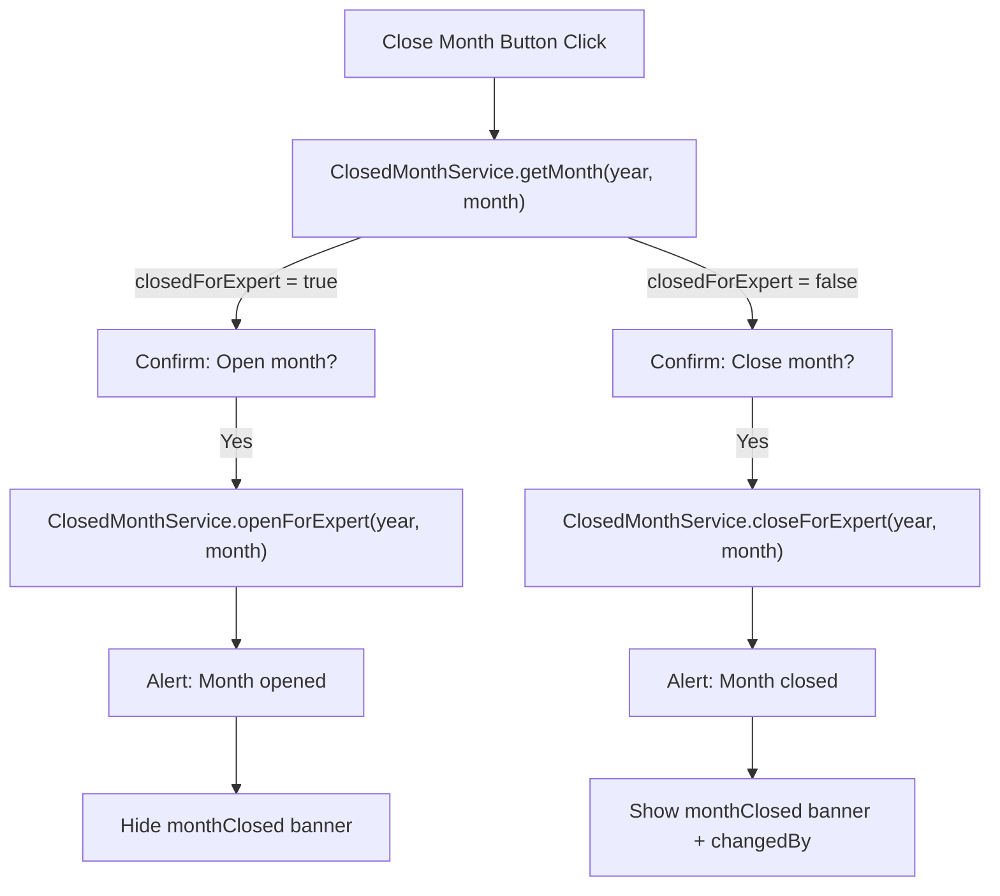
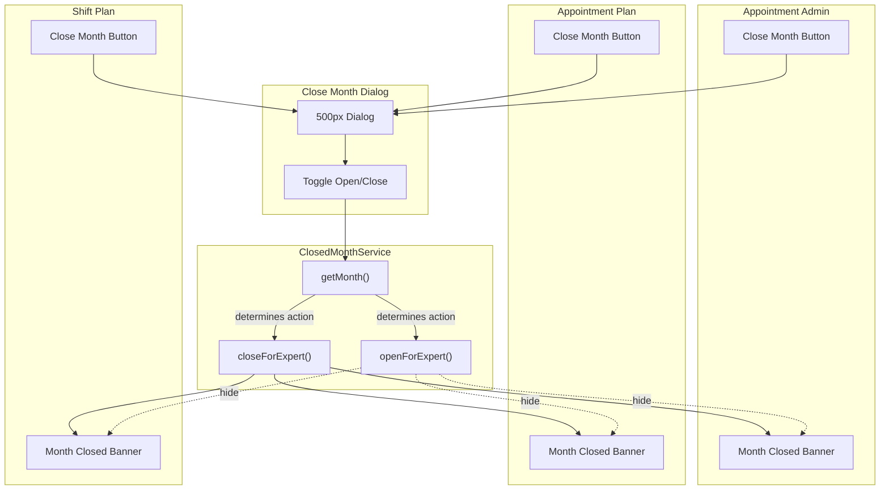

# Close Month Module Analysis

> **Source**: Shared dialog/component used by `appointmentAdmin/index.htmlm`, `appointmentPlan/index.htmlm`, `shiftPlan/index.htmlm`
> **Lines**: ~50 (dialog component)
> **Role**: Billing period lock/unlock workflow for expert worklogs. Prevents modifications to closed months and enables monthly billing exports.

---

## 1. Overview

The Close Month feature is a shared dialog that allows administrators to lock (close) or unlock (reopen) billing periods for expert worklogs. When a month is closed:

- Expert worklog modifications are blocked
- Monthly billing exports can be finalized
- The month-closed alert banner is displayed in relevant modules
- The action toggles between "Close Month" and "Open Month" based on current state

**Used in modules:**
- Appointment Admin (`appointmentAdmin/`)
- Appointment Plan (`appointment/`)
- Shift Plan (`shift/`)

---

## 2. Dialog Structure

| Property | Value |
|----------|-------|
| Width | 500px |
| Icon | `fa-calendar-exclamation` |
| Title | Dynamic: "Close Month" or "Open Month" (based on state) |
| Service | `ClosedMonthService` |

### 2.1 Form Fields

| # | Field | Type | Label | Notes |
|---|-------|------|-------|-------|
| 1 | Year | Number input | Year | Prefilled from global filter |
| 2 | Month | Select (1-12) | Month | Prefilled from global filter, i18n Month.JAN..DEC labels |

### 2.2 Info Alert

- Content: Information about billing period lock consequences
- Type: Info/warning alert banner
- Displayed: Always visible in dialog

### 2.3 Action Button

| State | Button Label | Icon | Service Call |
|-------|-------------|------|--------------|
| Month Open | `action.closeMonth` | `fa-calendar-exclamation` | `ClosedMonthService.closeForExpert(year, month)` |
| Month Closed | `action.openMonth` | `fa-calendar-exclamation` | `ClosedMonthService.openForExpert(year, month)` |

---

## 3. Service Calls

| # | Service | Method | Parameters | Usage |
|---|---------|--------|-----------|-------|
| 1 | `ClosedMonthService` | `getMonth` | `[year, month]` | Check if month is currently closed |
| 2 | `ClosedMonthService` | `closeForExpert` | `[year, month]` | Close the month for expert billing |
| 3 | `ClosedMonthService` | `openForExpert` | `[year, month]` | Reopen the month for expert billing |

---

## 4. Workflow

### 4.1 Opening the Dialog

1. User clicks "Close Month" button in navbar/toolbar
2. Dialog opens with year/month prefilled from global filter
3. `ClosedMonthService.getMonth(year, month)` checks current state
4. Dialog displays appropriate title and action button based on state

### 4.2 Close Month Flow

1. User clicks "Close Month" button in dialog
2. Confirmation dialog shows: `monthClose.confirm` ("Are you sure you want to close month?")
3. On confirm: `ClosedMonthService.closeForExpert(year, month)`
4. Success: Show `monthClosed.message` alert
5. Update UI: Show month-closed banner in parent module

### 4.3 Open Month Flow

1. User clicks "Open Month" button in dialog (month is already closed)
2. Confirmation dialog shows: `monthOpen.confirm` ("Are you sure you want to open month?")
3. On confirm: `ClosedMonthService.openForExpert(year, month)`
4. Success: Show `monthOpened.message` alert
5. Update UI: Hide month-closed banner in parent module

---

## 5. Month-Closed Banner

| Property | Value |
|----------|-------|
| ID | `#monthClosed` (module-specific) |
| Default State | Hidden |
| Display Condition | `ClosedMonthService.getMonth(year, month).closedForExpert === true` |

### 5.1 Banner Content

```
{{i18n.monthClosed.by}} <span id="changedBy">{userName}</span>
```

- Shows the name of the user who closed the month
- Alert type: Warning/Info banner

---

## 6. Translation Keys

| Key | Default (EN) | Description |
|-----|--------------|-------------|
| `action.closeMonth` | "Close Month" | Button label to close month |
| `action.openMonth` | "Open Month" | Button label to reopen month |
| `monthClose.confirm` | "Are you sure you want to close month?" | Confirmation dialog |
| `monthOpen.confirm` | "Are you sure you want to open month?" | Confirmation dialog |
| `monthClosed.message` | "Month has been closed" | Success alert |
| `monthOpened.message` | "Month has been opened" | Success alert |
| `monthClosed.by` | "Closed by" | Banner prefix showing closer |

---

## 7. Mermaid Diagram

### 7.1 Close Month Toggle Flow



### 7.2 Module Integration



---

## 8. Data Model

### 8.1 ClosedMonth Response

```typescript
interface ClosedMonthResponse {
  closedForExpert: boolean;  // true if month is closed
  changedBy?: string;        // display name of user who closed
  changedAt?: Date;          // timestamp of closure
}
```

### 8.2 Close Month Request

```typescript
interface CloseMonthRequest {
  year: number;   // e.g., 2026
  month: number;  // 1-12
}
```

---

## 9. Related Wireframes

| Wireframe | File | Description |
|-----------|------|-------------|
| W4: Close Month | `planning/appointment-support/close-month.pen` | 500px shared dialog with year/month inputs |

---

## 10. Cross-Module References

| Module | Button ID | Banner ID | Notes |
|--------|-----------|-----------|-------|
| Appointment Admin | `closeMonthBtn` | `#monthClosed` | Navbar toolbar button |
| Appointment Plan | `closeMonthBtn` | `#monthClosed` | Plan view toolbar |
| Shift Plan | `closeMonthButton` | (inline alert) | `fa-calendar-exclamation` icon |

---

## 11. Complexity Assessment

| Aspect | Complexity | Notes |
|--------|-----------|-------|
| UI | Low | Simple 2-field dialog with toggle button |
| Logic | Low | Service call + confirmation + banner toggle |
| Integration | Medium | Shared across 3 modules, requires state sync |

**Estimated rebuild effort**: Low - Simple CRUD-style dialog with service integration.

---

## 12. Related Documents

- `specs/analysis/planning/appointment-admin/appointment-admin.md` — Appointment Admin module (primary consumer)
- `specs/analysis/planning/shift/shift-and-plan.md` — Shift Plan module
- `specs/analysis/planning/appointment/appointment-plan.md` — Appointment Plan module
- `specs/wireframes/planning/workflows.md` — Wireframe workflow documentation
- `specs/wireframes/planning/appointment-support/close-month.pen` — Wireframe source
