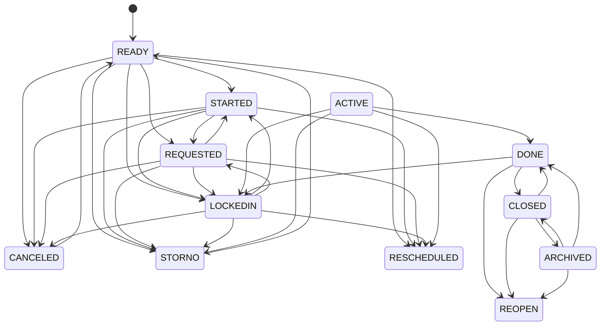
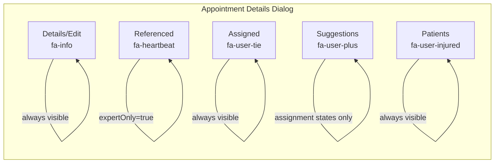
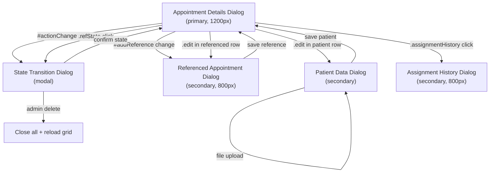
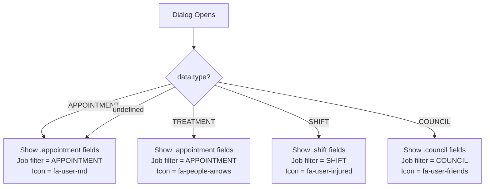
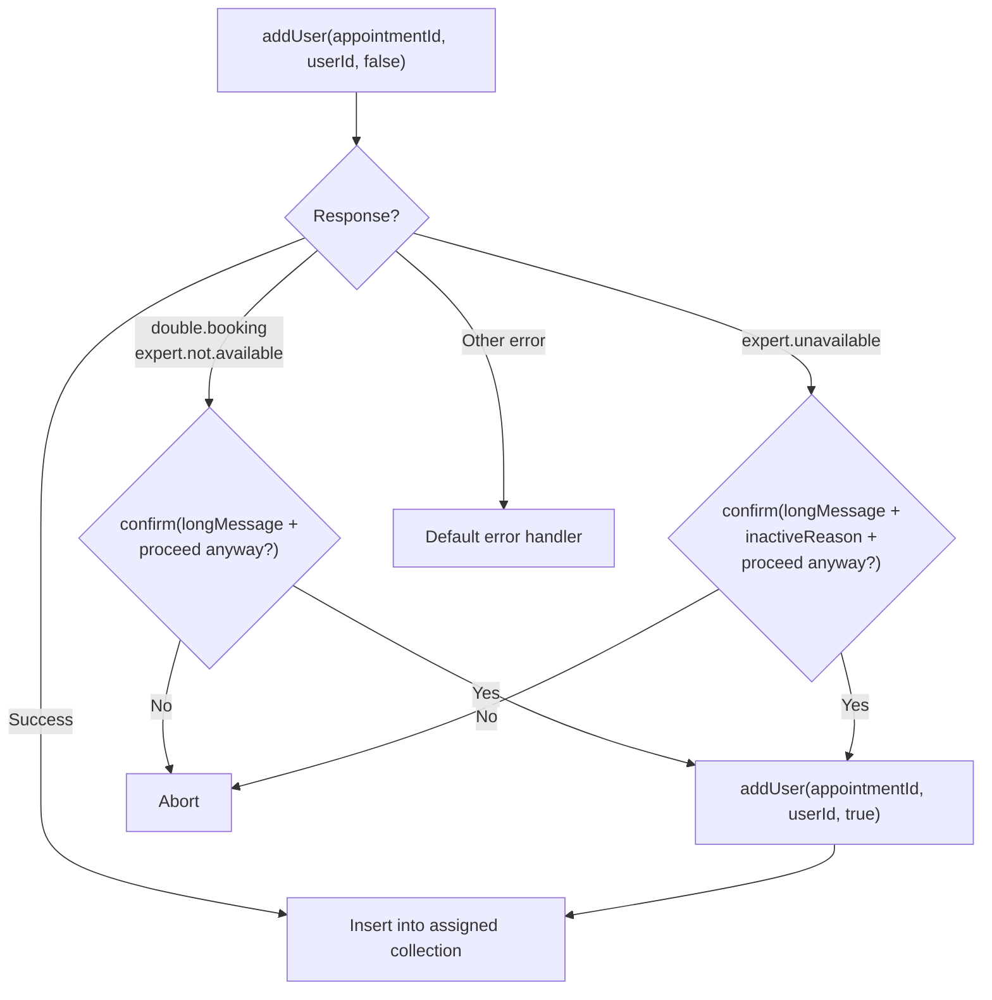

## Cross-References

### Source Includes

| Type | Direction | Detail | Linked Document | Condition / Context |
|------|-----------|--------|-----------------|---------------------|
| split | **Sibling** | Same source: `appointment/details.html` + `details.js` | [Appointment Details Patient](../../treatment/appointment-patient/appointment-details-patient.md) | Tab 3 (Patients) extracted to sibling |
| include | **Included by** | `{{> appointmentDetails}}` | [Appointment List](appointment-list.md) | Inline detail/edit panel |
| include | **Included by** | `{{> appointmentDetails}}` | [Shift List](../../planning/shift/shift-and-plan.md) | Reused as shift detail panel |
| include | **Included by** | `{{> appointmentDetails}}` | [Treatment List](../../treatment/treatment-core/treatment-and-category.md) | Reused as treatment detail panel |
| include | **Included by** | `{{> appointmentDetails}}` | [Council List](../../planning/council/council-and-plan.md) | Reused as council detail panel |
| include | **Included by** | `{{> appointmentDetails}}` | [Month View](../../planning/dashboard/month-view.md) | Dashboard month view detail |
| include | **Included by** | `{{> appointmentDetails}}` | [Week View](../../planning/dashboard/week-view.md) | Dashboard week view detail |
| include | **Included by** | `{{> appointmentDetails}}` | [Calendar View](../../planning/dashboard/calendar-view.md) | Dashboard calendar view detail |

### Service Calls

| Service | Method | Parameters | Dialog / Context |
|---------|--------|------------|------------------|
| `AppointmentService` | `save` | `[data]` | Dialog save button |
| `AppointmentService` | `setState` | `[id, status, date, time]` | State transition dialog |
| `AppointmentService` | `remove` | `[[id]]` | Admin delete button |
| `AppointmentService` | `addUser` | `[appointmentId, userId, force]` | Assign autocomplete / suggestion add |
| `AppointmentService` | `delUser` | `[assignmentId]` | Delete employee button |
| `AppointmentService` | `adjustUser` | `[assignmentId, state]` | Accept/Reserve/Reject/Abort buttons |
| `AppointmentService` | `sendReminder` | `[assignmentId]` | Send reminder button |
| `AppointmentService` | `getAssignmentsByAppointmentId` | `[appointmentId]` | Assignment history dialog |
| `AppointmentService` | `getSuggestions` | `[appointmentId, limit]` | Suggestions tab load |
| `AppointmentService` | `createReference` | `[appointmentId, location]` | Add reference autocomplete |
| `AppointmentService` | `saveReference` | `[data, parentAppointmentId]` | Reference dialog save |
| `AppointmentService` | `delReference` | `[referenceId]` | Delete reference button |
| `LocationService` | `autocomplete` | `(query)` | Location field |
| `RoomService` | `autocompleteAvailableRooms` | `(query)` | Room field |
| `JobService` | `autocompleteType` | `(query, filter)` | Job field (main dialog) |
| `JobService` | `autocomplete` | `(query)` | Job field (reference dialog) |
| `UserService` | `findDoctor` | `(query)` | Assigned tab autocomplete |

### Event Flows

| Type | Direction | Event | Linked Document | Condition |
|------|-----------|-------|-----------------|----------|
| event | **Outgoing** | `assignAppointment(id, state, cb)` | [Appointment Assign User](appointment-assign-user.md#cross-references) | Accept/Override assignment buttons trigger collision check |

---

# 02 — Appointment Details Dialog (with Tabs)

> **Source files analysed**
> - `web/src/main/webapp/appointment/details.html` (635 lines)
> - `web/src/main/webapp/appointment/details.js` (912 lines)

---

## 1. Block: Appointment Details Dialog

| Attribute | Value |
|---|---|
| **ID** | `appointmentDetailDialog` |
| **Type** | Detail dialog (offcanvas / drawer) |
| **Target** | `primary` |
| **Width** | `1200` |
| **Icon** | `far fa-user-md` |
| **Color** | `bg-color-appointment` |
| **Save button** | Yes (`data-buttonsave="true"`) |
| **Save handler** | `AppointmentService.save(data)` |
| **Dynamic title** | Determined by entity `type` attribute: `data-titleAPPOINTMENT`, `data-titleSHIFT`, `data-titleCOUNCIL`, `data-titleTREATMENT` |
| **Dynamic icon** | Changes per type: APPOINTMENT=`fa-user-md`, SHIFT=`fa-user-injured`, COUNCIL=`fa-user-friends`, TREATMENT=`fa-people-arrows` |

### Companion Dialogs

| ID | Target | Width | Purpose |
|---|---|---|---|
| `appointmentStateDlg` | `modal` | default | State transition picker (next step) |
| `appointmentAssigmentHistoryDlg` | `secondary` | 800 | Assignment history log |
| `referencedAppointmentDialog` | `secondary` | 800 | Edit a referenced (child) appointment |
| `patientDataDlg` | `secondary` | default | Edit patient data record with file attachments |

---

## 2. Header Section

Displayed above the tabs, always visible.

| Element | Field / Binding | Format | Notes |
|---|---|---|---|
| Location name | `data.location.name` | text | Float-right with compass icon |
| Staff count | `data.requiredStaffCount` | integer | Shown as `Nx` |
| Job code | `data.job.code` | text | Bold, inline |
| Weekday | `data.wd` | text | Calendar-day icon |
| Date | `data.date` | date | CSS class `date` for formatting |
| Time range | `data.timeStart` - `data.timeEnd` | time | Bold |
| State display | `data.displayState` | text (formatted) | `id="statusAdmin"`, dblclick navigates to `/appointmentAdmin.html#<id>` |
| Comment | `data.comment` | text | Italic, below header |

---

## 3. Tab Structure

| #   | Tab ID              | Nav ID           | Icon                  | Title (i18n key)                     | Default Active |
| --- | ------------------- | ---------------- | --------------------- | ------------------------------------ | -------------- |
| 1   | `shift-detailsEdit` | `navDetailsEdit` | `fas fa-info`         | "Info" (hardcoded)                   | Yes            |
| 2   | `shift-referenced`  | `navReferenced`  | `far fa-heartbeat`    | `appointmentDlg.patientAppointments` | No             |
| 3   | `shift-patient`     | `navPatient`     | `far fa-user-injured` | `appointmentDlg.patients`            | No             |
| 4   | `shift-assigned`    | `navAssigned`    | `far fa-user-tie`     | `appointmentDlg.expertConfirm`       | No             |
| 5   | `shift-suggestion`  | `navSuggestion`  | `far fa-user-plus`    | `appointmentDlg.addExpert`           | No             |

### Tab Visibility Rules (State-Driven)

| Tab | Visibility Condition |
|---|---|
| Details/Edit (`navDetailsEdit`) | Always shown (code has commented-out conditional) |
| Referenced (`navReferenced`) | Shown only when `data.expertOnly === true` (via checkbox handler) |
| Patients (`navPatient`) | Always shown (no conditional) |
| Assigned (`navAssigned`) | `ShiftLogic.showEmployeeList(data)` — always returns `true` |
| Suggestions (`navSuggestion`) | `ShiftLogic.showEmployeeAssignment(data)` — states: READY, STARTED, REOPENED, REQUESTED, LOCKEDIN |
| Employee actions bar | `ShiftLogic.showEmployeeAssignment(data)` — same as above |

---

## 4. Tab 1 — Details/Edit

### Form Elements

| Field | Name | Type | CSS Class | Mandatory | Conditional | Notes |
|---|---|---|---|---|---|---|
| Date | `data.date` | `input` (datepicker) | `date mandatory suggestType` | Yes | — | Triggers priceType auto-suggest |
| Time start | `data.timeStart` | `input[type=time]` | `time mandatory suggestType` | Yes | — | Triggers priceType auto-suggest |
| Time end | `data.timeEnd` | `input[type=time]` | `time mandatory` | Yes | — | |
| Expert only | `data.expertOnly` | `checkbox` | `boolean` | No | `.appointment` class (APPOINTMENT/TREATMENT types only) | Hides location/room/customer when checked, shows Referenced tab |
| State | `data.state` | `select` (disabled) | — | — | — | Read-only display; click opens state transition dialog |
| Customer | `data.customer` | `input` (readonly) | `object` | No | — | Display-only, shows `name` |
| Location | `data.location` | `input` (autocomplete) | `object mandatory autoselect` | Yes | Hidden when expertOnly=true | `LocationService.autocomplete` |
| Room | `data.room` | `input` (autocomplete) | `object autoselect` | No | Hidden when expertOnly=true | `RoomService.autocompleteAvailableRooms`, `data-minlength="0"` |
| Staff count | `data.requiredStaffCount` | `input` | `integer mandatory` | Yes | — | 40px width |
| Job | `data.job` | `input` (autocomplete) | `object mandatory autoselect jobselect` | Yes | — | `JobService.autocompleteType`, filter by entity type |
| Price type | `data.priceType` | `select` | — | No | `.shift` class (SHIFT type only) | Options: WEEKDAY, WEEKNIGHT, WEEKENDDAY, WEEKENDNIGHT |
| Job support | `data.jobSupport` | `checkbox` | `bool` | No | `.council` class (COUNCIL type only) | Toggles location mandatory between main dialog and patientDataDlg |
| Min patients | `data.minPatients` | `input` | `number` | No | `.shift` class (SHIFT type only) | |
| Comment | `data.comment` | `textarea` | — | No | — | Visible only to owner (per HTML comment) |

### State Select Options

| Value | i18n Key |
|---|---|
| `READY` | `AppointmentState.READY` |
| `STARTED` | `AppointmentState.STARTED` |
| `REQUESTED` | `AppointmentState.REQUESTED` |
| `LOCKEDIN` | `AppointmentState.LOCKEDIN` |
| `ACTIVE` | `AppointmentState.ACTIVE` |
| `REOPENED` | `AppointmentState.REOPENED` |
| `DONE` | `AppointmentState.DONE` |
| `CLOSED` | `AppointmentState.CLOSED` |
| `STORNO` | `AppointmentState.STORNO` |
| `RESCHEDULED` | `AppointmentState.RESCHEDULED` |
| `CANCELED` | `AppointmentState.CANCELED` |
| `ARCHIVED` | `AppointmentState.ARCHIVED` |

### Price Type Auto-Suggest Logic

When `data.date` or `data.timeStart` changes AND `data.priceType` is empty:
- If weekday (Mon-Fri) + time < 18:00 => `WEEKDAY`
- If weekday + time >= 18:00 => `WEEKNIGHT`
- If weekend (Sat-Sun) + time < 18:00 => `WEEKENDDAY`
- If weekend + time >= 18:00 => `WEEKENDNIGHT`

### Type-Driven Field Visibility

| CSS Class | Visible When `data.type` = |
|---|---|
| `.appointment` | `APPOINTMENT` or `TREATMENT` |
| `.shift` | `SHIFT` |
| `.council` | `COUNCIL` |

---

## 5. Tab 2 — Referenced (Patient Appointments)

### Toolbar

| Element | ID | Action |
|---|---|---|
| Location autocomplete | `addReference` | `LocationService.autocomplete` — on change, calls `AppointmentService.createReference`, then opens `referencedAppointmentDialog` |
| Delete button | `deleteReference` | Disabled by default; enabled when row selected; calls `AppointmentService.delReference` |

### Collection: Referenced Appointments

| Attribute | Value |
|---|---|
| **ID** | `actionReferenced` |
| **Data field** | `data.referenced` |
| **Classes** | `collection selectable insert` |

#### Columns

| # | Field | Format | Notes |
|---|---|---|---|
| 1 | `referenced.timeStart` - `referenced.timeEnd` | time | Bold |
| 2 | `referenced.location.name` | text | |
| 3 | `referenced.location.booknumberMask` | text | Book number column |
| 4 | `referenced.job.code` | text | |
| 5 | State badge (`.refState`) | formatted HTML | Rendered via `i18n.appointmentState(pojo.state)` with color class + icon; click opens state transition dialog |
| 6 | Edit icon | action | Opens `referencedAppointmentDialog` pre-filled with appointment data |

### Referenced Appointment Dialog (`referencedAppointmentDialog`)

| Field | Name | Type | Mandatory | Notes |
|---|---|---|---|---|
| Time start | `data.timeStart` | `input[type=time]` | Yes | |
| Time end | `data.timeEnd` | `input[type=time]` | Yes | |
| State | `data.state` | `select` (disabled) | — | Same options as main state select; click opens state transition dialog |
| Job | `data.job` | `input` (autocomplete) | Yes | `JobService.autocomplete` (no type filter) |
| Customer | `data.customer` | `input` (readonly) | No | |
| Location | `data.location` | `input` (autocomplete) | No | `LocationService.autocomplete` |
| Room | `data.room` | `input` (autocomplete) | No | `RoomService.autocompleteAvailableRooms` |
| Comment | `data.comment` | `textarea` | No | |

---

## 7. Tab 4 — Assigned (Experts)

### Toolbar (`employeeActions`)

| Element | ID | Action |
|---|---|---|
| Doctor autocomplete | `assignDoc` | `UserService.findDoctor` — on insert, calls `AppointmentService.addUser(appointmentId, userId, false)` with collision handling |
| Delete button | `deleteEmployee` | Disabled by default; enabled on row select; calls `AppointmentService.delUser` |

### Collection: Assigned Users

| Attribute | Value |
|---|---|
| **ID** | `actionAssigned` |
| **Data field** | `data.assigned` |
| **Classes** | `collection selectable insert` |

#### Columns

| # | Element | Notes |
|---|---|---|
| 1 | Profile image | Template: `/get/UserService/getImage/[[cur.user.id]]/profile.jpg` |
| 2 | Role icon + Name | Support icon (blue, `council.support`), Main icon (green, `council.main`), or Doctor icon (default). Name: `assigned.user.displayName`. Message action icon. |
| 3 | Phone number | `assigned.user.userProfile.cellularNumber` as `tel:` link |
| 4 | State + Action buttons | See below |

#### Per-Row Action Buttons

| Button | CSS Class | Title (i18n) | Action |
|---|---|---|---|
| Accept | `.accept` | `action.assignment.accept` | `AppointmentService.adjustUser(id, "ACCEPTED")` via `assignAppointment()` |
| Reserve | `.reserve` | `action.assignment.reserve` | `AppointmentService.adjustUser(id, "RESERVED")` |
| Override | `.override` | `action.assignment.override` | `AppointmentService.adjustUser(id, "AGREED")` via `assignAppointment()` |
| Reject | `.reject` | `action.assignment.reject` | `AppointmentService.adjustUser(id, "REJECTED")` |
| Abort | `.abort` | `action.assignment.abort` | `AppointmentService.adjustUser(id, "ABORTED")` |
| Send reminder | `.sendReminder` | `action.assignment.sendReminder` | `AppointmentService.sendReminder(id)` |
| History | `.assignmentHistory` | `action.assignment.history` | `AppointmentService.getAssignmentsByAppointmentId(appointmentId)` — opens history dialog |

#### Role Icon Logic (postAddCollection)

| Condition | Icons Shown |
|---|---|
| `pojo.support === true` | `.support` visible, `.doctor` + `.main` hidden |
| `pojo.support === false` | `.main` visible, `.doctor` + `.support` hidden |
| `pojo.support` is null/undefined | `.doctor` visible, `.support` + `.main` hidden |

---

## 8. Tab 5 — Suggestions (Add Expert)

### Filter

| Element | ID | Behavior |
|---|---|---|
| Text filter | `actionSuggestionFilter` | Client-side `keyup` filter on `userProfile.firstName` / `userProfile.lastName` (startsWith, case-insensitive) |

### Collection: Suggestions

| Attribute | Value |
|---|---|
| **ID** | `actionSuggestion` |
| **Data field** | `suggestion.result` |
| **Prefix** | `suggestion` (separate jsForm instance) |
| **Data source** | `AppointmentService.getSuggestions(appointmentId, 20)` |

#### Columns

| # | Element | Notes |
|---|---|---|
| 1 | Profile image | Template: `/get/UserService/getImage/[[cur.id]]/profile.jpg` |
| 2 | Role icon + Name | Same support/main/doctor logic as Assigned tab. Preference icons: `.want` (thumbs-up, green) if `wantFlag=true`, `.nopref` (circle) otherwise. Name: `result.displayName`. Message action icon. |
| 3 | Skills | Nested collection `result.employeeProfile.skills`, showing `skills.skill.code` comma-separated |
| 4 | Phone | `result.userProfile.cellularNumber` as `tel:` link |
| 5 | Add button | `.userAdd` — calls `AppointmentService.addUser(appointmentId, userId, false)`, inserts into Assigned collection, removes from Suggestions |

### Suggestion Caching

- Suggestions are cached in `$detail.data().suggestions`
- Cache is cleared when form has unsaved changes (auto-saves first, then reloads)
- Cache is cleared on dialog open

### Duplicate Filtering

In `postAddCollection` for suggestions, each suggestion row is checked against the `actionAssigned` collection. If the user already exists in assigned, the suggestion row is removed.

---

## 9. Appointment State Machine

### States

| State | i18n Key |
|---|---|
| `READY` | `AppointmentState.READY` |
| `STARTED` | `AppointmentState.STARTED` |
| `REQUESTED` | `AppointmentState.REQUESTED` |
| `LOCKEDIN` | `AppointmentState.LOCKEDIN` |
| `ACTIVE` | `AppointmentState.ACTIVE` |
| `REOPENED` / `REOPEN` | `AppointmentState.REOPENED` |
| `DONE` | `AppointmentState.DONE` |
| `CLOSED` | `AppointmentState.CLOSED` |
| `STORNO` | `AppointmentState.STORNO` |
| `RESCHEDULED` | `AppointmentState.RESCHEDULED` |
| `CANCELED` | `AppointmentState.CANCELED` |
| `ARCHIVED` | `AppointmentState.ARCHIVED` |

### Transitions (`ShiftLogic.getValidState`)

| From State | Valid Transitions To |
|---|---|
| `READY` | STARTED, REQUESTED, CANCELED, LOCKEDIN, STORNO, RESCHEDULED |
| `STARTED` | REQUESTED, LOCKEDIN, CANCELED, STORNO, RESCHEDULED |
| `REQUESTED` | STARTED, LOCKEDIN, CANCELED, STORNO, RESCHEDULED |
| `LOCKEDIN` | STARTED, REQUESTED, CANCELED, STORNO, RESCHEDULED |
| `ACTIVE` / `REOPEN` | DONE, LOCKEDIN, STORNO, RESCHEDULED |
| `DONE` | CLOSED, LOCKEDIN, REOPEN |
| `CLOSED` | ARCHIVED, DONE, REOPEN |
| `ARCHIVED` | CLOSED, DONE, REOPEN |
| `CANCELED` | READY |
| `STORNO` | READY |

### Assignment State Machine

| State | Disable Buttons | CSS Class on Row |
|---|---|---|
| `ACCEPTED` | accept | `accepted` |
| `REJECTED` | reject, abort | `rejected` |
| `RESERVED` | reserve | `reserved` |
| `REMOVE` / `ABORTED` | accept, reserve | `canceled` |
| `CANCELED` | abort, accept, reserve | `canceled` |
| `AGREED` | override, accept, reserve | `agreed` |
| `DOUBLE_BOOKED` | reserve | `doubleBooked` |
| `DISAGREED` | accept, reject, abort, reserve | `disagreed` |

---

## 10. State Transition Dialog (`appointmentStateDlg`)

| Field | Name | Type | Notes |
|---|---|---|---|
| Next state | `data.status` | `select` (`appointmentStateSelect`) | Populated dynamically from `ShiftLogic.getValidState()` |
| Date | `data.date` | `input` (datepicker) | Shown only when `STORNO` is selected |
| Time | `data.time` | `input[type=time]` | Shown only when `STORNO` is selected |
| Delete button | `stateDeleteAppointment` | `button` | Admin-only (`{{#isAdmin}}`), calls `AppointmentService.remove([id])` |

---

## 11. Click Actions Table

| Action | Trigger | Confirmation | Server Call | Post-Action |
|---|---|---|---|---|
| Save appointment | Dialog save button | No | `AppointmentService.save(data)` | Callback |
| Change state | Click on `#actionChange` / `#referencedActionChange` | No (opens sub-dialog) | `AppointmentService.setState(id, status, date, time)` | Reload dialog + grid |
| Delete appointment | `#stateDeleteAppointment` click | `confirm(i18n.dialog_delete_confirm)` | `AppointmentService.remove([id])` | Close both dialogs, reload grid |
| Add user (autocomplete) | `#assignDoc` insert | Collision: `confirm(longMessage + proceed anyway?)` | `AppointmentService.addUser(appointmentId, userId, force)` | Insert into assigned collection |
| Add user (suggestion) | `.userAdd` click | No | `AppointmentService.addUser(appointmentId, userId, false)` | Insert into assigned, remove from suggestions |
| Delete user | `#deleteEmployee` click | `confirm(i18n.dialog_delete_confirm)` | `AppointmentService.delUser(assignmentId)` | Remove row, reload grid |
| Accept assignment | `.accept` click | `confirm("Benutzer anfragen/annehmen?")` | `assignAppointment(id, "ACCEPTED")` | Update row state |
| Reserve assignment | `.reserve` click | `confirm("Benutzer Reservieren?")` | `AppointmentService.adjustUser(id, "RESERVED")` | Update row state |
| Override assignment | `.override` click | `confirm("Benutzer direkt Akzeptieren?")` | `assignAppointment(id, "AGREED")` | Update row state |
| Reject assignment | `.reject` click | `confirm("Benutzer ablehnen?")` | `AppointmentService.adjustUser(id, "REJECTED")` | Update row state |
| Abort assignment | `.abort` click | `confirm("Benutzer hat abgesagt?")` | `AppointmentService.adjustUser(id, "ABORTED")` | Update row state |
| Send reminder | `.sendReminder` click | `confirm("Erinnerung senden?")` | `AppointmentService.sendReminder(assignmentId)` | `alert("Gesendet.")` |
| View assignment history | `.assignmentHistory` click | No | `AppointmentService.getAssignmentsByAppointmentId(appointmentId)` | Open history dialog |
| Send user message | `.sendUserMessage` click | — | (handler not in analyzed file) | — |
| Add reference | `#addReference` change (location selected) | No | `AppointmentService.createReference(appointmentId, location)` | Opens referenced appointment dialog |
| Save reference | Dialog save in `referencedAppointmentDialog` | No | `AppointmentService.saveReference(data, parentId)` | Insert into referenced collection |
| Delete reference | `#deleteReference` click | `confirm(i18n.dialog_delete_confirm)` | `AppointmentService.delReference(refId)` | Remove row |
| Edit reference | `.edit` in referenced row | No | `AppointmentService.get(refId)` then `saveReference` | Refresh row + reload main |
| Reference state change | `.refState` click | No (opens sub-dialog) | Via `showAppointmentStateDlg` | State transition dialog |
| Add patient | `#patientDataAdd .add` click | No | `PatientDataService.save({appointmentId, bookNumber})` | Insert row |
| Edit patient | `.edit` in patient row | No | `PatientDataService.get(id)` then `save` | Refresh row |
| Remove patient | `.remove` in patient row | `confirm(i18n.dialog_delete_confirm)` | `PatientDataService.remove([id])` | Remove row |
| Upload patient file | `#addPatientDataFiles` | No | `PatientDataService.upload(dataId, file)` | Add row to attachments collection |
| Remove patient file | `.remove` in attachments row | `confirm(i18n.dialog_delete_confirm)` | `PatientDataService.removeFile(dataId, fileId)` | Remove row |
| Status admin nav | `#statusAdmin` dblclick | No | — | `location.href="/appointmentAdmin.html#<id>"` |
| Load suggestions | `#navSuggestion` click | No | `AppointmentService.getSuggestions(id, 20)` | Fill suggestion tab (cached) |

---

## 12. Server API Calls

| Service | Method | Parameters | Trigger | Returns |
|---|---|---|---|---|
| `AppointmentService` | `get` | `[id]` | Dialog open, reference edit | Appointment object |
| `AppointmentService` | `save` | `[data]` | Dialog save, pre-suggestion save | Saved appointment |
| `AppointmentService` | `setState` | `[id, status, date, time]` | State transition dialog confirm | Updated appointment |
| `AppointmentService` | `remove` | `[[id]]` | Admin delete | — |
| `AppointmentService` | `addUser` | `[appointmentId, userId, force]` | Autocomplete insert, suggestion add | Assignment object |
| `AppointmentService` | `delUser` | `[assignmentId]` | Delete employee button | — |
| `AppointmentService` | `adjustUser` | `[assignmentId, state]` | Accept/reserve/reject/abort buttons | Updated assignment |
| `AppointmentService` | `sendReminder` | `[assignmentId]` | Reminder icon click | — |
| `AppointmentService` | `getAssignmentsByAppointmentId` | `[appointmentId]` | History icon click | Assignment history list |
| `AppointmentService` | `getSuggestions` | `[appointmentId, limit]` | Tab open, dialog open | Suggestion result set |
| `AppointmentService` | `createReference` | `[appointmentId, location]` | Location autocomplete change | New reference object |
| `AppointmentService` | `saveReference` | `[data, parentAppointmentId]` | Reference dialog save | Saved reference |
| `AppointmentService` | `delReference` | `[referenceId]` | Delete reference button | — |
| `PatientDataService` | `save` | `[{appointmentId, bookNumber, ...}]` | Add patient, edit patient dialog | Patient data object |
| `PatientDataService` | `get` | `[id]` | Edit patient click | Patient data with attachments |
| `PatientDataService` | `remove` | `[[id]]` | Remove patient click | — |
| `PatientDataService` | `upload` | `[dataId, file]` | File upload button | Uploaded file objects |
| `PatientDataService` | `removeFile` | `[dataId, fileId]` | Remove file click | Boolean |
| `LocationService` | `autocomplete` | (query) | Location fields | Location list |
| `RoomService` | `autocompleteAvailableRooms` | (query) | Room fields | Room list |
| `JobService` | `autocompleteType` | (query, filter) | Job field (main dialog) | Job list |
| `JobService` | `autocomplete` | (query) | Job field (reference dialog) | Job list |
| `UserService` | `findDoctor` | (query) | Assigned tab autocomplete | User list |

---

## 13. State-Driven Visibility

### Appointment Type Visibility

| Element / Region | APPOINTMENT | SHIFT | COUNCIL | TREATMENT |
|---|---|---|---|---|
| `.appointment` fields (expertOnly) | Visible | Hidden | Hidden | Visible |
| `.shift` fields (priceType, minPatients) | Hidden | Visible | Hidden | Hidden |
| `.council` fields (jobSupport) | Hidden | Hidden | Visible | Hidden |
| Job filter value | `"APPOINTMENT"` | `"SHIFT"` | `"COUNCIL"` | `"APPOINTMENT"` |

### Appointment State Visibility

| Element | States Where Visible |
|---|---|
| `#navDetailsEdit` | All (always shown) |
| `#navAssigned` | All (`showEmployeeList` returns `true`) |
| `#navSuggestion` | READY, STARTED, REOPENED, REQUESTED, LOCKEDIN |
| `#employeeActions` (add/delete toolbar) | READY, STARTED, REOPENED, REQUESTED, LOCKEDIN |
| `#navReferenced` | Only when `expertOnly` checkbox is checked |
| `#navPatient` | All (always shown) |

### ShiftLogic Helper Functions

| Function | States Returning `true` | Used For |
|---|---|---|
| `showCheckInOut` | CLOSED, LOCKEDIN, ARCHIVED, DONE | (Not used in details dialog directly) |
| `isClosed` | CLOSED, ARCHIVED, CANCELED | General closed check |
| `showEmployeeAssignment` | READY, STARTED, REOPENED, REQUESTED, LOCKEDIN | Show suggestion tab + employee actions |
| `showEmployeeList` | All (always true) | Show assigned tab |
| `showEdit` | READY, STARTED, REQUESTED | (Commented out in dialog open) |
| `showActionList` | CLOSED, DONE, LOCKEDIN, ARCHIVED | (Not used in details dialog directly) |

---

## 14. Assignment Add — Collision Handling

When adding a user via `#assignDoc` autocomplete, the `addUser` call may fail with specific error codes:

| Error Code | Behavior |
|---|---|
| `double.booking` | Show confirm with `longMessage` + "proceed anyway?" |
| `expert.not.available` | Show confirm with `longMessage` + "proceed anyway?" |
| `expert.unavailable` | Show confirm with `longMessage` + `inactiveReason` + "proceed anyway?" |
| Other errors | Default error handler |

If user confirms, re-calls `AppointmentService.addUser` with `force=true`.

---

## 15. Translation Table

| i18n Key | DE (source) | EN (provided) | Flag |
|---|---|---|---|
| `appointment` | Termin | Appointment | |
| `shift` | Dienst | Shift | |
| `council` | Konsil | Council | |
| `Treatment` | Behandlung | Treatment | |
| `appointmentDlg.patientAppointments` | Patienten-Termine | Patient appointments | |
| `appointmentDlg.patients` | Patienten | Patients | |
| `appointmentDlg.expertConfirm` | Experten bestätigen | Expert confirm | |
| `appointmentDlg.addExpert` | Experte hinzufügen | Add expert | |
| `council.support` | Support | Support | |
| `council.main` | Hauptverantwortlich | Main | |
| `appointment.comment` | Kommentar | Comment | |
| `appointment.start` | Start | Start | |
| `appointment.until` | Bis | Until | |
| `appointment.minutes` | Minuten | Minutes | |
| `appointment.count` | Anzahl | Quantity | |
| `appointment.expert` | Arzt | Doctor | |
| `appointment.cancel` | Stornierung | Cancellation | |
| `appointment.block` | Block | Block | |
| `appointment.access` | Zugang | Access | |
| `appointment.collision` | Kollision | Collision | |
| `User.Expert` | Experte | Expert | |
| `appointment.expertOnly` | — | Expert only | |
| `appointment.nextStep` | Nächster Schritt | Next step | |
| `appointment.assignmentHistory` | Zuweisungsverlauf | Assignment history | |
| `appointment.minPatients` | Min. Patienten | Min. patients | |
| `label.name` | Name | Name | |
| `label.comment` | Kommentar | Comment | |
| `label.transmit` | Übermitteln | Transmit | |
| `label.delete` | Löschen | Delete | |
| `button.add` | Hinzufügen | Add | |
| `button.delete` | Löschen | Delete | |
| `action.date` | Datum | Date | |
| `action.dateStart` | Startzeit | Start time | |
| `action.dateEnd` | Endzeit | End time | |
| `action.dateStorno` | Storno-Zeitpunkt | Cancellation time | |
| `action.requiredStaffCount` | Benötigte Mitarbeiter | Required staff count | |
| `action.assignment.accept` | Annehmen | Accept | |
| `action.assignment.reserve` | Reservieren | Reserve | |
| `action.assignment.override` | Direkt akzeptieren | Override / Accept directly | |
| `action.assignment.reject` | Ablehnen | Reject | |
| `action.assignment.abort` | Absagen | Abort | |
| `action.assignment.sendReminder` | Erinnerung senden | Send reminder | |
| `action.assignment.history` | Verlauf | History | |
| `customer` | Kunde | Customer | |
| `location` | Standort | Location | |
| `room` | Raum | Room | |
| `patient.number` | Patientennummer | Patient number | |
| `consultation.booknumber` | Buchnummer | Book number | |
| `consultation.doctor` | Arzt | Doctor | |
| `consultation.jnumber` | JNummer | J-Number | |
| `PatientDataType` | Patientendaten | Patient data | |
| `PatientData.Closed` | Abgeschlossen | Closed | |
| `PatientData.onlyDocumentation` | Nur Dokumentation | Documentation only | |
| `CouncilPlan.jobSupport` | Job Support | Job support | |
| `AppointmentState` | Terminstatus | Appointment state | |
| `AppointmentState.READY` | Bereit | Ready | |
| `AppointmentState.STARTED` | Gestartet | Started | |
| `AppointmentState.REQUESTED` | Angefragt | Requested | |
| `AppointmentState.LOCKEDIN` | Festgelegt | Locked in | |
| `AppointmentState.ACTIVE` | Aktiv | Active | |
| `AppointmentState.REOPENED` | Wiedereröffnet | Reopened | |
| `AppointmentState.DONE` | Erledigt | Done | |
| `AppointmentState.CLOSED` | Geschlossen | Closed | |
| `AppointmentState.STORNO` | Storniert | Cancelled (storno) | |
| `AppointmentState.RESCHEDULED` | Verschoben | Rescheduled | |
| `AppointmentState.CANCELED` | Abgesagt | Canceled | |
| `AppointmentState.ARCHIVED` | Archiviert | Archived | |
| `AppointmentPriceType` | Preistyp | Price type | |
| `AppointmentPriceType.WEEKDAY` | Werktag | Weekday | |
| `AppointmentPriceType.WEEKNIGHT` | Werktagsnacht | Weeknight | |
| `AppointmentPriceType.WEEKENDDAY` | Wochenendtag | Weekend day | |
| `AppointmentPriceType.WEEKENDNIGHT` | Wochenendnacht | Weekend night | |
| `dialog_delete_confirm` | — | Confirm delete? | |
| `dialog_unsaved` | — | Please save first | |
| `exception_save_first_message` | — | Please save first | |
| `appointment_proceed_ANYWAY` | — | Proceed anyway? | |
| — | `Benutzer anfragen/annehmen?` | Accept/request user? | HARDCODED |
| — | `Benutzer Reservieren?` | Reserve user? | HARDCODED |
| — | `Benutzer direkt Akzeptieren?` | Accept user directly? | HARDCODED |
| — | `Benutzer ablehnen?` | Reject user? | HARDCODED |
| — | `Benutzer hat abgesagt?` | User has cancelled? | HARDCODED |
| — | `Erinnerung senden?` | Send reminder? | HARDCODED |
| — | `Gesendet.` | Sent. | HARDCODED |
| — | `Patient` (table header) | Patient | HARDCODED |
| — | `Datei` (file table header) | File | HARDCODED |
| — | `Datei hochladen` (upload title) | Upload file | HARDCODED |
| — | `jNumber` (input label) | jNumber | HARDCODED |
| — | `Info` (tab title) | Info | HARDCODED |

### Assignment State Translations (via `translateState`)

| State | i18n Key |
|---|---|
| `ADDED` | `appointment_action_state_ADDED` |
| `SELFADDED` | `appointment_action_state_SELFADDED` |
| `PLANADDED` | `appointment_action_state_PLANADDED` |
| `ACCEPTED` | `appointment_action_state_ACCEPTED` |
| `RESERVED` | `appointment_action_state_RESERVED` |
| `REJECTED` | `appointment_action_state_REJECTED` |
| `DOUBLE_BOOKED` | `appointment_action_state_DOUBLE_BOOKED` |
| `AGREED` | `appointment_action_state_AGREED` |
| `DISAGREED` | `appointment_action_state_DISAGREED` |
| `ABORTED` | `appointment_action_state_ABORTED` |
| `CANCELED` | `appointment_action_state_CANCELED` |

---

## 16. Mermaid Diagrams

### Tab Navigation Flow

### Dialog Navigation Map

### Appointment Entity Type Decision Tree

### Assignment Collision Handling Flow

