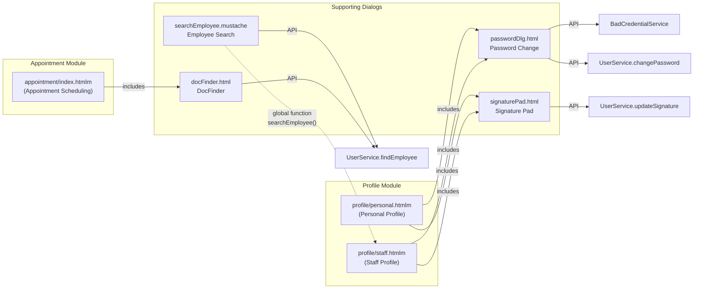

# 03 - Profile Supporting Dialogs

> **Source module**: `webapp/profile/`
> **Analysis date**: 2026-03-21
> **Scope**: Password Change, Signature Pad, Employee Search, DocFinder

---

## 1. Password Change Dialog

### 1.1 Dialog Attributes

| Attribute      | Value                          |
| -------------- | ------------------------------ |
| Element ID     | `#changePassword`              |
| `data-target`  | `modal`                        |
| `data-icon`    | `far fa-key`                   |
| `data-color`   | `bg-color-warning`             |
| Title          | `{{i18n.dialog.changePassword}}` (key not found in properties -- likely resolved dynamically or missing) |
| Trigger        | `#changePasswordBtn` click     |
| Initial state  | `display:none`                 |

### 1.2 Form Elements

| # | Element | Type | `name` | Label i18n Key | Required | Notes |
|---|---------|------|--------|----------------|----------|-------|
| 1 | Current Password | `input[type=password]` | `data.current` | `login.password.current` | Yes | Has show/hide toggle (`.showPass`) |
| 2 | New Password | `input[type=password]` | `data.password` | `user.newpassword` | Yes | Has show/hide toggle; linked to strength progress bar |
| 3 | Confirm Password | `input[type=password]` | `data.confirmPassword` | `user.confirmPassword` | Yes | No show/hide toggle |

**Hardcoded string**: The `placeholder` on current password input is hardcoded as `"Akutelles Passwort"` (German, misspelled -- should be "Aktuelles Passwort"). All other labels use i18n keys.

### 1.3 Password Strength Validation

Rules are fetched dynamically from the server via `BadCredentialService.getPasswordValidationConfiguration()`. Each rule can be individually enabled/disabled:

| Rule | ID | Condition | Config Flag | i18n Key |
|------|----|-----------|-------------|----------|
| Min length | `#passwordRule1` | `text.length >= passwordMinLength` (default 8, server-configurable) | `passwordMinLengthCheck` | `user.password.change.rule1` |
| Mixed case | `#passwordRule2` | Contains at least one uppercase AND one lowercase letter (`/[a-z]/` + `/[A-Z]/`) | `passwordCaseSensitive` | `user.password.change.rule2` |
| Special/numeric | `#passwordRule3` | Contains at least one special character OR one digit | `passwordSpecialChar` | `user.password.change.rule3` |
| Bad credential | `#passwordRule4` | Server-side check via `BadCredentialService.hasBadCredentials()` (commonly-used password) | Always active | `user.password.change.rule4` |

**Progress bar behavior**:
- Starts at 10% width, `bg-danger`.
- Each satisfied rule adds `floor(90 / totalActiveRules)` percentage.
- At 100%: switches to `bg-success`, removes `invalid` class from input.
- If no rules are configured, progress bar and explanatory text are hidden.

**Rule icon toggling**: Each rule line has an icon that toggles between `fa-exclamation-circle text-danger` (not met) and `fa-check-circle text-success` (met) on every keyup in the new password field.

### 1.4 Click Actions

| Action | Trigger | Behavior |
|--------|---------|----------|
| Open dialog | `#changePasswordBtn` click | Resets icons/progress bar to defaults, hides rule4 alert, opens modal via `Dialog.open` |
| Submit | Dialog OK callback | (1) Checks if any rule icons still show exclamation -- if so, shows `alert(i18n.password_not_meet_requirements)` and blocks. (2) Calls `BadCredentialService.hasBadCredentials(password)` -- if true, shows rule4 alert and blocks. (3) Calls `UserService.changePassword(null, current, password, confirmPassword)`. (4) On success, shows `alert(i18n.password_change_success)` and closes dialog. |
| Cancel | Dialog dismiss | Returns `false` (no action) |

### 1.5 Server API Calls

| Service | Method | Parameters | Purpose |
|---------|--------|------------|---------|
| `BadCredentialService` | `getPasswordValidationConfiguration` | `[]` | Fetch enabled password rules + min length on page load |
| `BadCredentialService` | `hasBadCredentials` | `[password]` | Check if password is commonly used |
| `UserService` | `changePassword` | `[null, currentPassword, newPassword, confirmPassword]` | Execute password change |

### 1.6 Notes for Reimplementation

- No TOTP/2FA support present in this dialog.
- The first parameter to `changePassword` is `null` (userId) -- meaning the server uses the session user.
- Password validation runs client-side (real-time feedback) AND server-side (bad credential check).
- Rule4 (bad credential) only appears after submit attempt, unlike rules 1-3 which are real-time.

---

## 2. Signature Pad Dialog

### 2.1 Dialog Attributes

| Attribute         | Value                     |
| ----------------- | ------------------------- |
| Element ID        | `#signaturePadDlg`        |
| `data-target`     | `secondary`               |
| `data-icon`       | `fa fa-user-tie`          |
| `data-color`      | `bg-color-staff`          |
| `data-crudbuttons`| `false`                   |
| Title             | `{{i18n.employee.signature}}` |

### 2.2 Structure

| # | Element | Description |
|---|---------|-------------|
| 1 | Background image | `profile/signature/images/signature-line.png` -- decorative line for signing context |
| 2 | Canvas | `#signature-pad-canvas` -- HTML5 Canvas for freehand signature drawing |
| 3 | Sign button | `data-event="sign"` -- submits the signature |
| 4 | Clear button | `data-event="clear"` -- clears the canvas |

### 2.3 Canvas Logic (`signature.js`)

- Uses the **SignaturePad** library (`signature_pad.umd.min.js`).
- Canvas is high-DPI aware: resizes using `devicePixelRatio`.
- Configuration: transparent background (`rgba(255,255,255,0)`), max stroke width `1.5`.
- `resizeCanvas()` called on DOM load and on `window.resize`.

### 2.4 Click Actions

| Action | Trigger | Behavior |
|--------|---------|----------|
| Open | Called from `profile.js` line ~270 | Triggers `clear` event, sets `userId` on dialog data, then `Dialog.open` |
| Sign | `data-event="sign"` button | Extracts base64 PNG from canvas via `signaturePad.toDataURL()`, calls `UserService.updateSignature(userId, [imageInBase64])`, then updates `#signatureImage` src with cache-busting timestamp and closes dialog |
| Clear | `data-event="clear"` button | Calls `signaturePad.clear()` and `resizeCanvas()` |

### 2.5 Server API Calls

| Service | Method | Parameters | Purpose |
|---------|--------|------------|---------|
| `UserService` | `updateSignature` | `[userId, [imageInBase64]]` | Upload signature as base64-encoded image |

**Response handling**: The result contains an `id` field used to construct the download URL: `/get/UserService/downloadProfileFile/{userId}/{result.id}/signature.jpg`.

### 2.6 Hardcoded Strings

| String | Location | Notes |
|--------|----------|-------|
| `"Sign above"` | `signaturePad.html` line 14 | Description text below canvas -- not i18n'd |

### 2.7 Included By

- `profile/personal.htmlm` (personal profile page)
- `profile/staff.htmlm` (staff/employee profile page)

---

## 3. Employee Search Dialog

### 3.1 Dialog Attributes

| Attribute      | Value                |
| -------------- | -------------------- |
| Element ID     | `#searchEmployeeDlg` |
| `data-icon`    | `fa fa-user`         |
| `data-color`   | `bg-color3`          |
| Title          | `{{i18n.employee}}`  |
| Initial state  | `display:none`       |

### 3.2 Form Elements

| # | Element | Type | `name` | Label / Placeholder | Readonly | Notes |
|---|---------|------|--------|---------------------|----------|-------|
| 1 | Search input | `input.search` | `user` | (none -- icon-only with `fa-search` addon) | No | Autocomplete via `Core.autoselect` |
| 2 | Profile image | `` | -- | -- | -- | Dynamic src: `/get/UserService/getImage/{id}/profile.jpg` |
| 3 | Display name | `input[text]` | `data.displayName` | `{{i18n.label.name}}` | Yes | Filled from search selection |
| 4 | Mobile number | `input[text]` | `data.cellularNumber` | `{{i18n.contact.cellularnumber}}` | No | Editable after selection |

### 3.3 Autocomplete Configuration

```
serviceName: "UserService"
method: "findEmployee"
display: "displayName"
useFilter: true
filter: {} (empty object, with commented-out reference to dynamic filter)
```

### 3.4 Click Actions / Events

| Action | Trigger | Behavior |
|--------|---------|----------|
| Search | Typing in `.search` input | Triggers `Core.autoselect` autocomplete against `UserService.findEmployee` |
| Selection | `change` event on `.search` | Extracts `pojo` from selection data, clears input text, fills form with `jsForm("fill", data)` |
| Open (API) | `searchEmployee(filter, onDone)` function call | Sets filter on search input data, opens dialog. On OK: calls `onDone(data)`. On cancel: returns false. |

### 3.5 Server API Calls

| Service | Method | Parameters | Purpose |
|---------|--------|------------|---------|
| `UserService` | `findEmployee` | Search text (via autocomplete) | Search employees by name |
| `UserService` | `getImage` | `[userId]/profile.jpg` (via img src) | Fetch employee profile image |

### 3.6 Usage Pattern

This dialog is invoked programmatically via the global `searchEmployee(filter, onDone)` function. It is a reusable picker -- callers pass a filter object and a callback that receives the selected employee data.

---

## 4. DocFinder Dialog

### 4.1 Dialog Attributes

| Attribute      | Value                   |
| -------------- | ----------------------- |
| Element ID     | `#docFinder`            |
| `data-icon`    | `fas fa-user-md`        |
| `data-color`   | `bg-color-doc`          |
| Title          | `{{i18n.user.doctor}}`  |
| Initial state  | `display:none`          |

### 4.2 Form Elements

| # | Element | Type | `name` | Notes |
|---|---------|------|--------|-------|
| 1 | Doctor search | `input.autoselect` | `data.doctor` | Autocomplete via `UserService.findEmployee`, placeholder `{{i18n.docFinder.physician}}` |
| 2 | Search trigger | `.docFinder` span button | -- | `fa-search` icon, triggers dialog open on click |
| 3 | Job code filter | `div.field` | `data.job.code` | Display-only filter field |
| 4 | Day filter | `div.field` | `data.day` | Display-only filter field |
| 5 | Start time filter | `div.field` | `data.start` | Display-only filter field |
| 6 | End time filter | `div.field` | `data.end` | Display-only filter field |
| 7 | Results collection | `.collection` div | `data.results` | Displays `results.displayName` for each result |

### 4.3 Hardcoded Strings

| String | Location | Notes |
|--------|----------|-------|
| `"Filter"` | `docFinder.html` line 14 | Label for filter section -- not i18n'd |

### 4.4 Click Actions

| Action | Trigger | Behavior |
|--------|---------|----------|
| Open | Click on any `.docFinder` element | Reads current POJO data from closest `.POJO` parent via `jsForm("get")` or `.data().pojo`, opens dialog pre-filled with that data as filter context |
| Select | Dialog OK callback | Sets selected doctor `pojo` and `displayName` back on the triggering element, calls callback with data |

### 4.5 Server API Calls

| Service | Method | Parameters | Purpose |
|---------|--------|------------|---------|
| `UserService` | `findEmployee` | Search text (via `data-service`/`data-method` on input) | Search for doctors/experts |

### 4.6 Included By

- `appointment/index.htmlm` (appointment scheduling module)

### 4.7 Notes for Reimplementation

- The `.ts` and `.js` files contain identical logic (the `.js` is the compiled output of the `.ts`).
- This dialog acts as a doctor/expert picker for the appointment module. It receives filter context (job code, day, time range) from the calling form and returns a selected doctor.
- The `data-display=""` attribute on the input suggests the display field mapping may be incomplete.

---

## 5. Server API Call Summary (All Dialogs)

| Service | Method | Used By | Parameters | Returns |
|---------|--------|---------|------------|---------|
| `BadCredentialService` | `getPasswordValidationConfiguration` | Password Dialog | `[]` | `{ passwordMinLengthCheck, passwordCaseSensitive, passwordSpecialChar, passwordMinLength }` |
| `BadCredentialService` | `hasBadCredentials` | Password Dialog | `[password]` | `boolean` |
| `UserService` | `changePassword` | Password Dialog | `[null, current, password, confirmPassword]` | Success/error |
| `UserService` | `updateSignature` | Signature Pad | `[userId, [base64Image]]` | `{ id }` (file reference) |
| `UserService` | `downloadProfileFile` | Signature Pad (GET) | URL: `/{userId}/{fileId}/signature.jpg` | Image file |
| `UserService` | `findEmployee` | Employee Search, DocFinder | Search text + filter | Employee list with `displayName`, `id`, etc. |
| `UserService` | `getImage` | Employee Search (GET) | URL: `/{userId}/profile.jpg` | Image file |

---

## 6. Translation Table

| i18n Key | DE | EN | Source |
|----------|----|----|--------|
| `dialog.changePassword` | *(not found in properties files)* | *(not found)* | `passwordDlg.html` title attr |
| `user.password.change.text` | Das neue Passwort muss: | The new password must: | `passwordDlg.html` |
| `user.password.change.rule1` | mindestens 8 Zeichen enthalten | contain at least 8 characters | `passwordDlg.html` |
| `user.password.change.rule2` | mindestens einen Gross und einen Kleinbuchstaben enthalten | contain at least one uppercase and one lowercase letter | `passwordDlg.html` |
| `user.password.change.rule3` | mindestens ein Sonderzeichen oder eine Ziffer enthalten | contain at least one special or numeric character | `passwordDlg.html` |
| `user.password.change.rule4` | Das angegebene Passwort wird zu haeufig verwendet... | Provided password is too commonly used... | `passwordDlg.html` |
| `login.password.current` | Aktuelles Passwort | Current Password | `passwordDlg.html` |
| `user.newpassword` | Neues Passwort | New password | `passwordDlg.html` |
| `user.confirmPassword` | Neues Passwort wiederholen | Confirm Password | `passwordDlg.html` |
| `login.password` | Passwort | Password | `passwordDlg.html` placeholder |
| `user.password.change.success` | Ihr Password wurde geaendert. | Your password has been changed. | `passwordDlg.js` (via `i18n.password_change_success`) |
| `user.password.change.failure` | Ihr Passwort entspricht nicht den Anforderungen. | Your password does not meet the requirements. | `passwordDlg.js` (via `i18n.password_not_meet_requirements`) |
| `user.password.change.length.validation` | Das Passwort muss eine bestimmte Anzahl von Zeichen enthalten | The password must have a certain number of characters | `passwordDlg.js` (via `i18n.password_length_validation`) |
| `employee.signature` | Unterschrift | Signature | `signaturePad.html` title |
| `employee.signButton` | Unterschreiben | Sign | `signaturePad.html` |
| `employee.clearButton` | Loeschen | Clear | `signaturePad.html` |
| `employee` | Aerzte | Doctors | `searchEmployee.mustache` title |
| `label.name` | *(standard label)* | Name | `searchEmployee.mustache` |
| `contact.cellularnumber` | Handy | Mobile | `searchEmployee.mustache` |
| `user.doctor` | Arzt | Doctor | `docFinder.html` title |
| `docFinder.physician` | Arzt | Physician | `docFinder.html` placeholder |
| -- | **HARDCODED** `"Akutelles Passwort"` | -- | `passwordDlg.html` line 25, placeholder on current password input (misspelled German) |
| -- | **HARDCODED** `"Sign above"` | -- | `signaturePad.html` line 14, description below canvas |
| -- | **HARDCODED** `"Filter"` | -- | `docFinder.html` line 14, filter section label |

---

## 7. Dialog Inclusion Map



---

## 8. Reimplementation Considerations

### Password Change Dialog
- Map to a Shadcn `Dialog` with `Form` (react-hook-form + zod).
- Password strength meter can use a `Progress` component with dynamic color.
- Validation rules should be fetched from the API on dialog open and drive a dynamic zod schema.
- The "bad credential" check is async and should run on submit (not on keyup).
- Replace `alert()` calls with toast notifications.

### Signature Pad
- Use a React signature pad library (e.g., `react-signature-canvas` or `signature_pad` directly with a ref).
- Render inside a Shadcn `Sheet` or `Dialog` (`data-target="secondary"` suggests a side panel).
- Handle high-DPI canvas scaling via a `useEffect` + `ResizeObserver`.
- Upload as base64 via mutation; update displayed signature on success.

### Employee Search
- Replace with a Shadcn `Command` (combobox) or `Popover` + search input.
- The autocomplete calls `UserService.findEmployee` -- map to an oRPC query with debounced search.
- Display selected employee with avatar, name, and phone in a card layout.
- Expose as a reusable `EmployeePicker` component accepting `filter` and `onSelect` props.

### DocFinder
- Similar to Employee Search but with additional filter context (job code, day, time range).
- Render as a `Dialog` with a search section (left) and results list (right).
- Pre-populate filter fields from the calling form's context (appointment data).
- Return selected doctor to the parent form via callback/state.
- Consider merging with Employee Search into a shared `UserPicker` component with configurable filters.

### Shared Patterns
- All four dialogs use the same `Dialog.open / Dialog.close` pattern -- standardize on Shadcn `Dialog` with controlled open state.
- All API calls go through `UserService` or `BadCredentialService` -- map to oRPC routers.
- The `searchEmployee()` global function pattern should become a React hook or context-based picker.
