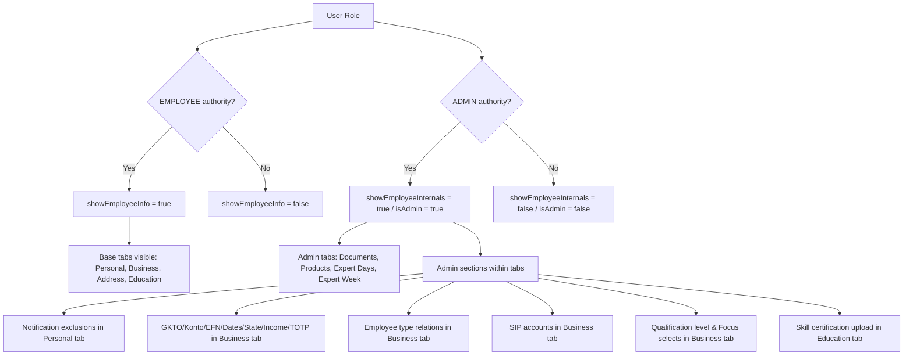
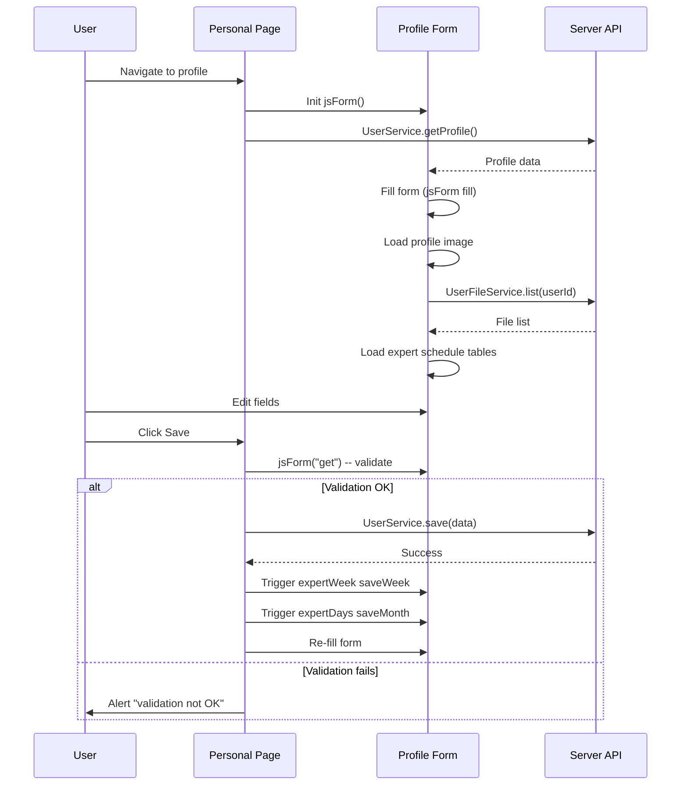

# Profile Form & Personal Profile Page -- UI Analysis

> **Source files analysed**
>
> | File | Lines | Role |
> |------|-------|------|
> | `profile/personal.htmlm` | 31 | Personal profile page entry point (HTMLM metadata) |
> | `profile/personal.js` | 58 | Personal page init + save handler |
> | `profile/profile.js` | 385 | Shared profile form logic (image upload, files, skills, signature, schedule) |
> | `profile/userProfile.mustache` | 1014 | Shared profile form template (tabs, all sections) |
> | `profile/messages.i18n.js` | 77 | Profile-specific i18n overrides + formatters |

---

## 1. Block: Personal Profile Page (`personal.htmlm`)

### HTMLM Header Metadata

| Field | Method | Value |
|-------|--------|-------|
| `usePanel` | `variable` | `true` |
| `navBar` | `template` | `../_include/navbar.mustache` |
| `profile` | `template` | `../profile/userProfile.mustache` |
| `passwordDlg` | `template` | `../profile/passwordDlg.html` |
| `signaturePad` | `template` | `../profile/signaturePad.html` |
| `showEmployeeInfo` | `authority` | `EMPLOYEE` |
| `showEmployeeInternals` | `authority` | `ADMIN` |
| `nav` | `variable` | filter: false, buttons (see below) |

### Nav Buttons

| ID | Label Key | Icon | Action |
|----|-----------|------|--------|
| `saveMenuBtn` | `action.save` | `save` | Saves profile via `UserService.save` |
| `changePasswordBtn` | `login.password` | `lock-alt` | Opens password change dialog |

### Page Structure

```
personal.htmlm
  +-- <script> personal.js
  +-- <script> messages.i18n.js
  +-- <script> appointment/messages.i18n.js
  +-- {{> navBar}}
  +-- <div id="personalProfile">
  |     +-- {{> profile}}  (userProfile.mustache)
  +-- {{> passwordDlg}}
  +-- {{> signaturePad}}
```

The `#personalProfile` div wraps the shared profile form. `personal.js` initialises the form with `jsForm()`, calls `UserService.getProfile` to fill it, and wires the save button.

---

## 2. Block: User Profile Form (`userProfile.mustache`)

### Tab Layout

The form uses Bootstrap Nav Tabs. Each tab is an icon-only nav item with a tooltip label.

| Tab ID | Icon | Label Key | Visibility |
|--------|------|-----------|------------|
| `profile-personalData` | `fa-user` | `menu.personalData` | ALL |
| `profile-businessData` | `fa-user-tie` | `menu.businessData` | ALL |
| `profile-address` | `fa-address-card` | `menu.addresses` | ALL |
| `profile-education` | `fa-graduation-cap` | `menu.education` | ALL |
| `profile-documents` | `fa-folder` | `menu.documents` | `{{#isAdmin}}` only |
| `profile-products` | `fa-shopping-cart` | `product` | `{{#isAdmin}}` only |
| `profile-expertdays` | `fa-calendar-check` | HARDCODED "Availability-Shift" | `{{#isAdmin}}` only |
| `profile-expertweek` | `fa-calendar-week` | HARDCODED "Availability-Woche" | `{{#isAdmin}}` only |

**Commented-out tabs** (not rendered):
- `profile-equipment` (fa-microscope) -- Equipment tab exists in HTML but tab link is commented out
- `profile-videos` (fa-video) -- Video library tab link is commented out

---

## 3. Form Elements by Section

### 3.1 Tab: Personal Data (`profile-personalData`)

#### Profile Picture Card (left column, col-md-4)

| Element | Type | `name` / ID | Notes |
|---------|------|-------------|-------|
| Rotate button | `<i>` action | `#rotatePic` | Calls `UserService.rotateThumbnail` |
| Profile image | `` | `#uploadedPicture` | src = `/get/UserService/getImage/{userId}/thumbnail.jpg` |
| File upload | `<input type="file">` | `#uploadProfilePicture` | jQuery fileupload -> `UserService.updateThumbnail` |
| Upload status | `<div>` | `#uploadStatus` | Progress display |

**Registration-only block** (`{{#register}}`): Canvas preview (`#previewPic`) + separate file input (`#selectProfilePicture`) with rotation support.

#### Personal Information (right column, col-md-8)

| # | Element | Type | `name` | Label/Placeholder Key | Validation | Visibility |
|---|---------|------|--------|----------------------|------------|------------|
| 1 | Salutation | `<select>` | `data.userProfile.salutation` | -- | -- | ALL |
| 2 | Title | `<input>` | `data.userProfile.title` | `user.title` | -- | ALL |
| 3 | First Name | `<input>` | `data.userProfile.firstName` | `user.firstName` | `mandatory` | ALL |
| 4 | Last Name | `<input>` | `data.userProfile.lastName` | `user.lastName` | `mandatory` | ALL |
| 5 | Mobile | `<input>` | `data.userProfile.cellularNumber` | `contact.cellularnumber` | -- | ALL |
| 6 | Birthday | `<input>` date | `data.userProfile.birthday` | `contact.birthday` | -- | ALL |
| 7 | On-call number | `<input>` | `data.userProfile.shiftPhoneNumber` | `onCallNumbers` | -- | ALL |
| 8 | Email (primary) | `<input>` | `data.email` | `user.email` | `mandatory`, `regexp` (email) | ALL |
| 9 | Email 2 | `<input>` | `data.employeeProfile.email2` | `user.email2` | `regexp` (email) | ALL |
| 10 | Notification per mail | `<input type="checkbox">` | `data.userProfile.notificationPerMail` | `user.notificationPerMail` | `bool` class | ALL |

#### Securebox Data

| # | Element | Type | `name` | Label/Placeholder Key | Visibility |
|---|---------|------|--------|-----------------------|------------|
| 11 | Securebox User | `<input>` | `data.employeeProfile.bayernBoxAccess.user` | HARDCODED "User" | ALL |
| 12 | Securebox Password | `<input type="password">` | `data.employeeProfile.bayernBoxAccess.password` | `login.password` | ALL |
| 13 | Check access button | `<i>` action | `#checkBayernBoxEmployeeProfile` | -- | ALL |

The check button calls `LocationService.checkBayernBoxAccess` with username and password, shows check/ban icon on result.

#### Notification Exclusions (`{{#isAdmin}}` only)

| # | Element | Type | `name` | Binding |
|---|---------|------|--------|---------|
| 14 | Excluded notifications | `selectcollection` of checkboxes | `data.userProfile.exludedNotifications` | 20 `NotificationEvent` values |

**Notification Event values (checkboxes)**:
`APPOINTMENT_EXPERT_AGREED`, `APPOINTMENT_EXPERT_CANCELED`, `APPOINTMENT_EXPERT_DISAGREED`, `APPOINTMENT_ACCEPTED`, `APPOINTMENT_ASSIGNED`, `APPOINTMENT_RESERVED`, `APPOINTMENT_CANCELED`, `APPOINTMENT_DELETED`, `APPOINTMENT_REJECTED`, `APPOINTMENT_DONE`, `APPOINTMENT_REQUEST`, `APPOINTMENT_REMINDER`, `CONSULATION_SUBMIT`, `COUNCIL_START`, `COUNCIL_SUBMIT`, `EXPERT_SUMMARY`, `TEMPLATE`, `INVOICE_CUSTOMER`, `USER_PASSWORD`, `APPOINTMENT_UPCOMING`

---

### 3.2 Tab: Business Data (`profile-businessData`)

#### Left Column (col-md-6) -- Dates & Status

| # | Element | Type | `name` | Label/Placeholder Key | Visibility |
|---|---------|------|--------|-----------------------|------------|
| 1 | Active since | `<input>` date | `data.employeeProfile.activeSince` | `employee.activeSince` | ALL |
| 2 | GKTO | `<input>` | `data.employerProfile.gkto` | `billing.gkto` | ADMIN |
| 3 | Konto | `<input>` | `data.employerProfile.konto` | `billing.konto` | ADMIN |
| 4 | EFN | `<input>` | `data.employerProfile.efn` | `employee.efn` | ADMIN |
| 5 | Active since VC | `<input>` date | `data.employerProfile.activeSinceVC` | `employee.activesinceVC` | ADMIN |
| 6 | Active until VC | `<input>` date | `data.employerProfile.activeUntilVC` | `employee.activeTillVC` | ADMIN |
| 7 | AGB/TC accepted date | `<span>` display | `data.dateAcceptedLoginNotification` | HARDCODED "AGB/TC Login Akzeptiert" | ADMIN |
| 8 | Employee State | `<select>` | `data.employeeState` | `employee.status` | ADMIN |
| 9 | Inactive start | `<input>` date | `data.employerProfile.dateInactiveStart` | -- | ADMIN |
| 10 | Inactive until | `<input>` date | `data.employerProfile.dateInactiveUntil` | -- | ADMIN |
| 11 | Inactive reason | `<textarea>` | `data.employerProfile.inctiveReason` | `label.description` | ADMIN |
| 12 | Require TOTP | `<input type="checkbox">` | `data.requireTotp` | `user.requireTotp` | ADMIN |

**Employee State select options**: `UNCONFIRMED`, `ACTIVE`, `SICK`, `HOLIDAY`, `INACTIVE`

#### Contractual Relations Collection (ADMIN)

| # | Element | Type | `name` | Notes |
|---|---------|------|--------|-------|
| 13 | Relations collection | `collection` | `data.employerProfile.employeeType` | Repeater with add button |
| 13a | Start date | `<input>` date | `employeeType.start` | Per-row |
| 13b | Type | `<select>` | `employeeType.type` | Values: `HONORAR`, `HN2`, `HN3`, `A1`, `A2`, `A3` |

#### SIP Accounts Collection (ADMIN)

| # | Element | Type | `name` | Notes |
|---|---------|------|--------|-------|
| 14 | SIP accounts | `collection` | `data.employerProfile.sipAccounts` | HARDCODED "Sip Accounts" |
| 14a | Number | `<input>` | `sipAccounts.number` | Per-row with delete |

#### Current Income (ADMIN)

| # | Element | Type | `name` | Label Key |
|---|---------|------|--------|-----------|
| 15 | Current income | `<input>` number | `data.employerProfile.currentIncome` | `EmployerProfile.currentIncome` |

#### Right Column (col-md-6) -- Financial & Signature

| # | Element | Type | `name` | Placeholder Key | Visibility |
|---|---------|------|--------|-----------------------|------------|
| 16 | UID (tax) | `<input>` | `data.employeeProfile.uid` | `address.uid` | ALL |
| 17 | Tax ID | `<input>` | `data.employeeProfile.taxid` | `address.taxid` | ALL |
| 18 | IBAN | `<input>` | `data.employeeProfile.iban` | `address.iban` | ALL |
| 19 | Bank | `<input>` | `data.employeeProfile.bank` | `address.bank` | ALL |
| 20 | BIC | `<input>` | `data.employeeProfile.bic` | `address.bic` | ALL |
| 21 | Signature image | `` | `#signatureImage` | -- | ALL |
| 22 | Create signature button | `<button>` | `#createSignatureButton` | `employee.createSignature` | ALL |
| 23 | Signature file upload | `<input type="file">` | `data.employeeProfile.imageSignature` | -- | ALL |
| 24 | Signature preview link | `<a>` templatefield | -- | `notificationTemplate.preview` | ALL |

#### Qualification & Focus (ADMIN)

| # | Element | Type | `name` | Label Key | Visibility |
|---|---------|------|--------|-----------|------------|
| 25 | Qualification level | `<select>` | `data.employerProfile.level` | `employerProfile.QualificationLevel` | ADMIN |
| 26 | Experience: Addiction Medicine | `<select>` | `data.employerProfile.experienceAddictionMedicine` | `employerProfile.Experience.AddictionMedicine` | ADMIN |
| 27 | Focus: Shift | `<select>` | `data.employeeProfile.shift` | `shift` | ADMIN |
| 28 | Focus: Appointment | `<select>` | `data.employeeProfile.appointment` | `appointment` | ADMIN |
| 29 | Focus: Therapy | `<select>` | `data.employeeProfile.therapy` | `employeeProfile.therapy` | ADMIN |

**Qualification Level options**: `ONBOARDING`, `ROOKIE`, `AMATEUR`, `PROFI`

**Experience level options**: `VERYHIGH`, `HIGH`, `MEDIUM`, `LOW`, `VERYLOW`

**Focus Level options** (shift/appointment/therapy): `""` (none), `HIGH`, `MEDIUM`, `LOW`

---

### 3.3 Tab: Addresses (`profile-address`)

#### Primary Address

| # | Element | Type | `name` | Placeholder Key | Notes |
|---|---------|------|--------|-----------------------|-------|
| 1 | Address name | `<input>` | `data.userProfile.mainAddress.name` | `label.name` | -- |
| 2 | Address type | `<select>` | `data.userProfile.mainAddress.type` | -- | See AddressType enum |
| 3 | Street | `<input>` | `data.userProfile.mainAddress.address` | `location.street` | `mandatory` if employee |
| 4 | Street 2 | `<input>` | `data.userProfile.mainAddress.address2` | `location.street2` | -- |
| 5 | Phone | `<input>` | `data.userProfile.mainAddress.phone` | `employee.telephone` | -- |
| 6 | Fax | `<input>` | `data.userProfile.mainAddress.fax` | `employee.fax` | -- |
| 7 | ZIP | `<input>` | `data.userProfile.mainAddress.zip` | `location.zip` | `searchZipCode` auto-fill, `mandatory` if employee |
| 8 | City | `<input>` | `data.userProfile.mainAddress.city` | `location.city` | `mandatory` if employee |
| 9 | State | `<input>` | `data.userProfile.mainAddress.state` | `location.state` | -- |
| 10 | Country | `<input>` | `data.userProfile.mainAddress.country` | `location.country` | -- |

**AddressType options**: `PRIVATE`, `ALTERNATIVE`, `WORK`, `PRAXIS`, `OTHER`

**ZIP auto-fill**: `searchZipCode` class triggers lookup that populates city, country, state fields automatically.

#### Additional Addresses Collection

| # | Element | Type | `name` | Notes |
|---|---------|------|--------|-------|
| 11 | Sites collection | `collection` `#siteList` | `data.employeeProfile.sites` | Repeater, add button, per-row delete |

Per-row fields mirror the primary address structure: `sites.name`, `sites.type`, `sites.address`, `sites.address2`, `sites.phone`, `sites.fax`, `sites.zip`, `sites.city`, `sites.state`, `sites.country`.

Delete calls `UserService.removeSite` for persisted items.

---

### 3.4 Tab: Education (`profile-education`)

#### Skills Section

| # | Element | Type | `name` / ID | Notes |
|---|---------|------|-------------|-------|
| 1 | Skill autocomplete | `<input>` insert | `#skillSelect` | `SkillService.autocomplete`, inserts into collection |
| 2 | Skills collection | `collection` `#skillProfileList` | `data.employeeProfile.skills` | Repeater |
| 2a | Status icon | `<i>` `.status` | -- | green check if active, red X if not |
| 2b | Skill code | `<input>` readonly | `skills.skill.code` | -- |
| 2c | Certification date | `<input>` date | `skills.dateCertification` | -- |
| 2d | Certification file link | `<a>` templatefield | -- | Download link to certification file |
| 2e | Certification file upload | `<input type="file">` | `skills.certification` | ADMIN only (`{{#isAdmin}}`) |

#### Exclusion Criteria Section

| # | Element | Type | `name` / ID | Notes |
|---|---------|------|-------------|-------|
| 3 | Exclusion criteria autocomplete | `<input>` insert | autoselect | `ExclusionCriteriaService`, display: `title` |
| 4 | Exclusion criteria collection | `collection` | `data.employeeProfile.exclusionCriteria` | Repeater |
| 4a | Title | `<input>` readonly | `exclusionCriteria.title` | -- |
| 4b | Description | `<textarea>` readonly | `exclusionCriteria.description` | -- |

---

### 3.5 Tab: Documents (`profile-documents`) -- ADMIN only

| # | Element | Type | `name` / ID | Notes |
|---|---------|------|-------------|-------|
| 1 | Documents table | `<table>` `#userFiles` | prefix: `files` | jsForm with separate fill |
| 1a | File name link | `<a>` templatefield | `list.name` | Download: `/get/UserFileService/dl/{id}/{name}` |
| 1b | File type | `<select>` | `list.type` | See UserFileType enum |
| 1c | Date | `<input>` date | `list.date` | HARDCODED placeholder "Dokument-Datum" |
| 1d | Delete | `<i>` `.remove` | -- | Calls `UserFileService.remove` |
| 2 | Upload button | `<i>` `.jsfileupload` | `#addUserFile` | `UserFileService.upload` |

**UserFileType options**: `APPROBIATION`, `AUTHENTICATED_MEDICAL_SPECIALIST_CERTIFICATE`, `LOAN_AGREEMENT`, `DATA_PROTECTION_CONTRACT`, `BASIC_RULES_CONTRACT`, `BAVARIA_LAWS_CONTRACT`, `SOCIAL_SECURITY_CHECKLIST`, `PROFESSIONAL_LIABILITY_INSURANCE`, `PROOF_OF_EXPERTISE`, `CURRICULUM_VITAE`, `SERVICE_CONTRACT`, `CONDUCT_CERTIFICATE`, `OTHER`

---

### 3.6 Tab: Products (`profile-products`) -- ADMIN only

| # | Element | Type | `name` / ID | Label Key |
|---|---------|------|-------------|-----------|
| 1 | Mail invoice | `<input type="checkbox">` | `data.employeeProfile.mailInvoice` | `invoiceReceiver.mailInvoice` |
| 2 | Post invoice | `<input type="checkbox">` | `data.employeeProfile.postInvoice` | `invoiceReceiver.postInvoice` |
| 3 | Product autocomplete | `<input>` insert object | `#productSelect` | `ProductService.autocomplete` (filter: EXPERT) |

#### Products Collection Table

| Column | Element | `name` | Notes |
|--------|---------|--------|-------|
| Amount | `<input>` number | `products.amount` | Default 1, triggers total recalculation |
| Product name | `<span>` field | `products.product.name` | Read-only display |
| Start | `<input>` date | `products.start` | -- |
| Until | `<input>` date | `products.until` | -- |
| Description | `<input>` | `products.product.description` | -- |
| Comment | `<input>` | `products.comment` | -- |
| Price | `<span>` field currency | `products.product.price` | Read-only |
| Adjusted price | `<input>` number currency | `products.adjustedPrice` | Editable |
| Total | `<span>` `.total` | -- | Computed: amount * adjustedPrice (or price) |
| Delete | `<span>` `.delete` | -- | Removes row |

---

### 3.7 Tab: Equipment (`profile-equipment`) -- Hidden (tab commented out)

Contains two `selectcollection` blocks for `data.employeeProfile.selectcollection` and `data.employeeProfile.technicalEquipment`, both populated from `{{{departments}}}` triple-mustache (raw HTML). Not currently active.

---

### 3.8 Tab: Videos (`profile-videos`) -- Hidden (tab commented out)

Read-only table displaying `data.employeeProfile.categoriesWatched` with columns: id, name, dateStarted, dateDone.

---

### 3.9 Tab: Expert Week (`profile-expertweek`) -- ADMIN only

Weekly availability grid loaded via `expertWeek.js`.

| Element | ID | Notes |
|---------|-----|-------|
| Type selector | `#weekTypeSelection` | Only option: `TREATMENT` |
| Week table | `#expertWeekTable` | 7-day columns (MO-SU), hourly rows |

Each cell has tri-state toggles: null (circle), true (check), false (X). Data loaded/saved via triggers `load`/`saveWeek` on the table element.

---

### 3.10 Tab: Expert Days / Month (`profile-expertdays`) -- ADMIN only

Monthly availability grid loaded via `expertDays.js`.

| Element | ID | Notes |
|---------|-----|-------|
| Year input | `#expertdaysYear` | Number input, default 2022 |
| Month selector | `#expertdaysMonth` | 12 months (JAN-DEC) |
| Month table | `#expertdaysMonthTable` | Day rows, 7 slot columns |

**Slot columns**:
- Shift: morning, afternoon, night
- Appointment: morningAppointment, afternoonAppointment
- Treatment: treatmentAppointment

Summary rows show current/max counts for weekday and weekend separately. Each day cell has same tri-state toggle as weekly view.

---

## 4. Permission Gating



### Permission Matrix

| Section / Field | No Auth | EMPLOYEE | ADMIN |
|-----------------|---------|----------|-------|
| Personal Data tab (basic fields) | -- | YES | YES |
| Securebox Data | -- | YES | YES |
| Notification exclusions | -- | NO | YES |
| Business Data tab (activeSince only) | -- | YES | YES |
| Business Data admin fields (GKTO, state, etc.) | -- | NO | YES |
| Contractual relations | -- | NO | YES |
| SIP accounts | -- | NO | YES |
| Qualification & Focus | -- | NO | YES |
| Address tab | -- | YES | YES |
| Address mandatory fields | -- | conditional on `isAnEmployee` | conditional on `isAnEmployee` |
| Education tab (skills, exclusion criteria) | -- | YES | YES |
| Skill certification upload | -- | NO | YES |
| Documents tab | -- | NO | YES |
| Products tab | -- | NO | YES |
| Expert Week tab | -- | NO | YES |
| Expert Days tab | -- | NO | YES |

---

## 5. Collections / Repeaters

| Collection ID | Data Field | Parent Section | Row Template | Add Mechanism | Delete Mechanism |
|---------------|-----------|----------------|--------------|---------------|------------------|
| (notification exclusions) | `data.userProfile.exludedNotifications` | Personal Data | Checkbox list (selectcollection) | Static list | Uncheck |
| (employee type) | `data.employerProfile.employeeType` | Business Data | date + type select | `fa-plus add` icon | -- |
| (SIP accounts) | `data.employerProfile.sipAccounts` | Business Data | phone number input | `fa-plus add` icon | `fa-trash delete` icon |
| `#siteList` | `data.employeeProfile.sites` | Address | Full address form | `fa-plus add` icon | `.deleteSite` -> `UserService.removeSite` |
| `#skillProfileList` | `data.employeeProfile.skills` | Education | Code + date + cert file | `#skillSelect` autocomplete insert | `fa-trash delete` icon |
| (exclusion criteria) | `data.employeeProfile.exclusionCriteria` | Education | Title + description (readonly) | Autoselect insert | `fa-trash delete` icon |
| `#userFiles .collection` | `files.list` | Documents | File name + type select + date | `#addUserFile` file upload | `.remove` -> `UserFileService.remove` |
| `#productList` | `data.employerProfile.products` | Products | Amount, product, dates, prices | `#productSelect` autocomplete insert | `.delete` icon |

---

## 6. Dynamic Options & External Data Sources

| Data Source | Service | Method | Used In | Display |
|-------------|---------|--------|---------|---------|
| Skills autocomplete | `SkillService` | `autocomplete` | Education tab, `#skillSelect` | `code` (returns skill object with code, certified, id, description) |
| Products autocomplete | `ProductService` | `autocomplete` | Products tab, `#productSelect` | `name` (filter: EXPERT, maxResults: 15, minLength: 0) |
| Country autocomplete | `CountryService` | (default) | Address fields | `description` |
| Customer autocomplete | `CustomerService` | (default) | -- | `name` |
| Exclusion criteria autocomplete | `ExclusionCriteriaService` | (default) | Education tab | `title` |
| ZIP code lookup | (zipCodeLookup.js) | -- | Address zip fields | Auto-fills city, country, state |

### Static Enums

| Enum | Values | Used In |
|------|--------|---------|
| SalutationType | `BUSINESS`, `FORMAL`, `FEMALE`, `MALE`, `INFORMAL`, `INFORMAL_FEMALE`, `INFORMAL_MALE` | Personal Data |
| EmployeeState | `UNCONFIRMED`, `ACTIVE`, `SICK`, `HOLIDAY`, `INACTIVE` | Business Data |
| AddressType | `PRIVATE`, `ALTERNATIVE`, `WORK`, `PRAXIS`, `OTHER` | Address |
| EmployeeType | `HONORAR`, `HN2`, `HN3`, `A1`, `A2`, `A3` | Business Data (contractual relations) |
| QualificationLevel | `ONBOARDING`, `ROOKIE`, `AMATEUR`, `PROFI` | Business Data |
| FocusLevel (5-level) | `VERYHIGH`, `HIGH`, `MEDIUM`, `LOW`, `VERYLOW` | Experience: Addiction Medicine |
| FocusLevel (3-level + none) | `""`, `HIGH`, `MEDIUM`, `LOW` | Focus: shift, appointment, therapy |
| UserFileType | `APPROBIATION`, `AUTHENTICATED_MEDICAL_SPECIALIST_CERTIFICATE`, `LOAN_AGREEMENT`, `DATA_PROTECTION_CONTRACT`, `BASIC_RULES_CONTRACT`, `BAVARIA_LAWS_CONTRACT`, `SOCIAL_SECURITY_CHECKLIST`, `PROFESSIONAL_LIABILITY_INSURANCE`, `PROOF_OF_EXPERTISE`, `CURRICULUM_VITAE`, `SERVICE_CONTRACT`, `CONDUCT_CERTIFICATE`, `OTHER` | Documents |
| NotificationEvent | 20 values (see section 3.1) | Notification exclusions |

---

## 7. Click Actions (from JS)

### personal.js

| Action | Trigger | Handler |
|--------|---------|---------|
| Rotate profile picture | `#rotatePic` click | Increments angle by 90deg on `#previewPic` (registration flow only) |
| Save profile | `#saveMenuBtn` click | Validates with `jsForm("get")`, sets `displayName=null`, calls `UserService.save`, then triggers expertdays save and re-fills form |
| Save event bridge | `$(document).on("saveCurrentProfile")` | Triggers `#saveMenuBtn` click (used after file uploads) |

### profile.js

| Action | Trigger | Handler |
|--------|---------|---------|
| SSN validation | `input.checkSSN` keyup | Parses Austrian (9/10 digit) or German (12 digit) SSN, extracts birthday, auto-fills birthday field |
| Rotate picture (server) | `#rotatePic` click (inside `#uploadProfilePicture` context) | Calls `UserService.rotateThumbnail`, refreshes image with cache-bust |
| Profile picture upload | `#uploadProfilePicture` file change | jQuery fileupload to `UserService.updateThumbnail` |
| Show job list | `#showJobList` click | Calls `UserService.checkJobs`, shows alert with job list |
| Delete site | `.deleteSite` click (in siteList collection) | Calls `UserService.removeSite` for persisted, removes DOM row |
| Skill file upload | `.fileAction` click (in skillProfileList) | Triggers hidden file input, on success triggers `saveCurrentProfile` |
| Check BayernBox | `#checkBayernBoxEmployeeProfile` click | Calls `LocationService.checkBayernBoxAccess`, shows check/ban icon |
| Create signature | `#createSignatureButton` click | Opens `#signaturePadDlg` dialog with current profile data |
| Remove user file | `.remove` click (in userFiles collection) | Confirms, calls `UserFileService.remove` |
| Update user file attributes | `input,select` change (in userFiles) | Calls `UserFileService.update` with id, date, type |
| Product amount change | `products.amount` input change | Recalculates total = amount * price |

---

## 8. Server API Calls

| Service | Method | Parameters | Called From | Purpose |
|---------|--------|------------|-------------|---------|
| `UserService` | `getProfile` | `[]` | personal.js init | Load current user profile |
| `UserService` | `save` | `[data]` | Save button | Save profile (displayName forced null) |
| `UserService` | `rotateThumbnail` | `[userId]` | Rotate button | Rotate profile picture server-side |
| `UserService` | `updateThumbnail` | `[fileData, userId]` | File upload | Upload new profile picture |
| `UserService` | `checkJobs` | `[userId]` | Show jobs button | List user's jobs |
| `UserService` | `removeSite` | `[siteId]` | Delete site button | Remove additional address |
| `UserService` | `downloadProfileFile` | `[userId, fileId, filename]` | Signature/cert links | Download file (GET endpoint) |
| `UserService` | `previewSignature` | `[userId]` | Preview link | Preview signature in PDF (GET endpoint) |
| `UserService` | `getImage` | `[userId]` | Image src | Get profile thumbnail (GET endpoint) |
| `UserFileService` | `list` | `[userId]` | After fill | List user documents |
| `UserFileService` | `upload` | `[userId, file]` | Upload button | Upload new document |
| `UserFileService` | `remove` | `[[fileId]]` | Delete button | Remove document |
| `UserFileService` | `update` | `[fileId, date, type]` | Field change | Update document metadata |
| `LocationService` | `checkBayernBoxAccess` | `[username, password]` | Check button | Verify Securebox credentials |
| `SkillService` | `autocomplete` | `[query]` | Skill input | Search skills |
| `ProductService` | `autocomplete` | `[query, filter:EXPERT]` | Product input | Search products |
| `CountryService` | (autocomplete) | `[query]` | Country input | Search countries |
| `CustomerService` | (autocomplete) | `[query]` | Customer input | Search customers |
| `ExclusionCriteriaService` | (autocomplete) | `[query]` | Exclusion input | Search exclusion criteria |

---

## 9. Translation Table

### Key Profile-specific Translations

| Key | DE | EN | Source |
|-----|----|----|--------|
| `user.firstName` | Vorname | First Name | properties |
| `user.lastName` | Nachname | Last Name | properties |
| `user.email` | E-Mail | E-Mail | properties |
| `user.email2` | E-Mail2 | Email 2 | properties |
| `user.title` | Titel | Title | properties |
| `user.notificationPerMail` | Nachrichten per E-Mail weiterleiten | Send notifications per mail | properties |
| `user.requireTotp` | 2-Faktor verpflichtend | Require Two-Factor | properties |
| `user.EmployeeState` | Status | State | properties |
| `user.username` | Benutzername | Username | properties |
| `user.enabled` | Aktiv | Enabled | properties |
| `user.locked` | Ausgesperrt | Locked | properties |
| `user.role` | Rolle | Role | properties |
| `contact.cellularnumber` | Handy | Mobile | properties |
| `contact.birthday` | Geburtstag | Birthday | properties |
| `login.password` | Passwort | Password | properties |
| `employee.personalData` | Persoenliche Daten | personal data | properties |
| `employee.secureBoxData` | Securebox Daten | Securebox data | properties |
| `employee.activeSince` | taetig als Arzt seit | active as doctor since | properties |
| `employee.activesinceVC` | taetig bei VC als Arzt seit | active at VC since | properties |
| `employee.activeTillVC` | taetig bei VC als Arzt bis | active at VC till | properties |
| `employee.efn` | EFN/Mitgliedsnummer (PT) | EFN/Membernumber (PT) | properties |
| `employee.status` | Status | (not in EN, DE only) | properties |
| `employee.inactive` | Nicht-Verfuegbar | Not Active | properties |
| `employee.relations` | Vertragsverhaeltnisse | Contractual relations | properties |
| `employee.primaryAddress` | Rechnungsadresse | main address | properties |
| `employee.otherAddress` | Weitere Adressen | further addresses | properties |
| `employee.telephone` | Festnetz | telephone | properties |
| `employee.fax` | Fax | fax | properties |
| `employee.exclude` | Von folgenden Nachrichten ausnehmen | Exclude from the following messages | properties |
| `employee.signature` | Unterschrift | Signature | properties |
| `employee.createSignature` | Unterschrift erstellen | Create signature | properties |
| `address.uid` | Umsatzsteuernummer | sales tax id | properties |
| `address.taxid` | Steuer ID | Tax Nr | properties |
| `address.iban` | IBAN | IBAN | properties |
| `address.bank` | Kreditinstitut | Bank | properties |
| `address.bic` | BIC | BIC | properties |
| `location.street` | Strasse | Street | properties |
| `location.street2` | Zusatz | Additional | properties |
| `location.zip` | PLZ | ZIP | properties |
| `location.city` | Ort | City | properties |
| `location.state` | Bundesland | State | properties |
| `location.country` | Land | Country | properties |
| `billing.gkto` | GKTO | GKTO | properties |
| `billing.konto` | Konto | Account | properties |
| `menu.personalData` | Persoenliche Daten | Personal data | properties |
| `menu.businessData` | Geschaeftliche Daten | Business Data | properties |
| `menu.addresses` | Adressen | Addresses | properties |
| `menu.education` | Ausbildung | Education | properties |
| `menu.documents` | Dokumente | Documents | properties |
| `onCallNumbers` | Bereitschaftsnummer | On-call number | properties |
| `skill` | Skill | Skill | properties |
| `exclusionCriteria` | Ausschlusskriterien | Exclusion criteria | properties |
| `product` | Produkt | Product | properties |
| `product.price` | Preis | Price | properties |
| `shift` | Bereitschaftsdienst | Shift | properties |
| `appointment` | Sprechstunde | Appointment | properties |
| `Treatment` | Therapie | Treatment | properties |
| `employeeProfile.fokus` | Fokus und Hingabe | focus | properties |
| `employeeProfile.therapy` | Therapie | Therapy | properties |
| `employerProfile.QualificationLevel` | Qualifikationsniveau | Qualification Level | properties |
| `employerProfile.Experience` | Praxiserfahrung | Practical experience | properties |
| `employerProfile.Experience.AddictionMedicine` | Suchtmedizin | Experience Addiction Medicine | properties |
| `EmployerProfile.currentIncome` | Honorarbasis | Yearly Income | properties |
| `EmployerProfile.currentIncome.description` | Jahreseinkommen ausserhalb VC (geschaetzt) | Yearly external Income | properties |
| `invoiceReceiver.mailInvoice` | E-Mail-Rechnung | mail invoice | properties |
| `invoiceReceiver.postInvoice` | Post Rechnung | post invoice | properties |
| `notificationTemplate.preview` | Vorschau | Preview | properties |
| `profile.documents.file` | Datei | File | properties |
| `profile.documents.type` | Typ | Type | properties |
| `profile.documents.date` | Datum | Date | properties |
| `user.password.change.success` | Ihr Password wurde geaendert. | Your password has been changed. | properties |
| `user.password.change.failure` | Ihr Passwort entspricht nicht den Anforderungen. | Your password does not meet the requirements. | properties |

### Hardcoded Strings (require extraction to i18n)

| String | Location | Language |
|--------|----------|----------|
| `"Availability-Shift"` | Tab tooltip, expertdays | DE/EN mix |
| `"Availability-Woche"` | Tab tooltip, expertweek | DE |
| `"AGB/TC Login Akzeptiert"` | Business Data, accepted date label | DE |
| `"Sip Accounts"` | Business Data, SIP accounts label | EN |
| `"Securebox"` | Personal Data, input group text | EN |
| `"User"` | Securebox user placeholder | EN |
| `"Honorar"`, `"HN2"`, `"HN3"`, `"A1"`, `"A2"`, `"A3"` | Employee type select options | DE/Code |
| `"Datei hochladen"` | addUserFile button title | DE |
| `"Dokument-Datum"` | Document date placeholder | DE |
| `"Total"` | Products table header | EN |
| `"Start"` | Employee type date placeholder | EN |
| `"PNG/JPG Maximum 800x300px (empfohlen: 400x150px)"` | Signature hint | DE |
| `"Hochladen fehlgeschlagen..."` | Upload error alert in profile.js | DE |
| `"Jobs\n--------\n"` | Job list alert prefix in profile.js | EN |

---

## 10. Mermaid Diagrams

### Form Sections Structure

```mermaid
graph TB
    subgraph "User Profile Form (Tab Layout)"
        T1["Tab 1: Personal Data<br/>ALL users"]
        T2["Tab 2: Business Data<br/>ALL users (ADMIN sections inside)"]
        T3["Tab 3: Addresses<br/>ALL users"]
        T4["Tab 4: Education<br/>ALL users"]
        T5["Tab 5: Documents<br/>ADMIN only"]
        T6["Tab 6: Products<br/>ADMIN only"]
        T7["Tab 7: Expert Days/Month<br/>ADMIN only"]
        T8["Tab 8: Expert Week<br/>ADMIN only"]
    end

    subgraph "Tab 1: Personal Data"
        T1 --> P1[Profile Picture Card]
        T1 --> P2[Personal Info Fields]
        T1 --> P3[Securebox Data]
        T1 --> P4["Notification Exclusions<br/>(ADMIN only)"]
    end

    subgraph "Tab 2: Business Data"
        T2 --> B1[Active Since Date]
        T2 --> B2["Admin Fields: GKTO, Konto, EFN,<br/>Dates, State, Income, TOTP<br/>(ADMIN only)"]
        T2 --> B3["Contractual Relations Collection<br/>(ADMIN only)"]
        T2 --> B4["SIP Accounts Collection<br/>(ADMIN only)"]
        T2 --> B5[Financial Data: UID, Tax, IBAN, Bank, BIC]
        T2 --> B6[Signature Upload + Preview]
        T2 --> B7["Qualification & Focus<br/>(ADMIN only)"]
    end

    subgraph "Tab 3: Addresses"
        T3 --> A1[Primary Address Form]
        T3 --> A2[Additional Addresses Collection]
    end

    subgraph "Tab 4: Education"
        T4 --> E1[Skills Autocomplete + Collection]
        T4 --> E2[Exclusion Criteria Autocomplete + Collection]
    end
```



### Data Flow



### Permission Gating Flow

```mermaid
flowchart LR
    subgraph "Authority Check (HTMLM)"
        direction TB
        AUTH1["authority: EMPLOYEE"] -->|sets| VAR1["showEmployeeInfo"]
        AUTH2["authority: ADMIN"] -->|sets| VAR2["showEmployeeInternals / isAdmin"]
    end

    subgraph "Visible Tabs"
        direction TB
        VAR1 -->|always| TABS_ALL["Personal Data<br/>Business Data<br/>Addresses<br/>Education"]
        VAR2 -->|admin| TABS_ADMIN["Documents<br/>Products<br/>Expert Days<br/>Expert Week"]
    end

    subgraph "Inline Admin Sections"
        direction TB
        VAR2 -->|admin| SEC1["Notification exclusions"]
        VAR2 -->|admin| SEC2["GKTO/Konto/EFN/Status"]
        VAR2 -->|admin| SEC3["Employee type relations"]
        VAR2 -->|admin| SEC4["SIP accounts"]
        VAR2 -->|admin| SEC5["Qualification & Focus"]
        VAR2 -->|admin| SEC6["Skill cert upload button"]
        VAR2 -->|admin| SEC7["Require TOTP checkbox"]
        VAR2 -->|admin| SEC8["Current income"]
    end
```



---

## Appendix: Salutation Type Translations

| Value | DE | EN |
|-------|----|----|
| `BUSINESS` | - | - |
| `FORMAL` | Sehr geehrte(r) | Mrs./Mr. |
| `FEMALE` | Sehr geehrte Frau | Mrs. |
| `MALE` | Sehr geehrter Herr | Mr. |
| `INFORMAL` | Liebe(r) | Dear |
| `INFORMAL_FEMALE` | Liebe | Dear |
| `INFORMAL_MALE` | Lieber | Dear |

## Appendix: Employee State Translations

| Value | DE | EN |
|-------|----|----|
| `UNCONFIRMED` | Vor-Registriert | Unconfirmed |
| `ACTIVE` | Aktiv | Active |
| `SICK` | Krankenstand | Sick |
| `HOLIDAY` | nicht verfuegbar | Not available |
| `INACTIVE` | Inaktiv/(abgemeldet) | Inactive |

## Appendix: Address Type Translations

| Value | DE | EN |
|-------|----|----|
| `PRIVATE` | Wohnsitz | Home |
| `ALTERNATIVE` | Zweitwohnsitz | Alternate Home |
| `WORK` | Arbeitgeber | Work |
| `PRAXIS` | Praxis | Praxis |
| `OTHER` | Sonstige | Other |

## Appendix: Qualification Level Translations

| Value | DE | EN |
|-------|----|----|
| `ONBOARDING` | Onboarding | ONBOARDING |
| `ROOKIE` | Anfaenger | ROOKIE |
| `AMATEUR` | Amateur | AMATEUR |
| `PROFI` | Profi | PROFI |

## Appendix: Focus Level Translations

| Value | DE | EN |
|-------|----|----|
| `NONE` | keine Angabe | none |
| `VERYLOW` | sehr niedrig | very low |
| `LOW` | niedrig | low |
| `MEDIUM` | mittel | medium |
| `HIGH` | hoch | high |
| `VERYHIGH` | sehr hoch | very high |

## Appendix: UserFileType Translations

| Value | DE | EN |
|-------|----|----|
| `APPROBIATION` | beglaubigte Approbationsurkunde | authenticated certificate of approval |
| `AUTHENTICATED_MEDICAL_SPECIALIST_CERTIFICATE` | beglaubigte Facharzturkunde | authenticated medical specialist certificate |
| `LOAN_AGREEMENT` | Mietvertrag | Loan agreement |
| `DATA_PROTECTION_CONTRACT` | Verpflichtungs-und Verschwiegenheitserklaerung | Data protection contract |
| `BASIC_RULES_CONTRACT` | Rechte und Pflichten der Verantwortlichen | (missing in EN) |
| `BAVARIA_LAWS_CONTRACT` | Bayrische Landesgesetze | (missing in EN) |
| `SOCIAL_SECURITY_CHECKLIST` | SV Pruefbogen | (missing in EN) |
| `PROFESSIONAL_LIABILITY_INSURANCE` | Berufshaftpflichtversicherung | Professional liability insurance |
| `PROOF_OF_EXPERTISE` | Fachkundennachweis | Proof of Expertise |
| `CURRICULUM_VITAE` | Lebenslauf | curriculum vitae |
| `SERVICE_CONTRACT` | Rahmenvertrag ueber telemed. Leistungen | Service contract |
| `CONDUCT_CERTIFICATE` | Nichtvorliegen v. Straftaten | certificate of good conduct |
| `OTHER` | Sonstiges | Other |

## Appendix: NotificationEvent Translations (used in exclusion checkboxes)

| Value | DE | EN |
|-------|----|----|
| `APPOINTMENT_EXPERT_AGREED` | Termin vom Arzt akzeptiert | Appointment Expert Agreed |
| `APPOINTMENT_EXPERT_CANCELED` | Terminruecknahme bestaetigt | Appointment Expert Canceled |
| `APPOINTMENT_EXPERT_DISAGREED` | Termin vom Arzt abgelehnt | Appointment Expert Disagreed |
| `APPOINTMENT_ACCEPTED` | Termin Akzeptiert | Appointment Accepted |
| `APPOINTMENT_ASSIGNED` | Termin Zugewiesen | Appointment Assigned |
| `APPOINTMENT_RESERVED` | Termin Reserviert | Appointment Reserved |
| `APPOINTMENT_CANCELED` | Termin Abgesagt | Appointment Canceled |
| `APPOINTMENT_DELETED` | Termin Geloescht | Appointment Deleted |
| `APPOINTMENT_REJECTED` | Termin Abgelehnt | Appointment Rejected |
| `APPOINTMENT_DONE` | Termin Abgeschlossen | Appointment Done |
| `APPOINTMENT_REQUEST` | Termin Anfrage | Appointment Request |
| `APPOINTMENT_REMINDER` | Termin Erinnerung | Appointment Reminder |
| `CONSULATION_SUBMIT` | Behandlung Abschicken | Consultation Submit |
| `COUNCIL_START` | Konsil Start | Consil Start |
| `COUNCIL_SUBMIT` | Konsil Einreichen | Consil Submit |
| `EXPERT_SUMMARY` | Experten Zusammenfassung | Experten Summary |
| `TEMPLATE` | Systemnachricht Weiterleitung | Forward System Message |
| `INVOICE_CUSTOMER` | Rechnung Kunde | Invoice Customer |
| `USER_PASSWORD` | Benutzer Passwort | User Password |
| `APPOINTMENT_UPCOMING` | Termin Bevorstehend | Appointment Upcoming |
