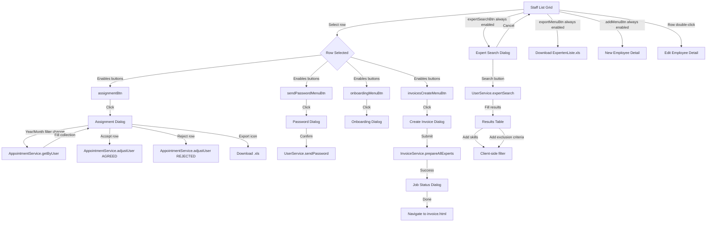
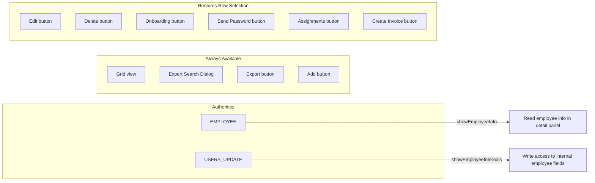
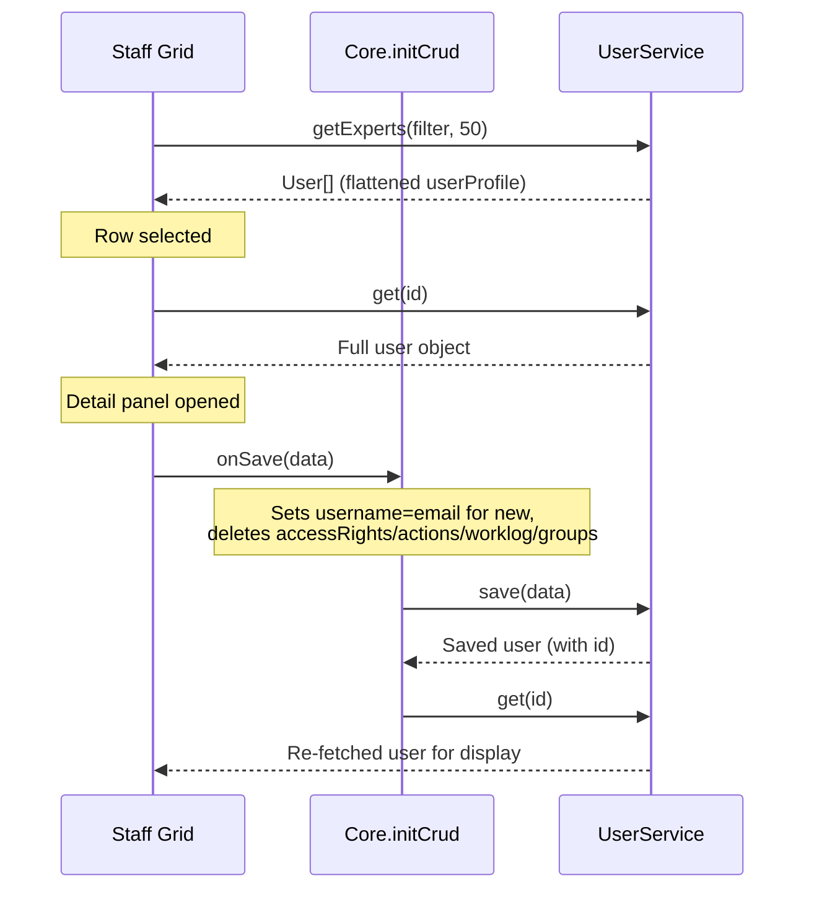

# Staff Management List Page Analysis

> **Source files analysed**
> - `web/src/main/webapp/profile/staff.htmlm` (399 lines)
> - `web/src/main/webapp/profile/staff.js` (295 lines)
> - `web/src/main/webapp/profile/searchExpert.js` (116 lines)

---

## 1. HTMLM Metadata

### Header Directives

| Directive | Type | Value / Source |
|-----------|------|----------------|
| `usePanel` | variable | `true` |
| `navBar` | template | `../_include/navbar.mustache` |
| `quickFilter` | template | `../_include/quickFilter.mustache` |
| `jobStatusDlg` | template | `../_include/jobStatusDlg.html` |
| `profile` | template | `../profile/userProfile.mustache` |
| `signaturePad` | template | `../profile/signaturePad.html` |
| `passwordDlg` | template | `../admin/password.mustache` |
| `onboardingDlg` | template | `../onboarding/form.html` |
| `assignUserDlg` | template | `../appointment/assignUser.html` |
| `showEmployeeInfo` | authority | `EMPLOYEE` |
| `showEmployeeInternals` | authority | `USERS_UPDATE` |
| `search` | variable | `true` |
| `showCustomer` | variable | `false` |
| `quickFilterData` | variable | A-Z + `#` (full), A-D/E-H/.../Y-Z# (short), `input: true` |
| `skillsMain` | options | `SkillService.getMain` (CHECKBOX) |
| `skillsExtra` | options | `SkillService.getExtra` (CHECKBOX) |
| `skillsAdditional` | options | `SkillService.getAdditional` (CHECKBOX) |
| `skillsLanguage` | options | `SkillService.getLanguage` (CHECKBOX) |
| `employeeState` | enum | `de.videoclinic.model.types.EmployeeState` (OPTION) |
| `employeeLevel` | enum | `de.videoclinic.model.types.QualificationLevel` (OPTION) |
| `groups` | options | `GroupService.getAll` (OPTION, value=id, content=name) |
| `workHours` | options | `WorkHourService.getAll` (OPTION, value=id, content=description) |

### Permission Gates

| Permission constant | Authority | Controls |
|---------------------|-----------|----------|
| `showEmployeeInfo` | `EMPLOYEE` | Read access to employee info (detail panel) |
| `showEmployeeInternals` | `USERS_UPDATE` | Write access to employee internals |

### Included Scripts

| Script | Purpose |
|--------|---------|
| `/profile/staff.js` | Main grid, CRUD, assignments, invoicing logic |
| `/profile/messages.i18n.js` | Profile i18n messages |
| `/profile/searchExpert.js` | Expert search dialog logic |
| `/appointment/messages.i18n.js` | Appointment i18n messages |

---

## 2. Block: Staff List Page (Grid)

### Container

- `id="profiles"`
- `data-filter='{"type":"EMPLOYEE"}'` -- initial server filter restricts to employee type
- `data-limit="100"` -- default page size
- `class="tableView"`

### Quick Filter

- Alphabetical filter bar (A-Z + `#`) for full view
- Condensed ranges (A-D, E-H, etc.) for narrow view
- Has text input (`input: true`)
- Bound to field `username` (`$("#quickFilter").data().field = "username"`)

### Grid Columns

| # | `data-field` | `data-id` | Header (i18n key) | Width | Formatter | Notes |
|---|--------------|-----------|-------------------|-------|-----------|-------|
| 1 | `id` | -- | `id` | auto | -- | Hidden by convention |
| 2 | `firstName` | -- | `user.firstName` | 130 | -- | |
| 3 | `lastName` | -- | `user.lastName` | 130 | -- | |
| 4 | `employeeState` | -- | `user.EmployeeState` | 100 | `Formatter.employeestate` | Enum badge |
| 5 | `employeeProfile` | `shift` | `EmployeeState.SHIFT` | 100 | `Formatter.shift` | Shift/standby status |
| 6 | `employeeProfile` | `appointment` | `EmployeeState.APPOINTMENT` | 100 | `Formatter.appointment` | Appointment status |
| 7 | `employeeProfile` | `therapy` | `EmployeeState.THERAPY` | 100 | `Formatter.therapy` | Therapy status |
| 8 | `lastReminder` | -- | `appointment.lastReminder` | 130 | `Formatter.dateTime` | |
| 9 | `requireTotp` | -- | `<i class='fa fa-lock' title='2FA'>` | 30 | `Formatter.bool` | Icon header (lock) |
| 10 | `enabled` | -- | `<i class='fa fa-lightbulb-on' title='...'>` | 30 | `Formatter.bool` | Icon header (lightbulb) |

### Grid Data Source

- Service: `UserService.getExperts`
- Params: `[Core.getFilter(), 50]`
- `dataProcess`: Flattens `userProfile` fields onto the root object for grid column binding
- Client-side filter: Searches `firstName`, `lastName`, `email` (case-insensitive substring)

### Inline Detail Panel

- Uses shared `{{>profile}}` template (userProfile.mustache)
- `data-buttonsave="true"`, `data-width="1000"`, `data-icon="fa fa-user-tie"`, `data-color="bg-color-staff"`
- Title: `employee.dialogtitle` ("Experts" / "Experten")

### Toolbar Buttons

| Button ID | Icon | i18n Key | Default State | Action |
|-----------|------|----------|---------------|--------|
| `assignmentBtn` | `check-double` | `appointment.requests` | disabled | Opens Assignment Dialog for selected user |
| `addMenuBtn` | `plus-square` | `action.add` | enabled | Creates new employee record |
| `editMenuBtn` | `pencil` | `action.change` | disabled | Edits selected employee |
| `onboardingMenuBtn` | `question` | `onboardingStep` | disabled | Opens onboarding dialog for selected user |
| `deleteMenuBtn` | `trash` | `action.delete` | disabled | Deletes selected employee |
| `exportMenuBtn` | `download` | `action.export` | enabled | Downloads ExpertenListe.xls |
| `sendPasswordMenuBtn` | `lock-alt` | `user.password` | disabled | Sends password reset to selected user |
| `invoicesCreateMenuBtn` | `file-invoice` | `action.invoice` | disabled | Opens Create Invoice Dialog |
| `expertSearchBtn` | `fa-regular fa-user` | (HARDCODED) "Expert Test Search" | enabled | Opens Expert Search Dialog |

Buttons `assignmentBtn`, `sendPasswordMenuBtn`, `onboardingMenuBtn`, `invoicesCreateMenuBtn` are **enabled on row selection** via `rowSelected` event.

---

## 3. Block: Expert Search Dialog

### Dialog Configuration

- `id="searchExpertDlg"`
- `data-crudbuttons="false"`, `data-icon="fa fa-user"`, `data-color="bg-sysadmin"`
- Title: `expertSearchDlg.title` ("Expert search" / "Experten-Suche")
- `data-target="primary"` -- renders as primary panel

### Form Elements

| # | Element | Name / ID | Type | Service / Source | Notes |
|---|---------|-----------|------|------------------|-------|
| 1 | Job autocomplete | `data.job` / `#jobSelector` | autocomplete input | `JobService.autocomplete` | `data-display="code"`, `data-minlength="0"`, `data-filter` uses `jobType` variable |
| 2 | Active toggle | `data.active` | checkbox (switch) | -- | Default: `true` |

### Collections: Skills (Insert + Delete)

- Container: `#expertSearchSkills`, `data-field="data.skills"`, class `collection insert`
- Input: autocomplete for `SkillService.autocomplete`, `data-display="code"`, `data-minlength="0"`, `data-append="#searchExpertDlg"`
- Placeholder: HARDCODED "Skills"
- Input group `#skillInputGroup` is initially hidden, shown after first search
- Row template: displays `skills.code` + trash icon for delete
- Events: `postAddCollection` and `deleteCollection` trigger `filterExperts()`

### Collections: Exclusion Criteria (Insert + Delete)

- Container: `#expertSearchExclusionCriteria`, `data-field="data.exclusionCriteria"`, class `collection insert`
- Input: autocomplete for `ExclusionCriteriaService.autocomplete`, `data-display="title"`, `data-minlength="0"`, `data-append="#searchExpertDlg"`
- Placeholder: HARDCODED "Exclusion Criteria"
- Input group `#exclusionCriteriaInputGroup` is initially hidden, shown after first search
- Row template: displays `exclusionCriteria.title` + trash icon for delete
- Events: `postAddCollection` and `deleteCollection` trigger `filterExperts()`

### Results Table

- `id="expertSearchTable"`, initially hidden (`style="display:none"`)
- `data-field="data.result"` (collection)

| Column | Field Path | Notes |
|--------|-----------|-------|
| Name | `result.userProfile.displayName` | Bold |
| Skills | `result.employeeProfile.skills` (nested collection) | Displays `skills.skill.code`, comma-separated |
| Exclusion Criteria | `result.employeeProfile.exclusionCriteria` (nested collection) | Displays `exclusionCriteria.title`, comma-separated |
| Qualification Level | `result.employerProfile.level` | `<select>` with `{{{employeeLevel}}}` options, **disabled** (read-only) |
| (empty) | -- | Reserved for appointment deep-link icon |

**Results table headers:**

| # | Header | i18n Key | Notes |
|---|--------|----------|-------|
| 1 | Name | `label.name` | |
| 2 | Skills | -- | HARDCODED "Skills" |
| 3 | Exclusion Criteria | `expertSearchTable.exclusionCriteria` | |
| 4 | Qualification Level | `expertSearchTable.expertLevel` | |
| 5 | (empty) | -- | Action column |

### Dialog Buttons

| Button | Class | Event | Label | Notes |
|--------|-------|-------|-------|-------|
| Search | `btn btn-primary data` | `expertSearch` | HARDCODED "Search" | Triggers `performExpertSearch()` |
| Cancel | `btn btn-secondary` | `cancel` | HARDCODED "Cancel" | Hides table, clears form |

### Client-Side Filtering Logic (searchExpert.js)

After initial server search, the results can be **further filtered client-side** by:
1. **Skills**: Only show rows where the expert has ALL selected skills (AND logic)
2. **Exclusion Criteria**: Hide rows where the expert matches ALL selected exclusion criteria (AND logic for hiding)

The filtering is triggered automatically when skills or exclusion criteria are added/removed from the collections.

### Deep-Link Behavior

For results with an `appointmentId`, an icon link is generated pointing to `appointment.html#{appointmentId}`. The `getDeepLinkUrl` function has dead code for TREATMENT/COUNCIL routing but always resolves to `appointment.html`.

---

## 4. Block: Assignment Dialog

### Dialog Configuration

- `id="assignmentDlg"`
- `data-icon="far fa-check-double"`, `data-color="bg-color-invoice"`
- `data-target="modal"`, `data-width="800"`
- Title: `appointment.requests` ("Appointment Requests" / "Terminanfragen")

### Filter Form (`#assignmentDlgFilter`)

| # | Element | Name | Type | Notes |
|---|---------|------|------|-------|
| 1 | Year | `filter.year` | number input | Pre-filled with current year |
| 2 | Month | `filter.month` | select (1-12) | Options use `Month.JAN`..`Month.DEC` i18n keys. Pre-filled with current month - 1 |
| 3 | User name | `filter.user.displayName` | span (read-only) | Shows selected user's display name |
| 4 | Export | `#downloadExpertAppointment` | icon button (download) | Exports appointments as .xls |

Filter changes trigger `AppointmentService.getByUser` with `[userId, year, month]`.

### Appointment Requests Collection

- `data-field="data.result"` (collection in scrollable container)

**Table headers:**

| # | Header | Notes |
|---|--------|-------|
| 1 | Termin | HARDCODED German ("Appointment") |
| 2 | Status | HARDCODED German/English |
| 3 | (actions) | Accept/Reject buttons |

**Row template fields:**

| Field Path | Style | Description |
|-----------|-------|-------------|
| `result.appointment.itype` | bold | Appointment type |
| `result.appointment.wd` | normal | Weekday |
| `result.appointment.date` | normal | Date |
| `result.appointment.timeStart` | normal | Start time |
| `result.appointment.job.code` | text-muted | Job code |
| `result.appointment.location.name` | text-muted | Location name |

**Nested collection:** `result.additionalAssignments` (font-size 7pt, muted)
- Displays: `additionalAssignments.user.displayName`

**Row status indicator:**
- `.appointment` span: rendered via `i18n.appointmentStateFormatter(pojo.appointment.state)`
- `.state` icon: rendered via `i18n.assignedState(pojo.state)` with dynamic icon class and color

**Action buttons per row:**

| Button | Class | Title (i18n) | Action |
|--------|-------|-------------|--------|
| Accept | `.accept` | `action.assignment.accept` | Calls `AppointmentService.adjustUser(id, "AGREED")` with confirm dialog (HARDCODED "Benutzer annehmen?") |
| Reject | `.reject` | `action.assignment.reject` | Calls `AppointmentService.adjustUser(id, "REJECTED")` with confirm dialog (HARDCODED "Benutzer ablehnen?") |

---

## 5. Block: Create Invoice Dialog

### Dialog Configuration

- `id="createInvoiceDlg"`
- `data-icon="far fa-receipt"`, `data-color="bg-color-invoice"`
- `data-target="modal"`
- Title: `invoice` ("Invoice" / "Rechnung")

### Form Elements

| # | Element | Name | Type | Options | Notes |
|---|---------|------|------|---------|-------|
| 1 | Period | `data.month` | select (mandatory) | `21`=Q1, `22`=Q2, `23`=Q3, `24`=Q4, `31`=Q1/Q2, `32`=Q3/Q4, `41`=Year | HARDCODED labels for Q1-Q4, Q1/Q2, Q3/Q4; `year` key for full year |
| 2 | Year | `data.year` | number input | -- | No default shown; JS sets to previous month's year |

### Submit Behavior

1. Collects all selected employee IDs from the grid
2. Calls `InvoiceService.prepareAllExperts([ids, month, year])`
3. On success, opens `#jobStatusDlg` with `service: "InvoiceService"` and job result ID
4. On `#jobStatusDlg` "done" event, redirects to `invoice.html`
5. Error case: `alert("Fehlerhafte eingabe")` (HARDCODED German)

### Period Value Encoding

| Display | Value | Meaning |
|---------|-------|---------|
| Q1 | 21 | January-March |
| Q2 | 22 | April-June |
| Q3 | 23 | July-September |
| Q4 | 24 | October-December |
| Q1/Q2 | 31 | January-June (half-year) |
| Q3/Q4 | 32 | July-December (half-year) |
| Year | 41 | Full year |

---

## 6. Block: Filter Panel

### Panel Configuration

- `id="filter"`
- Bootstrap offcanvas (right side): `class="offcanvas offcanvas-end"`, `data-bs-scroll="true"`, `data-bs-backdrop="false"`

### Form Elements

| # | Element | Name | Type | Service / Source | Placeholder (i18n) |
|---|---------|------|------|------------------|---------------------|
| 1 | Name | `data.name` | text input | -- | `contact.name` |
| 2 | Email | `data.email` | text input | -- | `contact.primaryemail` |
| 3 | Job | `data.job` | autocomplete (object) | `JobService.autocomplete` | `jobId` |
| 4 | Skill | `data.skill` | autocomplete (object) | `SkillService.autocomplete` | `skill` |

### Filter Controls

| Control | Class | i18n Key | Notes |
|---------|-------|----------|-------|
| Apply | `.apply` | `button.apply` | Applies filter |
| Max Results | `.maxResults` | `filter.results` (title) | Select: 100 (default), 150, 200, 300, 500, >500 (-1) |
| Reset | `.reset` | `button.reset` | Clears filter |

### Filter Panel Header

- Title: HARDCODED "Filter" (with `<i class="fa fa-filter">`)
- Close button: Bootstrap `btn-close btn-close-white`

---

## 7. Collections / Repeaters Summary

| Collection | Container | Data Field | Insert Mode | Delete | Nested Collections |
|-----------|-----------|------------|-------------|--------|-------------------|
| Expert Search Skills | `#expertSearchSkills` | `data.skills` | Autocomplete insert (`SkillService.autocomplete`) | Trash icon (`.delete`) | -- |
| Expert Search Exclusion Criteria | `#expertSearchExclusionCriteria` | `data.exclusionCriteria` | Autocomplete insert (`ExclusionCriteriaService.autocomplete`) | Trash icon (`.delete`) | -- |
| Expert Search Results | `#expertSearchTable tbody` | `data.result` | Server response | -- | `result.employeeProfile.skills`, `result.employeeProfile.exclusionCriteria` |
| Assignment Requests | `#assignmentDlg .collection` | `data.result` | Server response | -- | `result.additionalAssignments` |

---

## 8. Dynamic Options & Enums

### Skill Services

| Field | Service | Method | Style | Bound To |
|-------|---------|--------|-------|----------|
| `skillsMain` | `SkillService` | `getMain` | CHECKBOX | `employeeProfile.skills` |
| `skillsExtra` | `SkillService` | `getExtra` | CHECKBOX | `employeeProfile.skills` |
| `skillsAdditional` | `SkillService` | `getAdditional` | CHECKBOX | `employeeProfile.skills` |
| `skillsLanguage` | `SkillService` | `getLanguage` | CHECKBOX | `employeeProfile.skills` |

### Enums

| Field | Enum Class | Style | Values |
|-------|-----------|-------|--------|
| `employeeState` | `EmployeeState` | OPTION | ACTIVE, APPOINTMENT, CUSTOMER, HOLIDAY, INACTIVE, SHIFT, SICK, SYSTEM, THERAPY, UNCONFIRMED |
| `employeeLevel` | `QualificationLevel` | OPTION | AMATEUR, ONBOARDING, PROFI, ROOKIE |

### Other Dynamic Options

| Field | Service | Method | Style | Value | Content |
|-------|---------|--------|-------|-------|---------|
| `groups` | `GroupService` | `getAll` | OPTION | `id` | `name` |
| `workHours` | `WorkHourService` | `getAll` | OPTION | `id` | `description` |

---

## 9. Click Actions (JS)

| Trigger | Handler | Description |
|---------|---------|-------------|
| Row select in grid | `$grid.on("rowSelected")` | Enables `sendPasswordMenuBtn`, `onboardingMenuBtn`, `assignmentBtn`, `invoicesCreateMenuBtn`; stores pojo |
| `#sendPasswordMenuBtn` click | Opens `#sendPassword` dialog | Calls `UserService.sendPassword(id)` |
| `#exportMenuBtn` click | `window.open(...)` | Downloads `/get/UserService/downloadAll/true/ExpertenListe.xls` |
| `#invoicesCreateMenuBtn` click | `createMonthlyInvoice()` | Passes all grid entries + previous month date |
| `#onboardingMenuBtn` click | `openOnboarding(id, "EMPLOYEE")` | Opens onboarding form for selected user |
| `#expertSearchBtn` click | Opens `#searchExpertDlg` | Pre-fills `active: true`, binds `expertSearch` event |
| `expertSearch` event | `performExpertSearch(data)` | Calls `UserService.expertSearch(data)`, fills results table |
| Skills/ExclusionCriteria add/delete | `filterExperts()` | Client-side filter on results table rows |
| `#searchExpertDlg` cancel | Hides table, clears form | Resets dialog state |
| `#assignmentBtn` click | Opens `#assignmentDlg` | Pre-fills year/month, loads appointments |
| Assignment filter change | `AppointmentService.getByUser(id, year, month)` | Re-fetches appointments for user |
| `#downloadExpertAppointment` click | Navigates to export URL | `/get/AppointmentService/exportUser/{id}/{year}/{month}/Termine-{id}{year}_{month}.xls` |
| `.accept` (per assignment row) | `AppointmentService.adjustUser(id, "AGREED")` | With confirm dialog (HARDCODED German) |
| `.reject` (per assignment row) | `AppointmentService.adjustUser(id, "REJECTED")` | With confirm dialog (HARDCODED German) |
| Invoice dialog submit | `InvoiceService.prepareAllExperts(ids, month, year)` | Then opens job status dialog |
| `#jobStatusDlg` done | `location.href = "invoice.html"` | Navigates to invoice page |

---

## 10. Server API Calls

| Service | Method | Parameters | Trigger | Response |
|---------|--------|-----------|---------|----------|
| `UserService` | `getExperts` | `[filter, 50]` | Grid load | Array of user objects |
| `UserService` | `get` | `[id]` | After save (re-fetch) | Single user object |
| `UserService` | `save` | `[data]` | Detail save | Saved user (with id) |
| `UserService` | `saveSetting` | `[name, JSON]` | Grid column settings change | -- |
| `UserService` | `sendPassword` | `[id]` | Send Password button | -- |
| `UserService` | `downloadAll` | `[true]` (via URL) | Export button | XLS file download |
| `UserService` | `expertSearch` | `[{job, active, skills?, exclusionCriteria?}]` | Expert Search dialog | Array of expert results |
| `AppointmentService` | `getByUser` | `[userId, year, month]` | Assignment dialog filter | Array of appointment assignments |
| `AppointmentService` | `adjustUser` | `[assignmentId, "AGREED"/"REJECTED"]` | Accept/Reject buttons | Updated assignment state |
| `AppointmentService` | `exportUser` | `[userId, year, month]` (via URL) | Export icon in assignment dialog | XLS file download |
| `InvoiceService` | `prepareAllExperts` | `[ids[], month, year]` | Create Invoice dialog submit | Job ID for status tracking |
| `SkillService` | `autocomplete` | (query text) | Expert search skills input, filter skill input | Skill objects |
| `ExclusionCriteriaService` | `autocomplete` | (query text) | Expert search exclusion criteria input | ExclusionCriteria objects |
| `JobService` | `autocomplete` | (query text) | Expert search job input, filter job input | Job objects |
| `SkillService` | `getMain/getExtra/getAdditional/getLanguage` | -- | Page load (header options) | Skill checkbox options |
| `GroupService` | `getAll` | -- | Page load (header options) | Group select options |
| `WorkHourService` | `getAll` | -- | Page load (header options) | Work hour select options |

---

## 11. Translation Table

| Key | EN | DE | Source |
|-----|----|----|--------|
| `user.firstName` | First Name | Vorname | i18n |
| `user.lastName` | Last Name | Nachname | i18n |
| `user.EmployeeState` | State | Status | i18n |
| `user.enabled` | Enabled | Aktiv | i18n |
| `user.password` | Password | Passwort | i18n |
| `user.requireTotp` | Require Two-Factor | 2-Faktor verpflichtend | i18n |
| `EmployeeState.ACTIVE` | Active | Aktiv | i18n |
| `EmployeeState.APPOINTMENT` | Appointment | Sprechstunde | i18n |
| `EmployeeState.CUSTOMER` | Customer | Kunde | i18n |
| `EmployeeState.HOLIDAY` | Not available | nicht verfugbar | i18n |
| `EmployeeState.INACTIVE` | Inactive | Inaktiv/(abgemeldet) | i18n |
| `EmployeeState.SHIFT` | Standby | Bereitschaft | i18n |
| `EmployeeState.SICK` | Sick | Krankenstand | i18n |
| `EmployeeState.SYSTEM` | System/Administration | System/Administration | i18n |
| `EmployeeState.THERAPY` | Therapy | Therapie | i18n |
| `EmployeeState.UNCONFIRMED` | Unconfirmed | Vor-Registriert | i18n |
| `QualificationLevel.AMATEUR` | amateur | Amateur | i18n |
| `QualificationLevel.ONBOARDING` | onboarding | Zugangsuntersuchung | i18n |
| `QualificationLevel.PROFI` | profi | Profi | i18n |
| `QualificationLevel.ROOKIE` | rookie | Anfanger | i18n |
| `employee.dialogtitle` | Experts | Experten | i18n |
| `appointment.lastReminder` | Last Reminder | Letzte Erinnerung | i18n |
| `appointment.requests` | Appointment Requests | Terminanfragen | i18n |
| `action.add` | Add | Neu | i18n |
| `action.change` | Change | Editieren | i18n |
| `action.delete` | Delete | Loschen | i18n |
| `action.export` | Export | Exportieren | i18n |
| `action.invoice` | Invoice | Rechnungserstellung | i18n |
| `action.assignment.accept` | Request/accept | Anfragen/Annehmen | i18n |
| `action.assignment.reject` | Rejected | Ablehnen | i18n |
| `expertSearchDlg.title` | Expert search | Experten-Suche | i18n |
| `expertSearchTable.searchByJob` | Search by job | Suche nach Job | i18n |
| `expertSearchTable.exclusionCriteria` | Exclusion criteria | Ausschlusskriterien | i18n |
| `expertSearchTable.expertLevel` | Qualification Level | Qualifikationsniveau | i18n |
| `label.name` | (Name) | (Name) | i18n |
| `contact.name` | Name | Name | i18n |
| `contact.primaryemail` | E-Mail | E-Mail | i18n |
| `jobId` | Job-Id | Dienstleistung | i18n |
| `skill` | Skill | Skill | i18n |
| `invoice` | Invoice | Rechnung | i18n |
| `year` | Year | Jahr | i18n |
| `month` | Month | Monate | i18n |
| `Month.JAN` | January | Januar | i18n |
| `Month.FEB` | February | Februar | i18n |
| `Month.MAR` | March | Marz | i18n |
| `Month.APR` | April | April | i18n |
| `Month.MAY` | May | Mai | i18n |
| `Month.JUN` | June | Juni | i18n |
| `Month.JUL` | July | Juli | i18n |
| `Month.AUG` | August | August | i18n |
| `Month.SEP` | September | September | i18n |
| `Month.OCT` | October | Oktober | i18n |
| `Month.NOV` | November | November | i18n |
| `Month.DEC` | December | Dezember | i18n |
| `onboardingStep` | Onboarding step | Onboarding-Schritt | i18n |
| `filter.results` | Results | Ergebnisse | i18n |
| `label.active` | -- | -- | **NOT FOUND** (used in expert search active toggle) |
| `button.apply` | -- | -- | **NOT FOUND** (used in filter panel) |
| `button.reset` | -- | -- | **NOT FOUND** (used in filter panel) |
| -- | Filter | Filter | **HARDCODED** (filter panel title) |
| -- | Skills | Skills | **HARDCODED** (expert search skills placeholder + result header) |
| -- | Exclusion Criteria | Exclusion Criteria | **HARDCODED** (expert search placeholder) |
| -- | Search | Search | **HARDCODED** (expert search button) |
| -- | Cancel | Cancel | **HARDCODED** (expert search button) |
| -- | Expert Test Search | Expert Test Search | **HARDCODED** (toolbar button name) |
| -- | Termin | Termin | **HARDCODED** German (assignment table header = "Appointment") |
| -- | Status | Status | **HARDCODED** (assignment table header) |
| -- | Q1, Q2, Q3, Q4, Q1/Q2, Q3/Q4 | Q1, Q2, Q3, Q4, Q1/Q2, Q3/Q4 | **HARDCODED** (invoice period select) |
| -- | Benutzer annehmen? | Benutzer annehmen? | **HARDCODED** German (accept confirm = "Accept user?") |
| -- | Benutzer ablehnen? | Benutzer ablehnen? | **HARDCODED** German (reject confirm = "Reject user?") |
| -- | Fehlerhafte eingabe | Fehlerhafte eingabe | **HARDCODED** German (invalid input error = "Invalid input") |

---

## 12. Mermaid Diagrams

### Dialog Navigation Flow

### Permission Gating

### CRUD Flow

