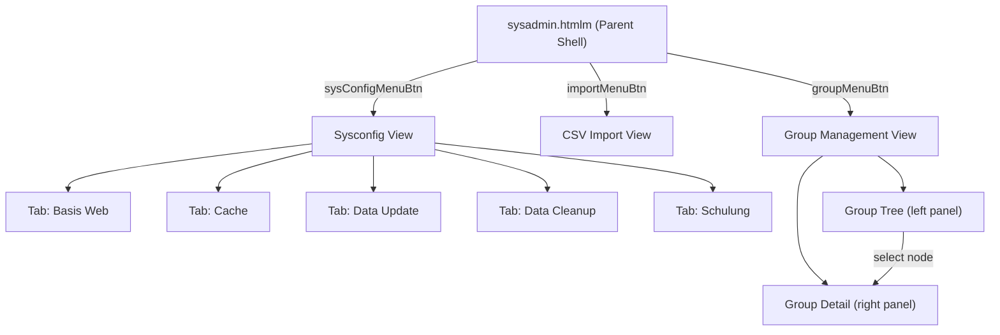
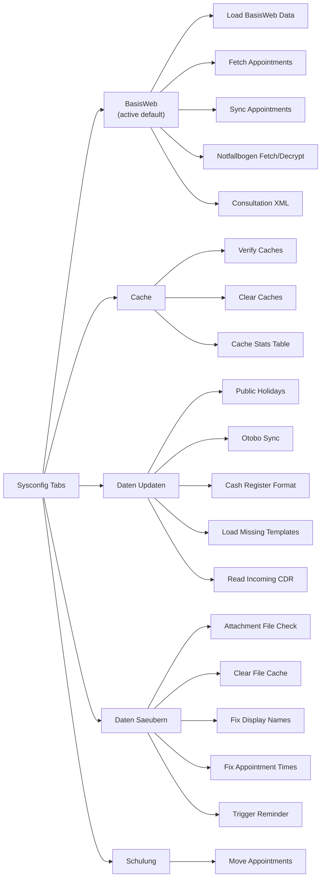
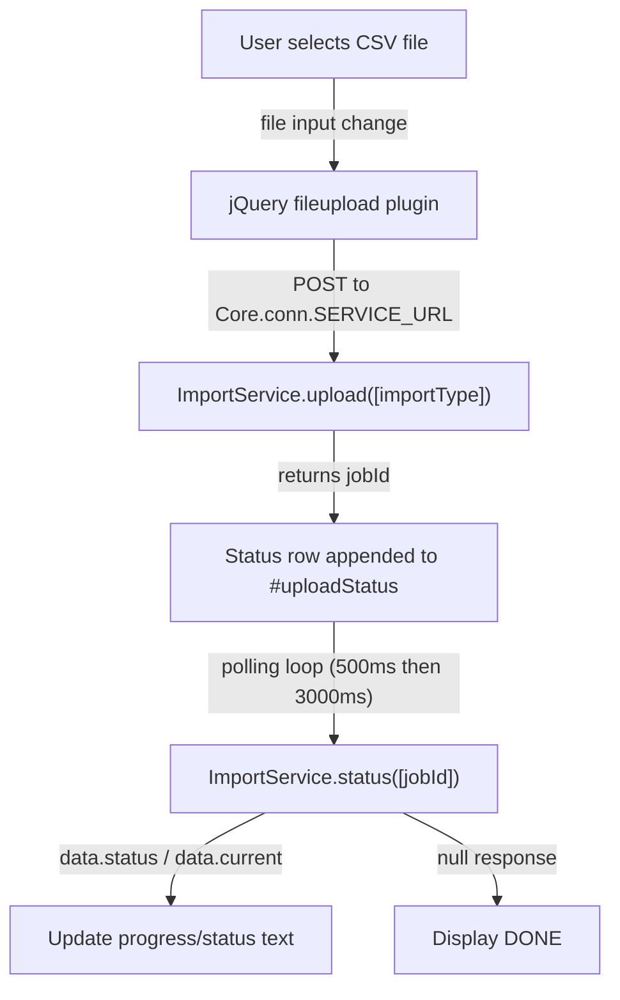

> **Split from**: `admin/05-sysadmin-views.md`
> **Sections extracted here**: Navigation Structure, System Configuration (sysconfig), CSV Import
> **Other domains received**: `user-management/admin-group/05-group-management.md` got Group Management sections

# Sysadmin Sub-Views: Sysconfig, Import, Group

> **Sources**:
> - `videoclinic-prod/web/src/main/webapp/admin/sysconfig.htmlm` (172 lines) + `sysconfig.js` (184 lines)
> - `videoclinic-prod/web/src/main/webapp/admin/import.htmlm` (24 lines) + `import.js` (58 lines)
> - `videoclinic-prod/web/src/main/webapp/admin/group.htmlm` (27 lines) + `group.js` (167 lines)
> - **Parent shell**: `videoclinic-prod/web/src/main/webapp/admin/sysadmin.htmlm`

All three views are template-included sub-views of `sysadmin.htmlm`. The parent page defines a sidebar nav with three buttons: **Sysconfig** (`sysConfigMenuBtn`), **CSV-Import** (`importMenuBtn`), and **Groups** (`groupMenuBtn`). Each sub-view is a `
` toggled by the nav system.

---

## Navigation Structure Diagram

---

# 1. System Configuration (`sysconfig.htmlm` + `sysconfig.js`)

**Container**: `
`
**Header**: `<h3>` with icon `fa-cogs` and text `{{i18n.administration.sysconfig}}`
**Layout**: Bootstrap nav-tabs with 5 tab panes

## Tab Structure Diagram

---

### Tab 1: Basis Web (`#tabBasisWeb`) -- Default Active

**Purpose**: Manually trigger BasisWeb data synchronization operations (appointments, Notfallbogen, consultation XML).

#### Form Elements

| Text-Reference / Name | Symbol | Datamodel | Type | Placeholder | Default | Required | Read-only | Condition |
| :--- | :--- | :--- | :--- | :--- | :--- | :--- | :--- | :--- |
| Jnummer input | -- | -- | text input (`#jnummer`) | "Jnummer" | -- | No | No | -- |
| JVA input | -- | -- | text input (`#jva`) | "JVA" | -- | No | No | -- |
| UID input | -- | -- | text input (`#fetchuid`) | "UID" | -- | No | No | -- |
| PIN input | -- | -- | text input (`#pin`) | "pin" | -- | No | No | -- |
| Consultation ID | -- | -- | text input (`#consultationId`) | "Behandlungs-Id" | -- | No | No | -- |
| Decrypted data output | -- | -- | `<pre>` (`#decryptedData`) | -- | -- | -- | Yes | Populated by decrypt action |
| Consultation XML output | -- | -- | `<pre>` (`#consultationResult`) | -- | -- | -- | Yes | Populated by generate action |

#### Click Actions

| Action ID | Symbol | Title | English | Service Call | Notes |
| :--- | :--- | :--- | :--- | :--- | :--- |
| `updateBasisWeb` | -- | **HARDCODED**: "Basis Web Data laden" | "Load BasisWeb Data" | `AdminService.updateBasisWeb([])` | Alert "done" on success |
| `basisWebFetchAppointments` | -- | **HARDCODED**: "Offene Anmeldungen laden" | "Load Open Registrations" | `BasisWebAppointmentService.fetch([])` | Alert "done" on success |
| `basisWebSyncAppointments` | -- | **HARDCODED**: "Anmeldungsliste Angleichen" | "Sync Registration List" | `BasisWebAppointmentService.sync([])` | Alert "done" on success |
| `basisWebFetchData` | -- | **HARDCODED**: "Notfallbogen laden" | "Load Emergency Form" | `BasisWebDataService.fetchBogen([jnummer, uid, jva, false])` | Requires jnummer, uid, jva inputs |
| `basisWebDecryptData` | -- | **HARDCODED**: "Notfallbogen entschlüsseln" | "Decrypt Emergency Form" | `BasisWebDataService.decryptBogen([jnummer, pin])` | Output rendered as JSON in `#decryptedData` |
| `basisWebGenerateResult` | -- | **HARDCODED**: "Behandlungs-Daten anzeigen (XML)" | "Show Treatment Data (XML)" | `BasisWebDataService.getSerializedResult([consultationId])` | Validates numeric input; XML formatted in `#consultationResult` |

#### Static Text (all HARDCODED German)

| German (HARDCODED) | English Translation | Location |
| :--- | :--- | :--- |
| "Sofortiges Laden aktueller offener Anmeldungen und Notfallboegen (analog zum automatischen job)" | "Immediately load current open registrations and emergency forms (analogous to the automatic job)" | Description paragraph before updateBasisWeb |
| "Nur offene anmeldungen laden" | "Only load open registrations" | Description paragraph before basisWebFetchAppointments |
| "Alle Anmeldungen Abgleichen - alte loeschen (analog zum taeglichen sync)" | "Sync all registrations - delete old ones (analogous to daily sync)" | Description paragraph before basisWebSyncAppointments |
| "Notfallbogen" | "Emergency Form" | Section heading `<h5>` |
| "Notfallbogen von Basisweb laden (fuer jva und jnummer)" | "Load emergency form from BasisWeb (for JVA and Jnummer)" | Description paragraph |
| "Durchsucht alle Notfallboegen der jnummer und entschluesselt ihn" | "Search all emergency forms of the Jnummer and decrypt it" | Description paragraph |
| "Uebermittlung" | "Transmission" | Section heading `<h5>` |

---

### Tab 2: Cache (`#tabCache`)

**Purpose**: View cache statistics, verify and clear server-side caches.
**jsForm prefix**: default (initialized on `#cacheInfo`)

#### Cache Statistics Table (collection: `data.cache`)

| Column Header | Datamodel Field | Type | Notes |
| :--- | :--- | :--- | :--- |
| Id | `cache.id` | field-display | Cache identifier |
| Size | `cache.size` | field-display | Entry count |
| TS | `cache.ts` | field-display dateTime | Last update timestamp |
| Hits | `cache.hits` | field-display | Cache hit count |
| Misses | `cache.miss` | field-display | Cache miss count |
| Resets | `cache.resets` | field-display | Reset count |
| DbChecks | `cache.dbchecks` | field-display | Database check count |

> **Note**: Table headers (Id, Size, TS, Hits, Misses, Resets, DbChecks) are all **HARDCODED** in English -- no i18n references.

#### Click Actions

| Action ID | Symbol | Title | English | Service Call | Notes |
| :--- | :--- | :--- | :--- | :--- | :--- |
| `updateCacheStats` | -- | Tab click trigger | "Update Cache Stats" | `AdminService.getCacheStats([])` | Auto-triggers on tab selection; fills cache table |
| `verifyCaches` | -- | **HARDCODED**: "Caches Verifizieren" | "Verify Caches" | `AdminService.verifyCaches([])` | Refreshes stats after completion |
| `clearCaches` | -- | **HARDCODED**: "Caches Leeren" | "Clear Caches" | `AdminService.clearCaches([])` | Refreshes stats after completion |

#### Static Text (HARDCODED German)

| German (HARDCODED) | English Translation |
| :--- | :--- |
| "Notwendig wenn z.b. die Kalendar unsauber angezeigt werden (z.b. nach aenderung der prio bei Dienstleistungen)" | "Necessary when e.g. the calendar displays incorrectly (e.g. after changing the priority of services)" |

---

### Tab 3: Data Update (`#tabDataUpdate`)

**Purpose**: Administrative data operations: public holidays, Otobo sync, cash register format, notification templates, CDR import.

#### Form Elements

| Text-Reference / Name | Symbol | Datamodel | Type | Placeholder | Default | Required | Read-only | Condition |
| :--- | :--- | :--- | :--- | :--- | :--- | :--- | :--- | :--- |
| Year input | -- | -- | number input (`#updatePublicHolidaysYear`) | -- | 2021 | No | No | -- |
| Id Format input | -- | `data.idFormat` | text input (`.mandatory`) | "Id Format" | -- | Yes | No | Within `#CashRegisterInfo` jsForm |
| Count input | -- | `data.count` | number input (`.mandatory.number`) | "Count" | -- | Yes | No | Within `#CashRegisterInfo` jsForm |

#### Click Actions

| Action ID | Symbol | Title | English | Service Call | Notes |
| :--- | :--- | :--- | :--- | :--- | :--- |
| `updatePublicHolidays` | -- | **HARDCODED**: "Feiertage laden" | "Load Public Holidays" | `ImportService.updatePublicHolidays([year])` | Takes year from input |
| `otoboSyncLocation` | -- | **HARDCODED**: "Orte mit Otobo Abgleichen" | "Sync Locations with Otobo" | `LocationService.otoboSync([])` | Plain `<button>` (no btn class) |
| `updateCashRegister` | -- | **HARDCODED**: "Update Count/Format" | "Update Count/Format" | `AdminService.updateCashRegister([idFormat, count])` | Gets data from `#CashRegisterInfo` jsForm; refills on success |
| `loadMissingNotificationTemplates` | -- | **HARDCODED**: "Fehlende Vorlagen laden" | "Load Missing Templates" | `AdminService.loadMissingNotificationTemplates([])` | Alert "done" on success |
| `readIncomingCdr` | -- | **HARDCODED**: "Incoming CDR Daten laden" | "Load Incoming CDR Data" | `CdrCallService.importIncoming([])` | Alert "done: Eintraege geladen" |

#### Data Initialization

On page load, `AdminService.getCashRegister()` is called to pre-fill the `#CashRegisterInfo` jsForm with current cash register format and count.

#### Static Text (HARDCODED German)

| German (HARDCODED) | English Translation | Location |
| :--- | :--- | :--- |
| "Feiertage" | "Public Holidays" | Section heading `<h4>` |
| "Otobo Sync" | "Otobo Sync" | Section heading `<h4>` |
| "Rechnungsformat" | "Invoice Format" | Section heading `<h4>` |
| "Set count/format:" | "Set count/format:" | Muted description |
| "Fixes jahr: 22/%04d" | "Fixed year: 22/%04d" | Format example |
| "Dynamisches (aktuelles): %02d/%04d" | "Dynamic (current): %02d/%04d" | Format example |
| "Vorlagen" | "Templates" | Section heading `<h4>` |
| "CDR" | "CDR" | Section heading `<h4>` |

---

### Tab 4: Data Cleanup (`#tabDataCleanup`)

**Purpose**: Maintenance operations: attachment checks, file cache cleanup, display name fixes, appointment time recalculation, manual reminder triggers.

#### Form Elements

| Text-Reference / Name | Symbol | Datamodel | Type | Placeholder | Default | Required | Read-only | Condition |
| :--- | :--- | :--- | :--- | :--- | :--- | :--- | :--- | :--- |
| Fix Start date | -- | -- | date input (`#fixStart`) | -- | -- | No | No | Used with fixAppointmentTimes |
| Fix Until date | -- | -- | date input (`#fixUntil`) | -- | -- | No | No | Used with fixAppointmentTimes |

#### Click Actions

| Action ID | Symbol | Title | English | Service Call | Notes |
| :--- | :--- | :--- | :--- | :--- | :--- |
| `checkAttachments` | -- | **HARDCODED**: "Attachment File Check" | "Attachment File Check" | `AdminService.fixAttachments([])` | Alert "done: check logs" |
| `clearFileCache` | -- | **HARDCODED**: "FileCache Leeren" | "Clear File Cache" | Not found in JS | Button exists in HTML but no handler in sysconfig.js |
| `fixDisplayName` | -- | **HARDCODED**: "Namen Anpassen" | "Fix Display Names" | `UserService.fixDisplayName([])` | Alert "done"; description: "Wenn Vor/Nachname falsch angezeigt werden" |
| `fixAppointmentTimes` | -- | **HARDCODED**: "Termin Neu Berechnen" | "Recalculate Appointment Times" | `AdminService.fixTimes([fixStart, fixUntil])` | Takes date range inputs |
| `triggerReminder` | -- | **HARDCODED**: "Termin-Erinnerung Manuell senden" | "Manually Send Appointment Reminders" | `AdminService.triggerReminder([])` | Alert "done: Erinnerungen verschickt" |

#### Server-Rendered Data

The template displays `{{reminderStatus.lastRun}}` and `{{reminderStatus.lastStatus}}` -- these are pre-loaded via `AdminService.getReminderStatus()` in the parent `sysadmin.htmlm` header.

#### Static Text (HARDCODED German)

| German (HARDCODED) | English Translation | Location |
| :--- | :--- | :--- |
| "Zeitraum" | "Period" | Label before date range inputs |
| "Wenn Vor/Nachname falsch angezeigt werden" | "When first/last name is displayed incorrectly" | Description after fixDisplayName button |

---

### Tab 5: Schulung / Training (`#tabDataSchooling`)

**Purpose**: Training/demo environment tool to bulk-move appointments to a specific date.

#### Form Elements

| Text-Reference / Name | Symbol | Datamodel | Type | Placeholder | Default | Required | Read-only | Condition |
| :--- | :--- | :--- | :--- | :--- | :--- | :--- | :--- | :--- |
| Appointment IDs | -- | -- | text input (`#moveAppointmentIds`) | -- | "37883,37884,...,37894" (hardcoded CSV) | No | No | Comma-separated list of numeric IDs |
| Target date | -- | -- | date input (`#moveAppointmentDate`) | -- | Today's date (set via JS) | No | No | -- |

#### Click Actions

| Action ID | Symbol | Title | English | Service Call | Notes |
| :--- | :--- | :--- | :--- | :--- | :--- |
| `moveAppointments` | -- | **HARDCODED**: "Termine Verschieben" | "Move Appointments" | `AdminService.moveAppointments([ids, date])` | Parses comma-separated IDs to number array; date as epoch ms |

---

### Sysconfig Service Calls Summary

| Service | Method | Trigger | Parameters | Response Handling |
| :--- | :--- | :--- | :--- | :--- |
| `AdminService` | `updateBasisWeb` | Button click | `[]` | Alert |
| `BasisWebAppointmentService` | `fetch` | Button click | `[]` | Alert |
| `BasisWebAppointmentService` | `sync` | Button click | `[]` | Alert |
| `BasisWebDataService` | `fetchBogen` | Button click | `[jnummer, uid, jva, false]` | Alert |
| `BasisWebDataService` | `decryptBogen` | Button click | `[jnummer, pin]` | JSON rendered in `<pre>` |
| `BasisWebDataService` | `getSerializedResult` | Button click | `[consultationId]` | XML formatted in `<pre>` |
| `AdminService` | `getCacheStats` | Tab click | `[]` | Fills cache table via jsForm |
| `AdminService` | `verifyCaches` | Button click | `[]` | Alert + refresh stats |
| `AdminService` | `clearCaches` | Button click | `[]` | Alert + refresh stats |
| `ImportService` | `updatePublicHolidays` | Button click | `[year]` | Alert |
| `LocationService` | `otoboSync` | Button click | `[]` | Alert |
| `AdminService` | `getCashRegister` | Page load | `[]` | Pre-fills CashRegisterInfo jsForm |
| `AdminService` | `updateCashRegister` | Button click | `[idFormat, count]` | Refills form + alert |
| `AdminService` | `loadMissingNotificationTemplates` | Button click | `[]` | Alert |
| `CdrCallService` | `importIncoming` | Button click | `[]` | Alert |
| `AdminService` | `fixAttachments` | Button click | `[]` | Alert |
| `UserService` | `fixDisplayName` | Button click | `[]` | Alert |
| `AdminService` | `fixTimes` | Button click | `[startDate, untilDate]` | Alert |
| `AdminService` | `triggerReminder` | Button click | `[]` | Alert with JSON |
| `AdminService` | `moveAppointments` | Button click | `[ids[], dateMs]` | Alert |
| `AdminService` | `getReminderStatus` | Page load (parent) | `[]` | Rendered in template as `{{reminderStatus.lastRun}}` / `{{reminderStatus.lastStatus}}` |

---

# 2. CSV Import (`import.htmlm` + `import.js`)

**Container**: `
`
**Layout**: Two Bootstrap cards -- one informational, one with file upload.

## Import Flow Diagram

## Informational Card

**Header**: **HARDCODED**: "CSV Datenimport" (English: "CSV Data Import")

**Supported document types** (all HARDCODED German):

| German (HARDCODED) | English Translation |
| :--- | :--- |
| "Folgende Dokumente sind unterstuetzt:" | "The following documents are supported:" |
| "Personalliste: Durch den import der Personalliste (Personalliste(xxx-xxx).csv werden neue Benutzer angelegt oder existierende Daten ueberschrieben." | "Staff list: By importing the staff list (Personalliste(xxx-xxx).csv), new users are created or existing data is overwritten." |
| "Kundenliste: Durch den import der Kundenliste (Kundenlist(xxx-xxx).csv) werden neue Kunden angelegt und existierende ueberschrieben." | "Customer list: By importing the customer list (Kundenlist(xxx-xxx).csv), new customers are created and existing ones are overwritten." |

## Form Elements

| Text-Reference / Name | Symbol | Datamodel | Type | Placeholder | Default | Required | Read-only | Condition |
| :--- | :--- | :--- | :--- | :--- | :--- | :--- | :--- | :--- |
| File input | -- | -- | file input (`#importFile`, `.form-control-file`) | -- | -- | Yes | No | -- |
| Upload status area | -- | -- | container div (`#uploadStatus`) | -- | -- | -- | Yes | Populated dynamically per upload |

## Click Actions

| Action ID | Symbol | Title | English | Service Call | Notes |
| :--- | :--- | :--- | :--- | :--- | :--- |
| File select/drop | -- | (implicit: file input) | -- | `ImportService.upload([importType])` | Uses jQuery fileupload plugin with drag-drop support |
| Status polling | -- | (automatic) | -- | `ImportService.status([jobId])` | Polls every 500ms initially, then 3000ms; shows file name, status, current progress, percentage |

## Upload Status Row Structure

Each uploaded file generates a dynamic row with the following columns:

| Column | CSS Class | Content |
| :--- | :--- | :--- |
| File name | `col-md-2` | `data.files[0].name` (text-overflow ellipsis) |
| Status | `col-md-2 status` | "uploaded" or "failed" |
| Current progress | `col-md-3 current` | `data.current: data.success ok data.failed err` |
| Progress percentage | `col-md-4 progress` | Percentage during upload, then status text / "DONE" |
| Spinner | `col-md-2 spinner` | Hidden after upload completes |

## Special Component: jQuery fileupload

- **Plugin**: jQuery File Upload (`$.fn.fileupload`)
- **Configuration**: `dataType: 'json'`, uploads to `Core.conn.SERVICE_URL`
- **Form data**: Wraps service call metadata (`ImportService`, `upload` method) with `#importType` value as parameter
- **Drop zone**: The import view itself
- **Paste zone**: Disabled (`null`)
- **Progress**: Reports upload percentage via `progressall` callback

> **Note**: `#importType` is referenced in the JS (`$("#importType").val()`) but there is no corresponding `<select>` or `<input>` with `id="importType"` in `import.htmlm`. This suggests either a missing dropdown (possibly removed) or it always evaluates to `undefined`/`null`.

---

# Translation Table (Sysconfig + Import)

## i18n References Used

| Text-Reference | German | English | Notes |
| :--- | :--- | :--- | :--- |
| `{{i18n.administration.sysconfig}}` | Systemkonfiguration | System Config | Sysconfig page header |
| `i18n.dialog_validation_notOk` | (JS) Validierung fehlgeschlagen | Validation failed | JS alert (used in sysconfig save validation) |

## Hardcoded Strings Requiring i18n Keys

### Sysconfig Tab Labels

| German (HARDCODED) | English Translation | Suggested i18n Key |
| :--- | :--- | :--- |
| "Basis Web" | "Basis Web" | `sysconfig.tab.basisWeb` |
| "Cache" | "Cache" | `sysconfig.tab.cache` |
| "Daten Updaten" | "Update Data" | `sysconfig.tab.dataUpdate` |
| "Daten Saeubern" | "Clean Up Data" | `sysconfig.tab.dataCleanup` |
| "Schulung" | "Training" | `sysconfig.tab.schooling` |

### Sysconfig Tab 1: Basis Web

| German (HARDCODED) | English Translation | Suggested i18n Key |
| :--- | :--- | :--- |
| "Sofortiges Laden aktueller offener Anmeldungen und Notfallboegen (analog zum automatischen job)" | "Immediately load current open registrations and emergency forms (analogous to the automatic job)" | `sysconfig.basisWeb.loadDescription` |
| "Basis Web Data laden" | "Load BasisWeb Data" | `sysconfig.basisWeb.loadData` |
| "Nur offene anmeldungen laden" | "Only load open registrations" | `sysconfig.basisWeb.fetchAppointmentsDescription` |
| "Offene Anmeldungen laden" | "Load Open Registrations" | `sysconfig.basisWeb.fetchAppointments` |
| "Alle Anmeldungen Abgleichen - alte loeschen (analog zum taeglichen sync)" | "Sync all registrations - delete old ones (analogous to daily sync)" | `sysconfig.basisWeb.syncDescription` |
| "Anmeldungsliste Angleichen" | "Sync Registration List" | `sysconfig.basisWeb.syncAppointments` |
| "Notfallbogen" | "Emergency Form" | `sysconfig.basisWeb.emergencyForm` |
| "Jnummer" | "J-Number" | `sysconfig.basisWeb.jnummer` |
| "JVA" | "JVA" | `sysconfig.basisWeb.jva` |
| "UID" | "UID" | `sysconfig.basisWeb.uid` |
| "Notfallbogen von Basisweb laden (fuer jva und jnummer)" | "Load emergency form from BasisWeb (for JVA and J-Number)" | `sysconfig.basisWeb.fetchDataDescription` |
| "Notfallbogen laden" | "Load Emergency Form" | `sysconfig.basisWeb.fetchData` |
| "Durchsucht alle Notfallboegen der jnummer und entschluesselt ihn" | "Search all emergency forms of the J-Number and decrypt" | `sysconfig.basisWeb.decryptDescription` |
| "pin" | "PIN" | `sysconfig.basisWeb.pin` |
| "Notfallbogen entschluesseln" | "Decrypt Emergency Form" | `sysconfig.basisWeb.decryptData` |
| "Uebermittlung" | "Transmission" | `sysconfig.basisWeb.transmission` |
| "Behandlungs-Id" | "Treatment ID" | `sysconfig.basisWeb.consultationId` |
| "Behandlungs-Daten anzeigen (XML)" | "Show Treatment Data (XML)" | `sysconfig.basisWeb.generateResult` |

### Sysconfig Tab 2: Cache

| German (HARDCODED) | English Translation | Suggested i18n Key |
| :--- | :--- | :--- |
| "Caches Verifizieren" | "Verify Caches" | `sysconfig.cache.verify` |
| "Caches Leeren" | "Clear Caches" | `sysconfig.cache.clear` |
| "Notwendig wenn z.b. die Kalendar unsauber angezeigt werden..." | "Necessary when e.g. the calendar displays incorrectly..." | `sysconfig.cache.clearDescription` |

### Sysconfig Tab 3: Data Update

| German (HARDCODED) | English Translation | Suggested i18n Key |
| :--- | :--- | :--- |
| "Feiertage" | "Public Holidays" | `sysconfig.dataUpdate.holidays` |
| "Feiertage laden" | "Load Public Holidays" | `sysconfig.dataUpdate.loadHolidays` |
| "Otobo Sync" | "Otobo Sync" | `sysconfig.dataUpdate.otoboSync` |
| "Orte mit Otobo Abgleichen" | "Sync Locations with Otobo" | `sysconfig.dataUpdate.otoboSyncLocations` |
| "Rechnungsformat" | "Invoice Format" | `sysconfig.dataUpdate.invoiceFormat` |
| "Set count/format:" | "Set count/format:" | `sysconfig.dataUpdate.setCountFormat` |
| "Update Count/Format" | "Update Count/Format" | `sysconfig.dataUpdate.updateCashRegister` |
| "Vorlagen" | "Templates" | `sysconfig.dataUpdate.templates` |
| "Fehlende Vorlagen laden" | "Load Missing Templates" | `sysconfig.dataUpdate.loadMissingTemplates` |
| "CDR" | "CDR" | `sysconfig.dataUpdate.cdr` |
| "Incoming CDR Daten laden" | "Load Incoming CDR Data" | `sysconfig.dataUpdate.loadIncomingCdr` |

### Sysconfig Tab 4: Data Cleanup

| German (HARDCODED) | English Translation | Suggested i18n Key |
| :--- | :--- | :--- |
| "Attachment File Check" | "Attachment File Check" | `sysconfig.dataCleanup.checkAttachments` |
| "FileCache Leeren" | "Clear File Cache" | `sysconfig.dataCleanup.clearFileCache` |
| "Namen Anpassen" | "Fix Display Names" | `sysconfig.dataCleanup.fixDisplayName` |
| "Wenn Vor/Nachname falsch angezeigt werden" | "When first/last name is displayed incorrectly" | `sysconfig.dataCleanup.fixDisplayNameDescription` |
| "Zeitraum" | "Period" | `sysconfig.dataCleanup.period` |
| "Termin Neu Berechnen" | "Recalculate Appointment Times" | `sysconfig.dataCleanup.fixAppointmentTimes` |
| "Termin-Erinnerung Manuell senden" | "Manually Send Appointment Reminders" | `sysconfig.dataCleanup.triggerReminder` |

### Sysconfig Tab 5: Schulung

| German (HARDCODED) | English Translation | Suggested i18n Key |
| :--- | :--- | :--- |
| "Termine Verschieben" | "Move Appointments" | `sysconfig.schooling.moveAppointments` |

### Import View

| German (HARDCODED) | English Translation | Suggested i18n Key |
| :--- | :--- | :--- |
| "CSV Datenimport" | "CSV Data Import" | `import.title` |
| "Folgende Dokumente sind unterstuetzt:" | "The following documents are supported:" | `import.supportedDocuments` |
| "Personalliste: Durch den import..." | "Staff list: By importing the staff list..." | `import.staffListDescription` |
| "Kundenliste: Durch den import..." | "Customer list: By importing the customer list..." | `import.customerListDescription` |

---

# Permissions Summary (Sysconfig + Import)

| Permission / Condition | Scope | Description |
| :--- | :--- | :--- |
| Sysadmin page access | All 3 views | Entire `sysadmin.htmlm` is an admin-only page; no explicit `{{#isAdmin}}` guard in sub-views -- access control is at the page/route level |

---

# Anomalies and Notes (Sysconfig + Import)

1. **Missing `#importType` element**: `import.js` references `$("#importType").val()` but no element with `id="importType"` exists in `import.htmlm`. The import type may be auto-detected server-side from the filename pattern, or this is a leftover from a removed dropdown.

2. **Missing `#clearFileCache` handler**: The button exists in `sysconfig.htmlm` (Tab 4) but no click handler is wired in `sysconfig.js`.

3. **Alert-based feedback**: Nearly all sysconfig actions use `alert("done")` for user feedback -- this should be replaced with toast notifications in the rebuild.

4. **Hardcoded appointment IDs**: Tab 5 (Schulung) has hardcoded default appointment IDs (`37883,...,37894`) in the input field -- this is clearly training/demo data.

5. **jQuery fileupload dependency**: The import uses `jQuery.fileupload` plugin for file uploads with progress tracking. The rebuild should use native file input or a React file upload component.

6. **`otoboSyncLocation` button** has no Bootstrap `btn` class -- it is a plain `<button>` element, inconsistent with other buttons on the page.
